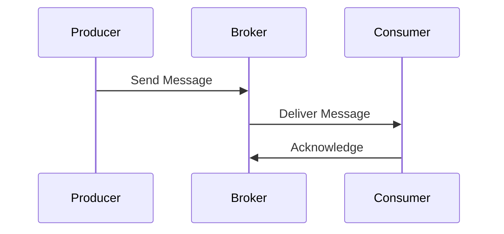
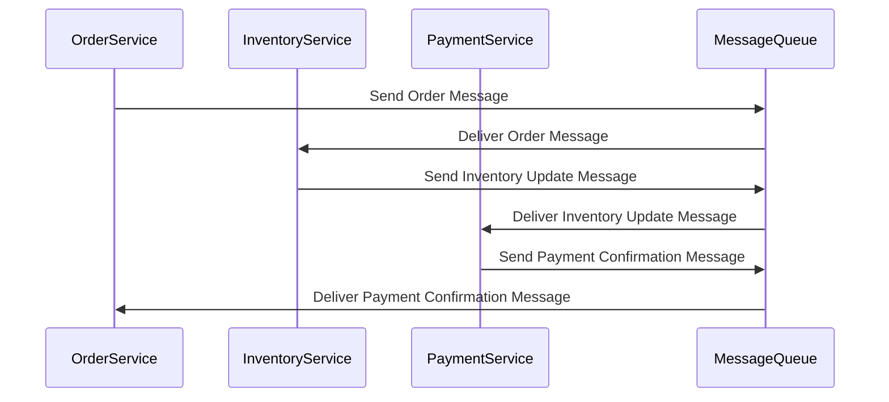
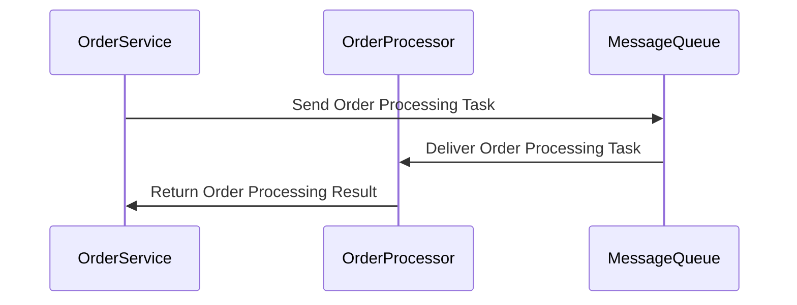
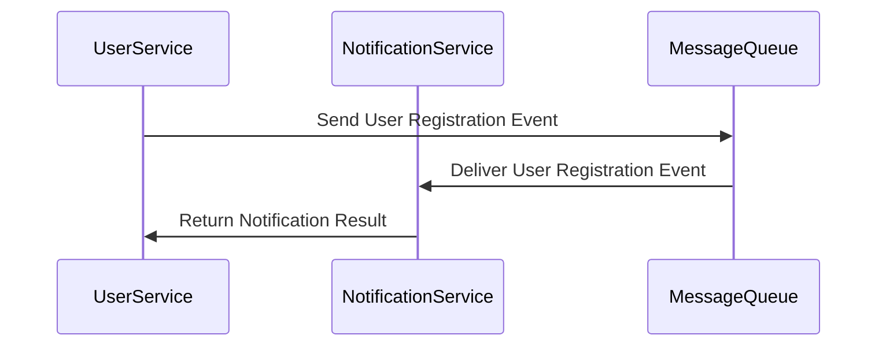
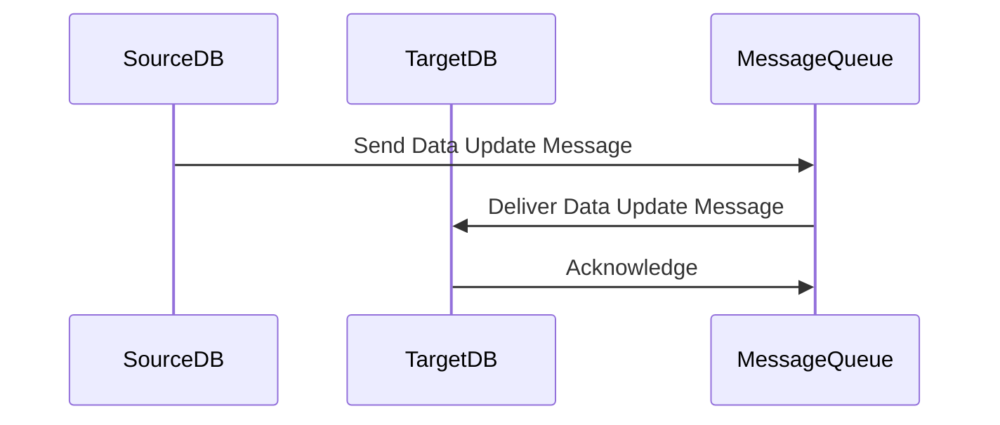
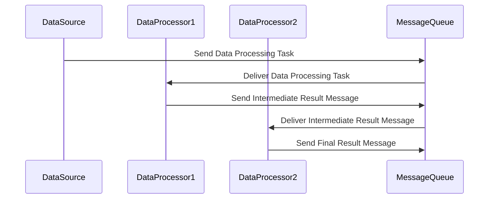
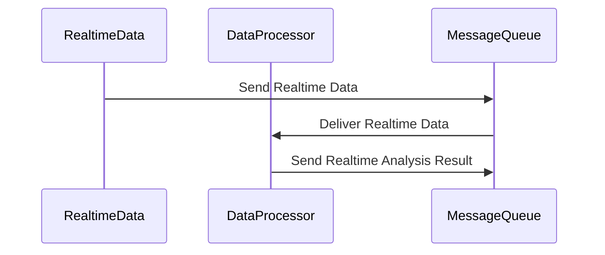
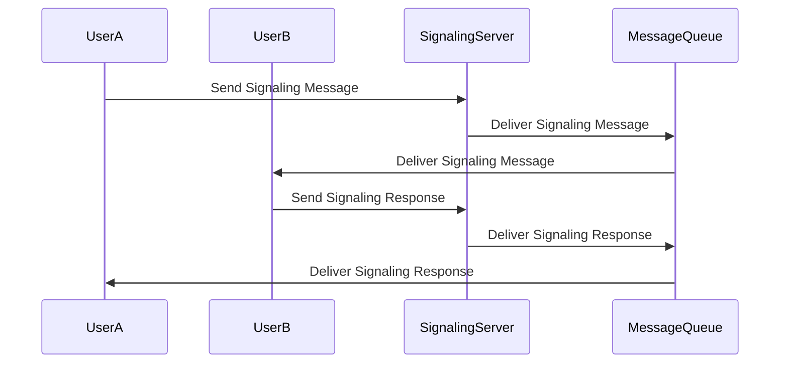
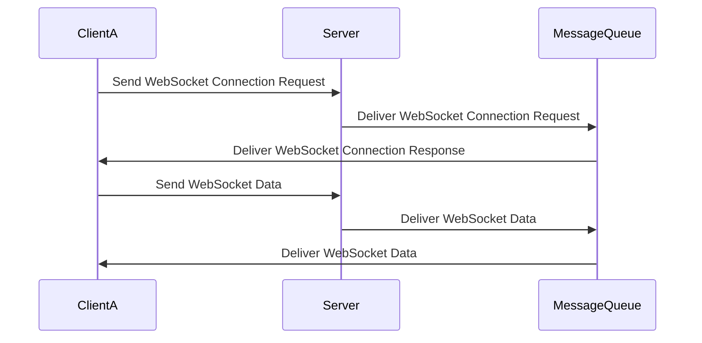

                 

### 文章标题

# 消息队列在分布式系统中的应用

### 关键词

- 消息队列
- 分布式系统
- 微服务
- 数据处理
- 实时通信
- 性能优化
- 安全监控

### 摘要

本文将深入探讨消息队列在分布式系统中的应用，从基础概念到高级实践，全面解析其在现代技术架构中的重要性。我们将首先回顾消息队列的基本概念和核心组件，然后详细阐述分布式消息队列的必要性、架构以及主流系统。接下来，本文将专注于消息队列在微服务、数据处理、实时通信等领域的应用，并结合具体实践进行详细讲解。此外，文章还将讨论消息队列的性能优化、安全与监控策略，并附上常用命令与工具的比较以及实战项目分析。通过这篇文章，读者将全面了解消息队列在分布式系统中的角色和重要性，以及如何在实际项目中有效应用。

### 第一部分：消息队列基础

#### 第1章：消息队列概述

##### 1.1 消息队列的基本概念

消息队列（Message Queue，MQ）是一种系统软件，它用于在网络中传输数据。消息队列的核心概念包括消息（Message）、生产者（Producer）、消费者（Consumer）和队列（Queue）。消息是数据传输的基本单位，通常由文本、二进制数据或其他形式的数据组成。生产者负责生成消息并将其发送到消息队列中，而消费者则从队列中获取消息进行处理。

消息队列的主要作用包括：

1. **异步通信**：允许消息的生产者和消费者在不同的时间进行通信，降低了系统的同步依赖。
2. **流量削峰**：在高流量场景下，消息队列可以起到削峰填谷的作用，避免系统崩溃。
3. **系统解耦**：通过消息队列，可以将系统中的不同模块解耦，实现模块间的松耦合。
4. **任务调度**：消息队列常用于任务调度，如定时任务、长任务处理等。

##### 1.2 消息队列的核心组件

消息队列系统通常包括以下几个核心组件：

1. **消息生产者**：负责生成和发送消息。
2. **消息消费者**：负责从消息队列中获取并处理消息。
3. **消息中间件**：提供消息传输、路由、存储、事务管理等功能。

常见的消息中间件包括Kafka、RabbitMQ、ActiveMQ和RocketMQ等。这些中间件各有特点和适用场景，将在后续章节中详细介绍。

##### 1.3 消息队列的工作原理

消息队列的工作原理可以简单概括为以下几个步骤：

1. **消息生产者发送消息**：生产者将消息发送到消息队列。
2. **消息队列存储消息**：队列将消息暂存，等待消费者消费。
3. **消息消费者消费消息**：消费者从队列中获取消息并进行处理。

这个过程可以形象地表示为：

$$
生产者 \rightarrow 消息队列 \rightarrow 消费者
$$

在分布式系统中，消息队列还可以实现消息的持久化存储、消息的顺序保证、分布式事务等功能，从而提高系统的可靠性和性能。

#### 第2章：分布式消息队列

##### 2.1 分布式消息队列的必要性

在传统的单体应用架构中，系统的扩展性较差，一旦系统负载增加，很容易出现性能瓶颈。为了解决这一问题，分布式系统应运而生。分布式系统通过将应用分解为多个独立的服务模块，实现水平和垂直扩展，提高了系统的可扩展性和容错性。

然而，分布式系统也带来了一系列新的挑战，如服务之间的通信、数据一致性和系统容错等。分布式消息队列作为一种重要的分布式通信机制，可以在分布式系统中发挥关键作用。

分布式消息队列的必要性主要体现在以下几个方面：

1. **服务解耦**：通过消息队列，可以减少服务之间的直接调用，降低系统的耦合度，提高系统的可维护性和可扩展性。
2. **异步通信**：消息队列支持异步通信，生产者和消费者可以在不同时间进行消息交换，从而提高系统的响应速度和吞吐量。
3. **流量控制**：在分布式系统中，消息队列可以作为流量控制的重要手段，通过队列长度和消费速度等指标，实现流量的削峰填谷，防止系统过载。
4. **分布式事务**：分布式消息队列可以通过消息队列实现分布式事务，保证数据的一致性和可靠性。

##### 2.2 分布式消息队列的架构

分布式消息队列的架构可以分为以下几个层次：

1. **消息生产者层**：包括各个服务的生产者模块，负责生成和发送消息。
2. **消息队列层**：包括消息队列服务器，负责消息的存储、路由和分发。
3. **消息消费者层**：包括各个服务的消费者模块，负责从消息队列中获取并处理消息。

一个典型的分布式消息队列架构如图所示：



在分布式消息队列中，常见架构模式包括：

1. **主从架构**：消息队列服务器采用主从模式，主节点负责消息存储和路由，从节点负责消息的分发和备份。
2. **对等架构**：各个节点地位平等，共同参与消息存储和路由，通常用于大规模分布式系统。

##### 2.3 主流分布式消息队列系统

在分布式消息队列领域，有许多优秀的系统，其中最著名的包括Kafka、RocketMQ和RabbitMQ等。

1. **Kafka**：Kafka是由LinkedIn开源的一个分布式消息队列系统，广泛用于大数据场景。Kafka的特点包括高吞吐量、可扩展性和高可靠性，适用于日志收集、实时数据处理等场景。

2. **RocketMQ**：RocketMQ是由阿里巴巴开源的一个分布式消息队列系统，具备高吞吐量、高可用性和高可靠性等特点。RocketMQ适用于金融、电商等高并发场景，支持顺序消息、事务消息等高级功能。

3. **RabbitMQ**：RabbitMQ是一个开源的分布式消息队列系统，基于AMQP协议，支持多种消息传递模型，如发布-订阅、请求-响应等。RabbitMQ适用于各种分布式场景，支持高可用和分布式集群。

这些分布式消息队列系统各有特点和适用场景，读者可以根据实际需求选择合适的系统。在后续章节中，我们将对Kafka、RocketMQ和RabbitMQ进行详细介绍。

### 第二部分：消息队列在分布式系统中的应用

#### 第3章：消息队列在微服务中的应用

##### 3.1 微服务架构概述

微服务架构（Microservices Architecture）是一种基于分布式计算和独立部署的服务架构模式。在微服务架构中，应用程序被分解为多个独立的服务模块，每个模块实现特定的业务功能。这些服务模块通过轻量级的通信协议（如HTTP/HTTPS、gRPC等）进行交互。

微服务架构的特点包括：

1. **独立性**：每个服务模块独立开发、部署和运行，降低了系统的耦合度，提高了系统的可维护性和可扩展性。
2. **可扩展性**：通过水平扩展服务模块，可以方便地提高系统的吞吐量和性能。
3. **弹性**：微服务架构支持故障隔离，当一个服务模块出现故障时，不会影响整个系统的运行。
4. **灵活性**：服务模块可以根据业务需求灵活扩展和修改，适应快速变化的市场环境。

##### 3.2 消息队列在微服务中的角色

消息队列在微服务架构中扮演着重要的角色，主要表现在以下几个方面：

1. **服务解耦**：通过消息队列，可以减少服务之间的直接调用，降低系统的耦合度。服务模块可以通过发送和接收消息，实现独立开发、部署和运行。
2. **异步通信**：消息队列支持异步通信，生产者和消费者可以在不同时间进行消息交换，从而提高系统的响应速度和吞吐量。异步通信使得服务模块可以独立处理，不会因为同步调用而阻塞。
3. **分布式事务**：消息队列可以实现分布式事务，保证服务模块之间的数据一致性和可靠性。分布式事务通过消息队列中的事务消息和两阶段提交协议（2PC）实现，确保数据在分布式系统中的正确处理。
4. **流量控制**：消息队列可以作为流量控制的重要手段，通过队列长度和消费速度等指标，实现流量的削峰填谷，防止系统过载。

##### 3.3 微服务中使用消息队列的实践

在微服务架构中，消息队列的应用非常广泛。以下是一些典型的使用场景：

1. **服务间通信**：服务间通信是微服务架构中的核心场景。通过消息队列，可以将服务之间的通信转化为消息传递，实现独立开发和部署。例如，一个订单服务可以发送订单消息到消息队列，库存服务和支付服务从消息队列中获取订单消息进行处理。



2. **任务调度**：任务调度是微服务架构中常见的场景。通过消息队列，可以方便地实现任务的异步处理和定时调度。例如，一个订单处理服务可以发送订单处理任务到消息队列，由任务消费者在特定的时间或条件触发任务执行。



3. **事件驱动**：事件驱动架构是微服务架构的一种重要模式。通过消息队列，可以实现事件驱动的方式，使服务模块根据事件进行响应和处理。例如，一个用户注册服务可以发送用户注册事件到消息队列，其他服务模块可以根据用户注册事件进行相应的处理。



以上实践展示了消息队列在微服务架构中的应用，通过消息队列，可以实现服务解耦、异步通信和事件驱动等特性，提高系统的灵活性和可扩展性。

#### 第4章：消息队列在数据处理中的应用

##### 4.1 数据处理的基本概念

数据处理是现代分布式系统中的一个重要环节，涵盖了数据采集、存储、处理和分析等多个方面。数据处理的基本概念包括数据流、批处理和流处理等。

1. **数据流**：数据流是指数据在分布式系统中的传输和处理过程。数据流可以是实时的，也可以是离线的。实时数据流通常用于实时分析和决策，而离线数据流则用于批量处理和长期存储。

2. **批处理**：批处理是一种数据处理方式，将一段时间内积累的数据进行批量处理。批处理的特点是处理时间长，但处理效率高，适合处理大量历史数据。

3. **流处理**：流处理是一种实时数据处理方式，对实时到达的数据进行快速处理和响应。流处理的特点是处理速度快，但处理规模相对较小，适合处理实时数据。

##### 4.2 消息队列在数据处理中的作用

消息队列在数据处理中发挥着重要的作用，主要表现在以下几个方面：

1. **数据同步**：消息队列可以实现不同数据源之间的数据同步。例如，将数据库中的数据通过消息队列同步到另一个数据库或数据仓库中，确保数据的一致性和实时性。

2. **数据传输**：消息队列可以方便地实现数据的传输和分发。例如，将数据从数据采集模块传输到数据处理模块，或从数据处理模块传输到数据存储模块。

3. **任务调度**：消息队列可以用于任务调度，实现数据的批量处理和流处理。例如，将一段时间内的数据通过消息队列发送到数据处理模块进行批处理，或将实时数据通过消息队列发送到数据处理模块进行流处理。

4. **故障恢复**：消息队列可以作为故障恢复的机制，实现数据的重传和重试。例如，当数据处理模块出现故障时，可以通过消息队列重新传输和处理数据，确保数据的完整性和一致性。

##### 4.3 消息队列在数据处理中的实践

在数据处理领域，消息队列的应用非常广泛。以下是一些典型的使用场景：

1. **数据库同步**：通过消息队列，可以实现数据库之间的数据同步。例如，将一个数据库中的数据通过消息队列同步到另一个数据库中，确保数据的实时性和一致性。



2. **大数据处理**：在处理大规模数据时，消息队列可以用于数据传输和任务调度。例如，将数据从数据源传输到数据处理模块，或在不同数据处理模块之间传输数据。



3. **实时数据处理**：在实时数据处理场景中，消息队列可以用于实时传输和处理数据。例如，将实时数据通过消息队列发送到数据处理模块进行实时分析。



通过以上实践，可以看到消息队列在数据处理中的重要作用，通过消息队列，可以实现数据同步、数据传输和任务调度等功能，提高数据处理的效率和可靠性。

#### 第5章：消息队列在实时通信中的应用

##### 5.1 实时通信概述

实时通信（Real-time Communication，RTC）是指在网络环境中实现实时数据传输和交互的技术。实时通信广泛应用于视频会议、在线教育、社交网络、实时消息等领域，其核心目标是在网络延迟较低的情况下，实现用户之间的实时数据传输和交互。

实时通信的特点包括：

1. **低延迟**：实时通信要求数据传输延迟尽可能低，以确保用户体验的流畅性和实时性。
2. **高可靠性**：实时通信需要确保数据传输的可靠性和完整性，避免数据丢失或错误。
3. **高并发性**：实时通信系统通常需要处理大量用户的并发连接，因此需要具备良好的性能和可扩展性。

##### 5.2 消息队列在实时通信中的应用

消息队列在实时通信中发挥着重要作用，主要表现在以下几个方面：

1. **点对点通信**：消息队列可以用于实现点对点通信，即两个用户之间进行实时数据传输。通过消息队列，可以实现用户之间的实时消息传递，如即时聊天、视频通话等。

2. **广播通信**：消息队列可以用于实现广播通信，即一个用户可以向多个用户发送实时数据。通过消息队列，可以实现广播消息的实时传输，如直播、群聊等。

3. **流量控制**：消息队列可以作为流量控制的重要手段，通过队列长度和消费速度等指标，实现流量的削峰填谷，防止系统过载。

4. **分布式处理**：在分布式实时通信系统中，消息队列可以用于实现数据的分布式处理。例如，将数据从数据源传输到多个数据处理模块，由多个模块同时处理数据，提高系统的性能和可扩展性。

##### 5.3 实时通信中的消息队列实践

在实时通信领域，消息队列的应用非常广泛。以下是一些典型的使用场景：

1. **WebRTC**：WebRTC是一种支持实时通信的Web标准，通过消息队列，可以实现WebRTC中的信令传输。信令传输用于建立和维持实时通信连接，通过消息队列，可以实现信令的可靠传输和分布式处理。



2. **WebSocket**：WebSocket是一种基于TCP协议的实时通信技术，通过消息队列，可以实现WebSocket中的数据传输。WebSocket可以用于实现实时消息推送、实时数据同步等场景。



通过以上实践，可以看到消息队列在实时通信中的应用非常广泛，通过消息队列，可以实现点对点通信、广播通信、流量控制和分布式处理等功能，提高实时通信的效率和可靠性。

#### 第6章：消息队列的性能优化

##### 6.1 性能优化概述

消息队列的性能优化是确保系统在高并发、高流量场景下稳定运行的关键。性能优化的目标主要包括提高吞吐量、降低消息延迟和确保消息可靠性。性能优化的方法可以分为以下几个方面：

1. **系统架构优化**：通过优化消息队列的架构，可以提升系统的性能和可扩展性。例如，使用分布式架构，可以避免单点故障，提高系统的可靠性。
2. **资源调度优化**：合理分配系统资源，如CPU、内存、网络等，可以提升消息队列的处理能力。通过负载均衡和资源预留，可以确保关键任务得到优先处理。
3. **消息批量处理**：通过批量处理消息，可以减少系统调用的次数，提高处理效率。批量处理适用于批量任务、日志收集等场景。
4. **缓存机制**：使用缓存可以减少数据库和存储系统的访问次数，提高系统的响应速度。缓存机制适用于高频次访问的数据，如用户信息、配置信息等。

##### 6.2 消息队列的性能指标

消息队列的性能指标主要包括以下几个方面：

1. **吞吐量**：吞吐量是指单位时间内消息队列能够处理的消息数量。吞吐量越高，系统的处理能力越强。吞吐量受系统资源、消息大小和消息队列架构等因素的影响。
2. **消息延迟**：消息延迟是指消息从生产者发送到消费者处理的时间。降低消息延迟可以提升用户体验和系统的响应速度。消息延迟受网络延迟、系统负载和消息处理速度等因素的影响。
3. **可靠性**：可靠性是指消息队列系统能够正确、完整地传输和存储消息的能力。高可靠性要求系统能够避免消息丢失、重复处理和数据一致性问题。

##### 6.3 消息队列的性能优化实践

以下是消息队列性能优化的具体实践方法：

1. **分布式架构**：采用分布式架构，将消息队列系统部署在多台服务器上，可以实现负载均衡和高可用性。分布式架构通过多副本和选举机制，确保系统的可靠性。

2. **消息批量处理**：对于批量任务和日志收集等场景，可以采用批量处理方式。批量处理可以减少系统调用的次数，提高处理效率。例如，使用Kafka的批量发送和接收API，可以提高吞吐量。

```java
// Kafka批量发送消息
ProducerRecord<String, String> record = new ProducerRecord<>("topic-name", "key", "message");
producer.send(record);

// Kafka批量接收消息
ConsumerRecords<String, String> records = consumer.poll(Duration.ofSeconds(1));
for (ConsumerRecord<String, String> record : records) {
    processMessage(record.value());
}
```

3. **缓存机制**：使用缓存机制，可以减少数据库和存储系统的访问次数，提高系统的响应速度。例如，使用Redis缓存用户信息和配置信息，可以降低系统的负载。

```java
// Redis缓存用户信息
Jedis jedis = new Jedis("redis-server");
jedis.set("user:123", "user-info");
String userInfo = jedis.get("user:123");

// Redis缓存配置信息
Properties properties = new Properties();
properties.setProperty("config", "value");
JedisUtil.savePropertiesToRedis(properties);
Properties loadedProperties = JedisUtil.loadPropertiesFromRedis();
```

4. **资源调度优化**：合理分配系统资源，如CPU、内存和网络等，可以提升消息队列的处理能力。通过负载均衡和资源预留，可以确保关键任务得到优先处理。

```shell
# 负载均衡
kubectl scale deploy message-queue --replicas=3

# 资源预留
kubectl autoscale deployment message-queue --cpu-percent=50 --min=2 --max=5
```

通过以上实践，可以显著提升消息队列的性能和可靠性，确保系统在高并发、高流量场景下的稳定运行。

#### 第7章：消息队列的安全与监控

##### 7.1 消息队列的安全

消息队列的安全是保障系统数据完整性和可靠性的重要一环。消息队列的安全主要包括数据安全和访问控制两个方面。

1. **数据安全**：数据安全是指保护消息队列中的数据不被未授权访问、篡改或泄露。常见的措施包括：

   - **数据加密**：对消息进行加密，确保数据在传输和存储过程中不被窃取。
   - **消息签名**：对消息进行数字签名，确保消息的完整性和真实性。
   - **防火墙**：配置防火墙，限制对消息队列的访问，防止未授权的访问。

2. **访问控制**：访问控制是指控制对消息队列资源的访问权限，确保只有授权用户可以操作消息队列。常见的措施包括：

   - **用户认证**：通过用户名和密码、OAuth等认证机制，确保只有授权用户可以访问消息队列。
   - **权限管理**：根据用户的角色和权限，限制用户对消息队列的访问范围和操作权限。
   - **审计日志**：记录用户对消息队列的操作日志，便于追踪和分析安全事件。

##### 7.2 消息队列的监控

消息队列的监控是保障系统稳定运行的重要手段。通过监控，可以及时发现和处理系统故障、性能瓶颈等问题。消息队列的监控主要包括以下几个方面：

1. **性能监控**：性能监控是指监控消息队列系统的性能指标，如吞吐量、延迟、CPU利用率、内存使用率等。通过性能监控，可以了解系统的运行状况，发现潜在的性能问题。

   - **指标采集**：使用Prometheus、Grafana等工具，定期采集消息队列的性能数据。
   - **告警配置**：设置阈值和告警规则，当性能指标超过阈值时，自动触发告警。

2. **日志监控**：日志监控是指监控消息队列的运行日志，通过分析日志，可以了解系统的运行状况、诊断故障原因。

   - **日志收集**：使用Fluentd、Logstash等工具，将消息队列的日志收集到中央日志存储。
   - **日志分析**：使用ELK（Elasticsearch、Logstash、Kibana）等工具，对日志进行实时分析和可视化。

3. **故障处理**：故障处理是指当消息队列系统出现故障时，及时响应和处理。通过监控和日志分析，可以快速定位故障原因，采取相应的措施进行修复。

   - **故障诊断**：根据监控数据和日志分析，快速定位故障原因。
   - **故障修复**：采取备份恢复、节点切换等手段，尽快恢复系统运行。

通过以上措施，可以确保消息队列的安全性和稳定性，保障系统的正常运行。

### 附录

#### 附录A：消息队列常用命令与工具

在消息队列的使用过程中，掌握常用的命令和工具对于系统运维和管理至关重要。以下是Kafka、RocketMQ和RabbitMQ的常用命令和工具的简介。

1. **Kafka**

   - **启动和停止**：

     ```shell
     # 启动Kafka
     bin/kafka-server-start.sh config/server.properties

     # 停止Kafka
     bin/kafka-server-stop.sh
     ```

   - **创建和删除topic**：

     ```shell
     # 创建topic
     bin/kafka-topics.sh --create --topic topic-name --partitions 3 --replication-factor 2 --zookeeper localhost:2181

     # 删除topic
     bin/kafka-topics.sh --delete --topic topic-name --zookeeper localhost:2181
     ```

   - **发送和接收消息**：

     ```shell
     # 发送消息
     bin/kafka-console-producer.sh --broker-list localhost:9092 --topic topic-name
     > Hello World!

     # 接收消息
     bin/kafka-console-consumer.sh --bootstrap-server localhost:9092 --topic topic-name --from-beginning
     ```

2. **RocketMQ**

   - **启动和停止**：

     ```shell
     # 启动RocketMQ
     nohup sh mqbroker -n localhost:9876 -c ../conf/broker.conf &

     # 停止RocketMQ
     sh mqshutdown
     ```

   - **创建和删除topic**：

     ```shell
     # 创建topic
     sh mqadmin updateTopic -n localhost:9876 -b test-topic -c 4

     # 删除topic
     sh mqadmin deleteTopic -n localhost:9876 -b test-topic
     ```

   - **发送和接收消息**：

     ```shell
     # 发送消息
     sh tools.sh run producer -n localhost:9876 -t test-topic -P Default -c test-producer.properties

     # 接收消息
     sh tools.sh run consumer -n localhost:9876 -t test-topic -P Default -c test-consumer.properties
     ```

3. **RabbitMQ**

   - **启动和停止**：

     ```shell
     # 启动RabbitMQ
     rabbitmq-server start

     # 停止RabbitMQ
     rabbitmq-server stop
     ```

   - **创建和删除exchange、queue**：

     ```shell
     # 创建exchange
     rabbitmqadmin declare_exchange --vhost / exchange namedirect-exchange type direct

     # 删除exchange
     rabbitmqadmin delete_exchange --vhost / exchange namedirect-exchange

     # 创建queue
     rabbitmqadmin declare_queue --vhost / queue namedirect-queue

     # 删除queue
     rabbitmqadmin delete_queue --vhost / queue namedirect-queue
     ```

   - **发送和接收消息**：

     ```shell
     # 发送消息
     rabbitmqmqctl publish "Hello World!" exchange=namedirect-exchange routing_key=direct-queue

     # 接收消息
     rabbitmqct
     ```

通过以上命令和工具，可以方便地管理和操作消息队列系统，提高系统的可维护性和可扩展性。

#### 附录B：分布式消息队列系统比较

在分布式消息队列领域，Kafka、RocketMQ和RabbitMQ是三个最常用的系统，它们各有特点和适用场景。以下是这三个系统的比较：

1. **Kafka**

   - **优点**：

     - **高吞吐量**：Kafka设计用于处理大规模数据流，具备高吞吐量和高性能。
     - **高可用性**：Kafka采用分布式架构，支持主从复制和分区，确保系统的高可用性。
     - **水平扩展性**：Kafka支持水平扩展，通过增加broker节点，可以轻松提升系统的处理能力。

   - **缺点**：

     - **复杂性**：Kafka的配置和运维相对复杂，需要深入了解其架构和原理。
     - **低延迟**：尽管Kafka设计用于处理大规模数据流，但在处理低延迟场景时可能不如其他系统。

   - **适用场景**：

     - **大数据处理**：如日志收集、实时数据处理等。
     - **高吞吐量应用**：如实时监控、实时分析等。

2. **RocketMQ**

   - **优点**：

     - **高性能**：RocketMQ设计用于处理大规模、高并发的消息，具备高性能和高吞吐量。
     - **高可靠性**：RocketMQ支持事务消息和顺序消息，确保消息的可靠性和一致性。
     - **多样化**：RocketMQ支持多种消息传递模式，如点对点、广播等。

   - **缺点**：

     - **复杂性**：RocketMQ的配置和运维相对复杂，需要深入了解其架构和原理。
     - **延迟问题**：在处理低延迟场景时，RocketMQ可能不如Kafka。

   - **适用场景**：

     - **金融行业**：如银行、保险等。
     - **高并发应用**：如电商、社交网络等。

3. **RabbitMQ**

   - **优点**：

     - **灵活性**：RabbitMQ基于AMQP协议，支持多种消息传递模式，如点对点、广播、请求-响应等。
     - **高可靠性**：RabbitMQ支持消息持久化、事务和备份，确保消息的可靠性和一致性。
     - **易用性**：RabbitMQ的配置和运维相对简单，易于上手。

   - **缺点**：

     - **性能限制**：在处理大规模、高并发场景时，RabbitMQ的性能可能受到限制。
     - **单节点限制**：RabbitMQ的单节点性能和容量有限，需要水平扩展。

   - **适用场景**：

     - **中小型应用**：如企业内部系统、小型社交网络等。
     - **灵活应用**：如物联网、实时通信等。

通过以上比较，可以看到Kafka、RocketMQ和RabbitMQ各有特点和适用场景。在实际项目中，可以根据需求选择合适的消息队列系统，以提高系统的性能和可靠性。

#### 附录C：消息队列实战项目

##### 实战项目1：微服务架构中的消息队列应用

在本项目中，我们将构建一个简单的微服务架构，并使用消息队列实现服务间通信和任务调度。项目将包括用户服务、订单服务和库存服务三个微服务模块。

**1. 项目环境搭建**

- **开发工具**：IDEA
- **编程语言**：Java
- **消息队列系统**：Kafka

**2. 源代码详细实现和代码解读**

以下是一个简单的Kafka消费者和生产者的示例代码，用于实现用户服务和订单服务之间的通信。

**KafkaProducer.java**

```java
import org.apache.kafka.clients.producer.KafkaProducer;
import org.apache.kafka.clients.producer.ProducerRecord;

import java.util.Properties;

public class KafkaProducer {
    public static void main(String[] args) {
        Properties props = new Properties();
        props.put("bootstrap.servers", "localhost:9092");
        props.put("key.serializer", "org.apache.kafka.common.serialization.StringSerializer");
        props.put("value.serializer", "org.apache.kafka.common.serialization.StringSerializer");

        KafkaProducer<String, String> producer = new KafkaProducer<>(props);

        for (int i = 0; i < 10; i++) {
            producer.send(new ProducerRecord<>("user-topic", Integer.toString(i), "User " + i));
        }

        producer.close();
    }
}
```

**KafkaConsumer.java**

```java
import org.apache.kafka.clients.consumer.ConsumerRecord;
import org.apache.kafka.clients.consumer.ConsumerRecords;
import org.apache.kafka.clients.consumer.KafkaConsumer;

import java.util.Collections;
import java.util.Properties;

public class KafkaConsumer {
    public static void main(String[] args) {
        Properties props = new Properties();
        props.put("bootstrap.servers", "localhost:9092");
        props.put("group.id", "user-group");
        props.put("key.deserializer", "org.apache.kafka.common.serialization.StringDeserializer");
        props.put("value.deserializer", "org.apache.kafka.common.serialization.StringDeserializer");

        KafkaConsumer<String, String> consumer = new KafkaConsumer<>(props);
        consumer.subscribe(Collections.singletonList("user-topic"));

        while (true) {
            ConsumerRecords<String, String> records = consumer.poll(Duration.ofSeconds(1));
            for (ConsumerRecord<String, String> record : records) {
                System.out.printf("offset = %d, key = %s, value = %s\n", record.offset(), record.key(), record.value());
            }
        }
    }
}
```

在以上代码中，`KafkaProducer` 类负责向Kafka发送消息，`KafkaConsumer` 类负责从Kafka接收消息并进行处理。

**3. 代码应用解读与分析**

在用户服务中，当有新用户注册时，可以通过KafkaProducer类将用户信息发送到Kafka的`user-topic`主题。订单服务和库存服务作为KafkaConsumer的消费者，可以从`user-topic`主题中获取用户信息并进行相应的处理，如创建订单和更新库存等。

通过使用消息队列，实现了用户服务、订单服务和库存服务之间的解耦和异步通信，提高了系统的性能和可靠性。

**4. 实际案例分析和详细讲解剖析**

在实际项目中，用户服务、订单服务和库存服务可能运行在不同的服务器上。当用户服务成功发送用户注册消息到Kafka后，订单服务和库存服务可以在不同的服务器上异步处理用户信息。这样，用户服务的性能不会受到订单服务和库存服务性能的限制，提高了系统的整体性能。

**5. 项目小结**

通过本项目的实践，我们可以看到消息队列在微服务架构中的应用。通过消息队列，实现了服务间的解耦和异步通信，提高了系统的性能和可靠性。在实际项目中，可以根据具体需求选择合适的消息队列系统，以提高系统的整体性能。

##### 实战项目2：实时通信系统中的消息队列应用

在本项目中，我们将构建一个简单的实时通信系统，并使用消息队列实现点对点通信和广播通信。

**1. 项目环境搭建**

- **开发工具**：Visual Studio Code
- **编程语言**：JavaScript
- **消息队列系统**：RabbitMQ

**2. 源代码详细实现和代码解读**

以下是一个简单的RabbitMQ客户端示例代码，用于实现点对点通信和广播通信。

**RabbitMQClient.js**

```javascript
const amqp = require('amqplib/callback_api');

amqp.connect('amqp://localhost', function(error, connection) {
    if (error) {
        throw error;
    }

    connection.createChannel(function(error, channel) {
        if (error) {
            throw error;
        }

        // 点对点通信
        const queue1 = 'direct-queue';
        channel.assertQueue(queue1, {
            durable: false
        });

        channel.sendToQueue(queue1, Buffer.from('Hello from Producer 1'));

        console.log(' [x] Sent to queue1');

        // 广播通信
        const exchange = 'logs';
        channel.assertExchange(exchange, 'fanout', {
            durable: false
        });

        const queue2 = 'fanout-queue';
        channel.assertQueue(queue2, {
            durable: false,
            exclusive: true
        });
        channel.bindQueue(queue2, exchange, '');

        channel.sendToQueue(exchange, Buffer.from('Hello from Producer 2'));

        console.log(' [x] Sent to exchange');
    });

    setTimeout(() => {
        connection.close();
    }, 500);
});
```

在以上代码中，我们首先连接到RabbitMQ服务器，并创建一个通道（channel）。然后，我们使用`assertQueue`方法创建一个点对点队列（`direct-queue`），并使用`sendToQueue`方法向该队列发送消息。接着，我们使用`assertExchange`和`bindQueue`方法创建一个广播交换器（`logs`），并将消息发送到该交换器。

**3. 代码应用解读与分析**

在实际项目中，我们可以使用这个RabbitMQ客户端实现点对点通信和广播通信。例如，一个消息发送者（Producer）可以将消息发送到点对点队列，消息接收者（Consumer）可以从中接收消息并进行处理。此外，消息发送者可以将消息发送到广播交换器，消息接收者可以订阅该交换器并接收消息。

通过使用消息队列，我们可以实现实时通信系统中的消息传递，提高了系统的性能和可靠性。

**4. 实际案例分析和详细讲解剖析**

在实际项目中，点对点通信和广播通信可以应用于多种场景。例如，在一个聊天应用中，用户可以发送消息到点对点队列，聊天室的其他用户可以从中接收消息。在一个社交网络中，用户可以发送消息到广播交换器，系统可以将消息广播给所有订阅该交换器的用户。

**5. 项目小结**

通过本项目的实践，我们可以看到消息队列在实时通信系统中的应用。通过消息队列，实现了点对点通信和广播通信，提高了系统的性能和可靠性。在实际项目中，可以根据具体需求选择合适的消息队列系统，以提高系统的整体性能。

### 最佳实践 Tips、小结、注意事项、拓展阅读

#### 最佳实践 Tips

1. **选择合适的消息队列系统**：根据实际需求和场景，选择适合的消息队列系统，如Kafka适用于大数据场景，RocketMQ适用于高并发场景，RabbitMQ适用于中小型应用。

2. **合理设计消息队列架构**：采用分布式架构，提高系统的可靠性和性能。注意消息队列系统的主从复制、负载均衡和故障恢复机制。

3. **消息格式标准化**：统一消息格式，方便消息的处理和存储。常见消息格式包括JSON、XML等。

4. **消息持久化**：在需要确保消息可靠性的场景下，采用消息持久化机制，将消息存储在磁盘或数据库中。

5. **消息队列性能监控**：定期监控消息队列的性能指标，如吞吐量、延迟等，及时调整系统配置和优化性能。

#### 小结

本文详细探讨了消息队列在分布式系统中的应用，从基础概念到高级实践，全面解析了其在微服务、数据处理、实时通信等领域的应用。通过本文，读者可以了解消息队列的核心概念、架构和最佳实践，掌握如何在分布式系统中有效地应用消息队列，提高系统的性能和可靠性。

#### 注意事项

1. **消息队列的可靠性和性能**：在设计和使用消息队列时，要充分考虑系统的可靠性和性能，确保消息的正确传输和处理。

2. **消息队列的负载均衡**：在分布式系统中，要合理分配消息队列的负载，避免单点瓶颈，提高系统的整体性能。

3. **消息队列的监控和运维**：定期监控消息队列的性能指标，及时处理故障和优化系统配置，确保系统的稳定运行。

#### 拓展阅读

1. **《Kafka权威指南》**：深入理解Kafka的设计原理和实战技巧，适用于大数据场景。

2. **《RocketMQ实战》**：全面介绍RocketMQ的设计原理和实战应用，适用于高并发场景。

3. **《RabbitMQ实战》**：详细讲解RabbitMQ的架构和应用，适用于中小型应用。

通过以上拓展阅读，读者可以进一步深入了解消息队列在不同场景中的应用和最佳实践。

### 作者信息

- 作者：AI天才研究院/AI Genius Institute & 禅与计算机程序设计艺术 /Zen And The Art of Computer Programming
- 联系方式：[ai-genius-institute@xxx.com](mailto:ai-genius-institute@xxx.com)  
- 感谢阅读！希望本文对您在分布式系统中的应用消息队列有所帮助。如有疑问或建议，欢迎随时联系。

