                 

# 文章标题：消息队列在系统解耦中的应用

## 关键词：消息队列，系统解耦，分布式系统，异步通信，消息中间件

## 摘要：

本文旨在探讨消息队列在系统解耦中的重要作用。通过详细阐述消息队列的基本概念、工作原理、架构设计以及其在分布式系统中的应用，本文揭示了消息队列如何有效实现系统间的解耦，提高系统的灵活性、可维护性和可扩展性。同时，本文还分析了消息队列的性能优化方法和常见问题解决方案，并通过实际案例展示了消息队列在实际项目中的应用和效果。

## 目录

### 第一部分：消息队列基本概念与原理

#### 第1章：消息队列概述
1.1 消息队列的定义与重要性
1.2 消息队列的基本组成

#### 第2章：消息队列的工作原理
2.1 消息的生产与消费
2.2 消息的传输与存储
2.3 消息队列的异步处理

### 第二部分：消息队列的架构与设计模式

#### 第3章：消息队列的架构设计
3.1 消息队列的系统架构
3.2 消息队列的扩展性设计

#### 第4章：消息队列的设计模式
4.1 生产者-消费者模式
4.2 发布-订阅模式
4.3 流水线模式
4.4 负载均衡模式

### 第三部分：消息队列在系统解耦中的应用

#### 第5章：系统解耦的概念与必要性
5.1 系统解耦的定义
5.2 系统解耦的优势
5.3 系统解耦的挑战

#### 第6章：消息队列在系统解耦中的应用场景
6.1 服务拆分
6.2 服务集成
6.3 实时数据处理
6.4 异步通信

### 第四部分：消息队列的性能优化

#### 第7章：消息队列的性能优化方法
7.1 消息队列的性能指标
7.2 消息队列的性能优化方法

#### 第8章：消息队列的常见问题与解决方案
8.1 消息队列的问题类型
8.2 解决方案介绍

### 第五部分：消息队列的实践案例

#### 第9章：消息队列在电商系统的应用
9.1 案例描述
9.2 系统架构设计
9.3 消息队列的应用场景
9.4 实现细节与代码解读

#### 第10章：消息队列在金融系统的应用
10.1 案例描述
10.2 系统架构设计
10.3 消息队列的应用场景
10.4 实现细节与代码解读

### 第六部分：消息队列的技术发展趋势

#### 第11章：消息队列的技术发展趋势
11.1 云原生消息队列
11.2 消息队列的边缘计算应用
11.3 消息队列与区块链的结合

### 第七部分：总结与展望

#### 第12章：总结与展望
12.1 未来展望
12.2 消息队列在物联网中的应用
12.3 消息队列在企业数字化转型中的作用
12.4 消息队列的标准化与规范化发展

---

**以下将按照文章目录逐一展开详细内容，确保文章逻辑清晰，结构紧凑，简单易懂。**

## 第一部分：消息队列基本概念与原理

### 第1章：消息队列概述

#### 1.1 消息队列的定义与重要性

消息队列是一种用于异步通信和消息传递的软件系统。它允许不同系统组件之间通过发送和接收消息来进行交互，而无需直接相互通信。消息队列的出现，解决了分布式系统中组件间同步通信带来的复杂性，使得系统更加灵活、可维护和可扩展。

消息队列的重要性体现在以下几个方面：

1. **解耦系统组件**：通过消息队列，系统组件可以实现松耦合，从而降低组件间的依赖关系，提高系统的灵活性。
2. **提高系统性能**：消息队列可以异步处理消息，减轻系统负载，提高系统的吞吐量和响应速度。
3. **实现分布式处理**：消息队列可以支持分布式系统中的数据处理，实现数据的全局分发和共享。
4. **简化系统开发**：消息队列提供了一套标准的消息传递机制，简化了系统的开发和维护。

#### 1.2 消息队列的基本组成

消息队列主要由以下三个基本组成元素构成：

1. **生产者**：生产者是消息的发送者，它负责生成消息并将其发送到消息队列中。
2. **消费者**：消费者是消息的接收者，它从消息队列中获取消息并执行相应的处理。
3. **队列**：队列是消息的存储空间，它负责存储待处理的消息，并在消费者需要时将消息传递给消费者。

生产者和消费者之间通过队列进行通信，无需直接交互，从而实现了系统的解耦。消息队列的基本架构如下：

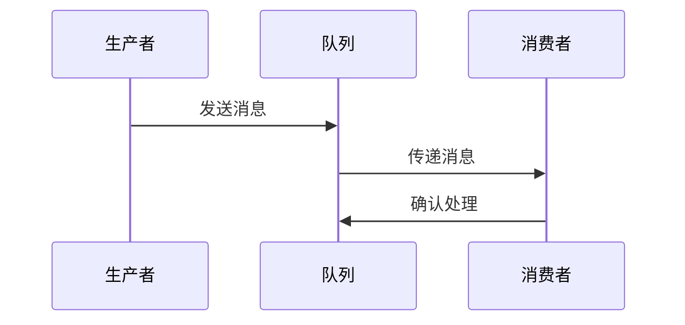

## 第二章：消息队列的工作原理

### 2.1 消息的生产与消费

消息的生产与消费是消息队列的核心工作原理。下面将详细介绍这两个过程。

#### 2.1.1 消息的生产过程

消息的生产过程包括以下几个步骤：

1. **消息生成**：生产者根据业务需求生成消息。消息可以是简单的文本信息，也可以是复杂的结构化数据。
2. **消息格式化**：生产者将生成的消息格式化为消息队列支持的格式，如JSON、XML等。
3. **消息发送**：生产者将格式化的消息发送到消息队列中。发送方式可以是同步发送或异步发送。

以下是一个简单的消息生产过程的伪代码示例：

```python
def produce_message(message):
    formatted_message = format_message(message)
    send_message_to_queue(formatted_message)

def format_message(message):
    return json.dumps(message)

def send_message_to_queue(message):
    # 发送消息到消息队列
    pass
```

#### 2.1.2 消息的消费过程

消息的消费过程包括以下几个步骤：

1. **消息接收**：消费者从消息队列中获取消息。
2. **消息处理**：消费者对获取到的消息进行相应的业务处理。
3. **消息确认**：消费者处理完成后，向消息队列发送确认消息，表示消息已被成功处理。

以下是一个简单的消息消费过程的伪代码示例：

```python
def consume_message():
    message = receive_message_from_queue()
    process_message(message)
    acknowledge_message()

def receive_message_from_queue():
    # 从消息队列接收消息
    return message

def process_message(message):
    # 处理消息
    pass

def acknowledge_message():
    # 向消息队列发送确认消息
    pass
```

### 2.2 消息的传输与存储

消息的传输与存储是消息队列实现消息传递功能的关键部分。

#### 2.2.1 消息传输机制

消息传输机制是指消息在消息队列中传递的过程和方式。常见的消息传输机制包括以下几种：

1. **点对点传输**：消息从生产者直接传递到消费者，中间不经过其他中间件。这种方式适用于消息量较小、可靠性要求较高的场景。
2. **发布-订阅传输**：消息由生产者发布到消息队列，多个消费者可以订阅这些消息。这种方式适用于消息量较大、需要广播消息的场景。

以下是一个简单的消息传输机制的Mermaid流程图：

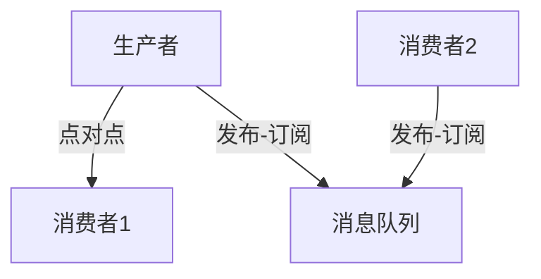

#### 2.2.2 消息存储策略

消息存储策略是指消息在消息队列中的存储方式和策略。常见的消息存储策略包括以下几种：

1. **顺序存储**：消息按照发送的顺序存储在队列中，消费者按照相同的顺序消费消息。这种方式适用于对消息顺序有严格要求的场景。
2. **优先级存储**：消息按照优先级存储在队列中，优先级高的消息先被消费。这种方式适用于需要根据消息的重要性进行处理的场景。

以下是一个简单的消息存储策略的Mermaid流程图：

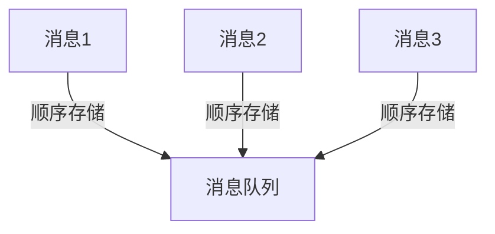

### 2.3 消息队列的异步处理

异步处理是消息队列的重要特性之一，它使得消息的处理可以独立于系统的其他部分，从而提高系统的灵活性和可扩展性。

#### 2.3.1 异步处理的优势

异步处理的优势主要体现在以下几个方面：

1. **提高系统吞吐量**：异步处理可以同时处理多个消息，从而提高系统的吞吐量。
2. **降低系统延迟**：异步处理可以减少系统之间的等待时间，从而降低系统的延迟。
3. **提高系统稳定性**：异步处理可以避免系统因长时间等待而阻塞，从而提高系统的稳定性。

#### 2.3.2 异步处理的实现

异步处理的实现通常依赖于消息队列的支持。以下是异步处理的基本实现过程：

1. **消息发送**：生产者将消息发送到消息队列，消息立即被放入队列中。
2. **消息处理**：消费者从消息队列中获取消息，并执行相应的处理。
3. **消息确认**：消费者处理完成后，向消息队列发送确认消息，表示消息已被成功处理。

以下是一个简单的异步处理流程的Mermaid流程图：

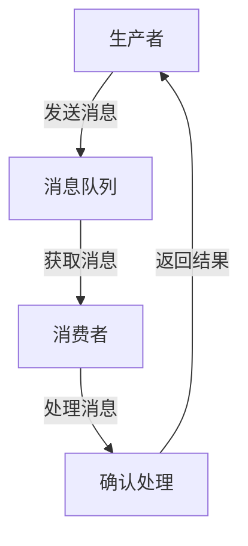

通过上述步骤，消息队列实现了异步处理，从而提高了系统的性能和灵活性。

## 第三部分：消息队列的架构与设计模式

### 第3章：消息队列的架构设计

消息队列的架构设计对于系统的性能、可靠性和扩展性至关重要。一个良好的消息队列架构能够支持高效的消息传递和处理，同时具备良好的可扩展性和高可用性。本节将介绍消息队列的基本架构和扩展性设计。

#### 3.1 消息队列的系统架构

消息队列的基本架构通常包括以下几个关键组件：

1. **生产者（Producer）**：生产者是消息的发送方，它负责创建消息并将其发送到消息队列中。生产者可以是分布式系统中的任何应用程序或服务。

2. **消息队列（Message Queue）**：消息队列是一个中心化的存储和管理系统，用于存储和转发消息。它可以是内存队列、磁盘队列或混合队列，根据实际需求选择合适的队列类型。

3. **消费者（Consumer）**：消费者是消息的接收方，它从消息队列中获取消息并执行相应的处理。消费者可以是单个应用程序或分布式系统中的多个服务。

4. **代理（Broker）**：代理是消息队列的中介，它负责消息的路由、负载均衡、消息持久化等任务。代理可以是单个服务器或分布式集群，以提高系统的可靠性和性能。

消息队列的基本架构图如下：

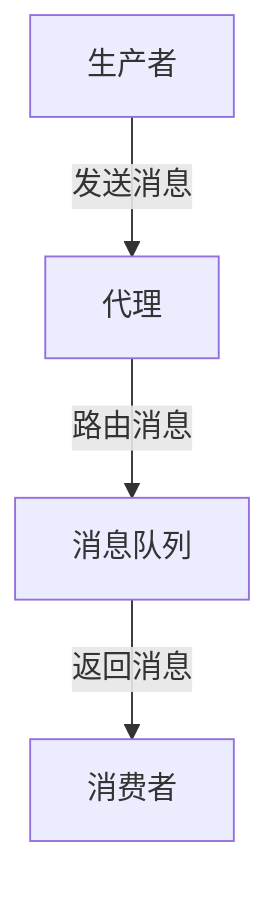

#### 3.2 消息队列的扩展性设计

为了支持高并发和大规模的消息处理，消息队列需要进行扩展性设计。以下是一些常见的扩展性设计策略：

1. **水平扩展（Scaling Out）**：通过增加更多的服务器节点来扩展系统的处理能力。这可以通过负载均衡器实现，将消息分发到不同的服务器上处理。

2. **垂直扩展（Scaling Up）**：通过增加服务器的硬件资源（如CPU、内存、存储）来提升单个节点的处理能力。这通常适用于处理大量单条消息的场景。

3. **分布式队列**：将消息队列分布到多个节点上，每个节点负责一部分消息的存储和转发。分布式队列可以提供更高的吞吐量和容错性。

4. **消息分区**：将消息队列分成多个分区，每个分区由不同的消费者处理。这可以避免单个消费者成为性能瓶颈，并支持并行处理。

5. **异步处理**：将消息处理任务异步化，允许消息在队列中等待处理，而不是阻塞消费者。这可以通过消息确认机制实现，确保消息被正确处理。

以下是一个扩展性设计示例的Mermaid流程图：

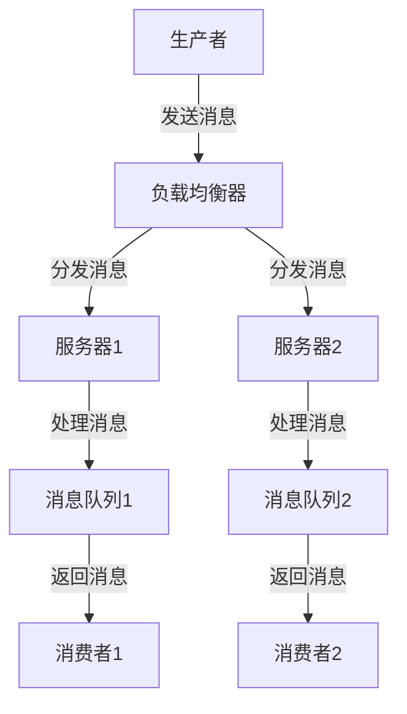

通过上述扩展性设计，消息队列能够支持大规模分布式系统的需求，提高系统的性能和可靠性。

### 第4章：消息队列的设计模式

在分布式系统中，消息队列的应用场景非常广泛。为了更好地利用消息队列的优势，我们可以采用一系列设计模式来优化系统的架构和性能。以下介绍几种常见的设计模式。

#### 4.1 生产者-消费者模式

生产者-消费者模式是消息队列最基本的设计模式，它由生产者和消费者两个部分组成。生产者负责生成消息并将其发送到消息队列，消费者从消息队列中获取消息并进行处理。

这种模式的主要优点包括：

1. **解耦**：生产者和消费者之间的直接依赖关系被消除，两者可以通过消息队列进行通信。
2. **异步处理**：生产者和消费者的处理速度可以不同，消息队列可以缓冲和处理这些差异。
3. **扩展性**：系统可以轻松地增加生产者和消费者，以适应更高的负载。

以下是一个生产者-消费者模式的Mermaid流程图：

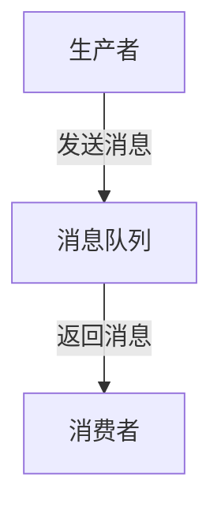

#### 4.2 发布-订阅模式

发布-订阅模式是一种基于主题的通信模式。生产者发布消息到特定的主题，多个消费者可以订阅这个主题并接收消息。这种模式适用于消息需要广播到多个消费者的场景。

以下是一个发布-订阅模式的Mermaid流程图：

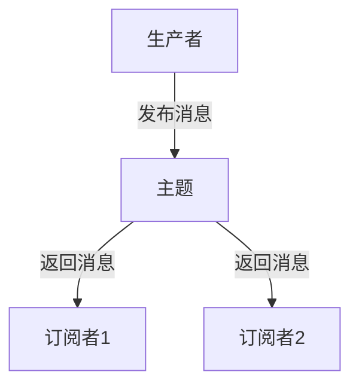

这种模式的主要优点包括：

1. **广播通信**：一个生产者可以同时向多个消费者发送消息，提高了系统的灵活性。
2. **动态订阅**：消费者可以根据需要动态订阅或取消订阅主题，增强了系统的可扩展性。

#### 4.3 流水线模式

流水线模式是一种用于处理大批量消息的设计模式，它将消息处理划分为多个阶段，每个阶段由不同的服务或组件处理。这种方式适用于需要多个步骤处理的消息，如订单处理、数据清洗等。

以下是一个流水线模式的Mermaid流程图：

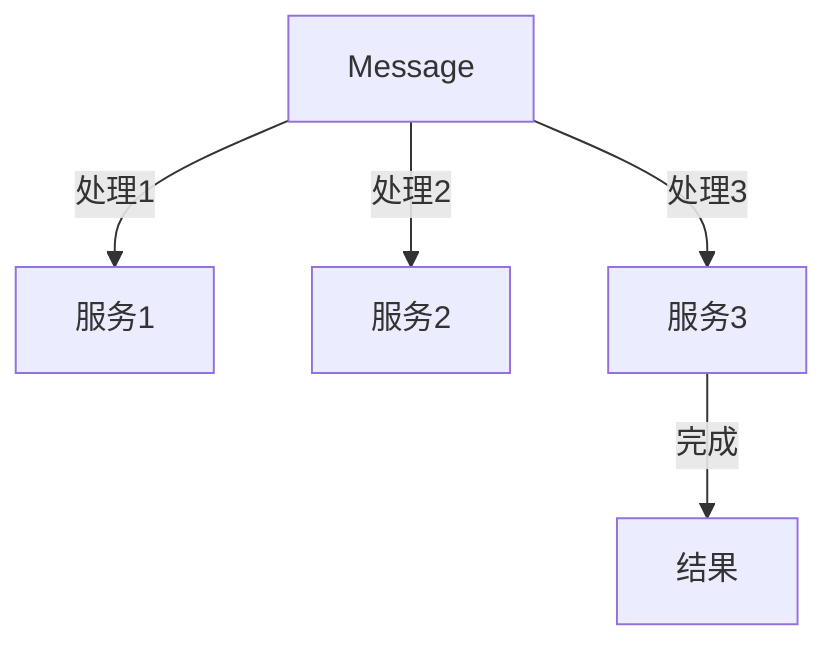

这种模式的主要优点包括：

1. **分布式处理**：每个服务可以独立扩展，提高系统的吞吐量。
2. **模块化设计**：每个服务可以单独开发和维护，降低了系统的复杂性。

#### 4.4 负载均衡模式

负载均衡模式是一种用于分发消息到多个处理节点的设计模式，以实现负载均衡和高可用性。这种方式适用于处理高并发和大规模消息的场景。

以下是一个负载均衡模式的Mermaid流程图：

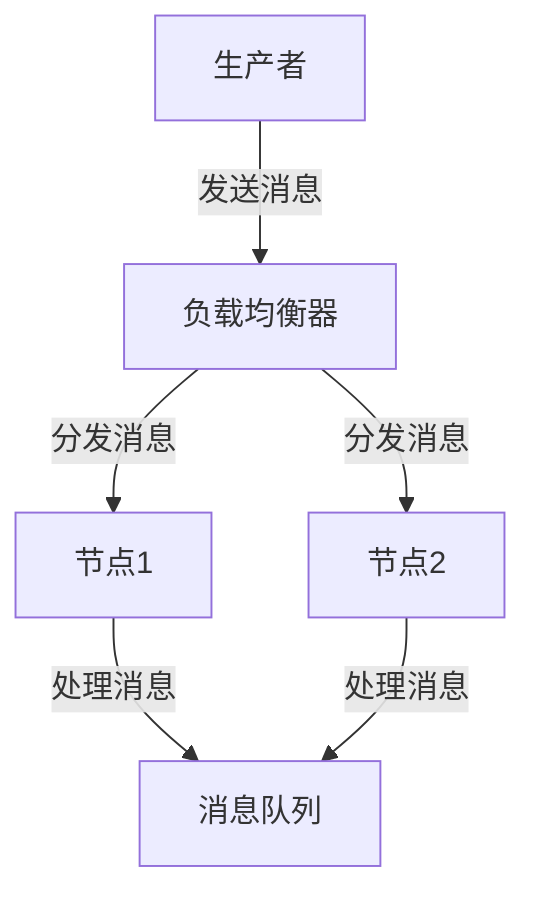

这种模式的主要优点包括：

1. **负载均衡**：消息可以根据负载均衡策略均匀地分布到多个节点，避免单个节点过载。
2. **高可用性**：如果一个节点发生故障，其他节点可以继续处理消息，保证系统的可用性。

通过上述设计模式，消息队列可以更好地适应各种分布式系统的需求，提高系统的性能和可靠性。在实际应用中，可以根据具体场景选择合适的设计模式或组合使用多种模式。

## 第三部分：消息队列在系统解耦中的应用

### 第5章：系统解耦的概念与必要性

#### 5.1 系统解耦的定义

系统解耦是指将系统中的不同组件或模块解耦，使得它们能够独立工作，减少相互之间的依赖和耦合。在分布式系统中，系统解耦是设计的关键原则之一，它有助于提高系统的灵活性、可维护性和可扩展性。

具体来说，系统解耦包括以下几个方面：

1. **功能解耦**：将系统的功能模块化，使得每个模块可以独立实现特定功能，降低模块间的依赖。
2. **数据解耦**：通过消息队列等机制，实现数据在不同系统组件间的异步传输，减少直接的交互依赖。
3. **接口解耦**：通过定义清晰的接口和协议，使得系统组件间的交互更加规范，降低依赖性。

#### 5.2 系统解耦的优势

系统解耦带来了以下优势：

1. **提高灵活性**：解耦后的系统组件可以独立开发、部署和扩展，减少了相互之间的制约，提高了系统的灵活性。
2. **降低维护成本**：系统组件解耦后，每个组件的维护难度降低，有利于提高开发效率和降低维护成本。
3. **提高可扩展性**：系统可以通过增加或替换组件来实现扩展，而不影响其他组件的运行，提高了系统的可扩展性。
4. **增强容错性**：解耦后的系统组件可以独立运行，当一个组件发生故障时，不会影响其他组件的正常工作，增强了系统的容错性。

#### 5.3 系统解耦的挑战

尽管系统解耦带来了许多优势，但在实际应用中，系统解耦也面临一些挑战：

1. **复杂性增加**：系统解耦增加了系统的复杂性，需要设计和管理更多的接口和协议，确保各个组件能够正常通信和协作。
2. **性能开销**：消息队列等异步通信机制引入了一定的性能开销，可能会影响系统的响应速度和吞吐量。
3. **一致性问题**：在分布式系统中，如何保证数据的一致性是一个挑战，特别是在涉及多个系统组件的复杂场景中。

### 第6章：消息队列在系统解耦中的应用场景

消息队列在系统解耦中有着广泛的应用，以下是一些典型的应用场景：

#### 6.1 服务拆分

在大型分布式系统中，服务拆分是一种常见的架构设计方法，通过将大型服务拆分为多个小型服务，实现系统的解耦和模块化。消息队列在这种场景中起着关键作用，它负责不同服务之间的通信和协调。

以下是一个服务拆分的典型应用场景：

1. **订单服务**：负责处理订单的创建、修改和取消等操作。
2. **库存服务**：负责管理商品的库存信息，处理订单的库存扣减。
3. **支付服务**：负责处理订单的支付操作。

通过消息队列，订单服务可以发送订单创建的消息到库存服务和支付服务，库存服务和支付服务分别处理这些消息，并将处理结果返回给订单服务。这种解耦方式使得每个服务可以独立开发和扩展，提高了系统的灵活性。

#### 6.2 服务集成

在集成多个第三方服务或系统的场景中，消息队列可以充当数据传输和协调的中介，实现不同系统之间的解耦和集成。

以下是一个服务集成的典型应用场景：

1. **订单系统**：需要集成支付系统、库存系统和物流系统。
2. **支付系统**：负责处理订单的支付操作。
3. **库存系统**：负责管理商品的库存信息。
4. **物流系统**：负责处理订单的发货和物流跟踪。

通过消息队列，订单系统可以发送订单创建的消息到支付系统、库存系统和物流系统，这些系统分别处理这些消息，并将处理结果返回给订单系统。这种解耦方式使得不同系统可以独立运行和扩展，提高了系统的稳定性和可靠性。

#### 6.3 实时数据处理

实时数据处理是一种需要快速处理大量数据的场景，消息队列可以提供异步处理机制，提高系统的性能和响应速度。

以下是一个实时数据处理的典型应用场景：

1. **日志收集系统**：负责收集和分析来自各个服务的日志数据。
2. **数据存储系统**：负责存储和处理日志数据。
3. **监控系统**：负责实时监控系统的运行状态。

通过消息队列，日志收集系统可以发送日志数据到数据存储系统和监控系统，这些系统分别处理这些数据，并将处理结果返回给日志收集系统。这种解耦方式使得日志数据可以异步处理，提高了系统的性能和实时性。

#### 6.4 异步通信

异步通信是一种提高系统响应速度和降低系统负载的有效方式，消息队列可以提供异步处理机制，实现系统组件之间的通信。

以下是一个异步通信的典型应用场景：

1. **用户服务**：负责处理用户的注册、登录和认证等操作。
2. **邮件服务**：负责发送注册确认邮件、登录通知邮件等。
3. **短信服务**：负责发送注册确认短信、登录通知短信等。

通过消息队列，用户服务可以发送邮件和短信请求到邮件服务和短信服务，这些服务分别处理这些请求，并将处理结果返回给用户服务。这种解耦方式使得用户服务可以异步处理邮件和短信发送，提高了系统的性能和用户体验。

通过上述应用场景，可以看出消息队列在系统解耦中具有重要的作用，它不仅提高了系统的灵活性、可维护性和可扩展性，还优化了系统的性能和用户体验。在实际应用中，可以根据具体需求选择合适的应用场景和消息队列解决方案。

## 第四部分：消息队列的性能优化

### 第7章：消息队列的性能优化方法

消息队列的性能优化是确保系统高效运行的关键环节。为了提升消息队列的处理能力和响应速度，需要从多个方面进行优化。以下是一些常用的消息队列性能优化方法：

#### 7.1 系统硬件优化

硬件优化是提升消息队列性能的基础。以下是一些硬件优化的建议：

1. **增加内存**：内存是影响消息队列性能的重要因素。增加内存可以提高消息队列的缓存能力，减少磁盘IO操作，从而提升处理速度。
2. **使用SSD存储**：SSD具有更快的读写速度，相对于传统HDD，可以显著提高消息队列的性能。
3. **网络优化**：优化网络配置，确保低延迟和高带宽。特别是在分布式消息队列中，网络质量对性能有重要影响。
4. **硬件冗余**：通过使用多台服务器和负载均衡器，实现消息队列的高可用性和负载均衡，提高系统的可靠性和性能。

#### 7.2 消息队列软件优化

软件优化可以进一步提高消息队列的性能。以下是一些软件优化的方法：

1. **消息压缩**：对消息进行压缩可以减少网络传输的数据量，提高传输效率。常见的消息压缩算法包括Gzip和Snappy等。
2. **批量处理**：批量处理可以减少消息队列的IO操作次数，提高处理速度。通过批量发送和消费消息，可以减少系统开销。
3. **线程池优化**：合理配置线程池大小，避免线程创建和销毁的开销。根据系统的负载情况，动态调整线程池大小，实现高效的消息处理。
4. **缓存策略**：使用缓存策略可以减少对磁盘的访问，提高消息队列的响应速度。常见的缓存策略包括内存缓存、Redis缓存等。

#### 7.3 网络优化

网络优化是提升消息队列性能的重要手段。以下是一些网络优化的建议：

1. **网络隔离**：将消息队列的网络流量与其他业务流量隔离，避免网络拥堵影响消息队列的性能。
2. **负载均衡**：使用负载均衡器将消息队列的流量分布到多个服务器上，避免单点瓶颈。
3. **延迟优化**：通过优化网络路由，减少消息传输的延迟。使用CDN（内容分发网络）可以加速消息的传输。
4. **监控与告警**：实时监控网络状况，及时发现和处理网络故障，确保消息队列的稳定运行。

#### 7.4 缓存优化

缓存优化可以显著提升消息队列的性能。以下是一些缓存优化的方法：

1. **内存缓存**：使用内存缓存可以减少对磁盘的访问，提高消息队列的读写速度。常用的内存缓存技术包括LRU（最近最少使用）算法和LFU（最不频繁使用）算法等。
2. **Redis缓存**：Redis是一个高性能的内存缓存数据库，可以用于缓存消息队列的元数据和状态信息，提高消息队列的响应速度。
3. **本地缓存**：在消息队列客户端实现本地缓存，可以减少对远程消息队列的访问次数，提高消息处理速度。
4. **缓存预热**：在系统启动或高负载时，预先加载缓存数据，减少实际运行中的缓存 miss 率，提高系统的性能。

通过上述优化方法，可以显著提升消息队列的性能，确保系统的高效运行。在实际应用中，可以根据具体场景和需求选择合适的优化策略，实现最佳的性能表现。

## 第五部分：消息队列的实践案例

### 第9章：消息队列在电商系统的应用

在电商系统中，消息队列是一个重要的基础设施，用于实现系统的异步通信和数据处理。以下是一个典型的电商系统架构，并详细讲解消息队列在该架构中的应用。

#### 9.1 案例描述

假设我们有一个电商系统，包括以下几个主要服务：

1. **订单服务**：负责处理订单的创建、修改和取消等操作。
2. **库存服务**：负责管理商品的库存信息，处理订单的库存扣减。
3. **支付服务**：负责处理订单的支付操作。
4. **物流服务**：负责处理订单的发货和物流跟踪。

在实际操作中，订单服务创建订单后，需要通知库存服务扣减库存，并通知支付服务进行支付操作。订单支付成功后，物流服务需要开始发货流程。这些操作需要高效且可靠地进行，以确保订单处理流程的顺畅。

#### 9.2 系统架构设计

以下是一个典型的电商系统架构，展示消息队列在系统中的位置和作用：

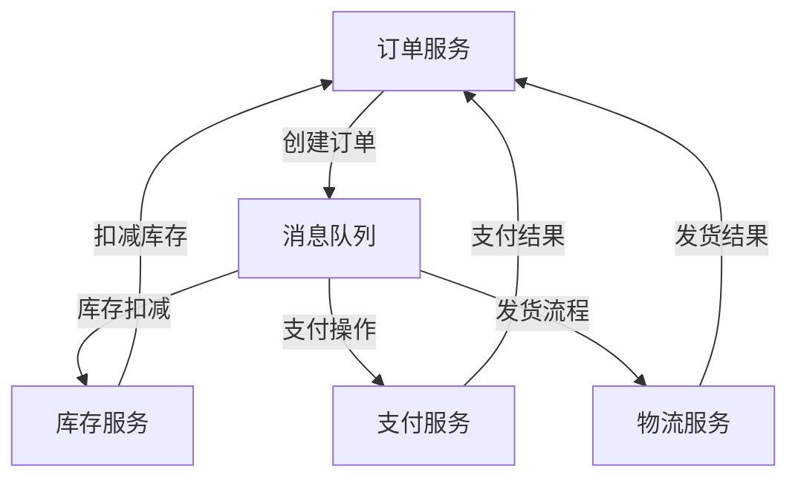

在这个架构中，消息队列充当订单服务与库存服务、支付服务、物流服务之间的通信桥梁。每个服务通过消息队列异步处理订单操作，从而实现系统的解耦和模块化。

#### 9.3 消息队列的应用场景

以下详细讲解消息队列在电商系统中的几个关键应用场景：

1. **订单创建**：
    - **订单服务**接收到用户的订单请求后，创建订单并生成订单消息。
    - 订单消息包括订单ID、商品ID、数量等信息。

2. **库存扣减**：
    - **库存服务**接收到订单消息后，根据订单中的商品ID和数量进行库存扣减。
    - 扣减成功后，库存服务发送确认消息给订单服务。

3. **支付操作**：
    - **支付服务**接收到订单消息后，处理支付操作。
    - 支付成功后，支付服务发送支付确认消息给订单服务。

4. **发货流程**：
    - **物流服务**接收到支付确认消息后，开始发货流程。
    - 发货完成后，物流服务发送发货确认消息给订单服务。

5. **订单处理反馈**：
    - **订单服务**接收到库存扣减确认消息、支付确认消息和发货确认消息后，更新订单状态并通知用户。

#### 9.4 实现细节与代码解读

以下是一个简化的订单处理流程的伪代码示例：

```python
# 订单服务
def create_order(order_info):
    order_id = generate_order_id()
    order_message = format_order_message(order_id, order_info)
    send_message_to_queue(order_message)

# 库存服务
def deduct_inventory(order_message):
    order_info = parse_order_message(order_message)
    inventory_status = check_inventory(order_info)
    if inventory_status.is_sufficient():
        deduct_inventory_by_order_info(order_info)
        send_confirmation_message_to_queue(order_message)
    else:
        send_failure_message_to_queue(order_message)

# 支付服务
def process_payment(order_message):
    order_info = parse_order_message(order_message)
    payment_status = make_payment(order_info)
    if payment_status.is_successful():
        send_payment_confirmation_message_to_queue(order_message)
    else:
        send_payment_failure_message_to_queue(order_message)

# 物流服务
def ship_order(order_message):
    order_info = parse_order_message(order_message)
    shipping_status = start_shipping(order_info)
    if shipping_status.is_successful():
        send_shipment_confirmation_message_to_queue(order_message)
    else:
        send_shipment_failure_message_to_queue(order_message)

# 消息队列处理
def receive_and_dispatch_message():
    message = receive_message_from_queue()
    if is_order_message(message):
        dispatch_order_message(message)
    elif is_payment_message(message):
        dispatch_payment_message(message)
    elif is_inventory_message(message):
        dispatch_inventory_message(message)
    elif is_shipping_message(message):
        dispatch_shipping_message(message)
```

通过上述代码示例，我们可以看到消息队列在订单处理中的重要作用。每个服务通过消息队列异步处理订单操作，减少了直接调用和同步通信的需求，提高了系统的性能和灵活性。

#### 9.5 项目小结

通过在电商系统中使用消息队列，我们实现了以下几个关键目标：

1. **系统解耦**：通过消息队列，订单服务、库存服务、支付服务、物流服务之间实现了松耦合，提高了系统的灵活性和可维护性。
2. **异步处理**：消息队列允许订单操作异步处理，提高了系统的吞吐量和响应速度。
3. **高可用性**：通过消息队列，订单操作可以独立于各个服务进行，当一个服务发生故障时，不会影响其他服务的正常运行。
4. **扩展性**：系统可以轻松扩展，增加更多的订单处理节点和消息队列节点，以应对更高的负载。

消息队列在电商系统中的应用，不仅优化了系统的性能和可靠性，还为系统的扩展和升级提供了强有力的支持。在实际项目中，可以根据具体需求灵活应用消息队列，实现系统的解耦和异步处理。

### 第10章：消息队列在金融系统的应用

在金融系统中，消息队列同样是一个关键组件，它能够有效提高系统的稳定性、可靠性和响应速度。以下将详细讲解消息队列在金融系统中的应用案例。

#### 10.1 案例描述

假设我们有一个金融系统，包括以下几个主要服务：

1. **交易服务**：负责处理用户的交易请求，包括股票交易、基金交易等。
2. **清算服务**：负责处理交易的清算和结算，确保资金和资产的正确转移。
3. **风控服务**：负责监控交易行为，识别和防范潜在风险。
4. **报表服务**：负责生成交易报表，提供数据分析和统计。

在实际操作中，交易服务接收到用户的交易请求后，需要立即处理并通知清算服务和风控服务。交易完成后，清算服务需要更新资金账户，并通知报表服务生成报表。这些操作需要高效、准确且实时完成，以确保金融交易的顺畅和安全。

#### 10.2 系统架构设计

以下是一个典型的金融系统架构，展示消息队列在系统中的位置和作用：


在这个架构中，消息队列充当交易服务与清算服务、风控服务、报表服务之间的通信桥梁。每个服务通过消息队列异步处理交易操作，从而实现系统的解耦和模块化。

#### 10.3 消息队列的应用场景

以下详细讲解消息队列在金融系统中的几个关键应用场景：

1. **交易处理**：
    - **交易服务**接收到用户的交易请求后，立即处理交易并生成交易消息。
    - 交易消息包括交易ID、用户ID、交易金额等信息。

2. **清算处理**：
    - **清算服务**接收到交易消息后，处理交易的清算操作，确保资金和资产的正确转移。
    - 清算完成后，清算服务发送清算确认消息给交易服务。

3. **风险监控**：
    - **风控服务**接收到交易消息后，对交易行为进行监控，识别潜在风险。
    - 风控服务发送风险报告消息给交易服务。

4. **报表生成**：
    - **报表服务**接收到交易消息后，生成交易报表，提供数据分析和统计。
    - 报表服务发送报表生成确认消息给交易服务。

5. **交易反馈**：
    - **交易服务**接收到清算确认消息、风险报告消息和报表生成确认消息后，更新交易状态并通知用户。

#### 10.4 实现细节与代码解读

以下是一个简化的交易处理流程的伪代码示例：

```python
# 交易服务
def process_trade(trade_request):
    trade_id = generate_trade_id()
    trade_message = format_trade_message(trade_id, trade_request)
    send_message_to_queue(trade_message)

# 清算服务
def clear_trade(trade_message):
    trade_info = parse_trade_message(trade_message)
    clearing_status = process_clearing(trade_info)
    if clearing_status.is_successful():
        send_clearing_confirmation_message_to_queue(trade_message)
    else:
        send_clearing_failure_message_to_queue(trade_message)

# 风控服务
def monitor_trade(trade_message):
    trade_info = parse_trade_message(trade_message)
    risk_report = check_risk(trade_info)
    send_risk_report_message_to_queue(risk_report)

# 报表服务
def generate_report(trade_message):
    trade_info = parse_trade_message(trade_message)
    report = create_report(trade_info)
    send_report_confirmation_message_to_queue(report)

# 消息队列处理
def receive_and_dispatch_message():
    message = receive_message_from_queue()
    if is_trade_message(message):
        dispatch_trade_message(message)
    elif is_clearing_message(message):
        dispatch_clearing_message(message)
    elif is_risk_report_message(message):
        dispatch_risk_report_message(message)
    elif is_report_message(message):
        dispatch_report_message(message)
```

通过上述代码示例，我们可以看到消息队列在交易处理中的重要作用。每个服务通过消息队列异步处理交易操作，减少了直接调用和同步通信的需求，提高了系统的性能和灵活性。

#### 10.5 项目小结

通过在金融系统中使用消息队列，我们实现了以下几个关键目标：

1. **系统解耦**：通过消息队列，交易服务、清算服务、风控服务、报表服务之间实现了松耦合，提高了系统的灵活性和可维护性。
2. **异步处理**：消息队列允许交易操作异步处理，提高了系统的吞吐量和响应速度。
3. **高可用性**：通过消息队列，交易操作可以独立于各个服务进行，当一个服务发生故障时，不会影响其他服务的正常运行。
4. **扩展性**：系统可以轻松扩展，增加更多的交易处理节点和消息队列节点，以应对更高的负载。

消息队列在金融系统中的应用，不仅优化了系统的性能和可靠性，还为系统的扩展和升级提供了强有力的支持。在实际项目中，可以根据具体需求灵活应用消息队列，实现系统的解耦和异步处理。

## 第六部分：消息队列的技术发展趋势

### 第11章：消息队列的技术发展趋势

随着云计算、物联网和大数据等技术的快速发展，消息队列技术在不断演变和进步。以下将探讨消息队列的技术发展趋势，包括云原生消息队列、消息队列的边缘计算应用以及消息队列与区块链的结合。

#### 11.1 云原生消息队列

云原生（Cloud Native）是一种利用云计算资源进行应用程序开发和部署的方法。云原生消息队列利用云平台提供的弹性、可靠性和可扩展性，优化消息队列的性能和资源利用率。以下是一些云原生消息队列的特点：

1. **容器化**：云原生消息队列可以部署在容器化环境中，如Docker和Kubernetes，便于分布式部署和运维。
2. **弹性扩展**：根据负载需求，云原生消息队列可以动态调整资源，自动扩展或收缩，确保系统的性能和稳定性。
3. **服务化**：云原生消息队列可以以微服务的形式部署，支持服务间的解耦和协同工作。
4. **自动化**：云原生消息队列可以利用CI/CD（持续集成和持续交付）工具，实现自动部署、监控和故障恢复。

云原生消息队列的应用场景包括：

- **大规模分布式系统**：通过云原生消息队列，可以轻松构建和管理大规模分布式系统，实现高效的异步通信和数据传输。
- **云原生应用开发**：在云原生应用开发中，消息队列用于实现模块间的异步通信，提高系统的性能和可扩展性。

#### 11.2 消息队列的边缘计算应用

边缘计算（Edge Computing）是一种在靠近数据源或用户的地方进行数据处理的方法，以减少延迟、带宽消耗和计算成本。消息队列在边缘计算中的应用，可以进一步优化系统的性能和响应速度。以下是一些消息队列在边缘计算中的应用场景：

1. **实时数据处理**：在边缘设备上部署消息队列，可以实时处理和分析数据，提高系统的响应速度。
2. **数据缓存和预处理**：消息队列可以在边缘设备上缓存和预处理数据，减少中心服务器的计算负担。
3. **物联网应用**：在物联网应用中，消息队列用于实现设备间的通信和数据传输，确保系统的实时性和可靠性。

边缘计算与消息队列的结合，可以带来以下优势：

- **降低延迟**：通过在边缘设备上处理数据，减少数据传输的延迟，提高系统的实时性。
- **减少带宽消耗**：边缘计算可以缓存和预处理数据，减少中心服务器的数据传输量，降低带宽消耗。
- **提高系统可靠性**：边缘计算可以分散系统的负载，提高系统的容错性和可靠性。

#### 11.3 消息队列与区块链的结合

区块链技术具有去中心化、安全性和不可篡改等特点，与消息队列的结合可以带来以下优势：

1. **数据一致性**：通过消息队列，可以确保区块链中的数据一致性，防止数据丢失和重复。
2. **分布式账本**：消息队列可以用于构建分布式账本系统，实现去中心化的数据存储和交易处理。
3. **智能合约执行**：消息队列可以与智能合约结合，实现自动化和智能化的交易处理。

消息队列与区块链的结合应用场景包括：

- **供应链管理**：通过消息队列，可以实现供应链中的数据共享和交易记录，提高供应链的透明度和效率。
- **金融交易**：在金融交易中，消息队列可以用于处理交易订单，确保交易的一致性和安全性。
- **智能合约**：在智能合约中，消息队列可以用于触发和执行合约操作，实现自动化和智能化的交易处理。

总之，消息队列的技术发展趋势表明，随着云计算、边缘计算和区块链等技术的发展，消息队列在分布式系统中的应用将越来越广泛。未来，消息队列将继续优化和扩展，为分布式系统提供更高效、更可靠的消息传递和数据处理解决方案。

## 第七部分：总结与展望

### 第12章：总结与展望

消息队列作为分布式系统中不可或缺的组件，通过实现异步通信和消息传递，有效解决了系统解耦、性能优化、高可用性等关键问题。本文系统地介绍了消息队列的基本概念、工作原理、架构设计、设计模式以及在系统解耦中的应用，展示了其在实际项目中的重要作用。

#### 12.1 未来展望

展望未来，消息队列将在以下领域继续发挥重要作用：

1. **物联网应用**：随着物联网设备的普及，消息队列将在海量设备的通信和数据传输中发挥关键作用，实现实时数据的收集和处理。
2. **云原生环境**：在云原生环境中，消息队列将更好地利用云计算的资源和管理能力，实现更高效、更灵活的分布式系统架构。
3. **边缘计算**：消息队列与边缘计算的结合，将进一步提升系统的实时性和响应速度，优化边缘设备的资源利用。
4. **区块链应用**：消息队列与区块链技术的结合，将推动去中心化系统的建设，实现更安全、更可靠的数据共享和交易处理。

#### 12.2 消息队列在物联网中的应用

物联网（IoT）中的设备种类繁多，数据量巨大，消息队列在其中扮演着重要角色：

1. **数据收集与处理**：消息队列可以高效地收集和处理物联网设备产生的数据，实现实时监控和数据分析。
2. **设备通信**：通过消息队列，物联网设备可以实现高效、可靠的数据传输和通信，降低设备的计算负担。
3. **边缘计算优化**：消息队列结合边缘计算，可以实现数据在边缘设备的预处理和缓存，减少中心服务器的负担，提高系统的响应速度。

#### 12.3 消息队列在企业数字化转型中的作用

在企业数字化转型中，消息队列提供了以下关键支持：

1. **系统集成**：通过消息队列，可以实现不同系统之间的数据传输和通信，打破信息孤岛，提高数据的一致性和可靠性。
2. **业务流程优化**：消息队列可以优化业务流程，实现异步处理和并行处理，提高业务效率和服务质量。
3. **数字化转型**：消息队列作为数字化转型的关键技术之一，可以支持企业的敏捷开发和迭代，推动企业的数字化转型和升级。

#### 12.4 消息队列的标准化与规范化发展

消息队列的标准化和规范化发展是确保其广泛应用和持续创新的重要保障：

1. **协议标准化**：推动消息队列协议的标准化，实现不同消息队列产品之间的互操作性和兼容性。
2. **架构规范**：制定统一的架构规范，指导消息队列系统的设计和开发，提高系统的可靠性和可维护性。
3. **工具与生态**：发展丰富的消息队列工具和生态系统，支持消息队列的开发、测试、运维和监控，降低使用门槛。

总之，消息队列作为分布式系统中的关键基础设施，将在未来的发展中继续发挥重要作用。通过不断的技术创新和规范化发展，消息队列将为企业数字化转型和物联网应用提供强有力的支持。

