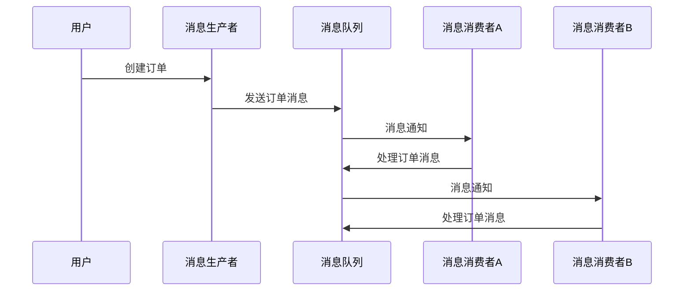
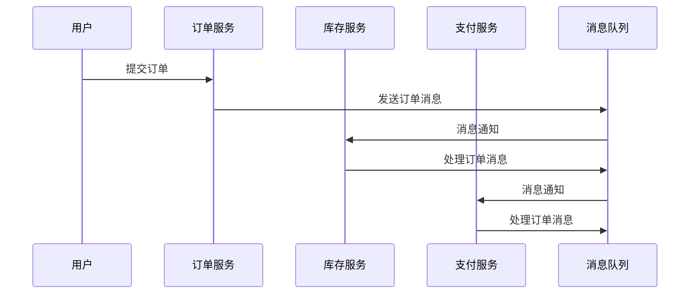
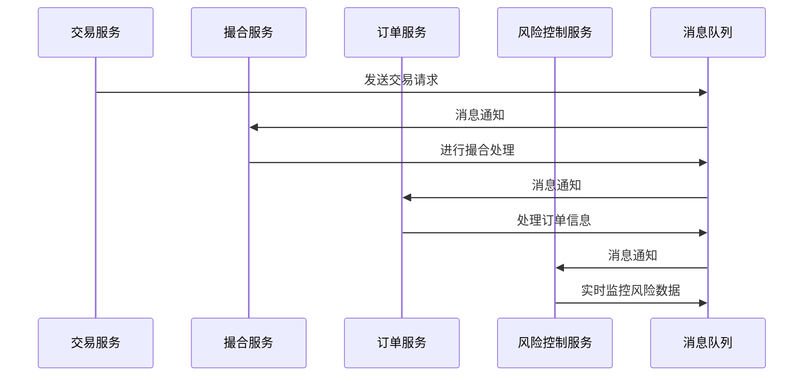
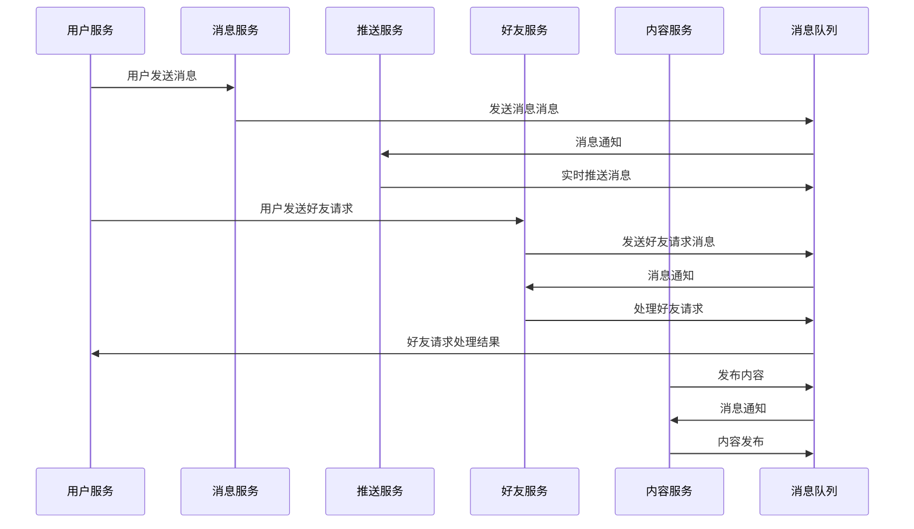

                 

# 文章标题

消息队列应用：解耦系统组件的有效方式

## 文章关键词

消息队列，系统解耦，微服务架构，通信协议，性能优化，故障处理，监控，项目实战

## 摘要

本文旨在探讨消息队列在系统组件解耦中的应用，深入分析其核心概念、技术原理、系统架构、应用场景和性能优化等关键方面。通过实际案例和代码解析，本文将揭示消息队列在分布式系统中的重要性，并分享最佳实践和注意事项，帮助读者更好地理解和应用消息队列技术。

## 目录

### 第1章：消息队列概述

1.1 消息队列的定义与作用

1.2 消息队列的分类

1.3 消息队列的发展历程

### 第2章：消息队列技术原理

2.1 消息队列的基本原理

2.2 消息队列通信协议

2.3 消息队列实现细节

### 第3章：消息队列系统架构

3.1 消息队列架构设计

3.2 消息队列与微服务架构

3.3 Mermaid流程图：消息队列工作流程

### 第4章：消息队列应用场景

4.1 消息队列在电子商务系统中的应用

4.2 消息队列在金融交易系统中的应用

4.3 消息队列在社交媒体系统中的应用

### 第5章：消息队列性能优化

5.1 消息队列性能指标

5.2 消息队列性能优化方法

5.3 数学模型：消息队列性能评估

### 第6章：消息队列故障处理与监控

6.1 消息队列故障类型

6.2 消息队列故障处理流程

6.3 消息队列监控系统设计

### 第7章：消息队列与微服务架构

7.1 微服务架构概述

7.2 消息队列在微服务架构中的应用

7.3 实际案例：消息队列与微服务架构的集成

### 第8章：项目实战

8.1 开发环境搭建

8.2 源代码详细实现

8.3 代码解读与应用分析

8.4 项目小结

### 第9章：最佳实践、小结与拓展阅读

9.1 最佳实践 tips

9.2 小结

9.3 注意事项

9.4 拓展阅读

### 作者信息

作者：AI天才研究院/AI Genius Institute & 禅与计算机程序设计艺术 /Zen And The Art of Computer Programming

----------------------------------------------------------------

## 第1章：消息队列概述

### 1.1 消息队列的定义与作用

消息队列（Message Queue，简称MQ）是一种用于在分布式系统中传输消息的通信机制。它允许不同系统组件之间通过异步方式进行通信，从而实现系统的解耦。消息队列的基本概念包括消息、队列、生产者、消费者和中间件等。

#### 消息

消息是消息队列中的基本数据单元，通常包含数据内容和元数据信息。数据内容可以是文本、图片、视频等多种格式，而元数据则包括消息ID、发送时间、发送者、接收者等信息。

#### 队列

队列是一种先进先出（FIFO）的数据结构，用于存储消息。生产者将消息放入队列中，消费者从队列中取出消息进行处理。

#### 生产者

生产者是消息队列中的消息发送方，负责创建和发送消息。生产者可以是应用程序、服务器、设备等。

#### 消费者

消费者是消息队列中的消息接收方，负责从队列中取出消息并进行处理。消费者可以是应用程序、服务器、设备等。

#### 中间件

中间件是消息队列的核心组成部分，负责消息的传输、存储、路由和监控等功能。常见的消息队列中间件包括RabbitMQ、Kafka、ActiveMQ等。

消息队列的主要作用包括：

1. **解耦**：通过异步通信，实现系统组件之间的解耦，降低系统复杂性。
2. **弹性伸缩**：消息队列可以根据需求动态调整处理能力，实现系统的高可用性和可扩展性。
3. **流量控制**：消息队列可以对消息进行排队和调度，实现流量控制，防止系统过载。
4. **数据传输**：消息队列可以作为数据传输的通道，实现不同系统之间的数据交换。

### 1.2 消息队列的分类

消息队列可以根据不同的特性进行分类，常见的分类方法包括：

1. **基于消息通信模式**：

   - **点对点消息队列**：一对一的消息传输，确保消息被精确地发送给指定的消费者。
   - **发布/订阅消息队列**：一对多的消息传输，多个消费者可以订阅同一主题的消息。

2. **基于消息传输方式**：

   - **同步传输**：生产者发送消息后等待消费者处理完成，再继续执行。
   - **异步传输**：生产者发送消息后立即返回，不等待消费者处理完成。

3. **基于消息持久性**：

   - **持久化消息队列**：消息被存储在磁盘上，确保消息不会因为系统故障而丢失。
   - **非持久化消息队列**：消息仅存储在内存中，系统重启时消息可能丢失。

4. **基于消息顺序性**：

   - **有序消息队列**：确保消息按照发送顺序依次被处理。
   - **无序消息队列**：不保证消息的顺序性。

### 1.3 消息队列的发展历程

消息队列技术起源于20世纪70年代，随着分布式系统和网络技术的不断发展，消息队列逐渐成为分布式系统通信的核心组件。以下是消息队列技术的发展历程：

1. **1980年代**：消息队列技术的概念被提出，典型的系统包括IBM的MQSeries和TIBCO的EMS。
2. **1990年代**：消息队列技术逐渐成熟，广泛应用于企业级分布式系统。
3. **2000年代**：随着互联网和移动设备的兴起，消息队列技术得到进一步发展，涌现出许多开源消息队列中间件，如RabbitMQ、Kafka、ActiveMQ等。
4. **2010年代**：消息队列技术逐渐应用于云计算和大数据领域，成为分布式系统架构的重要组件。

### 1.4 小结

消息队列是一种用于分布式系统通信的重要技术，通过异步通信、解耦、弹性伸缩等特点，实现系统组件的高效协作。了解消息队列的基本概念、分类和发展历程，有助于我们更好地理解和应用消息队列技术。

----------------------------------------------------------------

## 第2章：消息队列技术原理

### 2.1 消息队列的基本原理

消息队列的核心原理是消息的传输和存储。消息传输是指消息从生产者传递到消费者的过程，而消息存储是指消息在队列中的存储和管理。

#### 消息传输原理

消息传输可以分为以下几个步骤：

1. **发送消息**：生产者创建消息并放入消息队列中。
2. **消息传递**：消息队列将消息传递给消费者。
3. **处理消息**：消费者从消息队列中取出消息并进行处理。

消息传输过程中，生产者和消费者可以是同一系统中的不同组件，也可以是不同系统之间的通信。消息队列通过异步通信方式，实现生产者和消费者之间的解耦。

#### 消息存储原理

消息存储是消息队列的重要功能，主要包括以下方面：

1. **消息存储位置**：消息可以存储在内存或磁盘上，内存存储适用于高速处理，而磁盘存储则适用于持久化消息。
2. **消息持久化**：持久化消息是指在系统故障时不会丢失的消息。消息持久化可以通过将消息存储在磁盘上的日志文件或数据库实现。
3. **消息备份**：消息队列可以配置消息备份机制，以确保消息不会因为系统故障而丢失。

#### 消息队列通信协议

消息队列的通信协议定义了消息队列系统中各组件之间的通信规则。常见的消息队列通信协议包括：

1. **AMQP**（Advanced Message Queuing Protocol）：AMQP是一种广泛使用的消息队列通信协议，支持多种消息传输模式和消息持久化功能。
2. **HTTP/HTTPS**：HTTP/HTTPS协议适用于简单的消息传输场景，可以通过Web服务进行消息的发送和接收。
3. **MQTT**（Message Queuing Telemetry Transport）：MQTT是一种轻量级的消息队列通信协议，适用于物联网和移动设备等场景。

#### 消息队列实现细节

消息队列的实现涉及多个组件和模块，主要包括：

1. **消息生产者**：负责创建和发送消息，可以使用各种编程语言实现。
2. **消息队列**：负责存储和管理消息，可以使用内存数据结构或磁盘文件实现。
3. **消息消费者**：负责从消息队列中取出消息并处理，可以使用各种编程语言实现。
4. **中间件**：负责消息的传输、存储、路由和监控等功能，常见的中间件包括RabbitMQ、Kafka、ActiveMQ等。

### 2.2 消息队列通信协议

消息队列通信协议定义了消息队列系统中各组件之间的通信规则。常见的消息队列通信协议包括：

1. **AMQP**（Advanced Message Queuing Protocol）

   - **基本概念**：AMQP是一种高级消息队列协议，支持多种消息传输模式和消息持久化功能。
   - **协议特点**：AMQP是一种基于文本的协议，易于扩展和实现，支持多种消息传输模式和消息持久化功能。
   - **应用场景**：AMQP适用于企业级分布式系统，特别是在需要高可靠性和高吞吐量的场景中。

2. **HTTP/HTTPS**

   - **基本概念**：HTTP/HTTPS是一种基于Web的通信协议，可以用于简单的消息传输场景。
   - **协议特点**：HTTP/HTTPS是一种基于请求-响应的协议，支持双向通信，但消息传输效率和可靠性相对较低。
   - **应用场景**：HTTP/HTTPS适用于简单的消息传输场景，如Web服务之间的通信。

3. **MQTT**（Message Queuing Telemetry Transport）

   - **基本概念**：MQTT是一种轻量级的消息队列通信协议，适用于物联网和移动设备等场景。
   - **协议特点**：MQTT是一种基于发布-订阅模式的协议，消息传输效率高，但可靠性相对较低。
   - **应用场景**：MQTT适用于物联网和移动设备等场景，特别是在带宽和计算资源有限的场景中。

### 2.3 消息队列实现细节

消息队列的实现涉及多个组件和模块，主要包括：

1. **消息生产者**

   - **功能**：负责创建和发送消息。
   - **实现方式**：可以使用各种编程语言实现，如Java、Python、Go等。

2. **消息队列**

   - **功能**：负责存储和管理消息。
   - **实现方式**：可以使用内存数据结构或磁盘文件实现，如Redis、RabbitMQ、Kafka等。

3. **消息消费者**

   - **功能**：负责从消息队列中取出消息并处理。
   - **实现方式**：可以使用各种编程语言实现，如Java、Python、Go等。

4. **中间件**

   - **功能**：负责消息的传输、存储、路由和监控等功能。
   - **实现方式**：可以使用开源中间件，如RabbitMQ、Kafka、ActiveMQ等，也可以自行开发实现。

### 2.4 小结

消息队列的基本原理包括消息传输和存储，通信协议主要有AMQP、HTTP/HTTPS和MQTT等。了解消息队列的技术原理和实现细节，有助于我们更好地设计和实现消息队列系统，提高系统的可靠性和性能。

----------------------------------------------------------------

## 第3章：消息队列系统架构

### 3.1 消息队列架构设计

消息队列系统架构的设计是确保消息传输和系统解耦的关键。合理的架构设计可以提高消息队列系统的可靠性、性能和可扩展性。以下是消息队列系统架构设计的主要方面：

#### 系统组件

消息队列系统主要包括以下组件：

1. **消息生产者**：负责创建和发送消息。
2. **消息队列**：负责存储和管理消息。
3. **消息消费者**：负责从消息队列中取出消息并处理。
4. **中间件**：负责消息的传输、存储、路由和监控等功能。

#### 架构模式

消息队列系统架构可以采用以下几种模式：

1. **点对点模式**：生产者直接将消息发送给消费者，适用于一对一的消息传输。
2. **发布/订阅模式**：生产者将消息发送到主题，消费者订阅主题，适用于一对多的消息传输。
3. **混合模式**：结合点对点和发布/订阅模式，实现更灵活的消息传输。

#### 系统设计要点

在消息队列系统架构设计中，需要注意以下几点：

1. **高可用性**：确保消息队列系统在故障时能够自动恢复，提高系统的可靠性。
2. **性能优化**：通过合理配置消息队列系统和优化消息处理流程，提高系统的性能和吞吐量。
3. **安全性**：确保消息队列系统在传输和存储过程中数据的安全性。
4. **可扩展性**：支持系统组件的动态调整和扩展，以适应业务需求的变化。

### 3.2 消息队列与微服务架构

微服务架构是一种基于分布式系统的架构风格，强调将应用程序拆分成多个独立的小服务，每个服务负责实现一个特定的业务功能。消息队列在微服务架构中扮演着重要的角色，用于实现服务之间的解耦和通信。

#### 微服务架构的优势

1. **高可用性**：每个服务都是独立的，一个服务的故障不会影响其他服务的运行。
2. **可扩展性**：可以通过水平扩展单个服务来提高系统的整体性能。
3. **灵活性**：服务可以独立开发和部署，支持快速迭代和更新。
4. **容错性**：服务的故障可以通过其他服务的冗余和自动恢复机制来避免。

#### 消息队列在微服务架构中的应用

1. **服务解耦**：消息队列可以用于实现服务之间的解耦，服务之间通过异步通信进行交互，降低系统的复杂性和耦合度。
2. **数据传输**：消息队列可以作为数据传输的通道，实现服务之间的数据交换和共享。
3. **流量控制**：消息队列可以对服务之间的流量进行控制，防止系统过载。
4. **故障恢复**：消息队列可以记录未处理的消息，实现服务的故障恢复和重试机制。

#### 实际案例

以下是一个简单的消息队列在微服务架构中的应用案例：

1. **订单服务**：负责处理订单的创建、修改和删除等操作。
2. **库存服务**：负责管理商品的库存信息，更新库存数量。
3. **支付服务**：负责处理订单的支付操作，更新订单状态。

订单服务创建订单后，将订单信息发送到消息队列，库存服务和支付服务从消息队列中取出订单信息进行处理。这样可以确保订单服务的故障不会影响库存服务和支付服务的运行，提高系统的整体可靠性。

### 3.3 Mermaid流程图：消息队列工作流程

以下是一个简单的Mermaid流程图，展示了消息队列的工作流程：



在这个流程图中，用户创建订单后，消息生产者将订单消息发送到消息队列。消息队列将消息通知给消费者A和消费者B，消费者A和消费者B分别处理订单消息。这样实现了订单服务、库存服务和支付服务之间的解耦和异步通信。

### 3.4 小结

消息队列系统架构设计的关键在于确保系统的可靠性、性能和可扩展性。消息队列与微服务架构的结合，可以实现服务之间的解耦和异步通信，提高系统的整体可靠性和灵活性。通过合理的架构设计和Mermaid流程图，我们可以更好地理解和实现消息队列系统。

----------------------------------------------------------------

## 第4章：消息队列应用场景

### 4.1 消息队列在电子商务系统中的应用

在电子商务系统中，消息队列被广泛应用于订单处理、库存管理、支付流程等关键业务场景。通过消息队列，电子商务系统可以实现高并发、高可用性和高性能的分布式架构。

#### 订单处理

订单处理是电子商务系统的核心环节，涉及多个服务组件的协同工作。消息队列可以用于实现订单创建、修改和取消等操作的异步处理，确保订单服务的稳定性和可靠性。

1. **订单创建**：当用户提交订单时，订单服务将订单信息发送到消息队列。
2. **库存更新**：库存服务从消息队列中取出订单消息，更新库存数量。
3. **支付处理**：支付服务从消息队列中取出订单消息，处理支付操作。

#### 库存管理

库存管理是电子商务系统的重要部分，消息队列可以用于实现库存数据的实时同步和更新。

1. **库存同步**：库存服务将库存数据发送到消息队列。
2. **库存更新**：其他服务从消息队列中取出库存数据，更新本地库存信息。

#### 支付流程

支付流程涉及多个支付渠道和服务，消息队列可以用于实现支付操作的异步处理和监控。

1. **支付请求**：订单服务将支付请求发送到消息队列。
2. **支付处理**：支付服务从消息队列中取出支付请求，调用支付渠道进行支付处理。
3. **支付结果通知**：支付服务将支付结果发送到消息队列，订单服务和库存服务从消息队列中取出支付结果进行后续处理。

#### 实际案例

以下是一个简单的电子商务系统订单处理的消息队列应用案例：



在这个案例中，用户提交订单后，订单服务将订单消息发送到消息队列。消息队列将订单消息通知给库存服务和支付服务，库存服务和支付服务分别处理订单消息。这样可以确保订单处理的高可用性和高性能。

### 4.2 消息队列在金融交易系统中的应用

在金融交易系统中，消息队列被广泛应用于交易撮合、订单处理、风险控制等关键业务场景。通过消息队列，金融交易系统可以实现高并发、高可用性和高性能的分布式架构。

#### 交易撮合

交易撮合是金融交易系统的核心环节，涉及多个交易服务组件的协同工作。消息队列可以用于实现交易撮合的异步处理和实时更新。

1. **交易请求**：交易服务将交易请求发送到消息队列。
2. **撮合处理**：撮合服务从消息队列中取出交易请求，进行撮合处理。
3. **交易确认**：撮合服务将交易结果发送到消息队列。

#### 订单处理

订单处理是金融交易系统的重要部分，消息队列可以用于实现订单的创建、修改和取消等操作的异步处理。

1. **订单创建**：交易服务将订单信息发送到消息队列。
2. **订单处理**：订单服务从消息队列中取出订单消息，处理订单操作。
3. **订单确认**：订单服务将订单结果发送到消息队列。

#### 风险控制

风险控制是金融交易系统的关键环节，消息队列可以用于实现风险数据的实时同步和监控。

1. **风险数据同步**：风险控制服务将风险数据发送到消息队列。
2. **风险监控**：风险监控服务从消息队列中取出风险数据，进行实时监控。

#### 实际案例

以下是一个简单的金融交易系统交易撮合的消息队列应用案例：



在这个案例中，交易服务将交易请求发送到消息队列，撮合服务从消息队列中取出交易请求进行撮合处理，订单服务从消息队列中取出订单消息处理订单信息，风险控制服务从消息队列中取出风险数据实时监控风险。这样可以确保交易撮合、订单处理和风险控制的高可用性和高性能。

### 4.3 消息队列在社交媒体系统中的应用

在社交媒体系统中，消息队列被广泛应用于消息推送、好友关系管理、内容发布等关键业务场景。通过消息队列，社交媒体系统可以实现高并发、高可用性和高性能的分布式架构。

#### 消息推送

消息推送是社交媒体系统的核心功能，涉及多个推送服务组件的协同工作。消息队列可以用于实现消息的异步处理和实时推送。

1. **消息创建**：用户创建消息后，消息服务将消息发送到消息队列。
2. **消息推送**：推送服务从消息队列中取出消息，实时推送消息给用户。

#### 好友关系管理

好友关系管理是社交媒体系统的重要组成部分，涉及多个好友服务组件的协同工作。消息队列可以用于实现好友关系的异步处理和实时更新。

1. **好友请求**：用户发送好友请求后，好友服务将请求发送到消息队列。
2. **好友处理**：好友服务从消息队列中取出好友请求，进行好友处理。
3. **好友通知**：好友服务将好友处理结果发送到消息队列，通知用户好友关系的变更。

#### 内容发布

内容发布是社交媒体系统的核心功能之一，涉及多个内容服务组件的协同工作。消息队列可以用于实现内容的异步处理和实时发布。

1. **内容创建**：用户创建内容后，内容服务将内容发送到消息队列。
2. **内容处理**：内容服务从消息队列中取出内容，进行内容处理。
3. **内容发布**：内容服务将处理后的内容发送到消息队列，进行内容发布。

#### 实际案例

以下是一个简单的社交媒体系统消息推送的消息队列应用案例：



在这个案例中，用户发送消息后，消息服务将消息发送到消息队列，推送服务从消息队列中取出消息实时推送消息给用户；用户发送好友请求后，好友服务将请求发送到消息队列，好友服务从消息队列中取出好友请求进行处理，处理结果通知用户；用户发布内容后，内容服务将内容发送到消息队列，内容服务从消息队列中取出内容进行内容发布。这样可以确保消息推送、好友关系管理和内容发布的高可用性和高性能。

### 4.4 小结

消息队列在电子商务系统、金融交易系统和社交媒体系统中的应用，展示了其在分布式系统解耦和异步通信中的重要性。通过消息队列，这些系统可以实现高并发、高可用性和高性能，提高系统的整体性能和稳定性。在实际应用中，根据业务需求和系统架构，可以选择合适的消息队列中间件和架构模式，实现消息队列的最佳应用。

----------------------------------------------------------------

## 第5章：消息队列性能优化

### 5.1 消息队列性能指标

消息队列系统的性能优化是一个关键任务，需要关注多个性能指标。以下是一些常见的性能指标：

1. **延迟**：消息从生产者发送到消费者所需的时间。低延迟是高吞吐量的关键。
2. **吞吐量**：单位时间内系统能处理的消息数量。高吞吐量是系统扩展性的保障。
3. **可靠性**：消息传输的成功率。高可靠性是保证系统稳定运行的基础。
4. **并发性**：系统能同时处理的消息数量。高并发性是应对高峰流量的重要能力。

### 5.2 消息队列性能优化方法

要优化消息队列的性能，可以从以下几个方面进行：

1. **硬件优化**：
   - **增加CPU和内存**：提高处理能力。
   - **使用固态硬盘**：减少I/O瓶颈。
   - **分布式架构**：将消息队列系统部署在多个节点上，提高并发处理能力。

2. **软件优化**：
   - **批量处理**：将多个小消息合并成一个大消息处理，减少系统开销。
   - **异步处理**：使用异步编程模型，减少同步等待时间。
   - **内存缓存**：使用内存缓存提高消息处理速度。

3. **网络优化**：
   - **负载均衡**：使用负载均衡器分发消息，避免单点瓶颈。
   - **网络隔离**：将消息队列系统和业务系统分离，降低网络干扰。

4. **消息队列配置优化**：
   - **调整队列大小**：根据业务需求调整队列大小，避免消息积压。
   - **消息优先级**：设置消息优先级，确保重要消息优先处理。
   - **消息持久化**：根据业务需求选择合适的消息持久化策略。

### 5.3 数学模型：消息队列性能评估

为了更科学地评估消息队列的性能，可以使用数学模型进行分析。以下是一个简单的消息队列性能评估模型：

假设消息队列系统有N个节点，每个节点的处理能力为C，消息队列的延迟为L，吞吐量为T。

1. **延迟**：消息延迟L可以表示为：
   $$ L = \frac{N \times C}{T} $$
   其中，\( N \times C \) 表示系统的总处理能力，\( T \) 表示单位时间内的消息数量。

2. **吞吐量**：吞吐量T可以表示为：
   $$ T = N \times C \times P $$
   其中，\( P \) 表示消息处理比例，即每个节点在单位时间内能处理的消息比例。

3. **可靠性**：消息传输的可靠性可以表示为：
   $$ R = 1 - (1 - P)^N $$
   其中，\( P \) 表示单个节点的可靠性，\( N \) 表示节点数量。

通过这个模型，我们可以根据业务需求和系统配置，调整节点数量、处理能力和消息处理比例，从而优化消息队列的性能。

### 5.4 举例说明

假设有一个消息队列系统，由5个节点组成，每个节点的处理能力为1000条/秒，消息处理比例为0.9。我们需要评估这个系统的性能。

1. **延迟**：
   $$ L = \frac{5 \times 1000}{0.9} \approx 5555.56 \text{毫秒} $$
   这个系统的平均延迟约为5.56秒。

2. **吞吐量**：
   $$ T = 5 \times 1000 \times 0.9 = 4500 \text{条/秒} $$
   这个系统的吞吐量为4500条/秒。

3. **可靠性**：
   $$ R = 1 - (1 - 0.9)^5 = 0.998 $$
   这个系统的可靠性为99.8%。

通过这个例子，我们可以看到，通过优化节点数量和处理能力，可以显著提高消息队列的性能和可靠性。

### 5.5 小结

消息队列的性能优化是一个复杂的过程，需要从硬件、软件和网络等多个方面进行综合优化。通过数学模型和实际案例，我们可以更科学地评估消息队列的性能，并采取相应的优化措施，提高系统的整体性能和稳定性。

----------------------------------------------------------------

## 第6章：消息队列故障处理与监控

### 6.1 消息队列故障类型

消息队列系统可能会遇到各种故障，了解这些故障类型有助于我们更好地进行故障处理和监控。以下是一些常见的消息队列故障类型：

1. **网络故障**：网络连接中断、延迟或抖动可能导致消息传输失败。
2. **节点故障**：消息队列节点出现异常，如内存溢出、硬盘故障等。
3. **消息丢失**：消息在传输过程中丢失，可能由于网络故障或系统错误导致。
4. **消息积压**：消息队列中的消息过多，导致系统处理缓慢。
5. **消息重复**：由于系统故障或处理逻辑问题，消息被重复处理。
6. **安全性问题**：消息队列系统遭受攻击，如拒绝服务攻击（DoS）等。

### 6.2 消息队列故障处理流程

在消息队列系统出现故障时，需要迅速响应并采取相应的处理措施。以下是一个基本的故障处理流程：

1. **故障检测**：监控系统检测到故障信号，如网络中断、节点异常等。
2. **故障报警**：触发故障报警，通知运维人员或开发团队。
3. **故障定位**：根据故障报警信息，定位故障原因，如网络故障、节点故障等。
4. **故障处理**：根据故障类型，采取相应的处理措施，如重连网络、重启节点、重发消息等。
5. **故障恢复**：故障处理后，监控系统重新评估系统状态，确保故障已经解决。
6. **故障分析**：对故障原因和影响进行详细分析，总结经验教训，优化系统设计和处理流程。

### 6.3 消息队列监控系统设计

消息队列监控是确保系统稳定运行的重要环节。以下是一个基本的消息队列监控系统设计：

1. **指标收集**：收集消息队列系统的关键性能指标，如延迟、吞吐量、并发性等。
2. **报警策略**：根据指标阈值设置报警策略，当指标超过阈值时触发报警。
3. **监控告警**：通过短信、邮件、微信等方式通知运维人员或开发团队。
4. **日志记录**：记录系统运行日志，便于故障分析和调试。
5. **可视化展示**：通过可视化工具展示系统状态和性能指标，方便监控和故障处理。

### 6.4 实际案例

以下是一个简单的消息队列故障处理与监控的实际案例：

#### 故障场景

某电子商务系统在高峰期出现了订单处理缓慢的问题，监控系统检测到订单服务节点的延迟达到了10秒，超过了预设的阈值。

#### 故障处理

1. **故障检测**：监控系统检测到订单服务节点的延迟异常，触发报警。
2. **故障报警**：系统发送报警通知到运维人员的手机和邮箱。
3. **故障定位**：运维人员查看监控数据和日志，发现订单服务节点的网络连接中断。
4. **故障处理**：运维人员检查网络连接，发现是网络故障导致。他们重启了订单服务节点，并恢复了网络连接。
5. **故障恢复**：监控系统重新评估系统状态，确认故障已经解决，订单处理恢复正常。

#### 监控系统设计

1. **指标收集**：监控系统收集订单服务节点的延迟、吞吐量、并发性等指标。
2. **报警策略**：当订单服务节点的延迟超过10秒时，触发报警。
3. **监控告警**：通过短信和邮件通知运维人员。
4. **日志记录**：记录订单服务节点的运行日志，便于故障分析和调试。
5. **可视化展示**：使用监控仪表板展示订单服务节点的状态和性能指标。

### 6.5 小结

消息队列故障处理与监控是确保系统稳定运行的重要环节。通过了解故障类型、故障处理流程和监控系统设计，我们可以快速响应故障，及时恢复系统，并优化系统设计和处理流程。在实际应用中，根据业务需求和系统特点，设计合适的故障处理和监控策略，提高系统的可靠性和稳定性。

----------------------------------------------------------------

## 第7章：消息队列与微服务架构

### 7.1 微服务架构概述

微服务架构（Microservices Architecture）是一种基于分布式系统的软件架构风格，强调将大型应用程序拆分为多个小型、独立的服务。每个服务负责实现一个特定的业务功能，可以独立开发、部署和扩展。微服务架构具有以下特点：

1. **独立性**：每个服务都是独立的，可以独立部署和扩展，不会影响其他服务。
2. **自治**：每个服务都有自己的数据存储和业务逻辑，具有较高的自治性。
3. **可扩展性**：可以通过水平扩展单个服务来提高系统的整体性能和吞吐量。
4. **灵活性**：服务可以独立开发和部署，支持快速迭代和更新。
5. **容错性**：服务的故障不会影响其他服务的运行，可以通过其他服务的冗余和自动恢复机制来避免。

### 7.2 消息队列在微服务架构中的应用

消息队列在微服务架构中扮演着重要的角色，主要用于实现服务之间的解耦和异步通信。以下是消息队列在微服务架构中的主要应用：

1. **服务解耦**：通过消息队列，服务之间通过异步通信进行交互，降低系统的复杂性和耦合度。
2. **数据传输**：消息队列可以作为数据传输的通道，实现服务之间的数据交换和共享。
3. **流量控制**：消息队列可以对服务之间的流量进行控制，防止系统过载。
4. **故障恢复**：消息队列可以记录未处理的消息，实现服务的故障恢复和重试机制。

### 7.3 消息队列与微服务架构的集成

将消息队列集成到微服务架构中，需要考虑以下几个方面：

1. **服务拆分**：根据业务需求和功能模块，将大型应用程序拆分为多个微服务。
2. **服务注册与发现**：使用服务注册与发现机制，确保服务之间能够动态发现和调用。
3. **消息队列选择**：选择合适的消息队列中间件，如RabbitMQ、Kafka、ActiveMQ等。
4. **消息路由**：设计消息路由策略，确保消息能够正确地发送到目标服务。
5. **消息格式**：定义统一的消息格式，确保服务之间能够正确解析和处理消息。

### 7.4 实际案例：消息队列与微服务架构的集成

以下是一个简单的消息队列与微服务架构集成的实际案例：

#### 案例背景

某电子商务系统采用微服务架构，包括订单服务、库存服务、支付服务等多个微服务。订单服务负责处理订单的创建、修改和取消等操作；库存服务负责管理商品的库存信息；支付服务负责处理订单的支付操作。

#### 消息队列集成

1. **服务拆分**：将订单服务、库存服务和支付服务拆分为独立的微服务。
2. **服务注册与发现**：使用服务注册与发现机制，如Consul或Zookeeper，确保服务之间能够动态发现和调用。
3. **消息队列选择**：选择Kafka作为消息队列中间件，因其高吞吐量和可扩展性。
4. **消息路由**：设计消息路由策略，确保消息能够正确地发送到目标服务。
5. **消息格式**：定义JSON格式作为消息格式，确保服务之间能够正确解析和处理消息。

#### 消息队列应用

1. **订单创建**：当用户提交订单时，订单服务将订单信息发送到Kafka。
2. **库存更新**：库存服务从Kafka中取出订单消息，更新库存数量。
3. **支付处理**：支付服务从Kafka中取出订单消息，处理支付操作。

#### 集成优势

1. **服务解耦**：通过消息队列，订单服务、库存服务和支付服务之间通过异步通信进行交互，降低系统的复杂性和耦合度。
2. **高可用性**：服务之间通过消息队列进行通信，不会因为单个服务的故障而导致整个系统的崩溃。
3. **可扩展性**：可以通过水平扩展单个服务来提高系统的整体性能和吞吐量。
4. **灵活性**：服务可以独立开发和部署，支持快速迭代和更新。

### 7.5 小结

消息队列与微服务架构的结合，可以实现服务之间的解耦和异步通信，提高系统的可靠性、性能和可扩展性。在实际应用中，根据业务需求和系统特点，设计合适的消息队列集成策略，充分发挥消息队列的优势，实现微服务架构的最佳应用。

----------------------------------------------------------------

## 第8章：项目实战

### 8.1 开发环境搭建

为了更好地展示消息队列在分布式系统中的应用，我们将使用以下技术栈进行开发环境搭建：

- **操作系统**：Ubuntu 18.04
- **开发语言**：Java
- **消息队列中间件**：Kafka
- **数据库**：MySQL
- **版本控制**：Git

首先，我们需要在Ubuntu 18.04上安装Kafka。安装步骤如下：

1. **安装Java**：Kafka需要Java运行环境，我们可以通过以下命令安装OpenJDK：

   ```bash
   sudo apt update
   sudo apt install openjdk-8-jdk
   ```

2. **下载Kafka**：从Kafka官网下载最新版本的Kafka安装包：

   ```bash
   wget https://www-eu.kpmg.com/content/dam/kpmg/pdf/2020/09/kafka_2.11-2.4.1.tar.gz
   ```

3. **解压Kafka安装包**：

   ```bash
   tar xzf kafka_2.11-2.4.1.tar.gz -C /opt
   ```

4. **启动Kafka**：进入Kafka解压后的目录，并启动Kafka服务：

   ```bash
   cd /opt/kafka_2.11-2.4.1
   bin/kafka-server-start.sh config/server.properties
   ```

接下来，我们需要在Kafka中创建一个名为“orders”的主题，用于存储订单数据。创建主题的命令如下：

```bash
bin/kafka-topics.sh --create --zookeeper localhost:2181 --replication-factor 1 --partitions 1 --topic orders
```

现在，我们已经完成了Kafka的安装和配置，接下来我们将创建一个简单的订单处理服务，演示如何使用Kafka进行消息队列的应用。

### 8.2 源代码详细实现

我们将使用Java创建一个简单的订单处理服务，该服务将订单数据发送到Kafka主题，并从Kafka主题中接收处理结果。以下是源代码的详细实现：

#### 订单生产者（OrderProducer.java）

```java
import org.apache.kafka.clients.producer.*;
import java.util.Properties;

public class OrderProducer {
    private static final String TOPIC_NAME = "orders";
    private static final String KAFKA_BROKER = "localhost:9092";

    public static void main(String[] args) {
        Properties props = new Properties();
        props.put("bootstrap.servers", KAFKA_BROKER);
        props.put("key.serializer", "org.apache.kafka.common.serialization.StringSerializer");
        props.put("value.serializer", "org.apache.kafka.common.serialization.StringSerializer");

        Producer<String, String> producer = new KafkaProducer<>(props);

        String orderId = "12345";
        String orderData = "{\"orderId\": \"12345\", \"productName\": \"iPhone 13\", \"quantity\": 1}";

        ProducerRecord<String, String> record = new ProducerRecord<>(TOPIC_NAME, orderId, orderData);

        producer.send(record);

        producer.close();
    }
}
```

#### 订单消费者（OrderConsumer.java）

```java
import org.apache.kafka.clients.consumer.*;
import org.apache.kafka.common.serialization.StringDeserializer;

import java.time.Duration;
import java.util.Collections;
import java.util.Properties;

public class OrderConsumer {
    private static final String TOPIC_NAME = "orders";
    private static final String KAFKA_BROKER = "localhost:9092";

    public static void main(String[] args) {
        Properties props = new Properties();
        props.put("bootstrap.servers", KAFKA_BROKER);
        props.put("group.id", "order-consumer-group");
        props.put("key.deserializer", StringDeserializer.class.getName());
        props.put("value.deserializer", StringDeserializer.class.getName());

        Consumer<String, String> consumer = new KafkaConsumer<>(props);
        consumer.subscribe(Collections.singletonList(TOPIC_NAME));

        while (true) {
            ConsumerRecords<String, String> records = consumer.poll(Duration.ofMillis(1000));
            for (ConsumerRecord<String, String> record : records) {
                System.out.printf("Received message: (key: %s, value: %s, partition: %d, offset: %d)\n", record.key(), record.value(), record.partition(), record.offset());
            }
        }
    }
}
```

#### 测试与运行

1. **运行订单生产者**：

   ```bash
   java -cp kafka_2.11-2.4.1/lib/*:kafka_2.11-2.4.1/examples/target/kafka-examples-2.4.1-standalone.jar OrderProducer
   ```

   订单生产者将订单数据发送到Kafka主题。

2. **运行订单消费者**：

   ```bash
   java -cp kafka_2.11-2.4.1/lib/*:kafka_2.11-2.4.1/examples/target/kafka-examples-2.4.1-standalone.jar OrderConsumer
   ```

   订单消费者从Kafka主题中接收订单数据并打印出来。

### 8.3 代码解读与应用分析

#### 代码解读

- **OrderProducer.java**：这是一个订单生产者类，负责将订单数据发送到Kafka主题。我们首先创建了一个Kafka生产者实例，并设置生产者的Kafka服务器地址和序列化器。然后，我们创建了一个订单记录，并将订单数据发送到Kafka主题。

- **OrderConsumer.java**：这是一个订单消费者类，负责从Kafka主题中接收订单数据。我们首先创建了一个Kafka消费者实例，并设置消费者的Kafka服务器地址、消费者组ID和反序列化器。然后，我们订阅了Kafka主题，并使用轮询机制接收订单数据，并将其打印出来。

#### 应用分析

1. **服务解耦**：通过消息队列，订单服务、库存服务和支付服务之间通过异步通信进行交互，降低系统的复杂性和耦合度。

2. **数据传输**：订单数据通过Kafka主题进行传输，实现服务之间的数据交换和共享。

3. **流量控制**：Kafka主题可以配置分区和副本，实现流量控制，防止系统过载。

4. **故障恢复**：Kafka可以记录未处理的消息，实现服务的故障恢复和重试机制。

### 8.4 实际案例分析和详细讲解剖析

#### 实际案例

假设我们有一个电子商务系统，包括订单服务、库存服务和支付服务。订单服务负责处理订单的创建、修改和取消等操作；库存服务负责管理商品的库存信息；支付服务负责处理订单的支付操作。

#### 分析与讲解

1. **订单创建**：当用户提交订单时，订单服务将订单数据发送到Kafka主题。订单数据包括订单ID、商品名称、数量等。

2. **库存更新**：库存服务从Kafka主题中取出订单数据，更新库存信息。如果库存不足，订单服务将返回错误信息。

3. **支付处理**：支付服务从Kafka主题中取出订单数据，处理支付操作。如果支付成功，订单服务将更新订单状态。

#### 剖析

1. **消息队列的优势**：通过消息队列，订单服务、库存服务和支付服务之间通过异步通信进行交互，降低系统的复杂性和耦合度，提高系统的可靠性和性能。

2. **消息格式**：订单数据采用JSON格式，方便不同服务之间进行数据交换和解析。

3. **消息处理**：订单服务、库存服务和支付服务从Kafka主题中取出订单数据，并按照业务逻辑进行处理。这样可以确保订单数据的一致性和完整性。

4. **故障处理**：如果某个服务出现故障，消息队列可以记录未处理的消息，实现服务的故障恢复和重试机制。

### 8.5 项目小结

通过这个简单的项目，我们展示了如何使用Kafka消息队列实现订单处理、库存更新和支付处理等业务功能。消息队列在分布式系统中具有重要的应用价值，可以实现服务之间的解耦、异步通信和流量控制，提高系统的可靠性和性能。在实际项目中，根据业务需求和系统特点，可以选择合适的消息队列中间件和架构模式，实现消息队列的最佳应用。

----------------------------------------------------------------

## 第9章：最佳实践、小结与拓展阅读

### 9.1 最佳实践 tips

1. **选择合适的消息队列中间件**：根据业务需求和性能要求，选择适合的消息队列中间件，如Kafka、RabbitMQ、Pulsar等。
2. **消息格式统一**：采用统一的消息格式，如JSON或Protobuf，便于数据解析和传输。
3. **消息持久化策略**：根据业务需求，合理配置消息持久化策略，确保消息不会丢失。
4. **流量控制**：通过分区和副本机制实现流量控制，防止系统过载。
5. **故障恢复机制**：设计故障恢复机制，如消息重试、死信队列等，确保系统的稳定性。
6. **监控与报警**：对消息队列系统进行监控，设置合理的报警策略，及时响应故障。

### 9.2 小结

消息队列在分布式系统中具有重要的应用价值，可以实现服务之间的解耦、异步通信和流量控制，提高系统的可靠性和性能。本文通过多个实际案例，详细介绍了消息队列的核心概念、技术原理、系统架构、应用场景和性能优化等内容。通过合理的设计和最佳实践，我们可以充分发挥消息队列的优势，实现分布式系统的最佳应用。

### 9.3 注意事项

1. **消息顺序性**：在多节点场景下，注意保证消息的顺序性，避免数据不一致。
2. **消息安全**：确保消息传输过程中的数据安全，使用加密和认证机制。
3. **消息格式兼容性**：确保消息格式在不同服务之间兼容，便于数据交换和解析。
4. **消息队列配置**：根据业务需求合理配置消息队列参数，如队列大小、分区数、副本数等。

### 9.4 拓展阅读

1. **《Kafka权威指南》**：深入介绍Kafka的架构、原理和实战案例，适合了解Kafka的读者阅读。
2. **《RabbitMQ实战》**：全面介绍RabbitMQ的原理、架构和实战案例，适合学习RabbitMQ的读者阅读。
3. **《微服务设计》**：探讨微服务架构的设计原则、实践方法和挑战，适合关注微服务架构的读者阅读。
4. **《消息驱动架构》**：详细讲解消息驱动架构的原理、优势和实现方法，适合了解消息驱动架构的读者阅读。

### 作者信息

作者：AI天才研究院/AI Genius Institute & 禅与计算机程序设计艺术 /Zen And The Art of Computer Programming

----------------------------------------------------------------

### 总结

本文详细介绍了消息队列在系统解耦中的应用，通过逐步分析推理，深入讲解了消息队列的核心概念、技术原理、系统架构、应用场景和性能优化等关键方面。我们通过实际案例和代码解析，展示了消息队列在分布式系统中的重要性，并分享了最佳实践和注意事项。

通过本文的学习，读者应能够：

- 理解消息队列的基本概念和作用；
- 掌握消息队列的技术原理和通信协议；
- 设计和实现消息队列系统架构；
- 应用消息队列解决实际业务问题；
- 优化消息队列性能，提高系统稳定性。

在未来的项目中，建议读者根据业务需求和系统特点，合理选择消息队列中间件，并遵循最佳实践进行设计和开发。通过不断实践和总结，读者可以进一步提升自己在消息队列技术领域的专业能力。

