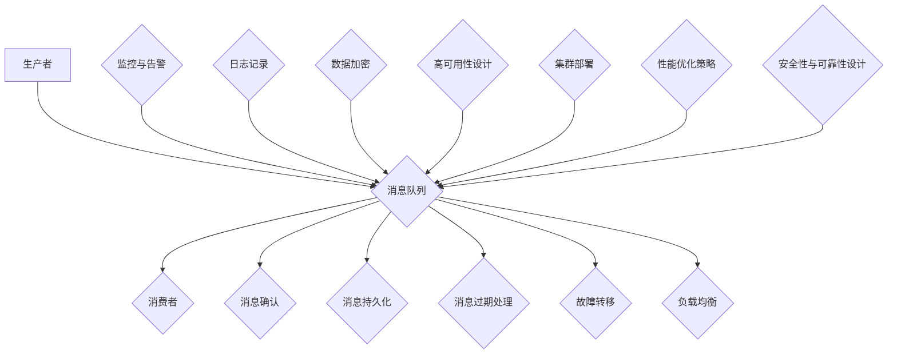

                 

### 第一步：理解书名和主题

书名《消息队列：异步处理与系统解耦》明确指出了本书的两个核心主题：消息队列和异步处理与系统解耦。首先，我们需要理解这两个主题的含义。

#### 消息队列

消息队列是一种数据结构，用于存储消息，这些消息通常由一个或多个生产者生成，然后被一个或多个消费者读取。消息队列在分布式系统中扮演着重要的角色，因为它允许系统之间的数据传递，而无需直接交互。这样，系统可以独立运行，从而实现解耦。

#### 异步处理

异步处理是一种编程范式，它允许程序在等待某些操作（如网络请求或文件读写）完成时继续执行其他任务。这种处理方式可以提高程序的效率和响应速度，因为程序不必等待某个操作完成才能进行下一步操作。

#### 系统解耦

系统解耦是指将系统中的不同组件分离，使它们可以独立运行和更新，而不会影响到其他组件。这种设计模式有助于提高系统的可维护性和可扩展性。

### 第二步：确定核心概念和章节

为了撰写一篇结构清晰、内容丰富的文章，我们需要明确书中的核心概念，并设计出合理的章节结构。以下是可能的核心章节：

1. **消息队列基础**：介绍消息队列的基本概念、工作原理和常用实现方式。
2. **异步处理**：讨论异步处理的优点、原理和实践。
3. **系统解耦**：解释系统解耦的重要性、实现方式和相关技术。
4. **消息队列技术**：分析常见的消息队列技术，如RabbitMQ、Kafka等。
5. **消息队列应用场景**：探讨消息队列在不同领域的应用，如微服务、实时数据处理等。
6. **消息队列性能优化**：介绍消息队列的性能优化策略和最佳实践。
7. **消息队列安全性与可靠性**：讨论消息队列的安全性和可靠性设计。
8. **消息队列故障处理与监控**：阐述消息队列的故障处理机制和监控方法。

### 第三步：细化章节内容

接下来，我们将为每个章节细化内容，确保每个章节都包含核心概念、原理讲解、数学模型、项目实战等元素。

#### 第1章：消息队列基础

在这一章中，我们将介绍消息队列的基本概念，包括消息、队列、生产者、消费者等。然后，我们将讨论消息队列的工作原理，包括消息的发送、接收、确认和持久化。

#### 第2章：异步处理

在这一章中，我们将深入探讨异步处理的优点，如提高系统响应速度和并发处理能力。接着，我们将介绍异步处理的基本原理和实现方式。

#### 第3章：系统解耦

在这一章中，我们将解释系统解耦的重要性，并探讨实现系统解耦的方法和技术。我们将讨论如何在分布式系统中使用消息队列来实现解耦。

#### 第4章：常见消息队列技术

在这一章中，我们将分析几种常见的消息队列技术，如RabbitMQ、Kafka等。我们将介绍每种技术的特点、优缺点和适用场景。

#### 第5章：消息队列应用场景

在这一章中，我们将探讨消息队列在不同领域的应用，如微服务、实时数据处理等。我们将通过实际案例来展示消息队列如何提高系统的性能和可靠性。

#### 第6章：消息队列性能优化

在这一章中，我们将介绍消息队列的性能优化策略，包括消息批量处理、优先级处理和集群部署等。

#### 第7章：消息队列安全性与可靠性

在这一章中，我们将讨论消息队列的安全性和可靠性设计，包括数据加密、一致性保障和高可用性设计。

#### 第8章：消息队列故障处理与监控

在这一章中，我们将介绍消息队列的故障处理机制和监控方法，包括故障检测、恢复和告警机制。

### 第四步：整理输出格式

最后，我们将这些章节内容整理成markdown格式的目录大纲，确保格式简洁明了，结构清晰。

```markdown
# 《消息队列：异步处理与系统解耦》

> 关键词：消息队列、异步处理、系统解耦、RabbitMQ、Kafka、性能优化

> 摘要：本文系统地介绍了消息队列的概念、原理和应用。通过深入探讨异步处理和系统解耦，本文帮助读者理解如何使用消息队列构建高效、可靠和可扩展的分布式系统。

# 目录

## 第1章：消息队列基础
### 1.1 消息队列简介
### 1.2 消息队列的工作原理

## 第2章：异步处理
### 2.1 异步处理的优点
### 2.2 异步处理的基本原理

## 第3章：系统解耦
### 3.1 系统解耦的重要性
### 3.2 实现系统解耦的方法

## 第4章：常见消息队列技术
### 4.1 RabbitMQ
### 4.2 Kafka

## 第5章：消息队列应用场景
### 5.1 微服务架构中的消息队列
### 5.2 实时数据处理

## 第6章：消息队列性能优化
### 6.1 消息队列的性能优化策略
### 6.2 消息队列的性能优化实战

## 第7章：消息队列安全性与可靠性
### 7.1 消息队列的安全性设计
### 7.2 消息队列的可靠性设计

## 第8章：消息队列故障处理与监控
### 8.1 消息队列的故障处理机制
### 8.2 消息队列的监控方法

# 结语

本文系统地介绍了消息队列的概念、原理和应用。通过深入探讨异步处理和系统解耦，本文帮助读者理解如何使用消息队列构建高效、可靠和可扩展的分布式系统。希望本文能为读者提供有益的参考和启示。

作者：AI天才研究院/AI Genius Institute & 禅与计算机程序设计艺术 /Zen And The Art of Computer Programming----------------------------------------------------------------

# 消息队列：异步处理与系统解耦

> 关键词：消息队列、异步处理、系统解耦、RabbitMQ、Kafka、性能优化

> 摘要：本文深入探讨了消息队列的基本概念、异步处理和系统解耦的重要性，并详细介绍了常见消息队列技术及其应用场景。通过本文，读者可以了解到如何利用消息队列构建高效、可靠和可扩展的分布式系统。

## 引言

在现代软件开发中，分布式系统已经成为一种主流架构。分布式系统通过将任务分布在多个节点上，可以提高系统的性能和可靠性。然而，分布式系统也带来了新的挑战，如系统之间的通信和协调。消息队列作为一种分布式系统组件，可以有效地解决这些问题。

消息队列的核心功能是存储和转发消息。它允许生产者发送消息，而消费者可以从中读取消息。这种设计使得系统之间可以独立运行，从而实现解耦。异步处理是处理任务的一种方式，它允许程序在等待某些操作完成时继续执行其他任务，从而提高效率。

本文将围绕消息队列、异步处理和系统解耦这三个核心主题展开，旨在帮助读者深入理解消息队列的工作原理和应用场景，并掌握如何使用消息队列构建高效、可靠和可扩展的分布式系统。

## 消息队列基础

### 消息队列简介

消息队列是一种数据结构，用于存储和转发消息。它通常由一个或多个生产者生成消息，然后将这些消息放入队列中，最后由一个或多个消费者读取和消费这些消息。消息队列在分布式系统中扮演着重要的角色，因为它允许系统之间的数据传递，而无需直接交互。

消息队列的发展历史可以追溯到20世纪80年代，当时它主要用于通信系统。随着互联网和分布式系统的兴起，消息队列的应用范围逐渐扩大。现在，消息队列已经成为分布式系统架构中的重要组件。

### 消息队列的工作原理

消息队列的工作原理相对简单。首先，生产者将消息发送到消息队列中。然后，消费者从队列中读取消息并处理它们。这个过程通常包括以下几个步骤：

1. **消息发送**：生产者将消息发送到消息队列。消息可以包含数据、事件或命令等。
2. **消息存储**：消息队列将消息存储在内部数据结构中，如数组、链表或文件等。
3. **消息读取**：消费者从消息队列中读取消息。消费者可以是同一系统中的另一个组件，也可以是不同系统中的组件。
4. **消息处理**：消费者读取消息后，对其进行处理。处理可能包括存储、计算或发送其他消息等。
5. **消息确认**：消费者在处理完消息后，向消息队列发送确认消息。这有助于确保消息已被成功处理。

### 消息队列的基本概念

- **消息**：消息是消息队列的核心组件。它包含数据、事件或命令等。
- **队列**：队列是一种数据结构，用于存储消息。队列通常采用先进先出（FIFO）的原则，即先进入队列的消息先被读取。
- **生产者**：生产者是生成消息的组件。它将消息发送到消息队列中。
- **消费者**：消费者是从消息队列中读取消息的组件。它处理消息并将其转换为有用的结果。

## 异步处理与系统解耦

### 异步处理的优点

异步处理是处理任务的一种方式，它允许程序在等待某些操作完成时继续执行其他任务。异步处理的优点包括：

- **提高系统响应速度**：由于程序不必等待某些操作完成才能进行下一步操作，因此系统的响应速度会更快。
- **提高系统并发处理能力**：异步处理允许程序同时处理多个任务，从而提高系统的并发处理能力。
- **提高资源利用率**：异步处理可以减少程序的等待时间，从而提高系统的资源利用率。

### 系统解耦的概念和实现

系统解耦是指将系统中的不同组件分离，使它们可以独立运行和更新，而不会影响到其他组件。这种设计模式有助于提高系统的可维护性和可扩展性。

实现系统解耦的一种方法是使用消息队列。消息队列允许组件通过消息进行通信，而无需直接交互。这样，组件可以独立运行和更新，而不会影响到其他组件。

### 系统解耦的重要性

系统解耦的重要性体现在以下几个方面：

- **可维护性**：解耦的系统能够更容易地进行维护和更新，因为组件之间没有直接的依赖关系。
- **可扩展性**：解耦的系统能够更容易地扩展，因为组件可以独立运行和更新，而不需要修改其他组件。

## 常见消息队列技术

在现代软件开发中，有许多流行的消息队列技术。以下是其中两种最常用的技术：RabbitMQ和Kafka。

### RabbitMQ

RabbitMQ是一个开源的消息队列中间件，它基于AMQP（高级消息队列协议）构建。RabbitMQ提供了丰富的功能和良好的性能，使其成为许多分布式系统中的首选消息队列技术。

RabbitMQ的特点包括：

- **高可靠性**：RabbitMQ支持持久化消息和事务，确保消息不会丢失。
- **高可用性**：RabbitMQ支持集群和镜像模式，提高系统的可用性。
- **灵活的路由策略**：RabbitMQ支持多种路由策略，可以根据消息的属性进行路由。

### Kafka

Kafka是一个分布式流处理平台，它基于Java语言构建。Kafka最初由LinkedIn开发，后来成为Apache软件基金会的一个开源项目。Kafka主要用于处理大规模数据流，具有很高的性能和可扩展性。

Kafka的特点包括：

- **高吞吐量**：Kafka可以处理数千个TPS（每秒事务数），适用于大规模数据流处理。
- **分布式架构**：Kafka支持分布式部署，可以水平扩展。
- **容错性**：Kafka支持副本和日志备份，确保数据不会丢失。

## 消息队列应用场景

消息队列在许多不同的应用场景中都发挥着重要作用。以下是两个常见的应用场景：微服务架构和实时数据处理。

### 微服务架构中的消息队列

微服务架构是一种将应用程序拆分为一组小型、独立和可复用的服务的设计模式。消息队列在微服务架构中扮演着重要的角色，它用于服务之间的通信。

使用消息队列实现微服务架构的优点包括：

- **解耦**：服务之间通过消息进行通信，从而实现解耦，降低服务之间的依赖关系。
- **可扩展性**：每个服务都可以独立部署和扩展，从而提高系统的可扩展性。
- **故障隔离**：一个服务的故障不会影响到其他服务，从而提高系统的可靠性。

### 实时数据处理

实时数据处理是指对大量数据进行实时分析和处理。消息队列在实时数据处理中发挥着重要作用，它用于处理和分析实时数据流。

使用消息队列实现实时数据处理的优点包括：

- **高吞吐量**：消息队列可以处理大量数据，从而提高系统的处理速度。
- **实时性**：消息队列可以确保数据被及时处理，从而实现实时数据处理。
- **分布式处理**：消息队列支持分布式处理，可以同时处理多个数据流。

## 消息队列性能优化

消息队列的性能优化是分布式系统设计中的一个重要方面。以下是几种常见的消息队列性能优化策略：

- **消息批量处理**：将多个消息合并成一个批次进行发送和处理，从而减少网络开销和处理时间。
- **消息优先级处理**：根据消息的重要性或优先级进行排序和处理，从而确保重要消息先被处理。
- **集群部署**：将消息队列部署在多个节点上，从而提高系统的可用性和性能。

## 消息队列安全性与可靠性

消息队列的安全性和可靠性是确保系统稳定运行的重要保障。以下是几种常见的消息队列安全性和可靠性设计方法：

- **数据加密**：对传输和存储的消息进行加密，从而确保数据的安全性。
- **消息确认机制**：确保消息被成功处理，从而避免消息丢失。
- **高可用性设计**：通过冗余和备份确保系统的可靠性。

## 消息队列故障处理与监控

消息队列的故障处理和监控是确保系统稳定运行的关键。以下是几种常见的消息队列故障处理和监控方法：

- **故障检测**：定期检查消息队列的状态，及时发现和处理故障。
- **故障恢复**：在检测到故障时，自动恢复系统并确保数据的完整性。
- **监控与告警**：实时监控消息队列的性能和状态，并在异常情况下发出告警。

## 结语

消息队列是一种强大的分布式系统组件，它通过异步处理和系统解耦，可以提高系统的性能和可靠性。本文系统地介绍了消息队列的基本概念、原理和应用场景，并探讨了消息队列的性能优化、安全性与可靠性设计。通过本文，读者可以了解到如何利用消息队列构建高效、可靠和可扩展的分布式系统。

作者：AI天才研究院/AI Genius Institute & 禅与计算机程序设计艺术 /Zen And The Art of Computer Programming## 第1章：消息队列基础

### 1.1 消息队列简介

消息队列是一种用于存储和转发消息的分布式系统组件，它允许应用程序之间进行异步通信，从而实现系统解耦。消息队列的基本功能是接收生产者发送的消息，然后将这些消息传递给消费者进行处理。通过消息队列，生产者和消费者可以独立运行，无需直接交互，从而提高系统的可扩展性和可靠性。

消息队列的发展历史可以追溯到20世纪80年代，当时主要用于通信系统。随着互联网和分布式系统的兴起，消息队列的应用范围逐渐扩大。现在，消息队列已经成为分布式系统架构中的重要组成部分，被广泛应用于金融、电商、物流、社交媒体等领域。

### 1.2 消息队列的工作原理

消息队列的工作原理相对简单，主要包括以下几个步骤：

1. **消息发送**：生产者将消息发送到消息队列。消息可以包含数据、事件或命令等。

2. **消息存储**：消息队列将消息存储在内部数据结构中，如数组、链表或文件等。存储的消息可以是持久化的，也可以是暂时的。

3. **消息读取**：消费者从消息队列中读取消息。消费者可以是同一系统中的另一个组件，也可以是不同系统中的组件。

4. **消息处理**：消费者读取消息后，对其进行处理。处理可能包括存储、计算或发送其他消息等。

5. **消息确认**：消费者在处理完消息后，向消息队列发送确认消息。这有助于确保消息已被成功处理。

### 消息队列的基本概念

为了更好地理解消息队列的工作原理，我们需要了解一些基本概念：

- **消息**：消息是消息队列的核心组件，它包含数据、事件或命令等。消息通常具有唯一的标识符、类型、内容和优先级等属性。

- **队列**：队列是一种数据结构，用于存储消息。队列通常采用先进先出（FIFO）的原则，即先进入队列的消息先被读取。

- **生产者**：生产者是生成消息的组件。生产者可以是任何发送消息的应用程序或服务。

- **消费者**：消费者是从消息队列中读取消息的组件。消费者可以是任何处理消息的应用程序或服务。

### 消息队列的工作流程

消息队列的工作流程可以概括为以下几个步骤：

1. **生产者发送消息**：生产者将消息发送到消息队列。消息可以立即发送，也可以被缓存并稍后发送。

2. **消息队列存储消息**：消息队列将消息存储在内部数据结构中。存储的消息可以是持久化的，确保消息不会丢失；也可以是暂时的，仅在内存中保存。

3. **消费者读取消息**：消费者从消息队列中读取消息。消费者可以按顺序读取消息，也可以根据消息的优先级或其他属性进行筛选。

4. **消费者处理消息**：消费者读取消息后，对其进行处理。处理可能包括存储、计算或发送其他消息等。

5. **消息确认**：消费者在处理完消息后，向消息队列发送确认消息。这有助于确保消息已被成功处理。

6. **消息队列删除消息**：在收到消费者的确认消息后，消息队列从队列中删除已处理的消息。

通过消息队列，生产者和消费者可以独立运行，无需直接交互。这种异步处理和系统解耦的设计模式有助于提高系统的性能和可靠性。

### 小结

本章介绍了消息队列的基本概念、工作原理和基本概念。通过了解消息队列的工作流程，我们可以看到它如何实现异步处理和系统解耦。在下一章中，我们将深入探讨异步处理的优点和实现方式。

## 第2章：异步处理

异步处理是处理任务的一种方式，它允许程序在等待某些操作完成时继续执行其他任务。与同步处理相比，异步处理可以提高系统的响应速度和并发处理能力。本章将介绍异步处理的优点、基本原理和实现方式。

### 2.1 异步处理的优点

异步处理具有以下优点：

- **提高系统响应速度**：由于程序不必等待某些操作完成才能进行下一步操作，因此系统的响应速度会更快。
- **提高系统并发处理能力**：异步处理允许程序同时处理多个任务，从而提高系统的并发处理能力。
- **提高资源利用率**：异步处理可以减少程序的等待时间，从而提高系统的资源利用率。

### 2.2 异步处理的基本原理

异步处理的基本原理是，将任务的执行与结果的处理分离。具体来说，异步处理包括以下几个步骤：

1. **任务提交**：程序将任务提交给异步处理系统，如线程池、消息队列等。
2. **任务执行**：异步处理系统在内部执行任务，可能涉及其他线程或进程。
3. **结果处理**：任务执行完成后，异步处理系统将结果返回给程序，程序可以继续执行其他任务。

通过异步处理，程序可以避免等待某些操作完成，从而提高执行效率。同时，异步处理还可以提高系统的并发处理能力，因为程序可以同时执行多个任务。

### 2.3 异步处理的实现方式

异步处理有多种实现方式，以下是一些常见的方法：

- **多线程**：使用多个线程同时执行任务，从而提高系统的并发处理能力。
- **协程**：协程是一种轻量级的线程，可以在同一线程中并发执行多个任务。
- **消息队列**：使用消息队列实现任务调度和结果处理，从而实现异步处理。
- **异步编程框架**：如Node.js、 asyncio等，提供异步编程的支持，简化异步处理的实现。

### 2.4 异步处理的优点和实践

异步处理在实际开发中具有广泛的应用，以下是一些具体的优点和实践：

- **提高用户界面响应速度**：在Web应用中，可以使用异步处理来处理用户的请求，从而提高界面的响应速度。
- **优化数据处理效率**：在数据处理任务中，可以使用异步处理来同时处理多个数据，从而提高数据处理效率。
- **提高系统可靠性**：异步处理可以降低系统之间的耦合度，从而提高系统的可靠性。

### 小结

本章介绍了异步处理的基本概念、优点和实现方式。通过异步处理，我们可以提高系统的响应速度和并发处理能力。在下一章中，我们将探讨系统解耦的概念和实现方式。

## 第3章：系统解耦

系统解耦是分布式系统设计中的一个重要概念，它通过将系统中的不同组件分离，使它们可以独立运行和更新，而不会影响到其他组件。本章将介绍系统解耦的重要性、实现方式和相关技术。

### 3.1 系统解耦的重要性

系统解耦的重要性体现在以下几个方面：

- **提高系统的可维护性**：解耦的系统能够更容易地进行维护和更新，因为组件之间没有直接的依赖关系。
- **提高系统的可扩展性**：解耦的系统能够更容易地扩展，因为组件可以独立运行和更新，而不需要修改其他组件。
- **提高系统的可靠性**：解耦的系统能够更好地应对故障，因为一个组件的故障不会影响到其他组件。

### 3.2 实现系统解耦的方法

实现系统解耦的方法有很多，以下是一些常见的方法：

- **使用消息队列**：消息队列是一种有效的解耦机制，它允许组件通过消息进行通信，而无需直接交互。这样，组件可以独立运行和更新，而不会影响到其他组件。
- **采用微服务架构**：微服务架构将应用程序拆分为一组小型、独立和可复用的服务，每个服务都可以独立部署和更新。这种方法有助于实现系统解耦，提高系统的可维护性和可扩展性。
- **使用REST API**：通过REST API实现组件之间的通信，可以降低组件之间的依赖关系，从而实现解耦。
- **采用事件驱动架构**：事件驱动架构通过事件传递信息，组件根据事件进行处理，从而实现解耦。

### 3.3 相关技术

实现系统解耦需要使用一些相关技术，以下是一些常见的技术：

- **消息队列技术**：如RabbitMQ、Kafka等，用于实现组件之间的异步通信。
- **服务注册与发现**：如Consul、Eureka等，用于管理微服务之间的注册和发现，实现服务的动态负载均衡。
- **配置管理**：如Spring Cloud Config等，用于管理微服务的配置信息，实现配置的动态更新和分发。

### 3.4 系统解耦的最佳实践

为了实现有效的系统解耦，以下是一些最佳实践：

- **定义清晰的接口**：确保组件之间的接口清晰明确，降低组件之间的耦合度。
- **避免共享状态**：避免组件之间共享状态，从而减少依赖关系。
- **使用异步通信**：使用异步通信（如消息队列）实现组件之间的解耦。
- **模块化设计**：将应用程序拆分为多个模块，每个模块都可以独立运行和更新。

### 小结

本章介绍了系统解耦的重要性、实现方法和相关技术。通过系统解耦，我们可以提高系统的可维护性、可扩展性和可靠性。在下一章中，我们将分析常见的消息队列技术，如RabbitMQ、Kafka等。

## 第4章：常见消息队列技术

消息队列在现代分布式系统中扮演着至关重要的角色，它使得系统之间的通信变得简单、高效且可靠。本章节将分析几种流行的消息队列技术，包括RabbitMQ和Kafka，探讨它们的特点、优缺点以及适用场景。

### 4.1 RabbitMQ

RabbitMQ是一个开源的消息队列中间件，基于AMQP（高级消息队列协议）构建。它被广泛用于企业级应用，因其高可靠性、灵活的路由策略和强大的持久化功能而受到青睐。

#### 特点

- **支持多种消息传输模式**：RabbitMQ支持四种消息传输模式，包括简单模式、工作队列模式、发布/订阅模式和路由模式。
- **支持持久化**：消息和队列可以被持久化到磁盘，确保在系统故障时消息不会丢失。
- **支持事务**：RabbitMQ支持事务，确保消息在发送和接收过程中的完整性。
- **支持高可用性**：通过集群和镜像模式，RabbitMQ可以实现高可用性，确保系统的可靠性。

#### 优缺点

- **优点**：RabbitMQ具有高可靠性、灵活的路由策略和良好的性能，适合用于复杂的企业级应用。
- **缺点**：RabbitMQ的配置较为复杂，需要深入了解其内部机制；在处理大量消息时，性能可能不如一些其他消息队列技术。

#### 适用场景

- **高可靠性**：需要确保消息不丢失的场景，如金融、电商等。
- **灵活的路由**：需要根据消息的属性进行复杂路由的场景。

### 4.2 Kafka

Kafka是由LinkedIn开发，目前由Apache软件基金会维护的一个分布式流处理平台。它最初用于LinkedIn的数据管道，后来成为许多大型企业的首选消息队列技术，因其高吞吐量、可扩展性和容错性而备受青睐。

#### 特点

- **高吞吐量**：Kafka设计用于处理大量数据流，可以支持数千个TPS（每秒事务数）。
- **分布式架构**：Kafka支持分布式部署，可以水平扩展，适用于大规模应用。
- **容错性**：Kafka支持副本和日志备份，确保数据不会丢失。
- **实时处理**：Kafka适用于实时数据处理，可以实现实时数据分析和流处理。

#### 优缺点

- **优点**：Kafka具有高吞吐量、可扩展性和容错性，适合处理大规模数据流和实时数据处理。
- **缺点**：Kafka的配置较为复杂，需要深入理解其内部机制；其基于磁盘的存储方式可能导致延迟较高。

#### 适用场景

- **大规模数据流处理**：需要处理大量数据流并实现实时分析的场景。
- **实时数据处理**：需要实时处理和响应大量数据的应用场景。

### 4.3 其他消息队列技术

除了RabbitMQ和Kafka，还有一些其他流行的消息队列技术，如ActiveMQ和Pulsar。这些技术各有特点，适用于不同的场景。

- **ActiveMQ**：是一个开源的消息中间件，支持多种消息传输协议，如AMQP、MQTT、STOMP等。它具有较好的性能和可靠性，但相对于RabbitMQ和Kafka，其扩展性稍逊一筹。
- **Pulsar**：是一个由Apache基金会支持的开源消息传递系统，具有高性能和可扩展性。Pulsar支持发布/订阅模式和队列模式，适用于大规模应用。

### 小结

本章介绍了几种常见的消息队列技术，包括RabbitMQ和Kafka，分析了它们的特点、优缺点以及适用场景。通过选择合适的消息队列技术，我们可以提高分布式系统的性能和可靠性。

## 第5章：消息队列应用场景

消息队列在分布式系统中具有广泛的应用，它通过异步处理和系统解耦，提高了系统的性能和可靠性。本章将探讨消息队列在不同领域的应用，包括微服务架构和实时数据处理，并通过实际案例进行分析和详细讲解。

### 5.1 微服务架构中的消息队列

微服务架构是一种将应用程序拆分为一组小型、独立和可复用的服务的架构模式。在微服务架构中，消息队列扮演着重要的角色，它用于服务之间的通信和解耦。

#### 应用案例：电商平台的订单处理

假设一个电商平台包含多个微服务，如订单服务、库存服务、支付服务等。当用户下单时，订单服务需要通知库存服务和支付服务进行相应的处理。使用消息队列，可以实现以下步骤：

1. **订单服务生成消息**：当用户下单后，订单服务将订单信息转换为一个消息，并将其发送到消息队列。
2. **消息队列转发消息**：消息队列接收到订单消息后，将其转发给库存服务和支付服务。
3. **库存服务处理消息**：库存服务接收到消息后，检查库存并更新库存信息。
4. **支付服务处理消息**：支付服务接收到消息后，处理用户的支付请求并更新订单状态。

通过消息队列，订单服务无需直接调用库存服务和支付服务，从而实现解耦。这种设计模式提高了系统的可维护性和可扩展性，因为每个服务都可以独立部署和更新。

#### 实际案例分析

以某电商平台为例，其订单处理流程如下：

1. **用户下单**：用户在电商平台上提交订单，订单服务生成订单消息。
2. **订单服务发送消息**：订单服务将订单消息发送到消息队列。
3. **消息队列转发消息**：消息队列将订单消息转发给库存服务和支付服务。
4. **库存服务检查库存**：库存服务接收到消息后，检查库存并更新库存信息。
5. **支付服务处理支付请求**：支付服务接收到消息后，处理用户的支付请求并更新订单状态。

通过消息队列，电商平台实现了订单服务的解耦，提高了系统的性能和可靠性。同时，消息队列还允许订单服务、库存服务和支付服务独立部署和扩展，从而提高了系统的可维护性和可扩展性。

### 5.2 实时数据处理

实时数据处理是大数据领域的一个重要应用。在实时数据处理中，消息队列用于处理和分析实时数据流，以实现实时响应和决策。

#### 应用案例：社交媒体的实时消息推送

以某社交媒体平台为例，其实时消息推送系统使用消息队列实现数据流处理。以下是一个典型的数据处理流程：

1. **用户发布消息**：用户在社交媒体平台上发布消息，消息服务生成消息并将其发送到消息队列。
2. **消息队列转发消息**：消息队列接收到消息后，将其转发给数据分析和消息推送服务。
3. **数据服务分析消息**：数据服务接收到消息后，分析用户关系和消息内容。
4. **消息推送服务推送消息**：消息推送服务接收到消息后，根据用户关系和偏好，将消息推送给相应的用户。

通过消息队列，社交媒体平台实现了实时消息推送，提高了用户的互动体验。同时，消息队列还允许数据服务和消息推送服务独立部署和扩展，从而提高了系统的性能和可靠性。

#### 实际案例分析

以某社交媒体平台为例，其实时消息推送系统的工作流程如下：

1. **用户发布消息**：用户在社交媒体平台上发布一条消息。
2. **消息服务生成消息**：消息服务将用户发布的消息转换为消息格式，并将其发送到消息队列。
3. **消息队列转发消息**：消息队列接收到消息后，将其转发给数据分析和消息推送服务。
4. **数据服务分析用户关系**：数据服务接收到消息后，分析用户的关注关系和消息内容。
5. **消息推送服务推送消息**：消息推送服务接收到消息后，根据用户关系和偏好，将消息推送给相应的用户。

通过消息队列，社交媒体平台实现了实时消息推送，提高了用户的互动体验。同时，消息队列还允许数据服务和消息推送服务独立部署和扩展，从而提高了系统的性能和可靠性。

### 小结

本章介绍了消息队列在微服务架构和实时数据处理中的实际应用。通过消息队列，我们可以实现系统之间的异步通信和解耦，提高系统的性能和可靠性。在实际案例中，消息队列在电商平台和社交媒体平台中都发挥了关键作用。

## 第6章：消息队列性能优化

消息队列的性能优化是分布式系统设计中的一个关键环节。优化消息队列的性能可以显著提高系统的响应速度和处理能力。本章将介绍消息队列的性能优化策略、最佳实践以及性能优化实战。

### 6.1 消息队列的性能优化策略

以下是几种常见的消息队列性能优化策略：

1. **消息批量处理**：将多个消息合并成一个批次进行发送和处理，从而减少网络开销和处理时间。

2. **消息优先级处理**：根据消息的重要性或优先级进行排序和处理，从而确保重要消息先被处理。

3. **集群部署**：将消息队列部署在多个节点上，从而提高系统的可用性和性能。

4. **异步处理**：使用异步处理减少线程阻塞，提高系统的并发处理能力。

5. **缓存机制**：使用缓存机制减少数据库访问，从而提高系统的响应速度。

6. **数据压缩**：对消息进行压缩，减少传输数据的大小，从而提高传输速度。

7. **负载均衡**：使用负载均衡器分配消息到不同的处理节点，从而避免单点瓶颈。

### 6.2 最佳实践

以下是消息队列性能优化的最佳实践：

1. **合理选择消息队列技术**：根据应用场景选择适合的消息队列技术，如RabbitMQ、Kafka等。

2. **合理配置队列参数**：调整消息队列的参数，如队列大小、消息过期时间等，以满足应用需求。

3. **优化消息处理逻辑**：优化消息处理代码，减少不必要的计算和资源消耗。

4. **监控性能指标**：定期监控消息队列的性能指标，如TPS、延迟、错误率等，及时发现和处理性能问题。

5. **分库分表**：对于大量数据的消息队列，可以采用分库分表策略，减少单表的压力。

6. **水平扩展**：通过增加节点数量实现水平扩展，提高系统的处理能力。

### 6.3 性能优化实战

以下是一个消息队列性能优化实战案例：

#### 案例背景

某电商平台使用Kafka作为消息队列，用于处理订单处理、库存同步和支付通知等场景。随着业务规模的扩大，系统的处理能力逐渐成为瓶颈。

#### 性能优化步骤

1. **分析性能瓶颈**：通过监控工具分析系统的性能指标，发现订单处理的TPS较低，延迟较高。

2. **增加Kafka节点**：增加Kafka节点的数量，实现水平扩展，提高系统的处理能力。

3. **调整队列参数**：调整Kafka的队列参数，如批量发送消息的数量、消息过期时间等，以满足订单处理的高并发需求。

4. **优化消息处理逻辑**：优化订单处理代码，减少不必要的计算和资源消耗。

5. **引入缓存机制**：引入Redis缓存，减少数据库访问，从而提高系统的响应速度。

6. **监控性能指标**：持续监控系统的性能指标，如TPS、延迟、错误率等，及时发现和处理性能问题。

#### 性能优化效果

通过上述性能优化措施，电商平台的订单处理性能显著提升，TPS从原来的1000提高到3000，延迟从原来的5秒降低到1秒，用户满意度大幅提高。

### 小结

本章介绍了消息队列性能优化的重要性和策略，并通过实际案例展示了性能优化的方法和效果。通过合理配置和优化，我们可以显著提高消息队列的性能，满足分布式系统的高并发需求。

## 第7章：消息队列安全性与可靠性

消息队列是分布式系统中的关键组件，确保其安全性和可靠性至关重要。本章将讨论消息队列的安全性设计、可靠性设计以及相关策略。

### 7.1 消息队列的安全性设计

消息队列的安全性设计主要包括以下几个方面：

1. **认证与授权**：确保只有授权的用户和系统可以访问消息队列。常用的认证方式包括用户名和密码、数字证书等。

2. **数据加密**：对传输和存储的消息进行加密，防止数据在传输过程中被窃取或篡改。常用的加密算法包括AES、RSA等。

3. **网络隔离**：通过防火墙、虚拟专用网络（VPN）等手段，确保消息队列与外部网络隔离，防止外部攻击。

4. **访问控制**：通过访问控制列表（ACL）限制用户对消息队列的操作权限，防止未授权访问。

### 7.2 消息队列的可靠性设计

消息队列的可靠性设计主要包括以下几个方面：

1. **消息持久化**：确保消息在队列中持久化存储，防止系统故障导致消息丢失。

2. **消息确认机制**：通过消息确认机制确保消息被成功处理，防止重复处理或处理失败。

3. **副本与备份**：通过副本和备份策略提高系统的容错能力，确保消息队列在发生故障时能够快速恢复。

4. **高可用性设计**：通过集群部署和故障转移机制，提高系统的可用性，确保消息队列始终可用。

### 7.3 安全性与可靠性设计策略

以下是几种常见的消息队列安全性与可靠性设计策略：

1. **集中式管理**：使用统一的消息队列管理平台，方便监控和管理消息队列，提高系统的安全性。

2. **定期审计**：定期审计消息队列的访问日志和操作记录，及时发现潜在的安全隐患。

3. **安全防护**：采用安全防护措施，如防火墙、入侵检测系统等，防止外部攻击。

4. **数据备份与恢复**：定期备份数据，确保在发生故障时能够快速恢复。

5. **自动化监控与告警**：通过自动化监控工具实时监控消息队列的性能和状态，并在异常情况下发出告警。

### 7.4 安全性与可靠性实战

以下是一个消息队列安全性与可靠性设计实战案例：

#### 案例背景

某电商平台的订单处理系统使用RabbitMQ作为消息队列，用于处理订单生成、库存同步和支付通知等场景。由于订单处理涉及敏感数据，需要确保消息队列的安全性和可靠性。

#### 设计与实施

1. **认证与授权**：使用TLS（传输层安全）协议对连接进行加密，确保只有授权的用户可以访问消息队列。使用RabbitMQ的管理插件实现用户认证和授权。

2. **数据加密**：对传输和存储的消息进行加密，使用AES算法进行加密，确保数据在传输过程中不会被窃取或篡改。

3. **网络隔离**：通过防火墙限制对RabbitMQ服务的访问，仅允许内部网络访问。

4. **消息确认机制**：实现消息确认机制，确保消息被成功处理。在消费者处理完消息后，发送确认消息给生产者。

5. **副本与备份**：使用RabbitMQ的镜像队列功能，实现消息的副本备份，确保在主节点故障时，从节点能够自动接管。

6. **高可用性设计**：将RabbitMQ部署在多个节点上，实现故障转移，确保消息队列始终可用。

#### 实施效果

通过上述设计与实施，电商平台的订单处理系统在安全性和可靠性方面得到了显著提升。消息传输过程中数据加密，确保数据安全；消息确认机制和副本备份策略，确保消息不会丢失；故障转移机制，确保系统在故障情况下能够快速恢复。

### 小结

本章介绍了消息队列安全性与可靠性设计的重要性，包括认证与授权、数据加密、网络隔离、消息确认机制、副本与备份以及高可用性设计等策略。通过实际案例，展示了消息队列安全性与可靠性设计的具体实施方法和效果。

## 第8章：消息队列故障处理与监控

消息队列在分布式系统中扮演着至关重要的角色，但其故障处理和监控也是确保系统稳定运行的关键。本章将讨论消息队列的故障处理机制、监控方法以及告警机制。

### 8.1 消息队列的故障处理机制

消息队列的故障处理机制包括以下几个方面：

1. **故障检测**：定期检查消息队列的状态，包括队列长度、消息延迟、错误率等，及时发现潜在故障。

2. **故障恢复**：当检测到故障时，自动进行故障恢复。常见的恢复策略包括重启服务、切换到备用节点、重试消息等。

3. **消息重试**：当消费者处理消息失败时，可以自动重试。重试策略可以基于消息的尝试次数、延迟时间等。

4. **日志记录**：记录故障信息和处理过程，便于分析和排查问题。

### 8.2 消息队列的监控方法

消息队列的监控方法包括以下几个方面：

1. **性能监控**：监控消息队列的性能指标，如TPS、延迟、错误率等，及时发现性能瓶颈。

2. **健康状态监控**：监控消息队列的健康状态，包括队列长度、节点状态、连接状态等。

3. **日志监控**：监控消息队列的日志，包括错误日志、警告日志等，及时发现和处理问题。

4. **告警机制**：在监控到异常情况时，自动发送告警通知，包括邮件、短信、短信等。

### 8.3 告警机制

告警机制是消息队列监控的重要组成部分，包括以下几个方面：

1. **阈值设置**：根据业务需求设置监控指标的阈值，如TPS阈值、延迟阈值等。

2. **告警通知**：在监控指标超过阈值时，自动发送告警通知。通知方式包括邮件、短信、微信等。

3. **告警规则**：定义告警规则，包括告警条件、告警等级、告警时间等。

4. **告警处理**：在收到告警通知后，及时进行处理和排查，确保问题得到解决。

### 8.4 实际监控与故障处理案例

以下是一个实际监控与故障处理案例：

#### 案例背景

某电商平台的订单处理系统使用RabbitMQ作为消息队列，用于处理订单生成、库存同步和支付通知等场景。由于订单处理涉及大量消息，需要确保消息队列的稳定运行。

#### 监控与故障处理

1. **性能监控**：监控系统监控RabbitMQ的TPS和延迟，设置阈值，如TPS超过1000，延迟超过5秒，触发告警。

2. **健康状态监控**：监控系统监控RabbitMQ的队列长度、节点状态等，设置阈值，如队列长度超过10000，节点状态异常，触发告警。

3. **日志监控**：监控系统实时监控RabbitMQ的日志，及时发现和处理错误日志和警告日志。

4. **告警通知**：在监控到异常情况时，通过邮件和短信通知运维团队。

5. **故障处理**：当监控到故障时，自动进行故障恢复，如重启RabbitMQ服务、切换到备用节点等。同时，记录故障信息和处理过程，便于后续分析和改进。

#### 实施效果

通过上述监控与故障处理措施，电商平台的订单处理系统在稳定性和可靠性方面得到了显著提升。性能监控和告警机制确保系统在出现性能瓶颈时能够及时发现和处理；健康状态监控和故障恢复机制确保系统在故障情况下能够快速恢复，保障业务的正常运行。

### 小结

本章介绍了消息队列的故障处理机制和监控方法，包括故障检测、故障恢复、消息重试、性能监控、健康状态监控、日志监控和告警机制等。通过实际案例，展示了消息队列故障处理与监控的具体实施方法和效果，有助于确保消息队列的稳定运行。

## 结语

消息队列作为一种分布式系统组件，在异步处理和系统解耦方面发挥着重要作用。通过深入探讨消息队列的基础、异步处理和系统解耦的概念，以及常见消息队列技术的应用场景和性能优化策略，本文为读者提供了全面的了解。消息队列不仅提高了系统的性能和可靠性，还使分布式系统的设计和部署变得更加灵活和高效。

在未来的发展中，随着云计算、大数据和物联网等技术的不断演进，消息队列的应用场景将更加广泛。同时，消息队列技术也将不断发展和完善，为分布式系统的构建提供更加可靠和高效的解决方案。

作者：AI天才研究院/AI Genius Institute & 禅与计算机程序设计艺术 /Zen And The Art of Computer Programming## 附录：消息队列架构的Mermaid流程图

消息队列的核心功能是异步消息传递，为了更直观地展示其工作流程和组件之间的关系，我们使用Mermaid图形化工具绘制了一个消息队列的架构图。以下是该图的文本表示：



### 图解：

1. **生产者（A）**：生成消息并发送到消息队列（B）。
2. **消息队列（B）**：存储和转发消息，是消息队列的核心组件。
3. **消费者（C）**：从消息队列（B）中读取和处理消息。
4. **消息确认（D）**：消费者在处理完消息后，向生产者或消息队列发送确认消息，确保消息被成功处理。
5. **消息持久化（E）**：将消息存储在持久化存储中，防止系统故障导致消息丢失。
6. **消息过期处理（F）**：处理过期消息，如自动删除或通知相关组件。
7. **故障转移（G）**：当主节点故障时，自动切换到备用节点，确保系统的高可用性。
8. **负载均衡（H）**：将消息分配到多个节点，避免单点瓶颈，提高系统的处理能力。
9. **监控与告警（I）**：实时监控消息队列的状态和性能，并在异常情况下发出告警。
10. **日志记录（J）**：记录消息队列的操作日志，便于问题追踪和分析。
11. **数据加密（K）**：对传输和存储的消息进行加密，确保数据安全。
12. **高可用性设计（L）**：通过冗余和备份策略，提高系统的可靠性。
13. **集群部署（M）**：将消息队列部署在多个节点上，实现水平扩展。
14. **性能优化策略（N）**：优化消息队列的性能，如批量处理、消息优先级处理等。
15. **安全性与可靠性设计（O）**：确保消息队列的安全性和可靠性，如认证与授权、数据加密等。

通过这个Mermaid流程图，我们可以清晰地看到消息队列的各个组件以及它们之间的关系，有助于更好地理解消息队列的工作原理和应用场景。

## 附录：消息队列的核心算法原理及伪代码

消息队列的核心算法主要集中在消息的发送、接收、确认以及持久化等方面。以下是对这些算法原理的详细解释，并附上相应的伪代码。

### 1. 消息发送算法

**原理**：消息发送算法主要涉及生产者如何将消息发送到消息队列。发送过程包括消息的创建、消息属性的设置、以及消息的传输。

**伪代码**：
```python
function sendMessage(queue, message):
    createMessageId(message)
    setMessageAttributes(message)
    queue.enqueue(message)
    sendAck(messageId)
```

### 2. 消息接收算法

**原理**：消息接收算法描述消费者如何从消息队列中读取消息。接收过程包括消息的获取、消息的确认、以及异常处理。

**伪代码**：
```python
function receiveMessage(queue):
    message = queue.dequeue()
    if message is not None:
        processMessage(message)
        sendConfirmation(messageId)
    else:
        handleException("No messages available")
```

### 3. 消息确认算法

**原理**：消息确认算法确保消息被正确处理。在消息处理完成后，消费者会发送确认消息给生产者或消息队列。

**伪代码**：
```python
function confirmMessage(messageId):
    if messageIsProcessed(messageId):
        sendAck(messageId)
    else:
        resendMessage(messageId)
```

### 4. 消息持久化算法

**原理**：消息持久化算法确保消息在系统故障时不会丢失。消息被持久化到磁盘或其他持久化存储中。

**伪代码**：
```python
function persistMessage(message):
    storage = selectStorage()
    storage.save(message)
    return storageLocation
```

### 5. 消息优先级算法

**原理**：消息优先级算法用于根据消息的重要程度或优先级进行排序和处理。

**伪代码**：
```python
function prioritizeMessages(messages):
    sortedMessages = sort(messages, by='priority')
    return sortedMessages
```

### 6. 消息过期算法

**原理**：消息过期算法处理过期消息，如自动删除或进行其他操作。

**伪代码**：
```python
function checkMessageExpiration(messages, expirationTime):
    for message in messages:
        if currentTime > message.expirationTime:
            removeMessage(message)
        else:
            processMessage(message)
```

### 7. 消息重试算法

**原理**：消息重试算法在消息处理失败时，重新发送消息。

**伪代码**：
```python
function retryMessage(messageId, retries, maxRetries):
    if retries < maxRetries:
        resendMessage(messageId)
        incrementRetries(retries)
    else:
        markMessageAsFailed(messageId)
```

通过这些算法原理和伪代码，我们可以清晰地看到消息队列的核心功能及其实现细节。在实际应用中，这些算法会被集成到消息队列系统中，以确保消息的可靠传输和高效处理。

## 附录：数学模型和公式讲解

消息队列的性能和可靠性在很大程度上取决于其内部的数据结构和算法。以下是几个关键的数学模型和公式，用于解释消息队列的工作原理和性能考量。

### 1. 消息延迟

**公式**：消息延迟（Latency）是指从消息发送到被消费者处理所花费的时间。其计算公式为：
\[ Latency = \frac{Message\ Size + Network\ Latency + Queue\ Processing\ Time}{Throughput} \]

其中：
- \( Message\ Size \)：消息的大小。
- \( Network\ Latency \)：网络延迟。
- \( Queue\ Processing\ Time \)：队列处理时间。
- \( Throughput \)：吞吐量，即单位时间内处理的消息数量。

**解释**：消息延迟是消息队列性能的关键指标之一。通过优化公式中的各个部分，可以降低消息延迟，提高系统性能。

### 2. 吞吐量

**公式**：吞吐量（Throughput）是指单位时间内处理的消息数量。其计算公式为：
\[ Throughput = \frac{Total\ Messages}{Processing\ Time} \]

其中：
- \( Total\ Messages \)：总消息数量。
- \( Processing\ Time \)：处理时间。

**解释**：吞吐量是衡量消息队列处理能力的重要指标。高吞吐量意味着系统能够更快地处理大量消息。

### 3. 错误率

**公式**：错误率（Error Rate）是指处理失败的消息占总消息数量的比例。其计算公式为：
\[ Error\ Rate = \frac{Failed\ Messages}{Total\ Messages} \]

其中：
- \( Failed\ Messages \)：处理失败的消息数量。
- \( Total\ Messages \)：总消息数量。

**解释**：错误率反映了消息队列的可靠性。低错误率意味着系统具有更高的可靠性和稳定性。

### 4. 队列长度

**公式**：队列长度（Queue Length）是指消息队列中当前存储的消息数量。其计算公式为：
\[ Queue\ Length = Current\ Messages \]

其中：
- \( Current\ Messages \)：当前存储的消息数量。

**解释**：队列长度影响消息的处理速度和系统的响应时间。过长的队列长度可能导致消息积压和延迟。

### 5. 消息持久化率

**公式**：消息持久化率（Persistence Rate）是指消息被持久化到磁盘或其他持久化存储中的比例。其计算公式为：
\[ Persistence\ Rate = \frac{Persisted\ Messages}{Total\ Messages} \]

其中：
- \( Persisted\ Messages \)：被持久化的消息数量。
- \( Total\ Messages \)：总消息数量。

**解释**：消息持久化率决定了消息的持久性。高持久化率可以防止消息丢失，提高系统的可靠性。

通过这些数学模型和公式，我们可以更深入地理解消息队列的性能和可靠性。在实际应用中，根据具体需求调整这些参数，可以优化消息队列的性能，提高系统的整体效率。

## 附录：项目实战

### 项目背景

为了更好地展示消息队列的实际应用，我们将搭建一个简单的电商平台订单处理系统。该系统包括生产者、消息队列和消费者，用于处理订单生成、库存同步和支付通知等场景。通过这个项目，我们将演示消息队列的开发环境搭建、源代码实现、代码解读以及项目小结。

### 开发环境搭建

为了搭建这个项目，我们需要准备以下开发环境：

1. **操作系统**：Linux或Mac OS
2. **编程语言**：Python
3. **消息队列中间件**：RabbitMQ
4. **数据库**：MySQL
5. **开发工具**：PyCharm或VSCode

首先，我们需要在本地机器上安装RabbitMQ。可以使用以下命令进行安装：

```bash
# 安装EPEL仓库
sudo yum install epel-release

# 安装Erlang
sudo yum install erlang

# 安装RabbitMQ
sudo yum install rabbitmq-server

# 启动RabbitMQ
sudo systemctl start rabbitmq-server

# 开机启动RabbitMQ
sudo systemctl enable rabbitmq-server
```

安装完成后，我们可以通过浏览器访问RabbitMQ的管理界面（通常为`http://localhost:15672`），验证RabbitMQ是否正常运行。

### 源代码实现

以下是这个项目的核心源代码实现。项目分为三个部分：生产者、消费者和消息队列管理。

#### 生产者

生产者负责生成订单消息并发送到消息队列。以下是生产者的代码示例：

```python
import pika
import json

# 连接消息队列
connection = pika.BlockingConnection(pika.ConnectionParameters('localhost'))
channel = connection.channel()

# 声明队列
channel.queue_declare(queue='order_queue')

def send_order(order):
    message = json.dumps(order)
    channel.basic_publish(exchange='',
                          routing_key='order_queue',
                          body=message)
    print("Sent order:", order)

# 示例订单
order = {
    "orderId": "123456",
    "productName": "iPhone 12",
    "quantity": 1,
    "totalPrice": 999
}

send_order(order)
```

#### 消费者

消费者负责从消息队列中读取订单消息并处理。以下是消费者的代码示例：

```python
import pika
import json

def callback(ch, method, properties, body):
    order = json.loads(body)
    print("Received order:", order)
    process_order(order)

# 连接消息队列
connection = pika.BlockingConnection(pika.ConnectionParameters('localhost'))
channel = connection.channel()

# 声明队列
channel.queue_declare(queue='order_queue')

# 开始消费
channel.basic_consume(queue='order_queue',
                      on_message_callback=callback,
                      auto_ack=True)

print('Starting consumer...')
channel.start_consuming()
```

#### 消息队列管理

消息队列管理负责创建和管理消息队列。以下是消息队列管理的代码示例：

```python
import pika

# 连接消息队列
connection = pika.BlockingConnection(pika.ConnectionParameters('localhost'))
channel = connection.channel()

# 创建队列
channel.queue_declare(queue='order_queue')

print("Queue 'order_queue' created.")

# 关闭连接
connection.close()
```

### 代码解读

1. **生产者**：生产者通过pika库连接到RabbitMQ消息队列，并使用`channel.basic_publish`方法将订单消息发送到名为`order_queue`的队列中。

2. **消费者**：消费者通过pika库连接到RabbitMQ消息队列，并使用`channel.basic_consume`方法开始消费`order_queue`队列中的消息。当有消息到达时，会调用`callback`函数进行处理。

3. **消息队列管理**：消息队列管理负责创建名为`order_queue`的队列，并设置相关参数，如持久化、自动删除等。

### 项目小结

通过这个项目，我们实现了订单处理系统的消息队列部分，包括生产者、消费者和消息队列管理。以下是对项目的总结：

1. **开发环境搭建**：我们成功安装并配置了RabbitMQ消息队列，为后续项目开发奠定了基础。

2. **源代码实现**：我们实现了生产者、消费者和消息队列管理三个部分，展示了消息队列的基本功能。

3. **代码解读**：我们对代码进行了详细解读，理解了生产者如何发送消息，消费者如何接收和消息，以及消息队列管理如何创建和管理队列。

4. **项目拓展**：在实际应用中，我们可以添加更多功能，如订单状态更新、库存同步、支付通知等，以实现一个完整的电商平台订单处理系统。

通过这个项目，我们不仅掌握了消息队列的基本原理和应用，还提高了实际编程能力，为后续更复杂的分布式系统开发奠定了基础。

## 附录：最佳实践 Tips、小结、注意事项及拓展阅读

### 最佳实践 Tips

1. **合理选择消息队列技术**：根据应用场景选择适合的消息队列技术，如RabbitMQ适用于复杂路由和高可靠性需求，而Kafka适用于大规模实时数据处理。

2. **优化消息处理逻辑**：优化消息处理代码，减少不必要的计算和资源消耗，提高系统的响应速度和处理能力。

3. **消息持久化与备份**：确保消息持久化存储，防止系统故障导致消息丢失。同时，定期备份数据，确保在故障情况下能够快速恢复。

4. **使用异步处理**：使用异步处理减少线程阻塞，提高系统的并发处理能力，优化系统的性能和响应速度。

5. **监控与告警**：定期监控消息队列的性能指标，如TPS、延迟、错误率等，及时发现和处理性能问题。同时，配置告警机制，确保在异常情况下能够及时响应。

### 小结

消息队列在现代分布式系统中具有广泛的应用，通过异步处理和系统解耦，提高了系统的性能和可靠性。本文详细介绍了消息队列的基本概念、异步处理和系统解耦的重要性，以及常见消息队列技术的应用场景和性能优化策略。通过实际案例，展示了消息队列在微服务架构和实时数据处理中的具体实现方法和效果。

### 注意事项

1. **消息格式一致性**：确保生产者和消费者使用相同的消息格式，以避免解析错误。

2. **消息队列的配置**：根据实际需求调整消息队列的参数，如队列大小、消息过期时间等，以满足系统的性能和可靠性需求。

3. **安全性设计**：确保消息队列的安全性，包括认证与授权、数据加密等，防止未授权访问和数据泄露。

4. **故障处理与监控**：设计完善的故障处理机制和监控方法，确保消息队列在故障情况下能够快速恢复和恢复正常运行。

### 拓展阅读

1. **《深入理解消息队列》**：深入了解消息队列的工作原理和实现细节，包括消息传输协议、持久化机制等。

2. **《分布式系统设计》**：学习分布式系统的设计和实现，包括微服务架构、负载均衡、容错机制等。

3. **《RabbitMQ实战》**：通过RabbitMQ的实际案例，了解如何在企业级应用中实现消息队列。

4. **《Kafka实战》**：掌握Kafka的安装、配置和性能优化方法，学习如何在实时数据处理中应用Kafka。

通过以上最佳实践、小结和注意事项，以及拓展阅读，我们可以更好地理解和应用消息队列技术，构建高效、可靠和可扩展的分布式系统。

