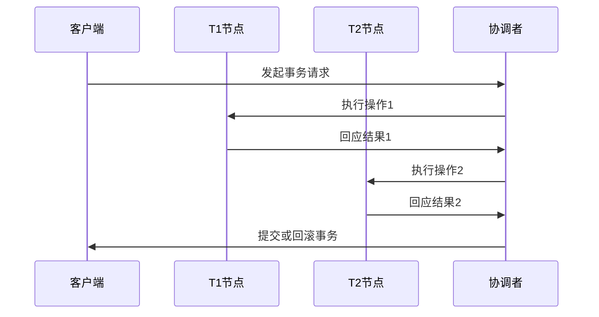
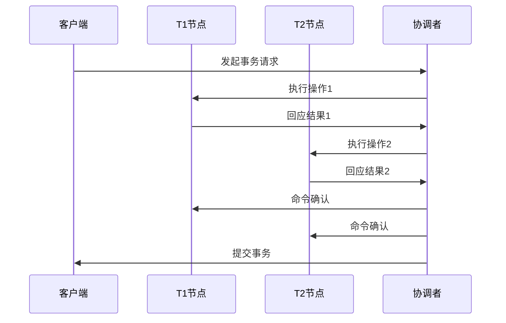
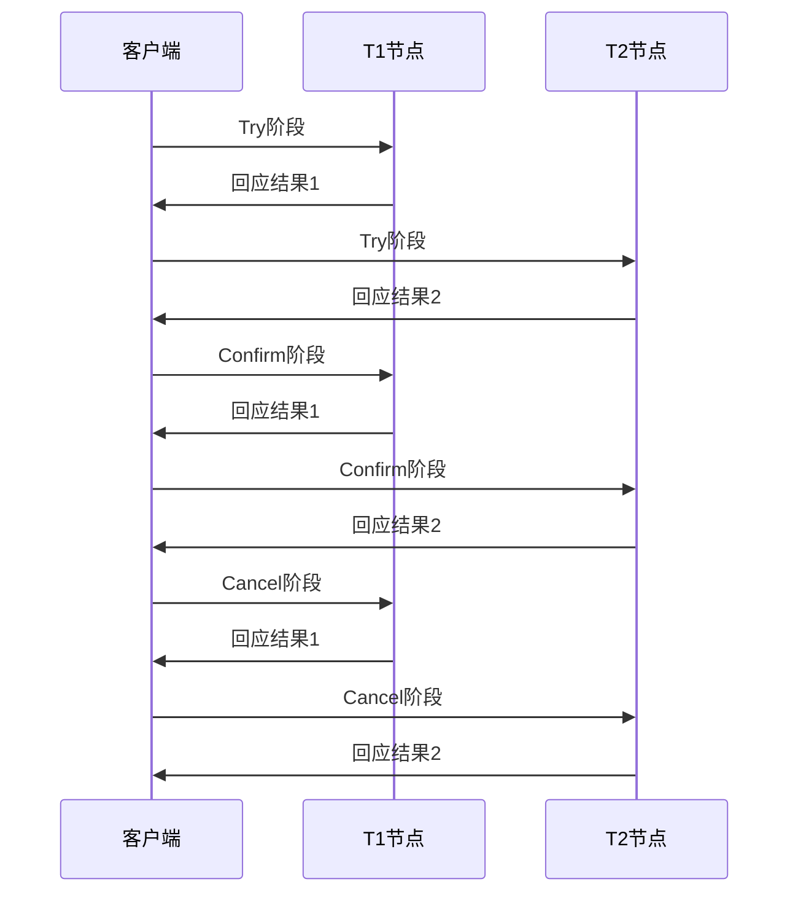

                 


### 《深刻认知分布式事务原理》

#### 关键词：
分布式事务、分布式系统、二阶段提交、三阶段提交、ACID原则、TCC协议、分布式锁、并发控制

#### 摘要：
本文旨在深入探讨分布式事务的原理和实现。分布式事务是分布式系统中至关重要的概念，确保数据的一致性和可靠性。本文将介绍分布式事务的基本概念、ACID原则、分布式事务模型（如二阶段提交、三阶段提交和TCC协议）、分布式锁与并发控制技术，并通过实际案例进行分析和讲解，为读者提供全面的分布式事务认知和实践经验。

## 第一部分：分布式事务基础

### 第1章：分布式系统概述

#### 1.1 分布式系统的基本概念
分布式系统是由多个计算机节点组成的系统，这些节点通过网络进行通信和协作，共同完成计算任务。分布式系统的目的是提高系统的可用性、可扩展性和性能。

#### 1.2 分布式系统的挑战
分布式系统面临诸多挑战，包括网络延迟、故障恢复、数据一致性和安全性等问题。这些挑战需要通过分布式算法和协议来解决。

#### 1.3 分布式系统的体系结构
分布式系统可以采用不同的体系结构，如客户端-服务器模型、对等模型和分布式数据库模型。每种体系结构都有其优势和适用场景。

### 第2章：分布式事务概念

#### 2.1 事务的基本概念
事务是数据库操作的基本单位，保证数据的一致性和原子性。事务可以包含多个操作，这些操作要么全部成功执行，要么全部回滚。

#### 2.2 分布式事务的特点
分布式事务涉及多个数据库节点，需要处理数据的一致性和同步问题。与本地事务相比，分布式事务更复杂，但能够提高系统的可用性和性能。

#### 2.3 分布式事务的类型
分布式事务可以分为两阶段提交（2PC）、三阶段提交（3PC）和TCC（Try、Confirm、Cancel）等类型，每种类型都有其优缺点和适用场景。

### 第3章：分布式事务的ACID原则

#### 3.1 原子性
原子性保证事务的操作要么全部成功执行，要么全部回滚。在任何情况下，都不能出现部分操作成功的情况。

#### 3.2 一致性
一致性确保事务执行后，系统处于正确的状态。数据的一致性是分布式系统的重要保障。

#### 3.3 分隔性
分隔性指分布式事务在执行过程中，可以分隔成多个子事务，分别在不同的节点上执行。分隔性可以提高系统的并行处理能力。

#### 3.4 持久性
持久性保证事务一旦提交，其结果将永久保存。即使系统发生故障，已提交的事务也不会丢失。

## 第二部分：分布式事务原理

### 第4章：分布式事务模型

#### 4.1 二阶段提交协议
**核心概念与联系架构 Mermaid 流程图**

**伪代码**
```pseudo
// 二阶段提交协议伪代码
function twoPhaseCommit(transactionId, operation1, operation2) {
  coordinator.prepare(transactionId, operation1, operation2)
  if (coordinator.commit(transactionId)) {
    operation1.commit()
    operation2.commit()
  } else {
    operation1.rollback()
    operation2.rollback()
  }
}
```

#### 4.2 三阶段提交协议
**核心概念与联系架构 Mermaid 流程图**

**伪代码**
```pseudo
// 三阶段提交协议伪代码
function threePhaseCommit(transactionId, operation1, operation2) {
  coordinator.prepare(transactionId, operation1, operation2)
  if (coordinator.vote(transactionId)) {
    operation1.commit()
    operation2.commit()
  } else {
    operation1.rollback()
    operation2.rollback()
  }
}
```

#### 4.3 TCC（Try、Confirm、Cancel）协议
**核心概念与联系架构 Mermaid 流程图**

**伪代码**
```pseudo
// TCC协议伪代码
function tcc(transactionId, operation1, operation2) {
  operation1.try(transactionId)
  operation2.try(transactionId)
  if (confirm(transactionId)) {
    operation1.confirm(transactionId)
    operation2.confirm(transactionId)
  } else {
    operation1.cancel(transactionId)
    operation2.cancel(transactionId)
  }
}
```

### 第5章：分布式锁与并发控制

#### 5.1 分布式锁的概念
分布式锁是一种控制分布式系统中多个进程或线程对共享资源访问的机制，确保数据的一致性和完整性。

#### 5.2 常见的分布式锁算法
常见的分布式锁算法包括基于数据库的锁、基于Zookeeper的锁和基于Redis的锁。

#### 5.3 并发控制技术
并发控制技术包括乐观锁、悲观锁、时间戳和隔离级别等，用于确保分布式事务的正确执行。

### 第6章：分布式事务的实现与优化

#### 6.1 分布式事务的解决方案
分布式事务的解决方案包括分布式数据库、分布式事务框架和消息队列等。

#### 6.2 分布式事务的性能优化
分布式事务的性能优化包括减少网络通信、优化数据库查询和减少锁竞争等。

#### 6.3 分布式事务的容错机制
分布式事务的容错机制包括故障检测、恢复和重试等，确保系统的高可用性。

## 第三部分：分布式事务项目实战

### 第7章：分布式事务实战案例

#### 7.1 案例一：电商系统的分布式事务
本案例将介绍电商系统中的分布式事务实现，包括订单处理、库存管理和支付流程。

#### 7.2 案例二：银行系统的分布式事务
本案例将分析银行系统中的分布式事务，包括转账、贷款和信用卡支付等场景。

#### 7.3 案例三：社交网络平台的分布式事务
本案例将探讨社交网络平台中的分布式事务，包括用户关系管理、消息推送和内容分发等。

### 第8章：分布式事务开发工具

#### 8.1 分布式事务框架介绍
本章节将介绍常见的分布式事务框架，如Seata、TCC和XID等。

#### 8.2 分布式事务框架的选择与使用
本章节将分析分布式事务框架的优缺点，并提供选择和使用分布式事务框架的指导。

#### 8.3 分布式事务工具的优缺点分析
本章节将对分布式事务工具进行详细分析，包括其适用场景和局限性。

## 第9章：分布式事务的未来发展趋势

#### 9.1 分布式事务技术的创新方向
本章节将探讨分布式事务技术的创新方向，如分布式事务的自动化、智能化和去中心化等。

#### 9.2 分布式事务在云计算中的发展
本章节将分析分布式事务在云计算中的应用，包括云原生事务和分布式数据库等。

#### 9.3 分布式事务在物联网和边缘计算中的应用
本章节将探讨分布式事务在物联网和边缘计算中的重要性，以及其应用场景和发展趋势。

---

**作者：AI天才研究院/AI Genius Institute & 禅与计算机程序设计艺术 /Zen And The Art of Computer Programming**

文章完。

