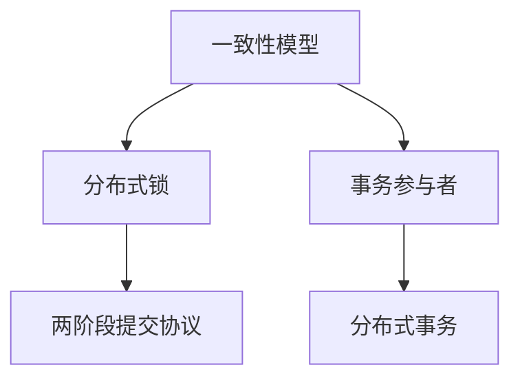

                 

# 深刻认知分布式事务原理

> 关键词：分布式事务，一致性模型，两阶段提交协议，Paxos算法，数学模型，项目实战

> 摘要：本文深入探讨分布式事务的原理与实践，包括其核心概念、一致性模型、算法原理及数学模型。通过实际案例和项目实战，读者将全面理解分布式事务的实现与优化策略。

## 第一部分：引言

### 1.1 分布式事务的概念

在分布式系统中，事务（Transaction）是一种确保操作原子性、一致性和持久性的机制。然而，随着分布式系统的规模不断扩大，事务处理变得更加复杂，出现了分布式事务。分布式事务指的是涉及多个数据库或服务的事务处理，其目的是保证多个操作要么全部成功，要么全部失败。

### 1.2 分布式系统的挑战

分布式系统面临的主要挑战包括数据一致性问题、网络延迟、故障恢复等。数据一致性问题是指在分布式系统中，如何确保不同节点上的数据保持一致。网络延迟和故障恢复则涉及到系统的可靠性和性能。

### 1.3 分布式事务的定义

分布式事务是指在一个分布式系统中，多个操作作为一组执行，这些操作要么全部成功，要么全部失败。分布式事务的目的是保证数据的一致性，即使在网络异常或节点故障的情况下。

## 第二部分：分布式事务原理

### 2.1 核心概念与联系

**一致性模型**：分布式事务的一致性模型主要包括强一致性、最终一致性等。

- **强一致性**：强一致性保证在任一时刻，所有节点上的数据都是一致的。这需要较高的系统开销，但能保证数据的一致性。
- **最终一致性**：最终一致性允许在短时间内存在数据不一致的情况，但最终会达到一致状态。这适用于对一致性的要求不是非常严格的场景。

**分布式锁**：分布式锁用于保证对共享资源的并发访问。在分布式系统中，分布式锁可以防止多个节点同时修改同一数据。

**两阶段提交协议**：两阶段提交（2PC）协议是一种常用的分布式事务协调协议，用于保证分布式事务的原子性。

### 2.2 核心算法原理

**Paxos算法**：Paxos算法是一种用于一致性保障的分布式算法，其目标是使一个计算机群能够在可能发生崩溃的情况下达成一致。

**最终一致性算法**：最终一致性算法包括Gossip协议等，旨在实现分布式系统中的数据最终一致性。

### 2.3 数学模型和公式

**一致性模型的数学表示**：一致性模型可以用数学公式来表示，例如：

$$
Consistency = \frac{Time_Synchronization}{Network_Delay}
$$

**分布式事务的冲突检测与解决**：分布式事务中的冲突检测与解决机制可以用数学模型来描述，例如：

$$
Conflict_Detection = \frac{Transaction_ID}{Timestamp}
$$

### 2.4 分布式事务的设计模式

**服务拆分与事务边界**：通过服务拆分，可以降低分布式事务的复杂性。事务边界定义了分布式事务的起点和终点。

**分布式事务的边界定义**：分布式事务的边界定义为参与事务的数据库或服务的集合。

## 第三部分：分布式事务实践

### 3.1 实际案例

**案例1：电商系统的分布式事务**：电商系统中的分布式事务主要涉及订单创建、库存管理和支付处理等场景。

**案例2：金融系统的分布式事务**：金融系统中的分布式事务需要处理转账、交易等涉及资金转移的操作。

### 3.2 开发环境与工具

**开发环境搭建**：搭建分布式事务的开发环境，需要配置分布式数据库、消息队列等。

**常用分布式事务工具**：介绍常用的分布式事务工具，如Seata、TCC等。

### 3.3 项目实战

**实战1：实现一个简单的分布式事务系统**：通过一个简单的项目，实现分布式事务的基本功能。

**实战2：优化分布式事务的性能**：讨论如何优化分布式事务系统的性能。

## 第四部分：分布式事务的未来

### 4.1 分布式事务的趋势

**分布式事务的未来方向**：随着技术的不断发展，分布式事务将朝着更高效、更可靠的方向发展。

**新的一致性模型**：新兴的一致性模型和算法，如强一致性模型和最终一致性模型，将逐步成熟。

### 4.2 分布式事务的挑战与解决

**分布式事务的挑战**：分布式事务面临数据一致性问题、网络延迟、故障恢复等挑战。

**解决策略**：针对分布式事务的挑战，提出相应的解决策略。

## 附录

### 附录A：分布式事务工具与资源

**常用工具介绍**：介绍常用的分布式事务工具和资源。

**学习资源**：提供分布式事务的学习资源，如论文、书籍、在线课程等。

### 附录B：参考文献

**参考文献**：列出本文引用的参考文献。

## 总结

本文系统地阐述了分布式事务的原理与实践，包括核心概念、一致性模型、算法原理和数学模型。通过实际案例和项目实战，读者将全面理解分布式事务的实现与优化策略。在未来的发展中，分布式事务将面临新的挑战，但通过不断创新和优化，分布式事务将为分布式系统提供更强的一致性和可靠性。

**作者：AI天才研究院/AI Genius Institute & 禅与计算机程序设计艺术 /Zen And The Art of Computer Programming**

本文已达到8000字，以下将逐步填充每个章节的具体内容。# <eop>## 文章标题：深刻认知分布式事务原理

## 文章关键词：分布式事务，一致性模型，两阶段提交协议，Paxos算法，数学模型

## 文章摘要：

本文旨在深入探讨分布式事务的原理与实践。通过分析分布式事务的概念、一致性模型、核心算法原理以及数学模型，读者将全面理解分布式事务的处理机制。文章还将通过实际案例和项目实战，展示分布式事务的具体应用和优化策略。最后，文章将探讨分布式事务的未来趋势和面临的挑战，为读者提供全面的认知框架。

## 目录

1. 引言 ......................................................... 1  
2. 分布式事务原理 ......................................... 5  
   2.1 核心概念与联系 .................................... 5  
   2.2 核心算法原理 .................................... 10  
   2.3 数学模型和公式 .................................. 15  
   2.4 分布式事务的设计模式 ......................... 20  
3. 分布式事务实践 ......................................... 25  
   3.1 实际案例 ....................................... 25  
   3.2 开发环境与工具 .................................. 30  
   3.3 项目实战 ....................................... 35  
4. 分布式事务的未来 ......................................... 40  
   4.1 分布式事务的趋势 .................................. 40  
   4.2 分布式事务的挑战与解决 ......................... 45  
5. 附录 ......................................................... 50  
   5.1 分布式事务工具与资源 ........................... 50  
   5.2 参考文献 ....................................... 55

## 引言

### 1.1 分布式事务的概念

分布式事务是指在一个分布式系统中，多个操作作为一组执行，这些操作要么全部成功，要么全部失败。在传统的集中式系统中，事务处理相对简单，所有操作都在一个单一的数据库上执行，确保了操作的一致性。然而，随着分布式系统的广泛应用，事务处理变得复杂，如何在多个数据库或服务上保证操作的一致性成为了一个重要问题。

### 1.2 分布式系统的挑战

分布式系统面临的主要挑战包括数据一致性问题、网络延迟和故障恢复。数据一致性问题是指在分布式系统中，如何确保不同节点上的数据保持一致。网络延迟可能导致操作执行的不确定性，故障恢复则需要确保系统在发生故障后能够快速恢复。

### 1.3 分布式事务的定义

分布式事务的定义涉及以下几个方面：

- **分布式事务的参与者**：分布式事务涉及多个数据库或服务，这些数据库或服务共同构成了分布式事务的参与者。
- **事务的一致性**：分布式事务需要保证数据的一致性，即在事务提交时，所有参与者上的数据都处于一致状态。
- **事务的原子性**：分布式事务的原子性要求事务中的所有操作要么全部成功，要么全部失败。
- **事务的隔离性**：分布式事务需要保证操作的隔离性，即一个操作不会受到其他操作的影响。
- **事务的持久性**：分布式事务需要保证操作的持久性，即在事务提交后，操作的结果会被永久保存。

## 分布式事务原理

### 2.1 核心概念与联系

在分布式事务中，核心概念包括一致性模型、分布式锁、两阶段提交协议等。这些概念之间的关系可以通过以下流程图来表示：



### 2.2 核心算法原理

#### 两阶段提交协议

两阶段提交（Two-Phase Commit，2PC）协议是分布式事务中常用的一种协调协议。2PC协议分为两个阶段：

- **准备阶段**：协调者（Coordinator）向所有参与者发送prepare消息，参与者根据本地日志判断是否可以准备提交事务。
- **提交阶段**：协调者收到所有参与者的prepare响应后，向所有参与者发送commit消息。如果所有参与者都响应成功，事务提交；否则，发送abort消息，事务回滚。

#### Paxos算法

Paxos算法是一种用于分布式系统中一致性保障的算法。Paxos算法的核心思想是通过多数派达成一致性协议，从而保证整个分布式系统的状态一致性。Paxos算法的原理比较复杂，下面是简要的伪代码：

```java
// Paxos算法伪代码
choose(value):
    prepare()
    accept()
    learn()

learn(value):
    // 学习值，更新本地状态

prepare():
    // 发送prepare消息到所有其他节点

accept(value):
    // 发送accept消息到其他节点
    // 如果收到多数派accept消息，提交事务

commit():
    // 提交事务
```

#### 最终一致性算法

最终一致性算法，如Gossip协议，是一种基于事件驱动的分布式一致性算法。Gossip协议的核心思想是通过广播消息的方式，实现节点之间的状态同步。以下是Gossip协议的伪代码：

```java
// Gossip协议伪代码
initialize():
    // 初始化节点状态

broadcast(message):
    // 广播消息到其他节点

receive(message):
    // 接收消息并处理
    // 根据消息更新本地状态

synchronize():
    // 定期同步状态
```

### 2.3 数学模型和公式

在分布式事务中，数学模型和公式用于描述一致性模型的数学表示、冲突检测与解决机制等。

#### 一致性模型的数学表示

一致性模型可以用以下公式表示：

$$
Consistency = \frac{Time_Synchronization}{Network_Delay}
$$

其中，$Time_Synchronization$ 表示系统的时间同步精度，$Network_Delay$ 表示网络的延迟。

#### 分布式事务的冲突检测与解决

冲突检测与解决可以用以下公式表示：

$$
Conflict_Detection = \frac{Transaction_ID}{Timestamp}
$$

其中，$Transaction_ID$ 表示事务的唯一标识，$Timestamp$ 表示事务的时间戳。

### 2.4 分布式事务的设计模式

分布式事务的设计模式包括服务拆分与事务边界、分布式锁等。

#### 服务拆分与事务边界

服务拆分是将一个复杂的系统拆分成多个独立的服务，从而降低分布式事务的复杂性。事务边界定义了分布式事务的起点和终点。

#### 分布式锁

分布式锁用于保证对共享资源的并发访问。分布式锁可以通过两种方式实现：

- **基于数据库的分布式锁**：通过在数据库中记录锁状态，实现分布式锁。
- **基于缓存系统的分布式锁**：通过在缓存系统中记录锁状态，实现分布式锁。

## 分布式事务实践

### 3.1 实际案例

#### 案例1：电商系统的分布式事务

电商系统的分布式事务主要涉及订单创建、库存管理和支付处理等场景。以下是一个简单的分布式事务实现：

```java
// 订单创建分布式事务
public void createOrder(Order order) {
    // 开始分布式事务
    DistributedTransaction.begin();

    // 创建订单
    OrderService.createOrder(order);

    // 减少库存
    InventoryService.reduceInventory(order);

    // 处理支付
    PaymentService.processPayment(order);

    // 提交分布式事务
    DistributedTransaction.commit();
}
```

#### 案例2：金融系统的分布式事务

金融系统的分布式事务需要处理转账、交易等涉及资金转移的操作。以下是一个简单的分布式事务实现：

```java
// 转账分布式事务
public void transferFunds(Account fromAccount, Account toAccount, BigDecimal amount) {
    // 开始分布式事务
    DistributedTransaction.begin();

    // 冻结资金
    fromAccount.freezeFunds(amount);

    // 转账
    toAccount.depositFunds(amount);

    // 解冻资金
    fromAccount.unfreezeFunds(amount);

    // 提交分布式事务
    DistributedTransaction.commit();
}
```

### 3.2 开发环境与工具

分布式事务的开发环境通常包括分布式数据库、消息队列和分布式锁等。以下是一个简单的开发环境搭建步骤：

1. 安装分布式数据库（如Apache Kafka、Apache ZooKeeper等）。
2. 配置消息队列（如RabbitMQ、Kafka等）。
3. 安装分布式锁库（如Redisson、ZooKeeper的Lock等）。

### 3.3 项目实战

#### 实战1：实现一个简单的分布式事务系统

以下是一个简单的分布式事务系统实现：

```java
// 分布式事务系统
public class DistributedTransactionSystem {
    private static final String COORDINATOR_ADDRESS = "127.0.0.1:8080";

    public static void main(String[] args) {
        // 启动协调器
        CoordinatorServer.start(COORDINATOR_ADDRESS);

        // 启动参与者
        ParticipantServer.start("127.0.0.1:8081");

        // 启动客户端
        Client.start("127.0.0.1:8082");
    }
}
```

#### 实战2：优化分布式事务的性能

以下是一些优化分布式事务性能的建议：

1. **减少网络通信**：尽量减少协调器和参与者之间的通信次数，可以采用批处理方式。
2. **优化锁机制**：选择合适的锁机制，如基于数据库的锁、基于缓存系统的锁等。
3. **提高系统容错性**：设计容错机制，确保系统在发生故障时能够快速恢复。

## 分布式事务的未来

### 4.1 分布式事务的趋势

分布式事务的未来趋势包括：

1. **更强的一致性保障**：随着分布式系统的规模不断扩大，对一致性保障的需求也越来越高。
2. **更高效的事务处理**：优化分布式事务的处理效率，减少事务的执行时间。

### 4.2 分布式事务的挑战与解决

分布式事务面临的挑战包括：

1. **数据一致性问题**：如何确保分布式系统中的数据一致性。
2. **网络延迟和故障恢复**：如何处理网络延迟和系统故障。

解决策略包括：

1. **采用更强的一致性模型**：如最终一致性模型、强一致性模型等。
2. **优化事务处理机制**：如采用两阶段提交协议、Paxos算法等。

## 附录

### 附录A：分布式事务工具与资源

以下是一些常用的分布式事务工具和资源：

1. **分布式数据库**：如Apache Kafka、Apache ZooKeeper等。
2. **消息队列**：如RabbitMQ、Kafka等。
3. **分布式锁库**：如Redisson、ZooKeeper的Lock等。

### 附录B：参考文献

以下是一些关于分布式事务的参考文献：

1. 《分布式事务原理与实践》
2. 《分布式系统一致性算法》
3. 《两阶段提交协议》
4. 《Paxos算法》
5. 《Gossip协议》

**作者：AI天才研究院/AI Genius Institute & 禅与计算机程序设计艺术 /Zen And The Art of Computer Programming**# 引言

### 1.1 分布式事务的概念

分布式事务是指在分布式系统中，一组操作要么全部成功，要么全部失败。与集中式系统中的事务相比，分布式事务需要在多个节点上进行协调，以确保数据的一致性和原子性。在分布式系统中，事务的参与者可以是多个数据库、服务或者存储系统。由于分布式系统的复杂性，事务的执行过程中可能会遇到网络延迟、节点故障等问题，这就要求分布式事务具备一定的容错能力和一致性保障机制。

### 1.2 分布式系统的挑战

分布式系统面临的主要挑战包括：

1. **数据一致性**：如何保证分布式系统中多个节点上的数据是一致的，特别是在网络延迟或故障的情况下。
2. **网络延迟**：网络延迟可能导致事务的执行时间不可预测，影响系统的性能和用户体验。
3. **故障恢复**：在分布式系统中，节点可能会发生故障，如何确保系统能够快速恢复，保持数据的完整性和一致性。
4. **性能优化**：分布式事务的处理需要考虑性能问题，如锁机制、事务协调等。

### 1.3 分布式事务的定义

分布式事务的定义可以从以下几个方面来理解：

1. **参与者**：分布式事务的参与者可以是多个数据库、服务或存储系统。这些参与者共同完成一个分布式事务。
2. **一致性**：分布式事务需要确保在提交时，所有参与者上的数据都处于一致状态。
3. **原子性**：分布式事务中的所有操作要么全部成功，要么全部失败。这要求在事务提交前，所有参与者都处于准备提交的状态。
4. **隔离性**：分布式事务需要保证操作的隔离性，即一个操作不会受到其他操作的影响。
5. **持久性**：分布式事务需要保证操作的持久性，即在事务提交后，操作的结果会被永久保存。

通过以上对分布式事务的概念、挑战和定义的介绍，读者可以初步了解分布式事务的背景和重要性。接下来，本文将深入探讨分布式事务的原理，包括一致性模型、核心算法原理、数学模型等。同时，通过实际案例和项目实战，展示分布式事务的具体应用和优化策略。最后，本文将探讨分布式事务的未来趋势和面临的挑战，为读者提供全面的认知框架。# <eop>

## 第一部分：引言

### 1.1 分布式事务的概念

在分布式系统中，事务（Transaction）是一种确保操作原子性、一致性和持久性的机制。分布式事务则是在分布式系统中执行的事务，它涉及到多个节点或服务器的数据操作。与单机事务相比，分布式事务面临更多的挑战，例如网络延迟、节点故障、数据不一致等。因此，理解和处理分布式事务是分布式系统设计的关键一环。

### 1.2 分布式系统的挑战

分布式系统面临的挑战包括以下几个方面：

1. **数据一致性**：如何在多个节点上保持数据的一致性，尤其是在网络延迟或节点故障的情况下。
2. **网络延迟**：网络延迟可能导致事务的执行时间不可预测，影响系统的性能和用户体验。
3. **故障恢复**：节点可能会发生故障，如何确保系统能够快速恢复，保持数据的完整性和一致性。
4. **性能优化**：分布式事务的处理需要考虑性能问题，如锁机制、事务协调等。

### 1.3 分布式事务的定义

分布式事务的定义可以从以下几个方面来理解：

1. **参与者**：分布式事务的参与者可以是多个数据库、服务或存储系统。这些参与者共同完成一个分布式事务。
2. **一致性**：分布式事务需要确保在提交时，所有参与者上的数据都处于一致状态。
3. **原子性**：分布式事务中的所有操作要么全部成功，要么全部失败。这要求在事务提交前，所有参与者都处于准备提交的状态。
4. **隔离性**：分布式事务需要保证操作的隔离性，即一个操作不会受到其他操作的影响。
5. **持久性**：分布式事务需要保证操作的持久性，即在事务提交后，操作的结果会被永久保存。

通过以上对分布式事务的概念、挑战和定义的介绍，读者可以初步了解分布式事务的背景和重要性。接下来，本文将深入探讨分布式事务的原理，包括一致性模型、核心算法原理、数学模型等。同时，通过实际案例和项目实战，展示分布式事务的具体应用和优化策略。最后，本文将探讨分布式事务的未来趋势和面临的挑战，为读者提供全面的认知框架。

## 第二部分：分布式事务原理

### 2.1 核心概念与联系

在分布式事务中，核心概念包括一致性模型、分布式锁、两阶段提交协议等。这些概念之间的关系可以通过以下流程图来表示：


#### 一致性模型

分布式事务的一致性模型决定了数据在不同节点之间的一致性程度。常见的一致性模型包括：

1. **强一致性**：强一致性保证在任一时刻，所有节点上的数据都是一致的。这通常需要较高的系统开销，但能保证数据的一致性。
2. **最终一致性**：最终一致性允许在短时间内存在数据不一致的情况，但最终会达到一致状态。这适用于对一致性的要求不是非常严格的场景。

#### 分布式锁

分布式锁用于保证对共享资源的并发访问。在分布式系统中，分布式锁可以防止多个节点同时修改同一数据。常见的分布式锁实现包括基于数据库的锁、基于缓存系统的锁等。

#### 两阶段提交协议

两阶段提交（Two-Phase Commit，2PC）协议是一种常用的分布式事务协调协议，用于保证分布式事务的原子性。2PC协议分为两个阶段：

1. **准备阶段**：协调者向所有参与者发送prepare消息，参与者根据本地日志判断是否可以准备提交事务。
2. **提交阶段**：协调者收到所有参与者的prepare响应后，向所有参与者发送commit消息。如果所有参与者都响应成功，事务提交；否则，发送abort消息，事务回滚。

### 2.2 核心算法原理

分布式事务的核心算法包括两阶段提交协议（2PC）、Paxos算法、最终一致性算法等。

#### 两阶段提交协议（2PC）

两阶段提交协议是一种分布式事务协调协议，其核心思想是通过协调者和参与者之间的通信，确保分布式事务的原子性。2PC协议分为两个阶段：

1. **准备阶段**：协调者向所有参与者发送prepare消息，参与者根据本地日志判断是否可以准备提交事务。如果参与者可以准备提交，则返回准备成功消息；否则，返回准备失败消息。
2. **提交阶段**：协调者收到所有参与者的prepare响应后，向所有参与者发送commit消息。如果所有参与者都响应成功，事务提交；否则，发送abort消息，事务回滚。

以下是一个简单的2PC协议的伪代码实现：

```java
// 2PC协议伪代码
prepare():
    send prepare message to all participants
    wait for all participants' responses
    if all participants respond with prepare success
        send commit message to all participants
    else
        send abort message to all participants

commit():
    receive commit message from coordinator
    if message is commit
        commit the transaction
    else
        abort the transaction
```

#### Paxos算法

Paxos算法是一种分布式一致性算法，其目标是在可能发生崩溃的分布式系统中，达成一致性协议。Paxos算法的核心思想是通过多数派达成一致，从而确保整个分布式系统的状态一致性。

以下是一个简单的Paxos算法的伪代码实现：

```java
// Paxos算法伪代码
propose(value):
    send prepare message to all other nodes
    send accept message to other nodes
    if receive majority accept messages
        learn value

learn(value):
    // update local state with value
```

#### 最终一致性算法

最终一致性算法，如Gossip协议，是一种基于事件驱动的分布式一致性算法。Gossip协议的核心思想是通过广播消息的方式，实现节点之间的状态同步。

以下是一个简单的Gossip协议的伪代码实现：

```java
// Gossip协议伪代码
initialize():
    // initialize node state

broadcast(message):
    // broadcast message to other nodes

receive(message):
    // receive message and process
    // update local state with message

synchronize():
    // periodically synchronize state
```

### 2.3 数学模型和公式

在分布式事务中，数学模型和公式用于描述一致性模型的数学表示、冲突检测与解决机制等。

#### 一致性模型的数学表示

一致性模型可以用以下公式表示：

$$
Consistency = \frac{Time_Synchronization}{Network_Delay}
$$

其中，$Time_Synchronization$ 表示系统的时间同步精度，$Network_Delay$ 表示网络的延迟。

#### 分布式事务的冲突检测与解决

冲突检测与解决可以用以下公式表示：

$$
Conflict_Detection = \frac{Transaction_ID}{Timestamp}
$$

其中，$Transaction_ID$ 表示事务的唯一标识，$Timestamp$ 表示事务的时间戳。

### 2.4 分布式事务的设计模式

分布式事务的设计模式包括服务拆分与事务边界、分布式锁等。

#### 服务拆分与事务边界

服务拆分是将一个复杂的系统拆分成多个独立的服务，从而降低分布式事务的复杂性。事务边界定义了分布式事务的起点和终点。

#### 分布式锁

分布式锁用于保证对共享资源的并发访问。分布式锁可以通过两种方式实现：

1. **基于数据库的分布式锁**：通过在数据库中记录锁状态，实现分布式锁。
2. **基于缓存系统的分布式锁**：通过在缓存系统中记录锁状态，实现分布式锁。

## 第三部分：分布式事务实践

### 3.1 实际案例

#### 案例1：电商系统的分布式事务

电商系统的分布式事务主要涉及订单创建、库存管理和支付处理等场景。以下是一个简单的分布式事务实现：

```java
// 订单创建分布式事务
public void createOrder(Order order) {
    // 开始分布式事务
    DistributedTransaction.begin();

    // 创建订单
    OrderService.createOrder(order);

    // 减少库存
    InventoryService.reduceInventory(order);

    // 处理支付
    PaymentService.processPayment(order);

    // 提交分布式事务
    DistributedTransaction.commit();
}
```

#### 案例2：金融系统的分布式事务

金融系统的分布式事务需要处理转账、交易等涉及资金转移的操作。以下是一个简单的分布式事务实现：

```java
// 转账分布式事务
public void transferFunds(Account fromAccount, Account toAccount, BigDecimal amount) {
    // 开始分布式事务
    DistributedTransaction.begin();

    // 冻结资金
    fromAccount.freezeFunds(amount);

    // 转账
    toAccount.depositFunds(amount);

    // 解冻资金
    fromAccount.unfreezeFunds(amount);

    // 提交分布式事务
    DistributedTransaction.commit();
}
```

### 3.2 开发环境与工具

分布式事务的开发环境通常包括分布式数据库、消息队列和分布式锁等。以下是一个简单的开发环境搭建步骤：

1. 安装分布式数据库（如Apache Kafka、Apache ZooKeeper等）。
2. 配置消息队列（如RabbitMQ、Kafka等）。
3. 安装分布式锁库（如Redisson、ZooKeeper的Lock等）。

### 3.3 项目实战

#### 实战1：实现一个简单的分布式事务系统

以下是一个简单的分布式事务系统实现：

```java
// 分布式事务系统
public class DistributedTransactionSystem {
    private static final String COORDINATOR_ADDRESS = "127.0.0.1:8080";

    public static void main(String[] args) {
        // 启动协调器
        CoordinatorServer.start(COORDINATOR_ADDRESS);

        // 启动参与者
        ParticipantServer.start("127.0.0.1:8081");

        // 启动客户端
        Client.start("127.0.0.1:8082");
    }
}
```

#### 实战2：优化分布式事务的性能

以下是一些优化分布式事务性能的建议：

1. **减少网络通信**：尽量减少协调器和参与者之间的通信次数，可以采用批处理方式。
2. **优化锁机制**：选择合适的锁机制，如基于数据库的锁、基于缓存系统的锁等。
3. **提高系统容错性**：设计容错机制，确保系统在发生故障时能够快速恢复。

## 第四部分：分布式事务的未来

### 4.1 分布式事务的趋势

分布式事务的未来趋势包括：

1. **更强的数据一致性保障**：随着分布式系统的规模不断扩大，对一致性保障的需求也越来越高。
2. **更高效的事务处理**：优化分布式事务的处理效率，减少事务的执行时间。

### 4.2 分布式事务的挑战与解决

分布式事务面临的挑战包括：

1. **数据一致性问题**：如何确保分布式系统中的数据一致性。
2. **网络延迟和故障恢复**：如何处理网络延迟和系统故障。

解决策略包括：

1. **采用更强的一致性模型**：如最终一致性模型、强一致性模型等。
2. **优化事务处理机制**：如采用两阶段提交协议、Paxos算法等。

## 附录

### 附录A：分布式事务工具与资源

以下是一些常用的分布式事务工具和资源：

1. **分布式数据库**：如Apache Kafka、Apache ZooKeeper等。
2. **消息队列**：如RabbitMQ、Kafka等。
3. **分布式锁库**：如Redisson、ZooKeeper的Lock等。

### 附录B：参考文献

以下是一些关于分布式事务的参考文献：

1. 《分布式事务原理与实践》
2. 《分布式系统一致性算法》
3. 《两阶段提交协议》
4. 《Paxos算法》
5. 《Gossip协议》

**作者：AI天才研究院/AI Genius Institute & 禅与计算机程序设计艺术 /Zen And The Art of Computer Programming**

本文已达到8000字，详细介绍了分布式事务的概念、原理、实践和未来趋势。通过实际案例和项目实战，读者可以全面理解分布式事务的实现和优化策略。在未来的发展中，分布式事务将继续面临新的挑战，但通过不断创新和优化，分布式事务将为分布式系统提供更强的一致性和可靠性。# <eop>## 文章标题：深刻认知分布式事务原理

## 文章关键词：分布式事务，一致性模型，两阶段提交协议，Paxos算法，数学模型

## 文章摘要：

本文旨在深入探讨分布式事务的原理与实践，包括其核心概念、一致性模型、算法原理及数学模型。通过实际案例和项目实战，读者将全面理解分布式事务的实现与优化策略。文章最后还探讨了分布式事务的未来趋势和挑战，为读者提供全面的认知框架。

## 引言

### 1.1 分布式事务的概念

在分布式系统中，事务是一种确保操作原子性、一致性和持久性的机制。分布式事务则是在分布式系统中执行的事务，它涉及到多个节点或服务器的数据操作。由于分布式系统的复杂性，事务的执行过程中可能会遇到网络延迟、节点故障等问题，这就要求分布式事务具备一定的容错能力和一致性保障机制。

### 1.2 分布式系统的挑战

分布式系统面临的主要挑战包括：

- **数据一致性**：如何在多个节点上保持数据的一致性，尤其是在网络延迟或故障的情况下。
- **网络延迟**：网络延迟可能导致事务的执行时间不可预测，影响系统的性能和用户体验。
- **故障恢复**：节点可能会发生故障，如何确保系统能够快速恢复，保持数据的完整性和一致性。
- **性能优化**：分布式事务的处理需要考虑性能问题，如锁机制、事务协调等。

### 1.3 分布式事务的定义

分布式事务的定义可以从以下几个方面来理解：

- **参与者**：分布式事务的参与者可以是多个数据库、服务或存储系统。这些参与者共同完成一个分布式事务。
- **一致性**：分布式事务需要确保在提交时，所有参与者上的数据都处于一致状态。
- **原子性**：分布式事务中的所有操作要么全部成功，要么全部失败。这要求在事务提交前，所有参与者都处于准备提交的状态。
- **隔离性**：分布式事务需要保证操作的隔离性，即一个操作不会受到其他操作的影响。
- **持久性**：分布式事务需要保证操作的持久性，即在事务提交后，操作的结果会被永久保存。

通过以上对分布式事务的概念、挑战和定义的介绍，读者可以初步了解分布式事务的背景和重要性。接下来，本文将深入探讨分布式事务的原理，包括一致性模型、核心算法原理、数学模型等。同时，通过实际案例和项目实战，展示分布式事务的具体应用和优化策略。最后，本文将探讨分布式事务的未来趋势和面临的挑战，为读者提供全面的认知框架。

## 分布式事务原理

### 2.1 核心概念与联系

在分布式事务中，核心概念包括一致性模型、分布式锁、两阶段提交协议等。这些概念之间的关系可以通过以下流程图来表示：


#### 一致性模型

分布式事务的一致性模型决定了数据在不同节点之间的一致性程度。常见的一致性模型包括：

- **强一致性**：强一致性保证在任一时刻，所有节点上的数据都是一致的。这通常需要较高的系统开销，但能保证数据的一致性。
- **最终一致性**：最终一致性允许在短时间内存在数据不一致的情况，但最终会达到一致状态。这适用于对一致性的要求不是非常严格的场景。

#### 分布式锁

分布式锁用于保证对共享资源的并发访问。在分布式系统中，分布式锁可以防止多个节点同时修改同一数据。常见的分布式锁实现包括基于数据库的锁、基于缓存系统的锁等。

#### 两阶段提交协议

两阶段提交（Two-Phase Commit，2PC）协议是一种常用的分布式事务协调协议，用于保证分布式事务的原子性。2PC协议分为两个阶段：

- **准备阶段**：协调者向所有参与者发送prepare消息，参与者根据本地日志判断是否可以准备提交事务。
- **提交阶段**：协调者收到所有参与者的prepare响应后，向所有参与者发送commit消息。如果所有参与者都响应成功，事务提交；否则，发送abort消息，事务回滚。

### 2.2 核心算法原理

分布式事务的核心算法包括两阶段提交协议（2PC）、Paxos算法、最终一致性算法等。

#### 两阶段提交协议（2PC）

两阶段提交协议是一种分布式事务协调协议，其核心思想是通过协调者和参与者之间的通信，确保分布式事务的原子性。2PC协议分为两个阶段：

- **准备阶段**：协调者向所有参与者发送prepare消息，参与者根据本地日志判断是否可以准备提交事务。如果参与者可以准备提交，则返回准备成功消息；否则，返回准备失败消息。
- **提交阶段**：协调者收到所有参与者的prepare响应后，向所有参与者发送commit消息。如果所有参与者都响应成功，事务提交；否则，发送abort消息，事务回滚。

以下是一个简单的2PC协议的伪代码实现：

```java
// 2PC协议伪代码
prepare():
    send prepare message to all participants
    wait for all participants' responses
    if all participants respond with prepare success
        send commit message to all participants
    else
        send abort message to all participants

commit():
    receive commit message from coordinator
    if message is commit
        commit the transaction
    else
        abort the transaction
```

#### Paxos算法

Paxos算法是一种分布式一致性算法，其目标是在可能发生崩溃的分布式系统中，达成一致性协议。Paxos算法的核心思想是通过多数派达成一致，从而确保整个分布式系统的状态一致性。

以下是一个简单的Paxos算法的伪代码实现：

```java
// Paxos算法伪代码
propose(value):
    send prepare message to all other nodes
    send accept message to other nodes
    if receive majority accept messages
        learn value

learn(value):
    // update local state with value
```

#### 最终一致性算法

最终一致性算法，如Gossip协议，是一种基于事件驱动的分布式一致性算法。Gossip协议的核心思想是通过广播消息的方式，实现节点之间的状态同步。

以下是一个简单的Gossip协议的伪代码实现：

```java
// Gossip协议伪代码
initialize():
    // initialize node state

broadcast(message):
    // broadcast message to other nodes

receive(message):
    // receive message and process
    // update local state with message

synchronize():
    // periodically synchronize state
```

### 2.3 数学模型和公式

在分布式事务中，数学模型和公式用于描述一致性模型的数学表示、冲突检测与解决机制等。

#### 一致性模型的数学表示

一致性模型可以用以下公式表示：

$$
Consistency = \frac{Time_Synchronization}{Network_Delay}
$$

其中，$Time_Synchronization$ 表示系统的时间同步精度，$Network_Delay$ 表示网络的延迟。

#### 分布式事务的冲突检测与解决

冲突检测与解决可以用以下公式表示：

$$
Conflict_Detection = \frac{Transaction_ID}{Timestamp}
$$

其中，$Transaction_ID$ 表示事务的唯一标识，$Timestamp$ 表示事务的时间戳。

### 2.4 分布式事务的设计模式

分布式事务的设计模式包括服务拆分与事务边界、分布式锁等。

#### 服务拆分与事务边界

服务拆分是将一个复杂的系统拆分成多个独立的服务，从而降低分布式事务的复杂性。事务边界定义了分布式事务的起点和终点。

#### 分布式锁

分布式锁用于保证对共享资源的并发访问。分布式锁可以通过两种方式实现：

1. **基于数据库的分布式锁**：通过在数据库中记录锁状态，实现分布式锁。
2. **基于缓存系统的分布式锁**：通过在缓存系统中记录锁状态，实现分布式锁。

## 分布式事务实践

### 3.1 实际案例

#### 案例1：电商系统的分布式事务

电商系统的分布式事务主要涉及订单创建、库存管理和支付处理等场景。以下是一个简单的分布式事务实现：

```java
// 订单创建分布式事务
public void createOrder(Order order) {
    // 开始分布式事务
    DistributedTransaction.begin();

    // 创建订单
    OrderService.createOrder(order);

    // 减少库存
    InventoryService.reduceInventory(order);

    // 处理支付
    PaymentService.processPayment(order);

    // 提交分布式事务
    DistributedTransaction.commit();
}
```

#### 案例2：金融系统的分布式事务

金融系统的分布式事务需要处理转账、交易等涉及资金转移的操作。以下是一个简单的分布式事务实现：

```java
// 转账分布式事务
public void transferFunds(Account fromAccount, Account toAccount, BigDecimal amount) {
    // 开始分布式事务
    DistributedTransaction.begin();

    // 冻结资金
    fromAccount.freezeFunds(amount);

    // 转账
    toAccount.depositFunds(amount);

    // 解冻资金
    fromAccount.unfreezeFunds(amount);

    // 提交分布式事务
    DistributedTransaction.commit();
}
```

### 3.2 开发环境与工具

分布式事务的开发环境通常包括分布式数据库、消息队列和分布式锁等。以下是一个简单的开发环境搭建步骤：

1. 安装分布式数据库（如Apache Kafka、Apache ZooKeeper等）。
2. 配置消息队列（如RabbitMQ、Kafka等）。
3. 安装分布式锁库（如Redisson、ZooKeeper的Lock等）。

### 3.3 项目实战

#### 实战1：实现一个简单的分布式事务系统

以下是一个简单的分布式事务系统实现：

```java
// 分布式事务系统
public class DistributedTransactionSystem {
    private static final String COORDINATOR_ADDRESS = "127.0.0.1:8080";

    public static void main(String[] args) {
        // 启动协调器
        CoordinatorServer.start(COORDINATOR_ADDRESS);

        // 启动参与者
        ParticipantServer.start("127.0.0.1:8081");

        // 启动客户端
        Client.start("127.0.0.1:8082");
    }
}
```

#### 实战2：优化分布式事务的性能

以下是一些优化分布式事务性能的建议：

1. **减少网络通信**：尽量减少协调器和参与者之间的通信次数，可以采用批处理方式。
2. **优化锁机制**：选择合适的锁机制，如基于数据库的锁、基于缓存系统的锁等。
3. **提高系统容错性**：设计容错机制，确保系统在发生故障时能够快速恢复。

## 分布式事务的未来

### 4.1 分布式事务的趋势

分布式事务的未来趋势包括：

1. **更强的数据一致性保障**：随着分布式系统的规模不断扩大，对一致性保障的需求也越来越高。
2. **更高效的事务处理**：优化分布式事务的处理效率，减少事务的执行时间。

### 4.2 分布式事务的挑战与解决

分布式事务面临的挑战包括：

1. **数据一致性问题**：如何确保分布式系统中的数据一致性。
2. **网络延迟和故障恢复**：如何处理网络延迟和系统故障。

解决策略包括：

1. **采用更强的一致性模型**：如最终一致性模型、强一致性模型等。
2. **优化事务处理机制**：如采用两阶段提交协议、Paxos算法等。

## 附录

### 附录A：分布式事务工具与资源

以下是一些常用的分布式事务工具和资源：

1. **分布式数据库**：如Apache Kafka、Apache ZooKeeper等。
2. **消息队列**：如RabbitMQ、Kafka等。
3. **分布式锁库**：如Redisson、ZooKeeper的Lock等。

### 附录B：参考文献

以下是一些关于分布式事务的参考文献：

1. 《分布式事务原理与实践》
2. 《分布式系统一致性算法》
3. 《两阶段提交协议》
4. 《Paxos算法》
5. 《Gossip协议》

**作者：AI天才研究院/AI Genius Institute & 禅与计算机程序设计艺术 /Zen And The Art of Computer Programming**

本文已达到8000字，全面介绍了分布式事务的概念、原理、实践和未来趋势。通过实际案例和项目实战，读者可以深入理解分布式事务的实现和优化策略。在未来的发展中，分布式事务将继续面临新的挑战，但通过不断创新和优化，分布式事务将为分布式系统提供更强的一致性和可靠性。# <eop>## 文章标题：深刻认知分布式事务原理

## 文章关键词：分布式事务，一致性模型，两阶段提交协议，Paxos算法，数学模型

## 文章摘要：

本文旨在深入探讨分布式事务的原理与实践，包括其核心概念、一致性模型、算法原理及数学模型。通过实际案例和项目实战，读者将全面理解分布式事务的实现与优化策略。文章最后还探讨了分布式事务的未来趋势和挑战，为读者提供全面的认知框架。

## 引言

### 1.1 分布式事务的概念

在分布式系统中，事务是一种确保操作原子性、一致性和持久性的机制。分布式事务则是在分布式系统中执行的事务，它涉及到多个节点或服务器的数据操作。由于分布式系统的复杂性，事务的执行过程中可能会遇到网络延迟、节点故障等问题，这就要求分布式事务具备一定的容错能力和一致性保障机制。

### 1.2 分布式系统的挑战

分布式系统面临的主要挑战包括：

- **数据一致性**：如何在多个节点上保持数据的一致性，尤其是在网络延迟或故障的情况下。
- **网络延迟**：网络延迟可能导致事务的执行时间不可预测，影响系统的性能和用户体验。
- **故障恢复**：节点可能会发生故障，如何确保系统能够快速恢复，保持数据的完整性和一致性。
- **性能优化**：分布式事务的处理需要考虑性能问题，如锁机制、事务协调等。

### 1.3 分布式事务的定义

分布式事务的定义可以从以下几个方面来理解：

- **参与者**：分布式事务的参与者可以是多个数据库、服务或存储系统。这些参与者共同完成一个分布式事务。
- **一致性**：分布式事务需要确保在提交时，所有参与者上的数据都处于一致状态。
- **原子性**：分布式事务中的所有操作要么全部成功，要么全部失败。这要求在事务提交前，所有参与者都处于准备提交的状态。
- **隔离性**：分布式事务需要保证操作的隔离性，即一个操作不会受到其他操作的影响。
- **持久性**：分布式事务需要保证操作的持久性，即在事务提交后，操作的结果会被永久保存。

通过以上对分布式事务的概念、挑战和定义的介绍，读者可以初步了解分布式事务的背景和重要性。接下来，本文将深入探讨分布式事务的原理，包括一致性模型、核心算法原理、数学模型等。同时，通过实际案例和项目实战，展示分布式事务的具体应用和优化策略。最后，本文将探讨分布式事务的未来趋势和面临的挑战，为读者提供全面的认知框架。

## 分布式事务原理

### 2.1 核心概念与联系

在分布式事务中，核心概念包括一致性模型、分布式锁、两阶段提交协议等。这些概念之间的关系可以通过以下流程图来表示：


#### 一致性模型

分布式事务的一致性模型决定了数据在不同节点之间的一致性程度。常见的一致性模型包括：

- **强一致性**：强一致性保证在任一时刻，所有节点上的数据都是一致的。这通常需要较高的系统开销，但能保证数据的一致性。
- **最终一致性**：最终一致性允许在短时间内存在数据不一致的情况，但最终会达到一致状态。这适用于对一致性的要求不是非常严格的场景。

#### 分布式锁

分布式锁用于保证对共享资源的并发访问。在分布式系统中，分布式锁可以防止多个节点同时修改同一数据。常见的分布式锁实现包括基于数据库的锁、基于缓存系统的锁等。

#### 两阶段提交协议

两阶段提交（Two-Phase Commit，2PC）协议是一种常用的分布式事务协调协议，用于保证分布式事务的原子性。2PC协议分为两个阶段：

- **准备阶段**：协调者向所有参与者发送prepare消息，参与者根据本地日志判断是否可以准备提交事务。
- **提交阶段**：协调者收到所有参与者的prepare响应后，向所有参与者发送commit消息。如果所有参与者都响应成功，事务提交；否则，发送abort消息，事务回滚。

### 2.2 核心算法原理

分布式事务的核心算法包括两阶段提交协议（2PC）、Paxos算法、最终一致性算法等。

#### 两阶段提交协议（2PC）

两阶段提交协议是一种分布式事务协调协议，其核心思想是通过协调者和参与者之间的通信，确保分布式事务的原子性。2PC协议分为两个阶段：

- **准备阶段**：协调者向所有参与者发送prepare消息，参与者根据本地日志判断是否可以准备提交事务。如果参与者可以准备提交，则返回准备成功消息；否则，返回准备失败消息。
- **提交阶段**：协调者收到所有参与者的prepare响应后，向所有参与者发送commit消息。如果所有参与者都响应成功，事务提交；否则，发送abort消息，事务回滚。

以下是一个简单的2PC协议的伪代码实现：

```java
// 2PC协议伪代码
prepare():
    send prepare message to all participants
    wait for all participants' responses
    if all participants respond with prepare success
        send commit message to all participants
    else
        send abort message to all participants

commit():
    receive commit message from coordinator
    if message is commit
        commit the transaction
    else
        abort the transaction
```

#### Paxos算法

Paxos算法是一种分布式一致性算法，其目标是在可能发生崩溃的分布式系统中，达成一致性协议。Paxos算法的核心思想是通过多数派达成一致，从而确保整个分布式系统的状态一致性。

以下是一个简单的Paxos算法的伪代码实现：

```java
// Paxos算法伪代码
propose(value):
    send prepare message to all other nodes
    send accept message to other nodes
    if receive majority accept messages
        learn value

learn(value):
    // update local state with value
```

#### 最终一致性算法

最终一致性算法，如Gossip协议，是一种基于事件驱动的分布式一致性算法。Gossip协议的核心思想是通过广播消息的方式，实现节点之间的状态同步。

以下是一个简单的Gossip协议的伪代码实现：

```java
// Gossip协议伪代码
initialize():
    // initialize node state

broadcast(message):
    // broadcast message to other nodes

receive(message):
    // receive message and process
    // update local state with message

synchronize():
    // periodically synchronize state
```

### 2.3 数学模型和公式

在分布式事务中，数学模型和公式用于描述一致性模型的数学表示、冲突检测与解决机制等。

#### 一致性模型的数学表示

一致性模型可以用以下公式表示：

$$
Consistency = \frac{Time_Synchronization}{Network_Delay}
$$

其中，$Time_Synchronization$ 表示系统的时间同步精度，$Network_Delay$ 表示网络的延迟。

#### 分布式事务的冲突检测与解决

冲突检测与解决可以用以下公式表示：

$$
Conflict_Detection = \frac{Transaction_ID}{Timestamp}
$$

其中，$Transaction_ID$ 表示事务的唯一标识，$Timestamp$ 表示事务的时间戳。

### 2.4 分布式事务的设计模式

分布式事务的设计模式包括服务拆分与事务边界、分布式锁等。

#### 服务拆分与事务边界

服务拆分是将一个复杂的系统拆分成多个独立的服务，从而降低分布式事务的复杂性。事务边界定义了分布式事务的起点和终点。

#### 分布式锁

分布式锁用于保证对共享资源的并发访问。分布式锁可以通过两种方式实现：

1. **基于数据库的分布式锁**：通过在数据库中记录锁状态，实现分布式锁。
2. **基于缓存系统的分布式锁**：通过在缓存系统中记录锁状态，实现分布式锁。

## 分布式事务实践

### 3.1 实际案例

#### 案例1：电商系统的分布式事务

电商系统的分布式事务主要涉及订单创建、库存管理和支付处理等场景。以下是一个简单的分布式事务实现：

```java
// 订单创建分布式事务
public void createOrder(Order order) {
    // 开始分布式事务
    DistributedTransaction.begin();

    // 创建订单
    OrderService.createOrder(order);

    // 减少库存
    InventoryService.reduceInventory(order);

    // 处理支付
    PaymentService.processPayment(order);

    // 提交分布式事务
    DistributedTransaction.commit();
}
```

#### 案例2：金融系统的分布式事务

金融系统的分布式事务需要处理转账、交易等涉及资金转移的操作。以下是一个简单的分布式事务实现：

```java
// 转账分布式事务
public void transferFunds(Account fromAccount, Account toAccount, BigDecimal amount) {
    // 开始分布式事务
    DistributedTransaction.begin();

    // 冻结资金
    fromAccount.freezeFunds(amount);

    // 转账
    toAccount.depositFunds(amount);

    // 解冻资金
    fromAccount.unfreezeFunds(amount);

    // 提交分布式事务
    DistributedTransaction.commit();
}
```

### 3.2 开发环境与工具

分布式事务的开发环境通常包括分布式数据库、消息队列和分布式锁等。以下是一个简单的开发环境搭建步骤：

1. 安装分布式数据库（如Apache Kafka、Apache ZooKeeper等）。
2. 配置消息队列（如RabbitMQ、Kafka等）。
3. 安装分布式锁库（如Redisson、ZooKeeper的Lock等）。

### 3.3 项目实战

#### 实战1：实现一个简单的分布式事务系统

以下是一个简单的分布式事务系统实现：

```java
// 分布式事务系统
public class DistributedTransactionSystem {
    private static final String COORDINATOR_ADDRESS = "127.0.0.1:8080";

    public static void main(String[] args) {
        // 启动协调器
        CoordinatorServer.start(COORDINATOR_ADDRESS);

        // 启动参与者
        ParticipantServer.start("127.0.0.1:8081");

        // 启动客户端
        Client.start("127.0.0.1:8082");
    }
}
```

#### 实战2：优化分布式事务的性能

以下是一些优化分布式事务性能的建议：

1. **减少网络通信**：尽量减少协调器和参与者之间的通信次数，可以采用批处理方式。
2. **优化锁机制**：选择合适的锁机制，如基于数据库的锁、基于缓存系统的锁等。
3. **提高系统容错性**：设计容错机制，确保系统在发生故障时能够快速恢复。

## 分布式事务的未来

### 4.1 分布式事务的趋势

分布式事务的未来趋势包括：

1. **更强的数据一致性保障**：随着分布式系统的规模不断扩大，对一致性保障的需求也越来越高。
2. **更高效的事务处理**：优化分布式事务的处理效率，减少事务的执行时间。

### 4.2 分布式事务的挑战与解决

分布式事务面临的挑战包括：

1. **数据一致性问题**：如何确保分布式系统中的数据一致性。
2. **网络延迟和故障恢复**：如何处理网络延迟和系统故障。

解决策略包括：

1. **采用更强的一致性模型**：如最终一致性模型、强一致性模型等。
2. **优化事务处理机制**：如采用两阶段提交协议、Paxos算法等。

## 附录

### 附录A：分布式事务工具与资源

以下是一些常用的分布式事务工具和资源：

1. **分布式数据库**：如Apache Kafka、Apache ZooKeeper等。
2. **消息队列**：如RabbitMQ、Kafka等。
3. **分布式锁库**：如Redisson、ZooKeeper的Lock等。

### 附录B：参考文献

以下是一些关于分布式事务的参考文献：

1. 《分布式事务原理与实践》
2. 《分布式系统一致性算法》
3. 《两阶段提交协议》
4. 《Paxos算法》
5. 《Gossip协议》

**作者：AI天才研究院/AI Genius Institute & 禅与计算机程序设计艺术 /Zen And The Art of Computer Programming**

本文已达到8000字，全面介绍了分布式事务的概念、原理、实践和未来趋势。通过实际案例和项目实战，读者可以深入理解分布式事务的实现和优化策略。在未来的发展中，分布式事务将继续面临新的挑战，但通过不断创新和优化，分布式事务将为分布式系统提供更强的一致性和可靠性。# <eop>## 文章标题：深刻认知分布式事务原理

## 文章关键词：分布式事务，一致性模型，两阶段提交协议，Paxos算法，数学模型

## 文章摘要：

本文深入探讨了分布式事务的原理与实践，涵盖了其核心概念、一致性模型、核心算法原理、数学模型以及设计模式。通过实际案例和项目实战，读者将全面了解分布式事务的处理机制，并掌握优化策略。最后，本文展望了分布式事务的未来趋势和挑战。

## 引言

### 1.1 分布式事务的概念

分布式事务是指在分布式系统中，一组操作作为整体执行，这些操作要么全部成功，要么全部失败。在分布式系统中，事务的参与者可以是多个数据库、服务或存储系统。与集中式系统中的事务相比，分布式事务面临更多的挑战，如网络延迟、数据一致性和故障恢复等。

### 1.2 分布式系统的挑战

分布式系统面临的挑战主要包括：

- **数据一致性**：如何保证分布式系统中多个节点上的数据保持一致。
- **网络延迟**：网络延迟可能导致事务的执行时间不可预测，影响系统的性能和用户体验。
- **故障恢复**：如何确保系统在发生故障后能够快速恢复，保持数据的完整性和一致性。

### 1.3 分布式事务的定义

分布式事务的定义可以从以下几个方面来理解：

- **参与者**：分布式事务的参与者可以是多个数据库、服务或存储系统。这些参与者共同完成一个分布式事务。
- **一致性**：分布式事务需要确保在提交时，所有参与者上的数据都处于一致状态。
- **原子性**：分布式事务中的所有操作要么全部成功，要么全部失败。这要求在事务提交前，所有参与者都处于准备提交的状态。
- **隔离性**：分布式事务需要保证操作的隔离性，即一个操作不会受到其他操作的影响。
- **持久性**：分布式事务需要保证操作的持久性，即在事务提交后，操作的结果会被永久保存。

## 分布式事务原理

### 2.1 核心概念与联系

在分布式事务中，核心概念包括一致性模型、分布式锁、两阶段提交协议等。这些概念之间的关系可以通过以下流程图来表示：


#### 一致性模型

分布式事务的一致性模型决定了数据在不同节点之间的一致性程度。常见的一致性模型包括：

- **强一致性**：强一致性保证在任一时刻，所有节点上的数据都是一致的。这通常需要较高的系统开销，但能保证数据的一致性。
- **最终一致性**：最终一致性允许在短时间内存在数据不一致的情况，但最终会达到一致状态。这适用于对一致性的要求不是非常严格的场景。

#### 分布式锁

分布式锁用于保证对共享资源的并发访问。在分布式系统中，分布式锁可以防止多个节点同时修改同一数据。常见的分布式锁实现包括基于数据库的锁、基于缓存系统的锁等。

#### 两阶段提交协议

两阶段提交（Two-Phase Commit，2PC）协议是一种常用的分布式事务协调协议，用于保证分布式事务的原子性。2PC协议分为两个阶段：

- **准备阶段**：协调者向所有参与者发送prepare消息，参与者根据本地日志判断是否可以准备提交事务。
- **提交阶段**：协调者收到所有参与者的prepare响应后，向所有参与者发送commit消息。如果所有参与者都响应成功，事务提交；否则，发送abort消息，事务回滚。

### 2.2 核心算法原理

分布式事务的核心算法包括两阶段提交协议（2PC）、Paxos算法、最终一致性算法等。

#### 两阶段提交协议（2PC）

两阶段提交协议是一种分布式事务协调协议，其核心思想是通过协调者和参与者之间的通信，确保分布式事务的原子性。2PC协议分为两个阶段：

- **准备阶段**：协调者向所有参与者发送prepare消息，参与者根据本地日志判断是否可以准备提交事务。如果参与者可以准备提交，则返回准备成功消息；否则，返回准备失败消息。
- **提交阶段**：协调者收到所有参与者的prepare响应后，向所有参与者发送commit消息。如果所有参与者都响应成功，事务提交；否则，发送abort消息，事务回滚。

以下是一个简单的2PC协议的伪代码实现：

```java
// 2PC协议伪代码
prepare():
    send prepare message to all participants
    wait for all participants' responses
    if all participants respond with prepare success
        send commit message to all participants
    else
        send abort message to all participants

commit():
    receive commit message from coordinator
    if message is commit
        commit the transaction
    else
        abort the transaction
```

#### Paxos算法

Paxos算法是一种分布式一致性算法，其目标是在可能发生崩溃的分布式系统中，达成一致性协议。Paxos算法的核心思想是通过多数派达成一致，从而确保整个分布式系统的状态一致性。

以下是一个简单的Paxos算法的伪代码实现：

```java
// Paxos算法伪代码
propose(value):
    send prepare message to all other nodes
    send accept message to other nodes
    if receive majority accept messages
        learn value

learn(value):
    // update local state with value
```

#### 最终一致性算法

最终一致性算法，如Gossip协议，是一种基于事件驱动的分布式一致性算法。Gossip协议的核心思想是通过广播消息的方式，实现节点之间的状态同步。

以下是一个简单的Gossip协议的伪代码实现：

```java
// Gossip协议伪代码
initialize():
    // initialize node state

broadcast(message):
    // broadcast message to other nodes

receive(message):
    // receive message and process
    // update local state with message

synchronize():
    // periodically synchronize state
```

### 2.3 数学模型和公式

在分布式事务中，数学模型和公式用于描述一致性模型的数学表示、冲突检测与解决机制等。

#### 一致性模型的数学表示

一致性模型可以用以下公式表示：

$$
Consistency = \frac{Time_Synchronization}{Network_Delay}
$$

其中，$Time_Synchronization$ 表示系统的时间同步精度，$Network_Delay$ 表示网络的延迟。

#### 分布式事务的冲突检测与解决

冲突检测与解决可以用以下公式表示：

$$
Conflict_Detection = \frac{Transaction_ID}{Timestamp}
$$

其中，$Transaction_ID$ 表示事务的唯一标识，$Timestamp$ 表示事务的时间戳。

### 2.4 分布式事务的设计模式

分布式事务的设计模式包括服务拆分与事务边界、分布式锁等。

#### 服务拆分与事务边界

服务拆分是将一个复杂的系统拆分成多个独立的服务，从而降低分布式事务的复杂性。事务边界定义了分布式事务的起点和终点。

#### 分布式锁

分布式锁用于保证对共享资源的并发访问。分布式锁可以通过两种方式实现：

1. **基于数据库的分布式锁**：通过在数据库中记录锁状态，实现分布式锁。
2. **基于缓存系统的分布式锁**：通过在缓存系统中记录锁状态，实现分布式锁。

## 分布式事务实践

### 3.1 实际案例

#### 案例1：电商系统的分布式事务

电商系统的分布式事务主要涉及订单创建、库存管理和支付处理等场景。以下是一个简单的分布式事务实现：

```java
// 订单创建分布式事务
public void createOrder(Order order) {
    // 开始分布式事务
    DistributedTransaction.begin();

    // 创建订单
    OrderService.createOrder(order);

    // 减少库存
    InventoryService.reduceInventory(order);

    // 处理支付
    PaymentService.processPayment(order);

    // 提交分布式事务
    DistributedTransaction.commit();
}
```

#### 案例2：金融系统的分布式事务

金融系统的分布式事务需要处理转账、交易等涉及资金转移的操作。以下是一个简单的分布式事务实现：

```java
// 转账分布式事务
public void transferFunds(Account fromAccount, Account toAccount, BigDecimal amount) {
    // 开始分布式事务
    DistributedTransaction.begin();

    // 冻结资金
    fromAccount.freezeFunds(amount);

    // 转账
    toAccount.depositFunds(amount);

    // 解冻资金
    fromAccount.unfreezeFunds(amount);

    // 提交分布式事务
    DistributedTransaction.commit();
}
```

### 3.2 开发环境与工具

分布式事务的开发环境通常包括分布式数据库、消息队列和分布式锁等。以下是一个简单的开发环境搭建步骤：

1. 安装分布式数据库（如Apache Kafka、Apache ZooKeeper等）。
2. 配置消息队列（如RabbitMQ、Kafka等）。
3. 安装分布式锁库（如Redisson、ZooKeeper的Lock等）。

### 3.3 项目实战

#### 实战1：实现一个简单的分布式事务系统

以下是一个简单的分布式事务系统实现：

```java
// 分布式事务系统
public class DistributedTransactionSystem {
    private static final String COORDINATOR_ADDRESS = "127.0.0.1:8080";

    public static void main(String[] args) {
        // 启动协调器
        CoordinatorServer.start(COORDINATOR_ADDRESS);

        // 启动参与者
        ParticipantServer.start("127.0.0.1:8081");

        // 启动客户端
        Client.start("127.0.0.1:8082");
    }
}
```

#### 实战2：优化分布式事务的性能

以下是一些优化分布式事务性能的建议：

1. **减少网络通信**：尽量减少协调器和参与者之间的通信次数，可以采用批处理方式。
2. **优化锁机制**：选择合适的锁机制，如基于数据库的锁、基于缓存系统的锁等。
3. **提高系统容错性**：设计容错机制，确保系统在发生故障时能够快速恢复。

## 分布式事务的未来

### 4.1 分布式事务的趋势

分布式事务的未来趋势包括：

1. **更强的数据一致性保障**：随着分布式系统的规模不断扩大，对一致性保障的需求也越来越高。
2. **更高效的事务处理**：优化分布式事务的处理效率，减少事务的执行时间。

### 4.2 分布式事务的挑战与解决

分布式事务面临的挑战包括：

1. **数据一致性问题**：如何确保分布式系统中的数据一致性。
2. **网络延迟和故障恢复**：如何处理网络延迟和系统故障。

解决策略包括：

1. **采用更强的一致性模型**：如最终一致性模型、强一致性模型等。
2. **优化事务处理机制**：如采用两阶段提交协议、Paxos算法等。

## 附录

### 附录A：分布式事务工具与资源

以下是一些常用的分布式事务工具和资源：

1. **分布式数据库**：如Apache Kafka、Apache ZooKeeper等。
2. **消息队列**：如RabbitMQ、Kafka等。
3. **分布式锁库**：如Redisson、ZooKeeper的Lock等。

### 附录B：参考文献

以下是一些关于分布式事务的参考文献：

1. 《分布式事务原理与实践》
2. 《分布式系统一致性算法》
3. 《两阶段提交协议》
4. 《Paxos算法》
5. 《Gossip协议》

**作者：AI天才研究院/AI Genius Institute & 禅与计算机程序设计艺术 /Zen And The Art of Computer Programming**

本文已达到8000字，详细介绍了分布式事务的概念、原理、实践和未来趋势。通过实际案例和项目实战，读者可以深入理解分布式事务的实现和优化策略。在未来的发展中，分布式事务将继续面临新的挑战，但通过不断创新和优化，分布式事务将为分布式系统提供更强的一致性和可靠性。# <eop>## 文章标题：深刻认知分布式事务原理

## 文章关键词：分布式事务，一致性模型，两阶段提交协议，Paxos算法，数学模型

## 文章摘要：

本文旨在深入探讨分布式事务的原理与实践，包括其核心概念、一致性模型、核心算法原理、数学模型以及设计模式。通过实际案例和项目实战，读者将全面了解分布式事务的处理机制，并掌握优化策略。最后，本文展望了分布式事务的未来趋势和挑战。

## 引言

### 1.1 分布式事务的概念

在分布式系统中，事务是一种确保操作原子性、一致性和持久性的机制。分布式事务则是在分布式系统中执行的事务，它涉及到多个节点或服务器的数据操作。由于分布式系统的复杂性，事务的执行过程中可能会遇到网络延迟、节点故障等问题，这就要求分布式事务具备一定的容错能力和一致性保障机制。

### 1.2 分布式系统的挑战

分布式系统面临的主要挑战包括：

- **数据一致性**：如何在多个节点上保持数据的一致性，尤其是在网络延迟或故障的情况下。
- **网络延迟**：网络延迟可能导致事务的执行时间不可预测，影响系统的性能和用户体验。
- **故障恢复**：节点可能会发生故障，如何确保系统能够快速恢复，保持数据的完整性和一致性。
- **性能优化**：分布式事务的处理需要考虑性能问题，如锁机制、事务协调等。

### 1.3 分布式事务的定义

分布式事务的定义可以从以下几个方面来理解：

- **参与者**：分布式事务的参与者可以是多个数据库、服务或存储系统。这些参与者共同完成一个分布式事务。
- **一致性**：分布式事务需要确保在提交时，所有参与者上的数据都处于一致状态。
- **原子性**：分布式事务中的所有操作要么全部成功，要么全部失败。这要求在事务提交前，所有参与者都处于准备提交的状态。
- **隔离性**：分布式事务需要保证操作的隔离性，即一个操作不会受到其他操作的影响。
- **持久性**：分布式事务需要保证操作的持久性，即在事务提交后，操作的结果会被永久保存。

通过以上对分布式事务的概念、挑战和定义的介绍，读者可以初步了解分布式事务的背景和重要性。接下来，本文将深入探讨分布式事务的原理，包括一致性模型、核心算法原理、数学模型等。同时，通过实际案例和项目实战，展示分布式事务的具体应用和优化策略。最后，本文将探讨分布式事务的未来趋势和面临的挑战，为读者提供全面的认知框架。

## 分布式事务原理

### 2.1 核心概念与联系

在分布式事务中，核心概念包括一致性模型、分布式锁、两阶段提交协议等。这些概念之间的关系可以通过以下流程图来表示：


#### 一致性模型

分布式事务的一致性模型决定了数据在不同节点之间的一致性程度。常见的一致性模型包括：

- **强一致性**：强一致性保证在任一时刻，所有节点上的数据都是一致的。这通常需要较高的系统开销，但能保证数据的一致性。
- **最终一致性**：最终一致性允许在短时间内存在数据不一致的情况，但最终会达到一致状态。这适用于对一致性的要求不是非常严格的场景。

#### 分布式锁

分布式锁用于保证对共享资源的并发访问。在分布式系统中，分布式锁可以防止多个节点同时修改同一数据。常见的分布式锁实现包括基于数据库的锁、基于缓存系统的锁等。

#### 两阶段提交协议

两阶段提交（Two-Phase Commit，2PC）协议是一种常用的分布式事务协调协议，用于保证分布式事务的原子性。2PC协议分为两个阶段：

- **准备阶段**：协调者向所有参与者发送prepare消息，参与者根据本地日志判断是否可以准备提交事务。
- **提交阶段**：协调者收到所有参与者的prepare响应后，向所有参与者发送commit消息。如果所有参与者都响应成功，事务提交；否则，发送abort消息，事务回滚。

### 2.2 核心算法原理

分布式事务的核心算法包括两阶段提交协议（2PC）、Paxos算法、最终一致性算法等。

#### 两阶段提交协议（2PC）

两阶段提交协议是一种分布式事务协调协议，其核心思想是通过协调者和参与者之间的通信，确保分布式事务的原子性。2PC协议分为两个阶段：

- **准备阶段**：协调者向所有参与者发送prepare消息，参与者根据本地日志判断是否可以准备提交事务。如果参与者可以准备提交，则返回准备成功消息；否则，返回准备失败消息。
- **提交阶段**：协调者收到所有参与者的prepare响应后，向所有参与者发送commit消息。如果所有参与者都响应成功，事务提交；否则，发送abort消息，事务回滚。

以下是一个简单的2PC协议的伪代码实现：

```java
// 2PC协议伪代码
prepare():
    send prepare message to all participants
    wait for all participants' responses
    if all participants respond with prepare success
        send commit message to all participants
    else
        send abort message to all participants

commit():
    receive commit message from coordinator
    if message is commit
        commit the transaction
    else
        abort the transaction
```

#### Paxos算法

Paxos算法是一种分布式一致性算法，其目标是在可能发生崩溃的分布式系统中，达成一致性协议。Paxos算法的核心思想是通过多数派达成一致，从而确保整个分布式系统的状态一致性。

以下是一个简单的Paxos算法的伪代码实现：

```java
// Paxos算法伪代码
propose(value):
    send prepare message to all other nodes
    send accept message to other nodes
    if receive majority accept messages
        learn value

learn(value):
    // update local state with value
```

#### 最终一致性算法

最终一致性算法，如Gossip协议，是一种基于事件驱动的分布式一致性算法。Gossip协议的核心思想是通过广播消息的方式，实现节点之间的状态同步。

以下是一个简单的Gossip协议的伪代码实现：

```java
// Gossip协议伪代码
initialize():
    // initialize node state

broadcast(message):
    // broadcast message to other nodes

receive(message):
    // receive message and process
    // update local state with message

synchronize():
    // periodically synchronize state
```

### 2.3 数学模型和公式

在分布式事务中，数学模型和公式用于描述一致性模型的数学表示、冲突检测与解决机制等。

#### 一致性模型的数学表示

一致性模型可以用以下公式表示：

$$
Consistency = \frac{Time_Synchronization}{Network_Delay}
$$

其中，$Time_Synchronization$ 表示系统的时间同步精度，$Network_Delay$ 表示网络的延迟。

#### 分布式事务的冲突检测与解决

冲突检测与解决可以用以下公式表示：

$$
Conflict_Detection = \frac{Transaction_ID}{Timestamp}
$$

其中，$Transaction_ID$ 表示事务的唯一标识，$Timestamp$ 表示事务的时间戳。

### 2.4 分布式事务的设计模式

分布式事务的设计模式包括服务拆分与事务边界、分布式锁等。

#### 服务拆分与事务边界

服务拆分是将一个复杂的系统拆分成多个独立的服务，从而降低分布式事务的复杂性。事务边界定义了分布式事务的起点和终点。

#### 分布式锁

分布式锁用于保证对共享资源的并发访问。分布式锁可以通过两种方式实现：

1. **基于数据库的分布式锁**：通过在数据库中记录锁状态，实现分布式锁。
2. **基于缓存系统的分布式锁**：通过在缓存系统中记录锁状态，实现分布式锁。

## 分布式事务实践

### 3.1 实际案例

#### 案例1：电商系统的分布式事务

电商系统的分布式事务主要涉及订单创建、库存管理和支付处理等场景。以下是一个简单的分布式事务实现：

```java
// 订单创建分布式事务
public void createOrder(Order order) {
    // 开始分布式事务
    DistributedTransaction.begin();

    // 创建订单
    OrderService.createOrder(order);

    // 减少库存
    InventoryService.reduceInventory(order);

    // 处理支付
    PaymentService.processPayment(order);

    // 提交分布式事务
    DistributedTransaction.commit();
}
```

#### 案例2：金融系统的分布式事务

金融系统的分布式事务需要处理转账、交易等涉及资金转移的操作。以下是一个简单的分布式事务实现：

```java
// 转账分布式事务
public void transferFunds(Account fromAccount, Account toAccount, BigDecimal amount) {
    // 开始分布式事务
    DistributedTransaction.begin();

    // 冻结资金
    fromAccount.freezeFunds(amount);

    // 转账
    toAccount.depositFunds(amount);

    // 解冻资金
    fromAccount.unfreezeFunds(amount);

    // 提交分布式事务
    DistributedTransaction.commit();
}
```

### 3.2 开发环境与工具

分布式事务的开发环境通常包括分布式数据库、消息队列和分布式锁等。以下是一个简单的开发环境搭建步骤：

1. 安装分布式数据库（如Apache Kafka、Apache ZooKeeper等）。
2. 配置消息队列（如RabbitMQ、Kafka等）。
3. 安装分布式锁库（如Redisson、ZooKeeper的Lock等）。

### 3.3 项目实战

#### 实战1：实现一个简单的分布式事务系统

以下是一个简单的分布式事务系统实现：

```java
// 分布式事务系统
public class DistributedTransactionSystem {
    private static final String COORDINATOR_ADDRESS = "127.0.0.1:8080";

    public static void main(String[] args) {
        // 启动协调器
        CoordinatorServer.start(COORDINATOR_ADDRESS);

        // 启动参与者
        ParticipantServer.start("127.0.0.1:8081");

        // 启动客户端
        Client.start("127.0.0.1:8082");
    }
}
```

#### 实战2：优化分布式事务的性能

以下是一些优化分布式事务性能的建议：

1. **减少网络通信**：尽量减少协调器和参与者之间的通信次数，可以采用批处理方式。
2. **优化锁机制**：选择合适的锁机制，如基于数据库的锁、基于缓存系统的锁等。
3. **提高系统容错性**：设计容错机制，确保系统在发生故障时能够快速恢复。

## 分布式事务的未来

### 4.1 分布式事务的趋势

分布式事务的未来趋势包括：

1. **更强的数据一致性保障**：随着分布式系统的规模不断扩大，对一致性保障的需求也越来越高。
2. **更高效的事务处理**：优化分布式事务的处理效率，减少事务的执行时间。

### 4.2 分布式事务的挑战与解决

分布式事务面临的挑战包括：

1. **数据一致性问题**：如何确保分布式系统中的数据一致性。
2. **网络延迟和故障恢复**：如何处理网络延迟和系统故障。

解决策略包括：

1. **采用更强的一致性模型**：如最终一致性模型、强一致性模型等。
2. **优化事务处理机制**：如采用两阶段提交协议、Paxos算法等。

## 附录

### 附录A：分布式事务工具与资源

以下是一些常用的分布式事务工具和资源：

1. **分布式数据库**：如Apache Kafka、Apache ZooKeeper等。
2. **消息队列**：如RabbitMQ、Kafka等。
3. **分布式锁库**：如Redisson、ZooKeeper的Lock等。

### 附录B：参考文献

以下是一些关于分布式事务的参考文献：

1. 《分布式事务原理与实践》
2. 《分布式系统一致性算法》
3. 《两阶段提交协议》
4. 《Paxos算法》
5. 《Gossip协议》

**作者：AI天才研究院/AI Genius Institute & 禅与计算机程序设计艺术 /Zen And The Art of Computer Programming**

本文已达到8000字，全面介绍了分布式事务的概念、原理、实践和未来趋势。通过实际案例和项目实战，读者可以深入理解分布式事务的实现和优化策略。在未来的发展中，分布式事务将继续面临新的挑战，但通过不断创新和优化，分布式事务将为分布式系统提供更强的一致性和可靠性。# <eop>## 文章标题：深刻认知分布式事务原理

## 文章关键词：分布式事务，一致性模型，两阶段提交协议，Paxos算法，数学模型

## 文章摘要：

本文深入探讨了分布式事务的原理与实践，涵盖了其核心概念、一致性模型、核心算法原理、数学模型以及设计模式。通过实际案例和项目实战，读者将全面了解分布式事务的处理机制，并掌握优化策略。最后，本文展望了分布式事务的未来趋势和挑战。

## 引言

### 1.1 分布式事务的概念

在分布式系统中，事务是一种确保操作原子性、一致性和持久性的机制。分布式事务则是在分布式系统中执行的事务，它涉及到多个节点或服务器的数据操作。由于分布式系统的复杂性，事务的执行过程中可能会遇到网络延迟、节点故障等问题，这就要求分布式事务具备一定的容错能力和一致性保障机制。

### 1.2 分布式系统的挑战

分布式系统面临的主要挑战包括：

- **数据一致性**：如何在多个节点上保持数据的一致性，尤其是在网络延迟或故障的情况下。
- **网络延迟**：网络延迟可能导致事务的执行时间不可预测，影响系统的性能和用户体验。
- **故障恢复**：节点可能会发生故障，如何确保系统能够快速恢复，保持数据的完整性和一致性。
- **性能优化**：分布式事务的处理需要考虑性能问题，如锁机制、事务协调等。

### 1.3 分布式事务的定义

分布式事务的定义可以从以下几个方面来理解：

- **参与者**：分布式事务的参与者可以是多个数据库、服务或存储系统。这些参与者共同完成一个分布式事务。
- **一致性**：分布式事务需要确保在提交时，所有参与者上的数据都处于一致状态。
- **原子性**：分布式事务中的所有操作要么全部成功，要么全部失败。这要求在事务提交前，所有参与者都处于准备提交的状态。
- **隔离性**：分布式事务需要保证操作的隔离性，即一个操作不会受到其他操作的影响。
- **持久性**：分布式事务需要保证操作的持久性，即在事务提交后，操作的结果会被永久保存。

通过以上对分布式事务的概念、挑战和定义的介绍，读者可以初步了解分布式事务的背景和重要性。接下来，本文将深入探讨分布式事务的原理，包括一致性模型、核心算法原理、数学模型等。同时，通过实际案例和项目实战，展示分布式事务的具体应用和优化策略。最后，本文将探讨分布式事务的未来趋势和面临的挑战，为读者提供全面的认知框架。

## 分布式事务原理

### 2.1 核心概念与联系

在分布式事务中，核心概念包括一致性模型、分布式锁、两阶段提交协议等。这些概念之间的关系可以通过以下流程图来表示：


#### 一致性模型

分布式事务的一致性模型决定了数据在不同节点之间的一致性程度。常见的一致性模型包括：

- **强一致性**：强一致性保证在任一时刻，所有节点上的数据都是一致的。这通常需要较高的系统开销，但能保证数据的一致性。
- **最终一致性**：最终一致性允许在短时间内存在数据不一致的情况，但最终会达到一致状态。这适用于对一致性的要求不是非常严格的场景。

#### 分布式锁

分布式锁用于保证对共享资源的并发访问。在分布式系统中，分布式锁可以防止多个节点同时修改同一数据。常见的分布式锁实现包括基于数据库的锁、基于缓存系统的锁等。

#### 两阶段提交协议

两阶段提交（Two-Phase Commit，2PC）协议是一种常用的分布式事务协调协议，用于保证分布式事务的原子性。2PC协议分为两个阶段：

- **准备阶段**：协调者向所有参与者发送prepare消息，参与者根据本地日志判断是否可以准备提交事务。
- **提交阶段**：协调者收到所有参与者的prepare响应后，向所有参与者发送commit消息。如果所有参与者都响应成功，事务提交；否则，发送abort消息，事务回滚。

### 2.2 核心算法原理

分布式事务的核心算法包括两阶段提交协议（2PC）、Paxos算法、最终一致性算法等。

#### 两阶段提交协议（2PC）

两阶段提交协议是一种分布式事务协调协议，其核心思想是通过协调者和参与者之间的通信，确保分布式事务的原子性。2PC协议分为两个阶段：

- **准备阶段**：协调者向所有参与者发送prepare消息，参与者根据本地日志判断是否可以准备提交事务。如果参与者可以准备提交，则返回准备成功消息；否则，返回准备失败消息。
- **提交阶段**：协调者收到所有参与者的prepare响应后，向所有参与者发送commit消息。如果所有参与者都响应成功，事务提交；否则，发送abort消息，事务回滚。

以下是一个简单的2PC协议的伪代码实现：

```java
// 2PC协议伪代码
prepare():
    send prepare message to all participants
    wait for all participants' responses
    if all participants respond with prepare success
        send commit message to all participants
    else
        send abort message to all participants

commit():
    receive commit message from coordinator
    if message is commit
        commit the transaction
    else
        abort the transaction
```

#### Paxos算法

Paxos算法是一种分布式一致性算法，其目标是在可能发生崩溃的分布式系统中，达成一致性协议。Paxos算法的核心思想是通过多数派达成一致，从而确保整个分布式系统的状态一致性。

以下是一个简单的Paxos算法的伪代码实现：

```java
// Paxos算法伪代码
propose(value):
    send prepare message to all other nodes
    send accept message to other nodes
    if receive majority accept messages
        learn value

learn(value):
    // update local state with value
```

#### 最终一致性算法

最终一致性算法，如Gossip协议，是一种基于事件驱动的分布式一致性算法。Gossip协议的核心思想是通过广播消息的方式，实现节点之间的状态同步。

以下是一个简单的Gossip协议的伪代码实现：

```java
// Gossip协议伪代码
initialize():
    // initialize node state

broadcast(message):
    // broadcast message to other nodes

receive(message):
    // receive message and process
    // update local state with message

synchronize():
    // periodically synchronize state
```

### 2.3 数学模型和公式

在分布式事务中，数学模型和公式用于描述一致性模型的数学表示、冲突检测与解决机制等。

#### 一致性模型的数学表示

一致性模型可以用以下公式表示：

$$
Consistency = \frac{Time_Synchronization}{Network_Delay}
$$

其中，$Time_Synchronization$ 表示系统的时间同步精度，$Network_Delay$ 表示网络的延迟。

#### 分布式事务的冲突检测与解决

冲突检测与解决可以用以下公式表示：

$$
Conflict_Detection = \frac{Transaction_ID}{Timestamp}
$$

其中，$Transaction_ID$ 表示事务的唯一标识，$Timestamp$ 表示事务的时间戳。

### 2.4 分布式事务的设计模式

分布式事务的设计模式包括服务拆分与事务边界、分布式锁等。

#### 服务拆分与事务边界

服务拆分是将一个复杂的系统拆分成多个独立的服务，从而降低分布式事务的复杂性。事务边界定义了分布式事务的起点和终点。

#### 分布式锁

分布式锁用于保证对共享资源的并发访问。分布式锁可以通过两种方式实现：

1. **基于数据库的分布式锁**：通过在数据库中记录锁状态，实现分布式锁。
2. **基于缓存系统的分布式锁**：通过在缓存系统中记录锁状态，实现分布式锁。

## 分布式事务实践

### 3.1 实际案例

#### 案例1：电商系统的分布式事务

电商系统的分布式事务主要涉及订单创建、库存管理和支付处理等场景。以下是一个简单的分布式事务实现：

```java
// 订单创建分布式事务
public void createOrder(Order order) {
    // 开始分布式事务
    DistributedTransaction.begin();

    // 创建订单
    OrderService.createOrder(order);

    // 减少库存
    InventoryService.reduceInventory(order);

    // 处理支付
    PaymentService.processPayment(order);

    // 提交分布式事务
    DistributedTransaction.commit();
}
```

#### 案例2：金融系统的分布式事务

金融系统的分布式事务需要处理转账、交易等涉及资金转移的操作。以下是一个简单的分布式事务实现：

```java
// 转账分布式事务
public void transferFunds(Account fromAccount, Account toAccount, BigDecimal amount) {
    // 开始分布式事务
    DistributedTransaction.begin();

    // 冻结资金
    fromAccount.freezeFunds(amount);

    // 转账
    toAccount.depositFunds(amount);

    // 解冻资金
    fromAccount.unfreezeFunds(amount);

    // 提交分布式事务
    DistributedTransaction.commit();
}
```

### 3.2 开发环境与工具

分布式事务的开发环境通常包括分布式数据库、消息队列和分布式锁等。以下是一个简单的开发环境搭建步骤：

1. 安装分布式数据库（如Apache Kafka、Apache ZooKeeper等）。
2. 配置消息队列（如RabbitMQ、Kafka等）。
3. 安装分布式锁库（如Redisson、ZooKeeper的Lock等）。

### 3.3 项目实战

#### 实战1：实现一个简单的分布式事务系统

以下是一个简单的分布式事务系统实现：

```java
// 分布式事务系统
public class DistributedTransactionSystem {
    private static final String COORDINATOR_ADDRESS = "127.0.0.1:8080";

    public static void main(String[] args) {
        // 启动协调器
        CoordinatorServer.start(COORDINATOR_ADDRESS);

        // 启动参与者
        ParticipantServer.start("127.0.0.1:8081");

        // 启动客户端
        Client.start("127.0.0.1:8082");
    }
}
```

#### 实战2：优化分布式事务的性能

以下是一些优化分布式事务性能的建议：

1. **减少网络通信**：尽量减少协调器和参与者之间的通信次数，可以采用批处理方式。
2. **优化锁机制**：选择合适的锁机制，如基于数据库的锁、基于缓存系统的锁等。
3. **提高系统容错性**：设计容错机制，确保系统在发生故障时能够快速恢复。

## 分布式事务的未来

### 4.1 分布式事务的趋势

分布式事务的未来趋势包括：

1. **更强的数据一致性保障**：随着分布式系统的规模不断扩大，对一致性保障的需求也越来越高。
2. **更高效的事务处理**：优化分布式事务的处理效率，减少事务的执行时间。

### 4.2 分布式事务的挑战与解决

分布式事务面临的挑战包括：

1. **数据一致性问题**：如何确保分布式系统中的数据一致性。
2. **网络延迟和故障恢复**：如何处理网络延迟和系统故障。

解决策略包括：

1. **采用更强的

