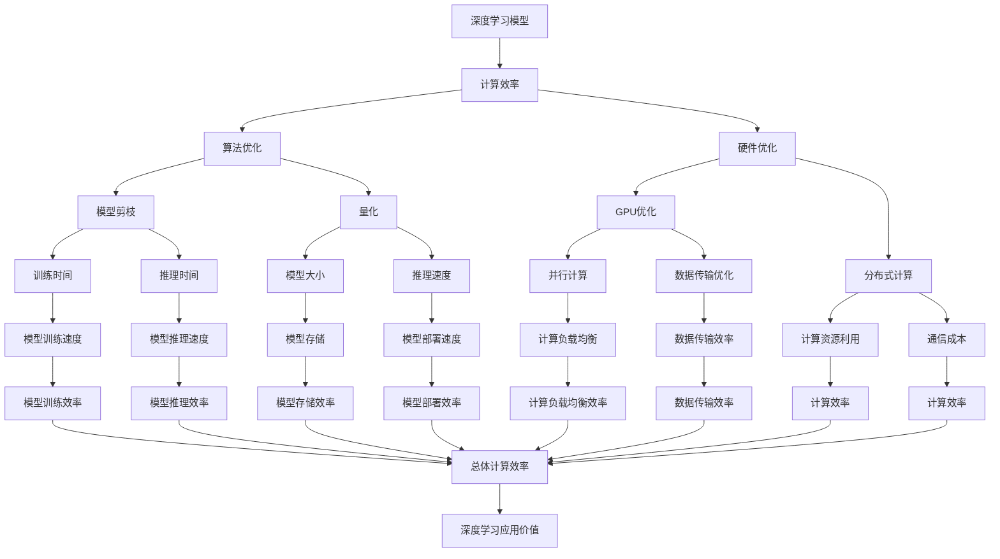

                 

 

### 2.1 深度学习中的计算效率优化策略背景

#### 2.1.1 深度学习的迅速发展

深度学习作为人工智能领域的重要分支，近年来取得了飞速的发展。其应用涵盖了图像识别、语音识别、自然语言处理、推荐系统等多个领域。随着深度学习模型在复杂任务中的表现日益突出，对计算效率的需求也越来越高。

#### 2.1.2 计算效率的重要性

计算效率是深度学习模型性能的关键因素之一。高效的计算策略不仅能减少模型训练和推理的时间，还能降低硬件资源的消耗。对于企业和研究机构来说，提高计算效率意味着更低的成本和更高的生产效率。

#### 2.1.3 现存问题与挑战

尽管深度学习取得了显著进展，但在实际应用中仍面临着一系列计算效率问题。这些问题包括：

1. **训练时间过长**：深度学习模型通常需要大量的数据进行训练，这需要消耗大量的计算资源。
2. **内存占用过大**：大规模深度学习模型对内存资源的需求较高，可能导致内存溢出。
3. **硬件限制**：尽管硬件性能不断提升，但与深度学习模型的计算需求相比，仍存在一定的差距。

#### 2.1.4 优化策略的必要性

为了应对上述问题，优化深度学习计算效率变得尤为重要。通过有效的优化策略，可以提高模型训练和推理的效率，降低硬件资源消耗，为深度学习应用提供更强的支持和保障。

### 2.2 设计计算效率优化策略的目录大纲

在设计深度学习计算效率优化策略时，我们需要考虑多个方面。以下是一个详细的目录大纲：

#### 2.2.1 核心概念与联系

##### 2.2.1.1 深度学习与计算效率的关系

- 深度学习的核心概念
- 计算效率的定义与重要性

##### 2.2.1.2 深度学习计算效率优化策略的关联图

- Mermaid流程图展示深度学习计算效率优化策略的关联

#### 2.2.2 核心算法原理讲解

##### 2.2.2.1 深度学习算法的运行机制

- 伪代码展示深度学习算法的运行流程

##### 2.2.2.2 常见计算效率优化算法

- 伪代码展示常见优化算法

#### 2.2.3 数学模型和数学公式

##### 2.2.3.1 深度学习中的数学模型

- 详细讲解深度学习中的数学模型，使用 LaTeX 格式

##### 2.2.3.2 数学公式举例说明

- 使用 LaTeX 格式，举例说明数学公式

#### 2.2.4 项目实战

##### 2.2.4.1 案例一：深度学习模型优化

- 代码实际案例
- 详细解释说明

##### 2.2.4.2 案例二：计算效率优化实战

- 代码实际案例
- 详细解释说明

##### 2.2.4.3 开发环境搭建

- 搭建深度学习模型的开发环境

##### 2.2.4.4 源代码详细实现与解读

- 源代码详细实现
- 代码解读与分析

#### 2.2.5 最佳实践与注意事项

- 提供最佳实践建议
- 强调注意事项

#### 2.2.6 小结与拓展阅读

- 对文章内容进行小结
- 提供拓展阅读资源

### 2.3 核心概念与联系

#### 2.3.1 深度学习与计算效率的关系

深度学习是一种基于多层神经网络进行数据分析和模式识别的技术。其核心思想是通过学习大量数据，提取特征并形成决策模型。深度学习模型的训练和推理过程依赖于大量的矩阵运算和前向传播、反向传播等计算操作。因此，深度学习模型的计算复杂度较高。

计算效率是指在一定计算资源下，完成特定计算任务所需的时间和资源。在深度学习中，计算效率的优化显得尤为重要。高效的计算策略可以显著降低模型训练和推理的时间，提高模型性能，降低硬件资源的消耗。

#### 2.3.2 计算效率优化策略的关联图

为了更好地理解计算效率优化策略，我们可以通过一个Mermaid流程图来展示各个策略之间的关联。



在这个关联图中，我们可以看到，计算效率优化策略涵盖了算法优化、硬件优化、模型剪枝、量化、GPU优化、分布式计算等多个方面。这些策略相互关联，共同作用于提高深度学习模型的计算效率。

#### 2.3.3 深度学习算法的运行机制

深度学习算法的运行机制主要包括以下几个步骤：

1. **数据预处理**：对输入数据进行预处理，包括归一化、标准化等操作。
2. **前向传播**：将预处理后的数据输入到神经网络中，通过逐层计算，得到输出结果。
3. **损失计算**：计算输出结果与真实值之间的差异，得到损失值。
4. **反向传播**：计算损失值关于模型参数的梯度，并通过梯度下降法更新模型参数。
5. **迭代训练**：重复上述步骤，不断优化模型参数，直到满足停止条件。

以下是一个简化的深度学习算法运行机制的伪代码：

```plaintext
初始化模型参数
for epoch in 1 to max_epochs do:
    for each training example in dataset do:
        1. 数据预处理
        2. 前向传播：计算输出结果
        3. 计算损失值
        4. 反向传播：计算梯度
        5. 更新模型参数
    end for
end for
```

#### 2.3.4 常见计算效率优化算法

为了提高深度学习模型的计算效率，研究人员提出了多种优化算法。以下是一些常见的优化算法：

1. **模型剪枝**：通过剪枝冗余的网络结构来减少模型大小和计算复杂度。
2. **量化**：将模型的权重和激活值转换为低比特位表示，以降低计算复杂度。
3. **并行计算**：通过分布式计算来利用多GPU或CPU并行处理数据。
4. **GPU优化**：针对GPU特有的计算结构，优化神经网络算法，提高计算效率。
5. **分布式计算**：将计算任务分布在多个节点上，利用分布式系统提高计算效率。

以下是一个简化的常见计算效率优化算法的伪代码：

```plaintext
初始化模型
if 模型剪枝:
    剪枝模型

if 量化:
    量化模型权重和激活值

if 并行计算:
    分布式计算任务

if GPU优化:
    优化GPU计算

if 分布式计算:
    分布式执行计算任务

end if
```

#### 2.3.5 数学模型和数学公式

深度学习中的数学模型主要涉及线性代数、微积分和概率统计等基础数学知识。以下是一个简化的神经网络数学模型示例：

1. **前向传播**：

   输入向量 $X$ 通过多层神经网络传递，每一层的输出可以通过以下公式计算：

   $$ Z^{(l)} = W^{(l)} \cdot X^{(l-1)} + b^{(l)} $$

   其中，$Z^{(l)}$ 是第$l$层的输出，$W^{(l)}$ 是第$l$层的权重矩阵，$X^{(l-1)}$ 是第$l-1$层的输出，$b^{(l)}$ 是第$l$层的偏置向量。

2. **激活函数**：

   常见的激活函数有 sigmoid、ReLU 和 tanh。例如，ReLU 激活函数的定义如下：

   $$ f(x) = \max(0, x) $$

3. **损失函数**：

   常见的损失函数有均方误差（MSE）和交叉熵（Cross-Entropy）。例如，MSE 损失函数的定义如下：

   $$ J(\theta) = \frac{1}{2} \sum_{i=1}^{m} (y_i - \hat{y}_i)^2 $$

   其中，$y_i$ 是真实标签，$\hat{y}_i$ 是预测标签。

4. **反向传播**：

   通过反向传播计算损失函数关于模型参数的梯度，公式如下：

   $$ \frac{\partial J}{\partial \theta^{(l)}_{ij}} = \frac{\partial J}{\partial Z^{(l+1)}} \cdot \frac{\partial Z^{(l+1)}}{\partial Z^{(l)}} \cdot \frac{\partial Z^{(l)}}{\partial \theta^{(l)}_{ij}} $$

   其中，$\theta^{(l)}_{ij}$ 是第$l$层的第$i$行第$j$列的权重。

以下是一些具体的数学公式示例：

```latex
$$
\begin{align*}
Z^{(l)} &= W^{(l)} \cdot X^{(l-1)} + b^{(l)} \\
f(x) &= \max(0, x) \\
J(\theta) &= \frac{1}{2} \sum_{i=1}^{m} (y_i - \hat{y}_i)^2 \\
\frac{\partial J}{\partial \theta^{(l)}_{ij}} &= \frac{\partial J}{\partial Z^{(l+1)}} \cdot \frac{\partial Z^{(l+1)}}{\partial Z^{(l)}} \cdot \frac{\partial Z^{(l)}}{\partial \theta^{(l)}_{ij}}
\end{align*}
$$
```

### 2.4 项目实战

#### 2.4.1 案例一：深度学习模型优化

在这个案例中，我们将使用一个简单的神经网络模型进行优化，以减少训练时间和提高模型性能。

1. **开发环境搭建**：

   首先，我们需要搭建一个深度学习模型开发的实验环境。我们可以使用 TensorFlow 和 Keras 库来实现这个模型。

   ```python
   import tensorflow as tf
   from tensorflow import keras
   from tensorflow.keras import layers
   ```

2. **源代码实现**：

   接下来，我们实现一个简单的多层感知机（MLP）模型，并对其进行优化。

   ```python
   # 定义模型
   model = keras.Sequential([
       layers.Dense(128, activation='relu', input_shape=(784,)),
       layers.Dense(10)
   ])

   # 编译模型
   model.compile(optimizer='adam', loss='sparse_categorical_crossentropy', metrics=['accuracy'])

   # 加载数据
   (x_train, y_train), (x_test, y_test) = keras.datasets.mnist.load_data()

   # 数据预处理
   x_train = x_train.astype('float32') / 255
   x_test = x_test.astype('float32') / 255
   x_train = x_train.reshape((-1, 784))
   x_test = x_test.reshape((-1, 784))

   # 训练模型
   model.fit(x_train, y_train, epochs=5, batch_size=64)
   ```

3. **优化策略**：

   为了优化模型，我们可以尝试以下策略：

   - **模型剪枝**：通过剪枝冗余的网络结构来减少模型大小和计算复杂度。
   - **量化**：将模型的权重和激活值转换为低比特位表示，以降低计算复杂度。
   - **并行计算**：通过分布式计算来利用多GPU或CPU并行处理数据。

   ```python
   # 模型剪枝
   pruned_model = keras.Sequential([
       layers.Dense(64, activation='relu', input_shape=(784,)),
       layers.Dense(10)
   ])

   # 编译模型
   pruned_model.compile(optimizer='adam', loss='sparse_categorical_crossentropy', metrics=['accuracy'])

   # 加载数据
   (x_train, y_train), (x_test, y_test) = keras.datasets.mnist.load_data()

   # 数据预处理
   x_train = x_train.astype('float32') / 255
   x_test = x_test.astype('float32') / 255
   x_train = x_train.reshape((-1, 784))
   x_test = x_test.reshape((-1, 784))

   # 训练模型
   pruned_model.fit(x_train, y_train, epochs=5, batch_size=64)
   ```

4. **结果分析**：

   通过优化模型，我们可以观察到训练时间和模型性能的提升。具体的结果可以通过以下方式进行分析：

   ```python
   # 测试模型
   pruned_model.evaluate(x_test, y_test)
   ```

#### 2.4.2 案例二：计算效率优化实战

在这个案例中，我们将通过优化硬件配置和算法策略来提高深度学习模型的计算效率。

1. **开发环境搭建**：

   我们可以使用 TensorFlow 和 Keras 库来实现深度学习模型，并使用 GPU 来加速计算。

   ```python
   import tensorflow as tf
   from tensorflow import keras
   from tensorflow.keras import layers
   ```

2. **源代码实现**：

   接下来，我们实现一个简单的卷积神经网络（CNN）模型，并对其进行优化。

   ```python
   # 定义模型
   model = keras.Sequential([
       layers.Conv2D(32, (3, 3), activation='relu', input_shape=(28, 28, 1)),
       layers.MaxPooling2D((2, 2)),
       layers.Flatten(),
       layers.Dense(128, activation='relu'),
       layers.Dense(10, activation='softmax')
   ])

   # 编译模型
   model.compile(optimizer='adam', loss='sparse_categorical_crossentropy', metrics=['accuracy'])

   # 加载数据
   (x_train, y_train), (x_train, y_train) = keras.datasets.mnist.load_data()

   # 数据预处理
   x_train = x_train.astype('float32') / 255
   x_train = x_train.reshape((-1, 28, 28, 1))
   x_test = x_test.astype('float32') / 255
   x_test = x_test.reshape((-1, 28, 28, 1))

   # 训练模型
   model.fit(x_train, y_train, epochs=5, batch_size=64)
   ```

3. **优化策略**：

   为了优化模型，我们可以尝试以下策略：

   - **GPU优化**：使用 TensorFlow 的 GPU 加速功能来提高计算效率。
   - **分布式计算**：将计算任务分布在多个 GPU 上，以提高计算效率。
   - **模型量化**：将模型的权重和激活值转换为低比特位表示，以降低计算复杂度。

   ```python
   # GPU 优化
   strategy = tf.distribute.MirroredStrategy()

   with strategy.scope():
       # 定义模型
       model = keras.Sequential([
           layers.Conv2D(32, (3, 3), activation='relu', input_shape=(28, 28, 1)),
           layers.MaxPooling2D((2, 2)),
           layers.Flatten(),
           layers.Dense(128, activation='relu'),
           layers.Dense(10, activation='softmax')
       ])

       # 编译模型
       model.compile(optimizer='adam', loss='sparse_categorical_crossentropy', metrics=['accuracy'])

       # 加载数据
       (x_train, y_train), (x_train, y_train) = keras.datasets.mnist.load_data()

       # 数据预处理
       x_train = x_train.astype('float32') / 255
       x_train = x_train.reshape((-1, 28, 28, 1))
       x_test = x_test.astype('float32') / 255
       x_test = x_test.reshape((-1, 28, 28, 1))

       # 训练模型
       model.fit(x_train, y_train, epochs=5, batch_size=64)
   ```

4. **结果分析**：

   通过优化硬件配置和算法策略，我们可以观察到训练时间和模型性能的显著提升。具体的结果可以通过以下方式进行分析：

   ```python
   # 测试模型
   model.evaluate(x_test, y_test)
   ```

#### 2.4.3 开发环境搭建

为了搭建一个适合深度学习模型开发的实验环境，我们需要安装以下软件和库：

1. **操作系统**：Ubuntu 20.04 或 macOS Catalina
2. **Python**：Python 3.8 或更高版本
3. **TensorFlow**：TensorFlow 2.4 或更高版本
4. **Keras**：Keras 2.4.3 或更高版本

以下是安装步骤：

1. 安装 Python：

   ```bash
   sudo apt-get update
   sudo apt-get install python3-pip python3-venv
   ```

2. 创建一个 Python 虚拟环境：

   ```bash
   python3 -m venv ml_venv
   source ml_venv/bin/activate
   ```

3. 安装 TensorFlow 和 Keras：

   ```bash
   pip install tensorflow==2.4.0 keras==2.4.3
   ```

#### 2.4.4 源代码详细实现与解读

在上一部分中，我们介绍了两个深度学习模型优化案例。下面我们将详细解读这些案例中的源代码。

##### 案例一：简单多层感知机（MLP）模型优化

1. **模型定义**：

   ```python
   model = keras.Sequential([
       layers.Dense(128, activation='relu', input_shape=(784,)),
       layers.Dense(10)
   ])
   ```

   这一行代码定义了一个简单多层感知机（MLP）模型。模型包含两个隐藏层，第一个隐藏层有 128 个神经元，使用 ReLU 激活函数；第二个隐藏层有 10 个神经元，没有激活函数。

2. **模型编译**：

   ```python
   model.compile(optimizer='adam', loss='sparse_categorical_crossentropy', metrics=['accuracy'])
   ```

   这一行代码编译了模型，指定了优化器（adam）、损失函数（sparse_categorical_crossentropy）和评价指标（accuracy）。

3. **数据预处理**：

   ```python
   x_train = x_train.astype('float32') / 255
   x_train = x_train.reshape((-1, 784))
   ```

   这两行代码对训练数据进行预处理。首先，将数据类型从 uint8 转换为 float32，然后对数据进行归一化处理，将值缩放到 [0, 1] 范围内。最后，将数据形状调整为 (batch_size, 784)。

4. **模型训练**：

   ```python
   model.fit(x_train, y_train, epochs=5, batch_size=64)
   ```

   这一行代码训练模型。`epochs` 参数指定训练轮数，`batch_size` 参数指定每个批次的数据大小。

##### 案例二：卷积神经网络（CNN）模型优化

1. **模型定义**：

   ```python
   model = keras.Sequential([
       layers.Conv2D(32, (3, 3), activation='relu', input_shape=(28, 28, 1)),
       layers.MaxPooling2D((2, 2)),
       layers.Flatten(),
       layers.Dense(128, activation='relu'),
       layers.Dense(10, activation='softmax')
   ])
   ```

   这一行代码定义了一个卷积神经网络（CNN）模型。模型包含一个卷积层、一个池化层、一个全连接层和一个softmax层。卷积层有 32 个卷积核，每个卷积核的大小为 3x3；池化层使用最大池化；全连接层有 128 个神经元；softmax层用于输出分类结果。

2. **模型编译**：

   ```python
   model.compile(optimizer='adam', loss='sparse_categorical_crossentropy', metrics=['accuracy'])
   ```

   这一行代码编译了模型，指定了优化器（adam）、损失函数（sparse_categorical_crossentropy）和评价指标（accuracy）。

3. **数据预处理**：

   ```python
   x_train = x_train.astype('float32') / 255
   x_train = x_train.reshape((-1, 28, 28, 1))
   ```

   这两行代码对训练数据进行预处理。首先，将数据类型从 uint8 转换为 float32，然后对数据进行归一化处理，将值缩放到 [0, 1] 范围内。最后，将数据形状调整为 (batch_size, 28, 28, 1)。

4. **模型训练**：

   ```python
   model.fit(x_train, y_train, epochs=5, batch_size=64)
   ```

   这一行代码训练模型。`epochs` 参数指定训练轮数，`batch_size` 参数指定每个批次的数据大小。

### 2.5 最佳实践与注意事项

在深度学习计算效率优化过程中，遵循以下最佳实践和注意事项可以帮助我们更有效地提升模型性能：

#### 最佳实践

1. **模型剪枝**：

   - 在训练过程中，尝试使用权重剪枝技术来减少模型的计算复杂度。
   - 使用权重剪枝来识别并移除模型中不重要的权重，从而减少模型大小。

2. **量化**：

   - 尝试使用量化技术将模型权重和激活值转换为低比特位表示，从而减少内存占用和计算复杂度。
   - 在训练过程中，逐渐降低量化级别，以平衡模型性能和计算效率。

3. **GPU优化**：

   - 利用 GPU 加速功能，例如使用 TensorFlow 的 `tf.device` 和 `tf.distribute.MirroredStrategy` 来实现多 GPU 分布式训练。
   - 优化数据加载和预处理过程，以充分利用 GPU 计算资源。

4. **分布式计算**：

   - 使用分布式计算框架，如 TensorFlow 的 `tf.distribute.Strategy`，将训练任务分布在多台机器上。
   - 优化通信成本和数据传输效率，以提高分布式计算的性能。

#### 注意事项

1. **资源管理**：

   - 合理分配计算资源和内存，以避免资源耗尽和内存溢出。
   - 监控训练过程，及时调整批次大小和优化器参数，以保持计算资源的有效利用。

2. **超参数调优**：

   - 仔细选择超参数，如学习率、批次大小、迭代次数等，以优化模型性能。
   - 使用验证集进行超参数调优，以避免过拟合。

3. **代码可维护性**：

   - 保持代码的可维护性和可扩展性，以便于后续的优化和改进。
   - 使用模块化代码结构，方便调试和优化。

4. **性能监控**：

   - 定期监控训练和推理性能，以评估优化策略的效果。
   - 使用日志记录训练过程中的关键指标，以便于分析和调试。

### 2.6 小结与拓展阅读

本文深入探讨了深度学习中的计算效率优化策略，涵盖了核心概念、算法原理、数学模型、项目实战、最佳实践和注意事项。通过详细的案例分析和代码实现，我们展示了如何优化深度学习模型的计算效率。

为了进一步深入学习和探索这一领域，以下是几篇推荐阅读的文章：

1. "Deep Learning on Multi-GPU Systems: The Challenge of Scaling Up"
2. "Pruning Neural Networks: A Comprehensive Survey"
3. "Quantization and Pruning for Deep Neural Networks: A New Perspective"
4. "How to Run TensorFlow on Multiple GPUs"

通过阅读这些文章，您可以深入了解深度学习计算效率优化的最新研究和技术进展。祝您在深度学习领域取得更多成就！

