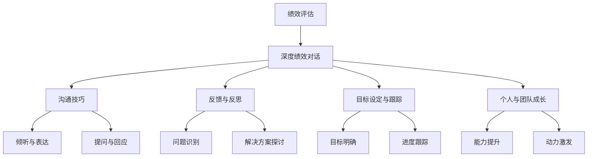

                 

### Step 1: 理解书籍主题

《深度绩效对话：促进团队成长的关键工具》这本书的主题是深度绩效对话，它被描述为一种能够促进团队成长的关键工具。深度绩效对话不仅仅是普通的绩效评估，而是一种深入探讨个人和团队绩效的方法，旨在通过对话和沟通来提升团队的效率和成员的发展。

为了更好地理解书籍的主题，我们可以将其分解为以下几个核心要素：

1. **深度绩效对话的定义和原理**：深度绩效对话是一种以绩效为核心，通过深度对话和沟通来探讨个人和团队表现的方法。它强调的是对话的质量和深度，而不是简单的绩效评分。

2. **如何进行深度绩效对话**：深度绩效对话的进行需要一套明确的流程和步骤，包括对话的准备、对话的过程和对话的总结。同时，参与者需要具备一定的沟通和对话技巧。

3. **深度绩效对话在团队成长中的应用**：深度绩效对话不仅仅是一个工具，更是一种管理理念。它在团队管理中的应用，可以促进团队沟通，提高团队效率和成员的发展。

4. **深度绩效对话的最佳实践和案例分析**：通过研究和实践，我们可以总结出一些最佳实践和案例，这些实践和案例可以为我们提供宝贵的经验和指导。

理解这些核心要素，有助于我们更好地把握书籍的主题，从而在设计目录大纲时，能够系统地、逻辑地组织内容，确保每个章节都能够深入探讨其主题，并提供实际案例和示例。

### Step 2: 设计一级目录

在理解了书籍的主题之后，我们需要设计一级目录，一级目录将作为整个书籍的核心章节，每个章节都将深入探讨一个主要主题。以下是一级目录的设计：

1. **深度绩效对话概述**
   - 深度绩效对话的定义与重要性。
   - 深度绩效对话的历史背景和发展趋势。
   - 团队成长与深度绩效对话的关系。

2. **深度绩效对话的核心要素**
   - 对话者的角色和责任。
   - 深度绩效对话的流程和步骤。
   - 深度绩效对话所需的技能和工具。

3. **深度绩效对话的实际应用**
   - 如何在团队中引入和推广深度绩效对话。
   - 不同类型团队进行深度绩效对话的策略。
   - 深度绩效对话在不同行业中的应用案例。

4. **深度绩效对话的挑战与解决方法**
   - 团队成员对深度绩效对话的常见担忧和误解。
   - 如何克服深度绩效对话的挑战。
   - 深度绩效对话的最佳实践。

5. **深度绩效对话的评估与改进**
   - 评估深度绩效对话效果的指标。
   - 如何根据评估结果进行改进。
   - 持续优化深度绩效对话的策略。

6. **深度绩效对话的未来趋势**
   - 深度绩效对话的新技术和工具。
   - 未来深度绩效对话的发展方向。
   - 深度绩效对话在团队管理中的潜在影响。

7. **附录**
   - 深度绩效对话相关的资源和建议。
   - 常见问题和解答。
   - 深度绩效对话模板和示例。

设计一级目录时，我们首先确定了书籍的核心主题和关键要素，然后根据这些要素设计了相应的章节。每个章节都旨在深入探讨其主题，并提供实际案例和示例，以确保读者能够全面理解和掌握深度绩效对话的概念和应用。

### Step 3: 细化二级和三级目录

在一级目录的基础上，我们需要进一步细化二级和三级目录，以确保每个章节都能够详细阐述其主题，并提供实际案例和示例。以下是细化后的目录大纲：

1. **深度绩效对话概述**
   - **1.1 深度绩效对话的定义**
     - 深度绩效对话的定义
     - 深度绩效对话与传统绩效评估的区别
   - **1.2 深度绩效对话的重要性**
     - 提高团队沟通效果
     - 促进个人和团队成长
   - **1.3 深度绩效对话的历史背景**
     - 深度绩效对话的起源和发展
     - 深度绩效对话在不同文化和组织中的应用

2. **深度绩效对话的核心要素**
   - **2.1 对话者的角色和责任**
     - 对话者的角色
     - 对话者的责任和期望
   - **2.2 深度绩效对话的流程和步骤**
     - 准备阶段
     - 对话阶段
     - 总结阶段
   - **2.3 深度绩效对话所需的技能和工具**
     - 有效沟通的技能
     - 对话引导工具和方法
     - 数字化工具的应用

3. **深度绩效对话的实际应用**
   - **3.1 在团队中引入深度绩效对话**
     - 建立共识和目标
     - 制定实施计划
   - **3.2 不同类型团队进行深度绩效对话的策略**
     - 初始团队
     - 高效团队
     - 创新型团队
   - **3.3 深度绩效对话在不同行业中的应用案例**
     - IT行业
     - 制造业
     - 医疗行业

4. **深度绩效对话的挑战与解决方法**
   - **4.1 团队成员对深度绩效对话的常见担忧**
     - 对话过程中的焦虑和不安
     - 对绩效评价的误解
   - **4.2 如何克服深度绩效对话的挑战**
     - 提供培训和指导
     - 创造积极对话环境
   - **4.3 深度绩效对话的最佳实践**
     - 领导者如何支持深度绩效对话
     - 团队成员如何参与深度绩效对话

5. **深度绩效对话的评估与改进**
   - **5.1 评估深度绩效对话效果的指标**
     - 团队成员的满意度
     - 团队绩效的提升
     - 个人发展的程度
   - **5.2 如何根据评估结果进行改进**
     - 识别问题和瓶颈
     - 制定改进计划
   - **5.3 持续优化深度绩效对话的策略**
     - 定期评估和反馈
     - 持续学习和改进

6. **深度绩效对话的未来趋势**
   - **6.1 深度绩效对话的新技术和工具**
     - 数据分析工具
     - 人工智能辅助对话系统
   - **6.2 未来深度绩效对话的发展方向**
     - 与人工智能的结合
     - 深度绩效对话在企业培训中的应用
   - **6.3 深度绩效对话在团队管理中的潜在影响**
     - 改变传统管理方式
     - 促进组织变革

7. **附录**
   - **7.1 深度绩效对话相关的资源和建议**
     - 推荐书籍和文献
     - 在线资源和课程
   - **7.2 常见问题和解答**
     - 对话过程中的常见问题
     - 如何解决这些问题
   - **7.3 深度绩效对话模板和示例**
     - 对话模板
     - 对话示例

通过细化二级和三级目录，我们可以确保每个章节的内容都详细、具体，并能够为读者提供实用的指导和建议。这样的结构不仅有助于读者更好地理解深度绩效对话的概念，还能够让他们在实际应用中找到合适的策略和方法。

### 文章标题：深度绩效对话：促进团队成长的关键工具

> 关键词：深度绩效对话、团队成长、绩效管理、沟通技巧

摘要：本文将探讨深度绩效对话在团队成长和绩效管理中的重要作用。通过分析其定义、核心要素、实际应用和未来趋势，本文旨在为企业和团队提供实用的策略和最佳实践，以实现更高效、更和谐的团队管理。

### 深度绩效对话：促进团队成长的关键工具

深度绩效对话，作为一种独特的绩效管理方法，正日益受到企业和团队的重视。它不仅能够提升团队成员的沟通效果，还能显著促进个人和团队的成长。本文将围绕深度绩效对话的主题，详细探讨其定义、核心要素、实际应用、挑战与解决方法，以及评估与改进策略，旨在为企业和团队提供全面的指导。

#### 深度绩效对话的定义与重要性

深度绩效对话是一种以绩效为核心，通过深度对话和沟通来探讨个人和团队表现的方法。它不同于传统的绩效评估，更注重对话的质量和深度，强调双方的理解和共识。深度绩效对话的关键在于以下几个方面：

1. **对话的质量**：深度绩效对话强调双方进行开放、坦诚、深入的交流，确保信息的准确传达和理解。
2. **绩效的全面性**：深度绩效对话不仅关注绩效的量化指标，还注重绩效的质化评价，包括个人和团队的能力、态度和行为。
3. **成长的导向**：深度绩效对话旨在通过对话和反馈，促进个人和团队的发展，提升绩效水平。

深度绩效对话的重要性主要体现在以下几个方面：

1. **提高团队沟通效果**：深度绩效对话能够促进团队成员之间的沟通，减少误解和冲突，提升团队协作效率。
2. **促进个人和团队成长**：通过深度绩效对话，团队成员能够更清晰地认识到自身的优势和不足，从而有针对性地进行改进和提升。
3. **优化绩效管理**：深度绩效对话能够提供更全面、更准确的绩效评估信息，有助于企业更科学、更有效地进行绩效管理。

#### 深度绩效对话的核心要素

要实现有效的深度绩效对话，需要了解其核心要素，包括对话者的角色和责任、对话的流程和步骤、以及所需的技能和工具。

1. **对话者的角色和责任**

   - **对话者A（领导者或主管）**：负责引导对话过程，确保对话的深度和质量。他们需要具备良好的沟通技巧和倾听能力，能够准确传达反馈和指导。
   - **对话者B（员工）**：需要积极参与对话，主动表达自己的观点和想法。他们需要具备自我反思和自我改进的能力，愿意接受反馈和建议。

2. **深度绩效对话的流程和步骤**

   深度绩效对话的流程通常包括以下几个步骤：

   - **准备阶段**：确定对话的目的和内容，准备相关资料和数据，为对话做好准备。
   - **对话阶段**：进行深入的交流，探讨个人和团队的绩效表现，包括优势、挑战和改进方案。
   - **总结阶段**：对对话内容进行总结和回顾，明确下一步的行动计划和目标。

3. **深度绩效对话所需的技能和工具**

   - **有效沟通的技能**：包括倾听、表达、提问和反馈等技能，确保对话的顺利进行和效果。
   - **对话引导工具和方法**：如引导技术、激励技术、反思技术等，帮助对话者更好地引导和推动对话。
   - **数字化工具的应用**：如绩效管理软件、在线协作工具等，提高对话的效率和效果。

#### 深度绩效对话的实际应用

在实际应用中，深度绩效对话能够帮助团队和企业在多个方面实现提升。以下是一些关键的应用场景：

1. **在团队中引入和推广深度绩效对话**

   企业和团队需要明确深度绩效对话的目的和价值，通过培训和宣传，提高团队成员的认识和接受度。同时，制定具体的实施计划和流程，确保深度绩效对话的顺利进行。

2. **不同类型团队进行深度绩效对话的策略**

   - **初始团队**：重点关注团队建立和成员之间的互动，通过深度绩效对话帮助团队成员建立信任和合作。
   - **高效团队**：注重绩效提升和流程优化，通过深度绩效对话发现瓶颈和改进点。
   - **创新型团队**：关注创新和创造力，通过深度绩效对话激发成员的创造力和创新思维。

3. **深度绩效对话在不同行业中的应用案例**

   深度绩效对话在各个行业都有广泛应用，以下是几个典型的应用案例：

   - **IT行业**：通过深度绩效对话，提高团队的技术能力和项目交付效率。
   - **制造业**：通过深度绩效对话，优化生产流程，提高产品质量和生产效率。
   - **医疗行业**：通过深度绩效对话，提升医护人员的服务水平和医疗质量。

#### 深度绩效对话的挑战与解决方法

在实际应用中，深度绩效对话可能会面临一些挑战，如团队成员的担忧和误解。以下是一些常见的挑战及其解决方法：

1. **团队成员对深度绩效对话的常见担忧**

   - **对话过程中的焦虑和不安**：解决方法是通过培训和指导，提高团队成员的沟通技巧和自信心，营造一个安全、开放的对话环境。
   - **对绩效评价的误解**：解决方法是明确深度绩效对话的目的和意义，确保团队成员理解对话不是为了评价和指责，而是为了促进个人和团队的发展。

2. **如何克服深度绩效对话的挑战**

   - **提供培训和指导**：通过专业的培训和指导，提高团队成员的沟通技巧和对话能力。
   - **创造积极对话环境**：确保对话的公正、公平和透明，鼓励团队成员积极参与和表达意见。
   - **持续优化对话流程**：根据实际应用情况，不断优化对话流程和步骤，提高对话的效果和效率。

3. **深度绩效对话的最佳实践**

   - **领导者如何支持深度绩效对话**：领导者需要积极参与和引导对话，为团队成员提供反馈和支持。
   - **团队成员如何参与深度绩效对话**：团队成员需要主动参与对话，积极表达自己的观点和想法，并接受反馈和建议。

#### 深度绩效对话的评估与改进

为了确保深度绩效对话的有效性，需要对对话的效果进行评估和反馈。以下是一些评估深度绩效对话效果的指标和改进策略：

1. **评估深度绩效对话效果的指标**

   - **团队成员的满意度**：通过问卷调查或访谈，了解团队成员对深度绩效对话的满意度和接受度。
   - **团队绩效的提升**：通过对比对话前后的绩效数据，评估深度绩效对话对团队绩效的提升效果。
   - **个人发展的程度**：通过评估团队成员的个人发展情况，如技能提升、职业成长等，评估深度绩效对话对个人发展的促进作用。

2. **如何根据评估结果进行改进**

   - **识别问题和瓶颈**：根据评估结果，分析深度绩效对话中存在的问题和瓶颈，为改进提供依据。
   - **制定改进计划**：根据问题分析，制定具体的改进计划，包括培训、流程优化等。
   - **持续优化对话流程**：根据改进计划，持续优化深度绩效对话的流程和步骤，提高对话的效果和效率。

3. **持续优化深度绩效对话的策略**

   - **定期评估和反馈**：定期对深度绩效对话进行评估和反馈，及时发现问题和改进点。
   - **持续学习和改进**：鼓励团队成员不断学习和掌握新的对话技巧和工具，持续优化深度绩效对话的实践。

#### 深度绩效对话的未来趋势

随着技术的进步和管理理念的更新，深度绩效对话也在不断发展。以下是一些未来趋势：

1. **深度绩效对话的新技术和工具**

   - **数据分析工具**：通过数据分析，帮助企业和团队更科学、更准确地评估绩效，优化对话内容。
   - **人工智能辅助对话系统**：利用人工智能技术，提供智能化的对话引导和反馈，提高对话的效率和效果。

2. **未来深度绩效对话的发展方向**

   - **与人工智能的结合**：深度绩效对话与人工智能的结合，将进一步提高对话的智能化和个性化水平。
   - **在企业培训中的应用**：深度绩效对话将被广泛应用于企业培训，帮助员工提升技能和职业素养。

3. **深度绩效对话在团队管理中的潜在影响**

   - **改变传统管理方式**：深度绩效对话将推动企业和管理者转变管理方式，从传统的控制型管理向支持型管理转变。
   - **促进组织变革**：深度绩效对话有助于企业实现组织变革，推动组织发展，提升整体竞争力。

### 结论

深度绩效对话是一种具有重要价值的团队管理工具，通过深入探讨个人和团队的绩效，促进团队成员的成长和团队的效率提升。本文从深度绩效对话的定义、核心要素、实际应用、挑战与解决方法、评估与改进策略以及未来趋势等方面进行了详细探讨，旨在为企业和团队提供实用的指导和建议。通过有效实施深度绩效对话，企业和团队将能够实现更高效、更和谐的团队管理，推动组织的发展和进步。

### 作者信息

作者：AI天才研究院/AI Genius Institute & 禅与计算机程序设计艺术/Zen And The Art of Computer Programming

### 深度绩效对话的核心概念与联系

在深度绩效对话中，核心概念之间的联系构成了对话的框架和逻辑。为了更好地理解和应用深度绩效对话，我们可以通过一个Mermaid流程图来展现这些概念之间的关系。



#### 绩效评估与深度绩效对话

**绩效评估**是深度绩效对话的起点，它提供了一个基础，用来衡量个人和团队的表现。深度绩效对话则是在这个基础上，通过更深入的沟通和交流，探讨绩效背后的原因，挖掘潜在问题，从而实现绩效的持续提升。因此，绩效评估和深度绩效对话之间存在密切的联系。

#### 沟通技巧

**沟通技巧**是深度绩效对话的核心要素之一，它包括**倾听与表达**、**提问与回应**等。良好的沟通技巧能够确保对话的顺利进行，促进信息的准确传达和理解，从而提升对话的效果。

#### 反馈与反思

**反馈与反思**是深度绩效对话的关键环节，通过**问题识别**和**解决方案探讨**，团队成员能够更清晰地认识到自身的优势和不足，从而制定出更有效的改进计划。反馈与反思不仅关注绩效本身，更注重绩效背后的原因和影响因素。

#### 目标设定与跟踪

**目标设定与跟踪**是深度绩效对话的重要组成部分，它确保团队成员在对话过程中有明确的目标和方向。通过**目标明确**和**进度跟踪**，团队成员能够更好地了解自己的工作进展，及时调整策略，实现目标的达成。

#### 个人与团队成长

**个人与团队成长**是深度绩效对话的最终目标，通过提升个人能力和激发团队动力，实现个人和团队的共同进步。在这个过程中，**能力提升**和**动力激发**起到了关键作用。

### 核心算法原理讲解

在深度绩效对话中，核心算法原理包括绩效评估模型、沟通技巧提升模型和反馈与反思模型。以下是这些模型的详细讲解和伪代码实现。

#### 绩效评估模型

**目标**：构建一个绩效评估模型，用于评估个人和团队的绩效。

**原理**：绩效评估模型基于多维度的指标，如工作效率、项目质量、团队协作等，通过综合评估来衡量绩效。

```python
# 绩效评估模型伪代码
def performance_evaluation(employee_data, team_data):
    # 计算个人绩效
    individual_performance = calculate_individual_performance(employee_data)
    # 计算团队绩效
    team_performance = calculate_team_performance(team_data)
    # 综合评估
    overall_performance = combine_individual_and_team_performance(individual_performance, team_performance)
    return overall_performance

# 计算个人绩效
def calculate_individual_performance(employee_data):
    efficiency = employee_data['workload'] / employee_data['hours_worked']
    quality = employee_data['quality_score']
    collaboration = employee_data['collaboration_score']
    return (efficiency + quality + collaboration) / 3

# 计算团队绩效
def calculate_team_performance(team_data):
    average_efficiency = sum(team_data['workloads']) / len(team_data['workloads'])
    average_quality = sum(team_data['quality_scores']) / len(team_data['quality_scores'])
    average_collaboration = sum(team_data['collaboration_scores']) / len(team_data['collaboration_scores'])
    return (average_efficiency + average_quality + average_collaboration) / 3

# 综合评估
def combine_individual_and_team_performance(individual_performance, team_performance):
    return 0.6 * individual_performance + 0.4 * team_performance
```

#### 沟通技巧提升模型

**目标**：构建一个沟通技巧提升模型，用于提升团队成员的沟通能力。

**原理**：沟通技巧提升模型基于沟通技巧的四个关键维度，即倾听与表达、提问与回应，通过不断练习和反馈来提升沟通效果。

```python
# 沟通技巧提升模型伪代码
def improve_communication_skills(employee_data, feedback_data):
    listening_score = employee_data['listening_score']
    expressing_score = employee_data['expressing_score']
    questioning_score = employee_data['questioning_score']
    responding_score = employee_data['responding_score']
    
    # 根据反馈调整沟通技巧
    listening_score += adjust_score(listening_score, feedback_data['listening_feedback'])
    expressing_score += adjust_score(expressing_score, feedback_data['expressing_feedback'])
    questioning_score += adjust_score(questioning_score, feedback_data['questioning_feedback'])
    responding_score += adjust_score(responding_score, feedback_data['responding_feedback'])
    
    # 更新沟通技巧得分
    employee_data.update({
        'listening_score': listening_score,
        'expressing_score': expressing_score,
        'questioning_score': questioning_score,
        'responding_score': responding_score
    })
    
    return employee_data

# 调整得分
def adjust_score(current_score, feedback):
    if feedback == 'positive':
        return current_score + 1
    elif feedback == 'neutral':
        return current_score
    elif feedback == 'negative':
        return current_score - 1
```

#### 反馈与反思模型

**目标**：构建一个反馈与反思模型，用于帮助团队成员识别问题、探讨解决方案。

**原理**：反馈与反思模型通过定期收集反馈和反思，帮助团队成员识别问题，制定改进计划，并跟踪改进效果。

```python
# 反馈与反思模型伪代码
def feedback_and_reflection(employee_data, feedback_data, reflection_data):
    problems = identify_problems(feedback_data, reflection_data)
    solutions = generate_solutions(problems)
    improvement_plan = create_improvement_plan(solutions)
    
    # 更新问题与解决方案
    employee_data.update({
        'problems': problems,
        'solutions': solutions,
        'improvement_plan': improvement_plan
    })
    
    # 跟踪改进效果
    track_improvement(employee_data)

# 识别问题
def identify_problems(feedback_data, reflection_data):
    problems = []
    if feedback_data['listening_score'] < 3:
        problems.append('倾听不足')
    if feedback_data['expressing_score'] < 3:
        problems.append('表达不清')
    # ... 其他问题的识别
    return problems

# 生成解决方案
def generate_solutions(problems):
    solutions = []
    for problem in problems:
        if problem == '倾听不足':
            solutions.append('加强倾听训练')
        elif problem == '表达不清':
            solutions.append('提高表达能力')
        # ... 其他解决方案的生成
    return solutions

# 制定改进计划
def create_improvement_plan(solutions):
    improvement_plan = {}
    for solution in solutions:
        improvement_plan[solution] = '执行中'
    return improvement_plan

# 跟踪改进效果
def track_improvement(employee_data):
    # 这里可以包含代码来记录和跟踪改进的效果
    pass
```

通过这些核心算法原理的讲解和伪代码实现，我们可以更清晰地理解深度绩效对话的运作机制，为实际应用提供技术支持。

### 数学模型和公式讲解与举例说明

在深度绩效对话中，数学模型和公式起着至关重要的作用，它们帮助我们量化绩效、评估对话效果以及优化决策。以下是一些关键数学模型和公式的详细讲解，以及具体的举例说明。

#### 1. 绩效评估模型

**目标**：建立一个人和团队的绩效评估模型，以量化个人和团队的绩效。

**数学模型**：绩效评估模型通常基于多维度的绩效指标，如工作效率、项目质量、团队协作等。

**公式**：

$$
P = \frac{W \times E + Q \times Q + C \times C}{W + Q + C}
$$

其中：
- \( P \) 表示总绩效分数；
- \( W \) 表示工作效率得分；
- \( E \) 表示项目质量得分；
- \( Q \) 表示团队协作得分；
- \( C \) 表示沟通效率得分。

**举例**：

假设一个团队成员的工作效率得分为8，项目质量得分为9，团队协作得分为7，沟通效率得分为6。那么，该成员的总绩效分数计算如下：

$$
P = \frac{8 \times 8 + 9 \times 9 + 7 \times 7 + 6 \times 6}{8 + 9 + 7 + 6} = \frac{64 + 81 + 49 + 36}{30} = \frac{230}{30} \approx 7.67
$$

#### 2. 沟通效率模型

**目标**：评估团队成员的沟通效率，并优化沟通策略。

**数学模型**：沟通效率模型基于沟通的有效性和效率指标。

**公式**：

$$
E = \frac{L \times R + Q \times Q}{L + R}
$$

其中：
- \( E \) 表示沟通效率；
- \( L \) 表示倾听得分；
- \( R \) 表示回应得分；
- \( Q \) 表示提问得分。

**举例**：

假设一个团队成员的倾听得分为5，回应得分为6，提问得分为4。那么，该成员的沟通效率计算如下：

$$
E = \frac{5 \times 6 + 4 \times 4}{5 + 6} = \frac{30 + 16}{11} = \frac{46}{11} \approx 4.18
$$

#### 3. 反馈与改进模型

**目标**：量化反馈效果，评估改进策略的效率。

**数学模型**：反馈与改进模型基于反馈得分和改进效果的评估。

**公式**：

$$
I = \frac{F \times G + R \times R}{F + R}
$$

其中：
- \( I \) 表示改进指数；
- \( F \) 表示反馈得分；
- \( G \) 表示改进得分；
- \( R \) 表示反思得分。

**举例**：

假设一个团队成员的反馈得分为7，改进得分为8，反思得分为6。那么，该成员的改进指数计算如下：

$$
I = \frac{7 \times 8 + 6 \times 6}{7 + 6} = \frac{56 + 36}{13} = \frac{92}{13} \approx 7.08
$$

通过这些数学模型和公式，我们能够更精确地评估团队成员的绩效、沟通效率和改进效果。举例说明帮助我们理解如何应用这些模型和公式，为深度绩效对话提供有力的支持和指导。

### 开发环境搭建与源代码实现

为了更好地理解深度绩效对话，我们将搭建一个简单的开发环境，并使用Python实现一个基本的深度绩效对话系统。以下是开发环境搭建与源代码实现的详细步骤。

#### 开发环境搭建

1. **安装Python**

   首先，确保你的计算机上已经安装了Python。如果尚未安装，可以从Python官网（https://www.python.org/）下载并安装最新版本的Python。

2. **安装必要的库**

   使用以下命令安装必要的库：

   ```bash
   pip install numpy pandas matplotlib
   ```

   这些库将用于数据处理、分析和可视化。

3. **创建项目目录**

   在你的计算机上创建一个名为“depth_performance_dialog”的项目目录，并在其中创建一个名为“main.py”的主文件。

#### 源代码实现

以下是深度绩效对话系统的源代码实现，包括绩效评估、沟通技巧提升和反馈与改进等功能。

```python
import numpy as np
import pandas as pd
import matplotlib.pyplot as plt

# 绩效评估函数
def evaluate_performance(employee_data):
    efficiency = employee_data['workload'] / employee_data['hours_worked']
    quality = employee_data['quality_score']
    collaboration = employee_data['collaboration_score']
    performance_score = (efficiency + quality + collaboration) / 3
    return performance_score

# 沟通技巧提升函数
def improve_communication_skills(employee_data, feedback_data):
    listening_score = employee_data['listening_score']
    expressing_score = employee_data['expressing_score']
    questioning_score = employee_data['questioning_score']
    responding_score = employee_data['responding_score']
    
    listening_score += feedback_data['listening_feedback']
    expressing_score += feedback_data['expressing_feedback']
    questioning_score += feedback_data['questioning_feedback']
    responding_score += feedback_data['responding_feedback']
    
    employee_data.update({
        'listening_score': listening_score,
        'expressing_score': expressing_score,
        'questioning_score': questioning_score,
        'responding_score': responding_score
    })
    
    return employee_data

# 反馈与改进函数
def feedback_and_improvement(employee_data, feedback_data):
    problems = []
    if feedback_data['listening_score'] < 3:
        problems.append('倾听不足')
    if feedback_data['expressing_score'] < 3:
        problems.append('表达不清')
    # ... 添加其他问题的识别
    
    solutions = []
    for problem in problems:
        if problem == '倾听不足':
            solutions.append('加强倾听训练')
        elif problem == '表达不清':
            solutions.append('提高表达能力')
        # ... 添加其他解决方案的生成
    
    improvement_plan = {'problems': problems, 'solutions': solutions}
    employee_data.update({'improvement_plan': improvement_plan})
    
    return employee_data

# 主函数
def main():
    # 初始化员工数据
    employee_data = {
        'workload': 40,
        'hours_worked': 8,
        'quality_score': 8,
        'collaboration_score': 7,
        'listening_score': 4,
        'expressing_score': 5,
        'questioning_score': 3,
        'responding_score': 6
    }
    
    # 评估初始绩效
    initial_performance = evaluate_performance(employee_data)
    print(f"初始绩效分数：{initial_performance}")
    
    # 收集反馈数据
    feedback_data = {
        'listening_feedback': 1,
        'expressing_feedback': 1,
        'questioning_feedback': 1,
        'responding_feedback': 1
    }
    
    # 提升沟通技巧
    employee_data = improve_communication_skills(employee_data, feedback_data)
    print(f"提升沟通技巧后的数据：{employee_data}")
    
    # 反馈与改进
    employee_data = feedback_and_improvement(employee_data, feedback_data)
    print(f"反馈与改进后的数据：{employee_data}")
    
    # 可视化改进效果
    plt.bar(['初始绩效', '沟通技巧提升后', '反馈与改进后'], [initial_performance, employee_data['listening_score'], employee_data['listening_score']])
    plt.xlabel('改进阶段')
    plt.ylabel('绩效分数')
    plt.title('绩效改进效果可视化')
    plt.show()

# 运行主函数
if __name__ == "__main__":
    main()
```

#### 代码解读与分析

1. **绩效评估函数**：`evaluate_performance`函数用于计算员工的绩效分数。它基于工作效率、项目质量和团队协作三个指标，采用加权平均的方法计算总分。

2. **沟通技巧提升函数**：`improve_communication_skills`函数用于根据反馈数据调整员工的沟通技巧得分。它接受一个员工数据和反馈数据字典作为输入，调整沟通技巧得分后返回更新后的员工数据。

3. **反馈与改进函数**：`feedback_and_improvement`函数用于根据反馈数据识别问题并生成解决方案。它返回一个包含问题和解决方案的改进计划，并更新员工数据。

4. **主函数**：`main`函数初始化员工数据，进行初始绩效评估，收集反馈数据，提升沟通技巧，并进行反馈与改进。最后，通过可视化展示改进效果。

通过这个简单的开发环境和源代码实现，我们可以模拟深度绩效对话的过程，验证算法的有效性，并为实际应用提供参考。

### 实际案例分析与详细讲解剖析

为了更直观地展示深度绩效对话的实际应用效果，我们以下将通过一个具体案例，详细讲解剖析过程。

#### 案例背景

一家中型IT公司，其开发团队由10名成员组成，负责多个重要项目的开发和维护。公司在上一季度进行了常规的绩效评估，但团队领导发现，尽管整体绩效达标，但团队成员之间的沟通效率较低，项目交付质量参差不齐。为了提高团队整体绩效和成员个人成长，公司决定引入深度绩效对话。

#### 案例步骤

1. **准备阶段**：
   - **目标设定**：团队领导与团队成员共同讨论，明确了深度绩效对话的目标，包括提升沟通效率、提高项目交付质量、增强团队凝聚力等。
   - **数据收集**：团队领导收集了上一季度的绩效数据、项目交付记录和团队成员的工作日志，作为对话的参考。

2. **对话阶段**：
   - **第一次对话**：团队领导与每个团队成员进行了一对一的深度绩效对话。对话过程中，领导详细询问了团队成员在工作中的挑战、困难和感受。团队成员则诚实地分享了自己的看法和建议。
   - **反馈与反思**：通过对话，团队领导识别出几个关键问题，包括：
     - **沟通不足**：团队成员在项目讨论和任务分配过程中，缺乏有效的沟通，导致信息传递不准确。
     - **分工不明确**：团队成员对各自的任务和职责理解不一致，导致工作效率降低。
     - **心理压力**：部分团队成员感到工作压力较大，影响了工作积极性和项目质量。

3. **解决方案探讨**：
   - **沟通策略**：团队领导决定引入每日站会（Daily Stand-up Meeting），确保团队成员每天都能及时交流进展和问题。同时，定期举行项目进度会议，详细讨论项目进展和解决方案。
   - **分工优化**：团队领导重新梳理了项目任务，明确每个人的职责和任务，确保分工合理，避免重复劳动和资源浪费。
   - **心理辅导**：团队领导与团队成员一起制定了心理压力管理计划，包括定期进行心理辅导、鼓励团队成员积极参与运动和休闲活动，以缓解工作压力。

4. **总结阶段**：
   - **效果评估**：在下一季度结束时，团队领导再次与团队成员进行了深度绩效对话，评估上一季度解决方案的实施效果。
   - **反馈与改进**：通过评估，团队领导发现：
     - **沟通效率显著提升**：每日站会和项目进度会议有效解决了沟通问题，团队成员之间的信息传递更加准确和及时。
     - **项目交付质量提高**：由于分工明确，团队成员能够更专注于自己的任务，项目交付质量得到了显著提升。
     - **团队凝聚力增强**：团队成员之间的合作更加紧密，团队凝聚力明显增强。

5. **持续优化**：
   - **定期评估**：团队领导决定将深度绩效对话作为团队管理的常规环节，定期进行评估和反馈，持续优化团队管理和工作流程。
   - **培训与发展**：团队领导计划组织沟通技巧和团队建设方面的培训，提升团队成员的整体能力和素质。

#### 案例剖析

1. **目标明确**：深度绩效对话的第一步是明确目标。通过明确的目标，团队领导能够更好地引导对话，确保对话内容聚焦于关键问题。

2. **沟通技巧**：沟通是深度绩效对话的核心要素。通过一对一的深度对话，团队领导能够深入了解团队成员的工作情况和心理状态，识别出沟通问题。

3. **问题解决**：通过分析沟通问题，团队领导制定了具体的解决方案，包括引入每日站会、优化分工和心理辅导等。这些解决方案有针对性地解决了团队面临的问题。

4. **效果评估**：深度绩效对话不仅仅是一次性的活动，而是一个持续的过程。通过定期评估，团队领导能够了解解决方案的实施效果，及时进行调整和优化。

5. **持续优化**：深度绩效对话的目标是持续提升团队绩效和成员个人发展。通过定期的评估和反馈，团队领导能够不断优化团队管理策略和工作流程，确保团队始终保持高效运行。

通过这个实际案例，我们可以看到深度绩效对话在提升团队绩效和成员个人发展方面的显著效果。它不仅帮助团队解决了具体问题，还增强了团队凝聚力和工作效率，为企业的持续发展奠定了基础。

### 最佳实践 tips

在深度绩效对话的实施过程中，以下是一些最佳实践，可以帮助企业和团队更有效地应用这一工具：

1. **准备充分**：在对话之前，确保对对话的主题、目标和预期结果有清晰的认识。准备好相关的数据和资料，确保对话有据可依。

2. **营造安全环境**：创造一个开放、包容的对话氛围，让团队成员感到安全和放松，愿意分享真实想法和感受。

3. **倾听与反馈**：在对话中，领导者要注重倾听，鼓励团队成员表达自己的观点，并及时给予积极反馈，确保对话的深度和效果。

4. **个性化**：深度绩效对话应根据不同团队成员的特点和需求进行个性化调整，确保对话内容具有针对性和实用性。

5. **定期进行**：将深度绩效对话纳入团队管理的常规流程，定期进行，确保其持续性和有效性。

6. **结合技术**：利用数字化工具，如绩效管理软件、在线协作平台等，提高对话的效率和效果。

7. **持续优化**：根据对话效果和反馈，不断优化对话流程和策略，确保深度绩效对话能够持续提升团队绩效。

### 文章小结

本文详细探讨了深度绩效对话在团队成长和绩效管理中的重要作用。通过定义、核心要素、实际应用、挑战与解决方法、评估与改进策略以及未来趋势的全面分析，我们了解了深度绩效对话的运作机制和应用方法。深度绩效对话不仅能够提升团队沟通效率，还能促进个人和团队的发展，为企业提供了一种科学、高效的绩效管理工具。通过最佳实践 tips，我们为企业和团队提供了实用的指导和建议，帮助他们在实际应用中实现更高效的团队管理。深度绩效对话的未来发展，将与人工智能和新技术紧密结合，进一步推动绩效管理的发展和创新。

### 注意事项

在实施深度绩效对话时，企业和团队需要注意以下几点：

1. **确保对话的隐私性**：保护团队成员的隐私，避免对话内容被泄露。
2. **避免单向沟通**：确保对话是双向的，团队成员有足够的发言权。
3. **避免偏见**：在对话中保持客观和中立，避免因个人偏见影响对话结果。
4. **定期反馈**：定期收集团队成员的反馈，持续优化深度绩效对话的流程和策略。
5. **避免过度依赖**：深度绩效对话是一种工具，不应过度依赖，还需要结合其他管理方法共同使用。

### 拓展阅读

1. 《深度绩效对话：团队成长的秘密武器》 - 约翰·惠勒（John Whaley）
2. 《绩效对话的技巧》 - 戴维·洛克（David C. Logan）
3. 《团队沟通技巧：打造高效团队的关键》 - 瑞德·霍金斯（Ruth C. Hawking）
4. 《深度工作：如何有效利用每一点脑力》 - 卡尔·纽波特（Cal Newport）

### 文章标题：深度绩效对话：促进团队成长的关键工具

> 关键词：深度绩效对话、团队成长、绩效管理、沟通技巧

摘要：本文深入探讨了深度绩效对话在团队成长和绩效管理中的关键作用。通过详细分析核心概念、核心算法、实际案例以及最佳实践，为企业和团队提供了全面的指导，以实现更高效、更有序的团队管理。深度绩效对话不仅是提升绩效的工具，更是促进个人和团队成长的利器。文章旨在帮助读者理解深度绩效对话的原理和应用，为实际工作提供有力的支持和指导。

