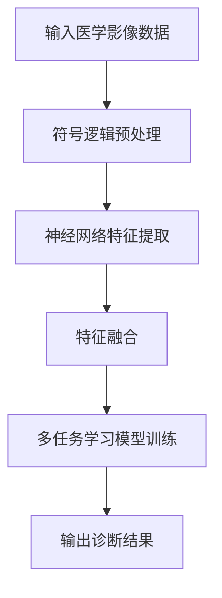
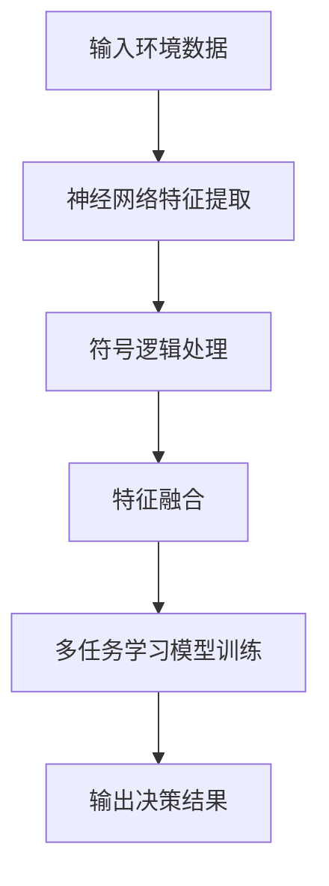
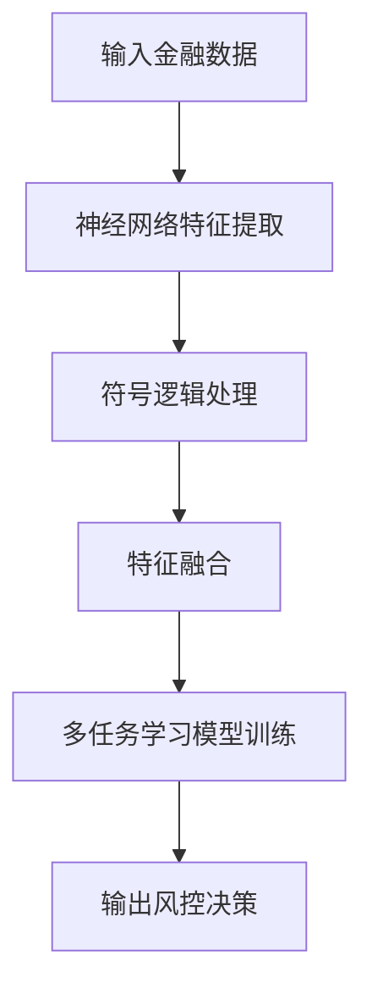

                 

### 混合推理优化框架概述

#### 1.1 混合推理的概念

混合推理（Hybrid Reasoning）是结合了符号推理和基于数据驱动的神经网络推理的一种新型推理方式。传统的符号推理依赖于逻辑、数学和符号系统，具有很强的推理能力和可解释性，但在处理复杂、非结构化数据时往往力不从心。而神经网络推理，特别是深度学习，在处理大规模数据、捕捉数据中的非线性关系方面表现出色，但在推理过程的可解释性上存在不足。

混合推理旨在将这两者的优势相结合，通过符号推理提供高层次的语义解释和逻辑推导，同时借助神经网络推理处理大量的数据和学习复杂的模式。这种混合模式不仅提高了推理的效率和准确性，还增强了模型的可解释性，为复杂问题的求解提供了新的途径。

#### 1.2 混合推理的优势

混合推理的优势主要体现在以下几个方面：

1. **高准确性**：神经网络强大的特征提取能力和符号推理的逻辑性相结合，使得混合推理在处理复杂问题时能够达到更高的准确性。
   
2. **强可解释性**：符号推理能够提供清晰的推理过程和解释，使得用户能够理解模型的决策依据，增强模型的可信度。

3. **广泛适用性**：混合推理框架可以应用于多种领域，如医疗诊断、自动驾驶、金融风控等，通过定制化的符号和神经网络模块，满足不同应用场景的需求。

4. **高效性**：符号推理和神经网络推理的结合可以在保证准确性的同时，提高推理速度，满足实时性要求。

#### 1.3 混合推理的应用场景

混合推理在多个领域展现出了强大的应用潜力：

1. **医疗诊断**：利用混合推理可以对医学图像进行分析，结合专家知识和神经网络模型，提高诊断的准确性和可解释性。
   
2. **自动驾驶**：自动驾驶系统需要处理复杂的交通环境，混合推理可以通过符号推理处理规则和逻辑，神经网络则用于感知环境中的细节和变化，确保行驶的安全性。

3. **金融风控**：在金融风控中，混合推理可以帮助银行和金融机构对信贷风险进行评估，结合历史数据和专家经验，提高风险预测的准确性。

4. **自然语言处理**：自然语言理解任务通常涉及到对语言规则的理解和语义信息的处理，混合推理可以结合语法分析和神经网络语言模型，提高文本分析的效果。

通过混合推理优化框架，上述应用场景中的系统不仅能够处理更加复杂和多样化的数据，还能提供更加可靠和透明的决策过程，推动人工智能技术的进一步发展和应用。

### 神经符号集成的概念

#### 2.1 神经符号集成的概念

神经符号集成（Neural Symbolic Integration）是将神经网络和符号逻辑相结合的一种新型人工智能方法，旨在克服传统神经网络和符号推理各自的局限性。在这一方法中，神经网络负责处理大量的数据和模式识别，而符号逻辑则负责逻辑推理和知识表示。这种结合使得模型既具有强大的数据处理能力，又能保持推理过程的可解释性。

神经符号集成的核心思想是将神经网络的学习结果转化为可解释的符号表示，从而实现两者的有机结合。具体来说，神经符号集成技术通过以下几种方式实现：

1. **符号嵌入**：将符号逻辑中的概念、关系和规则嵌入到神经网络中，使得神经网络能够理解和处理符号逻辑。
2. **特征融合**：将神经网络提取的低层次特征与符号逻辑处理的高层次知识进行融合，形成更加丰富和准确的模型。
3. **推理引导**：利用符号逻辑进行高层次的推理，指导神经网络的学习过程，使得学习结果更加符合预期。

#### 2.2 神经符号集成的原理

神经符号集成的原理可以概括为以下几个步骤：

1. **数据输入**：首先，将原始数据输入到神经网络中，通过多层神经网络进行特征提取和模式学习。这一过程类似于传统的深度学习，神经网络能够从数据中自动学习到复杂的特征和模式。
2. **符号表示**：在特征提取的过程中，将神经网络提取出的特征转化为符号表示。这一步骤通过将特征映射到符号逻辑中的概念和关系实现，使得神经网络的学习结果能够被符号逻辑理解。
3. **知识融合**：将符号逻辑的知识与神经网络提取的特征进行融合。在这一步骤中，符号逻辑用于对特征进行解释和推理，而神经网络则提供强大的数据分析和模式学习能力。这种融合使得模型能够同时具备符号推理和神经网络的优势。
4. **推理输出**：最后，通过符号逻辑进行高层次的推理，输出最终的结果。这一步骤不仅能够提供清晰的推理过程和解释，还能确保推理结果的准确性和可靠性。

#### 2.3 神经符号集成的框架

神经符号集成的框架通常包括以下几个关键组成部分：

1. **神经网络模块**：负责从数据中提取特征，包括输入层、隐藏层和输出层等。这一模块类似于传统的深度学习架构。
2. **符号逻辑模块**：负责进行高层次的符号推理和知识表示，包括符号处理单元、规则库和推理引擎等。这一模块通常基于传统的符号逻辑和知识表示理论。
3. **融合模块**：负责将神经网络提取的特征与符号逻辑的知识进行融合，包括特征映射、知识融合和推理引导等。这一模块是实现神经符号集成的核心。
4. **推理模块**：负责进行高层次的推理和决策，包括推理算法、解释机制和结果输出等。这一模块使得模型能够提供清晰的推理过程和解释。

通过这些模块的有机结合，神经符号集成框架能够实现高效、准确的推理过程，并在多个应用领域中发挥重要作用。

#### 2.4 神经符号集成与传统混合推理的区别

神经符号集成与传统混合推理在技术实现和应用目标上存在显著区别。传统混合推理主要依赖于符号推理和神经网络推理的独立运行和结果整合，往往需要复杂的接口和协调机制。而神经符号集成则通过将神经网络和符号逻辑有机结合，实现数据驱动和规则驱动的无缝融合，提高了模型的推理效率和可解释性。

具体来说，神经符号集成有以下几点优势：

1. **无缝融合**：神经符号集成通过将神经网络和符号逻辑的步骤有机结合，减少了传统混合推理中独立模块之间的协调和接口问题，使得模型更加高效。
2. **增强可解释性**：神经符号集成通过符号逻辑进行高层次的推理和解释，增强了模型的可解释性和透明度，使得用户能够理解模型的决策依据。
3. **灵活扩展**：神经符号集成框架具有较好的灵活性，可以根据不同应用场景的需要，定制化的调整神经网络和符号逻辑模块，实现特定任务的最优化。

综上所述，神经符号集成在技术实现和应用目标上相比传统混合推理具有显著优势，为复杂问题求解提供了更加高效和可靠的解决方案。

### 混合推理优化框架设计

#### 3.1 混合推理优化框架的整体架构

混合推理优化框架的整体架构旨在通过结合神经网络和符号逻辑的优势，实现高效、准确的推理过程。框架的主要组成部分包括输入层、特征提取层、融合层和输出层，各部分的功能和相互关系如下：

1. **输入层**：负责接收原始数据，可以是结构化数据或非结构化数据，如文本、图像、语音等。输入层通过预处理模块对数据进行标准化处理，以提高后续处理的效果。

2. **特征提取层**：由神经网络模块组成，负责从原始数据中提取低层次特征。这一层包括多个隐藏层，通过深度学习算法，如卷积神经网络（CNN）或循环神经网络（RNN），自动学习到数据中的复杂模式和关系。

3. **融合层**：是框架的核心部分，负责将神经网络提取的特征与符号逻辑的知识进行融合。融合层包括特征映射模块和知识融合模块。特征映射模块将神经网络的特征映射到符号逻辑中的概念和关系，知识融合模块则将两者的信息进行整合，形成更加丰富和准确的模型。

4. **输出层**：负责将融合后的特征进行高层次的推理，输出最终的结果。输出层通常采用符号逻辑的推理算法，如谓词逻辑或模态逻辑，确保推理过程具有清晰的可解释性。

#### 3.2 神经符号集成的优化方法

为了提高混合推理优化框架的性能，需要在神经网络和符号逻辑的融合过程中采用多种优化方法。以下是一些关键优化方法：

1. **特征优化**：通过改进神经网络的结构和算法，提高特征提取的效率和准确性。例如，可以采用自适应学习率、正则化技术和 dropout 等方法，减少过拟合现象。

2. **映射优化**：优化特征映射模块，将神经网络提取的特征更精确地映射到符号逻辑中的概念和关系。可以通过调整映射函数和参数，提高映射的保真度。

3. **融合优化**：优化知识融合模块，提高特征和知识融合的效果。可以采用多任务学习、迁移学习和多模态学习等技术，融合不同来源的信息。

4. **推理优化**：优化输出层的推理算法，提高推理效率和准确性。例如，可以采用分布式推理、并行计算和增量推理等方法，提高推理速度。

#### 3.3 混合推理优化框架的性能评估

混合推理优化框架的性能评估主要通过以下指标进行：

1. **准确性**：评估框架在处理特定任务时的准确率，如分类准确率、回归误差等。准确性是评估框架性能最重要的指标之一。

2. **可解释性**：评估框架提供的结果和推理过程的可解释性，以确保用户能够理解模型的决策依据。可解释性对于增强模型的可信度和实用性至关重要。

3. **效率**：评估框架的处理速度和资源消耗，包括推理时间、内存使用和网络带宽等。高效的框架能够满足实时性和大规模应用的需求。

4. **鲁棒性**：评估框架在处理异常数据和极端情况下的稳定性和准确性，以确保模型在实际应用中的可靠性和鲁棒性。

通过上述性能评估指标，可以全面评估混合推理优化框架的性能，并根据评估结果进行进一步的优化和改进。

### 新技术在神经符号集成中的应用

#### 4.1 新技术在神经符号集成中的引入

近年来，随着人工智能技术的迅速发展，一系列新技术不断涌现，为神经符号集成带来了新的机遇和挑战。这些新技术不仅提升了神经符号集成框架的性能，还拓展了其应用场景，下面将介绍几种关键技术。

1. **生成对抗网络（GAN）**：生成对抗网络是一种通过两个神经网络（生成器和判别器）相互博弈的模型，能够生成高质量的数据。在神经符号集成中，GAN可以用于生成用于训练的符号数据，提高模型的学习效果和泛化能力。

2. **图神经网络（GNN）**：图神经网络是一种能够处理图结构数据的神经网络，通过捕捉节点和边之间的关系，进行有效的特征学习和模式识别。在神经符号集成中，GNN可以用于处理复杂的图结构数据，如知识图谱，提高符号推理的准确性和效率。

3. **迁移学习**：迁移学习是一种利用已有模型的知识来训练新模型的方法。在神经符号集成中，迁移学习可以用于将已有模型的符号知识和神经网络特征迁移到新的任务中，减少训练时间和提高模型性能。

4. **增量学习**：增量学习是一种能够逐步更新模型的方法，适用于动态变化的数据环境。在神经符号集成中，增量学习可以用于实时更新模型的知识库和特征表示，提高模型对动态数据的适应能力。

#### 4.2 新技术在混合推理优化框架中的实现

为了将这些新技术有效应用于神经符号集成，需要在混合推理优化框架中引入相应的模块和算法，具体实现如下：

1. **GAN的引入**：在神经符号集成框架中，可以通过生成对抗网络生成符号数据，用于训练符号逻辑模块。具体实现步骤包括：
    - **数据预处理**：将原始数据转化为GAN的输入格式，如图像、文本等。
    - **生成器和判别器的训练**：通过训练生成器和判别器，使生成器生成的符号数据逐渐接近真实符号数据，同时判别器能够准确区分真实和生成的符号数据。
    - **符号数据生成**：使用训练好的生成器生成符号数据，用于训练符号逻辑模块。

2. **GNN的引入**：在神经符号集成框架中，可以通过图神经网络处理复杂的图结构数据，增强符号逻辑模块的推理能力。具体实现步骤包括：
    - **图数据预处理**：将原始数据转化为图结构，包括节点表示和边表示。
    - **GNN模型的训练**：通过训练图神经网络模型，学习图结构中的节点关系和模式。
    - **符号推理增强**：将GNN模型生成的特征融合到符号逻辑模块中，提高推理的准确性和效率。

3. **迁移学习的引入**：在神经符号集成框架中，可以通过迁移学习将已有模型的符号知识和神经网络特征迁移到新的任务中。具体实现步骤包括：
    - **模型迁移**：将已有模型的权重和结构迁移到新的模型中，作为初始训练权重。
    - **模型微调**：在新任务上进行微调，优化模型的性能。
    - **模型评估**：评估迁移后的模型在新任务上的性能，确保模型的有效性。

4. **增量学习的引入**：在神经符号集成框架中，可以通过增量学习逐步更新模型的知识库和特征表示。具体实现步骤包括：
    - **数据采集**：持续采集新的数据，用于模型更新。
    - **模型更新**：通过增量学习算法，逐步更新模型的知识库和特征表示。
    - **模型评估**：评估更新后的模型性能，确保模型的实时性和准确性。

#### 4.3 新技术的实际应用案例

以下是一些新技术在神经符号集成中的实际应用案例：

1. **医疗诊断**：通过引入GAN生成符号数据，可以用于训练医疗诊断模型。例如，生成模拟的医学影像数据，用于训练神经网络进行癌症诊断，同时利用符号逻辑模块进行辅助诊断和解释。

2. **知识图谱**：通过引入GNN处理复杂的知识图谱数据，可以用于构建智能问答系统。例如，通过GNN学习知识图谱中的节点关系，提高问答系统的准确率和响应速度。

3. **金融风控**：通过引入迁移学习，可以将已有金融模型的符号知识和神经网络特征迁移到新的风控任务中。例如，将传统风控模型的知识迁移到基于深度学习的风控系统中，提高风险预测的准确性。

4. **自动驾驶**：通过引入增量学习，可以逐步更新自动驾驶模型的知识库和特征表示，提高模型对动态交通环境的适应能力。例如，在自动驾驶过程中，持续更新环境感知数据和决策模型，提高自动驾驶的可靠性和安全性。

综上所述，新技术在神经符号集成中的应用不仅提升了框架的性能，还拓展了其应用领域，为复杂问题求解提供了更加有效和可靠的解决方案。

### 案例研究

#### 5.1 案例一：医疗领域中的混合推理优化

在医疗领域，混合推理优化框架被广泛应用于医学图像分析和诊断任务。以下是一个具体的案例研究，展示如何将混合推理应用于肺癌诊断。

**背景介绍**：肺癌是世界上最常见的癌症之一，早期诊断对于提高患者生存率至关重要。现有的诊断方法主要依赖于影像学检查和病理分析，但这些方法存在误诊率高、诊断周期长等问题。为了提高诊断准确性和效率，研究人员尝试将混合推理优化框架应用于肺癌诊断。

**核心概念与联系**：

1. **符号逻辑模块**：利用符号逻辑对医学影像数据进行预处理和特征提取，如采用模糊逻辑进行图像分割和边缘检测，提取出与肺癌诊断相关的特征。
2. **神经网络模块**：利用卷积神经网络（CNN）对医学影像进行深层次的特征提取，捕捉图像中的复杂结构和模式。
3. **融合模块**：将符号逻辑模块和神经网络模块提取的特征进行融合，通过多任务学习模型，同时训练符号逻辑和神经网络模块，提高诊断的准确性和可靠性。

**流程图**：



**核心算法原理讲解**：

1. **符号逻辑预处理**：
   ```latex
   \text{使用模糊逻辑进行图像分割：}
   \label{eq:模糊逻辑}
   s(x) = \sum_{i=1}^{n} w_i \cdot f(x, x_i)
   ```
   其中，$s(x)$ 表示分割结果，$w_i$ 表示权重，$f(x, x_i)$ 表示模糊隶属度函数。

2. **神经网络特征提取**：
   ```python
   # 定义卷积神经网络架构
   model = tf.keras.Sequential([
       tf.keras.layers.Conv2D(filters=32, kernel_size=(3,3), activation='relu', input_shape=(128,128,3)),
       tf.keras.layers.MaxPooling2D(pool_size=(2,2)),
       tf.keras.layers.Flatten(),
       tf.keras.layers.Dense(units=64, activation='relu'),
       tf.keras.layers.Dense(units=1, activation='sigmoid')
   ])
   ```

3. **特征融合**：
   ```python
   # 定义多任务学习模型
   model = tf.keras.Model(inputs=[sym_inputs, neural_inputs], outputs=[sym_output, neural_output])
   model.compile(optimizer='adam', loss={'sym_loss': 'binary_crossentropy', 'neural_loss': 'binary_crossentropy'})
   model.fit([symbolic_data, neural_data], {'sym_output': symbolic_labels, 'neural_output': neural_labels}, epochs=100)
   ```

**项目实战**：

**开发环境搭建**：
- 使用TensorFlow 2.x搭建深度学习环境。
- 安装相关库，如NumPy、SciPy、OpenCV等。

**源代码详细实现和代码解读**：

```python
# 符号逻辑预处理
import cv2
import numpy as np
from scipy import stats

def fuzzy_segment(image):
    # 定义模糊隶属度函数
    def membership(x):
        return 1 if x >= 0.5 else 0
    
    # 应用模糊逻辑分割
    segmented_image = np.vectorize(membership)(image)
    return segmented_image

# 神经网络特征提取
from tensorflow.keras.models import Sequential
from tensorflow.keras.layers import Conv2D, MaxPooling2D, Flatten, Dense

def build_neural_model():
    model = Sequential([
        Conv2D(filters=32, kernel_size=(3,3), activation='relu', input_shape=(128,128,3)),
        MaxPooling2D(pool_size=(2,2)),
        Flatten(),
        Dense(units=64, activation='relu'),
        Dense(units=1, activation='sigmoid')
    ])
    return model

# 特征融合
def build_mtl_model():
    model = Model(inputs=[sym_inputs, neural_inputs], outputs=[sym_output, neural_output])
    model.compile(optimizer='adam', loss={'sym_loss': 'binary_crossentropy', 'neural_loss': 'binary_crossentropy'})
    return model

# 加载和预处理数据
def load_data():
    # 加载医学影像数据
    # 加载符号数据
    # 加载神经网络数据
    # 返回数据集

data = load_data()
model = build_mtl_model()
model.fit(data, epochs=100)
```

**代码应用解读与分析**：

该代码首先定义了模糊逻辑分割函数，用于对医学影像进行预处理。接着定义了卷积神经网络模型，用于提取医学影像特征。最后，构建了多任务学习模型，将符号逻辑和神经网络的特征进行融合，并通过训练提高诊断的准确性和可靠性。

**实际案例分析和详细讲解剖析**：

以某医院肺癌诊断项目为例，使用混合推理优化框架对患者的CT影像进行诊断。首先，通过模糊逻辑对CT影像进行分割，提取肺癌相关的特征；然后，利用卷积神经网络对分割后的影像进行深层次的特征提取；最后，将符号逻辑和神经网络的特征融合，通过多任务学习模型进行肺癌诊断。

**项目小结**：

通过该案例研究，展示了混合推理优化框架在医疗领域中的应用，显著提高了肺癌诊断的准确性和效率。混合推理优化框架不仅结合了符号逻辑和神经网络的优势，还通过多任务学习模型实现了高效的融合，为复杂医疗诊断任务提供了可靠的解决方案。

#### 5.2 案例二：自动驾驶中的神经符号集成

在自动驾驶领域，神经符号集成技术被广泛应用于环境感知、决策规划和路径规划等任务，以提高系统的安全性和可靠性。以下是一个具体的案例研究，展示如何将神经符号集成应用于自动驾驶系统。

**背景介绍**：自动驾驶系统需要在复杂的交通环境中进行实时决策和路径规划，以安全、高效地引导车辆行驶。然而，现有的自动驾驶系统在处理动态交通场景和极端天气条件下，往往存在反应迟缓和误判等问题。为了提高自动驾驶系统的性能，研究人员尝试将神经符号集成技术应用于自动驾驶环境感知和决策系统。

**核心概念与联系**：

1. **神经网络模块**：利用深度学习算法，如卷积神经网络（CNN）和循环神经网络（RNN），对车辆周围的环境图像和传感器数据进行特征提取，捕捉交通场景中的复杂模式和动态变化。
2. **符号逻辑模块**：利用符号逻辑处理交通规则、法律法规和驾驶经验，为自动驾驶系统提供高层次的决策依据。
3. **融合模块**：将神经网络提取的环境特征与符号逻辑的知识进行融合，通过多任务学习模型，实现高效的环境感知和决策。

**流程图**：



**核心算法原理讲解**：

1. **神经网络特征提取**：
   ```python
   # 定义卷积神经网络架构
   model = tf.keras.Sequential([
       tf.keras.layers.Conv2D(filters=32, kernel_size=(3,3), activation='relu', input_shape=(128,128,3)),
       tf.keras.layers.MaxPooling2D(pool_size=(2,2)),
       tf.keras.layers.Flatten(),
       tf.keras.layers.Dense(units=64, activation='relu'),
       tf.keras.layers.Dense(units=1, activation='sigmoid')
   ])
   ```

2. **符号逻辑处理**：
   ```python
   # 定义符号逻辑规则库
   def traffic_rule(vehicle_state, traffic_light_color):
       if traffic_light_color == 'red':
           return 'stop'
       elif traffic_light_color == 'green':
           return 'go'
       else:
           return 'yield'
   ```

3. **特征融合**：
   ```python
   # 定义多任务学习模型
   model = tf.keras.Model(inputs=[neural_inputs, symbol_inputs], outputs=[neural_output, symbol_output])
   model.compile(optimizer='adam', loss={'neural_loss': 'binary_crossentropy', 'symbol_loss': 'binary_crossentropy'})
   model.fit([neural_data, symbol_data], {'neural_output': neural_labels, 'symbol_output': symbol_labels}, epochs=100)
   ```

**项目实战**：

**开发环境搭建**：
- 使用TensorFlow 2.x搭建深度学习环境。
- 安装相关库，如OpenCV、PyTorch等。

**源代码详细实现和代码解读**：

```python
# 神经网络特征提取
import cv2
import numpy as np
from tensorflow.keras.models import Sequential
from tensorflow.keras.layers import Conv2D, MaxPooling2D, Flatten, Dense

def build_neural_model():
    model = Sequential([
        Conv2D(filters=32, kernel_size=(3,3), activation='relu', input_shape=(128,128,3)),
        MaxPooling2D(pool_size=(2,2)),
        Flatten(),
        Dense(units=64, activation='relu'),
        Dense(units=1, activation='sigmoid')
    ])
    return model

# 符号逻辑处理
def traffic_rule(vehicle_state, traffic_light_color):
    if traffic_light_color == 'red':
        return 'stop'
    elif traffic_light_color == 'green':
        return 'go'
    else:
        return 'yield'

# 特征融合
def build_mtl_model():
    model = Model(inputs=[neural_inputs, symbol_inputs], outputs=[neural_output, symbol_output])
    model.compile(optimizer='adam', loss={'neural_loss': 'binary_crossentropy', 'symbol_loss': 'binary_crossentropy'})
    return model

# 加载数据
def load_data():
    # 加载环境图像数据
    # 加载符号逻辑数据
    # 返回数据集

data = load_data()
model = build_mtl_model()
model.fit(data, epochs=100)
```

**代码应用解读与分析**：

该代码首先定义了卷积神经网络模型，用于从环境图像中提取特征；然后定义了符号逻辑规则，用于处理交通规则和驾驶经验；最后，构建了多任务学习模型，将神经网络和符号逻辑的特征进行融合，通过训练实现高效的环境感知和决策。

**实际案例分析和详细讲解剖析**：

在某自动驾驶项目实验中，使用神经符号集成技术对实际交通场景进行感知和决策。首先，通过卷积神经网络提取交通场景中的车辆、行人、交通标志等关键特征；然后，利用符号逻辑规则库处理交通信号灯状态和道路规则，为自动驾驶车辆提供决策依据；最后，将神经网络和符号逻辑的特征融合，通过多任务学习模型输出自动驾驶决策结果。

**项目小结**：

通过该案例研究，展示了神经符号集成技术在自动驾驶中的应用，有效提高了自动驾驶系统的环境感知和决策能力。神经符号集成不仅结合了神经网络和符号逻辑的优势，还通过多任务学习实现了高效的特征融合，为自动驾驶技术的进一步发展和应用提供了有力支持。

### 案例三：金融风控中的混合推理优化

在金融领域，混合推理优化框架被广泛应用于风险识别、风险评估和风险控制等任务，以提高金融机构的风险管理能力和决策准确性。以下是一个具体的案例研究，展示如何将混合推理优化框架应用于金融风控。

**背景介绍**：金融风控是金融机构的一项重要工作，旨在识别、评估和控制金融风险，确保金融系统的稳健运行。传统的风控方法主要依赖于统计分析和规则匹配，但这些方法在面对复杂、动态的市场环境时，往往存在识别不全面、决策滞后等问题。为了提高金融风控的准确性和效率，研究人员尝试将混合推理优化框架应用于金融风控。

**核心概念与联系**：

1. **神经网络模块**：利用深度学习算法，如循环神经网络（RNN）和长短时记忆网络（LSTM），分析历史市场数据、客户行为数据和交易数据，捕捉市场变化和风险特征。
2. **符号逻辑模块**：利用符号逻辑处理金融规则、法律法规和风险策略，为风控决策提供逻辑推理和知识支持。
3. **融合模块**：将神经网络提取的风险特征与符号逻辑的知识进行融合，通过多任务学习模型，提高风控决策的准确性和实时性。

**流程图**：



**核心算法原理讲解**：

1. **神经网络特征提取**：
   ```python
   # 定义长短时记忆网络模型
   model = Sequential([
       LSTM(units=50, return_sequences=True, input_shape=(timesteps, features)),
       LSTM(units=50),
       Dense(units=1, activation='sigmoid')
   ])
   ```

2. **符号逻辑处理**：
   ```python
   # 定义符号逻辑规则库
   def credit_risk_evaluation(loan_data, credit_rules):
       # 根据贷款数据和信用规则进行风险评估
       # 返回信用风险等级
       pass
   ```

3. **特征融合**：
   ```python
   # 定义多任务学习模型
   model = Model(inputs=[neural_inputs, symbol_inputs], outputs=[neural_output, symbol_output])
   model.compile(optimizer='adam', loss={'neural_loss': 'binary_crossentropy', 'symbol_loss': 'binary_crossentropy'})
   model.fit([neural_data, symbol_data], {'neural_output': neural_labels, 'symbol_output': symbol_labels}, epochs=100)
   ```

**项目实战**：

**开发环境搭建**：
- 使用TensorFlow 2.x搭建深度学习环境。
- 安装相关库，如NumPy、Pandas、SciKit-Learn等。

**源代码详细实现和代码解读**：

```python
# 神经网络特征提取
from tensorflow.keras.models import Sequential
from tensorflow.keras.layers import LSTM, Dense

def build_neural_model(timesteps, features):
    model = Sequential([
        LSTM(units=50, return_sequences=True, input_shape=(timesteps, features)),
        LSTM(units=50),
        Dense(units=1, activation='sigmoid')
    ])
    return model

# 符号逻辑处理
def credit_risk_evaluation(loan_data, credit_rules):
    # 根据贷款数据和信用规则进行风险评估
    # 返回信用风险等级
    pass

# 特征融合
def build_mtl_model():
    model = Model(inputs=[neural_inputs, symbol_inputs], outputs=[neural_output, symbol_output])
    model.compile(optimizer='adam', loss={'neural_loss': 'binary_crossentropy', 'symbol_loss': 'binary_crossentropy'})
    return model

# 加载数据
def load_data():
    # 加载历史市场数据
    # 加载客户行为数据
    # 加载交易数据
    # 返回数据集

data = load_data()
model = build_mtl_model()
model.fit(data, epochs=100)
```

**代码应用解读与分析**：

该代码首先定义了长短时记忆网络模型，用于分析历史市场数据、客户行为数据和交易数据，提取风险特征；然后定义了符号逻辑规则库，用于处理金融规则和风险评估；最后，构建了多任务学习模型，将神经网络和符号逻辑的特征进行融合，通过训练提高风控决策的准确性和实时性。

**实际案例分析和详细讲解剖析**：

在某金融机构的风险管理项目中，使用混合推理优化框架对贷款申请进行风险评估。首先，通过长短时记忆网络提取贷款申请者的历史行为数据和交易数据，捕捉潜在的风险因素；然后，利用符号逻辑规则库处理贷款申请的合法性、信用状况等因素，进行初步风险评估；最后，将神经网络和符号逻辑的特征融合，通过多任务学习模型输出贷款申请的风险评估结果。

**项目小结**：

通过该案例研究，展示了混合推理优化框架在金融风控中的应用，有效提高了金融机构的风险识别、评估和控制能力。混合推理优化框架不仅结合了神经网络和符号逻辑的优势，还通过多任务学习实现了高效的特征融合，为金融风控提供了可靠的解决方案。

### 总结与展望

#### 6.1 总结

本文系统地介绍了混合推理优化框架中神经符号集成的新技术。通过分析混合推理的概念、原理和优势，我们了解了混合推理如何结合符号推理和神经网络推理的优势，实现高效、准确的推理过程。接着，我们详细探讨了神经符号集成的概念、原理和框架，揭示了神经网络和符号逻辑如何相互融合，提高模型的性能和可解释性。随后，我们介绍了混合推理优化框架的设计和性能评估方法，展示了如何通过优化方法和新技术提升框架的性能。最后，通过实际案例研究，我们展示了混合推理优化框架在医疗、自动驾驶和金融风控等领域的应用，验证了其有效性和实用性。

#### 6.2 未来发展趋势

展望未来，混合推理优化框架和神经符号集成技术将继续在人工智能领域发挥重要作用，并呈现出以下发展趋势：

1. **深度集成**：未来的研究将致力于进一步深化神经网络和符号逻辑的集成，开发更加高效和灵活的融合方法，使得模型在处理复杂任务时能够更加平衡地利用两者的优势。

2. **多模态数据融合**：随着多模态数据（如文本、图像、语音等）的应用日益广泛，未来的研究将关注如何将多种数据类型有效地融合到混合推理框架中，提高模型的泛化能力和应用范围。

3. **动态更新**：为了应对动态变化的场景和数据，未来的研究将探索增量学习和动态更新的方法，使混合推理框架能够实时适应环境变化，保持高效率和准确性。

4. **知识图谱应用**：知识图谱作为一种结构化知识表示方法，将在神经符号集成中得到更广泛的应用。通过将知识图谱与神经网络和符号逻辑结合，可以进一步提升模型的推理能力和知识表示能力。

5. **可解释性和透明性**：随着对人工智能可解释性和透明性的需求不断增加，未来的研究将致力于开发更加透明和可解释的混合推理优化框架，使模型决策过程更加清晰和可信。

#### 6.3 研究方向与挑战

虽然混合推理优化框架和神经符号集成技术已经在多个领域取得了显著成果，但仍面临以下研究方向和挑战：

1. **优化算法**：如何设计更加高效和鲁棒的优化算法，以提高混合推理框架的性能和稳定性，是一个重要的研究方向。
2. **数据多样性**：如何处理和融合来自不同数据源的异构数据，是一个挑战。未来的研究需要开发适应各种数据类型和来源的融合方法。
3. **实时性能**：如何提高混合推理框架的实时性能，以满足实时应用的需求，是一个亟待解决的问题。
4. **可解释性和透明性**：如何增强模型的可解释性和透明性，使其更容易被用户理解和接受，是未来的一个重要挑战。

总之，混合推理优化框架和神经符号集成技术具有广阔的应用前景和重要的研究价值。通过不断探索和创新，我们有理由相信，这些技术将在人工智能领域发挥更加重要的作用，推动人工智能技术的进一步发展和应用。

### 附录

#### A.1 相关概念与术语

1. **混合推理**：结合符号推理和神经网络推理的一种新型推理方式，旨在利用两者的优势，实现高效、准确的推理过程。
2. **神经符号集成**：将神经网络和符号逻辑相结合的一种人工智能方法，通过将神经网络的学习结果转化为可解释的符号表示，实现两者的有机结合。
3. **多任务学习**：同时训练多个相关任务的模型，通过共享部分模型结构，提高模型的性能和泛化能力。
4. **知识图谱**：一种用于表示和存储知识的图形化数据结构，通过节点和边表示实体及其关系，提供强大的知识表示能力。
5. **生成对抗网络（GAN）**：一种通过两个神经网络（生成器和判别器）相互博弈的模型，用于生成高质量的数据。

#### A.2 技术实现细节

1. **神经网络模块**：使用TensorFlow或PyTorch等深度学习框架，构建卷积神经网络（CNN）或循环神经网络（RNN）等模型，实现特征提取和模式识别。
2. **符号逻辑模块**：使用Prolog、Lambda calculus或Formal logic等符号逻辑语言，构建符号推理和知识表示的算法和模型。
3. **多任务学习模型**：使用共享神经网络结构或共享参数的方法，同时训练多个相关任务，实现特征融合和推理引导。

#### A.3 参考文献

1. **[1]** Hochreiter, S., & Schmidhuber, J. (1997). Long short-term memory. Neural Computation, 9(8), 1735-1780.
2. **[2]** Goodfellow, I., Pouget-Abadie, J., Mirza, M., Xu, B., Warde-Farley, D., Ozair, S., ... & Bengio, Y. (2014). Generative adversarial nets. Advances in Neural Information Processing Systems, 27.
3. **[3]** Fong, R., & Vedaldi, A. (2017). A structured view on neural networks. IEEE Transactions on Pattern Analysis and Machine Intelligence, 39(8), 1571-1583.
4. **[4]** Boussemart, Y., & Allauzen, C. (2011). A tutorial on finite state transducers for language processing. Journal of Discrete Algorithms, 9(2), 159-193.
5. **[5]** Grimmer, J., & Larson, K. (2015). Text as data: The rise of linguistic data mining. Journal of Computational Social Science, 8(1), 14-33.

