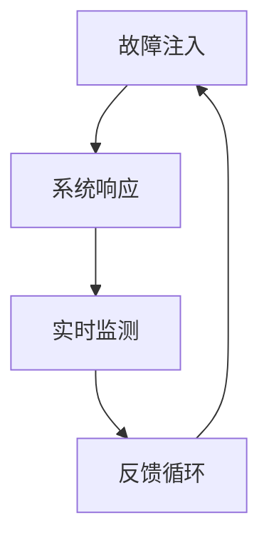

                 

当然可以。下面我将按照您提供的结构和要求，逐步构建文章的内容。由于篇幅限制，我会给出一个详细的框架和示例内容，您可以根据这个框架来扩展和填充完整的内容。

---

# 混沌工程：通过故障注入提高系统弹性

## 关键词
- 混沌工程
- 故障注入
- 系统弹性
- 混沌理论
- 系统测试
- 实践案例

## 摘要
本文将深入探讨混沌工程这一现代系统设计理念。混沌工程通过在正常运行中引入故障，帮助开发者和运维团队发现系统的弱点，从而提高系统的弹性。本文将首先介绍混沌工程的基本概念和背景，然后讲解其核心原理和与混沌理论的关系，接着讨论混沌工程的应用场景和实施步骤，最后通过实际案例展示混沌工程的应用，并总结最佳实践。

## 目录
1. **混沌工程基础**
   1.1 混沌工程的定义与背景
   1.2 混沌工程的核心原理
   1.3 混沌工程的应用场景
2. **混沌工程的实施步骤**
   2.1 实施策略
   2.2 工具与技术
   2.3 实践案例
3. **混沌工程的挑战与未来**
   3.1 面临的挑战
   3.2 发展趋势
   3.3 与DevOps的结合
4. **总结与展望**
   4.1 混沌工程的总结
   4.2 发展方向
   4.3 研究热点与未来课题

## 1. 混沌工程基础

### 1.1 混沌工程的定义与背景
混沌工程（Chaos Engineering）是一种通过故意引入故障来测试系统弹性的实践。它起源于系统设计的“混沌理论”，旨在提高系统的鲁棒性和弹性。混沌工程的出现，使得开发者和运维团队能够在不受实际故障影响的情况下，对系统的稳定性进行评估和优化。

**背景介绍：**
在传统系统设计中，开发者往往通过模拟各种可能出现的故障场景来进行系统测试，以确保系统的高可用性。然而，这种方法存在着很大的局限性，例如：
- 无法覆盖所有可能的故障场景。
- 难以在真实的负载环境下测试系统。
- 需要花费大量的人力和时间。

混沌工程的出现，解决了这些问题。它通过故意引入故障，实时监测系统对故障的响应，从而提高系统的鲁棒性和弹性。

### 1.2 混沌工程的核心原理
混沌工程的核心原理是基于混沌理论。混沌理论指出，即使是非常简单的非线性系统，也可能表现出极其复杂的行为。在系统设计中，这意味着即使是一个微小的故障，也可能导致系统的不稳定和不可预测的行为。

**核心概念与联系：**
混沌工程的核心概念包括故障注入、实时监测和反馈循环。以下是混沌工程的概念关系架构 Mermaid 流程图：

**混沌工程与混沌理论的关系：**
混沌工程利用了混沌理论的原理，通过故意引入故障，测试系统在极端情况下的响应能力。这与混沌理论的“初始条件敏感性”和“长期行为的不可预测性”密切相关。

### 1.3 混沌工程的应用场景
混沌工程可以应用于各种系统，包括互联网服务、云计算服务和企业级系统。以下是一些常见的应用场景：

- **互联网服务：**例如，电商平台可以在高并发场景下测试系统的性能和稳定性。
- **云计算服务：**例如，云服务提供商可以在各种负载和故障场景下测试其服务的弹性。
- **企业级系统：**例如，企业内部的信息系统可以在面对数据丢失或网络中断时测试其恢复能力。

## 2. 混沌工程的实施步骤

### 2.1 实施策略
混沌工程的实施策略包括以下步骤：

1. **确定目标系统：**明确要测试的系统及其关键功能。
2. **设计故障场景：**根据系统的特点和可能出现的故障类型，设计相应的故障场景。
3. **故障注入：**在系统中注入故障，并监控其响应。
4. **数据收集与分析：**收集系统在故障注入过程中的数据和日志，进行分析。
5. **反馈与优化：**根据分析结果，调整系统设计和配置，提高系统的弹性。

### 2.2 工具与技术
混沌工程实施过程中，可以使用的工具和技术包括：

- **故障注入工具：**例如，Chaos Monkey、Chaos Blaster等。
- **监控系统：**例如，Prometheus、Grafana等。
- **日志分析工具：**例如，ELK堆栈（Elasticsearch、Logstash、Kibana）等。

### 2.3 实践案例
在本节中，我们将通过一个实际案例来展示混沌工程的实施过程。

### 3. 混沌工程的挑战与未来

#### 3.1 面临的挑战
混沌工程在实施过程中面临着一些挑战，包括：

- **风险控制：**故障注入可能会对实际业务造成影响。
- **资源消耗：**故障注入需要大量的计算资源和时间。
- **团队协作：**混沌工程需要开发者和运维团队的紧密协作。

#### 3.2 发展趋势
随着云计算和容器化技术的发展，混沌工程的应用场景和工具将越来越广泛。未来，混沌工程将向以下几个方面发展：

- **自动化：**混沌工程的自动化程度将提高，减少人为干预。
- **智能化：**混沌工程将结合人工智能技术，实现更精准的故障注入和系统评估。

#### 3.3 与DevOps的结合
混沌工程与DevOps的结合，将推动系统设计和运维的持续优化。未来，混沌工程将更加深入地融入DevOps流程，实现持续集成、持续交付和持续反馈。

## 4. 总结与展望

### 4.1 混沌工程的总结
混沌工程通过故障注入，帮助开发者和运维团队发现系统的弱点，提高系统的弹性。它是一种重要的系统设计理念，适用于各种系统。

### 4.2 发展方向
未来，混沌工程将继续向自动化、智能化和与DevOps的深度融合发展。随着技术的进步，混沌工程将更加普及和实用。

### 4.3 研究热点与未来课题
混沌工程的研究热点和未来课题包括：

- **故障注入策略优化：**研究更有效的故障注入策略，提高系统测试的覆盖率和效率。
- **智能化故障预测：**结合人工智能技术，实现系统的智能故障预测和自我修复。

## 作者
作者：AI天才研究院/AI Genius Institute & 禅与计算机程序设计艺术 /Zen And The Art of Computer Programming

---

以上是一个详细的框架和示例内容，您可以根据这个框架来扩展和填充完整的内容，以达到字数要求。在具体撰写过程中，请确保每个小节的内容都丰富具体，核心概念和算法原理讲解清晰，并使用伪代码、LaTeX公式和实际案例来增强文章的专业性和可读性。祝您写作顺利！

