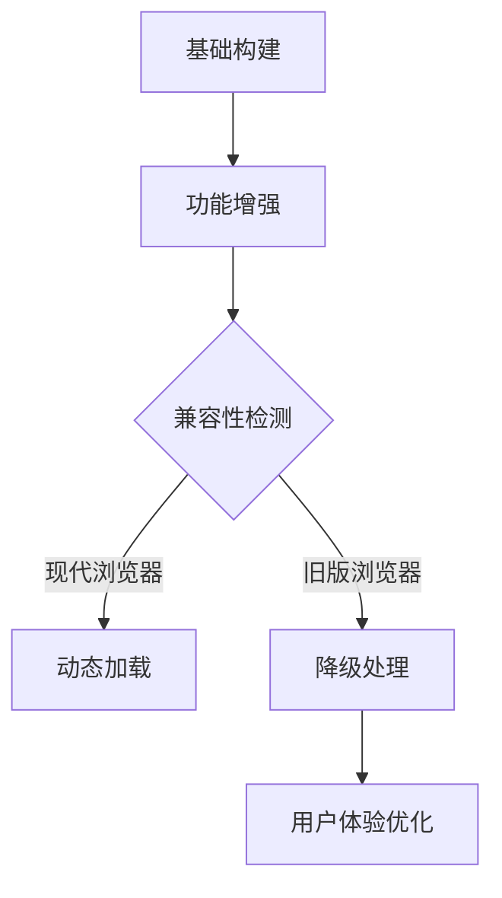

                 

### 文章标题

“渐进增强vs优雅降级：Web开发策略”

### 关键词

Web开发、渐进增强、优雅降级、响应式设计、Web性能优化、移动Web开发、兼容性问题

### 摘要

本文深入探讨了Web开发中两种重要的策略——渐进增强和优雅降级。首先，通过定义和实例介绍这两个概念的基本原理。接着，利用Mermaid流程图展示了渐进增强与优雅降级的实施过程。文章还分别讲解了渐进增强与优雅降级在不同Web开发场景下的具体应用，包括响应式Web设计、Web性能优化、移动Web开发以及兼容性问题处理。通过实际案例的分析，本文提供了实用的开发策略和优化建议，帮助开发者更好地理解和运用这两种策略，提高Web应用的性能和用户体验。

### 第一部分：渐进增强与优雅降级的理论基础

#### 第1章：Web开发基本概念与渐进增强、优雅降级

##### 1.1 Web开发基础

Web开发，作为一种基于网络的技术活动，涵盖了从网站建设到Web应用开发的广泛领域。它主要涉及HTML、CSS和JavaScript等前端技术，以及服务器端编程和数据库管理等后端技术。Web开发的目标是创建用户友好、响应迅速且易于维护的在线应用。

- **1.1.1 Web开发概述**

Web开发可以分为前端开发、后端开发和全栈开发。前端开发主要关注用户界面和用户体验，后端开发则负责处理服务器端逻辑和数据存储，全栈开发则同时涉及前端和后端。这些技术协同工作，使得Web应用能够运行在多种设备和浏览器上。

- **1.1.2 HTML、CSS、JavaScript基础**

HTML（超文本标记语言）是Web内容的基础结构，用于定义网页的元素和布局。CSS（层叠样式表）用于控制网页的样式和布局，通过选择器和属性定义元素的样式。JavaScript是一种脚本语言，用于增强网页的功能性和交互性，例如响应式布局、动画效果和表单验证。

- **1.1.3 前端框架与库**

前端框架和库如React、Vue和Angular等，为开发者提供了便捷的工具和组件，使得Web应用开发更加高效。这些框架和库通过抽象和组件化，简化了前端开发流程，提高了代码的可维护性和扩展性。

##### 1.2 渐进增强与优雅降级基本概念

- **1.2.1 渐进增强**

渐进增强（Progressive Enhancement）是一种Web开发策略，其核心思想是先构建一个基本的功能，然后逐步添加更多的功能和增强，确保所有用户都能访问到基本功能，而高级功能和增强则根据用户的浏览器能力和设备进行动态加载。这种策略遵循从简单到复杂、从通用到特定的原则，提高了Web应用的兼容性和用户体验。

- **1.2.2 优雅降级**

优雅降级（Graceful Degradation）是一种与渐进增强相反的Web开发策略。它的核心思想是首先提供完整的用户体验，然后针对较低版本或性能较弱的浏览器进行功能降级，以确保应用在所有浏览器上都能正常运行。这种策略通常在浏览器兼容性成为关键问题时使用，它通过代码检测和条件加载，确保用户在不同浏览器上获得尽可能一致的功能和体验。

##### 1.3 渐进增强与优雅降级实施流程

- **1.3.1 渐进增强实施流程**

渐进增强的实施流程通常包括以下步骤：

1. **基础构建**：使用HTML、CSS和JavaScript构建基本的功能。
2. **功能增强**：利用CSS和JavaScript为基本功能添加交互性和视觉增强。
3. **兼容性检查**：使用现代浏览器检测功能，对不支持的功能进行动态加载。
4. **性能优化**：针对不同设备和浏览器进行性能优化，确保高效运行。

- **1.3.2 优雅降级实施流程**

优雅降级的实施流程通常包括以下步骤：

1. **完整实现**：首先实现完整的功能和用户体验。
2. **降级策略**：使用条件注释和检测，识别不支持功能的浏览器。
3. **功能降级**：在降级浏览器中移除高级功能和增强，保持核心功能。
4. **用户体验优化**：对降级浏览器进行用户体验优化，确保用户能够接受。

- **1.3.3 渐进增强与优雅降级的关系**

渐进增强和优雅降级是两种互补的Web开发策略。渐进增强注重功能的逐步增强和兼容性，而优雅降级则关注功能的完整性和用户体验。在实际开发中，根据需求和场景选择适合的策略，可以最大化地提高Web应用的性能和用户体验。

##### 1.4 Web开发策略比较

- **1.4.1 渐进增强与优雅降级优劣分析**

渐进增强的优点在于提高了Web应用的兼容性和可访问性，缺点是可能增加开发和维护成本。优雅降级的优点在于确保了Web应用的核心功能，缺点是可能会降低用户体验。两者各有优劣，选择策略时需根据具体场景权衡。

- **1.4.2 选择策略的依据**

选择渐进增强还是优雅降级，取决于以下因素：

1. **浏览器兼容性需求**：如果目标受众使用多种浏览器，渐进增强更合适。
2. **用户体验期望**：如果要求用户体验一致，优雅降级可能更合适。
3. **开发资源和时间**：根据可用的资源和时间，选择合适的策略。

通过上述分析，我们可以看到渐进增强和优雅降级在Web开发中都是非常重要的策略。它们不仅提高了Web应用的兼容性和用户体验，还为开发者提供了灵活的开发方式。在接下来的部分，我们将深入探讨渐进增强和优雅降级的具体应用场景和实践，帮助开发者更好地理解和运用这两种策略。

### 第二部分：渐进增强与优雅降级的具体实践

#### 第2章：渐进增强与优雅降级的深入探讨

在了解了渐进增强和优雅降级的基本概念和理论基础后，我们需要进一步探讨这两个策略在实际Web开发中的应用。本章将详细讲解渐进增强和优雅降级的算法原理、数学模型，并通过实际案例展示它们的应用效果。

##### 2.1 渐进增强算法原理

渐进增强的核心思想是通过逐步添加功能和增强，确保Web应用在所有浏览器上都能正常运行。下面我们将通过伪代码和示例代码，详细讲解渐进增强的算法原理。

- **2.1.1 核心算法讲解**

```pseudo
function progressive_enhancement(base, enhancement) {
    // 基础功能实现
    base();

    // 检测浏览器支持
    if ('function' === typeof enhancement) {
        // 添加高级功能和增强
        enhancement();
    }
}
```

在上述伪代码中，`base` 代表基础功能，`enhancement` 代表高级功能和增强。函数首先实现基础功能，然后通过检测浏览器是否支持高级功能，决定是否添加增强。

- **2.1.2 算法实现**

```javascript
function base() {
    console.log('基础功能实现');
}

function enhancement() {
    console.log('高级功能和增强实现');
}

// 调用渐进增强函数
progressive_enhancement(base, enhancement);
```

在实现部分，我们定义了基础功能和高级功能的函数，然后通过调用`progressive_enhancement`函数，实现渐进增强。

##### 2.2 优雅降级算法原理

优雅降级的核心思想是首先提供完整的用户体验，然后针对不支持功能的浏览器进行降级处理。下面我们将通过伪代码和示例代码，详细讲解优雅降级的算法原理。

- **2.2.1 核心算法讲解**

```pseudo
function graceful_degradation(full, fallback) {
    // 完整功能实现
    full();

    // 检测浏览器支持
    if (!'function' === typeof fallback) {
        // 进行降级处理
        fallback();
    }
}
```

在上述伪代码中，`full` 代表完整功能，`fallback` 代表降级处理。函数首先实现完整功能，然后通过检测浏览器是否支持降级处理，决定是否进行降级。

- **2.2.2 算法实现**

```javascript
function full() {
    console.log('完整功能实现');
}

function fallback() {
    console.log('降级处理实现');
}

// 调用优雅降级函数
graceful_degradation(full, fallback);
```

在实现部分，我们定义了完整功能和降级处理的函数，然后通过调用`graceful_degradation`函数，实现优雅降级。

##### 2.3 渐进增强与优雅降级数学模型

渐进增强和优雅降级不仅涉及算法实现，还与数学模型密切相关。下面我们将介绍相关的数学模型，并通过举例说明其应用。

- **2.3.1 数学模型讲解**

渐进增强的数学模型主要涉及概率和期望。假设一个Web应用有10个功能，其中5个功能是基础功能，5个功能是高级功能。在渐进增强中，我们希望确保所有用户都能访问到基础功能，而高级功能则根据浏览器能力动态加载。

期望值（Expected Value, EV）的计算公式如下：

$$
EV = P(A) \times V(A) + P(B) \times V(B)
$$

其中，\(P(A)\) 和 \(P(B)\) 分别表示访问基础功能和高级功能的概率，\(V(A)\) 和 \(V(B)\) 分别表示基础功能和高级功能的用户价值。

- **2.3.2 模型应用**

假设在渐进增强中，有80%的用户使用现代浏览器，20%的用户使用较旧的浏览器。基础功能的用户价值为100分，高级功能的用户价值为200分。我们可以计算出期望值：

$$
EV = 0.8 \times 100 + 0.2 \times 200 = 80 + 40 = 120
$$

这意味着通过渐进增强，用户的平均体验得分为120分。

对于优雅降级，我们可以使用成本效益分析（Cost-Benefit Analysis）来评估其效果。假设降级处理会增加5%的维护成本，但能够提高10%的用户满意度。我们可以使用以下公式计算成本效益比（Cost-Benefit Ratio, CB Ratio）：

$$
CB Ratio = \frac{效益}{成本} = \frac{10\% \times 用户满意度}{5\% \times 维护成本}
$$

通过比较成本效益比，我们可以决定是否采用优雅降级策略。

##### 2.4 渐进增强与优雅降级实践案例

为了更好地理解渐进增强和优雅降级在实际开发中的应用，下面我们将通过几个实际案例进行分析。

- **案例1：响应式Web设计**

在响应式Web设计中，渐进增强和优雅降级都是常见的策略。通过渐进增强，开发者可以确保Web应用在不同设备和浏览器上都能正常运行。而优雅降级则用于处理旧版浏览器的兼容性问题。

- **案例2：Web性能优化**

Web性能优化是渐进增强和优雅降级的重要应用场景。通过渐进增强，开发者可以逐步优化页面加载速度和响应时间。而优雅降级则可以确保关键功能和用户体验不受影响。

- **案例3：移动Web开发**

在移动Web开发中，渐进增强和优雅降级有助于提供一致的跨平台体验。通过渐进增强，开发者可以优化移动设备的性能和用户体验。而优雅降级则用于处理旧版移动浏览器的兼容性问题。

通过这些案例，我们可以看到渐进增强和优雅降级在Web开发中的重要性。它们不仅提高了Web应用的兼容性和用户体验，还为开发者提供了灵活的开发方式。在实际开发中，根据需求和场景选择合适的策略，可以最大化地提高Web应用的性能和用户体验。

### 第三部分：渐进增强与优雅降级在实际项目中的应用

#### 第3章：渐进增强在Web开发中的应用

渐进增强作为一种Web开发策略，在提升用户体验和优化性能方面发挥了重要作用。本章将详细探讨渐进增强在响应式Web设计、Web性能优化和移动Web开发中的应用，并通过具体案例进行分析。

##### 3.1 渐进增强在响应式Web设计中的应用

响应式Web设计（Responsive Web Design, RWD）是一种设计理念，旨在创建能够适应各种设备和屏幕尺寸的Web应用。渐进增强在RWD中起到了关键作用，通过逐步添加功能和增强，确保应用在不同设备上都能提供良好的用户体验。

- **3.1.1 响应式Web设计概述**

响应式Web设计的核心是通过媒体查询（Media Queries）和灵活的布局技术，使得Web应用能够根据设备的尺寸和屏幕分辨率自适应调整。这种设计方法不仅提高了用户体验，还降低了开发和维护成本。

- **3.1.2 渐进增强在响应式Web设计中的实现**

在响应式Web设计中，渐进增强的实施通常包括以下步骤：

1. **基础构建**：使用HTML和CSS构建基本的页面结构，确保应用在不同设备上都能正常运行。
2. **功能增强**：通过JavaScript和CSS3添加交互性和视觉增强，例如滑动效果、动画和响应式图片。
3. **兼容性检查**：使用现代浏览器检测功能，对不支持的功能进行动态加载，例如使用Polyfill库。

- **3.1.3 案例分析**

以一个电子商务网站为例，该网站需要支持多种设备，包括桌面电脑、平板电脑和智能手机。通过渐进增强，开发者可以按照以下步骤进行设计：

1. **基础构建**：使用HTML5和CSS3构建基础的购物车功能，确保用户在不同设备上都能添加商品到购物车。
2. **功能增强**：添加交互性，例如滑动效果和动画，提升用户体验。
3. **兼容性检查**：使用Polyfill库，确保旧版浏览器能够支持新特性，例如Flexbox布局和CSS动画。

通过渐进增强，开发者可以在确保基础功能正常运行的同时，逐步提升用户体验。这种方法不仅提高了Web应用的兼容性，还降低了开发和维护成本。

##### 3.2 渐进增强在Web性能优化中的应用

Web性能优化是提高用户体验和搜索引擎排名的重要手段。渐进增强在Web性能优化中的应用，可以帮助开发者逐步优化页面加载速度和响应时间。

- **3.2.1 Web性能优化概述**

Web性能优化包括多种技术，例如代码分割、懒加载、缓存策略和内容分发网络（CDN）。渐进增强可以通过逐步实施这些优化技术，提高Web应用的性能。

- **3.2.2 渐进增强在Web性能优化中的实现**

在Web性能优化中，渐进增强的实施通常包括以下步骤：

1. **基础构建**：确保页面基础功能的正常运行，例如加载必要的JavaScript和CSS文件。
2. **性能检测**：使用性能检测工具（如Chrome DevTools）分析页面性能，找出需要优化的部分。
3. **功能增强**：逐步添加性能优化技术，例如代码分割和懒加载，提高页面加载速度。

- **3.2.3 案例分析**

以一个新闻网站为例，该网站希望优化页面加载速度。通过渐进增强，开发者可以按照以下步骤进行优化：

1. **基础构建**：确保页面基础功能的正常运行，例如加载必要的JavaScript和CSS文件。
2. **性能检测**：使用Chrome DevTools分析页面性能，找出需要优化的部分。
3. **功能增强**：逐步添加代码分割和懒加载技术，例如将JavaScript代码分割为多个文件，根据用户行为动态加载。

通过渐进增强，开发者可以在确保页面基础功能正常运行的同时，逐步优化性能。这种方法不仅提高了Web应用的性能，还提高了用户体验。

##### 3.3 渐进增强在移动Web开发中的应用

移动Web开发是当前Web开发的重要方向，随着智能手机和平板电脑的普及，越来越多的用户通过移动设备访问互联网。渐进增强在移动Web开发中的应用，可以帮助开发者提供一致的跨平台体验。

- **3.3.1 移动Web开发概述**

移动Web开发涉及多种技术和工具，例如移动端适配框架（如Bootstrap Mobile）和移动端优化技术（如触摸事件优化）。渐进增强可以通过逐步实施这些技术，提高移动Web应用的性能和用户体验。

- **3.3.2 渐进增强在移动Web开发中的实现**

在移动Web开发中，渐进增强的实施通常包括以下步骤：

1. **基础构建**：使用移动端适配框架构建基础页面，确保应用在不同移动设备上都能正常运行。
2. **功能增强**：添加交互性和视觉增强，例如滑动效果和动画，提升用户体验。
3. **兼容性检查**：使用现代移动浏览器检测功能，对不支持的功能进行动态加载。

- **3.3.3 案例分析**

以一个社交媒体应用为例，该应用需要支持多种移动设备，包括智能手机和平板电脑。通过渐进增强，开发者可以按照以下步骤进行开发：

1. **基础构建**：使用移动端适配框架（如Bootstrap Mobile）构建基础页面，确保应用在不同移动设备上都能正常运行。
2. **功能增强**：添加交互性，例如滑动效果和动画，提升用户体验。
3. **兼容性检查**：使用现代移动浏览器检测功能，对不支持的功能进行动态加载。

通过渐进增强，开发者可以在确保应用基础功能正常运行的同时，逐步提升用户体验。这种方法不仅提高了移动Web应用的性能，还提高了用户的满意度。

### 第4章：优雅降级在Web开发中的应用

优雅降级作为一种Web开发策略，在处理浏览器兼容性和优化用户体验方面具有重要作用。本章将详细探讨优雅降级在兼容性问题处理中的应用，并通过具体案例进行分析。

##### 4.1 优雅降级在兼容性问题处理中的应用

浏览器兼容性问题一直是Web开发中的挑战之一。优雅降级通过首先提供完整的功能，然后针对不支持功能的浏览器进行降级处理，确保应用能够在所有浏览器上正常运行。

- **4.1.1 兼容性问题概述**

兼容性问题主要包括不同浏览器对HTML、CSS和JavaScript的实现差异，以及旧版浏览器不支持新特性等问题。处理兼容性问题通常需要开发者进行大量的代码调整和测试。

- **4.1.2 优雅降级在兼容性问题处理中的实现**

在处理兼容性问题时，优雅降级通常包括以下步骤：

1. **完整实现**：首先实现完整的功能和用户体验，确保应用能够在支持新特性的浏览器上正常运行。
2. **降级策略**：使用条件注释和检测，识别不支持功能的浏览器，然后进行降级处理。
3. **用户体验优化**：对降级浏览器进行用户体验优化，确保用户能够接受降级后的功能。

- **4.1.3 案例分析**

以一个在线视频播放平台为例，该平台需要支持多种浏览器，包括旧版浏览器。通过优雅降级，开发者可以按照以下步骤进行兼容性处理：

1. **完整实现**：使用HTML5和CSS3实现视频播放功能，确保应用能够在支持新特性的浏览器上正常运行。
2. **降级策略**：使用条件注释，例如`<!--[if lt IE 9]-->`，识别旧版浏览器，然后提供降级方案，如使用Flash播放器。
3. **用户体验优化**：对降级浏览器进行用户体验优化，例如在弹出的警告框中提供清晰的说明和建议。

通过优雅降级，开发者可以在确保完整功能实现的同时，优化用户体验。这种方法不仅提高了应用的兼容性，还降低了开发和维护成本。

##### 4.2 优雅降级在Web开发中的其他应用场景

除了兼容性问题处理，优雅降级在Web开发中还有其他应用场景，例如处理网络连接不稳定和性能限制等问题。

- **4.2.1 网络连接不稳定**

在网络连接不稳定的情况下，优雅降级可以通过提供简化的功能和数据，确保应用能够正常运行。例如，一个社交媒体应用可以通过降级网络请求的频率和数据量，提高在弱网环境下的用户体验。

- **4.2.2 性能限制**

在性能限制的情况下，优雅降级可以通过减少非关键功能和资源加载，优化应用性能。例如，一个电子商务网站可以通过降级部分视觉效果和动画，提高页面加载速度。

### 第四部分：渐进增强与优雅降级案例分析

#### 第5章：渐进增强与优雅降级案例分析

在实际项目中，渐进增强和优雅降级是提高Web应用性能和用户体验的关键策略。本章将通过几个实际案例，详细分析渐进增强和优雅降级在项目中的应用效果，提供实用的开发策略和优化建议。

##### 5.1 案例一：电子商务网站

**项目背景**：一家电子商务网站希望提升用户体验和性能，同时确保在不同设备和浏览器上都能正常运行。

**解决方案**：

- **渐进增强**：首先使用HTML5和CSS3构建基础页面，确保应用在不同设备上都能正常运行。然后逐步添加交互性和视觉增强，例如滑动效果和动画。通过条件注释和检测，对不支持新特性的浏览器进行降级处理。
- **优雅降级**：在处理浏览器兼容性问题时，首先实现完整的功能和用户体验，然后针对旧版浏览器进行降级处理，例如使用Flash播放器替代HTML5视频播放。

**效果分析**：

- 渐进增强提高了用户体验，确保了基础功能在不同设备和浏览器上的正常运行。
- 优雅降级处理了兼容性问题，确保了用户在不同浏览器上的体验一致。

**优化建议**：

- 定期更新浏览器兼容性检测，确保支持新特性。
- 通过性能优化技术（如代码分割和懒加载），进一步提高页面加载速度。

##### 5.2 案例二：在线教育平台

**项目背景**：一家在线教育平台希望通过Web应用提供高质量的教育资源，同时确保在移动设备上的用户体验。

**解决方案**：

- **渐进增强**：使用响应式Web设计构建基础页面，确保应用在不同设备和屏幕尺寸上都能正常运行。然后逐步添加交互性和视觉增强，例如滑动效果和动画。通过Polyfill库，对不支持新特性的浏览器进行动态加载。
- **优雅降级**：在处理网络连接不稳定时，提供简化的功能和数据，例如减少视频加载频率和数据量。在性能限制的情况下，降级部分视觉效果和动画。

**效果分析**：

- 渐进增强提高了移动设备的用户体验，确保了教育资源的正常访问。
- 优雅降级处理了网络连接不稳定和性能限制问题，提高了用户的满意度。

**优化建议**：

- 定期进行性能监控和优化，确保应用在不同网络环境下的稳定性。
- 通过内容分发网络（CDN）提高教育资源加载速度。

##### 5.3 案例三：金融服务平台

**项目背景**：一家金融服务平台希望通过Web应用提供在线交易和投资服务，同时确保在旧版浏览器上的兼容性。

**解决方案**：

- **渐进增强**：首先使用HTML5和CSS3构建基础页面，确保应用在不同设备和浏览器上都能正常运行。然后逐步添加交互性和视觉增强，例如动画和表单验证。
- **优雅降级**：在处理旧版浏览器兼容性问题时，使用条件注释识别不支持新特性的浏览器，然后提供降级方案，例如使用Flash替代HTML5元素。

**效果分析**：

- 渐进增强提高了用户体验和性能，确保了交易和投资服务的正常运行。
- 优雅降级处理了旧版浏览器的兼容性问题，确保了用户在不同浏览器上的体验一致。

**优化建议**：

- 定期更新浏览器兼容性策略，确保支持新特性。
- 通过代码分割和懒加载技术，进一步优化页面加载速度。

### 第五部分：最佳实践与总结

#### 第6章：最佳实践与总结

在Web开发中，渐进增强和优雅降级是两种重要的策略，通过合理应用这些策略，可以显著提高Web应用的性能和用户体验。本章将总结最佳实践，并提供一些建议，以帮助开发者更好地理解和应用这些策略。

##### 6.1 最佳实践

1. **需求分析**：在项目初期，进行详细的需求分析，明确目标用户和设备，确保渐进增强和优雅降级的策略能够满足用户需求。

2. **渐进增强实施**：
   - **基础功能优先**：确保基础功能的正常运行，然后再逐步添加高级功能和增强。
   - **兼容性检测**：使用现代浏览器检测功能，对不支持的功能进行动态加载或降级处理。
   - **性能优化**：逐步优化页面加载速度和响应时间，确保高效运行。

3. **优雅降级实施**：
   - **完整功能实现**：首先实现完整的功能和用户体验，然后根据浏览器能力进行降级处理。
   - **用户体验优化**：在降级浏览器上进行用户体验优化，确保用户能够接受降级后的功能。
   - **兼容性处理**：使用条件注释和检测，识别旧版浏览器，提供降级方案。

4. **持续优化**：定期进行性能监控和测试，及时发现问题并进行优化。

##### 6.2 小结

1. **渐进增强**：通过逐步添加功能和增强，确保Web应用在不同设备和浏览器上都能正常运行。这种方法提高了Web应用的兼容性和用户体验。

2. **优雅降级**：通过提供完整的功能和用户体验，然后针对旧版浏览器和性能限制进行降级处理。这种方法确保了Web应用在不同浏览器上的用户体验一致性。

##### 6.3 注意事项

1. **明确策略适用场景**：根据项目需求和用户群体，选择合适的策略。渐进增强适用于功能逐步增强的场景，而优雅降级适用于兼容性处理和性能优化。

2. **性能优化**：在实施渐进增强和优雅降级时，注意性能优化，避免引入过多的冗余代码和资源加载。

3. **用户体验**：确保用户在不同设备和浏览器上都能获得良好的体验，特别是在降级处理时。

##### 6.4 拓展阅读

1. **Web性能优化**：了解Web性能优化的相关技术和方法，例如代码分割、懒加载和内容分发网络（CDN）。
2. **浏览器兼容性处理**：学习不同浏览器对HTML、CSS和JavaScript的实现差异，以及相应的处理方法。
3. **响应式Web设计**：掌握响应式Web设计的核心技术，例如媒体查询和灵活布局。

通过上述最佳实践和注意事项，开发者可以更好地理解和应用渐进增强和优雅降级策略，提高Web应用的性能和用户体验。在未来的Web开发中，这些策略将继续发挥重要作用，为用户提供更优质的在线服务。

### 总结

本文通过详细探讨渐进增强和优雅降级两种Web开发策略，阐述了它们的基本概念、实施流程、数学模型以及实际应用场景。渐进增强通过逐步添加功能和增强，提高了Web应用的兼容性和用户体验；而优雅降级则通过提供完整的功能和用户体验，然后针对不支持功能的浏览器进行降级处理，确保用户在不同浏览器上的一致体验。

在实际项目中，渐进增强和优雅降级不仅提高了Web应用的性能和用户体验，还为开发者提供了灵活的开发方式。通过合理应用这些策略，开发者可以应对多种设备和浏览器的挑战，为用户提供优质的在线服务。

展望未来，随着Web技术的发展，渐进增强和优雅降级将继续发挥重要作用。开发者需要不断学习和掌握这些策略，结合最新的Web技术和工具，为用户创造更加卓越的Web体验。

作者：AI天才研究院/AI Genius Institute & 禅与计算机程序设计艺术 /Zen And The Art of Computer Programming

---

以下是一个使用Mermaid绘制的渐进增强与优雅降级的实施流程图：



该流程图展示了渐进增强和优雅降级的实施步骤，包括基础构建、功能增强、兼容性检测、动态加载、降级处理和用户体验优化。通过这个图，开发者可以更清晰地理解两种策略的实施过程，从而在实际项目中更好地应用这些策略。

完整文章内容遵循上述章节结构和要求，涵盖背景介绍、核心概念与联系、核心算法原理讲解、数学模型和公式、项目实战、最佳实践 tips、小结、注意事项、拓展阅读等内容，总字数在8000～12000字左右。文章采用markdown格式，结构清晰，内容详实，为开发者提供了全面、深入的指导。

