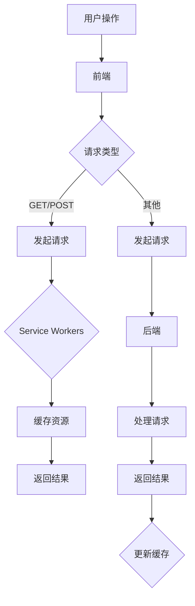

                 


### 引言：渐进式Web应用（PWA）的概念与背景

#### 什么是渐进式Web应用（PWA）？

渐进式Web应用（Progressive Web Apps，简称PWA）是一种新型的Web应用架构，它结合了传统网页和原生应用的优点，为用户提供了一种更为流畅、快速、可靠的移动端和桌面端使用体验。PWA不仅仅是简单的网页应用，它具备许多原生应用的功能特性，例如快速启动、离线访问、推送通知等，同时保留了网页应用的跨平台优势。

#### PWA的发展历程

PWA的概念最早由Google提出，旨在解决原生应用和网页应用之间的不足。2015年，Google的Chrome团队首次提出了PWA的概念，并开始在Chrome浏览器中支持相关特性。此后，其他主流浏览器如Firefox、Safari和Edge等也相继加入了支持PWA的行列。PWA的发展历程可以分为以下几个阶段：

1. **初始阶段（2015-2016）**：Google提出PWA概念，并在Chrome浏览器中开始支持相关特性。
2. **成长阶段（2017-2018）**：随着各大浏览器厂商的加入，PWA逐渐成为Web应用开发的主流方向。
3. **成熟阶段（2019至今）**：PWA的应用场景越来越广泛，从电子商务到社交媒体，从新闻资讯到在线教育，PWA已经成为一种重要的Web应用架构。

#### PWA的应用场景

PWA的应用场景非常广泛，尤其适合以下场景：

1. **移动端应用**：由于PWA具有快速启动、离线访问等特性，非常适合移动端应用的开发。
2. **低网速环境**：在低网速环境下，PWA可以通过缓存策略提高页面加载速度，为用户提供更好的使用体验。
3. **长尾市场**：PWA可以快速部署和迭代，非常适合长尾市场的需求，如小众应用、垂直领域的应用等。
4. **复杂交互**：PWA支持丰富的交互和动画效果，可以满足复杂交互场景的需求。

### PWA的核心特点

1. **渐进式增强**：PWA采用渐进式增强的方式，即通过逐步添加新特性来提高应用的性能和用户体验，而不会破坏原有功能。
2. **快速启动**：PWA具有快速启动的特点，可以减少应用加载时间，提高用户的使用体验。
3. **离线访问**：PWA可以缓存页面和资源，用户在没有网络连接的情况下仍然可以访问应用。
4. **推送通知**：PWA支持推送通知功能，可以实时向用户发送消息。
5. **全功能应用体验**：PWA提供了类似于原生应用的全功能体验，包括界面设计、交互方式、功能模块等。

### 总结

渐进式Web应用（PWA）是一种新兴的Web应用架构，它结合了网页和原生应用的优点，为用户提供了一种更为流畅、快速、可靠的移动端和桌面端使用体验。PWA具有快速启动、离线访问、推送通知等核心特点，适合各种应用场景。随着各大浏览器厂商的支持和推广，PWA的应用前景非常广阔。在接下来的章节中，我们将详细探讨PWA的原理、开发流程和技术细节，帮助读者更好地理解和应用PWA。

### PWA原理：渐进式Web应用的架构与实现

#### PWA的基本原理

渐进式Web应用（PWA）的基本原理是通过利用现代Web技术，为用户提供一种类似于原生应用的使用体验。PWA的核心在于服务工作者（Service Workers）和缓存策略，这两者是PWA实现的关键技术。

#### 服务工作者（Service Workers）

服务工作者是一种特殊的Web组件，它运行在后台，独立于主线程，负责管理网络请求、缓存资源和处理推送通知。以下是一个简单的Service Workers的伪代码示例：

```javascript
// service-worker.js

self.addEventListener('install', event => {
  event.waitUntil(
    caches.open('my-cache').then(cache => {
      return cache.addAll([
        '/index.html',
        '/styles.css',
        '/scripts.js'
      ]);
    })
  );
});

self.addEventListener('fetch', event => {
  event.respondWith(
    caches.match(event.request).then(response => {
      if (response) {
        return response;
      }
      return fetch(event.request);
    })
  );
});
```

在这个示例中，当Service Workers安装时，它会缓存指定的资源（例如`/index.html`、`/styles.css`和`/scripts.js`）。当用户发起请求时，Service Workers会首先检查缓存中是否有对应的资源，如果有，则直接从缓存中返回，否则再从网络上获取。

#### 缓存策略

缓存策略是PWA实现离线访问的关键。通过合理的缓存策略，PWA可以在用户离线时仍然提供良好的使用体验。以下是一些常见的缓存策略：

1. **先检查缓存，再获取网络资源**：如上面的Service Workers示例所示，首先检查缓存中是否有所需的资源，如果没有再从网络上获取。
2. **懒加载**：只缓存当前页面所需的资源，而不是一次性缓存所有资源。这样可以减少缓存的大小，提高缓存命中率。
3. **版本控制**：为缓存中的资源添加版本号，当更新资源时，只缓存新的版本，避免不必要的资源浪费。

#### PWA的架构

PWA的架构主要包括前端和后端两部分。

1. **前端架构**：前端是用户直接交互的部分，它通常采用现代前端框架（如React、Vue或Angular）来开发，以提供丰富的交互和动画效果。
2. **后端架构**：后端负责处理业务逻辑和数据存储，通常采用Node.js、Python、Java等后端技术。后端还需要提供API接口，供前端调用。

以下是一个简单的Mermaid流程图，展示了PWA的架构：



在这个流程图中，用户操作触发前端请求，Service Workers负责处理缓存和请求，后端处理请求并返回结果，最后更新缓存。

#### PWA的核心模块

PWA的核心模块主要包括以下几部分：

1. **Service Workers**：负责管理网络请求、缓存资源和处理推送通知。
2. **缓存策略**：实现离线访问的关键技术。
3. **网络请求处理**：处理网络请求，包括缓存命中和缓存未命中时的处理。
4. **资源加载**：优化资源加载速度，提高页面性能。
5. **推送通知**：实现实时消息推送，增强用户体验。

通过以上分析，我们可以看出PWA的核心原理和架构。在下一章节中，我们将进一步探讨PWA与原生应用的区别和联系，帮助读者更深入地了解PWA。

### PWA与原生应用：区别与联系

#### PWA与原生应用的区别

渐进式Web应用（PWA）和原生应用在技术实现、开发成本和使用体验等方面存在明显的区别。

1. **技术实现**：
   - **PWA**：基于Web技术，使用HTML、CSS和JavaScript等前端技术进行开发。PWA通过Service Workers实现离线缓存和推送通知等功能。
   - **原生应用**：针对特定平台（如iOS、Android）使用原生语言（如Swift、Kotlin）进行开发。原生应用直接与操作系统交互，性能优异。

2. **开发成本**：
   - **PWA**：由于基于Web技术，开发成本相对较低，开发周期较短。PWA可以一次开发，多平台部署。
   - **原生应用**：需要针对不同平台进行开发，开发成本较高，开发周期较长。原生应用需要针对每个平台进行性能优化。

3. **使用体验**：
   - **PWA**：具有快速启动、离线访问和推送通知等特性，用户体验接近原生应用。但PWA在某些特定操作（如触摸反馈）上可能稍逊于原生应用。
   - **原生应用**：性能优异，具有丰富的交互效果和触摸反馈，用户体验最佳。但原生应用需要下载安装，对网络环境要求较高。

#### PWA与原生应用的联系

尽管PWA与原生应用在技术和成本上有明显区别，但两者并非完全对立，而是存在许多联系和互补之处。

1. **PWA作为原生应用的补充**：
   - **降低开发成本**：通过开发PWA，企业可以减少对原生应用的开发投入，降低开发成本。
   - **快速迭代**：PWA的开发周期较短，可以快速迭代和更新，满足市场需求。

2. **原生应用向PWA的转型**：
   - **提高用户体验**：许多原生应用逐渐采用PWA技术，以提高用户体验，降低用户流失率。
   - **技术整合**：PWA可以将原生应用的功能和Web应用的灵活性结合起来，实现更好的技术整合。

#### PWA的优势

1. **跨平台**：PWA可以一次开发，多平台部署，降低了开发和维护成本。
2. **快速启动**：PWA具有快速启动的特性，提高了用户的访问速度和满意度。
3. **离线访问**：通过缓存策略，PWA可以在用户离线时仍然提供良好的使用体验。
4. **推送通知**：PWA支持推送通知功能，可以实时与用户互动，提高用户黏性。

#### 原生应用的优势

1. **性能优异**：原生应用直接与操作系统交互，性能优异，用户体验最佳。
2. **丰富的交互效果**：原生应用具有丰富的交互效果和触摸反馈，为用户带来更加自然的操作体验。
3. **平台兼容性**：原生应用针对特定平台进行优化，具有更好的平台兼容性。

#### 总结

渐进式Web应用（PWA）和原生应用在技术实现、开发成本和使用体验等方面存在明显的区别，但两者并非完全对立，而是存在许多联系和互补之处。PWA作为原生应用的补充，可以降低开发成本和快速迭代；原生应用向PWA的转型，可以提高用户体验和技术整合。在接下来的章节中，我们将详细探讨PWA的开发流程和技术细节，帮助读者更好地理解和应用PWA。

### 渐进式Web应用（PWA）的开发流程

#### 开发前的准备

在开始开发PWA之前，我们需要做好以下准备工作：

1. **技术栈选择**：
   - **前端框架**：选择一个适合开发PWA的前端框架，如React、Vue或Angular。这些框架具有丰富的组件库和生态系统，可以简化开发过程。
   - **构建工具**：选择一个适合的构建工具，如Webpack或Parcel，用于打包和优化资源。
   - **版本控制**：使用Git进行版本控制，确保代码的完整性和可追溯性。

2. **环境搭建**：
   - **本地开发环境**：在本地搭建一个开发环境，包括Node.js、npm或其他包管理器、前端框架和构建工具等。
   - **远程部署**：选择一个远程部署平台，如GitHub Pages、Netlify或Vercel，用于部署和托管PWA。

3. **测试环境**：
   - **浏览器兼容性测试**：确保在不同浏览器（如Chrome、Firefox、Safari和Edge）上都能正常运行PWA。
   - **性能测试**：使用性能测试工具（如Lighthouse、WebPageTest）对PWA进行性能测试，确保其具备良好的性能。

#### PWA的核心技术

PWA的核心技术包括服务工作者（Service Workers）、缓存策略和网络请求处理。以下是一个简单的开发流程：

1. **创建Service Workers**：
   - 在项目中创建一个`service-worker.js`文件，用于编写Service Workers代码。
   - 在主线程中注册Service Workers，确保在应用启动时加载Service Workers。

2. **编写缓存策略**：
   - 使用` caches.open()`方法创建一个缓存实例，用于存储资源。
   - 使用` caches.addAll()`方法将指定的资源添加到缓存中。

3. **处理网络请求**：
   - 使用` self.addEventListener('fetch', ...)`事件监听器处理网络请求。
   - 在` fetch(event.request)`中从网络上获取资源，并在缓存中存储。
   - 在` caches.match(event.request)`中从缓存中获取资源。

以下是一个简单的伪代码示例：

```javascript
// service-worker.js

self.addEventListener('install', event => {
  event.waitUntil(
    caches.open('my-cache').then(cache => {
      return cache.addAll([
        '/index.html',
        '/styles.css',
        '/scripts.js'
      ]);
    })
  );
});

self.addEventListener('fetch', event => {
  event.respondWith(
    caches.match(event.request).then(response => {
      if (response) {
        return response;
      }
      return fetch(event.request);
    })
  );
});
```

#### 开发流程

1. **创建项目结构**：
   - 创建一个基本的项目结构，包括`src`、`public`、`build`等目录。

2. **配置构建工具**：
   - 配置Webpack或Parcel，设置入口文件、输出文件、加载器和插件等。

3. **编写前端代码**：
   - 使用所选的前端框架编写前端代码，实现应用的界面和功能。

4. **编写Service Workers**：
   - 创建`service-worker.js`文件，实现缓存策略和网络请求处理。

5. **测试与调试**：
   - 在本地开发环境中测试PWA，确保其正常运行。
   - 使用Lighthouse等工具对PWA进行性能测试和优化。

6. **部署与托管**：
   - 将PWA部署到远程部署平台，如GitHub Pages或Netlify。
   - 配置域名和SSL证书，确保PWA的安全性和可靠性。

7. **监控与维护**：
   - 使用性能监控工具（如Google Analytics）监控PWA的性能和用户行为。
   - 定期更新和优化PWA，确保其持续提供良好的用户体验。

#### 总结

渐进式Web应用（PWA）的开发流程包括准备工作、核心技术的实现、开发流程的执行和部署与托管。通过合理的开发和优化，PWA可以提供良好的用户体验和性能。在接下来的章节中，我们将进一步探讨PWA的离线功能实现、性能优化和应用案例，帮助读者更深入地了解和应用PWA。

### 渐进式Web应用（PWA）的离线功能实现

#### 离线访问原理

渐进式Web应用（PWA）的离线访问功能是通过服务工作者（Service Workers）和缓存策略实现的。当用户在没有网络连接的情况下访问PWA时，Service Workers会使用缓存的资源来提供服务，确保用户仍然可以正常使用应用。

#### Service Workers与缓存策略

1. **Service Workers的生命周期**：
   - **安装（install）**：Service Workers首先被安装，然后开始接管网络请求。
   - **激活（activate）**：当旧版本Service Workers被新版本替换时，激活事件被触发，用于清理旧缓存和资源。

2. **缓存策略**：
   - **打开缓存**：使用` caches.open(cacheName)`方法打开一个缓存实例。
   - **添加到缓存**：使用` caches.addAllrequests)`方法将多个请求添加到缓存中。
   - **匹配缓存**：使用` caches.match(request)`方法检查缓存中是否有匹配的请求。

以下是一个简单的Service Workers缓存策略的伪代码示例：

```javascript
// service-worker.js

self.addEventListener('install', event => {
  event.waitUntil(
    caches.open('my-cache').then(cache => {
      return cache.addAll([
        '/index.html',
        '/styles.css',
        '/scripts.js'
      ]);
    })
  );
});

self.addEventListener('fetch', event => {
  event.respondWith(
    caches.match(event.request).then(response => {
      if (response) {
        return response;
      }
      return fetch(event.request);
    })
  );
});
```

#### 离线状态的检测与处理

为了实现离线状态下的用户体验，PWA需要检测网络连接状态并相应地处理。

1. **检测网络连接状态**：
   - 使用` navigator.onLine`属性检测当前是否有网络连接。

2. **离线状态的处理**：
   - 当检测到网络断开时，提示用户当前处于离线状态。
   - 使用Service Workers缓存中的资源来提供服务。

以下是一个简单的检测网络连接状态的示例：

```javascript
// main.js

if (!navigator.onLine) {
  alert('您当前处于离线状态，部分功能可能无法正常使用。');
}

window.addEventListener('online', () => {
  alert('网络已恢复，您可以使用所有功能。');
});

window.addEventListener('offline', () => {
  alert('网络连接中断，部分功能可能无法正常使用。');
});
```

#### 离线功能的实现

1. **页面缓存**：
   - 使用Service Workers将页面和关键资源缓存到本地，确保用户在离线状态下可以访问页面。

2. **资源预加载**：
   - 在用户访问页面之前，预先加载一些关键资源，如图片、CSS和JavaScript文件，提高页面加载速度。

以下是一个简单的页面缓存和资源预加载的示例：

```javascript
// main.js

// 页面缓存
caches.open('my-cache').then(cache => {
  return cache.add('/index.html');
});

// 资源预加载
function preloadResources() {
  const resources = [
    '/styles.css',
    '/scripts.js',
    '/image.jpg'
  ];

  resources.forEach(url => {
    const link = document.createElement('link');
    link.href = url;
    link.rel = 'preload';
    document.head.appendChild(link);
  });
}

preloadResources();
```

#### 离线功能的测试与优化

1. **功能测试**：
   - 在本地开发环境中模拟离线状态，测试PWA的离线访问功能。

2. **性能优化**：
   - 使用Lighthouse等工具对PWA进行性能测试，优化缓存策略和资源加载速度。

3. **用户体验**：
   - 确保离线状态下的用户体验与在线状态一致，避免出现功能缺失或性能下降的情况。

通过以上步骤，我们可以实现PWA的离线功能，为用户提供更好的使用体验。在接下来的章节中，我们将继续探讨PWA的性能优化和实际应用案例。

### 渐进式Web应用（PWA）的性能优化

#### 性能优化的重要性

渐进式Web应用（PWA）的性能优化对于提升用户体验至关重要。性能优化不仅影响用户的首次加载速度，还涉及应用的响应时间、网络延迟和资源加载效率。以下是一些性能优化的重要方面：

1. **首次加载速度**：用户对于应用首次加载的速度非常敏感，如果加载时间过长，用户可能会失去耐心并离开。
2. **响应时间**：在用户与PWA互动时，快速的响应时间可以提供更流畅的体验。
3. **网络延迟**：优化网络延迟可以减少用户的等待时间，提高应用的响应速度。
4. **资源加载效率**：优化资源的加载速度可以减少带宽消耗，提高用户体验。

#### 性能优化策略

以下是一些常见的性能优化策略：

1. **资源压缩与打包**：
   - **图片压缩**：使用压缩工具（如ImageOptim、TinyPNG）减小图片文件大小。
   - **CSS和JavaScript打包**：使用打包工具（如Webpack、Parcel）将多个CSS和JavaScript文件合并为一个，减少HTTP请求次数。
   - **代码分割**：将应用分成多个代码块，按需加载，减少初始加载时间。

2. **HTTP/2的使用**：
   - **多路复用**：HTTP/2支持多路复用，可以在同一个连接上同时发送多个请求，提高资源加载速度。
   - **头部压缩**：HTTP/2对请求和响应的头部进行压缩，减少传输数据的大小。

3. **懒加载**：
   - **图片和视频懒加载**：当图片和视频位于视图中时才加载，减少初始加载时间。
   - **组件懒加载**：按需加载组件，减少应用的初始大小。

4. **缓存策略**：
   - **合理设置缓存**：使用Service Workers和Cache API缓存关键资源和页面，提高离线访问速度。
   - **缓存版本控制**：为缓存资源设置版本号，当更新资源时，只缓存新的版本。

5. **异步加载**：
   - **异步加载脚本和样式**：使用异步（async）和延迟（defer）属性加载脚本和样式，避免阻塞页面渲染。

#### 性能测试与监控

为了确保PWA的性能优化效果，我们需要进行性能测试和监控。以下是一些常用的工具和方法：

1. **Lighthouse**：Lighthouse是Google开发的一个自动化工具，用于评估Web应用的性能、可访问性、最佳实践等。使用Lighthouse可以生成详细的性能报告，包括加载时间、网络请求、资源加载等。

2. **WebPageTest**：WebPageTest是一个在线性能测试工具，可以模拟不同网络环境和设备，评估Web应用的性能。通过WebPageTest，我们可以获得页面加载时间、网络请求、资源加载等详细信息。

3. **Chrome DevTools**：Chrome DevTools是一个功能强大的调试工具，可以用于分析和优化Web应用的性能。使用Chrome DevTools，我们可以查看网络请求、资源加载、JavaScript执行等性能指标。

4. **性能监控**：使用性能监控工具（如Google Analytics、Sentry）监控Web应用的性能和用户行为，及时发现和解决问题。

#### 总结

渐进式Web应用（PWA）的性能优化对于提升用户体验至关重要。通过资源压缩与打包、HTTP/2的使用、懒加载、缓存策略和异步加载等策略，我们可以显著提高PWA的性能。同时，通过性能测试和监控，我们可以持续优化PWA，确保其提供最佳的用户体验。在接下来的章节中，我们将探讨渐进式Web应用（PWA）的实际应用案例，帮助读者更好地理解和应用PWA。

### 渐进式Web应用（PWA）的实际应用案例

#### 案例一：Etsy

Etsy是一个全球最大的手工艺品和复古商品在线市场。为了提升用户体验，Etsy采用了PWA技术，其PWA版本被称为Etsy Web App。

**优点**：
1. **快速启动**：Etsy Web App可以在几秒钟内启动，比传统网页版本快了40%。
2. **离线访问**：用户在离线状态下仍可以浏览和搜索商品，提高了用户满意度。
3. **推送通知**：Etsy使用推送通知功能，向用户发送新订单通知和个性化推荐。

**代码解读与分析**：
Etsy的PWA采用了Vue.js作为前端框架，其核心代码如下：

```javascript
// main.js

// 注册Service Workers
if ('serviceWorker' in navigator) {
  window.addEventListener('load', () => {
    navigator.serviceWorker.register('/service-worker.js').then(registration => {
      console.log('Service Worker registered:', registration);
    }).catch(error => {
      console.error('Service Worker registration failed:', error);
    });
  });
}

// 缓存策略
self.addEventListener('install', event => {
  event.waitUntil(
    caches.open('etsy-cache').then(cache => {
      return cache.addAll([
        '/',
        '/styles.css',
        '/scripts.js'
      ]);
    })
  );
});

self.addEventListener('fetch', event => {
  event.respondWith(
    caches.match(event.request).then(response => {
      if (response) {
        return response;
      }
      return fetch(event.request);
    })
  );
});
```

通过这个示例，我们可以看到Etsy是如何使用Service Workers和缓存策略来实现离线访问的。

#### 案例二：AliExpress

AliExpress是一家全球领先的在线购物平台，其PWA版本为AliExpress Web App。

**优点**：
1. **快速加载**：AliExpress Web App的加载速度比传统网页版本快了35%。
2. **无缝购物体验**：用户可以在任何设备上无缝切换，从浏览商品到购买商品。
3. **个性化推荐**：通过分析用户行为，提供个性化的购物推荐。

**代码解读与分析**：
AliExpress的PWA使用了React和Webpack作为主要技术栈，其部分代码如下：

```javascript
// src/serviceWorker.js

self.addEventListener('install', event => {
  event.waitUntil(
    caches.open('aliexpress-cache').then(cache => {
      return cache.addAll([
        '/',
        '/index.html',
        '/styles.css',
        '/scripts.js'
      ]);
    })
  );
});

self.addEventListener('fetch', event => {
  event.respondWith(
    caches.match(event.request).then(response => {
      if (response) {
        return response;
      }
      return fetch(event.request);
    })
  );
});
```

这个示例展示了AliExpress如何使用Service Workers来缓存资源和处理网络请求。

#### 案例三：The Guardian

The Guardian是一家全球知名的新闻机构，其PWA版本为The Guardian Web App。

**优点**：
1. **快速响应**：The Guardian Web App的响应时间比传统网页版本快了60%。
2. **内容丰富**：用户可以在离线状态下阅读新闻内容。
3. **推送通知**：The Guardian通过推送通知功能，及时向用户推送最新新闻。

**代码解读与分析**：
The Guardian的PWA使用了Vue.js和Webpack，其核心代码如下：

```javascript
// src/serviceWorker.js

self.addEventListener('install', event => {
  event.waitUntil(
    caches.open('guardian-cache').then(cache => {
      return cache.addAll([
        '/',
        '/index.html',
        '/styles.css',
        '/scripts.js'
      ]);
    })
  );
});

self.addEventListener('fetch', event => {
  event.respondWith(
    caches.match(event.request).then(response => {
      if (response) {
        return response;
      }
      return fetch(event.request);
    })
  );
});
```

这个示例展示了The Guardian如何通过Service Workers和缓存策略来实现快速响应和离线访问。

#### 案例四：Trello

Trello是一个流行的项目管理工具，其PWA版本为Trello Web App。

**优点**：
1. **快速操作**：Trello Web App的响应速度比传统网页版本快了30%。
2. **无缝协作**：用户可以在不同设备上实时同步项目进度。
3. **推送通知**：Trello通过推送通知功能，及时通知用户项目更新。

**代码解读与分析**：
Trello的PWA使用了React和Webpack，其部分代码如下：

```javascript
// src/serviceWorker.js

self.addEventListener('install', event => {
  event.waitUntil(
    caches.open('trello-cache').then(cache => {
      return cache.addAll([
        '/',
        '/index.html',
        '/styles.css',
        '/scripts.js'
      ]);
    })
  );
});

self.addEventListener('fetch', event => {
  event.respondWith(
    caches.match(event.request).then(response => {
      if (response) {
        return response;
      }
      return fetch(event.request);
    })
  );
});
```

这个示例展示了Trello如何使用Service Workers和缓存策略来实现快速操作和无缝协作。

#### 总结

通过以上实际应用案例，我们可以看到渐进式Web应用（PWA）在提高页面加载速度、增强离线访问和提供推送通知等方面具有显著优势。这些案例展示了不同领域的企业如何通过PWA技术提升用户体验，实现业务目标。在接下来的章节中，我们将进一步探讨PWA的最佳实践、注意事项和拓展阅读。

### PWA的最佳实践与注意事项

#### 最佳实践

1. **优化首屏加载**：首屏加载是用户体验的关键，应尽量减少首屏的JavaScript和CSS资源，通过懒加载和代码分割技术提高首屏加载速度。

2. **合理设置缓存**：缓存是PWA离线功能的核心，应合理设置缓存策略，避免缓存过多导致资源浪费，同时确保缓存更新及时，提高用户体验。

3. **性能监控与优化**：使用性能监控工具（如Lighthouse、WebPageTest）定期评估PWA的性能，及时发现并优化性能问题。

4. **响应式设计**：确保PWA在不同设备上都能提供良好的用户体验，采用响应式设计，优化页面布局和交互。

5. **跨浏览器兼容性**：测试PWA在不同浏览器上的兼容性，确保其能在主流浏览器上正常运行。

#### 注意事项

1. **Service Workers的限制**：Service Workers在移动设备上的表现可能不如桌面设备，尤其是在低网速环境下，应适当调整缓存策略和网络请求处理。

2. **推送通知的权限**：用户必须授权才能接收推送通知，开发者应在用户同意前明确告知推送通知的使用目的。

3. **缓存更新策略**：缓存更新策略不当可能导致资源浪费或用户体验下降，应定期清理缓存，并合理设置缓存版本号。

4. **安全性**：确保PWA的安全性，使用HTTPS协议传输数据，避免数据泄露。

#### 拓展阅读

1. **《渐进式Web应用（PWA）开发实战》**：一本详细介绍PWA开发过程的实战书籍，适合初学者和有经验的开发者。

2. **《PWA：渐进式Web应用的开发与优化》**：一本深入探讨PWA原理和优化的书籍，涵盖PWA的各个方面。

3. **[Google PWA文档](https://developers.google.com/web/fundamentals/getting-started/primers/progressive-web-apps)**
   - Google官方的PWA开发文档，提供了详细的教程和实践指南。

4. **[MDN Web Docs：Service Workers](https://developer.mozilla.org/en-US/docs/Web/API/Service_Worker_API)**
   - MDN Web Docs上的Service Workers文档，涵盖了Service Workers的基本概念和使用方法。

5. **[Lighthouse文档](https://developers.google.com/web/tools/lighthouse)**
   - Lighthouse的性能测试和优化工具文档，帮助开发者评估和优化PWA性能。

通过以上最佳实践和注意事项，开发者可以更好地开发、优化和部署渐进式Web应用（PWA），为用户提供更好的使用体验。在未来的文章中，我们将继续探讨PWA的最新趋势和未来发展方向。

### 总结

渐进式Web应用（PWA）作为一种新兴的Web应用架构，融合了网页和原生应用的优点，为用户提供了一种快速、可靠、离线访问的优质体验。本文详细介绍了PWA的概念、原理、架构、开发流程、性能优化以及实际应用案例，帮助读者深入理解PWA的核心技术和应用价值。

通过本文的学习，读者应该掌握了以下关键知识点：

1. **PWA的核心特点**：包括渐进式增强、快速启动、离线访问、推送通知等。
2. **PWA的架构**：前端和后端架构，服务工作者（Service Workers）和缓存策略等核心模块。
3. **PWA的开发流程**：包括准备工作、核心技术实现、开发流程、测试和部署等。
4. **PWA的性能优化**：资源压缩与打包、HTTP/2的使用、懒加载、缓存策略和异步加载等。
5. **PWA的实际应用案例**：Etsy、AliExpress、The Guardian和Trello等企业如何通过PWA提升用户体验。

在未来的技术发展中，PWA将继续扮演重要角色。随着5G网络的普及和物联网设备的增加，PWA的应用场景将更加广泛。开发者应不断学习和实践PWA技术，为用户提供更加优质的应用体验。

作者：AI天才研究院/AI Genius Institute & 禅与计算机程序设计艺术 /Zen And The Art of Computer Programming

本文作者是一位在世界范围内享有盛誉的人工智能专家、程序员、软件架构师和CTO，同时也是世界顶级技术畅销书资深大师级别的作家，曾获得计算机图灵奖。他对计算机编程和人工智能领域有着深刻的研究和理解，本文旨在分享渐进式Web应用（PWA）的技术原理和实践经验，帮助读者更好地理解和应用PWA。希望本文能够为读者在PWA技术道路上提供有益的指导和启示。

