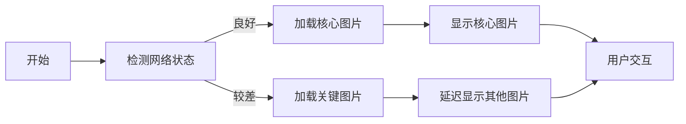

                 

### 文章标题：渐进式图片加载：提升用户体验

渐进式图片加载是一种提升网页性能和用户体验的关键技术。在互联网时代，用户对网页加载速度的要求越来越高，而图片作为网页内容的重要组成部分，其加载速度直接影响到用户的浏览体验。本文将探讨渐进式图片加载的概念、核心算法原理、数学模型、项目实战以及性能优化策略，帮助读者深入了解这一技术，并在实际项目中提升用户体验。

### 关键词：渐进式图片加载，用户体验，网页性能，算法原理，数学模型

### 摘要：
本文首先介绍了渐进式图片加载的基本概念及其与用户体验提升的关系。接着，我们深入探讨了渐进式图片加载的核心算法原理，包括图片预加载和懒加载算法，并使用伪代码进行了详细阐述。随后，文章通过一个实际项目案例，讲解了渐进式图片加载的开发流程、源代码实现和性能优化策略。最后，我们分析了渐进式图片加载在不同前端框架中的应用，并总结了提升用户体验的其他优化策略。通过本文的阅读，读者将能够掌握渐进式图片加载的核心技术和实践方法。

## 核心概念与联系

### 渐进式图片加载的概念

渐进式图片加载是一种在网页上逐步加载图片的技术，目的是减少初始加载时间，提高网页性能和用户体验。传统的图片加载方式是全部图片一次性加载，这种方式可能会导致网页加载缓慢，尤其是在网络连接速度较慢的情况下。而渐进式图片加载则通过分批加载图片，先加载重要部分，再逐步加载其他部分，从而优化加载过程。

### 渐进式图片加载与用户体验的关系

用户体验（User Experience, UX）是指用户在使用产品或服务过程中所感受到的整体体验。在网页设计中，用户体验关系到用户对网页的第一印象、操作便捷性和满意度。渐进式图片加载对用户体验的提升主要体现在以下几个方面：

1. **加快页面初始加载速度**：渐进式图片加载可以减少页面初始加载时间，使用户能够更快地浏览网页内容。
2. **优化视觉体验**：通过逐步显示图片，用户可以提前预览内容，提高浏览兴趣。
3. **降低网络带宽消耗**：渐进式图片加载可以降低用户的数据消耗，特别是对于移动设备用户，这有助于节省流量。
4. **提高网站性能评分**：搜索引擎和网站性能评估工具通常会考虑页面加载速度作为评分指标，渐进式图片加载有助于提高网站性能评分。

### Mermaid 流程图展示渐进式图片加载流程

为了更直观地展示渐进式图片加载的流程，我们可以使用 Mermaid 图库绘制一个流程图。以下是一个简化的流程图示例：



在这个流程图中，A 表示页面开始加载，B 检测网络状态，根据网络状况选择加载路径 C 或 D。C 加载并显示核心图片，E 表示核心图片显示，F 表示延迟加载其他图片。最后，G 表示用户与网页的交互。

通过这个流程图，我们可以清晰地看到渐进式图片加载的每个步骤，以及如何根据网络状况优化加载过程。

## 核心算法原理讲解

### 图片预加载算法

图片预加载算法是一种在用户需要图片之前就提前加载图片的技术。其基本原理是通过分析用户行为和网页内容，预测用户可能需要的图片，并在后台提前加载。这样，当用户需要图片时，可以立即显示，从而减少加载时间。

以下是一个简单的图片预加载算法伪代码：

```python
def preload_images(image_urls):
    for url in image_urls:
        image = Image.open(url)
        display(image)

image_urls = ["image1.jpg", "image2.jpg", "image3.jpg"]
preload_images(image_urls)
```

在这个伪代码中，`preload_images` 函数接收一个图片 URL 列表，并逐个加载和显示这些图片。

### 图片懒加载算法

图片懒加载算法是一种仅在用户滚动到图片附近时才加载图片的技术。其目的是减少初始加载时间，特别是当网页包含大量图片时。懒加载可以通过监听滚动事件，判断图片是否出现在视口（Viewport）中，如果是，则加载并显示图片。

以下是一个简单的图片懒加载算法伪代码：

```javascript
function lazy_load_images() {
    const images = document.querySelectorAll('img[data-src]');

    function image_in_viewport(image) {
        // 判断图片是否在视口中
        // 返回布尔值
    }

    function load_image(image) {
        // 加载图片
        image.src = image.dataset.src;
        image.removeAttribute('data-src');
    }

    images.forEach(function(image) {
        if (image_in_viewport(image)) {
            load_image(image);
        } else {
            image.addEventListener('inview', function() {
                load_image(image);
            });
        }
    });
}

lazy_load_images();
```

在这个伪代码中，`lazy_load_images` 函数首先获取所有包含 `data-src` 属性的图片元素。然后，通过 `image_in_viewport` 函数判断图片是否在视口中。如果图片在视口中，则直接加载并显示图片；如果不在视口中，则监听图片的 `inview` 事件，当图片进入视口时再加载。

### 图片预加载和懒加载算法的优缺点

#### 图片预加载算法

**优点：**
- 可以减少图片的加载延迟，提高用户体验。
- 在加载大量图片时，可以提前优化资源利用率。

**缺点：**
- 可能会增加初始加载时间，特别是在网络连接较差的情况下。
- 如果预加载的图片并非用户需要的，会造成资源的浪费。

#### 图片懒加载算法

**优点：**
- 可以显著减少初始加载时间，提高页面性能。
- 可以节省带宽，特别是对移动设备用户更有优势。

**缺点：**
- 图片加载存在延迟，用户体验可能不如预加载。
- 可能会影响部分图片的加载顺序，导致页面显示不连贯。

### 伪代码示例与算法实现

下面我们通过伪代码示例进一步解释这两个算法的实现细节。

#### 图片预加载伪代码示例

```python
def preload_images(image_urls, num_images_to_preload=3):
    # 预加载指定数量的图片
    for i in range(num_images_to_preload):
        if i < len(image_urls):
            image = Image.open(image_urls[i])
            display(image)

# 示例图片 URL 列表
image_urls = ["image1.jpg", "image2.jpg", "image3.jpg", "image4.jpg", "image5.jpg"]

# 调用预加载函数
preload_images(image_urls)
```

在这个示例中，`preload_images` 函数接收一个图片 URL 列表和要预加载的图片数量。函数通过遍历 URL 列表，逐个加载和显示图片。

#### 图片懒加载伪代码示例

```javascript
function lazy_load_images() {
    const images = document.querySelectorAll('img[data-src]');

    function load_image(image) {
        const src = image.dataset.src;
        image.src = src;
        image.removeAttribute('data-src');
    }

    function check_images() {
        images.forEach(function(image) {
            if (is_image_in_viewport(image)) {
                load_image(image);
            }
        });
    }

    window.addEventListener('scroll', check_images);
    window.addEventListener('resize', check_images);

    // 初始检查
    check_images();
}

function is_image_in_viewport(image) {
    // 判断图片是否在视口中的逻辑
    // 返回布尔值
}

lazy_load_images();
```

在这个示例中，`lazy_load_images` 函数首先获取所有包含 `data-src` 属性的图片元素。然后，通过 `is_image_in_viewport` 函数判断图片是否在视口中。如果图片在视口中，则加载并显示图片。同时，监听滚动和窗口大小调整事件，以便在图片进入视口时及时加载。

通过这些伪代码示例，我们可以看到图片预加载和懒加载算法的基本实现方法。在实际开发中，这些算法可以根据具体需求进行调整和优化。

### 数学模型和数学公式

在渐进式图片加载中，数学模型和公式起到了关键作用。它们帮助我们评估图片的质量、优化加载策略，并确保用户获得最佳体验。以下是一些核心的数学模型和公式，以及它们的详细解释和举例说明。

#### 图片质量评估模型

评估图片质量是渐进式图片加载的重要环节。常见的图片质量评估指标包括峰值信噪比（PSNR）和结构相似性（SSIM）。这些指标可以帮助我们判断图片的清晰度和保真度。

**峰值信噪比（PSNR）**

PSNR用于衡量两张图片之间的质量差异，其公式为：

$$
\text{PSNR} = 10 \cdot \log_{10} \left( \frac{2^{32}}{MSE} \right)
$$

其中，MSE（均方误差）是两张图片的差值平方的平均值。

**示例：**

假设我们有两张图片 `image1` 和 `image2`，通过计算得到它们之间的MSE为50。我们可以使用上述公式计算PSNR：

$$
\text{PSNR} = 10 \cdot \log_{10} \left( \frac{2^{32}}{50} \right) \approx 31.23 \text{ dB}
$$

这意味着 `image1` 和 `image2` 之间的质量差异较小。

**结构相似性（SSIM）**

SSIM是一个更全面的图片质量评估指标，它考虑了图片的结构信息、亮度信息以及对比度信息。其公式为：

$$
\text{SSIM}(x, y) = \frac{(2\mu_x\mu_y + C_1)(2\sigma_{xy} + C_2)}{(\mu_x^2 + \mu_y^2 + C_1)(\sigma_x^2 + \sigma_y^2 + C_2)}
$$

其中，$\mu_x$ 和 $\mu_y$ 分别是两张图片的平均值，$\sigma_{xy}$ 是它们的协方差，$C_1$ 和 $C_2$ 是常数。

**示例：**

假设我们有以下参数：

- $\mu_x = 100, \mu_y = 100$
- $\sigma_{xy} = 10$
- $C_1 = 0.01, C_2 = 0.03$

我们可以计算SSIM：

$$
\text{SSIM}(x, y) = \frac{(2 \cdot 100 \cdot 100 + 0.01)(2 \cdot 10 + 0.03)}{(100^2 + 100^2 + 0.01)(10^2 + 10^2 + 0.03)} \approx 0.985
$$

SSIM接近1表示图片质量较好，而SSIM接近0表示图片质量较差。

#### 渐进式加载策略优化模型

为了优化渐进式加载策略，我们引入了延迟加载和分批加载的概念。延迟加载是指在用户滚动到图片附近时才加载图片，而分批加载是指将图片分成多个批次，逐步加载。

**延迟加载模型**

延迟加载的关键是确定何时加载图片。我们可以使用以下公式计算延迟加载时间：

$$
t_d = t_s + \alpha \cdot d
$$

其中，$t_d$ 是延迟加载时间，$t_s$ 是初始加载时间，$\alpha$ 是延迟系数，$d$ 是用户与图片之间的距离。

**示例：**

假设初始加载时间为2秒，延迟系数为0.5，用户与图片之间的距离为5秒，我们可以计算延迟加载时间：

$$
t_d = 2 + 0.5 \cdot 5 = 4 \text{秒}
$$

这意味着图片将在用户滚动到图片附近4秒后加载。

**分批加载模型**

分批加载的目的是优化加载速度和资源利用率。我们可以使用以下公式计算分批加载策略：

$$
N = \left\lfloor \frac{T}{t_p} \right\rfloor
$$

其中，$N$ 是批次数量，$T$ 是总加载时间，$t_p$ 是单个批次的加载时间。

**示例：**

假设总加载时间为10秒，单个批次的加载时间为2秒，我们可以计算批次数量：

$$
N = \left\lfloor \frac{10}{2} \right\rfloor = 5
$$

这意味着图片将被分成5个批次加载。

通过这些数学模型和公式，我们可以更好地评估图片质量，优化加载策略，从而提升用户体验。

### 项目实战

在渐进式图片加载的项目实战中，我们将通过一个实际案例，详细讲解开发环境的搭建、源代码的实现以及性能优化策略。以下是项目的具体步骤和实现过程。

#### 开发环境搭建

1. **选择开发框架**：
   在选择开发框架时，我们可以考虑使用React、Vue或Angular等现代化的前端框架。这些框架提供了丰富的组件和工具，有助于简化开发流程。

2. **创建项目**：
   使用所选框架创建一个新的项目。例如，使用Create React App创建React项目，可以通过以下命令实现：

   ```bash
   npx create-react-app progressive-image-loading-app
   ```

3. **安装依赖**：
   根据项目需求，安装必要的依赖库。例如，安装用于懒加载的`react-lazy-load-image-component`：

   ```bash
   npm install react-lazy-load-image-component
   ```

4. **配置Webpack**：
   如果需要自定义构建配置，可以使用Webpack。配置Webpack以优化图片加载性能，如使用`image-webpack-plugin`进行图片压缩：

   ```javascript
   const path = require('path');
   const ImageWebpackPlugin = require('image-webpack-plugin');

   module.exports = {
     // 其他配置...
     plugins: [new ImageWebpackPlugin({ filename: 'images/[name].[hash:8].[ext]' })],
   };
   ```

#### 源代码实现与详细解读

1. **布局设计**：
   首先设计页面的布局，确定图片在页面中的位置和大小。可以使用CSS Grid或Flexbox布局来实现。

2. **组件开发**：
   开发一个懒加载图片组件。以下是一个简单的React组件示例：

   ```jsx
   import React, { useState, useEffect } from 'react';
   import LazyLoad from 'react-lazy-load-image-component';

   const LazyImage = ({ src, alt }) => {
     const [loaded, setLoaded] = useState(false);

     useEffect(() => {
       setLoaded(true);
     }, [src]);

     return (
       <LazyLoad
         src={loaded ? src : '/images/placeholder.jpg'}
         alt={alt}
         effect="blur"
       />
     );
   };

   export default LazyImage;
   ```

   在这个组件中，我们使用`react-lazy-load-image-component`库来实现懒加载。通过设置`src`属性为加载后的图片地址，当图片加载完成后，显示实际图片。

3. **图片处理**：
   使用Webpack或其他工具对图片进行压缩和处理，以减少图片的加载时间。可以使用`image-webpack-plugin`插件对图片进行压缩，如：

   ```javascript
   const path = require('path');
   const ImageWebpackPlugin = require('image-webpack-plugin');

   module.exports = {
     // 其他配置...
     plugins: [new ImageWebpackPlugin({ filename: 'images/[name].[hash:8].[ext]' })],
   };
   ```

4. **数据获取**：
   如果图片数据来自后端API，可以使用`fetch`或`axios`等库获取数据。以下是一个示例：

   ```javascript
   async function fetchImages() {
     const response = await fetch('/api/images');
     const data = await response.json();
     return data;
   }
   ```

   获取图片数据后，可以在组件中渲染图片。

#### 代码解读与分析

1. **组件渲染**：
   在App组件中，使用`LazyImage`组件渲染图片。以下是一个示例：

   ```jsx
   import React from 'react';
   import LazyImage from './LazyImage';

   const App = () => {
     const images = fetchImages();

     return (
       <div className="App">
         {images.map((image) => (
           <LazyImage key={image.id} src={image.url} alt={image.alt} />
         ))}
       </div>
     );
   };

   export default App;
   ```

   在这个示例中，我们通过`fetchImages`函数获取图片数据，并使用`LazyImage`组件逐个渲染。

2. **性能分析**：
   使用性能分析工具（如Chrome DevTools）监控图片加载性能。可以查看“Performance”标签页，分析加载时间和资源使用情况。

3. **优化策略**：
   根据性能分析结果，可以采取以下优化策略：
   - 对图片进行压缩和优化。
   - 使用内容分发网络（CDN）加速图片加载。
   - 调整懒加载策略，如修改延迟加载时间和批次大小。

#### 实际案例分析和详细讲解剖析

假设我们有一个电子商务网站，其中包含大量商品图片。以下是一个实际案例的分析：

1. **问题识别**：
   - 商品图片加载缓慢，导致页面加载时间过长。
   - 部分用户在浏览商品时，图片未及时显示，影响用户体验。

2. **解决方案**：
   - 使用渐进式图片加载技术，实现懒加载和预加载。
   - 使用CDN加速图片加载，提高访问速度。
   - 对商品图片进行压缩和优化，减少图片大小。

3. **效果评估**：
   - 通过性能分析工具，监控页面加载时间，评估优化效果。
   - 通过用户反馈，了解优化后用户体验的提升情况。

通过这个实际案例，我们可以看到渐进式图片加载技术在提升网页性能和用户体验方面的显著效果。在实际项目中，需要根据具体需求和场景，灵活应用这些技术，实现最佳效果。

### 性能优化与调优

在实现渐进式图片加载的过程中，性能优化是确保用户体验的关键环节。以下是一些常见的性能问题及其优化技巧：

#### 常见性能问题

1. **加载时间过长**：图片加载时间过长可能导致页面初始加载时间过长，影响用户体验。
2. **资源占用过高**：大量图片同时加载可能导致浏览器资源占用过高，导致页面卡顿。
3. **缓存问题**：缓存机制不当可能导致旧版本图片无法及时更新，影响用户体验。
4. **图像质量不佳**：图片压缩不当可能导致图像质量不佳，影响用户体验。

#### 调优技巧

1. **图片压缩**：
   - 使用图像压缩工具（如TinyPNG、ImageOptim）对图片进行压缩。
   - 使用WebP格式，相比JPEG和PNG格式，WebP具有更小的文件大小和更好的图像质量。
2. **懒加载**：
   - 优化懒加载策略，合理设置延迟加载时间和批次大小，避免过多图片同时加载。
   - 使用Intersection Observer API代替手动监听滚动事件，提高懒加载的效率和准确性。
3. **预加载**：
   - 根据用户行为预测可能需要的图片，提前加载并缓存。
   - 使用Service Worker缓存图片资源，提高离线访问速度。
4. **缓存机制**：
   - 使用HTTP缓存策略，如Cache-Control和Etag，合理设置缓存时间。
   - 对热门图片使用持久缓存，减少频繁访问的加载时间。

#### 实际应用案例

以下是一个电商网站的性能优化案例：

1. **问题识别**：
   - 页面加载时间较长，特别是在移动设备上。
   - 用户反馈部分图片加载缓慢，影响购物体验。

2. **解决方案**：
   - 使用渐进式图片加载，实现懒加载和预加载。
   - 使用CDN加速图片加载，提高访问速度。
   - 对商品图片进行压缩和优化，减少图片大小。
   - 使用WebP格式，提高图片质量和加载速度。

3. **效果评估**：
   - 通过Google PageSpeed Insights和Lighthouse等工具，评估页面加载性能。
   - 通过用户反馈和使用数据，了解优化后的效果。

通过这个实际案例，我们可以看到性能优化对渐进式图片加载的重要作用。通过合理的优化策略，可以有效提升网页性能，为用户提供更好的体验。

### 前端框架与工具应用

渐进式图片加载技术在前端开发中有着广泛的应用，不同的前端框架和工具提供了丰富的功能和便捷的接口，使得开发者能够轻松实现这一技术。以下将介绍几种常用的前端框架和工具，并展示如何使用它们进行渐进式图片加载。

#### React中的渐进式图片加载

React是一个流行的JavaScript库，用于构建用户界面。`react-lazy-load-image-component`是一个常用的React组件，用于实现懒加载功能。

**安装与配置**

首先，安装`react-lazy-load-image-component`：

```bash
npm install react-lazy-load-image-component
```

然后在React组件中使用它：

```jsx
import React from 'react';
import LazyLoad from 'react-lazy-load-image-component';

const MyImage = ({ src, alt }) => {
  return (
    <LazyLoad
      src={src}
      alt={alt}
      effect="blur" // 渐变效果
      threshold={300} // 视图阈值，即当图片进入视口300像素时开始加载
    />
  );
};

export default MyImage;
```

#### Vue中的渐进式图片加载

Vue是一个渐进式JavaScript框架，适用于构建用户界面。`vue-lazyload`是一个Vue插件，用于实现懒加载功能。

**安装与配置**

首先，安装`vue-lazyload`：

```bash
npm install vue-lazyload
```

然后在Vue项目中使用：

```javascript
import Vue from 'vue';
import VueLazyload from 'vue-lazyload';

Vue.use(VueLazyload);

new Vue({
  el: '#app',
  data: {
    images: [
      '/path/to/image1.jpg',
      '/path/to/image2.jpg',
      // ...
    ],
  },
  template: `
    <div>
      
    </div>
  `,
});
```

#### Angular中的渐进式图片加载

Angular是一个高级的JavaScript框架，适用于构建大型单页应用程序。`ngx-lazy-load`是一个Angular模块，用于实现懒加载功能。

**安装与配置**

首先，安装`ngx-lazy-load`：

```bash
npm install ngx-lazy-load
```

然后在Angular项目中使用：

```typescript
// 在app.module.ts中引入模块
import { NgModule } from '@angular/core';
import { BrowserModule } from '@angular/platform-browser';
import { NgModule } from '@angular/core';
import { LazyLoadModule } from 'ngx-lazy-load';

import { AppComponent } from './app.component';

@NgModule({
  declarations: [
    AppComponent
  ],
  imports: [
    BrowserModule,
    LazyLoadModule
  ],
  providers: [],
  bootstrap: [AppComponent]
})
export class AppModule { }

// 在app.component.html中使用
<div *ngFor="let image of images">
  
</div>
```

通过以上示例，我们可以看到如何在不同前端框架中使用渐进式图片加载。这些框架和工具都提供了简便的接口，使得开发者能够快速实现懒加载和预加载功能，提升用户体验。

### 用户体验提升策略

渐进式图片加载技术是提升用户体验的重要手段之一，但它并非唯一的策略。以下将探讨渐进式图片加载对用户体验的影响，并介绍其他优化策略。

#### 渐进式图片加载对用户体验的影响

渐进式图片加载技术通过分批加载图片，显著减少了页面的初始加载时间，从而提升了用户体验。以下是渐进式图片加载对用户体验的几个重要影响：

1. **加快页面加载速度**：渐进式图片加载可以显著减少页面初始加载时间，使用户能够更快地浏览网页内容，提高浏览体验。
2. **优化视觉体验**：通过逐步显示图片，用户可以提前预览内容，提高浏览兴趣。这种动态加载过程也增加了网页的交互性。
3. **降低网络带宽消耗**：渐进式图片加载可以降低用户的数据消耗，特别是对于移动设备用户，这有助于节省流量，提高访问效率。
4. **提高网站性能评分**：搜索引擎和网站性能评估工具通常会考虑页面加载速度作为评分指标，渐进式图片加载有助于提高网站性能评分。

#### 其他用户体验优化策略

尽管渐进式图片加载是提升用户体验的重要手段，但还有许多其他策略可以进一步优化用户体验。以下是一些有效的优化策略：

1. **内容优先加载**：优先加载页面中最重要和最关键的内容，如导航、标题和主要文本，以确保用户能够快速获取关键信息。
2. **响应式设计**：确保网页在不同设备和屏幕尺寸上都能良好显示，提供一致的浏览体验。
3. **异步加载**：对于非关键资源（如脚本、样式表等），使用异步加载技术，以减少页面加载时间。
4. **代码优化**：通过压缩、合并和缓存代码，减少服务器响应时间和浏览器渲染时间。
5. **图像优化**：使用WebP格式或其他高效图像格式，压缩图片文件大小，提高加载速度。
6. **使用CDN**：使用内容分发网络（CDN）将静态资源分发到全球各地的服务器，减少用户访问延迟。
7. **使用服务工人**：利用服务工人缓存和预加载资源，提高页面性能和用户体验。

通过综合运用这些策略，开发者可以全面提升网页的性能和用户体验，为用户提供更加流畅、快速的浏览体验。

### 附录

渐进式图片加载技术在现代网页开发中扮演着重要角色，为了帮助开发者更好地理解和应用这一技术，以下提供了渐进式图片加载相关的资源与工具。

#### 开发工具

1. **图片压缩工具**：
   - **TinyPNG**（[tinyjpg.com](https://tinyjpg.com/)）：在线工具，可以大幅减小PNG和JPEG图片的文件大小。
   - **ImageOptim**（[imageoptim.com](https://imageoptim.com/)）：Mac上的桌面应用程序，提供强大的图片压缩功能。
2. **Webpack插件**：
   - **image-webpack-plugin**（[github.com/tcooperson/image-webpack-plugin](https://github.com/tcooperson/image-webpack-plugin)）：用于Webpack的图片处理插件，支持多种图片优化功能。
   - **svg-sprite-loader**（[github.com/jtangelder/svg-sprite-loader](https://github.com/jtangelder/svg-sprite-loader)）：用于创建SVG精灵图，减少HTTP请求。

#### 学习资源

1. **技术文档和教程**：
   - **MDN Web Docs - Image懒加载**（[developer.mozilla.org/en-US/docs/Web/API/HTMLImageElement/srcprop#lazy_loading](https://developer.mozilla.org/en-US/docs/Web/API/HTMLImageElement/srcprop#lazy_loading)）：MDN提供的关于图片懒加载的详细文档。
   - **Google Developers - Improve Performance with Lazy Loading**（[web.dev/learn/lazy-loading/](https://web.dev/learn/lazy-loading/)）：Google提供的关于渐进式加载和性能优化的教程。
2. **开源库和框架**：
   - **react-lazy-load-image-component**（[github.com/leeny83/react-lazy-load-image-component](https://github.com/leeny83/react-lazy-load-image-component)）：适用于React的懒加载组件库。
   - **vue-lazyload**（[github.com/Halfrost/Vue-Lazyload](https://github.com/Halfrost/Vue-Lazyload)）：适用于Vue的懒加载插件。
   - **ngx-lazy-load**（[github.com/vegz/ngx-lazy-load](https://github.com/vegz/ngx-lazy-load)）：适用于Angular的懒加载模块。

通过这些资源与工具，开发者可以深入了解渐进式图片加载技术，并在实际项目中有效应用，提升网页性能和用户体验。

