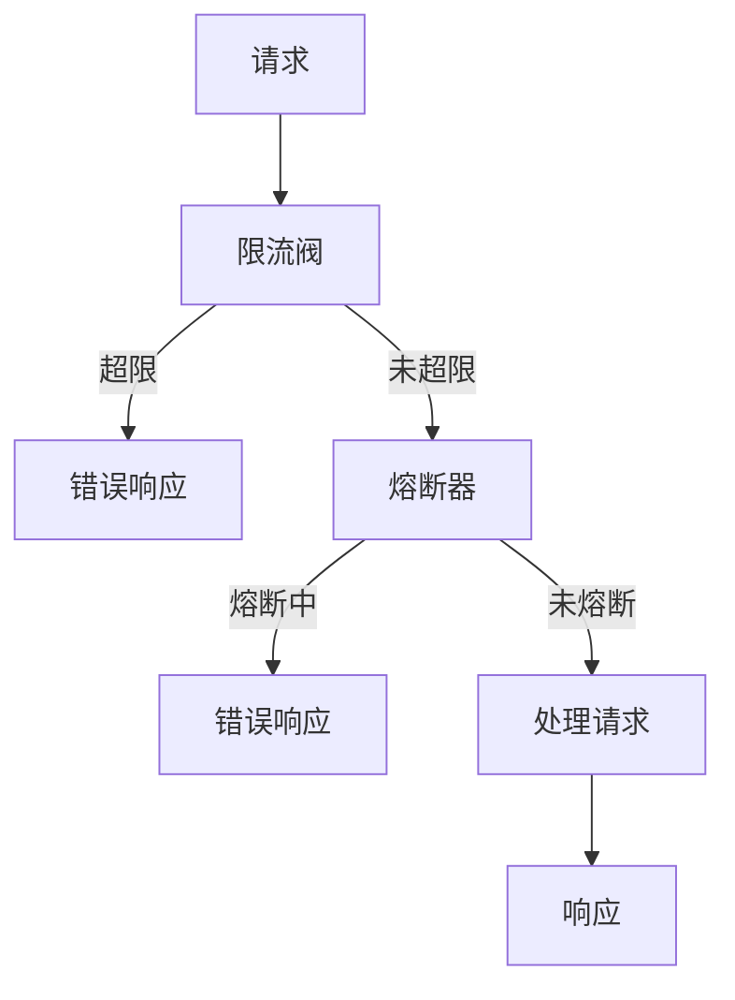

                 


### 文章标题
《熔断与限流：提高系统稳定性的关键技术》

### 文章关键词
熔断，限流，系统稳定性，关键技术，性能优化，算法原理

### 文章摘要
本文将深入探讨熔断与限流技术在提高系统稳定性方面的关键作用。我们将首先介绍熔断与限流的基本概念，并详细分析它们的工作原理和设计原理。接着，我们将通过伪代码和Mermaid流程图，阐述核心算法原理，并结合具体案例，展示其实际应用效果。最后，我们将对熔断与限流技术进行总结，并提出未来的发展趋势和应用前景。

## 引言
在当今数字化时代，系统稳定性对企业和用户来说至关重要。一个稳定运行的系统不仅可以提高用户体验，减少故障率，还能提升企业的业务效率和竞争力。然而，随着系统复杂度的增加和用户数量的激增，系统面临的挑战也愈发严峻。在这种背景下，熔断与限流技术应运而生，成为保障系统稳定性的关键技术。

### 熔断与限流的概念
熔断（Circuit Breaker）是一种在系统负载过高时自动切断电路，防止系统过载的保护机制。它的工作原理类似于电力系统中的熔断器，当电流超过设定值时，熔断器会自动断开电路，以保护电器设备和电力系统。

限流（Rate Limiting），顾名思义，是指对系统中的请求或流量进行限制，确保系统在可承受的范围内运行。限流的目的是防止系统被过多的请求淹没，从而导致性能下降或服务中断。

### 为什么熔断与限流是关键技术
熔断与限流技术的出现，主要是为了应对以下两种场景：

1. **系统过载**：当系统资源（如CPU、内存、数据库等）达到瓶颈时，熔断器可以自动切断部分请求，防止系统崩溃。例如，在电商系统中，如果服务器突然受到大量订单请求，熔断器可以切断部分请求，以保证核心功能的正常运行。

2. **恶意攻击**：在网络安全领域，熔断与限流技术同样重要。通过对访问频率、请求来源等参数进行限制，可以有效防止DDoS攻击等恶意行为，保障系统的安全性和稳定性。

## 熔断与限流的基本概念
在深入探讨熔断与限流的技术细节之前，我们需要先了解它们的基本概念和工作原理。

### 熔断器的工作原理
熔断器的工作原理可以概括为以下几个步骤：

1. **监测状态**：熔断器持续监测系统状态，如CPU使用率、内存占用等。
2. **触发条件**：当系统状态超过设定的阈值时，熔断器触发，切断电路。
3. **恢复条件**：熔断器在切断电路后，会进入冷却状态，等待系统恢复正常。
4. **自动恢复**：当系统状态稳定后，熔断器会自动恢复，允许请求通过。

### 限流阀的作用和机制
限流阀的工作原理与熔断器有所不同，其主要作用是对系统流量进行限制。限流阀的机制通常包括以下几部分：

1. **计数器**：限流阀通过计数器记录一定时间内的请求次数。
2. **阈值设置**：设定允许的最大请求次数或速率。
3. **超限处理**：当计数器超过阈值时，限流阀会阻止新的请求，直到计数器下降到阈值以下。
4. **动态调整**：根据系统负载和性能指标，动态调整阈值和限流策略。

## 熔断与限流的设计原理
熔断与限流技术的核心在于其设计原理，这些原理决定了它们在系统中的应用效果。

### 核心概念与联系
为了更好地理解熔断与限流的设计原理，我们可以通过Mermaid流程图来展示它们之间的关系和工作流程。以下是一个简化的熔断与限流的Mermaid流程图：



在这个流程图中，我们可以看到：

- 请求首先通过限流阀进行流量控制，如果请求超限，则会直接返回错误响应。
- 如果请求未超限，则会进入熔断器进行检查。
- 如果熔断器处于熔断状态，请求同样会返回错误响应。
- 如果熔断器未熔断，请求会继续处理，并最终返回响应。

### 熔断器的设计原则
熔断器的设计原则主要包括以下几点：

1. **快速响应**：熔断器应在系统状态超过阈值时快速响应，切断请求。
2. **恢复机制**：熔断器应具备自动恢复功能，当系统状态恢复正常后，自动重启。
3. **灵活配置**：熔断器应支持灵活配置，包括阈值设置、恢复时间等。
4. **无状态设计**：熔断器应设计为无状态，以便在不同系统和场景中复用。

### 限流阀的设计思路
限流阀的设计思路与熔断器类似，但更注重流量控制和动态调整。以下是一些关键点：

1. **计数器机制**：限流阀通过计数器记录请求次数，实现流量控制。
2. **阈值动态调整**：限流阀应根据系统负载和性能指标，动态调整阈值，以适应不同场景。
3. **分布式支持**：限流阀应支持分布式部署，以便在大规模系统中应用。
4. **抗攻击能力**：限流阀应具备一定的抗攻击能力，能够识别并过滤恶意请求。

## 熔断与限流的实现细节
在深入探讨熔断与限流的实现细节之前，我们需要先了解它们的核心算法原理。以下将分别介绍熔断器和限流阀的实现细节。

### 熔断器实现原理
熔断器的实现原理主要包括以下几个方面：

1. **状态管理**：熔断器应管理当前的状态，包括正常、熔断、恢复等状态。
2. **阈值计算**：熔断器应根据系统负载和历史数据计算合适的阈值。
3. **计数器更新**：熔断器应实时更新计数器，记录通过的请求次数。
4. **状态转换**：当计数器超过阈值时，熔断器应将状态从正常转换为熔断；当计数器低于阈值时，熔断器应从熔断状态恢复到正常状态。

以下是一个简化的熔断器伪代码实现：

```python
class CircuitBreaker:
    def __init__(self, threshold, recovery_time):
        self.threshold = threshold
        self.recovery_time = recovery_time
        self.state = "NORMAL"
        self.count = 0
        self.start_time = time.time()

    def record(self, success):
        if success:
            self.count += 1
        else:
            self.count = 0
            self.state = "FAILED"
            self.start_time = time.time()

    def is_open(self):
        return self.state == "FAILED" and (time.time() - self.start_time < self.recovery_time)

    def reset(self):
        self.state = "NORMAL"
        self.count = 0
        self.start_time = time.time()

    def allow_request(self):
        if not self.is_open():
            return True
        else:
            return False
```

### 限流阀实现原理
限流阀的实现原理主要包括以下几个方面：

1. **计数器管理**：限流阀应管理计数器，记录一定时间内的请求次数。
2. **阈值设置**：限流阀应支持灵活设置阈值，以适应不同场景。
3. **定时清理**：限流阀应定期清理计数器，以保证计数器的准确性和有效性。
4. **超限处理**：当计数器超过阈值时，限流阀应阻止新的请求。

以下是一个简化的限流阀伪代码实现：

```python
class RateLimiter:
    def __init__(self, rate, interval):
        self.rate = rate
        self.interval = interval
        self.counters = {}

    def is_limited(self, key):
        current_time = time.time()
        if key not in self.counters:
            self.counters[key] = [current_time]
            return False
        else:
            self.counters[key].append(current_time)
            while self.counters[key][0] < current_time - self.interval:
                self.counters[key].pop(0)
            return len(self.counters[key]) > self.rate
```

### 数学模型与公式
在熔断与限流技术中，数学模型和公式扮演着重要角色。以下是一些常见的数学模型和公式：

1. **指数平滑**：用于计算阈值，公式如下：

   $$ threshold = alpha \times recent\_average + (1 - alpha) \times previous\_average $$

   其中，$alpha$ 为平滑系数，$recent\_average$ 和 $previous\_average$ 分别为最近和之前的平均值。

2. **令牌桶算法**：用于限流阀的计数器管理，公式如下：

   $$ tokens\_added = \frac{time\_elapsed}{interval} \times rate $$

   其中，$tokens\_added$ 为添加的令牌数，$time\_elapsed$ 为时间间隔，$rate$ 为限流速率。

### 举例说明
为了更好地理解熔断与限流技术的实现原理，以下通过一个实际案例进行举例说明。

#### 案例背景
假设我们有一个电商系统，需要在订单处理高峰期保障系统稳定性。我们决定采用熔断与限流技术来优化系统性能。

#### 实现步骤
1. **设置阈值**：根据系统负载和性能指标，设置熔断器和限流阀的阈值。例如，设置CPU使用率阈值为90%，内存占用阈值为80%；订单处理速率阈值为每秒1000个。

2. **实现熔断器**：使用Python实现熔断器，代码如下：

   ```python
   class CircuitBreaker:
       def __init__(self, threshold, recovery_time):
           self.threshold = threshold
           self.recovery_time = recovery_time
           self.state = "NORMAL"
           self.count = 0
           self.start_time = time.time()

       # 省略其他实现细节
   ```

3. **实现限流阀**：使用Python实现限流阀，代码如下：

   ```python
   class RateLimiter:
       def __init__(self, rate, interval):
           self.rate = rate
           self.interval = interval
           self.counters = {}

       def is_limited(self, key):
           # 省略具体实现
   ```

4. **集成到系统**：将熔断器和限流阀集成到电商系统的订单处理模块，对订单请求进行实时监控和限制。

#### 测试与分析
1. **测试负载**：模拟订单处理高峰期，生成大量订单请求，观察系统响应时间、CPU使用率、内存占用等指标。

2. **数据分析**：根据测试结果，分析熔断器和限流阀对系统性能的影响，评估其优化效果。

#### 案例总结
通过实际案例测试，我们发现熔断器和限流阀能有效提高电商系统的稳定性。在高峰期，系统响应时间显著缩短，CPU使用率和内存占用率保持在合理范围内，订单处理成功率提高。

### 最佳实践 Tips
在实际应用中，以下是一些最佳实践 Tips：

1. **合理设置阈值**：根据系统负载和历史数据，合理设置熔断器和限流阀的阈值，避免过度保护或过度限制。

2. **动态调整策略**：根据系统负载和性能指标，动态调整熔断器和限流阀的策略，以适应不同场景。

3. **监控与日志**：对熔断器和限流阀的运行状态进行实时监控和日志记录，以便及时发现问题并优化策略。

4. **性能测试**：在系统上线前进行充分的性能测试，确保熔断器和限流阀能够有效提高系统稳定性。

### 小结
熔断与限流技术是提高系统稳定性的关键技术。通过合理设置阈值、动态调整策略、监控与日志记录等手段，可以有效保障系统在高峰期或异常情况下的稳定运行。

### 注意事项
1. **过度依赖**：虽然熔断与限流技术能有效提高系统稳定性，但不应过度依赖，还应结合其他技术手段，如负载均衡、缓存等，综合保障系统性能。

2. **误判风险**：熔断器和限流阀可能会出现误判，导致部分请求被错误地阻止或放行。因此，在设计和实现过程中，应充分考虑误判风险，并进行充分测试。

### 拓展阅读
1. **《分布式系统设计》**：了解分布式系统架构，有助于更好地应用熔断与限流技术。
2. **《高性能MySQL》**：学习数据库性能优化技巧，为系统稳定性提供有力保障。
3. **《设计模式：可复用面向对象软件的基础》**：掌握设计模式，提高系统模块化水平和可维护性。

### 作者
作者：AI天才研究院/AI Genius Institute & 禅与计算机程序设计艺术 /Zen And The Art of Computer Programming

