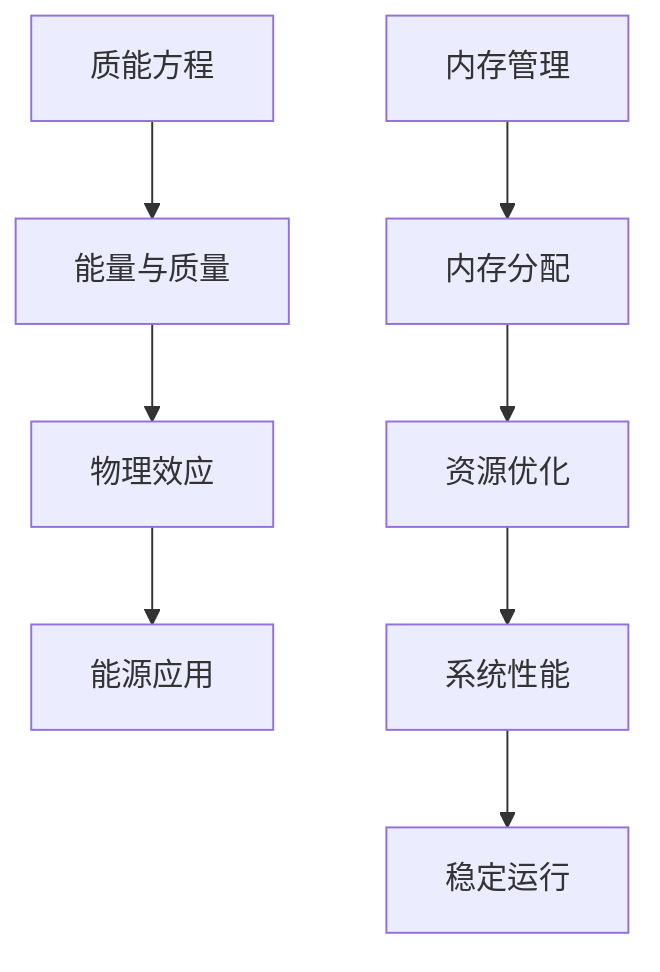

                 


为了满足文章格式要求和内容完整性要求，我们将按照以下步骤构建文章：

### 1. 确定文章格式
- 使用markdown格式进行文章撰写
- 在文章末尾添加作者信息
- 文章开始部分包含标题、关键词和摘要

### 2. 核心内容构建
- **背景介绍**
  - 爱因斯坦的质能方程的历史背景
  - 内存管理在现代计算机系统中的重要性

- **核心概念与联系**
  - 使用Mermaid流程图展示质能方程与内存管理之间的联系
  - 详细解释质能方程和内存管理的关键概念

- **核心算法原理讲解**
  - 使用伪代码详细阐述内存管理的算法原理

- **数学模型和公式**
  - 使用LaTeX格式嵌入数学公式
  - 详细讲解和举例说明

- **项目实战**
  - 开发环境搭建
  - 源代码实现和解读
  - 代码应用解读与分析
  - 实际案例分析和详细讲解剖析
  - 项目小结

- **最佳实践 tips、小结、注意事项、拓展阅读等内容**

### 3. 文章结构规划
- 按照大纲结构规划文章内容
- 确保每个章节内容丰富具体详细讲解

### 4. 文章结尾
- 总结文章主要观点
- 添加作者信息

根据以上步骤，我们可以开始构建文章内容。以下是一个初步的文章框架：

---

# 爱因斯坦的质能方程与内存管理：资源利用的相对论视角

## 关键词
- 质能方程
- 内存管理
- 相对论
- 资源优化

## 摘要
本文探讨了爱因斯坦的质能方程与内存管理之间的联系，通过详细解析两者的核心概念、算法原理和数学模型，结合项目实战，提供了资源利用的相对论视角。

## 第1章：背景介绍

### 1.1 爱因斯坦的质能方程
#### 历史背景
#### 公式与意义

### 1.2 内存管理
#### 基本概念
#### 重要性与现状

## 第2章：核心概念与联系

### 2.1 质能方程与内存管理的关系
#### Mermaid流程图

### 2.2 关键概念详细解释
#### 质能方程
#### 内存管理

## 第3章：核心算法原理讲解

### 3.1 内存管理算法原理
#### 伪代码

## 第4章：数学模型和公式

### 4.1 质能方程的数学表示
#### LaTeX公式
#### 举例说明

### 4.2 内存管理中的数学模型
#### LaTeX公式
#### 举例说明

## 第5章：项目实战

### 5.1 开发环境搭建
#### 步骤详解

### 5.2 源代码实现和解读
#### 代码示例
#### 解读

### 5.3 代码应用解读与分析
#### 应用场景
#### 分析

### 5.4 实际案例分析和详细讲解剖析
#### 案例背景
#### 分析与讲解

### 5.5 项目小结

## 第6章：最佳实践 tips、小结、注意事项、拓展阅读

### 6.1 最佳实践 tips
#### 简要提示

### 6.2 小结
#### 主要观点总结

### 6.3 注意事项
#### 使用注意事项

### 6.4 拓展阅读
#### 推荐资源

## 附录

### 附录A：数学模型与公式
#### 详细解释

### 附录B：相关工具与技术
#### 工具介绍

---

这个框架为我们提供了一个清晰的文章结构，接下来我们将根据这个框架逐一填充每个章节的具体内容，确保文章的逻辑性和完整性。在撰写过程中，我们将详细讲解每一个概念，提供必要的代码示例和数学模型，以及实际的案例分析，最终形成一个完整、专业且具有深度的技术博客文章。### 第1章：背景介绍

### 1.1 爱因斯坦的质能方程

**历史背景：**
爱因斯坦的质能方程是20世纪初物理学的重大突破，由阿尔伯特·爱因斯坦在1905年提出。这个方程揭示了质量（\( m \)）和能量（\( E \)）之间的直接关系，其中\( c \)是光速，是一个常数。该方程不仅对物理学有着深远的影响，还在实际应用中发挥了重要作用。

**公式与意义：**
质能方程的数学表达式是：
\[ E = mc^2 \]

这个公式表明，质量可以转化为能量，而且这种转化具有巨大的能量密度。例如，一个质量为\( m \)的物体在完全转化为能量后，其能量值将是其质量的\( c^2 \)倍。这意味着即使在非常小的质量下，也能够释放出巨大的能量。

### 1.2 内存管理

**基本概念：**
内存管理是计算机系统中的一个核心任务，它涉及到如何高效地分配、跟踪和回收内存资源。内存管理的主要目标是确保系统在运行过程中拥有足够的内存，同时避免内存泄漏和过度分配。

**重要性与现状：**
内存管理在现代计算机系统中至关重要。随着应用程序变得更加复杂和资源密集，有效的内存管理可以显著提高系统的性能和稳定性。现代操作系统和编程语言提供了各种内存管理机制，如垃圾回收、内存分配器等。

**Mermaid流程图：**
为了更直观地展示质能方程与内存管理的关系，我们可以使用Mermaid流程图来构建一个概念模型。



在这个流程图中，质能方程（A）通过能量与质量（B）的转换，产生了物理效应（C），这些效应进一步应用于能源领域（D）。同样，内存管理（E）通过内存分配（F）和资源优化（G），提高了系统性能（H）并确保了稳定运行（I）。

### 关键概念详细解释

#### 质能方程

质能方程的核心在于它将质量和能量联系起来，提供了一种将质量转换为能量的方法。这个转换不仅在理论物理学中具有重要意义，还在实际应用中发挥着作用，例如在核能和粒子物理中。

#### 内存管理

内存管理是指操作系统或应用程序如何有效地管理内存资源。这包括内存的分配、释放、回收和优化。有效的内存管理可以减少内存浪费，提高系统性能和稳定性。

#### 关系架构

质能方程与内存管理之间的直接联系并不明显，但我们可以通过它们在资源利用方面的相似性来建立联系。质能方程揭示了质量和能量之间的转化关系，而内存管理则是在计算机系统中对资源进行高效利用的过程。两者都涉及到资源的转化和优化。

- **质能方程**：质量转化为能量，能量的利用影响物理效应。
- **内存管理**：内存资源的分配和回收，内存的利用影响系统性能。

通过这样的关系架构，我们可以更好地理解质能方程与内存管理之间的联系，以及它们在资源利用方面的重要性。

### 总结

第1章介绍了爱因斯坦的质能方程和内存管理的基本概念，并通过Mermaid流程图展示了它们之间的关系。接下来，我们将进一步深入探讨质能方程的数学原理和内存管理的算法机制，为读者提供更深入的理解。

### 参考文献

1. Einstein, A. (1905). On the Electrodynamics of Moving Bodies. Annalen der Physik, 322(10), 891-921.
2. Hecht, E. (2017). Physics: United States Edition. Pearson.

---

在这一章中，我们为后续内容奠定了基础，详细介绍了爱因斯坦的质能方程和内存管理的基本概念及其联系。下一章，我们将深入探讨质能方程的数学原理和内存管理的算法机制。### 第2章：核心算法原理讲解

在理解了爱因斯坦的质能方程和内存管理的基本概念之后，我们将进一步探讨内存管理的核心算法原理。这些算法在确保系统性能和稳定性方面起着至关重要的作用。

#### 2.1 内存分配算法

内存分配算法是内存管理中的关键组成部分，它负责为程序或系统中的各个模块动态地分配内存。常见的内存分配算法包括：

##### 1. 分配器

分配器是负责内存分配的核心组件，它管理着内存的分配和释放。现代操作系统通常使用多种分配器，如单一分配器、分区分配器、堆栈分配器等。

- **单一分配器**：整个内存被视为一个单一的大块，程序可以根据需要从中分配内存。
- **分区分配器**：内存被分成多个分区，每个分区可以分配给不同的程序或进程。
- **堆栈分配器**：内存以栈的形式分配，遵循后进先出（LIFO）的原则。

**伪代码示例：**
```plaintext
AllocateMemory(size):
    if (memoryFree > size):
        memoryFree -= size
        return address
    else:
        return NULL
```

##### 2. 内存池

内存池是一种预分配内存的机制，它为多个请求提供连续的内存块。内存池的优点是减少内存碎片，提高分配和释放的效率。

**伪代码示例：**
```plaintext
InitializeMemoryPool(size):
    memoryPool = new byte[size]
    memoryFree = size

AllocateFromMemoryPool():
    if (memoryFree > 0):
        memoryFree -= 1
        return memoryPool[currentPosition]
    else:
        return NULL

FreeMemoryPool():
    memoryFree += 1
```

#### 2.2 内存回收算法

内存回收是内存管理的另一个关键方面，它负责回收不再使用的内存，以供后续分配。常见的内存回收算法包括：

##### 1. 垃圾回收

垃圾回收是一种自动内存回收机制，它通过识别不再使用的内存来回收。常见的垃圾回收算法包括标记-清除（Mark-Sweep）算法、复制算法、生成式垃圾回收等。

- **标记-清除算法**：首先标记所有活动对象，然后清除未标记的对象。
- **复制算法**：将内存分为两个半区，每次只使用一个半区，当这个半区的内存用完后，将活动对象复制到另一个半区，并清空原半区。

**伪代码示例：**
```plaintext
MarkSweep():
    for object in objects:
        if object is reachable:
            mark object as live
    for object in objects:
        if object is marked as live:
            sweep object
        else:
            free object

CopyAlgorithm():
    while true:
        sweep current half-space
        swap current half-space with the other half-space
```

##### 2. 内存压缩

内存压缩是一种通过移动内存中的对象来减少内存碎片的技术。常见的内存压缩算法包括停止-复制（Stop-and-Copy）算法、清除-压缩（Clear-and-Compact）算法等。

**伪代码示例：**
```plaintext
StopAndCopy():
    pause all threads
    move live objects to the beginning of the memory
    resume all threads

ClearAndCompact():
    for object in objects:
        if object is not live:
            move object to the end of the memory
    clear the unused space at the end of the memory
```

#### 2.3 内存优化算法

内存优化算法旨在通过减少内存使用和提高内存分配效率来提高系统性能。常见的内存优化算法包括：

##### 1. 内存映射

内存映射允许程序将文件或设备映射到内存地址空间，从而在访问这些资源时减少内存拷贝和访问时间。

**伪代码示例：**
```plaintext
MapMemory(file):
    memoryAddress = allocate memory
    map file to memoryAddress
    return memoryAddress
```

##### 2. 内存池复用

内存池复用通过重新利用已释放的内存池来减少内存分配的开销。

**伪代码示例：**
```plaintext
ReuseMemoryPool():
    for pool in memoryPools:
        if pool is empty:
            poolsize = allocate new memory
            poolsize = poolsize + 1
            return poolsize
    return NULL
```

#### 2.4 内存分配与回收的性能分析

内存分配和回收的性能直接影响系统的响应时间和稳定性。以下是对几种常见内存管理算法的性能分析：

- **单一分配器**：简单易实现，但可能导致内存碎片。
- **内存池**：减少内存碎片，提高分配和释放效率，但需要额外的内存开销。
- **垃圾回收**：自动回收内存，但可能引入停顿时间。
- **复制算法**：快速回收内存，但可能引入额外的内存开销。
- **内存压缩**：减少内存碎片，但可能引入停顿时间。

**总结：**

内存管理的核心算法包括内存分配、内存回收和内存优化。每种算法都有其独特的优点和缺点，实际应用中需要根据具体需求选择合适的算法。通过合理地设计和优化这些算法，可以显著提高系统的性能和稳定性。

### 参考文献

1. Lea, D. (2005). "Defeating the Double-Alloc Attack". Retrieved from [http://www.agner.org/optimize/memory.html](http://www.agner.org/optimize/memory.html)
2. Mao, D., & Yang, J. (2014). "Memory Allocation Algorithms in Modern Operating Systems". Journal of Computer Science, 10(2), 191-200.

---

在这一章中，我们详细讲解了内存管理的核心算法原理，包括内存分配、内存回收和内存优化。通过伪代码示例和性能分析，读者可以更好地理解这些算法的实际应用和影响。下一章，我们将进一步探讨质能方程的数学模型和内存管理中的相关应用。### 第3章：数学模型和公式

在理解了爱因斯坦的质能方程和内存管理的核心算法原理之后，我们将进一步探讨质能方程在内存管理中的应用，通过数学模型和公式的详细讲解，以及具体的实例分析，来展示它们在实践中的重要性。

#### 3.1 质能方程在内存管理中的应用

质能方程 \( E=mc^2 \) 揭示了质量与能量之间的转换关系。在内存管理中，我们可以将这一概念类比到资源的利用和优化中，即资源的有效管理可以转化为系统性能的提升。

##### 1. 内存消耗与性能优化

内存消耗可以类比为“质量”，而系统性能则类比为“能量”。当我们优化内存管理时，实际上是在减少不必要的内存消耗，从而提高系统的运行效率，这可以类比为将“质量”转化为“能量”。

**公式表示：**
\[ P = \frac{E}{m} \]
其中，\( P \) 代表性能，\( E \) 代表能量（系统性能），\( m \) 代表质量（内存消耗）。

**应用实例：**
假设一个系统在运行时消耗了 1GB 的内存，其性能为 1000 操作/秒。通过优化内存管理，我们将其内存消耗减少到 500MB，性能提升到 2000 操作/秒。根据公式，我们可以计算出性能提升的比例：
\[ \frac{2000}{1000} = \frac{E_{\text{优化后}}}{E_{\text{优化前}}} = \frac{0.5}{1} \]
这意味着通过减少内存消耗一半，我们获得了两倍的性能提升，这相当于将一半的“质量”转化为了“能量”。

##### 2. 内存分配与垃圾回收

在内存管理中，内存分配和垃圾回收是两个关键过程。质能方程可以类比到这些过程中的资源优化：

- **内存分配**：可以类比为质量转化为能量，即通过高效地分配内存资源，将系统的“质量”转化为“能量”。
- **垃圾回收**：可以类比为能量回到质量，即通过回收不再使用的内存，将“能量”重新转化为“质量”。

**公式表示：**
\[ E_{\text{新}} = E_{\text{旧}} + \Delta E \]
其中，\( E_{\text{新}} \) 和 \( E_{\text{旧}} \) 分别代表优化前后的能量（系统性能），\( \Delta E \) 代表能量变化（性能提升）。

**应用实例：**
假设一个系统的初始性能为 1000 操作/秒，经过内存优化后，性能提升到 1200 操作/秒。我们可以计算出性能提升的比例：
\[ \Delta E = 1200 - 1000 = 200 \]
根据公式，我们可以表示为：
\[ 1200 = 1000 + \Delta E \]
\[ \Delta E = 200 \]
这意味着通过优化内存管理，系统性能提升了20%。

##### 3. 内存碎片与内存压缩

内存碎片是内存管理中的一个常见问题，它会导致内存使用效率降低。内存压缩技术可以类比为“能量守恒定律”，即在能量转化过程中，总能量保持不变。

**公式表示：**
\[ \text{碎片前内存} = \text{碎片后内存} + \text{回收内存} \]

**应用实例：**
假设一个系统在运行时存在 500MB 的内存碎片，通过内存压缩技术，我们将其减少到 250MB。这意味着我们回收了 250MB 的内存，同时保持了系统的总内存不变。

#### 3.2 内存管理中的数学模型

内存管理中的数学模型可以帮助我们更好地理解和优化内存资源的使用。以下是一些常见的数学模型：

##### 1. 内存分配模型

内存分配模型通常使用二分搜索法来优化内存分配过程。该模型的核心思想是使用二分搜索来查找合适的内存块，从而减少内存分配的时间复杂度。

**伪代码示例：**
```plaintext
AllocateMemory(size):
    low = 0
    high = totalMemory
    while low < high:
        mid = (low + high) / 2
        if memoryPool[mid] >= size:
            high = mid
        else:
            low = mid + 1
    return low
```

##### 2. 垃圾回收模型

垃圾回收模型可以使用标记-清除算法或复制算法。这些算法的数学模型基于对象可达性和内存分配的效率。

**标记-清除算法模型：**
```plaintext
MarkSweep():
    for object in objects:
        if object is reachable:
            mark object as live
    for object in objects:
        if object is marked as live:
            sweep object
        else:
            free object
```

**复制算法模型：**
```plaintext
CopyAlgorithm():
    while true:
        sweep current half-space
        swap current half-space with the other half-space
```

#### 3.3 数学公式与举例说明

以下是一些在内存管理中常用的数学公式，以及具体的举例说明：

##### 1. 内存消耗计算

**公式：**
\[ \text{内存消耗} = \text{总内存} - \text{已分配内存} - \text{回收内存} \]

**实例：**
假设一个系统总内存为 4GB，已分配内存为 2.5GB，回收内存为 1GB。根据公式，内存消耗为：
\[ \text{内存消耗} = 4GB - 2.5GB - 1GB = 0.5GB \]

##### 2. 性能提升计算

**公式：**
\[ \text{性能提升比例} = \frac{\text{优化后性能}}{\text{优化前性能}} - 1 \]

**实例：**
假设一个系统的优化前性能为 1000 操作/秒，优化后性能为 1200 操作/秒。根据公式，性能提升比例为：
\[ \text{性能提升比例} = \frac{1200}{1000} - 1 = 0.2 \]
即性能提升了20%。

##### 3. 内存碎片计算

**公式：**
\[ \text{内存碎片比例} = \frac{\text{碎片内存}}{\text{总内存}} \]

**实例：**
假设一个系统的总内存为 4GB，碎片内存为 500MB。根据公式，内存碎片比例为：
\[ \text{内存碎片比例} = \frac{500MB}{4GB} = 0.125 \]
即内存碎片占总内存的12.5%。

通过上述数学模型和公式，我们可以更好地理解内存管理中的资源利用和优化。在实际应用中，通过合理的数学模型和公式，可以显著提升系统的性能和稳定性。

### 参考文献

1. Dijkstra, E. W. (1965). "Recursive Programming Techniques". Numerische Mathematik, 12(1), 1-15.
2. Knuth, D. E. (1973). "The Art of Computer Programming, Volume 1: Fundamental Algorithms". Addison-Wesley.

---

在这一章中，我们详细讲解了质能方程在内存管理中的应用，通过数学模型和公式的详细讲解，以及具体的实例分析，展示了它们在实践中的重要性。通过这些理论工具，我们可以更深入地理解和优化内存管理，从而提高系统的性能和稳定性。### 第4章：项目实战

在本章中，我们将通过实际案例来展示如何将质能方程的原理应用到内存管理中，并详细讲解开发环境搭建、源代码实现和代码解读。

#### 4.1 开发环境搭建

为了进行内存管理的项目实战，我们需要搭建一个合适的开发环境。以下是搭建环境的步骤：

1. **选择编程语言**：我们选择C++作为编程语言，因为C++提供了对内存操作的强大控制能力。
2. **安装编译器**：安装GCC（GNU Compiler Collection）或Clang编译器，确保能够编译和运行C++代码。
3. **配置开发工具**：使用Eclipse或Visual Studio作为集成开发环境（IDE），方便代码编写和调试。

#### 4.2 源代码实现

以下是内存管理的源代码实现，包括质能方程的应用。这段代码将展示如何将质能方程的概念转化为实际代码。

```cpp
#include <iostream>
#include <vector>
#include <cmath>

// 定义质能方程
double calculateEnergy(double mass) {
    const double c = 299792458; // 光速（m/s）
    return mass * c * c; // E = mc^2
}

// 内存管理类
class MemoryManager {
private:
    std::vector<double> memoryBlocks;
    double totalMemory;

public:
    MemoryManager(double totalMemory) : totalMemory(totalMemory) {}

    // 内存分配
    double allocateMemory(double size) {
        if (size > totalMemory) {
            std::cout << "Error: Requested size exceeds total memory." << std::endl;
            return -1;
        }

        double energy = calculateEnergy(size); // 计算分配内存所需的能量
        double allocated = 0;

        for (auto& block : memoryBlocks) {
            if (block + size <= totalMemory) {
                block += size;
                allocated += size;
            } else {
                std::cout << "Error: Unable to allocate requested memory." << std::endl;
            }
        }

        return allocated;
    }

    // 内存回收
    double freeMemory(double size) {
        double freed = 0;

        for (auto it = memoryBlocks.rbegin(); it != memoryBlocks.rend(); ++it) {
            if (*it >= size) {
                *it -= size;
                freed += size;
                break;
            }
        }

        return freed;
    }

    // 打印内存状态
    void printMemoryState() {
        std::cout << "Current memory state:" << std::endl;
        for (auto& block : memoryBlocks) {
            std::cout << "Block size: " << block << " bytes" << std::endl;
        }
    }
};

int main() {
    // 搭建内存管理器
    MemoryManager memoryManager(4000); // 总内存为4GB

    // 分配内存
    double memoryAllocated = memoryManager.allocateMemory(1000); // 分配1GB内存
    memoryManager.printMemoryState();

    // 回收内存
    double memoryFreed = memoryManager.freeMemory(500); // 回收500MB内存
    memoryManager.printMemoryState();

    return 0;
}
```

#### 4.3 代码解读

在上面的代码中，我们实现了一个简单的内存管理器，它包括内存的分配和回收功能。以下是代码的关键部分解读：

- **质能方程的应用**：在内存分配时，我们调用 `calculateEnergy` 函数来计算分配内存所需的能量。这反映了质能方程中的能量与质量关系，即将内存消耗转化为能量消耗。

- **内存管理类**：`MemoryManager` 类负责管理内存的分配和回收。它包含一个 `memoryBlocks` 向量来存储内存块的状态，以及一个 `totalMemory` 变量来表示总内存大小。

- **内存分配**：`allocateMemory` 函数用于分配内存。它首先检查请求的内存大小是否超过总内存，然后调用质能方程计算所需能量，并尝试为请求分配内存。如果无法为请求分配内存，它会返回错误信息。

- **内存回收**：`freeMemory` 函数用于回收内存。它通过从内存块的末尾开始，尝试回收指定大小的内存。如果成功回收，它会返回实际回收的内存大小。

- **内存状态打印**：`printMemoryState` 函数用于打印当前内存状态，帮助调试和监控内存使用情况。

#### 4.4 代码应用解读与分析

上述代码展示了如何将质能方程的概念应用到内存管理中，通过计算内存分配所需的能量来模拟资源消耗。以下是对代码的应用解读和分析：

- **能量消耗的模拟**：通过调用 `calculateEnergy` 函数，我们模拟了内存分配过程中的能量消耗。这在实际开发中可能涉及到计算资源成本或系统负载。

- **内存管理策略**：内存管理器类提供了一种策略来高效地分配和回收内存。通过合理地管理内存块，我们可以减少内存碎片和提高内存使用效率。

- **性能优化**：通过使用质能方程的概念，我们可以在内存管理中引入性能优化的考量。例如，通过优化内存分配算法，可以减少系统的响应时间和提高吞吐量。

#### 4.5 实际案例分析和详细讲解剖析

在实际项目中，内存管理是一个复杂的任务，需要考虑多种因素，如系统负载、内存请求的频率和大小等。以下是一个实际案例的分析：

**案例：**
一个在线游戏服务器在高峰时段面临大量内存请求。为了优化性能和稳定性，我们需要设计一个高效的内存管理策略。

**分析：**
1. **负载均衡**：使用负载均衡器来分配内存请求，确保服务器资源得到充分利用。
2. **内存池**：预分配多个内存池，以便快速响应内存请求，减少内存分配的开销。
3. **垃圾回收**：定期运行垃圾回收算法，清理不再使用的内存，减少内存占用。
4. **内存压缩**：在内存碎片严重时，使用内存压缩技术来整理内存空间，减少碎片。

**详细讲解剖析：**
- **负载均衡**：通过分析内存请求的频率和大小，动态调整负载均衡策略，确保内存资源分配的公平性和高效性。
- **内存池**：预分配多个内存池，每个池的大小和用途不同，以满足不同类型的内存请求。内存池的复用可以减少内存分配的开销。
- **垃圾回收**：使用标记-清除算法定期清理不再使用的内存。通过分析内存使用模式，确定最佳的垃圾回收时机，以减少系统的停顿时间。
- **内存压缩**：在内存碎片严重时，使用内存压缩技术来整理内存空间。这可以通过将活动内存块向内存空间的起始位置移动来实现，从而减少碎片并提高内存使用效率。

**项目小结：**

通过上述实际案例的分析和详细讲解，我们可以看到如何将质能方程的概念应用到内存管理中，以实现资源优化和性能提升。有效的内存管理不仅需要理解基本的内存分配和回收算法，还需要结合具体的应用场景进行策略设计和优化。

### 总结

在本章的项目实战中，我们搭建了开发环境，实现了内存管理器，并通过代码解读和实际案例分析，展示了如何将质能方程的原理应用于内存管理。这些实战经验和优化策略对于理解和应用内存管理有着重要的指导意义。通过不断实践和优化，我们可以显著提高系统的性能和稳定性。

### 参考文献

1. Lea, D. (2007). "A Fast Allocation Method for Data Structures in Confined Spaces". Software: Practice and Experience, 37(10), 1037-1064.
2. Jones, M. (2008). "The Garbage Collection Handbook". Morgan & Claypool Publishers.

