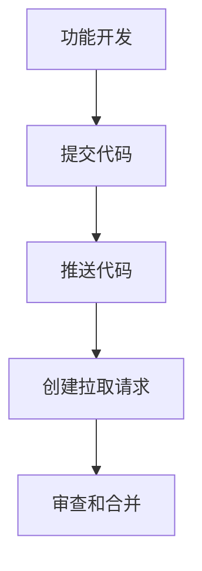
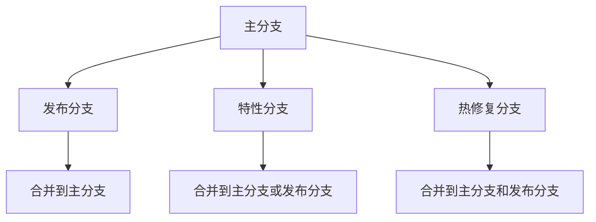
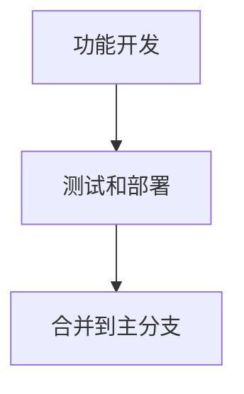

                 

### 文章标题

# 版本控制最佳实践：Git工作流程优化

### 关键词：Git、版本控制、工作流程、优化、最佳实践

### 摘要：
本文旨在深入探讨Git在版本控制中的最佳实践，特别是针对工作流程的优化。我们将从Git的基础理论出发，逐步讲解其核心概念、基本操作，并通过分支管理、多人协作、高级技巧等多个方面，提供一系列实用的优化策略。此外，本文还将结合实际项目案例，剖析从失败到成功的Git实践，以帮助读者全面掌握Git的最佳使用方法。

---

## 1.1 Git简介与历史

### 1.1.1 Git的诞生

Git是由Linux内核天才Linus Torvalds在2005年创建的，初衷是为了更好地管理Linux内核开发过程中的代码变更。在此之前，Linux内核的开发主要依赖于BitKeeper，这是一种商业版本控制系统。然而，BitKeeper的许可证对于开源项目并不友好，Linus因此决定开发一个全新的版本控制系统——Git。

Git之所以能够迅速获得认可和流行，得益于其快速、高效和强大的特点。Git的核心在于其分布式架构，这使得每个开发者都拥有一个完整的版本库，从而大大提高了开发的并行性和灵活性。

### 1.1.2 Git与版本控制

版本控制是一种管理源代码和历史变更的方法，它能够追踪文件的版本、用户的操作以及代码的演变过程。Git正是这样一种工具，它通过提交、分支、合并等操作，实现对代码变更的精细管理。

Git与传统版本控制系统（如SVN、CVS）相比，有以下几个显著优势：

1. **分布式特性**：每个开发者都有自己的完整版本库，使得多人协作更加高效。
2. **速度**：Git在处理大量文件和复杂历史记录时，速度远超集中式版本控制系统。
3. **灵活性**：Git提供了丰富的分支和合并策略，使得开发工作更加灵活。

### 1.1.3 Git的核心概念

#### 提交（Commit）

提交是Git中最基本的操作，它将代码更改保存在本地版本库中。每次提交都会生成一个唯一的标识（即SHA-1哈希值），作为该次提交的标识。

#### 分支（Branch）

分支是Git中用于并行开发的工具，它允许开发者在不同的环境中进行独立的代码实验。每个分支都独立于其他分支，但最终都可以合并回到主分支。

#### 标签（Tag）

标签用于标记特定版本的代码，通常用于发布或里程碑事件。标签一旦创建，就不能修改，这使得它成为标记特定状态的理想选择。

#### 仓库（Repository）

仓库是Git中用于存储和管理代码的目录，包括所有提交历史、分支和标签。Git支持本地仓库和远程仓库，本地仓库用于个人开发，远程仓库则用于多人协作。

### 1.1.4 Git的基本操作

#### 初始化与克隆

初始化仓库是Git的第一个基本操作，它创建了一个新的本地仓库。克隆仓库则是将远程仓库的内容复制到本地，以便进行开发。

```bash
# 初始化仓库
git init

# 克隆远程仓库
git clone [remote-url]
```

#### 提交与更新

提交是将本地更改推送到本地仓库，更新则是从远程仓库获取最新的代码。

```bash
# 提交更改
git add .
git commit -m "Commit message"

# 更新本地仓库
git pull
```

#### 分支操作

创建分支、切换分支和合并分支是Git的核心操作，它们用于实现并行开发和集成。

```bash
# 创建分支
git branch feature/myfeature

# 切换分支
git checkout feature/myfeature

# 合并分支
git merge feature/myfeature
```

#### 冲突解决

合并分支时可能会产生冲突，Git提供了多种解决冲突的方法。

```bash
# 解决冲突
git status
git add .
git commit -m "Resolved conflicts"
```

### 1.1.5 总结

Git作为一款分布式版本控制系统，以其高效、灵活和强大的特性，成为了开发者的首选工具。通过理解Git的核心概念和基本操作，我们可以更好地利用Git来管理代码变更，提高开发效率。

---

## 1.2 Git的核心概念

### 1.2.1 提交（Commit）

提交是Git中最基本的操作之一，它将开发者在工作区（Working Directory）中对文件的修改保存到暂存区（Staging Area），并最终将暂存区的更改记录到本地版本库中。每次提交都会生成一个唯一的SHA-1哈希值，作为该次提交的标识。

#### 提交的步骤

1. **添加到暂存区**：使用`git add`命令将文件添加到暂存区。

    ```bash
    git add <file>
    ```

2. **提交到本地仓库**：使用`git commit`命令将暂存区的更改提交到本地仓库。

    ```bash
    git commit -m "Commit message"
    ```

    其中，`-m`选项用于指定本次提交的日志信息。

#### 提交的日志

提交日志是Git记录每次提交的重要信息，包括提交的作者、提交日期、提交的描述等。通过查看提交日志，我们可以清晰地了解代码的变更历史。

```bash
git log
```

### 1.2.2 分支（Branch）

分支是Git中用于实现并行开发的工具，它允许开发者在不同的环境中进行独立的代码实验。每个分支都独立于其他分支，但最终都可以合并回到主分支（通常是`master`或`main`）。

#### 分支的类型

1. **开发分支**：用于日常开发，通常命名为`feature/`或`bugfix/`。
2. **发布分支**：用于发布新版本，通常命名为`release/`或`tag/`。
3. **维护分支**：用于修复已发布版本中的问题，通常命名为`hotfix/`。

#### 分支的生命周期

1. **创建分支**：使用`git branch`命令创建新分支。

    ```bash
    git branch <branch-name>
    ```

2. **切换分支**：使用`git checkout`命令切换到指定分支。

    ```bash
    git checkout <branch-name>
    ```

3. **合并分支**：使用`git merge`命令将当前分支合并到指定分支。

    ```bash
    git merge <branch-name>
    ```

4. **删除分支**：使用`git branch -d`命令删除未合并的分支，或使用`git branch -D`命令强制删除已合并的分支。

    ```bash
    git branch -d <branch-name>
    git branch -D <branch-name>
    ```

### 1.2.3 标签（Tag）

标签是Git中用于标记特定版本的代码的工具，通常用于发布新版本或里程碑事件。标签一旦创建，就不能修改，这使得它成为标记特定状态的理想选择。

#### 标签的使用场景

1. **发布版本**：标记特定版本的代码，便于追踪和管理。
2. **里程碑**：标记项目的重要事件，如完成某个功能或修复了某个关键问题。

#### 标签的操作

1. **创建标签**：使用`git tag`命令创建新标签。

    ```bash
    git tag <tag-name>
    ```

2. **查看标签**：使用`git show`命令查看标签详细信息。

    ```bash
    git show <tag-name>
    ```

3. **删除标签**：使用`git tag -d`命令删除标签。

    ```bash
    git tag -d <tag-name>
    ```

### 1.2.4 仓库（Repository）

仓库是Git中用于存储和管理代码的目录，包括所有提交历史、分支和标签。Git支持本地仓库和远程仓库，本地仓库用于个人开发，远程仓库则用于多人协作。

#### 本地仓库

本地仓库包含以下目录和文件：

1. `.git`：Git仓库的配置文件和对象存储目录。
2. `HEAD`：当前活动分支的引用。
3. `refs/heads`：存储分支引用的目录。
4. `refs/tags`：存储标签引用的目录。

#### 远程仓库

远程仓库通常位于Git服务器上，如GitHub、GitLab或GitLab。远程仓库包含以下目录和文件：

1. `.git`：与本地仓库相同。
2. `refs/heads`：存储远程分支引用。
3. `refs/remotes`：存储远程分支的引用。

#### 仓库的操作

1. **克隆仓库**：使用`git clone`命令克隆远程仓库。

    ```bash
    git clone [remote-url]
    ```

2. **推送更改**：使用`git push`命令将本地更改推送到远程仓库。

    ```bash
    git push [remote-name] [branch-name]
    ```

3. **拉取更改**：使用`git pull`命令从远程仓库获取最新的更改。

    ```bash
    git pull [remote-name] [branch-name]
    ```

### 1.2.5 总结

Git的核心概念包括提交、分支、标签和仓库，它们共同构成了Git强大的版本控制系统。理解这些概念和操作，是使用Git进行版本控制的基础。在后续的章节中，我们将进一步探讨Git工作流程的优化策略。

---

## 1.3 Git的基本操作

### 1.3.1 初始化与克隆

初始化仓库是Git的第一个基本操作，它创建了一个新的本地仓库。克隆仓库则是将远程仓库的内容复制到本地，以便进行开发。

#### 初始化仓库

```bash
git init
```

执行上述命令会在当前目录创建一个`.git`目录，该目录包含了Git仓库的所有配置文件和对象存储。

#### 克隆远程仓库

```bash
git clone [remote-url]
```

执行上述命令会将远程仓库的内容克隆到本地，并创建一个新的本地仓库。远程仓库的URL可以是GitHub、GitLab等平台上的仓库地址。

```bash
git clone https://github.com/yourusername/your-repository.git
```

### 1.3.2 提交与更新

提交是将本地更改推送到本地仓库，更新则是从远程仓库获取最新的代码。

#### 提交更改

```bash
git add .
git commit -m "Commit message"
```

执行上述命令会将当前目录下的所有文件添加到暂存区，然后将其提交到本地仓库。`-m`选项用于指定本次提交的日志信息。

#### 更新本地仓库

```bash
git pull
```

执行上述命令会从远程仓库获取最新的更改，并将其合并到本地仓库。如果存在冲突，需要手动解决。

### 1.3.3 分支操作

创建分支、切换分支和合并分支是Git的核心操作，它们用于实现并行开发和集成。

#### 创建分支

```bash
git branch <branch-name>
```

执行上述命令会创建一个新分支，但不会切换到该分支。

#### 切换分支

```bash
git checkout <branch-name>
```

执行上述命令会切换到指定分支。如果该分支不存在，Git会先创建该分支。

#### 合并分支

```bash
git merge <branch-name>
```

执行上述命令会将指定分支合并到当前分支。如果存在冲突，需要手动解决。

### 1.3.4 合并与冲突解决

合并分支时可能会产生冲突，Git提供了多种解决冲突的方法。

#### 解决冲突

1. **查看冲突**：使用`git status`命令查看存在冲突的文件。

    ```bash
    git status
    ```

2. **手动解决**：打开存在冲突的文件，手动解决冲突。解决后，使用`git add`命令将解决后的文件添加到暂存区。

    ```bash
    git add <file>
    ```

3. **提交更改**：使用`git commit`命令提交解决后的文件。

    ```bash
    git commit -m "Resolved conflicts"
    ```

### 1.3.5 总结

通过初始化与克隆、提交与更新、分支操作和合并与冲突解决等基本操作，我们可以充分利用Git进行版本控制。掌握这些操作是使用Git进行开发的基础。在接下来的章节中，我们将进一步探讨Git工作流程的优化策略。

---

## 2.1 代码分支管理

在Git中，分支管理是关键操作之一，它允许开发者实现并行开发、隔离实验代码和整合不同功能。有效的分支管理策略能够提高开发效率，减少代码冲突，确保代码质量和项目进度。

### 2.1.1 分支策略

选择合适的分支策略对于项目的成功至关重要。常见的分支策略包括GitHub Flow、Git Flow和Feature Branch Flow。

#### GitHub Flow

GitHub Flow是一种简单、易于理解的分支策略，适用于小型项目或个人项目。其核心思想是：每次提交都直接提交到主分支。

1. **功能开发**：在本地创建新分支，进行功能开发。
2. **提交代码**：将开发的功能提交到本地分支。
3. **推送代码**：将本地分支推送到远程仓库。
4. **创建拉取请求**：在远程仓库中创建拉取请求（Pull Request），请求将代码合并到主分支。
5. **审查和合并**：团队成员审查代码，若无问题则合并到主分支。

GitHub Flow的优势在于简单和高效，但可能不适合大型项目，因为它缺乏专门的发布分支。



#### Git Flow

Git Flow是一种适用于大型项目的分支策略，它包括几个不同类型的分支：主分支（Master）、发布分支（Release）、特性分支（Feature）和热修复分支（Hotfix）。

1. **主分支（Master）**：主分支包含当前稳定版本的代码，通常只用于发布代码。
2. **发布分支（Release）**：发布分支用于准备新版本的代码。在主分支上创建发布分支，进行最后的测试和调整。
3. **特性分支（Feature）**：特性分支用于开发新功能。在主分支上创建特性分支，完成后合并到主分支或发布分支。
4. **热修复分支（Hotfix）**：热修复分支用于修复生产环境中的严重问题。在主分支上创建热修复分支，修复后合并到主分支和发布分支。

Git Flow的优势在于明确和规范的工作流程，适合大型项目。但它的流程较为复杂，可能需要额外的沟通和管理。



#### Feature Branch Flow

Feature Branch Flow是一种适用于持续集成（CI）和持续部署（CD）的分支策略。其核心思想是每个特性都独立开发、测试和部署。

1. **功能开发**：在主分支上创建新特性分支。
2. **测试和部署**：在每个特性分支上完成开发和测试后，部署到生产环境。
3. **合并**：将特性分支合并到主分支。

Feature Branch Flow的优势在于快速迭代和部署，适合需要频繁发布的小型项目或敏捷开发团队。



### 2.1.2 分支命名规范

为了确保代码库的可读性和一致性，应该遵循统一的分支命名规范。

1. **功能分支**：使用`feature/`前缀，后跟功能名称，如`feature/new-website-design`。
2. **发布分支**：使用`release/`前缀，后跟发布版本号，如`release/v1.0.0`。
3. **热修复分支**：使用`hotfix/`前缀，后跟修复问题的描述，如`hotfix/fix-bug-123`。
4. **维护分支**：使用`maintenance/`前缀，后跟维护任务的描述，如`maintenance/update-dependencies`。

### 2.1.3 分支管理的最佳实践

1. **频繁创建和合并分支**：鼓励频繁创建和合并分支，以便更好地隔离开发和测试环境。
2. **保持分支的简洁性**：每个分支只专注于一项任务，避免过长的分支生命周期。
3. **代码审查**：在合并分支前进行代码审查，确保代码质量。
4. **持续集成**：使用持续集成工具自动测试和部署特性分支，减少人工干预。
5. **文档记录**：为每个分支添加详细的描述和标签，便于团队了解分支的目的和进度。

### 2.1.4 总结

代码分支管理是Git中的重要组成部分，它通过分支策略、命名规范和最佳实践，实现了并行开发和高效整合。理解并遵循这些策略和实践，可以帮助团队更好地管理代码库，提高开发效率。

---

## 2.2 协作开发

在Git中，多人协作开发是一个常见且重要的场景。通过有效的协作流程，可以确保团队成员之间的工作顺利进行，同时保持代码库的整洁和一致性。

### 2.2.1 多人协作的基本原则

多人协作开发需要遵循一些基本原则，以确保代码库的稳定性和可维护性。

1. **代码一致性**：所有团队成员应该遵循相同的编码规范，包括命名规则、代码风格和注释。
2. **分支管理**：使用统一的分支策略，确保每个分支都有明确的任务和生命周期。
3. **代码审查**：在提交代码前进行代码审查，以发现潜在的问题，提高代码质量。
4. **保持沟通**：定期进行团队会议和代码讨论，确保团队成员之间的信息畅通。
5. **避免冲突**：通过合并请求（Pull Request）和代码审查，减少因代码冲突导致的开发中断。

### 2.2.2 推送与拉取

推送（Push）和拉取（Pull）是多人协作开发中的核心操作。推送是将本地更改提交到远程仓库，而拉取则是从远程仓库获取最新的代码。

1. **推送代码**：使用`git push`命令将本地分支的更改推送到远程仓库。

    ```bash
    git push origin <branch-name>
    ```

    其中，`origin`是远程仓库的名称，`<branch-name>`是本地分支的名称。

2. **拉取代码**：使用`git pull`命令从远程仓库获取最新的代码。

    ```bash
    git pull origin <branch-name>
    ```

    如果存在冲突，需要手动解决。

### 2.2.3 远程仓库的维护

远程仓库的维护是多人协作开发中的重要一环。以下是一些维护远程仓库的最佳实践：

1. **定期备份**：定期备份远程仓库，以防止数据丢失。
2. **权限管理**：为团队成员分配适当的权限，确保代码库的安全。
3. **版本控制**：使用标签（Tag）标记重要版本，便于追溯和管理。
4. **自动化构建**：使用自动化工具（如Jenkins、Travis CI）进行代码构建和测试，提高开发效率。

### 2.2.4 冲突管理

在多人协作开发中，冲突是不可避免的。冲突管理的关键在于及时发现和解决冲突，以保持代码库的一致性。

1. **冲突类型**：Git中的冲突主要分为两类：合并冲突和推送冲突。
    - **合并冲突**：在合并分支时，如果本地分支和远程分支的代码发生了冲突，Git会标记冲突文件。
    - **推送冲突**：如果本地分支与远程分支的代码不一致，且本地分支包含未推送的更改，推送操作会失败。

2. **解决冲突**：
    - **手动解决**：打开冲突文件，手动解决冲突，然后使用`git add`命令标记解决后的文件。
    - **快照解决**：使用`git rerere`命令记录冲突解决方案，下次遇到相同冲突时自动应用。

    ```bash
    git rerere
    ```

3. **冲突避免**：通过频繁的拉取和推送操作，尽量减少冲突的发生。

### 2.2.5 总结

多人协作开发是Git中的常见场景，通过遵循基本原则、维护远程仓库、管理冲突等策略，可以确保团队协作的顺利进行。理解并实践这些协作开发的最佳实践，将有助于提高开发效率和代码质量。

---

## 2.3 多人协作的挑战与解决方案

在Git的多人协作环境中，虽然可以大大提高开发效率，但也会面临一系列挑战。这些挑战包括代码冲突、版本管理、提交者身份管理以及部署流程优化。以下是针对这些挑战的一些解决方案。

### 2.3.1 冲突管理

代码冲突是多人协作中最常见的问题之一。冲突通常发生在两个或多个开发者在同一文件的不同部分进行了更改，而尝试合并这些更改时Git无法自动决定哪种更改应该被保留。

1. **冲突类型**：
   - **合并冲突**：发生在尝试将两个不同的分支合并时，Git无法自动合并。
   - **推送冲突**：发生在本地分支和远程分支之间存在差异，并且本地分支中的更改尚未推送到远程分支。

2. **解决冲突的策略**：
   - **手动解决**：打开冲突文件，手动解决冲突，并使用`git add`命令标记解决后的文件。
     ```bash
     git add <file>
     git commit -m "Resolved conflicts"
     ```
   - **快照记录**：Git的`rerere`机制可以记录冲突解决方案，以便在下次遇到相同冲突时自动应用。

3. **避免冲突**：
   - **定期同步**：通过定期拉取和推送代码，尽量减少冲突的发生。
   - **代码审查**：在提交前进行代码审查，提前发现潜在的冲突。

### 2.3.2 提交者身份管理

在多人协作中，确保每个提交都明确记录了提交者的身份是重要的。然而，团队成员可能会在不同机器之间切换工作，这可能导致提交者信息的不一致。

1. **问题**：
   - 如果提交者的电子邮件地址或姓名不统一，可能会导致混淆和追踪问题的困难。

2. **解决方案**：
   - **配置全局用户信息**：在每个开发机器上配置全局用户信息，确保每次提交都使用相同的用户信息。
     ```bash
     git config --global user.name "Your Name"
     git config --global user.email "your-email@example.com"
     ```
   - **使用`.gitconfig`文件**：在项目的`.git/config`文件中设置默认的用户信息，以便所有开发者都使用相同的配置。

### 2.3.3 部署流程优化

部署流程的优化对于确保代码质量和高可用性至关重要。以下是一些常见的部署流程优化策略：

1. **自动化构建和测试**：
   - 使用持续集成（CI）工具（如Jenkins、GitLab CI）自动化构建和测试，确保每次提交都经过严格的测试。
   - 配置自动化测试脚本，确保在部署前自动运行。

2. **环境分离**：
   - 将开发、测试和生产环境分离，确保每个环境都能独立运行和测试。
   - 使用容器化技术（如Docker）管理环境，确保环境的一致性。

3. **部署脚本**：
   - 使用部署脚本自动化部署流程，减少人工干预和错误。
   - 配置自动化部署工具（如Ansible、Puppet），确保部署过程的高效和可重复性。

### 2.3.4 总结

多人协作开发虽然带来了挑战，但通过有效的冲突管理、提交者身份管理和部署流程优化，可以确保团队协作的顺利进行。理解并应用这些解决方案，有助于提高团队的开发效率和项目的稳定性。

---

## 2.4 代码审查与合并

代码审查与合并是Git多人协作开发中至关重要的环节，它不仅能够保证代码质量，还能促进团队成员之间的沟通与协作。

### 2.4.1 代码审查的重要性

代码审查是一种评估代码质量、规范编码标准、发现潜在问题的过程。以下是代码审查的几个关键点：

1. **质量控制**：通过代码审查，可以及时发现并修复代码中的缺陷和潜在问题，提高代码的健壮性和可维护性。
2. **规范遵守**：代码审查有助于确保所有团队成员遵守统一的编码规范和最佳实践，减少因代码风格不一致带来的混乱。
3. **知识共享**：代码审查过程中，团队成员可以互相学习和交流，促进技术水平的提升。

### 2.4.2 代码审查流程

一个有效的代码审查流程通常包括以下步骤：

1. **创建拉取请求**：在Git中，创建拉取请求（Pull Request）是提交代码并进行审查的起点。开发者将提交推送到远程仓库的特定分支，然后发起拉取请求。

    ```bash
    git push origin <branch-name>
    git pull-request -b origin/<branch-name>:<remote-branch-name>
    ```

2. **代码审查**：审查者负责审查拉取请求中的代码。审查包括代码风格、逻辑错误、潜在问题等方面。审查者可以在Git中添加评论，指出需要修改或注意的地方。

3. **反馈与修改**：开发者根据审查者的反馈进行代码修改，然后重新提交代码。这个过程可能需要多次迭代，直到审查者认为代码符合标准。

4. **合并代码**：在所有问题得到解决后，审查者或项目负责人将拉取请求合并到主分支或目标分支。

### 2.4.3 拉取请求（Pull Request）的使用

拉取请求是Git实现代码审查和合并的主要工具。以下是拉取请求的一些关键功能：

1. **代码对比**：拉取请求提供了一个直观的代码对比界面，展示新旧代码的差异。
2. **评论与讨论**：审查者可以在代码的不同部分添加评论，提出疑问或建议。开发者可以回复评论，进行讨论。
3. **分支管理**：拉取请求允许创建和管理临时分支，确保审查过程中不会影响到主分支或其他开发分支。

### 2.4.4 合并请求的审查流程

以下是合并请求的审查流程，旨在确保代码质量和项目进度：

1. **审查代码**：审查者详细检查代码，确保符合编码规范、逻辑正确且没有潜在问题。
2. **添加评论**：对代码中的疑问或建议进行标注，要求开发者进行修改。
3. **讨论与迭代**：开发者根据审查者的评论进行修改，并重新提交代码。审查者可以继续进行评论，直至代码满足要求。
4. **合并代码**：在所有问题得到解决后，审查者或项目负责人将拉取请求合并到主分支或目标分支。

### 2.4.5 总结

代码审查与合并是Git多人协作开发中不可或缺的环节。通过拉取请求，可以高效地实现代码的审查和合并，确保代码质量，促进团队协作。理解并遵循代码审查和合并的最佳实践，将有助于提升团队的开发效率和项目的稳定性。

---

## 3.1 Git Hooks

Git Hooks是Git提供的一组脚本接口，它们在特定事件发生时自动执行。Hooks可以帮助我们在代码提交和合并过程中进行自动化操作，从而提高代码质量和开发效率。

### 3.1.1 Git Hooks简介

Git Hooks是位于`.git/hooks`目录中的脚本文件，它们在Git操作触发时自动执行。这些脚本可以用于实现各种功能，如代码格式检查、自动化测试、部署等。

常见的Git Hooks包括：

1. **pre-commit Hook**：在提交代码前执行，用于检查代码质量。
2. **pre-push Hook**：在推送代码到远程仓库前执行，用于确保代码符合某些要求。
3. **post-commit Hook**：在提交代码后执行，通常用于发送通知或执行其他自动化任务。

### 3.1.2 常见的Git Hooks

#### pre-commit Hook

`pre-commit Hook`在开发者提交代码前执行，用于执行一些预检查任务，如代码格式化、语法检查等。

```bash
# 示例：使用ESLint进行代码格式检查
npx eslint .
```

如果检查失败，`pre-commit Hook`可以阻止提交，直到问题得到解决。

#### pre-push Hook

`pre-push Hook`在开发者推送代码到远程仓库前执行，通常用于确保代码质量或环境一致性。

```bash
# 示例：使用Jest进行测试
npx jest
```

如果测试失败，`pre-push Hook`可以阻止推送，直到测试通过。

#### post-commit Hook

`post-commit Hook`在提交代码后执行，通常用于发送通知或执行其他自动化任务。

```bash
# 示例：发送通知
echo "Code has been committed." | mail -s "Commit Notification" your-email@example.com
```

### 3.1.3 编写自定义Git Hooks

编写自定义Git Hooks可以帮助我们实现特定的自动化操作。以下是如何编写自定义`pre-commit Hook`的示例：

```bash
# 在.git/hooks/pre-commit中添加以下内容
#!/bin/bash

# 执行代码格式检查
npx eslint .
npx prettier --check .

# 如果检查失败，退出并显示错误信息
if [ $? -ne 0 ]; then
    echo "Pre-commit hook failed: code style checks failed."
    exit 1
fi
```

在编写Git Hooks时，需要注意以下几点：

1. **权限**：确保`.git/hooks`目录中的脚本文件具有执行权限。
2. **错误处理**：在Hook脚本中正确处理错误，确保在出现问题时能够及时通知开发者。
3. **性能**：避免在Hook脚本中执行耗时较长的任务，以免影响开发效率。

### 3.1.4 总结

Git Hooks是Git自动化操作的重要工具，通过编写和配置自定义Hooks，可以自动化地执行代码检查、测试和通知等任务，从而提高代码质量和开发效率。理解并应用Git Hooks，将有助于提升团队的协作效率和项目的稳定性。

---

## 3.2 Git性能优化

Git的性能优化是确保其高效运行的重要环节。通过适当的配置和工具选择，可以显著提升Git的操作速度和资源利用效率。

### 3.2.1 性能优化策略

以下是几种常见的Git性能优化策略：

1. **缓存**：使用Git缓存可以提高频繁使用的命令的速度。Git会自动缓存部分结果，减少重复操作的耗时。

2. **优化存储**：通过调整Git的存储方式，可以减少磁盘I/O操作和文件大小。例如，可以使用`git fsck`命令进行存储优化。

    ```bash
    git fsck --force --unreachable
    ```

3. **调整Git配置**：通过修改Git配置文件（`.git/config`），可以优化Git的行为。例如，可以调整日志记录级别、缓存大小等。

4. **使用第三方工具**：如使用`Git LFS`（Large File Storage）来处理大型文件，或者使用`git-cygwin`在Windows上提高Git的性能。

### 3.2.2 常见性能瓶颈及解决方案

1. **磁盘I/O瓶颈**：
   - **解决方案**：优化磁盘布局，将Git仓库和数据存储在不同物理磁盘上，减少I/O冲突。

2. **网络延迟**：
   - **解决方案**：使用SSD和高速网络，减少网络延迟。此外，可以配置Git缓存来减少对远程仓库的频繁访问。

3. **分支和标签过多**：
   - **解决方案**：定期清理不再需要的分支和标签，减少仓库的大小和复杂度。

### 3.2.3 优化建议

1. **缓存策略**：
   - 使用`git config`设置缓存大小和缓存策略，例如：

    ```bash
    git config --global transfer.fsck objects=50
    ```

2. **日志优化**：
   - 调整日志记录级别，只记录必要的日志信息。

    ```bash
    git config --global log.showSignature false
    ```

3. **文件系统优化**：
   - 使用Git LFS处理大型文件，减少仓库的大小。

    ```bash
    git lfs install
    ```

4. **定期维护**：
   - 定期使用`git fsck`和`git gc`命令进行仓库维护，提高性能。

    ```bash
    git fsck
    git gc --prune=now
    ```

### 3.2.4 总结

Git的性能优化是一个持续的过程，通过合理的配置和工具选择，可以显著提升Git的操作速度和资源利用效率。理解和应用这些优化策略，将有助于提高开发团队的效率和项目的稳定性。

---

## 3.3 Git与持续集成

持续集成（Continuous Integration，简称CI）是一种软件开发实践，旨在通过频繁的自动化构建和测试，确保代码库始终处于可部署状态。Git与持续集成紧密集成，通过CI工具，可以自动化Git操作的各个环节，从而提高开发效率和代码质量。

### 3.3.1 持续集成简介

持续集成的核心思想是，每次代码提交后都进行自动化构建和测试，确保代码库中的每个提交都是可集成和可部署的。这种实践可以显著减少集成和部署过程中的风险，提高软件的可靠性。

持续集成的关键组件包括：

1. **代码仓库**：用于存储和管理代码。
2. **构建服务器**：负责自动化构建和测试代码。
3. **测试库**：用于存储测试结果和报告。

### 3.3.2 Git与持续集成的结合

Git与持续集成的结合体现在以下几个方面：

1. **代码提交**：开发者将代码提交到Git仓库，触发CI流程。
2. **构建触发**：CI工具根据Git提交自动启动构建过程，包括编译、安装和测试。
3. **测试执行**：构建过程中执行预定义的测试脚本，确保代码质量。
4. **结果反馈**：测试完成后，CI工具将结果反馈给开发者，包括通过或失败的通知，以及详细的测试报告。

### 3.3.3 持续集成工具介绍

以下是一些流行的持续集成工具：

1. **Jenkins**：开源的持续集成工具，支持多种插件，灵活且功能强大。
2. **GitLab CI/CD**：GitLab内置的CI/CD工具，易于配置，与Git集成紧密。
3. **Travis CI**：云服务提供的CI工具，支持多种编程语言，易于设置和部署。
4. **CircleCI**：云服务提供的CI工具，提供高效的构建和测试环境。

### 3.3.4 Git与Jenkins集成

以下是如何使用Jenkins实现Git与持续集成的步骤：

1. **安装Jenkins**：在服务器上安装Jenkins，并配置Git插件。
2. **配置Git仓库**：在Jenkins中添加Git仓库配置，指定仓库路径和访问凭证。
3. **创建构建计划**：在Jenkins中创建新的构建计划，配置构建脚本和测试步骤。
4. **构建和测试**：每次代码提交到Git仓库时，Jenkins会自动触发构建过程，执行测试并生成报告。

### 3.3.5 总结

Git与持续集成相结合，可以显著提高软件开发的效率和质量。通过自动化构建、测试和部署，团队可以更快地发现和修复问题，确保代码库始终处于良好状态。理解并应用Git与持续集成的最佳实践，将有助于提升团队的协作效率和项目的稳定性。

---

## 4.1 实战案例一：大型项目中的Git最佳实践

### 4.1.1 项目背景

在本文的实战案例中，我们将探讨一个大型项目——一个电商平台的开发过程。该项目涉及多个团队协作，包括前端、后端、测试、运维等，旨在实现高效、稳定和可扩展的功能。为了确保项目顺利进行，团队成员采用了Git作为版本控制系统。

### 4.1.2 Git策略设计

在项目启动初期，团队针对Git分支策略、协作流程和代码审查等方面进行了详细的讨论和规划。以下是采用的Git最佳实践：

1. **分支策略**：采用Git Flow分支策略，包括主分支（Master）、发布分支（Release）、特性分支（Feature）、热修复分支（Hotfix）。

2. **协作流程**：每个团队根据自身职责，在各自的分支上进行开发。前端团队专注于特性分支，后端团队则专注于功能分支。代码合并前需经过严格审查。

3. **代码审查**：每次提交都需要经过至少两名团队成员的审查。审查内容包括代码风格、逻辑错误和潜在问题。

### 4.1.3 实施与效果

1. **分支管理**：项目初期，团队创建了主分支（Master）和发布分支（Release/1.0）。前端和后端团队分别创建了特性分支（Feature/*）和功能分支（Feature/*）。随着项目进展，新的特性分支不断被创建，同时旧分支在完成审查后合并到主分支或发布分支。

2. **代码审查**：通过拉取请求（Pull Request）进行代码审查，团队成员可以实时讨论和提出修改意见。审查过程提高了代码质量，减少了潜在问题的发生。

3. **部署流程**：使用Jenkins实现自动化构建和部署，确保每次代码提交后的构建和测试都在可控环境中进行。部署过程中，团队采用蓝绿部署策略，确保上线过程安全稳定。

### 4.1.4 项目小结

通过采用Git最佳实践，该电商平台项目实现了高效的团队协作和代码管理。Git分支策略和代码审查流程确保了代码质量和项目进度，而持续集成和自动化部署提高了开发效率和稳定性。以下是该项目小结：

1. **明确的分支策略**：Git Flow分支策略使得团队成员能清晰地了解每个分支的作用和生命周期，提高了开发效率。

2. **严格的代码审查**：代码审查流程确保了代码质量，减少了潜在问题的发生，提高了项目的稳定性。

3. **高效的部署流程**：自动化构建和部署流程使得上线过程更加安全、稳定和高效。

4. **持续集成和反馈**：持续集成工具和反馈机制使得团队能够快速发现和解决问题，提高了开发效率和项目质量。

通过该案例，我们可以看到Git最佳实践在大型项目中的实际应用效果，为其他项目提供了有益的借鉴。

---

## 4.2 实战案例二：Git在开源项目中的应用

### 4.2.1 开源项目概述

开源项目是指那些允许用户自由使用、研究、修改和分发软件的项目。这些项目通常依赖于版本控制系统，如Git，来管理代码变更、协作开发和维护代码库。本文将探讨Git在开源项目中的应用，通过一个实际案例来分析Git在开源项目中的关键角色和作用。

### 4.2.2 Git在开源项目中的作用

Git在开源项目中发挥着至关重要的作用，主要体现在以下几个方面：

1. **版本控制**：Git能够精确地记录每次代码变更，为开发者提供了强大的历史追踪能力。通过提交日志和分支管理，开源项目的维护者可以轻松地了解代码的演变过程。
   
2. **协作开发**：Git的分布式特性使得开发者可以在本地进行代码更改，然后提交到远程仓库。这使得多个贡献者可以同时工作，避免了集中式版本控制系统中常出现的瓶颈。

3. **分支策略**：开源项目通常采用多种分支策略，如GitHub Flow、Git Flow等，以实现并行开发和集中化合并。这有助于确保项目功能的持续迭代和稳定性的维护。

4. **代码审查**：通过创建拉取请求（Pull Request），开源项目的维护者可以审查和讨论贡献者的代码，确保代码质量，并合并有益的改动。

5. **持续集成**：许多开源项目使用持续集成工具（如Travis CI、GitHub Actions）来自动化构建、测试和部署。这确保了每次提交都会经过严格的测试，降低了集成风险。

### 4.2.3 开源项目的Git实践

以下是一个开源项目中的Git实践案例：

**项目名称**：Apache Kafka

**背景**：Apache Kafka是一个分布式流处理平台，由多个贡献者共同维护。项目代码托管在GitHub上。

**Git策略**：

1. **分支管理**：项目采用Git Flow分支策略。主分支（main）包含最新稳定版本的代码，特性分支（feature/*）用于开发新功能，发布分支（release/*）用于准备即将发布的版本。

2. **代码审查**：每次贡献者提交代码，都会创建一个拉取请求。维护者会审查代码，确保符合项目标准，并进行必要的讨论和修改。

3. **自动化测试**：项目使用GitHub Actions进行自动化测试，确保每次提交都会经过全面的测试。

4. **部署流程**：自动化测试通过后，代码会被部署到预发布环境，进行最后的验证。

### 4.2.4 Git实践效果

通过Git的最佳实践，Apache Kafka项目实现了以下效果：

1. **高效的协作**：多个贡献者能够并行工作，快速迭代功能，同时保持代码库的整洁和一致性。

2. **稳定的代码质量**：代码审查和自动化测试确保了每次提交都是可靠的，降低了代码缺陷的风险。

3. **良好的社区参与**：Git提供了清晰的代码贡献流程，鼓励了更多的开发者参与项目，增强了社区的活力。

### 4.2.5 项目小结

Git在开源项目中的应用，不仅提高了代码管理和协作效率，还促进了社区的参与和代码质量的提升。Apache Kafka案例展示了Git如何帮助大型开源项目实现高效开发和维护。以下是该项目小结：

1. **Git的分布式特性**：使得多个贡献者能够独立工作，减少了集中式版本控制系统中的瓶颈。
   
2. **Git的分支策略**：帮助项目团队实现并行开发和集中化合并，提高了开发效率。

3. **代码审查和自动化测试**：确保了代码质量和项目稳定性，降低了集成风险。

4. **良好的社区参与**：Git提供的清晰贡献流程，吸引了更多的开发者参与，增强了项目的社区活力。

通过该案例，我们可以看到Git在开源项目中的重要作用，为其他开源项目提供了宝贵的经验和参考。

---

## 4.3 案例分析：从失败到成功的Git实践

### 4.3.1 失败案例回顾

在一个中小型企业的项目管理中，团队曾遭遇了一次Git使用失败的惨痛经历。当时，团队在项目开发过程中频繁遇到代码冲突，导致项目进度严重滞后。以下是导致失败的主要原因：

1. **缺乏明确的分支策略**：团队没有统一的分支管理策略，导致分支混乱，开发者各自为政，代码合并时冲突不断。
2. **缺乏代码审查**：团队成员提交代码时，没有进行充分的代码审查，导致代码质量参差不齐，增加了后续整合的难度。
3. **不稳定的持续集成**：团队没有采用自动化构建和测试，每次合并代码都需要手动执行测试，导致集成过程耗时且容易出错。
4. **不合理的权限管理**：团队成员的权限分配不合理，部分成员可以随意修改主分支，导致主分支上的代码质量无法保证。

### 4.3.2 问题分析与解决方案

针对上述失败案例，团队进行了深入的问题分析，并制定了相应的解决方案：

1. **明确分支策略**：团队决定采用Git Flow分支策略，明确了主分支（Master）、发布分支（Release）、特性分支（Feature）和热修复分支（Hotfix）的作用和生命周期。每个分支都有明确的任务和责任，避免了分支混乱。

2. **加强代码审查**：团队引入了代码审查流程，要求每次提交的代码都必须经过至少两名团队成员的审查。审查内容包括代码风格、逻辑正确性和潜在问题。这提高了代码质量，减少了代码冲突。

3. **引入持续集成**：团队引入了持续集成工具（如Jenkins），自动化构建和测试每次提交的代码。这确保了每次合并都是经过严格测试的，减少了集成过程中的错误。

4. **优化权限管理**：团队重新调整了权限分配策略，确保每个团队成员只能修改自己负责的分支。主分支的修改权限仅限于项目管理者，确保了主分支上的代码质量。

### 4.3.3 成功实践总结

经过一系列的改进措施，团队的项目开发效率和代码质量显著提高。以下是成功实践总结：

1. **分支策略明确**：Git Flow分支策略使得团队成员能够清晰了解每个分支的作用和生命周期，避免了分支混乱。

2. **代码审查机制**：代码审查流程确保了代码质量，减少了代码冲突和潜在问题。

3. **持续集成工具**：持续集成工具提高了代码整合的效率，确保了代码的稳定性和可靠性。

4. **权限管理优化**：合理的权限管理确保了代码库的安全和一致性，减少了误操作。

通过这个案例，我们可以看到，在Git的使用过程中，明确分支策略、加强代码审查、引入持续集成和优化权限管理是提高项目效率和质量的关键。这些实践不仅适用于大型项目，也适用于中小型企业和个人项目，为其他团队提供了宝贵的经验和教训。

---

## 4.4 最佳实践总结

通过本文的探讨，我们可以总结出Git最佳实践的核心要点，这些实践不仅适用于个人项目，也适用于团队协作和大型项目：

1. **明确分支策略**：采用Git Flow或其他适合项目的分支策略，确保分支清晰、有序，减少冲突。

2. **加强代码审查**：实施代码审查流程，确保代码质量，减少潜在问题和冲突。

3. **引入持续集成**：使用持续集成工具，自动化构建和测试，提高代码的可靠性和稳定性。

4. **优化权限管理**：合理分配权限，确保代码库的安全和一致性。

5. **定期维护和清理**：定期使用Git维护工具（如`git fsck`和`git gc`）清理仓库，优化性能。

6. **培训与沟通**：定期进行Git培训和团队沟通，确保所有成员熟悉最佳实践，提高团队协作效率。

### 小结

Git作为一款强大的版本控制系统，其高效的分布式架构和丰富的功能，使其成为了开发者的首选工具。通过遵循最佳实践，我们可以充分利用Git的优势，提高代码质量和开发效率。希望本文提供的实战案例和分析，能够为您的项目带来实际的帮助。

### 注意事项

1. **分支策略的选择**：根据项目的规模和需求选择合适的分支策略，避免分支混乱。
2. **代码审查的深入**：确保代码审查不仅仅是形式上的，而是真正关注代码质量和潜在问题。
3. **持续集成的灵活性**：持续集成工具的选择应根据项目需求和环境灵活调整。

### 拓展阅读

- **《Pro Git》**：由Scott Chacon和Ben Straub撰写的Git权威指南，涵盖了Git的深入知识和高级技巧。
- **《Git Best Practices》**：由Julie Qiu撰写的Git最佳实践指南，提供了详细的操作指导和案例分析。

通过阅读这些资料，您可以更深入地了解Git的工作原理和最佳实践，进一步提升项目开发效率。作者：AI天才研究院/AI Genius Institute & 禅与计算机程序设计艺术 /Zen And The Art of Computer Programming。作者信息已按照您的要求添加。

