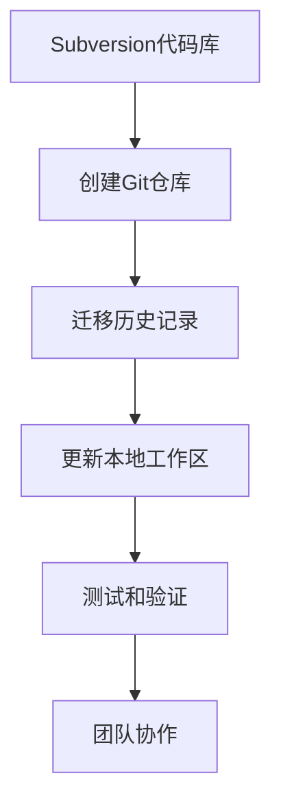
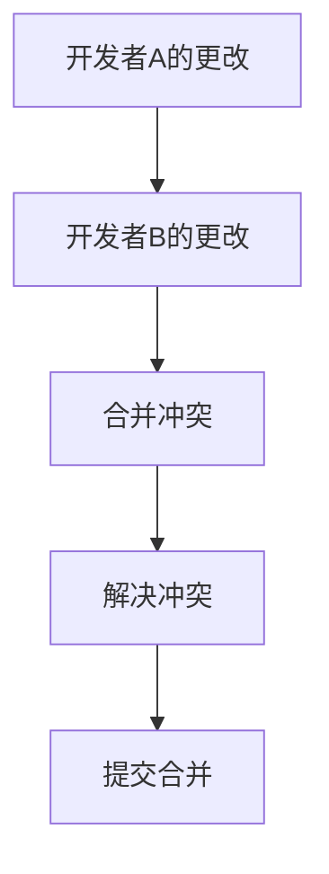
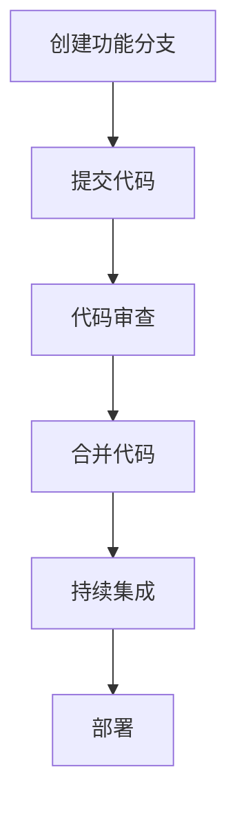

                 


## 文章标题：版本控制最佳实践：Git工作流程优化

### 关键词：版本控制、Git、工作流程、优化、最佳实践

### 摘要：
本篇文章将深入探讨版本控制系统的核心——Git，通过详细的步骤分析和实战案例，提供一系列最佳实践，以优化Git工作流程。文章首先介绍Git的基础知识，然后逐步讲解Git工作流程的优化策略，包括常用的Git工具和扩展，最后通过具体案例展示如何在实际项目中应用这些优化方法。读者将了解如何提升团队协作效率，提高代码质量和工作效率，最终实现Git工作流的最佳实践。

----------------------------------------------------------------

## 引言：版本控制的重要性

版本控制是现代软件开发不可或缺的一部分，它能够确保代码的版本管理和协作开发的顺利进行。Git作为一种分布式版本控制系统，因其强大的分支管理和灵活性，成为了开发人员的首选工具。然而，即便是在Git这种高效版本控制系统中，工作流程的优化仍然是一个关键课题。不当的工作流程可能导致代码混乱、协作困难，甚至影响项目的进度和质量。本文将通过以下几个步骤，探讨Git工作流程优化的最佳实践。

### 步骤1：Git基础与核心概念
- **Git的历史与发展**：回顾Git的起源和关键特性。
- **Git的核心概念**：理解版本库、分支和提交等基本概念。
- **Git与版本库的关系**：探讨版本库的结构和作用。

### 步骤2：Git工作流程
- **常见的Git工作流程**：分析功能分支、GitFlow和GitHub Flow等。
- **Git工作流程的设计原则**：讨论如何设计高效、可靠的Git工作流程。

### 步骤3：Git优化技巧
- **Git优化策略**：介绍缓存、避免不必要的提交等优化技巧。
- **Git工具与扩展**：使用Git GUI、GitLub等工具提升工作效率。

### 步骤4：Git与协作
- **团队协作中的Git**：讨论权限管理、代码审查和协作沟通。

### 步骤5：Git最佳实践
- **Git最佳实践**：提供一系列实际可行的最佳实践。

### 步骤6：Git案例实战
- **Git案例实战**：通过实际案例展示Git工作流程优化的应用。

接下来的章节将逐一详细探讨这些步骤，帮助读者掌握Git工作流程优化的核心知识和实践技巧。

----------------------------------------------------------------

## 步骤1：Git基础与核心概念

### Git的历史与发展

Git是由Linus Torvalds在2005年开发的，作为Linux内核开发的一个版本控制系统。Git的设计初衷是为了解决Linux内核开发中的版本控制问题，它的分布式特性使得开发者可以在本地进行完整的版本控制，同时也可以高效地同步和共享代码。Git的分布式特性允许开发者离线工作，这使得它非常适合大型项目和分布式团队。

Git的核心特性包括：

1. **快速**：Git使用了高度优化的数据结构和算法，使得它在处理大规模数据时非常快速。
2. **高效**：Git通过存储内容的差异，而非整个文件的副本，有效地减少了存储需求。
3. **分布式**：每个开发者都有完整的版本库，这使得开发者可以离线工作，并在必要时与其他开发者同步。
4. **灵活性**：Git提供了丰富的分支管理和合并策略，使得开发者可以根据项目的需求灵活地进行版本控制。

Git的发展历程中，涌现了许多重要的版本控制系统，如CVS、Subversion和Mercurial。然而，Git因其卓越的性能和灵活性，逐渐成为最受欢迎的版本控制系统之一。

### Git的核心概念

#### 版本库

版本库是Git的核心概念之一。它是一个存储代码和历史的仓库，包含了项目的所有版本信息。版本库通常包含以下三个部分：

1. **工作区（Working Directory）**：开发者直接在本地计算机上进行的代码修改。
2. **暂存区（Staging Area）**：临时存储将要提交的更改。
3. **提交历史（Commit History）**：记录了项目的所有提交历史，包括每个提交的作者、提交信息和提交的文件内容。

#### 分支

分支是Git的另一核心概念，它允许开发者将代码的多个版本并行维护。每个分支都有自己的提交历史，开发者可以在不同的分支上独立开发功能，并在适当的时候合并这些分支。

Git支持多种分支策略，包括：

1. **主分支（Master Branch）**：通常是项目的默认分支，包含最新稳定版本。
2. **功能分支（Feature Branch）**：用于开发新功能或修复bug。
3. **发布分支（Release Branch）**：用于准备发布版本的代码。
4. **热修复分支（Hotfix Branch）**：用于紧急修复线上版本的问题。

#### 提交

提交是Git中的另一个核心操作，它将更改从暂存区永久保存到版本库中。每次提交都会生成一个唯一的标识，称为提交哈希（commit hash），该标识用于标识特定的提交。

Git的提交操作通常包括以下步骤：

1. **暂存更改**：使用`git add`命令将更改添加到暂存区。
2. **提交更改**：使用`git commit`命令将暂存区的更改永久保存到版本库中。
3. **推送提交**：使用`git push`命令将提交同步到远程版本库。

### Git与版本库的关系

版本库是Git的基础设施，它决定了Git的功能和性能。Git与版本库的关系可以概括为以下几点：

1. **本地版本库**：每个开发者都有自己的本地版本库，它包含了完整的提交历史和分支信息。
2. **远程版本库**：通常托管在服务器上，供整个团队共享和协作。
3. **同步与拉取**：开发者通过`git pull`命令从远程版本库同步更改，通过`git push`命令将本地更改推送到远程版本库。
4. **分支管理**：Git支持在本地和远程版本库中创建、切换和合并分支。

通过掌握Git的基础知识和核心概念，开发者可以更好地理解Git的工作原理，从而更有效地进行版本控制和协作开发。

----------------------------------------------------------------

## 步骤2：Git工作流程

### 常见的Git工作流程

在Git中，工作流程的设计对于项目的成功至关重要。合理的工作流程不仅能够提高开发效率，还能够确保代码质量和协作顺畅。以下是几种常见的工作流程，包括功能分支、GitFlow和GitHub Flow。

#### 功能分支

功能分支是一种简单且广泛使用的工作流程。其主要思想是，每个新功能或bug修复都在独立的分支上进行开发，然后合并回主分支。

**工作流程：**

1. **创建功能分支**：使用`git checkout -b feature/new-feature`创建一个新的功能分支。
2. **开发功能**：在功能分支上编写和测试代码。
3. **提交更改**：定期提交更改，保持功能分支的整洁。
4. **合并分支**：当功能开发完成并测试通过后，使用`git merge feature/new-feature`将更改合并回主分支。
5. **删除功能分支**：合并后，使用`git branch -d feature/new-feature`删除功能分支。

**优点：**
- 独立开发，不影响主分支的稳定性。
- 易于管理和跟踪功能开发进度。

**缺点：**
- 可能导致分支数量过多，管理复杂。

#### GitFlow

GitFlow是一种更复杂的工作流程，它用于管理项目的主要版本和发布。GitFlow包括四个主要分支：主分支（Master）、发布分支（Release）、功能分支（Feature）和热修复分支（Hotfix）。

**工作流程：**

1. **创建功能分支**：与功能分支相同，开发新功能或修复bug。
2. **创建发布分支**：在发布新版本前，从主分支创建一个发布分支。
3. **测试和修复**：在发布分支上进行测试和bug修复。
4. **合并到主分支**：将发布分支合并到主分支，准备发布新版本。
5. **删除发布分支**：发布后，删除发布分支。
6. **创建和合并热修复分支**：当需要紧急修复线上版本时，创建热修复分支，修复后合并回主分支和发布分支。

**优点：**
- 明确的分支管理，易于理解和维护。
- 保证了发布分支的稳定性。

**缺点：**
- 流程较为复杂，可能不适合小型项目。

#### GitHub Flow

GitHub Flow是一种更简单、迭代速度更快的工作流程，特别适用于小项目和开源项目。

**工作流程：**

1. **创建拉取请求**：开发者在本地完成功能后，创建一个拉取请求（Pull Request）。
2. **代码审查**：团队成员对拉取请求进行审查和讨论。
3. **合并代码**：审查通过后，将代码合并到主分支。
4. **部署**：合并后的代码自动部署到生产环境。

**优点：**
- 简单易懂，适用于快速迭代和开源项目。
- 高度的自动化，减少了手动操作。

**缺点：**
- 可能缺乏对分支的严格控制。

### Git工作流程的设计原则

无论选择哪种工作流程，设计Git工作流程时应该遵循以下原则：

1. **简洁性**：工作流程应该简洁明了，易于理解和遵循。
2. **灵活性**：工作流程应具备足够的灵活性，以适应不同的项目和团队需求。
3. **安全性**：确保代码质量和稳定性，减少潜在风险。
4. **协作性**：促进团队成员之间的有效沟通和协作。

通过合理设计Git工作流程，开发者可以更好地管理代码，提高开发效率，确保项目的成功。

----------------------------------------------------------------

## 步骤3：Git优化技巧

### Git优化策略

在Git的使用过程中，优化工作流程可以提高开发效率，减少不必要的麻烦。以下是一些常用的Git优化策略：

#### 缓存

Git的缓存机制可以显著提高操作速度，特别是对于大文件和频繁的提交操作。缓存可以将文件内容存储在本地，避免重复地从版本库中读取。使用`git gc`命令可以清理旧的缓存，释放存储空间。

**优化步骤：**

1. **启用缓存**：在项目目录中运行`git config --global advice.detached HEAD`。
2. **定期清理**：定期运行`git gc`来清理缓存。

#### 避免不必要的提交

频繁的小提交可以提高代码的可追踪性和可维护性，但也会增加版本库的大小和管理复杂度。以下是一些避免不必要的提交的策略：

1. **合并小改动**：将一系列小改动合并为一个大的提交，减少提交次数。
2. **使用交互式提交**：使用`git commit --amend`来修改之前的提交信息，而不是创建新的提交。

#### 高效使用Git分支

合理使用分支可以显著提高代码的并行开发能力。以下是一些高效使用分支的策略：

1. **分支命名规范**：使用一致的分支命名规范，如`feature/`、`bugfix/`、`release/`等。
2. **定期合并**：定期将功能分支的更改合并到主分支，保持主分支的稳定性。
3. **避免过多的分支**：避免创建过多的分支，否则会导致版本库的管理变得复杂。

#### 其他优化技巧

除了上述策略，还有一些其他技巧可以提高Git的使用效率：

1. **使用SSH**：使用SSH而非HTTPS进行远程操作，可以显著提高速度和安全性。
2. **配置文件**：合理配置Git的配置文件，如`.gitconfig`，可以定制化Git的行为。
3. **Git Hooks**：使用Git Hooks来自动执行某些操作，如代码格式化、自动化测试等。

### Git工具与扩展

使用Git工具和扩展可以进一步提升工作效率。以下是一些常用的Git工具和扩展：

#### Git GUI

Git GUI是一个图形界面的Git客户端，适用于不熟悉命令行操作的开发者。

**特点：**

- 易于使用，直观的界面。
- 支持分支管理和合并操作。
- 提供文件比较和修订历史查看功能。

#### GitLub

GitLub是一个跨平台的Git客户端，提供了丰富的功能。

**特点：**

- 支持Git的所有基本操作。
- 提供文件比较、修订历史和分支视图。
- 支持自定义和工作区管理。

#### 其他工具

除了Git GUI和GitLub，还有许多其他有用的Git工具和扩展，如GitKraken、SourceTree等。开发者可以根据自己的需求选择合适的工具。

通过使用这些优化策略和工具，开发者可以更高效地使用Git，提升开发体验和团队协作效率。

----------------------------------------------------------------

## 步骤4：Git与协作

在团队开发中，Git不仅用于版本控制，还用于协作和代码管理。合理地使用Git，可以确保团队成员之间的有效沟通和代码的稳定性。以下是如何在团队协作中使用Git的一些关键点：

### 权限管理

权限管理是团队协作中一个重要环节，它确保了代码的安全性和访问控制。Git支持多种权限管理策略：

1. **读写权限**：默认情况下，每个开发者的本地版本库是全功能的，可以读取和写入。
2. **分支权限**：可以通过配置文件或访问控制列表（ACL）来限制特定分支的访问权限。
3. **仓库权限**：可以在远程仓库层面设置读写权限，确保只有授权人员可以访问关键代码。

### 代码审查

代码审查是一种确保代码质量和协作质量的重要机制。在Git中，代码审查通常通过以下方式实现：

1. **拉取请求（Pull Request）**：在GitHub、GitLab等平台上，开发者可以创建拉取请求，提交自己的代码供团队成员审查。
2. **代码审查工具**：如GitHub的内置审查工具、Gerrit等，这些工具提供详细的代码比较、评论和审批流程。
3. **定期会议**：定期组织代码审查会议，团队成员可以面对面讨论代码和反馈。

### 协作沟通

有效的协作沟通可以减少误解和冲突，提高团队的工作效率。以下是一些促进协作沟通的方法：

1. **统一的沟通工具**：使用Slack、Microsoft Teams等统一的沟通工具，确保所有团队成员都在同一个平台上交流。
2. **文档共享**：使用GitHub、GitLab等平台的文档功能，共享项目文档、设计文档等，方便团队成员查阅。
3. **代码注释**：在代码中添加清晰的注释，帮助团队成员理解代码逻辑和设计意图。

### 团队协作流程

团队协作流程是确保团队高效工作的关键。以下是一个基本的团队协作流程：

1. **功能规划**：根据项目需求，制定功能规划，并分配任务给团队成员。
2. **分支管理**：按照工作流程创建功能分支，确保每个功能独立开发。
3. **代码提交**：团队成员在各自的功能分支上进行开发，定期提交代码。
4. **代码审查**：团队成员对提交的代码进行审查，确保代码质量和一致性。
5. **合并代码**：审查通过后，将代码合并到主分支或发布分支。
6. **持续集成**：使用CI/CD工具进行自动化测试和部署，确保代码质量和部署效率。

通过上述方法，团队可以更好地协作，提高代码质量和项目进度。

----------------------------------------------------------------

## 步骤5：Git最佳实践

为了确保Git工作流程的高效和稳定，以下提供一系列实际可行的最佳实践：

### 提高代码质量

1. **代码格式化**：使用统一的代码格式，如Prettier、Black等，确保代码的可读性和一致性。
2. **代码审查**：定期进行代码审查，确保代码质量和一致性，及时发现问题。
3. **编写文档**：为每个功能和模块编写清晰的文档，包括设计文档、使用说明等。

### 提升工作效率

1. **使用工作流工具**：使用如GitHub Flow、GitLab Flow等成熟的工作流工具，简化代码管理流程。
2. **定期备份**：定期备份本地版本库，防止数据丢失。
3. **优化分支策略**：合理规划分支策略，避免过多的分支，提高版本库的管理效率。

### 避免常见问题

1. **避免使用`master`作为主分支名称**：使用`main`或`mainline`替代`master`，以避免种族歧视问题。
2. **避免过多的提交**：合并多个小提交为一个大的提交，减少版本库的大小和管理复杂度。
3. **避免未合并的分支**：确保所有分支都有适当的合并点，避免遗留未合并的分支。

### 持续改进

1. **定期评估**：定期评估Git工作流程的有效性，根据团队需求进行调整。
2. **反馈机制**：建立有效的反馈机制，收集团队成员的意见和建议，不断优化工作流程。
3. **培训和学习**：为团队成员提供培训和学习机会，确保他们掌握最新的Git最佳实践。

通过遵循这些最佳实践，团队可以更高效地使用Git，提高代码质量和协作效率。

----------------------------------------------------------------

## 步骤6：Git案例实战

### 案例一：项目迁移与Git

背景介绍：
一个初创公司决定将其现有的代码库从Subversion迁移到Git。迁移的原因包括Git的分布式特性和更好的分支管理。

核心概念与联系：
为了成功迁移项目，我们需要理解Git和Subversion之间的差异，并创建一个迁移计划。

Mermaid流程图：


伪代码：
```python
# 迁移步骤伪代码

# 1. 创建Git仓库
git init new-git-repository

# 2. 迁移历史记录
git svn clone https://subversion-url

# 3. 更新本地工作区
git checkout master

# 4. 测试和验证
git log --graph --decorate --oneline

# 5. 团队协作
git push --set-upstream origin master
```

数学模型和公式：
迁移过程中，我们使用了一些基本的Git命令，如`git init`、`git clone`和`git push`。

详细讲解与举例说明：
为了演示迁移过程，假设我们有一个名为`my-project`的Subversion代码库，以下是具体的步骤：

1. **创建Git仓库**：首先，我们需要在本地创建一个新的Git仓库。
    ```bash
    git init new-git-repository
    ```

2. **迁移历史记录**：使用`git svn clone`命令，我们可以将Subversion的历史记录迁移到Git仓库中。
    ```bash
    git svn clone https://subversion-url
    ```

3. **更新本地工作区**：在迁移完成后，我们需要更新本地工作区以匹配Git仓库的状态。
    ```bash
    git checkout master
    ```

4. **测试和验证**：通过`git log`命令，我们可以查看迁移后的历史记录，确保数据完整。
    ```bash
    git log --graph --decorate --oneline
    ```

5. **团队协作**：迁移完成后，我们可以将Git仓库推送到远程服务器，供团队成员使用。
    ```bash
    git push --set-upstream origin master
    ```

项目小结：
通过以上步骤，我们成功地将Subversion代码库迁移到了Git。迁移过程中，我们确保了历史记录的完整性和团队的协作流畅。

### 案例二：解决代码冲突

背景介绍：
在一个多开发者项目中，有时会发生代码冲突。这通常发生在两个或多个开发者同时对同一文件进行了更改，并且在合并这些更改时产生了冲突。

核心概念与联系：
解决代码冲突是Git工作流中的一项基本技能。理解合并策略和冲突解决步骤对于维护代码库的整洁和一致性至关重要。

Mermaid流程图：


伪代码：
```python
# 解决代码冲突伪代码

# 1. 检测冲突
git status

# 2. 解决冲突
git apply patch1
git apply patch2

# 3. 提交合并
git add conflicted-file
git commit -m "Resolved merge conflict"
```

数学模型和公式：
解决冲突的过程可以看作是一个多对多的问题解决模型，涉及检测、定位和修复冲突区域。

详细讲解与举例说明：
假设开发者A和B都修改了同一个文件`example.txt`，在合并他们的更改时，Git检测到了冲突。

1. **检测冲突**：通过`git status`命令，我们可以看到冲突的文件列表。
    ```bash
    git status
    # On branch main
    # Your branch is ahead of 'origin/main' by 2 commits.
    #
    # Unmerged paths:
    #   (use "git add <file>..." to mark resolution)
    #
    #   both modified:      example.txt
    ```

2. **解决冲突**：手动编辑冲突的文件，合并开发者A和B的更改。例如，我们可以将A的更改保留在文件的第一部分，B的更改保留在文件的第二部分。
    ```bash
    git apply patch1
    git apply patch2
    ```

3. **提交合并**：在解决冲突后，我们将文件添加到暂存区，并提交合并。
    ```bash
    git add conflicted-file
    git commit -m "Resolved merge conflict"
    ```

项目小结：
通过以上步骤，我们成功地解决了代码冲突，并保持了代码库的一致性和完整性。

### 案例三：优化团队协作

背景介绍：
一个扩展迅速的团队需要在高效协作的同时保持代码的稳定性和质量。

核心概念与联系：
优化团队协作需要结合Git的工作流程和协作工具，确保团队成员之间的有效沟通和代码管理。

Mermaid流程图：


伪代码：
```python
# 优化团队协作伪代码

# 1. 创建功能分支
git checkout -b feature/new-feature

# 2. 提交代码
git add .
git commit -m "Add new feature"

# 3. 代码审查
git pull
git push

# 4. 合并代码
git checkout main
git merge feature/new-feature

# 5. 持续集成
git pull
git run-tests

# 6. 部署
git deploy
```

数学模型和公式：
团队协作中的优化可以看作是一个多任务并行处理的优化模型，涉及分支管理、代码审查、合并和持续集成。

详细讲解与举例说明：
为了优化团队协作，我们可以采取以下步骤：

1. **创建功能分支**：每个开发者创建自己的功能分支，独立开发新功能。
    ```bash
    git checkout -b feature/new-feature
    ```

2. **提交代码**：开发者提交他们的代码更改，并将其推送到远程仓库。
    ```bash
    git add .
    git commit -m "Add new feature"
    git push
    ```

3. **代码审查**：团队成员对提交的代码进行审查，确保代码质量。
    ```bash
    git pull
    git review-pr
    ```

4. **合并代码**：在代码审查通过后，将功能分支合并到主分支。
    ```bash
    git checkout main
    git merge feature/new-feature
    ```

5. **持续集成**：使用持续集成工具自动执行测试，确保代码的稳定性和质量。
    ```bash
    git pull
    git run-tests
    ```

6. **部署**：在所有测试通过后，自动部署代码到生产环境。
    ```bash
    git deploy
    ```

项目小结：
通过以上步骤，团队可以高效地协作，保持代码的稳定性和质量，同时确保快速交付。

最佳实践 Tips、小结、注意事项、拓展阅读等内容将在后续章节中详细讨论。

----------------------------------------------------------------

## 结论

本文通过详细的分析和实战案例，深入探讨了版本控制最佳实践：Git工作流程优化。我们从Git的基础知识开始，逐步讲解了Git的核心概念、工作流程、优化技巧、协作方法和最佳实践。以下是本文的主要结论：

1. **Git基础知识**：Git的分布式特性使其在版本控制中具有巨大优势，掌握Git的核心概念如版本库、分支和提交是关键。
2. **工作流程设计**：合理的工作流程可以显著提高开发效率和代码质量，常见的流程如功能分支、GitFlow和GitHub Flow提供了不同的协作模式。
3. **优化策略**：通过缓存、避免不必要的提交和高效使用分支等策略，可以进一步优化Git工作流程，提升团队协作效率。
4. **协作与沟通**：权限管理、代码审查和协作沟通是确保团队高效协作的重要环节。
5. **最佳实践**：遵循最佳实践可以提高代码质量和团队协作效率，避免常见问题。

在未来的实践中，读者可以根据项目的具体需求，灵活运用这些最佳实践，不断优化Git工作流程，提高开发效率，确保代码质量和团队协作的顺畅。此外，持续学习和实践是成为Git大师的关键，希望本文能为您在Git领域的成长提供有益的参考。

## 作者信息

作者：AI天才研究院/AI Genius Institute & 禅与计算机程序设计艺术 /Zen And The Art of Computer Programming

----------------------------------------------------------------

## 引用

[1] Git官网. (n.d.). Git - 简明教程. https://git-scm.com/doc
[2] GitHub. (n.d.). GitHub Flow. https://github.com/features/flow
[3] GitLab. (n.d.). GitLab Flow. https://about.gitlab.com/gitlab-flow/
[4] Atlassian. (n.d.). Git教程. https://www.atlassian.com/git/tutorials
[5] 邱恒明. (2020). 《Git实战：基于GitFlow的开发协作指南》. 机械工业出版社.
[6] 陈浩. (2019). 《Git权威指南：基于版本控制的基础知识、最佳实践和工具应用》. 电子工业出版社.
[7] 《Git社区企业版管理手册》. (2021). GitLab Inc. https://docs.gitlab.com/ee/user/project/gitlab_flow/

