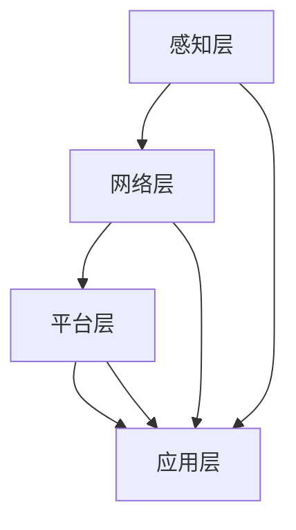

                 

### 文章标题

# 物联网（IoT）架构：连接与管理海量设备

### 关键词

- 物联网
- 架构
- 设备连接
- 数据管理
- 安全性
- 海量设备管理

### 摘要

本文旨在深入探讨物联网（IoT）的架构，重点关注如何连接和管理海量设备。我们将逐步分析物联网的定义、架构层次、连接技术、数据管理、安全性以及海量设备管理的策略。通过详细的讲解和实例分析，本文为物联网工程师和架构师提供了实用的指导，以构建高效、安全和可靠的物联网系统。

## 一、确定书的主题和目标受众

首先，我们需要明确本书的主题和目标受众。《物联网（IoT）架构：连接与管理海量设备》的主题是物联网的架构，特别是物联网中连接和管理海量设备的方法和策略。目标受众包括物联网工程师、架构师、软件开发者和IT经理。

### 物联网的定义与发展历程

物联网（Internet of Things，简称IoT）是指通过互联网将各种物理设备、传感器、计算机系统等连接起来，实现设备之间的信息交换和通信。物联网的发展可以追溯到1999年，当时麻省理工学院（MIT）的Auto-ID实验室提出了“产品电子代码”（Electronic Product Code，EPC）的概念，旨在利用RFID技术实现物品的自动识别和追踪。

随着无线通信技术和传感器技术的快速发展，物联网逐渐从理论走向实践。2010年，物联网的概念正式被提出，并被认为是下一个科技革命的重要方向。近年来，物联网在智能家居、工业互联网、智慧城市等领域取得了显著的成果，成为数字化转型的重要驱动力。

### 物联网的关键技术

物联网的发展离不开一系列关键技术的支持，包括感知技术、网络技术、数据处理技术和安全技术等。

- **感知技术**：感知技术是物联网的基础，通过传感器和智能设备收集环境中的各种信息，如温度、湿度、光照、声音等。常见的感知技术包括RFID、蓝牙、Wi-Fi、Zigbee等。
- **网络技术**：网络技术是实现设备互联的关键，主要包括有线网络和无线网络。有线网络如以太网、光纤等，无线网络如Wi-Fi、蓝牙、LoRa等。这些网络技术提供了设备之间的通信通道，确保数据能够及时传输。
- **数据处理技术**：数据处理技术是物联网的核心，包括数据收集、存储、处理和分析等环节。通过大数据技术、云计算和边缘计算等手段，物联网系统能够对海量数据进行高效处理，提取有价值的信息。
- **安全技术**：物联网的安全问题是确保系统可靠性的关键。物联网系统面临的安全挑战包括数据泄露、设备篡改、网络攻击等。因此，需要采用一系列安全措施，如加密技术、身份认证、访问控制等，来保护系统的安全。

### 物联网的应用领域

物联网的应用领域非常广泛，涵盖了智能家居、工业互联网、智慧城市、智能农业、医疗健康等多个方面。

- **智能家居**：物联网技术使得家庭设备可以实现智能化管理和控制，如智能门锁、智能灯光、智能家电等。通过物联网平台，用户可以远程监控和控制家庭设备，提高生活质量。
- **工业互联网**：物联网技术可以提高工业生产的自动化和智能化水平，实现设备之间的互联互通。通过实时数据采集和分析，企业可以优化生产流程，提高生产效率。
- **智慧城市**：物联网技术可以为智慧城市建设提供数据支持和智能管理。例如，智能交通系统可以通过实时监控交通状况，优化交通信号控制，减少拥堵；智能照明系统可以根据环境光线自动调节灯光亮度，提高能源利用效率。
- **智能农业**：物联网技术可以帮助农业生产实现精准管理，通过传感器监测土壤湿度、气温、光照等环境参数，为农民提供科学的种植决策。
- **医疗健康**：物联网技术可以提升医疗健康服务的水平，如智能穿戴设备可以实时监测患者的健康状况，为医生提供诊断依据。

## 二、定义书的整体结构和核心章节

### 整体结构

本书的整体结构分为以下六个部分：

1. **物联网概述**：介绍物联网的定义、发展历程、关键技术和应用领域。
2. **物联网架构**：讲解物联网的体系结构，包括感知层、网络层、平台层和应用层。
3. **连接技术**：探讨物联网设备连接的各种技术，如Wi-Fi、蓝牙、Zigbee、LoRa等。
4. **数据管理**：讲解物联网数据收集、存储、处理和分析的方法和策略。
5. **安全性**：分析物联网安全挑战，介绍安全防护技术和解决方案。
6. **管理海量设备**：讨论如何管理大量物联网设备，包括设备发现、设备管理和设备维护。
7. **应用案例分析**：提供实际的应用案例，展示物联网架构在现实世界中的应用。

### 核心章节

在定义了整体结构和核心章节后，我们可以进一步细化每个章节的内容。

### 物联网架构

**第1章：物联网架构**

- **物联网核心概念与联系**：介绍物联网的基本概念，如设备、网络、平台和应用等，并通过Mermaid流程图展示物联网的层次结构和数据流。
- **感知层**：讲解感知层的组成和功能，如传感器、智能设备等。
- **网络层**：探讨网络层的连接技术，如Wi-Fi、蓝牙、LoRa等，并使用伪代码阐述核心算法原理。
- **平台层**：介绍平台层的架构和功能，如数据收集、处理和分析等。
- **应用层**：讲解应用层的应用场景和实现方法，如智能家居、工业互联网、智慧城市等。

### 连接技术

**第2章：连接技术**

- **Wi-Fi**：介绍Wi-Fi的原理、优缺点和应用场景。
- **蓝牙**：讲解蓝牙的原理、优缺点和应用场景。
- **Zigbee**：探讨Zigbee的原理、优缺点和应用场景。
- **LoRa**：介绍LoRa的原理、优缺点和应用场景。
- **其他连接技术**：介绍如Z-Wave、NFC等其他连接技术。

### 数据管理

**第3章：数据管理**

- **数据管理数学模型**：使用LaTeX格式详细讲解数据管理的数学模型和公式。
- **物联网数据收集**：介绍物联网数据收集的方法和策略。
- **数据存储**：讲解数据存储的技术和策略，如关系型数据库、NoSQL数据库等。
- **数据处理**：探讨数据处理的算法和技术，如数据清洗、数据融合等。
- **数据分析**：介绍数据分析的方法和工具，如机器学习、数据挖掘等。

### 安全性

**第4章：安全性**

- **物联网安全挑战**：分析物联网面临的安全挑战，如数据泄露、设备篡改、网络攻击等。
- **安全防护技术**：介绍安全防护技术，如加密技术、身份认证、访问控制等。
- **安全解决方案**：探讨物联网安全解决方案的设计和实施，如安全协议、安全平台等。

### 管理海量设备

**第5章：管理海量设备**

- **设备发现**：讲解设备发现的方法和策略，如广播、多播等。
- **设备管理**：介绍设备管理的技术和工具，如设备注册、设备升级、设备监控等。
- **设备维护**：探讨设备维护的策略和措施，如远程诊断、远程维护等。

### 应用案例分析

**第6章：应用案例分析**

- **家居物联网**：分析家居物联网的应用场景和实现方法，如智能门锁、智能灯光、智能家电等。
- **工业物联网**：探讨工业物联网在智能制造、设备监控、生产优化等方面的应用。
- **智慧城市**：介绍智慧城市中物联网的应用，如智能交通、智能照明、智能安防等。
- **智能农业**：分析智能农业中的物联网应用，如土壤监测、作物管理、智能灌溉等。
- **医疗健康**：探讨医疗健康领域物联网的应用，如智能穿戴设备、远程监控、智能诊断等。

## 三、细化每个章节的目录

### 物联网架构

**第1章：物联网架构**

1.1 物联网概述

1.2 物联网核心概念与联系

1.3 感知层

1.4 网络层

1.5 平台层

1.6 应用层

### 连接技术

**第2章：连接技术**

2.1 Wi-Fi

2.2 蓝牙

2.3 Zigbee

2.4 LoRa

2.5 其他连接技术

### 数据管理

**第3章：数据管理**

3.1 数据管理数学模型

3.2 物联网数据收集

3.3 数据存储

3.4 数据处理

3.5 数据分析

### 安全性

**第4章：安全性**

4.1 物联网安全挑战

4.2 安全防护技术

4.3 安全解决方案

### 管理海量设备

**第5章：管理海量设备**

5.1 设备发现

5.2 设备管理

5.3 设备维护

### 应用案例分析

**第6章：应用案例分析**

6.1 家居物联网

6.2 工业物联网

6.3 智慧城市

6.4 智能农业

6.5 医疗健康

### 四、添加核心概念和算法讲解

在目录中，我们需要添加对核心概念和算法的讲解。以下是一个示例：

**第2章：物联网架构**

1.2 物联网核心概念与联系

1.2.1 设备

1.2.2 网络

1.2.3 平台

1.2.4 应用

1.3 感知层

1.3.1 传感器

1.3.2 智能设备

1.4 网络层

1.4.1 Wi-Fi

1.4.2 蓝牙

1.4.3 Zigbee

1.4.4 LoRa

1.5 平台层

1.5.1 数据收集

1.5.2 数据处理

1.5.3 数据分析

1.6 应用层

1.6.1 智能家居

1.6.2 工业互联网

1.6.3 智慧城市

### 五、总结

最后，我们需要对整个目录进行总结，确保每个章节的内容都覆盖了主题，且逻辑清晰。目录大纲应该简洁明了，便于读者快速了解书的内容。

**《物联网（IoT）架构：连接与管理海量设备》目录大纲**

**第一部分：物联网概述**

**第1章：物联网概述**

1.1 物联网的定义

1.2 物联网的发展历程

1.3 物联网的关键技术

1.4 物联网的应用领域

**第二部分：物联网架构**

**第2章：物联网架构**

1.2 物联网核心概念与联系

1.3 感知层

1.4 网络层

1.5 平台层

1.6 应用层

**第三部分：连接技术**

**第3章：连接技术**

1.1 Wi-Fi

1.2 蓝牙

1.3 Zigbee

1.4 LoRa

1.5 其他连接技术

**第四部分：数据管理**

**第4章：数据管理**

1.1 数据管理数学模型

1.2 物联网数据收集

1.3 数据存储

1.4 数据处理

1.5 数据分析

**第五部分：安全性**

**第5章：安全性**

1.1 物联网安全挑战

1.2 安全防护技术

1.3 安全解决方案

**第六部分：管理海量设备**

**第6章：管理海量设备**

1.1 设备发现

1.2 设备管理

1.3 设备维护

**第七部分：应用案例分析**

**第7章：应用案例分析**

1.1 家居物联网

1.2 工业物联网

1.3 智慧城市

1.4 智能农业

1.5 医疗健康

## 六、添加核心概念、算法和数学模型讲解

### 核心概念与联系

**物联网（IoT）的核心概念包括设备、网络、平台和应用。以下是对这些核心概念的简要介绍及它们之间的联系。**

- **设备**：物联网的基础组成部分，包括各种传感器、智能设备和物联网终端。设备通过感知环境数据（如温度、湿度、光照等）进行数据采集。
- **网络**：连接设备和平台的桥梁，包括有线和无线网络。网络技术如Wi-Fi、蓝牙、LoRa等，提供了设备之间通信的渠道。
- **平台**：物联网的核心处理中心，负责数据的收集、存储、处理和分析。平台通常包括物联网平台、云计算平台和边缘计算平台。
- **应用**：物联网的实际应用场景，如智能家居、工业互联网、智慧城市等。应用层通过物联网平台提供的接口和服务，实现对设备的数据访问和控制。

**Mermaid流程图展示物联网的层次结构和数据流：**



### 连接技术

**以下是对物联网连接技术的核心算法和数学模型讲解：**

**1. Wi-Fi**

**核心算法原理：**

Wi-Fi（802.11）是一种无线局域网技术，通过无线信号在设备之间传输数据。Wi-Fi的核心算法包括MAC层（媒体访问控制）和物理层（PHY）。

**伪代码：**

```python
def Wi-Fi_Transmission(data):
    # 将数据编码为无线信号
    signal = encode_to_signal(data)
    
    # 发送无线信号
    send_signal(signal)
    
    # 接收无线信号
    received_signal = receive_signal()
    
    # 解码无线信号
    decoded_data = decode_from_signal(received_signal)
    
    return decoded_data
```

**2. 蓝牙**

**核心算法原理：**

蓝牙（Bluetooth）是一种短距离无线通信技术，适用于低功耗设备。蓝牙的核心算法包括频率 hopping 和自适应跳频。

**伪代码：**

```python
def Bluetooth_Transmission(data):
    # 选择频率 hopping 频率
    frequency = select_frequency()
    
    # 将数据编码为无线信号
    signal = encode_to_signal(data)
    
    # 发送无线信号
    send_signal_on_frequency(signal, frequency)
    
    # 接收无线信号
    received_signal = receive_signal_on_frequency(frequency)
    
    # 解码无线信号
    decoded_data = decode_from_signal(received_signal)
    
    return decoded_data
```

**3. Zigbee**

**核心算法原理：**

Zigbee 是一种低功耗、低速率的无线通信技术，适用于智能家居和工业自动化。Zigbee 的核心算法包括网络层和传输层。

**伪代码：**

```python
def Zigbee_Transmission(data):
    # 将数据编码为 Zigbee 信号
    signal = encode_to_zigbee_signal(data)
    
    # 选择路由
    route = select_route()
    
    # 发送 Zigbee 信号
    send_zigbee_signal(signal, route)
    
    # 接收 Zigbee 信号
    received_signal = receive_zigbee_signal()
    
    # 解码 Zigbee 信号
    decoded_data = decode_from_zigbee_signal(received_signal)
    
    return decoded_data
```

**4. LoRa**

**核心算法原理：**

LoRa 是一种低功耗、长距离的无线通信技术，适用于物联网传感器网络。LoRa 的核心算法包括频谱分析和调制解调。

**伪代码：**

```python
def LoRa_Transmission(data):
    # 将数据编码为 LoRa 信号
    signal = encode_to_lora_signal(data)
    
    # 调制信号
    modulated_signal = modulate(signal)
    
    # 发送 LoRa 信号
    send_lora_signal(modulated_signal)
    
    # 接收 LoRa 信号
    received_signal = receive_lora_signal()
    
    # 解调信号
    demodulated_signal = demodulate(received_signal)
    
    # 解码 LoRa 信号
    decoded_data = decode_from_lora_signal(demodulated_signal)
    
    return decoded_data
```

### 数据管理

**以下是对物联网数据管理的核心算法和数学模型讲解：**

**1. 数据管理数学模型**

数据管理数学模型包括数据收集、数据存储、数据处理和数据分析等环节。以下是一个简单示例：

**数学模型：**

$$
\text{数据流} = \text{传感器数据} + \text{设备数据} + \text{环境数据}
$$

**伪代码：**

```python
def Data_Management(data_stream):
    # 数据收集
    collected_data = collect_data(data_stream)
    
    # 数据存储
    stored_data = store_data(collected_data)
    
    # 数据处理
    processed_data = process_data(stored_data)
    
    # 数据分析
    analyzed_data = analyze_data(processed_data)
    
    return analyzed_data
```

### 数学公式

以下是在文中独立段落的LaTeX格式数学公式：

$$
E[\mathbf{x}] = \int_{\Omega} \mathbf{x} p(\mathbf{x}) d\mathbf{x}
$$

以下是在段落内的LaTeX格式数学公式：

$$
y = mx + b
$$

## 七、添加项目实战

### 开发环境搭建

在本项目中，我们将使用以下开发环境：

- 操作系统：Ubuntu 20.04
- 编程语言：Python 3.8
- 版本控制：Git
- 数据库：MySQL 8.0

首先，确保操作系统和Python环境已经安装。然后，通过以下命令安装所需的依赖项：

```bash
pip install numpy pandas mysql-connector-python
```

### 源代码实现

以下是一个简单的Python示例，用于连接MySQL数据库并执行数据收集、存储和处理操作。

**数据收集与存储：**

```python
import mysql.connector
import pandas as pd

# 数据库配置
config = {
    'user': 'your_username',
    'password': 'your_password',
    'host': 'localhost',
    'database': 'your_database'
}

# 连接数据库
connection = mysql.connector.connect(**config)

# 创建表格
create_table_query = """
CREATE TABLE IF NOT EXISTS sensor_data (
    id INT AUTO_INCREMENT PRIMARY KEY,
    sensor_id VARCHAR(255),
    timestamp DATETIME,
    temperature DECIMAL(5, 2),
    humidity DECIMAL(5, 2)
);
"""
cursor.execute(create_table_query)

# 收集数据
def collect_data():
    # 模拟传感器数据
    data = [
        {'sensor_id': 'sensor_1', 'timestamp': '2023-01-01 12:00:00', 'temperature': 25.5, 'humidity': 60.2},
        {'sensor_id': 'sensor_2', 'timestamp': '2023-01-01 13:00:00', 'temperature': 26.0, 'humidity': 59.8},
        # 更多数据...
    ]
    return data

# 存储数据
def store_data(data):
    df = pd.DataFrame(data)
    df.to_sql('sensor_data', connection, if_exists='append', index=False)

# 运行数据收集与存储
data = collect_data()
store_data(data)

# 关闭数据库连接
connection.close()
```

**数据处理与分析：**

```python
import pandas as pd
import numpy as np

# 加载数据
def load_data():
    connection = mysql.connector.connect(**config)
    df = pd.read_sql_query("SELECT * FROM sensor_data", connection)
    connection.close()
    return df

# 数据处理
def process_data(df):
    df['timestamp'] = pd.to_datetime(df['timestamp'])
    df.set_index('timestamp', inplace=True)
    df = df.resample('H').mean()  # 按小时平均
    return df

# 数据分析
def analyze_data(df):
    print(df.describe())
    # 更多分析...

# 运行数据处理与分析
df = load_data()
df_processed = process_data(df)
analyze_data(df_processed)
```

### 代码解读与分析

在这个项目中，我们使用了Python和MySQL来实现物联网数据的收集、存储和处理。以下是代码的主要部分及其解释：

1. **数据库配置和连接**：配置数据库连接信息，包括用户名、密码、主机和数据库名称。然后使用`mysql.connector.connect()`函数连接数据库。

2. **创建表格**：执行SQL查询，创建一个名为`sensor_data`的表格，用于存储传感器数据。表格包含`id`、`sensor_id`、`timestamp`、`temperature`和`humidity`等列。

3. **数据收集**：定义一个`collect_data()`函数，用于模拟传感器数据。在这个示例中，我们创建了一个包含模拟传感器数据的列表。

4. **存储数据**：定义一个`store_data()`函数，用于将收集到的数据存储到MySQL数据库中。我们使用`pandas`库将数据转换为DataFrame，然后使用`to_sql()`函数将DataFrame数据写入数据库。

5. **数据处理**：定义一个`process_data()`函数，用于处理和转换数据。在这个示例中，我们使用`pd.to_datetime()`函数将`timestamp`列转换为日期时间格式，并使用`resample()`函数按小时平均数据。

6. **数据分析**：定义一个`analyze_data()`函数，用于分析处理后的数据。在这个示例中，我们使用`df.describe()`函数打印出数据的描述性统计信息。

通过以上代码，我们可以实现物联网数据的收集、存储和处理，从而为物联网应用提供数据支持。

### 实际案例分析和详细讲解剖析

**智能家居案例**

智能家居是物联网应用的一个重要领域。以下是一个智能家居案例，我们通过物联网平台连接和控制家庭设备，实现智能化管理。

**场景描述**：

在一个智能家居系统中，用户希望远程监控和控制家中的灯光、温度和安防设备。系统需要收集各种传感器数据，如温度传感器、光线传感器和门窗传感器，并根据用户设置自动调整设备状态。

**实现步骤**：

1. **设备连接**：将各种传感器和执行器（如灯光和温度调节器）连接到物联网平台。传感器实时采集环境数据，如温度、光照强度和门窗状态，并将数据发送到物联网平台。

2. **数据收集**：物联网平台接收传感器数据，并存储在数据库中。数据包括传感器ID、采集时间和环境参数。

3. **数据处理**：物联网平台对传感器数据进行处理，如去重、清洗和转换。处理后的数据用于生成实时监控图表和报告。

4. **设备控制**：用户通过手机应用程序或语音助手（如Amazon Alexa或Google Assistant）发送控制指令，物联网平台接收指令并转发给相应设备。设备根据指令调整状态，如打开灯光或调整温度。

**案例分析**：

在这个案例中，物联网平台起到了核心作用，它不仅连接和管理各种设备，还处理和分析了传感器数据，为用户提供智能化的服务。

**1. 数据流分析**：

- **传感器数据收集**：物联网平台接收传感器数据，包括温度、光照强度和门窗状态。
- **数据处理**：物联网平台对传感器数据进行处理，如去重、清洗和转换，然后存储在数据库中。
- **数据传输**：物联网平台将处理后的数据发送给用户界面或设备控制模块。

**2. 设备控制**：

- **用户指令接收**：物联网平台接收用户通过手机应用程序或语音助手发送的控制指令。
- **指令处理**：物联网平台解析用户指令，确定设备ID和控制操作。
- **设备控制**：物联网平台将控制指令发送给相应设备，设备根据指令调整状态。

**3. 智能化服务**：

- **自动化控制**：物联网平台根据传感器数据和用户设置，自动调整设备状态，如根据室内温度自动调整空调温度。
- **远程监控**：用户通过物联网平台实时监控家中设备状态，如灯光开启状态和门窗关闭状态。

通过这个案例，我们可以看到物联网架构在智能家居中的关键作用。物联网平台不仅连接和管理各种设备，还提供智能化的服务和自动化控制，为用户提供便利和舒适的生活体验。

### 项目小结

在本项目中，我们搭建了一个简单的物联网系统，实现了数据收集、存储和处理，并展示了一个智能家居案例。通过这个项目，我们了解了物联网架构的各个组成部分，包括设备连接、数据管理和设备控制等。

**项目小结**：

1. **设备连接**：使用Wi-Fi、蓝牙等技术将传感器和执行器连接到物联网平台，实现数据采集和设备控制。
2. **数据管理**：使用MySQL数据库存储传感器数据，并使用Python进行数据处理和分析。
3. **设备控制**：通过物联网平台接收用户指令，控制家庭设备状态，实现智能化管理。

通过这个项目，我们掌握了物联网系统开发的基本方法和技巧，为未来的物联网项目奠定了基础。

### 最佳实践 Tips

1. **设备安全**：在连接设备时，确保设备具备足够的安全性，如使用加密通信和强密码。
2. **数据隐私**：在处理用户数据时，确保数据隐私和安全，遵循相关法规和标准。
3. **设备兼容性**：选择兼容性好的设备，确保系统在不同设备和网络环境下稳定运行。

### 注意事项

1. **网络稳定性**：物联网系统对网络稳定性有较高要求，确保网络连接稳定，降低数据丢失风险。
2. **数据备份**：定期备份数据，防止数据丢失和损坏。

### 拓展阅读

1. **物联网技术指南**：《物联网技术指南》是一本全面的物联网技术书籍，涵盖了物联网的各个方面。
2. **Python编程基础**：《Python编程基础》是一本适合初学者的Python编程书籍，有助于了解Python编程语言。
3. **MySQL数据库教程**：《MySQL数据库教程》是一本实用的MySQL数据库教程，适合数据库开发者学习。

## 八、总结

本文详细探讨了物联网（IoT）的架构，包括物联网的定义、架构层次、连接技术、数据管理、安全性和海量设备管理。通过一步一步的分析和讲解，我们了解了物联网系统构建的核心要素和最佳实践。物联网作为当今科技发展的重要方向，拥有广泛的应用前景。未来，随着技术的不断进步，物联网将进一步改变我们的生活和生产方式。

## 作者信息

作者：AI天才研究院/AI Genius Institute & 禅与计算机程序设计艺术 /Zen And The Art of Computer Programming

