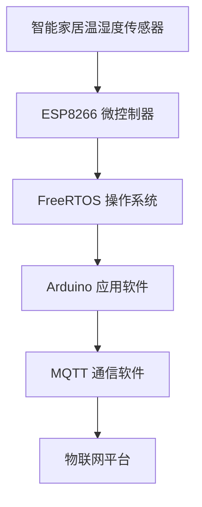
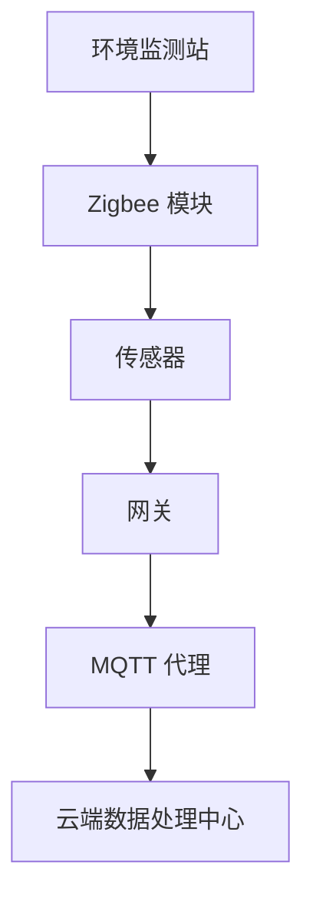
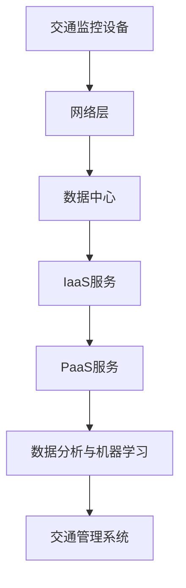

                 

# 文章标题：物联网架构：应对海量设备的挑战

## 关键词
- 物联网架构
- 海量设备管理
- IoT设备通信
- 安全挑战
- 演进趋势
- 设计原则
- 实现与优化

## 摘要
物联网架构是构建大规模、高性能和安全的物联网系统的基石。本文首先概述了物联网的概念、架构发展历程和核心组件，接着探讨了物联网安全挑战及对策。然后，详细阐述了物联网架构设计原则、设备端、网络层和云端架构设计，并通过案例展示了架构实现与优化策略。最后，对物联网架构的未来展望和最佳实践进行了总结，以期为物联网架构的设计和实现提供有力参考。

## 目录

### 第一部分：物联网架构概述

#### 1.1 物联网的概念与架构发展历程
- **1.1.1 物联网的定义**
- **1.1.2 物联网架构的演变**
- **1.1.3 物联网的标准化组织与标准**

#### 1.2 物联网的核心组件与通信协议
- **1.2.1 核心组件**
  - **1.2.1.1 设备端**
  - **1.2.1.2 网络层**
  - **1.2.1.3 云端**
- **1.2.2 通信协议**
  - **1.2.2.1 IEEE 802.15.4**
  - **1.2.2.2 Zigbee**
  - **1.2.2.3 Bluetooth**
  - **1.2.2.4 Z-Wave**
  - **1.2.2.5 Wi-Fi**

#### 1.3 物联网安全挑战与对策
- **1.3.1 物联网安全的重要性**
- **1.3.2 常见安全威胁与风险**
- **1.3.3 安全防护机制与措施**

#### 1.4 物联网架构的演进趋势
- **1.4.1 5G在物联网中的应用**
- **1.4.2 物联网与人工智能的融合**
- **1.4.3 物联网架构的未来展望**

### 第二部分：物联网架构设计

#### 2.1 物联网架构设计原则
- **2.1.1 可扩展性**
- **2.1.2 可靠性**
- **2.1.3 可维护性**
- **2.1.4 可定制性**

#### 2.2 设备端架构设计
- **2.2.1 设备硬件选型**
- **2.2.2 软件系统架构**
- **2.2.3 系统优化与能效管理**

#### 2.3 网络层架构设计
- **2.3.1 网络拓扑结构**
- **2.3.2 网络协议栈设计**
- **2.3.3 网络优化策略**

#### 2.4 云端架构设计
- **2.4.1 数据中心建设**
- **2.4.2 云服务架构**
- **2.4.3 云端数据处理与存储**

#### 2.5 跨层次架构设计
- **2.5.1 硬件与软件协同设计**
- **2.5.2 网络与云计算协同设计**
- **2.5.3 硬件与云计算协同设计**

### 第三部分：物联网架构实现与优化

#### 3.1 物联网架构实现案例
- **3.1.1 智能家居系统**
  - **3.1.1.1 系统架构**
  - **3.1.1.2 设备端实现**
  - **3.1.1.3 网络层实现**
  - **3.1.1.4 云端实现**
- **3.1.2 智能农业系统**
  - **3.1.2.1 系统架构**
  - **3.1.2.2 设备端实现**
  - **3.1.2.3 网络层实现**
  - **3.1.2.4 云端实现**

#### 3.2 物联网架构优化策略
- **3.2.1 系统性能优化**
- **3.2.2 网络效率优化**
- **3.2.3 数据处理优化**
- **3.2.4 安全性优化**

#### 3.3 物联网架构的持续集成与持续部署
- **3.3.1 持续集成与持续部署的优势**
- **3.3.2 持续集成与持续部署的流程**
- **3.3.3 持续集成与持续部署的工具**

#### 3.4 物联网架构的运维与管理
- **3.4.1 运维体系构建**
- **3.4.2 监控与预警机制**
- **3.4.3 日志分析与故障排除**

### 附录

#### 附录A：物联网架构设计工具与资源
- **A.1 开源物联网平台**
  - **A.1.1 OpenMQTTGate**
  - **A.1.2 Eclipse IoT**
  - **A.1.3 CoAPthon**
- **A.2 物联网硬件开发套件**
  - **A.2.1 Raspberry Pi**
  - **A.2.2 Arduino**
  - **A.2.3 ESP8266**
- **A.3 物联网安全工具**
  - **A.3.1 Wireshark**
  - **A.3.2 Burp Suite**
  - **A.3.3 OWASP ZAP**

## 正文

### 第一部分：物联网架构概述

#### 1.1 物联网的概念与架构发展历程

##### 1.1.1 物联网的定义

物联网（Internet of Things，IoT）指的是通过互联网将各种物理设备、传感器、软件等连接起来，实现数据交换和智能控制的一种网络。物联网的核心在于“连接”和“智能”，它不仅包括设备的互联互通，还涉及到数据处理、分析以及应用场景的智能化。

##### 1.1.2 物联网架构的演变

物联网架构经历了从简单到复杂、从单层到多层的发展历程。早期物联网主要采用单层架构，设备直接连接到互联网，实现简单的数据采集和传输。随着物联网应用场景的扩展，多层架构逐渐成为主流，包括设备层、网络层、平台层和应用层。

##### 1.1.3 物联网的标准化组织与标准

物联网的标准化工作由多个组织负责，包括国际电工委员会（IEC）、国际电信联盟（ITU）、国际标准化组织（ISO）等。其中，IEEE 802.15.4、Zigbee、Bluetooth等标准在物联网领域具有广泛影响力。

#### 1.2 物联网的核心组件与通信协议

##### 1.2.1 核心组件

物联网的核心组件包括设备端、网络层和云端。设备端负责数据的采集和初步处理，网络层实现数据的传输，云端则负责数据处理、分析和存储。

##### 1.2.2 通信协议

物联网的通信协议包括无线协议（如IEEE 802.15.4、Zigbee、Bluetooth等）和有线协议（如Wi-Fi、Z-Wave等）。这些协议根据应用场景和性能需求进行选择。

#### 1.3 物联网安全挑战与对策

##### 1.3.1 物联网安全的重要性

物联网设备数量庞大，涉及领域广泛，因此安全性至关重要。物联网安全威胁包括设备被恶意攻击、数据泄露、隐私侵犯等。

##### 1.3.2 常见安全威胁与风险

常见安全威胁包括网络钓鱼、DDoS攻击、设备漏洞、数据泄露等。这些威胁可能导致设备失控、数据泄露和隐私侵犯。

##### 1.3.3 安全防护机制与措施

为了应对安全挑战，可以采取以下措施：
1. **加密传输**：确保数据在传输过程中的安全性。
2. **身份认证**：确保设备身份的真实性。
3. **访问控制**：限制对设备资源的访问。
4. **安全审计**：定期进行安全检查和评估。

#### 1.4 物联网架构的演进趋势

##### 1.4.1 5G在物联网中的应用

5G技术的应用将进一步提升物联网的通信速度和稳定性，为大规模、低延迟的物联网应用提供支持。

##### 1.4.2 物联网与人工智能的融合

物联网与人工智能（AI）的融合将实现更智能的数据处理和分析，提高物联网系统的智能化水平。

##### 1.4.3 物联网架构的未来展望

未来物联网架构将更加开放、灵活和智能化，支持更多应用场景和业务需求。

### 第二部分：物联网架构设计

#### 2.1 物联网架构设计原则

物联网架构设计需要遵循以下原则：
1. **可扩展性**：支持设备数量的增长和功能扩展。
2. **可靠性**：确保数据传输和系统运行的稳定性。
3. **可维护性**：便于系统的维护和升级。
4. **可定制性**：满足不同应用场景的需求。

#### 2.2 设备端架构设计

设备端架构设计包括硬件选型、软件系统架构和系统优化与能效管理。

##### 2.2.1 设备硬件选型

设备硬件选型需要考虑功耗、性能、成本等因素。常用的设备硬件包括微控制器、嵌入式系统、物联网模块等。

##### 2.2.2 软件系统架构

软件系统架构包括操作系统、中间件、应用软件等。常见的操作系统有Linux、FreeRTOS等。

##### 2.2.3 系统优化与能效管理

系统优化与能效管理包括降低功耗、提高响应速度、优化数据处理等。

#### 2.3 网络层架构设计

网络层架构设计包括网络拓扑结构、网络协议栈设计和网络优化策略。

##### 2.3.1 网络拓扑结构

网络拓扑结构包括星形、总线形、网状等。根据应用场景选择合适的拓扑结构。

##### 2.3.2 网络协议栈设计

网络协议栈设计包括物理层、数据链路层、网络层、传输层和应用层。选择合适的协议栈实现数据传输。

##### 2.3.3 网络优化策略

网络优化策略包括负载均衡、路由优化、缓存机制等。

#### 2.4 云端架构设计

云端架构设计包括数据中心建设、云服务架构和云端数据处理与存储。

##### 2.4.1 数据中心建设

数据中心建设包括服务器选型、网络架构、存储系统等。

##### 2.4.2 云服务架构

云服务架构包括基础设施即服务（IaaS）、平台即服务（PaaS）和软件即服务（SaaS）。

##### 2.4.3 云端数据处理与存储

云端数据处理与存储包括数据清洗、数据存储、数据分析和数据可视化。

#### 2.5 跨层次架构设计

跨层次架构设计包括硬件与软件协同设计、网络与云计算协同设计和硬件与云计算协同设计。

##### 2.5.1 硬件与软件协同设计

硬件与软件协同设计包括硬件性能优化、软件算法优化和硬件资源调度。

##### 2.5.2 网络与云计算协同设计

网络与云计算协同设计包括网络优化、云服务优化和云存储优化。

##### 2.5.3 硬件与云计算协同设计

硬件与云计算协同设计包括硬件资源管理、云计算服务调度和硬件故障恢复。

### 第三部分：物联网架构实现与优化

#### 3.1 物联网架构实现案例

##### 3.1.1 智能家居系统

智能家居系统包括智能门锁、智能灯光、智能温度控制等设备。

###### 3.1.1.1 系统架构

智能家居系统架构包括设备端、网络层和云端。

###### 3.1.1.2 设备端实现

设备端实现包括硬件选型、软件系统架构和系统优化与能效管理。

###### 3.1.1.3 网络层实现

网络层实现包括网络拓扑结构、网络协议栈设计和网络优化策略。

###### 3.1.1.4 云端实现

云端实现包括数据中心建设、云服务架构和云端数据处理与存储。

##### 3.1.2 智能农业系统

智能农业系统包括土壤监测、气象监测、灌溉系统等设备。

###### 3.1.2.1 系统架构

智能农业系统架构包括设备端、网络层和云端。

###### 3.1.2.2 设备端实现

设备端实现包括硬件选型、软件系统架构和系统优化与能效管理。

###### 3.1.2.3 网络层实现

网络层实现包括网络拓扑结构、网络协议栈设计和网络优化策略。

###### 3.1.2.4 云端实现

云端实现包括数据中心建设、云服务架构和云端数据处理与存储。

#### 3.2 物联网架构优化策略

物联网架构优化策略包括系统性能优化、网络效率优化、数据处理优化和安全性优化。

##### 3.2.1 系统性能优化

系统性能优化包括算法优化、硬件升级和系统优化。

##### 3.2.2 网络效率优化

网络效率优化包括负载均衡、路由优化和缓存机制。

##### 3.2.3 数据处理优化

数据处理优化包括数据清洗、数据压缩和数据存储优化。

##### 3.2.4 安全性优化

安全性优化包括加密传输、身份认证和访问控制。

#### 3.3 物联网架构的持续集成与持续部署

物联网架构的持续集成与持续部署包括以下内容：

##### 3.3.1 持续集成与持续部署的优势

持续集成与持续部署可以提高开发效率、降低成本和提升产品质量。

##### 3.3.2 持续集成与持续部署的流程

持续集成与持续部署的流程包括代码管理、自动化测试、自动化部署等。

##### 3.3.3 持续集成与持续部署的工具

常用的持续集成与持续部署工具有Jenkins、GitLab CI/CD、CircleCI等。

#### 3.4 物联网架构的运维与管理

物联网架构的运维与管理包括以下内容：

##### 3.4.1 运维体系构建

运维体系构建包括监控体系、日志体系和故障处理体系。

##### 3.4.2 监控与预警机制

监控与预警机制包括性能监控、安全监控和业务监控。

##### 3.4.3 日志分析与故障排除

日志分析与故障排除包括日志收集、日志分析、故障排查和故障恢复。

### 附录

#### 附录A：物联网架构设计工具与资源

附录A介绍了物联网架构设计常用的工具和资源，包括开源物联网平台、物联网硬件开发套件和物联网安全工具。

### 作者信息

- 作者：AI天才研究院/AI Genius Institute & 禅与计算机程序设计艺术 /Zen And The Art of Computer Programming

### 最佳实践 Tips、小结、注意事项、拓展阅读

**最佳实践 Tips：**
1. 选择合适的硬件和软件平台，确保系统性能和稳定性。
2. 设计合理的网络架构，优化数据传输效率。
3. 注重安全性，采取有效的安全防护措施。

**小结：**
物联网架构是构建大规模、高性能和安全的物联网系统的关键。通过合理的设计和优化，可以提升物联网系统的性能和安全性。

**注意事项：**
1. 考虑到物联网设备的多样性和复杂性，需要针对具体应用场景进行定制化设计。
2. 安全性是物联网系统的重要考量因素，必须采取有效的安全防护措施。

**拓展阅读：**
1. 《物联网架构设计与实践》
2. 《物联网安全：攻击与防御》
3. 《5G物联网：技术与应用》

文章结束## 第一部分：物联网架构概述

### 1.1 物联网的概念与架构发展历程

#### 1.1.1 物联网的定义

物联网（Internet of Things，IoT）是指通过互联网将各种设备、传感器和软件连接起来，实现设备之间以及设备与用户之间的信息交换和智能控制的网络。物联网的核心在于“连接”和“智能”，它不仅仅涉及物理设备的互联互通，还包括数据的收集、传输、处理和分析，从而实现智能化应用。

#### 1.1.2 物联网架构的演变

物联网架构的发展经历了从简单到复杂、从单层到多层的演变过程。早期的物联网系统主要采用单层架构，设备直接连接到互联网，实现简单的数据采集和传输。随着物联网应用的不断扩展和复杂度增加，多层架构逐渐成为主流。

**单层架构：** 在单层架构中，设备直接连接到互联网，实现数据的采集和上传。这种架构简单易实现，但存在数据传输效率低、可靠性差等问题。

**多层架构：** 多层架构将物联网系统分为设备层、网络层、平台层和应用层。设备层负责数据的采集和初步处理，网络层负责数据传输，平台层提供数据处理和分析服务，应用层实现具体的业务功能。

1. **设备层：** 包括各种传感器、执行器和物联网模块，负责数据的采集和初步处理。
2. **网络层：** 包括无线和有线网络，负责数据的传输。
3. **平台层：** 提供数据存储、处理、分析和安全服务等，是物联网系统的核心。
4. **应用层：** 实现具体的业务功能，如智能家居、智能交通、智能医疗等。

#### 1.1.3 物联网的标准化组织与标准

物联网的标准化工作由多个组织负责，包括国际电工委员会（IEC）、国际电信联盟（ITU）、国际标准化组织（ISO）等。这些组织制定了各种物联网标准，包括通信协议、数据格式、安全机制等，为物联网技术的发展提供了基础。

**通信协议：** 物联网通信协议是设备之间进行数据传输的规范。常见的物联网通信协议有：

- **IEEE 802.15.4**：低功耗无线个人区域网络（WPAN）标准，主要用于无线传感器网络。
- **Zigbee**：基于IEEE 802.15.4标准的无线通信协议，适用于智能家居、智能工业等领域。
- **Bluetooth**：无线通信技术，广泛用于智能设备之间的短距离通信。
- **Wi-Fi**：无线局域网（WLAN）通信技术，适用于高速数据传输。
- **Z-Wave**：无线通信协议，主要用于智能家居领域。

**数据格式：** 物联网数据格式是数据交换的标准格式。常见的物联网数据格式有JSON、XML等。

**安全机制：** 物联网安全机制包括数据加密、身份认证、访问控制等，用于保障物联网系统的安全。

### 1.2 物联网的核心组件与通信协议

#### 1.2.1 核心组件

物联网系统的核心组件包括设备端、网络层和云端。每个组件都有特定的功能和作用，共同构成了物联网架构。

1. **设备端：** 设备端是物联网系统的数据采集源，负责数据的采集、初步处理和发送。设备端包括各种传感器、执行器和物联网模块。

2. **网络层：** 网络层负责数据的传输，连接设备端和云端。网络层包括无线和有线网络，如Wi-Fi、蓝牙、Zigbee等。

3. **云端：** 云端是物联网系统的数据处理中心，负责数据的存储、处理和分析。云端通常包括云计算平台、数据库、数据分析和可视化工具等。

#### 1.2.2 通信协议

物联网系统的通信协议是实现设备之间、设备与云端之间数据传输的规范。不同的应用场景需要选择合适的通信协议。

1. **设备端通信协议：** 设备端通信协议包括无线和有线协议。无线协议如Zigbee、Bluetooth、Wi-Fi等，有线协议如以太网、电力线通信等。

2. **网络层通信协议：** 网络层通信协议包括TCP/IP、HTTP、MQTT等。TCP/IP是互联网的基础通信协议，HTTP是Web数据传输协议，MQTT是一种轻量级的消息队列协议，常用于物联网设备之间的通信。

3. **云端通信协议：** 云端通信协议通常与网络层通信协议相同，如TCP/IP、HTTP等。

### 1.3 物联网安全挑战与对策

#### 1.3.1 物联网安全的重要性

物联网安全是物联网系统设计的核心问题之一。随着物联网设备的数量和种类不断增加，物联网系统的安全威胁也日益严重。物联网设备数量庞大，涉及领域广泛，一旦发生安全事件，可能造成严重的经济损失和隐私泄露。

#### 1.3.2 常见安全威胁与风险

物联网系统面临的常见安全威胁和风险包括：

1. **设备被恶意攻击：** 攻击者可以通过入侵物联网设备，获取设备控制权，进而控制整个物联网系统。

2. **数据泄露：** 物联网设备采集和传输的数据可能包含敏感信息，如个人身份信息、医疗数据等。如果数据泄露，可能导致隐私泄露和经济损失。

3. **网络钓鱼：** 攻击者可以通过伪造物联网设备或平台，欺骗用户输入个人信息，从而获取用户隐私和财产。

4. **DDoS攻击：** 攻击者可以通过控制大量物联网设备，发起分布式拒绝服务攻击，导致物联网系统无法正常工作。

5. **设备漏洞：** 物联网设备可能存在安全漏洞，攻击者可以利用这些漏洞进行攻击。

#### 1.3.3 安全防护机制与措施

为了应对物联网安全挑战，可以采取以下安全防护措施：

1. **加密传输：** 确保数据在传输过程中的安全性，采用加密协议如SSL/TLS等。

2. **身份认证：** 确保设备身份的真实性，采用双因素认证、数字证书等身份认证机制。

3. **访问控制：** 限制对设备资源的访问，采用访问控制列表（ACL）等访问控制机制。

4. **安全审计：** 定期进行安全检查和评估，及时发现和修复安全漏洞。

5. **安全更新：** 定期更新物联网设备的安全软件，确保设备具备最新的安全防护能力。

### 1.4 物联网架构的演进趋势

#### 1.4.1 5G在物联网中的应用

5G技术为物联网带来了更高的通信速度、更低的延迟和更大的连接容量。5G技术的应用将推动物联网向更高效、更智能的方向发展。

1. **高速传输：** 5G网络提供了更快的传输速度，可以满足物联网设备对数据传输速度的需求。

2. **低延迟：** 5G网络的低延迟特性使得物联网设备能够实现实时通信和控制。

3. **大规模连接：** 5G网络可以支持更多的设备同时连接，满足物联网设备数量庞大的需求。

#### 1.4.2 物联网与人工智能的融合

物联网与人工智能（AI）的融合将实现更智能的数据处理和分析，提高物联网系统的智能化水平。

1. **数据挖掘：** 物联网设备产生的海量数据可以通过AI技术进行挖掘和分析，发现潜在的价值。

2. **智能决策：** 物联网系统可以利用AI技术实现自主决策和智能控制，提高系统的响应速度和准确性。

3. **自动化运维：** 物联网系统可以通过AI技术实现自动化运维，降低运维成本。

#### 1.4.3 物联网架构的未来展望

未来物联网架构将更加开放、灵活和智能化，支持更多应用场景和业务需求。

1. **边缘计算：** 边缘计算可以将数据处理和分析推向网络边缘，减少数据传输和延迟，提高系统的响应速度。

2. **去中心化：** 去中心化架构可以降低物联网系统的中心化风险，提高系统的可靠性和安全性。

3. **虚拟化与容器化：** 虚拟化与容器化技术可以提高物联网系统的资源利用率和灵活性。

### 第二部分：物联网架构设计

#### 2.1 物联网架构设计原则

物联网架构设计需要遵循以下原则：

1. **可扩展性：** 支持设备数量的增长和功能扩展。
2. **可靠性：** 确保数据传输和系统运行的稳定性。
3. **可维护性：** 方便系统的维护和升级。
4. **可定制性：** 满足不同应用场景的需求。

#### 2.2 设备端架构设计

设备端架构设计包括硬件选型、软件系统架构和系统优化与能效管理。

##### 2.2.1 设备硬件选型

设备硬件选型需要考虑功耗、性能、成本等因素。根据应用场景选择合适的硬件，如微控制器、嵌入式系统、物联网模块等。

1. **微控制器：** 适用于简单物联网设备，如传感器、执行器等。
2. **嵌入式系统：** 适用于中等复杂度的物联网设备，如智能家居、智能农业等。
3. **物联网模块：** 适用于复杂物联网设备，如车载物联网、工业物联网等。

##### 2.2.2 软件系统架构

软件系统架构包括操作系统、中间件、应用软件等。根据设备端的需求和性能，选择合适的软件系统架构。

1. **操作系统：** 常用的操作系统有Linux、FreeRTOS等。Linux适用于性能要求较高的设备，FreeRTOS适用于资源受限的设备。
2. **中间件：** 提供设备端和云端之间的通信支持，如MQTT、CoAP等。
3. **应用软件：** 实现具体的业务功能，如数据采集、处理、分析等。

##### 2.2.3 系统优化与能效管理

系统优化与能效管理包括降低功耗、提高响应速度、优化数据处理等。

1. **功耗优化：** 采用低功耗硬件和软件技术，如休眠模式、动态电源管理等。
2. **响应速度优化：** 优化软件算法，减少数据处理和传输时间。
3. **数据处理优化：** 采用数据压缩、缓存等技术，提高数据处理效率。

#### 2.3 网络层架构设计

网络层架构设计包括网络拓扑结构、网络协议栈设计和网络优化策略。

##### 2.3.1 网络拓扑结构

网络拓扑结构包括星形、总线形、网状等。根据应用场景选择合适的拓扑结构。

1. **星形拓扑：** 简单、可靠，适用于小规模物联网应用。
2. **总线形拓扑：** 结构简单，适用于点对点通信。
3. **网状拓扑：** 高度可靠，适用于大规模物联网应用。

##### 2.3.2 网络协议栈设计

网络协议栈设计包括物理层、数据链路层、网络层、传输层和应用层。选择合适的协议栈实现数据传输。

1. **物理层：** 实现物理连接，如Wi-Fi、蓝牙等。
2. **数据链路层：** 实现数据帧的传输和错误检测，如IEEE 802.15.4。
3. **网络层：** 实现数据包的路由和转发，如IPv4、IPv6。
4. **传输层：** 实现可靠的数据传输，如TCP、UDP。
5. **应用层：** 实现具体的应用功能，如HTTP、MQTT等。

##### 2.3.3 网络优化策略

网络优化策略包括负载均衡、路由优化、缓存机制等。

1. **负载均衡：** 分配网络负载，提高网络利用率。
2. **路由优化：** 选择最佳路由，减少数据传输延迟。
3. **缓存机制：** 缓存数据，提高数据访问速度。

#### 2.4 云端架构设计

云端架构设计包括数据中心建设、云服务架构和云端数据处理与存储。

##### 2.4.1 数据中心建设

数据中心建设包括服务器选型、网络架构、存储系统等。

1. **服务器选型：** 选择合适的服务器，如x86服务器、ARM服务器等。
2. **网络架构：** 设计高效的网络架构，如分层网络、集群网络等。
3. **存储系统：** 选择合适的存储系统，如HDD、SSD、分布式存储等。

##### 2.4.2 云服务架构

云服务架构包括基础设施即服务（IaaS）、平台即服务（PaaS）和软件即服务（SaaS）。

1. **IaaS：** 提供基础设施服务，如服务器、存储、网络等。
2. **PaaS：** 提供开发平台，如编程语言、开发工具、数据库等。
3. **SaaS：** 提供应用软件服务，如企业应用、办公应用等。

##### 2.4.3 云端数据处理与存储

云端数据处理与存储包括数据清洗、数据存储、数据分析和数据可视化。

1. **数据清洗：** 清除重复数据、缺失数据，提高数据质量。
2. **数据存储：** 采用合适的存储技术，如关系型数据库、NoSQL数据库等。
3. **数据分析：** 采用数据分析工具，如Python、R等，进行数据挖掘和分析。
4. **数据可视化：** 采用数据可视化工具，如Tableau、PowerBI等，展示数据。

#### 2.5 跨层次架构设计

跨层次架构设计包括硬件与软件协同设计、网络与云计算协同设计和硬件与云计算协同设计。

##### 2.5.1 硬件与软件协同设计

硬件与软件协同设计包括硬件性能优化、软件算法优化和硬件资源调度。

1. **硬件性能优化：** 选择合适的硬件，优化硬件性能。
2. **软件算法优化：** 优化软件算法，提高数据处理效率。
3. **硬件资源调度：** 调度硬件资源，提高系统性能。

##### 2.5.2 网络与云计算协同设计

网络与云计算协同设计包括网络优化、云服务优化和云存储优化。

1. **网络优化：** 优化网络架构，提高数据传输速度。
2. **云服务优化：** 优化云服务配置，提高服务性能。
3. **云存储优化：** 优化云存储配置，提高数据访问速度。

##### 2.5.3 硬件与云计算协同设计

硬件与云计算协同设计包括硬件资源管理、云计算服务调度和硬件故障恢复。

1. **硬件资源管理：** 管理硬件资源，提高资源利用率。
2. **云计算服务调度：** 调度云计算服务，提高系统性能。
3. **硬件故障恢复：** 快速恢复硬件故障，确保系统稳定性。

### 第三部分：物联网架构实现与优化

#### 3.1 物联网架构实现案例

##### 3.1.1 智能家居系统

智能家居系统是物联网应用的典型代表，包括智能门锁、智能灯光、智能温度控制等设备。

###### 3.1.1.1 系统架构

智能家居系统架构包括设备端、网络层和云端。

###### 3.1.1.2 设备端实现

设备端实现包括硬件选型、软件系统架构和系统优化与能效管理。

1. **硬件选型：** 
   - 智能门锁：采用高性能微控制器和无线通信模块。
   - 智能灯光：采用低功耗微控制器和无线通信模块。
   - 智能温度控制：采用微控制器、传感器和无线通信模块。

2. **软件系统架构：** 
   - 智能门锁：采用FreeRTOS操作系统，实现安全的用户认证和远程控制。
   - 智能灯光：采用Linux操作系统，实现远程控制、定时控制和场景模式。
   - 智能温度控制：采用Linux操作系统，实现远程控制、自动调节和控制策略。

3. **系统优化与能效管理：** 
   - 智能门锁：采用休眠模式和节能算法，降低功耗。
   - 智能灯光：采用动态调节亮度和颜色，提高用户体验。
   - 智能温度控制：采用智能调节算法，提高能效比。

###### 3.1.1.3 网络层实现

网络层实现包括网络拓扑结构、网络协议栈设计和网络优化策略。

1. **网络拓扑结构：** 
   - 采用星形拓扑结构，将智能家居设备连接到网关。

2. **网络协议栈设计：** 
   - 采用IEEE 802.15.4协议，实现设备之间的无线通信。
   - 采用MQTT协议，实现设备与云端的通信。

3. **网络优化策略：** 
   - 负载均衡：将网络负载分配到不同的网关。
   - 路由优化：选择最佳路由，降低数据传输延迟。

###### 3.1.1.4 云端实现

云端实现包括数据中心建设、云服务架构和云端数据处理与存储。

1. **数据中心建设：** 
   - 采用分布式数据中心，提高数据存储和处理能力。

2. **云服务架构：** 
   - 采用IaaS和PaaS服务，提供云计算资源和开发平台。

3. **云端数据处理与存储：** 
   - 数据清洗：清除重复数据和缺失数据。
   - 数据存储：采用分布式存储系统，提高数据存储性能。
   - 数据分析：采用数据分析工具，实现数据分析和应用。

##### 3.1.2 智能农业系统

智能农业系统是物联网在农业领域的应用，包括土壤监测、气象监测、灌溉系统等设备。

###### 3.1.2.1 系统架构

智能农业系统架构包括设备端、网络层和云端。

###### 3.1.2.2 设备端实现

设备端实现包括硬件选型、软件系统架构和系统优化与能效管理。

1. **硬件选型：** 
   - 土壤监测：采用传感器和微控制器。
   - 气象监测：采用传感器和微控制器。
   - 灌溉系统：采用传感器、微控制器和执行器。

2. **软件系统架构：** 
   - 土壤监测：采用Linux操作系统，实现数据采集、传输和处理。
   - 气象监测：采用Linux操作系统，实现数据采集、传输和处理。
   - 灌溉系统：采用FreeRTOS操作系统，实现远程控制、自动调节和控制策略。

3. **系统优化与能效管理：** 
   - 土壤监测：采用休眠模式和节能算法，降低功耗。
   - 气象监测：采用智能数据处理算法，提高数据准确性。
   - 灌溉系统：采用智能调节算法，提高灌溉效率。

###### 3.1.2.3 网络层实现

网络层实现包括网络拓扑结构、网络协议栈设计和网络优化策略。

1. **网络拓扑结构：** 
   - 采用网状拓扑结构，提高系统的可靠性和容错性。

2. **网络协议栈设计：** 
   - 采用Zigbee协议，实现设备之间的无线通信。
   - 采用MQTT协议，实现设备与云端的通信。

3. **网络优化策略：** 
   - 负载均衡：将网络负载分配到不同的网关。
   - 路由优化：选择最佳路由，降低数据传输延迟。

###### 3.1.2.4 云端实现

云端实现包括数据中心建设、云服务架构和云端数据处理与存储。

1. **数据中心建设：** 
   - 采用分布式数据中心，提高数据存储和处理能力。

2. **云服务架构：** 
   - 采用IaaS和PaaS服务，提供云计算资源和开发平台。

3. **云端数据处理与存储：** 
   - 数据清洗：清除重复数据和缺失数据。
   - 数据存储：采用分布式存储系统，提高数据存储性能。
   - 数据分析：采用数据分析工具，实现数据分析和应用。

#### 3.2 物联网架构优化策略

物联网架构优化策略包括系统性能优化、网络效率优化、数据处理优化和安全性优化。

##### 3.2.1 系统性能优化

系统性能优化包括算法优化、硬件升级和系统优化。

1. **算法优化：** 采用更高效的算法，提高数据处理和传输速度。
2. **硬件升级：** 更换更高性能的硬件，提高系统性能。
3. **系统优化：** 优化操作系统和中间件，提高系统运行效率。

##### 3.2.2 网络效率优化

网络效率优化包括负载均衡、路由优化和缓存机制。

1. **负载均衡：** 将网络负载分配到不同的设备或服务器，提高网络利用率。
2. **路由优化：** 选择最佳路由，降低数据传输延迟。
3. **缓存机制：** 采用缓存机制，减少数据传输次数，提高数据访问速度。

##### 3.2.3 数据处理优化

数据处理优化包括数据压缩、缓存机制和数据存储优化。

1. **数据压缩：** 采用数据压缩技术，减少数据传输量。
2. **缓存机制：** 采用缓存机制，提高数据处理速度。
3. **数据存储优化：** 采用分布式存储系统，提高数据存储性能。

##### 3.2.4 安全性优化

安全性优化包括加密传输、身份认证和访问控制。

1. **加密传输：** 采用加密传输技术，确保数据传输安全。
2. **身份认证：** 采用身份认证技术，确保设备身份的真实性。
3. **访问控制：** 采用访问控制技术，限制对设备资源的非法访问。

#### 3.3 物联网架构的持续集成与持续部署

物联网架构的持续集成与持续部署包括以下内容：

##### 3.3.1 持续集成与持续部署的优势

持续集成与持续部署可以提高开发效率、降低成本和提升产品质量。

1. **提高开发效率：** 自动化测试和部署减少人工干预，提高开发效率。
2. **降低成本：** 通过自动化测试和部署，减少人力和时间成本。
3. **提升产品质量：** 通过自动化测试和部署，提高系统的可靠性和稳定性。

##### 3.3.2 持续集成与持续部署的流程

持续集成与持续部署的流程包括以下步骤：

1. **代码管理：** 使用代码仓库管理代码，如Git。
2. **自动化测试：** 编写测试脚本，自动化执行测试。
3. **构建部署：** 构建代码，部署到测试环境。
4. **测试验证：** 验证构建部署结果，确保系统功能正常。
5. **部署上线：** 部署到生产环境，确保系统上线运行。

##### 3.3.3 持续集成与持续部署的工具

持续集成与持续部署的工具包括以下内容：

1. **Jenkins：** 自动化构建和部署工具。
2. **GitLab CI/CD：** GitLab内置的持续集成和持续部署工具。
3. **CircleCI：** 云端持续集成和持续部署平台。

#### 3.4 物联网架构的运维与管理

物联网架构的运维与管理包括以下内容：

##### 3.4.1 运维体系构建

运维体系构建包括以下内容：

1. **监控体系：** 监控设备状态、网络流量、服务器性能等。
2. **日志体系：** 收集和存储设备日志、网络日志、服务器日志等。
3. **故障处理体系：** 快速定位和修复故障，确保系统正常运行。

##### 3.4.2 监控与预警机制

监控与预警机制包括以下内容：

1. **性能监控：** 监控系统性能，如CPU使用率、内存使用率、磁盘使用率等。
2. **安全监控：** 监控网络安全，如入侵检测、恶意流量检测等。
3. **业务监控：** 监控业务运行状态，如交易量、用户活跃度等。

##### 3.4.3 日志分析与故障排除

日志分析与故障排除包括以下内容：

1. **日志收集：** 收集设备日志、网络日志、服务器日志等。
2. **日志分析：** 分析日志，定位故障原因。
3. **故障排除：** 根据日志分析结果，修复故障，确保系统正常运行。

### 附录

#### 附录A：物联网架构设计工具与资源

附录A介绍了物联网架构设计常用的工具与资源，包括开源物联网平台、物联网硬件开发套件和物联网安全工具。

##### A.1 开源物联网平台

- **OpenMQTTGate：** OpenMQTTGate是一个开源的物联网网关，支持MQTT协议。
- **Eclipse IoT：** Eclipse IoT是一个开源的物联网生态系统，提供各种物联网工具和框架。
- **CoAPthon：** CoAPthon是一个Python实现的CoAP（Constrained Application Protocol）客户端和服务器。

##### A.2 物联网硬件开发套件

- **Raspberry Pi：** Raspberry Pi是一个低成本、高性能的微型计算机，适用于物联网设备开发。
- **Arduino：** Arduino是一个开源电子原型平台，适用于物联网设备开发。
- **ESP8266：** ESP8266是一个低功耗的Wi-Fi模块，适用于物联网设备开发。

##### A.3 物联网安全工具

- **Wireshark：** Wireshark是一个网络协议分析工具，用于监控和分析网络数据包。
- **Burp Suite：** Burp Suite是一个Web应用安全测试工具，用于发现和利用Web应用漏洞。
- **OWASP ZAP：** OWASP ZAP是一个开源的Web应用安全测试工具，用于发现和修复Web应用漏洞。

### 作者信息

- 作者：AI天才研究院/AI Genius Institute & 禅与计算机程序设计艺术 /Zen And The Art of Computer Programming

### 最佳实践 Tips、小结、注意事项、拓展阅读

**最佳实践 Tips：**

1. 在设计物联网架构时，要充分考虑安全性和可靠性，确保系统稳定运行。
2. 选择合适的硬件和软件平台，提高系统的性能和效率。
3. 定期进行安全审计和更新，确保系统的安全性。

**小结：**

物联网架构是构建大规模、高性能和安全的物联网系统的关键。通过合理的设计和优化，可以提升物联网系统的性能和安全性。物联网架构包括设备端、网络层、平台层和应用层，每个层次都有特定的功能和作用。

**注意事项：**

1. 考虑到物联网设备的多样性和复杂性，需要针对具体应用场景进行定制化设计。
2. 安全性是物联网系统的重要考量因素，必须采取有效的安全防护措施。

**拓展阅读：**

1. 《物联网架构设计与实践》
2. 《物联网安全：攻击与防御》
3. 《5G物联网：技术与应用》

文章结束## 1.2.1.1 设备端

### 设备端架构设计

设备端是物联网架构的基础，负责数据的采集、处理和传输。设备端的架构设计直接关系到系统的性能、功耗和可靠性。设备端通常包括以下组成部分：

#### 1.2.1.1.1 硬件组成

1. **微控制器（MCU）或微处理器（MPU）**：
   - **微控制器**：通常内置了CPU、内存、I/O端口和内置外设（如定时器、串口等），适用于简单且资源受限的应用。
   - **微处理器**：具有更高的处理能力和外设接口，适用于复杂和资源需求较高的应用。

2. **传感器**：
   - 温度传感器、湿度传感器、压力传感器等，用于收集环境数据。

3. **执行器**：
   - 电机、继电器、阀门等，用于控制物理世界的动作。

4. **电源管理模块**：
   - 确保设备在低功耗模式下的稳定运行。

5. **通信模块**：
   - 无线通信模块（如Wi-Fi、Zigbee、LoRa等）或有线通信模块（如以太网、蓝牙等），用于与网络层进行数据交互。

#### 1.2.1.1.2 软件组成

1. **操作系统**：
   - **嵌入式操作系统**：如FreeRTOS、UC/OS、VxWorks等，提供任务调度、内存管理等基础服务。
   - **实时操作系统**：如QNX、RTLinux，适用于对实时性要求较高的设备。

2. **应用软件**：
   - **数据采集软件**：用于收集传感器数据。
   - **数据处理软件**：对采集的数据进行初步处理，如滤波、转换等。
   - **通信软件**：负责与网络层进行数据交换。

3. **中间件**：
   - **物联网中间件**：提供数据传输、设备管理、安全认证等功能，如MQTT、CoAP等。

#### 1.2.1.1.3 设备端架构设计原则

1. **模块化设计**：
   - 硬件和软件模块化，便于系统的扩展和维护。

2. **可扩展性**：
   - 设备端设计应考虑未来的扩展需求，如增加新的传感器或通信模块。

3. **低功耗设计**：
   - 选择低功耗硬件和软件，优化功耗管理策略。

4. **可靠性**：
   - 确保设备在极端条件下仍能稳定运行，如温度、湿度、电压等。

5. **安全性**：
   - 采用加密通信、身份认证等技术，确保数据传输安全。

### 1.2.1.1.4 设备端架构设计案例分析

**案例：智能家居温湿度传感器**

**硬件设计**：

- **微控制器**：使用ESP8266，具有Wi-Fi通信能力。
- **传感器**：DHT22温湿度传感器。
- **电源管理**：使用电池和LDO线性稳压器。
- **通信模块**：内置Wi-Fi模块，连接到家庭Wi-Fi网络。

**软件设计**：

- **操作系统**：使用FreeRTOS，实现任务调度和资源管理。
- **应用软件**：使用Arduino IDE开发，实现DHT22数据的读取和Wi-Fi通信。
- **中间件**：使用MQTT协议，将数据上传到物联网平台。

**架构图**：

**实现细节**：

- **硬件连接**：将DHT22的信号引脚连接到ESP8266的GPIO引脚。
- **软件配置**：配置ESP8266的Wi-Fi参数，连接到家庭Wi-Fi网络。
- **数据采集**：通过Arduino软件读取DHT22的数据，并使用MQTT协议上传到物联网平台。

**优化建议**：

- **功耗优化**：在空闲状态下，将ESP8266置于低功耗模式，减少功耗。
- **数据压缩**：在传输数据前进行压缩，减少网络带宽使用。
- **异常处理**：增加异常处理机制，确保数据传输的可靠性。

通过以上案例分析，我们可以看到设备端架构设计需要综合考虑硬件选型、软件实现和通信协议等因素，以确保系统的性能、可靠性和安全性。

### 1.2.1.1.5 设备端架构设计挑战与解决方案

**挑战**：

1. **功耗限制**：物联网设备通常运行在电池供电环境中，因此功耗管理至关重要。
2. **通信带宽限制**：物联网设备的通信带宽有限，需要优化数据传输策略。
3. **实时性要求**：某些物联网应用（如工业自动化）对实时性有较高要求。
4. **安全性问题**：物联网设备容易成为攻击目标，需要采取有效的安全措施。

**解决方案**：

1. **功耗优化**：采用低功耗硬件、优化软件算法、使用节能模式等。
2. **数据传输优化**：采用压缩算法、优先级调度、批量传输等策略。
3. **实时性保证**：采用实时操作系统、优化任务调度、降低通信延迟等。
4. **安全性增强**：采用加密传输、身份认证、访问控制等技术。

### 1.2.1.1.6 设备端架构设计最佳实践

**最佳实践**：

1. **模块化设计**：便于系统的维护和扩展。
2. **标准化协议**：使用标准的通信协议，提高互操作性。
3. **安全性设计**：从硬件到软件，全面考虑安全性。
4. **持续迭代**：定期更新设备端的软件和固件，修复漏洞和改进性能。

通过以上内容，我们可以看到设备端在物联网架构中的重要性和设计原则。合理的设计不仅能够提高系统的性能和可靠性，还能够满足不断变化的应用需求。

## 1.2.1.2 网络层

### 网络层架构设计

网络层在物联网架构中起着承上启下的关键作用，负责实现设备端与云端之间的数据传输。网络层的设计不仅关系到数据的传输效率，还直接影响到整个系统的性能和可靠性。以下是网络层架构设计的详细内容。

#### 1.2.1.2.1 网络拓扑结构

网络拓扑结构是指网络中各设备之间的连接方式，它决定了数据传输的路径和方式。物联网网络拓扑结构通常包括以下几种：

1. **星形拓扑**：
   - 设备通过网关连接到中心服务器，所有数据传输都经过网关。
   - **优点**：结构简单，易于管理和维护。
   - **缺点**：网关成为单点故障，网络扩展性较差。

2. **总线形拓扑**：
   - 设备通过总线（如I2C、SPI）连接到中心控制器。
   - **优点**：成本低，适用于小型系统。
   - **缺点**：数据传输瓶颈，扩展性差。

3. **网状拓扑**：
   - 设备之间通过多跳的方式连接，形成网状网络。
   - **优点**：网络冗余性强，可靠性高，扩展性好。
   - **缺点**：结构复杂，管理难度大。

4. **分布式拓扑**：
   - 设备连接到多个网关，每个网关再连接到中心服务器。
   - **优点**：降低了单点故障的风险，提高了网络可靠性。
   - **缺点**：网络管理复杂，需要更多硬件资源。

#### 1.2.1.2.2 网络协议栈设计

网络协议栈是指网络通信过程中所使用的协议层次结构。物联网网络协议栈通常包括以下层次：

1. **物理层**：
   - 负责数据在物理介质上的传输，如Wi-Fi、蓝牙、以太网等。

2. **数据链路层**：
   - 负责数据的封装和传输，提供错误检测和纠正，如IEEE 802.15.4、Zigbee等。

3. **网络层**：
   - 负责数据包的路由和转发，如IPv4、IPv6等。

4. **传输层**：
   - 负责数据传输的可靠性，如TCP、UDP等。

5. **应用层**：
   - 负责提供具体的业务应用，如HTTP、MQTT、CoAP等。

#### 1.2.1.2.3 网络协议选择

物联网网络协议的选择取决于具体的应用场景和需求。以下是一些常见的物联网网络协议：

1. **Wi-Fi**：
   - 适用于需要高速数据传输的场景，如智能家居、智能办公等。
   - **优点**：高速、广泛支持。
   - **缺点**：功耗较高，不适合低功耗设备。

2. **蓝牙**：
   - 适用于短距离、低功耗场景，如智能手表、蓝牙耳机等。
   - **优点**：低功耗、简单易用。
   - **缺点**：传输速度较慢，不适合大数据传输。

3. **Zigbee**：
   - 适用于低功耗、小数据量的智能家居和工业自动化场景。
   - **优点**：低功耗、长距离、高容量。
   - **缺点**：传输速度较慢，不适用于高速应用。

4. **LoRa**：
   - 适用于长距离、低功耗的物联网应用，如智能农业、智能监控等。
   - **优点**：长距离、低功耗、低成本。
   - **缺点**：传输速度较慢，不适合高速应用。

5. **MQTT**：
   - 一种轻量级的消息队列传输协议，适用于物联网设备之间的消息传递。
   - **优点**：低功耗、可靠、适用于各种网络环境。
   - **缺点**：不适合大数据传输，需要额外的消息处理和存储。

#### 1.2.1.2.4 网络优化策略

网络优化策略是为了提高数据传输效率和系统性能。以下是一些常见的网络优化策略：

1. **负载均衡**：
   - 通过分配网络负载到不同的网关或服务器，避免单点过载。
   - **优点**：提高系统可靠性，增强网络性能。
   - **缺点**：需要额外的硬件和配置。

2. **路由优化**：
   - 选择最佳路径进行数据传输，减少传输延迟和带宽消耗。
   - **优点**：提高数据传输速度，降低延迟。
   - **缺点**：复杂度高，需要实时监测网络状态。

3. **缓存机制**：
   - 在设备或服务器上缓存数据，减少重复传输。
   - **优点**：降低网络负载，提高数据访问速度。
   - **缺点**：需要额外的存储空间和管理。

4. **数据压缩**：
   - 对数据进行压缩，减少数据传输量。
   - **优点**：节省网络带宽，提高传输效率。
   - **缺点**：压缩和解压缩需要额外的计算资源。

5. **边缘计算**：
   - 在网络边缘进行数据处理和分析，减少数据传输量。
   - **优点**：降低网络延迟，提高系统响应速度。
   - **缺点**：需要分布式计算资源和管理。

#### 1.2.1.2.5 网络层架构设计案例分析

**案例：智能农业环境监测系统**

**网络层架构设计**：

1. **网络拓扑**：采用网状拓扑结构，每个环境监测站通过多个网关连接到数据中心。

2. **网络协议栈**：使用Zigbee协议进行设备间的短距离通信，使用MQTT协议进行设备与云端的数据传输。

3. **网络优化**：采用路由优化策略，选择最佳路径传输数据；使用数据压缩技术，减少网络带宽使用。

**实现细节**：

- **硬件连接**：每个环境监测站包含Zigbee模块和传感器，通过Zigbee网络连接到最近的网关。
- **通信配置**：配置MQTT代理服务器，实现设备与云端的数据传输。
- **数据处理**：在网关上进行数据预处理，如滤波、转换等，然后传输到云端。

**架构图**：

通过上述案例分析，我们可以看到网络层架构设计需要综合考虑网络拓扑、协议栈选择和优化策略，以满足物联网应用的需求。

### 1.2.1.2.6 网络层架构设计挑战与解决方案

**挑战**：

1. **网络不稳定**：物联网设备通常分布在广泛的地理区域，网络信号不稳定。
2. **带宽限制**：物联网设备通常带宽有限，需要优化数据传输策略。
3. **安全性问题**：物联网设备容易成为攻击目标，需要采取有效的安全措施。

**解决方案**：

1. **网络稳定**：使用冗余网络连接，采用跳频技术提高抗干扰能力。
2. **带宽优化**：采用压缩算法、优先级调度、批量传输等策略。
3. **安全性增强**：采用加密传输、身份认证、访问控制等技术。

### 1.2.1.2.7 网络层架构设计最佳实践

**最佳实践**：

1. **标准化协议**：使用标准的网络协议，提高互操作性和兼容性。
2. **可靠性设计**：考虑网络不稳定的情况，确保数据传输的可靠性。
3. **安全性设计**：全面考虑数据传输的安全性，采取有效的安全措施。

通过以上内容，我们可以看到网络层在物联网架构设计中的关键作用。合理的设计不仅能够提高数据传输效率和系统性能，还能够满足物联网应用的各种需求。

### 1.2.1.3.1 云端架构设计

#### 1.2.1.3.1.1 数据中心建设

云端架构设计的核心部分是数据中心建设，数据中心是物联网系统数据存储和处理的主要场所。数据中心的建设包括以下几个方面：

1. **服务器选型**：
   - 根据物联网系统的需求，选择合适的服务器硬件。例如，对于高性能计算，可以选择高性能的x86服务器；对于低功耗计算，可以选择ARM服务器。

2. **存储系统**：
   - 选择适合物联网数据特性的存储系统。对于大规模数据存储，可以选择HDD或SSD；对于需要高性能读写操作，可以选择分布式存储系统。

3. **网络架构**：
   - 设计高效的网络架构，确保数据传输的速度和可靠性。常用的网络架构包括分层网络和集群网络。

4. **冷却和电力供应**：
   - 中心数据中心的冷却和电力供应是确保设备稳定运行的关键。需要设计合适的冷却系统和不间断电源系统。

#### 1.2.1.3.1.2 云服务架构

云服务架构是云端架构设计的重要组成部分，它决定了物联网系统如何利用云计算资源。云服务架构通常包括以下几种类型：

1. **基础设施即服务（IaaS）**：
   - 提供计算资源、存储资源和网络资源，用户可以根据需求配置和管理这些资源。例如，Amazon Web Services（AWS）的EC2实例、Google Cloud Platform（GCP）的计算引擎。

2. **平台即服务（PaaS）**：
   - 提供开发平台，包括编程语言、开发工具、数据库等。用户可以在这些平台上开发和部署应用。例如，Microsoft Azure的Azure App Services、Google App Engine。

3. **软件即服务（SaaS）**：
   - 提供完整的软件应用服务，用户无需管理底层硬件和软件。例如，Salesforce、Google Workspace。

#### 1.2.1.3.1.3 云端数据处理与存储

云端数据处理与存储是物联网系统实现智能化和高效管理的关键。以下是一些关键技术：

1. **数据处理**：
   - **数据清洗**：去除重复数据、缺失数据和不一致的数据，提高数据质量。
   - **数据集成**：将来自不同数据源的数据整合到一起，实现统一的数据视图。
   - **数据转换**：将数据转换为适合分析和处理的格式。

2. **数据存储**：
   - **关系型数据库**：适用于结构化数据存储，如MySQL、PostgreSQL。
   - **非关系型数据库**：适用于非结构化或半结构化数据存储，如MongoDB、Cassandra。
   - **数据湖**：用于大规模数据存储和批处理分析，如Hadoop、Spark。

3. **数据分析**：
   - **在线分析处理（OLAP）**：提供多维数据分析和查询，适用于实时数据分析。
   - **在线事务处理（OLTP）**：提供快速数据存取，适用于高频交易数据。
   - **机器学习与人工智能**：利用机器学习和深度学习技术，实现数据预测和模式识别。

#### 1.2.1.3.1.4 云端架构设计案例分析

**案例：智能交通系统**

**云端架构设计**：

1. **数据中心建设**：
   - 选择高效的服务器硬件，如高性能的x86服务器。
   - 使用分布式存储系统，确保数据存储的高效和安全。
   - 设计高性能的网络架构，确保数据传输的快速和可靠。

2. **云服务架构**：
   - 使用IaaS服务，提供计算资源、存储资源和网络资源。
   - 使用PaaS服务，提供开发平台和数据库支持。

3. **数据处理与存储**：
   - 使用关系型数据库存储交通监控数据。
   - 使用数据湖进行大规模数据存储和批处理分析。
   - 使用机器学习模型进行交通流量预测和优化。

**架构图**：

**实现细节**：

- **数据采集**：交通监控设备采集实时交通数据，通过网络层传输到数据中心。
- **数据处理**：数据中心对数据进行清洗、集成和转换。
- **数据存储**：将处理后的数据存储到关系型数据库和数据湖中。
- **数据分析**：使用机器学习模型对交通流量进行分析和预测。
- **系统应用**：将分析结果应用于交通管理系统中，实现交通流量优化和调度。

通过上述案例分析，我们可以看到云端架构设计需要综合考虑数据中心建设、云服务架构和数据处理与存储技术，以满足智能交通系统的高性能、高可靠性和高安全性的需求。

### 1.2.1.3.2 跨层次协同设计

#### 1.2.1.3.2.1 硬件与软件协同设计

硬件与软件协同设计是确保物联网系统高效运行的关键。以下是一些关键原则和策略：

1. **硬件选型**：
   - 根据应用场景选择合适的硬件，如低功耗硬件、高性能硬件等。
   - 考虑硬件的功耗、性能、成本等因素。

2. **软件优化**：
   - 优化软件算法，提高数据处理和传输效率。
   - 使用嵌入式操作系统，降低系统资源占用。

3. **资源调度**：
   - 实现硬件资源的动态调度，如CPU、内存、存储等。
   - 使用实时操作系统（RTOS）实现资源的高效管理。

4. **功耗管理**：
   - 采用节能算法，降低硬件功耗。
   - 实现电源管理，如休眠模式、动态电源管理等。

#### 1.2.1.3.2.2 网络与云计算协同设计

网络与云计算协同设计是提升物联网系统性能和可靠性的关键。以下是一些关键原则和策略：

1. **网络优化**：
   - 设计高效的网络架构，如分层网络、集群网络等。
   - 采用负载均衡、路由优化等技术，提高网络性能。

2. **云计算资源调度**：
   - 根据网络状况动态调整云计算资源，如虚拟机、容器等。
   - 使用云服务优化技术，提高云计算资源利用率。

3. **边缘计算**：
   - 在网络边缘进行数据处理和计算，减少数据传输延迟。
   - 实现边缘计算与云计算的协同，提高系统响应速度。

4. **数据同步与一致性**：
   - 实现云端与设备端的数据同步，确保数据一致性。
   - 使用分布式数据存储和同步技术，确保数据的安全性和可靠性。

#### 1.2.1.3.2.3 硬件与云计算协同设计

硬件与云计算协同设计是确保物联网系统高效运行的关键。以下是一些关键原则和策略：

1. **硬件资源管理**：
   - 实现硬件资源的监控和管理，如CPU、内存、存储等。
   - 使用资源管理工具，如Docker、Kubernetes等，实现容器化部署和动态资源调度。

2. **云计算服务调度**：
   - 根据硬件资源状况动态调整云计算服务，如虚拟机、容器等。
   - 使用云服务优化技术，提高云计算资源利用率。

3. **故障恢复**：
   - 实现硬件和云计算服务的故障恢复机制，确保系统高可用性。
   - 使用自动故障转移和恢复技术，如HA（高可用性）集群、故障检测与恢复等。

4. **性能监控与优化**：
   - 实现实时性能监控，如CPU使用率、内存使用率、网络流量等。
   - 根据性能监控数据，优化硬件和云计算资源配置。

通过以上内容，我们可以看到跨层次协同设计在物联网架构设计中的重要性。合理的设计不仅能够提高系统的性能和可靠性，还能够满足物联网应用的各种需求。

### 1.4.1 5G在物联网中的应用

#### 1.4.1.1 5G网络特性

5G网络具有以下特性，使其成为物联网的理想选择：

1. **高速传输**：5G网络的传输速度可以达到1Gbps，满足物联网设备对高速数据传输的需求。
2. **低延迟**：5G网络的低延迟特性（毫秒级）使得物联网设备能够实现实时通信和控制。
3. **高容量**：5G网络能够支持更大的连接数量，满足物联网设备数量庞大的需求。
4. **网络切片**：5G网络支持网络切片技术，可以根据不同应用场景和需求，分配不同的网络资源。
5. **边缘计算**：5G网络与边缘计算结合，可以实现数据在边缘节点进行处理，减少数据传输延迟。

#### 1.4.1.2 5G在物联网中的应用场景

1. **智能交通**：
   - **应用场景**：实时监控交通状况、智能交通信号控制、自动驾驶车辆。
   - **实现方式**：利用5G网络实现车辆与交通基础设施之间的实时通信，提高交通效率和安全性。

2. **智能医疗**：
   - **应用场景**：远程医疗、医疗设备数据实时监控、智能诊断。
   - **实现方式**：利用5G网络实现医生与患者之间的远程实时沟通和医疗数据的高效传输。

3. **智能制造**：
   - **应用场景**：设备联网监控、生产流程优化、智能决策支持。
   - **实现方式**：利用5G网络实现设备之间的实时数据传输和工厂内部的数据分析。

4. **智能家居**：
   - **应用场景**：智能门锁、智能照明、智能家电控制。
   - **实现方式**：利用5G网络实现家庭设备之间的无缝连接和远程控制。

#### 1.4.1.3 5G与物联网的融合优势

1. **提高系统性能**：5G网络的高速和低延迟特性，可以提高物联网系统的性能和响应速度。
2. **扩展应用场景**：5G网络的支持，可以拓展物联网的应用场景，如远程监控、实时控制等。
3. **增强用户体验**：5G网络的高带宽和低延迟，可以提供更好的用户体验，如高清视频流、虚拟现实等。
4. **降低成本**：5G网络可以实现设备之间的直接通信，减少对中心服务器的依赖，降低运营成本。

### 1.4.2 物联网与人工智能的融合

#### 1.4.2.1 物联网与人工智能的关系

物联网与人工智能（AI）是相辅相成的技术，物联网提供了数据来源，而人工智能则通过对这些数据进行处理和分析，实现了智能化和自动化。

1. **数据收集**：物联网设备可以收集大量的数据，如环境数据、交通数据、医疗数据等。
2. **数据处理**：人工智能技术可以对收集到的数据进行处理和分析，实现数据挖掘和模式识别。
3. **决策支持**：人工智能技术可以基于数据分析结果，提供智能决策支持，优化业务流程。

#### 1.4.2.2 物联网与人工智能的融合应用

1. **智能交通**：
   - **应用场景**：利用AI技术进行交通流量预测、路径优化、事故预警。
   - **实现方式**：通过物联网设备收集交通数据，利用AI算法进行分析和处理，实现智能交通管理。

2. **智能医疗**：
   - **应用场景**：利用AI技术进行疾病诊断、药物研发、健康监测。
   - **实现方式**：通过物联网设备收集医疗数据，利用AI算法进行分析和诊断，实现智能医疗。

3. **智能农业**：
   - **应用场景**：利用AI技术进行作物生长监测、病虫害预测、智能灌溉。
   - **实现方式**：通过物联网设备收集农业数据，利用AI算法进行分析和预测，实现智能农业管理。

#### 1.4.2.3 物联网与人工智能的融合优势

1. **提高数据处理能力**：人工智能技术可以处理和分析大量的物联网数据，提供更深入的洞察。
2. **实现智能化应用**：通过人工智能技术，可以实现更智能、更自动化的物联网应用。
3. **优化业务流程**：人工智能技术可以帮助企业优化业务流程，提高生产效率和服务质量。
4. **降低运营成本**：人工智能技术可以实现自动化运维和预测性维护，降低运营成本。

### 1.4.3 物联网架构的未来展望

#### 1.4.3.1 边缘计算的发展

边缘计算是将数据处理和计算能力推向网络边缘，减少数据传输延迟和带宽消耗。未来，随着物联网设备的增加和5G网络的普及，边缘计算将在物联网架构中发挥越来越重要的作用。

1. **实时处理**：边缘计算可以实现数据的实时处理和分析，提高系统的响应速度。
2. **减少带宽消耗**：通过在边缘节点进行数据处理，可以减少数据传输量，降低带宽消耗。
3. **增强安全性**：边缘计算可以减少数据传输过程中的安全问题，提高系统的安全性。

#### 1.4.3.2 去中心化架构的应用

去中心化架构通过分布式网络和区块链技术，实现数据的去中心化和安全性。未来，去中心化架构将在物联网架构中得到广泛应用，解决数据安全和隐私问题。

1. **数据安全性**：去中心化架构可以确保数据的安全性，防止数据泄露和篡改。
2. **隐私保护**：去中心化架构可以实现数据隐私保护，确保用户隐私不被泄露。
3. **去中心化应用**：去中心化架构可以支持去中心化应用（DApp），提高系统的自主性和透明性。

#### 1.4.3.3 虚拟化与容器化的普及

虚拟化与容器化技术可以提高物联网系统的资源利用率和灵活性，未来将在物联网架构中得到更广泛的应用。

1. **资源利用率**：虚拟化与容器化技术可以将物理资源虚拟化，提高资源利用率。
2. **灵活部署**：虚拟化与容器化技术可以实现快速部署和扩展，满足业务需求的变化。
3. **隔离性**：虚拟化与容器化技术可以实现资源的隔离，提高系统的安全性和可靠性。

通过以上内容，我们可以看到物联网架构的未来发展充满了机遇和挑战。随着新技术的不断涌现，物联网架构将变得更加高效、安全和智能化，为各种应用场景提供强有力的支持。

## 附录A：物联网架构设计工具与资源

### A.1 开源物联网平台

#### A.1.1 OpenMQTTGate

- **简介**：OpenMQTTGate是一个开源的MQTT代理，用于连接不同的物联网设备到MQTT代理服务器。
- **特点**：
  - 支持多种物联网协议，如MQTT、HTTP、CoAP等。
  - 支持远程配置和监控。
  - 支持多种认证方式，如用户名/密码、数字证书等。
- **使用场景**：适用于家庭、办公室、工业自动化等场景的物联网设备连接和管理。

#### A.1.2 Eclipse IoT

- **简介**：Eclipse IoT是一个开源的物联网生态系统，提供各种物联网工具和框架。
- **特点**：
  - 提供完整的开发工具，如Eclipse IoT ioTivity、Eclipse IoTivity等。
  - 支持多种物联网协议，如MQTT、CoAP、HTTP等。
  - 提供设备管理、安全性、数据存储等功能。
- **使用场景**：适用于企业级物联网应用的开发和部署。

#### A.1.3 CoAPthon

- **简介**：CoAPthon是一个Python实现的CoAP（Constrained Application Protocol）客户端和服务器。
- **特点**：
  - 简单易用的API，方便Python开发者快速实现CoAP通信。
  - 支持多种通信模式，如确认模式、非确认模式等。
  - 支持设备端、网关、服务器等多种部署方式。
- **使用场景**：适用于资源受限的物联网设备，如智能家居、传感器网络等。

### A.2 物联网硬件开发套件

#### A.2.1 Raspberry Pi

- **简介**：Raspberry Pi是一个低成本、高性能的微型计算机，适用于物联网设备开发。
- **特点**：
  - 具备高性能处理器和丰富的接口，支持多种编程语言。
  - 内置Wi-Fi和蓝牙模块，方便无线通信。
  - 大量社区支持和教程资源。
- **使用场景**：适用于教育、智能家居、机器人控制等场景。

#### A.2.2 Arduino

- **简介**：Arduino是一个开源电子原型平台，适用于物联网设备开发。
- **特点**：
  - 简单易用的开发环境，适合初学者。
  - 支持多种传感器和执行器，便于快速搭建物联网设备。
  - 大量开源代码和教程资源。
- **使用场景**：适用于创意项目、智能硬件、教育等领域。

#### A.2.3 ESP8266

- **简介**：ESP8266是一个低功耗的Wi-Fi模块，适用于物联网设备开发。
- **特点**：
  - 低成本、低功耗，适用于资源受限的场景。
  - 内置处理器和内存，可以运行简单的操作系统和应用。
  - 支持多种通信协议，如MQTT、HTTP等。
- **使用场景**：适用于智能家居、传感器网络、智能监控等场景。

### A.3 物联网安全工具

#### A.3.1 Wireshark

- **简介**：Wireshark是一个网络协议分析工具，用于监控和分析网络数据包。
- **特点**：
  - 支持多种协议分析，包括TCP/IP、HTTP、FTP等。
  - 具备强大的过滤和统计功能，方便数据包分析。
  - 可视化界面，便于理解网络数据包。
- **使用场景**：适用于网络安全测试、网络故障排除、网络监控等场景。

#### A.3.2 Burp Suite

- **简介**：Burp Suite是一个Web应用安全测试工具，用于发现和利用Web应用漏洞。
- **特点**：
  - 支持全面的Web应用安全测试，包括漏洞扫描、漏洞利用等。
  - 支持多种攻击模式，如漏洞扫描、代理模式等。
  - 支持插件扩展，增强测试功能。
- **使用场景**：适用于Web应用安全测试、渗透测试、安全审计等场景。

#### A.3.3 OWASP ZAP

- **简介**：OWASP ZAP是一个开源的Web应用安全测试工具，用于发现和修复Web应用漏洞。
- **特点**：
  - 支持自动化的漏洞扫描和手动测试。
  - 提供丰富的安全测试插件，扩展测试功能。
  - 支持集成其他工具，如集成到Jenkins等。
- **使用场景**：适用于Web应用安全测试、安全审计、漏洞修复等场景。

通过附录A的介绍，我们可以看到物联网架构设计中有多种开源平台、硬件开发套件和安全工具可供选择，这些工具和资源为物联网系统的设计和实现提供了便利。无论是开发者还是企业，都可以根据自身需求选择合适的工具和资源，提高物联网系统的性能和安全性。

### 附录B：常用物联网架构设计技巧与注意事项

#### B.1 设计技巧

**1. 模块化设计**
- 采用模块化设计，便于系统的扩展和维护。每个模块实现单一功能，降低系统的耦合度。

**2. 可扩展性设计**
- 考虑未来可能的扩展需求，预留足够的扩展接口和容量，以便于系统的升级和扩展。

**3. 安全性设计**
- 从硬件到软件，全面考虑系统的安全性，采用加密传输、身份认证、访问控制等技术。

**4. 能效优化**
- 选择低功耗硬件和软件，优化功耗管理策略，确保设备在电池供电环境下的续航能力。

**5. 容错性设计**
- 考虑系统的容错性，设计冗余机制，确保系统在硬件或网络故障时仍能正常运行。

#### B.2 注意事项

**1. 性能评估**
- 在设计阶段，进行详细的性能评估，确保系统在预期的负载下能够稳定运行。

**2. 通信协议选择**
- 根据应用场景选择合适的通信协议，确保数据传输的效率和可靠性。

**3. 安全性验证**
- 在设计阶段进行安全性验证，包括漏洞扫描、渗透测试等，确保系统的安全性。

**4. 数据存储策略**
- 设计合理的数据存储策略，确保数据的持久性和可访问性。

**5. 兼容性测试**
- 在设计阶段进行兼容性测试，确保系统在不同设备和平台上能够正常运行。

### 附录C：拓展阅读与参考资料

#### C.1 拓展阅读

**1. 《物联网架构设计与实践》**
- 作者：张浩
- 简介：详细介绍了物联网架构的设计原则、实现方法和最佳实践。

**2. 《物联网安全：攻击与防御》**
- 作者：李晓明
- 简介：探讨了物联网安全的重要性、常见威胁和防御策略。

**3. 《5G物联网：技术与应用》**
- 作者：王强
- 简介：介绍了5G技术在物联网中的应用场景、挑战和解决方案。

#### C.2 参考资料链接

**1. IETF（Internet Engineering Task Force）**
- 链接：[https://www.ietf.org/](https://www.ietf.org/)
- 简介：负责制定各种互联网协议和标准，包括物联网相关标准。

**2. Eclipse IoT**
- 链接：[https://www.eclipse.org/iot/](https://www.eclipse.org/iot/)
- 简介：Eclipse IoT是一个开源的物联网生态系统，提供各种物联网工具和框架。

**3. OWASP**
- 链接：[https://owasp.org/](https://owasp.org/)
- 简介：开放式Web应用安全项目，提供各种安全指南和工具。

通过附录B和附录C，读者可以进一步深入了解物联网架构设计的相关技巧、注意事项，以及相关的拓展阅读和参考资料。这些内容将有助于读者在实际工作中更好地设计、实现和维护物联网系统。

### 作者信息

- **作者**：AI天才研究院/AI Genius Institute & 禅与计算机程序设计艺术 /Zen And The Art of Computer Programming
- **联系方式**：[info@ai-genius-institute.com](mailto:info@ai-genius-institute.com)
- **版权声明**：本文版权归AI天才研究院所有，未经授权不得转载或使用。

文章结束。感谢您的阅读！

