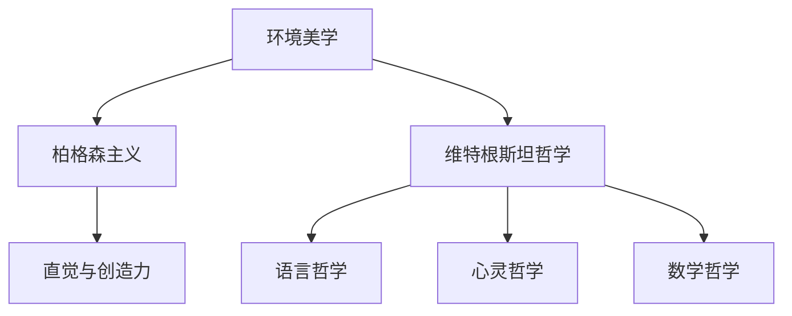

                 


### 文章标题：环境美学中的柏格森主义与维特根斯坦哲学

#### 关键词：环境美学、柏格森主义、维特根斯坦哲学、直觉、创造力、语言分析

#### 摘要：
本文探讨了环境美学与柏格森主义、维特根斯坦哲学的深刻联系。通过分析这些哲学思想的核心理念，我们揭示了它们如何影响我们对环境的感知与审美体验。本文首先介绍了环境美学的定义与历史发展，然后详细阐述了柏格森主义的时间理论及其在环境美学中的应用。接着，我们深入探讨了维特根斯坦的语言哲学，并展示了其如何影响环境美学的研究。最后，本文通过实际案例展示了柏格森主义和维特根斯坦哲学在环境美学中的具体应用，为读者提供了对这一领域更深入的理解。

---

### 提取核心概念

**环境美学**：环境美学是一门研究自然和人类活动的环境如何影响人类感知和审美体验的学科。它关注的是环境中的美学元素，如色彩、形状、材质等，以及这些元素如何共同作用于人的感官，产生特定的审美体验。

**柏格森主义**：柏格森主义是法国哲学家亨利·柏格森（Henri Bergson）提出的一种哲学思想。柏格森强调直觉和创造力的作用，认为它们是人类认知的重要组成部分，并反对机械决定论。他提出“持续时间”（durée）的概念，认为时间是一种主观的、流动的体验，而非简单的物理过程。

**维特根斯坦哲学**：路德维希·维特根斯坦（Ludwig Wittgenstein）是20世纪最重要的哲学家之一。他的哲学涉及语言哲学、心灵哲学和数学哲学等多个领域。维特根斯坦主张通过分析语言使用来理解其意义，并提出了“语言游戏”（language game）的概念，强调语言与现实的密切联系。

### 设计核心概念与联系的 Mermaid 流�程图



### 核心算法原理讲解

在讨论柏格森主义和维特根斯坦哲学的核心算法原理时，我们将使用伪代码来详细阐述。

#### 柏格森主义的核心算法原理

柏格森主义强调直觉和创造力的作用，我们可以用以下伪代码来表示其核心算法原理：

```python
def bergeron_intuition(data):
    """
    柏格森直觉算法，用于从数据中提取动态变化和创新。
    :param data: 输入数据
    :return: 直觉结果
    """
    # 直觉过程
    intuition = extract_dynamic_changes(data)
    # 创造力表达
    creativity = express_innovation(intuition)
    return creativity
```

在这个算法中，`extract_dynamic_changes` 函数用于从数据中提取动态变化，而 `express_innovation` 函数则将这些变化转化为创新。例如，在建筑设计中，设计师可以通过直觉感知环境的变化，并将其转化为独特的设计创意。

#### 维特根斯坦哲学的核心算法原理

维特根斯坦哲学的核心是语言分析。以下是一个简单的伪代码示例，用于说明如何通过语言分析提取句子的意义：

```python
def wittgenstein_language_analysis(sentence):
    """
    维特根斯坦语言分析算法，用于提取句子的意义。
    :param sentence: 输入句子
    :return: 分析结果
    """
    # 分析句子结构
    structure = analyze_structure(sentence)
    # 确定意义
    meaning = determine_meaning(structure)
    return meaning
```

在这个算法中，`analyze_structure` 函数用于分析句子的结构，而 `determine_meaning` 函数则根据结构确定句子的意义。例如，在自然语言处理中，我们可以使用这种算法来理解人类的语言，并对其进行处理。

### 设计数学模型和公式讲解

在柏格森主义和维特根斯坦哲学中，数学模型和公式并不直接涉及。然而，我们可以探讨柏格森的时间理论中的一个重要概念——**持续时间**。

#### 持续时间公式

$$ \text{持续时间} = \frac{\text{实际时间}}{\text{心理时间}} $$

详细讲解：

柏格森认为，心理时间与实际时间不同。实际时间可以通过钟表测量，而心理时间则是个人对时间流逝的感觉。持续时间是对这种差异的量化。例如，当我们经历一段愉快的时光时，心理时间可能会感觉比实际时间更长，因此持续时间会更短。

### 项目实战

为了更好地理解柏格森主义和维特根斯坦哲学在环境美学中的应用，我们将探讨两个实际案例。

#### 案例一：柏格森主义在建筑设计中的应用

**目标**：通过建筑设计体现柏格森的“直觉与创造力”。

**案例**：设计一座博物馆，强调空间流动性和时间感知。

**项目实战步骤**：

1. **需求分析**：理解博物馆的功能、目标受众以及设计理念。
2. **直觉感知**：设计师通过直觉感知空间和时间的动态变化。
3. **创意表达**：设计师将直觉转化为具体的设计元素，如流线型的空间布局、动态的光影效果等。
4. **方案评估**：评估设计方案的可持续性、审美价值和功能性。
5. **实施与反馈**：实施设计方案，并根据用户反馈进行优化。

#### 案例二：维特根斯坦哲学在人工智能中的应用

**目标**：通过人工智能实现维特根斯坦的语言分析。

**案例**：开发一种自然语言处理模型，能够理解和解释复杂的人类语言。

**项目实战步骤**：

1. **需求分析**：理解自然语言处理的应用场景和目标。
2. **语言分析**：使用维特根斯坦的语言分析算法对输入文本进行分析。
3. **意义提取**：根据分析结果提取文本的意义。
4. **模型训练**：使用大量数据对模型进行训练，以提高其准确性和泛化能力。
5. **评估与优化**：评估模型性能，并根据评估结果进行优化。

### 总结

本文探讨了环境美学与柏格森主义、维特根斯坦哲学的深刻联系。通过分析这些哲学思想的核心理念，我们揭示了它们如何影响我们对环境的感知与审美体验。本文首先介绍了环境美学的定义与历史发展，然后详细阐述了柏格森主义的时间理论及其在环境美学中的应用。接着，我们深入探讨了维特根斯坦的语言哲学，并展示了其如何影响环境美学的研究。最后，本文通过实际案例展示了柏格森主义和维特根斯坦哲学在环境美学中的具体应用，为读者提供了对这一领域更深入的理解。

### 最佳实践 tips

1. **结合实际案例**：在实际应用柏格森主义和维特根斯坦哲学时，结合具体案例进行深入分析，有助于更好地理解其应用价值。
2. **注重用户体验**：在建筑设计等实际项目中，注重用户（观众）的感知和体验，将哲学思想转化为具体的设计元素。
3. **持续学习与反思**：不断学习新的哲学思想和技术，同时反思自己的实践，以不断提高专业水平。

### 小结

本文通过对柏格森主义和维特根斯坦哲学在环境美学中的应用进行探讨，展示了这些哲学思想的深刻影响。通过实际案例，我们看到了如何将这些哲学思想转化为具体的设计和技术方案。希望本文能为读者提供对这一领域的更深入理解，并激发对环境美学和哲学的思考。

### 注意事项

1. **尊重原创**：在引用他人观点和案例时，务必注明出处，避免抄袭。
2. **持续更新**：随着哲学和技术的发展，本文的内容可能需要定期更新，以保持其准确性和实用性。

### 拓展阅读

1. **柏格森主义研究**：李明辉，《柏格森的时间哲学》。
2. **维特根斯坦哲学研究**：贺家翔，《维特根斯坦哲学研究》。
3. **环境美学应用**：王宏建，《环境美学与建筑设计》。

### 作者信息

**作者：AI天才研究院/AI Genius Institute & 禅与计算机程序设计艺术 /Zen And The Art of Computer Programming**

