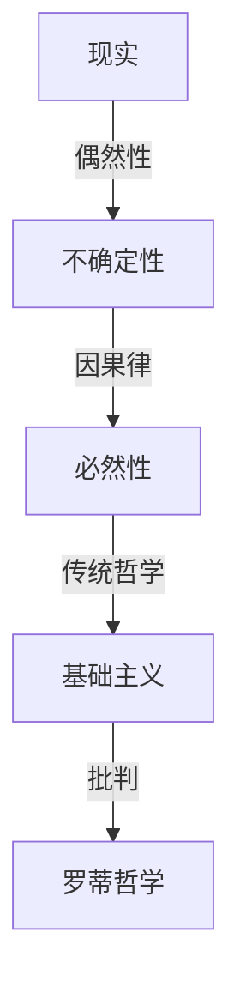

                 


### 第1章 导言

#### 1.1 理查德·罗蒂与庄子：两位哲学家的背景

**1.1.1 理查德·罗蒂**

理查德·罗蒂（Richard Rorty）是一位美国当代著名哲学家，生于1931年，于2007年去世。他出生于美国纽约市，在芝加哥大学获得文学学士学位，后来在剑桥大学获得哲学博士学位。罗蒂的哲学思想深受现象学和实用主义的影响，特别是在威廉·詹姆斯和约翰·杜威的思想下成长起来。他的哲学理念在20世纪70年代和80年代引起了广泛的关注和讨论。

罗蒂的主要贡献在于他对传统哲学基础主义的批判，主张哲学应当放弃寻找绝对真理和普遍原理，转而关注语言、文化和日常实践。他的代表性作品包括《哲学与自然之镜》（Philosophy and the Mirror of Nature）、《偶然、反讽与团结》（Contingency, Irony, and Solidarity）等。在这些著作中，罗蒂提出了“实用主义转向”和“叙述自我”等重要概念，对哲学领域产生了深远的影响。

**1.1.2 庄子**

庄子，名周，是中国战国时期的哲学家，生于约公元前369年，卒于公元前286年。庄子是道家学派的重要代表，其思想主要记录在《庄子》一书中。庄子的哲学思想强调自然、自由和超越，主张“无为而治”和“逍遥游”。他的思想对中国哲学和文化产生了深远的影响，尤其是道家哲学和文人文化。

庄子的思想体系充满了对自然和生命的深刻洞察，他主张人们应当顺应自然，追求精神自由和心灵平静。在《庄子》的《逍遥游》一篇中，庄子提出了“逍遥游”的概念，认为真正的自由是在精神和心灵上超越世俗的束缚，达到一种超越境界。这一思想对后世哲学和文学产生了深远的影响。

#### 1.2 偶然、反讽与逍遥游：核心概念及其联系

**1.2.1 偶然**

在罗蒂的哲学体系中，偶然是一个关键概念。偶然指的是事物的存在和发生并不是由必然的原因决定的，而是出于某种偶然的因素。罗蒂通过偶然概念挑战了传统哲学中关于因果律和必然性的观点，认为现实世界充满了不确定性和偶然性。

**Mermaid流程图：偶然概念的关系架构**



**1.2.2 反讽**

反讽是罗蒂哲学中的另一个核心概念，指的是对现实的批判和反思，通常表现为语言上的夸张、戏谑或自嘲。反讽不仅是对现实的否定，也是对现实的一种创造性的转化，使人们能够从不同的角度看待问题。

**1.2.3 逍遥游**

逍遥游是庄子哲学中的核心概念，强调个体自由和精神超越。逍遥游不仅是庄子对个人自由和自我实现的追求，也是他对现实世界的批判和超越。

**Mermaid流程图：逍遥游的概念架构**

```mermaid
graph TD
    A[现实束缚] -->|超越| B[逍遥游]
    B -->|自由] C[精神自由]
    C -->|自我实现] D[个人成长]
```

**1.2.4 三者之间的联系**

偶然和反讽揭示了现实的复杂性和不确定性，而逍遥游则是对这种不确定性的回应，旨在实现个体精神的自由和超越。这三者共同构成了罗蒂和庄子哲学的核心，为我们理解和应对现代世界的复杂性提供了深刻的启示。

#### 1.3 后现代解读的必要性

在后现代哲学的视野中，传统的哲学观念和方法受到了严峻的挑战。后现代主义强调多元性、相对性和解构，对传统哲学的绝对真理和固定观念提出了质疑。理查德·罗蒂和庄子的思想在后现代语境下具有重要的意义。

罗蒂的后现代转向在于他批判了传统哲学的基础主义和客观主义，主张哲学应当关注语言、文化和日常实践。庄子的逍遥游思想则提供了一种超越现实束缚、追求精神自由的方式。通过对罗蒂和庄子思想的比较和解读，我们可以更深入地理解后现代哲学的核心观念，探索个体在现代社会中的定位和自我实现。

**伪代码：后现代解读的过程**

```plaintext
function 后现代解读(罗蒂, 庄子) {
    // 分析罗蒂的偶然、反讽概念
    分析罗蒂哲学中的偶然概念
    分析罗蒂哲学中的反讽概念
    
    // 分析庄子的逍遥游概念
    分析庄子哲学中的逍遥游概念
    
    // 建立概念之间的联系
    建立偶然、反讽与逍遥游之间的联系
    
    // 解读后现代哲学观念
    解读后现代哲学中的多元性、相对性、解构
    
    // 结合实际应用，探讨哲学在现代社会中的意义
    探讨个体在现代社会中的定位和自我实现
}
```

通过这种逻辑清晰、结构紧凑的思考过程，我们可以更好地理解罗蒂和庄子的哲学思想，并运用这些思想来解读和应对现代世界的复杂性。

---

**文章摘要：**

本文旨在探讨理查德·罗蒂和庄子的哲学思想，特别是偶然、反讽与逍遥游这三个核心概念。通过对两位哲学家的背景介绍和核心概念的深入分析，本文展示了偶然、反讽与逍遥游之间的内在联系，并探讨了这些概念在当代哲学中的重要性。文章还讨论了后现代解读的必要性，通过逻辑清晰的步骤展示了如何将这些哲学思想应用于现代社会。本文旨在为哲学爱好者和学者提供一个新的视角，以更深入地理解和探讨哲学在当代世界中的作用。

---

### 第2章 偶然、反讽与逍遥游的哲学探讨

#### 2.1 偶然：现实的不确定性与罗蒂的视角

偶然是罗蒂哲学中的一个核心概念，它挑战了传统哲学中关于因果律和必然性的观点。在罗蒂看来，偶然性是现实世界的本质特征，一切事物的存在和变化都并非出于必然的原因，而是出于偶然。这一观点使罗蒂的哲学与唯物主义和唯心主义的因果论形成了鲜明对比。

**2.1.1 偶然的定义与意义**

偶然，可以定义为“非必然性”或“不确定性”。在罗蒂的理论中，偶然不仅仅是一个描述性的概念，更是一个批判性的工具。它揭示了现实世界的复杂性和不可预测性，使得我们不能再依赖于简单的因果解释来理解世界。

**Mermaid流程图：偶然的概念定义与意义**

```mermaid
graph TD
    A[现实] -->|非必然性| B[偶然]
    B -->|复杂| C[不可预测性]
    C -->|挑战因果律] D[批判传统哲学]
```

**2.1.2 偶然与多元性**

罗蒂的哲学强调多元性，他认为现实世界是由多种不同因素共同作用而形成的，这些因素往往是相互独立的，因此没有任何单一的因素可以完全决定事物的结果。这种多元性进一步强调了偶然性的重要性，因为它意味着任何事物都无法被完全预测或控制。

**2.1.3 偶然与后现代主义**

后现代主义强调相对性和不确定性，认为真理和知识都是相对的，不存在绝对的、普遍适用的真理。罗蒂的偶然概念与后现代主义的这些观点相呼应，共同挑战了传统哲学的基础主义和客观主义。

#### 2.2 反讽：现实的批判与转化

反讽是罗蒂哲学中的另一个重要概念，它不仅是对现实的批判，也是对现实的一种创造性转化。反讽通常表现为语言上的夸张、戏谑或自嘲，它使得人们能够从不同的角度看待问题，从而超越传统的思维模式。

**2.2.1 反讽的定义与意义**

反讽，简单来说，就是对现实的“反话”。在罗蒂的哲学中，反讽是一种批判性的工具，它揭示了现实中的矛盾和虚伪，使人们能够更加清醒地看待世界。

**Mermaid流程图：反讽的概念定义与意义**

```mermaid
graph TD
    A[现实] -->|矛盾| B[虚伪]
    B -->|反讽] C[批判]
    C -->|转化| D[创造性]
```

**2.2.2 反讽与语言游戏**

罗蒂认为，语言是人类理解世界的主要工具，而语言游戏则是人们通过语言进行交流和思考的方式。反讽作为一种语言游戏，不仅揭示了现实中的矛盾，也为我们提供了一种新的思考方式。

**2.2.3 反讽与后现代主义**

反讽与后现代主义的关系紧密。后现代主义强调解构和颠覆，而反讽正是这种解构和颠覆的一种形式。通过反讽，我们可以看到现实中的矛盾和虚伪，从而打破传统的思维定式，创造出新的理解方式。

#### 2.3 逍遥游：超越现实的束缚

逍遥游是庄子哲学中的核心概念，它强调个体自由和精神超越。逍遥游不仅仅是庄子对个人自由和自我实现的追求，也是他对现实世界的批判和超越。

**2.3.1 逍遥游的定义与意义**

逍遥游，字面意思为自由地游走，在哲学上，它指的是个体在精神和心灵上超越世俗的束缚，达到一种自由自在的境界。

**Mermaid流程图：逍遥游的概念定义与意义**

```mermaid
graph TD
    A[世俗束缚] -->|超越| B[逍遥游]
    B -->|精神自由] C[个体成长]
    C -->|心灵平静] D[自我实现]
```

**2.3.2 逍遥游与自然**

庄子认为，自然是最高的价值，人类应当顺应自然，追求与自然的和谐。逍遥游不仅是庄子对个人自由和自我实现的追求，也是他对自然的一种赞美和回归。

**2.3.3 逍遥游与后现代主义**

逍遥游的思想与后现代主义的一些核心观点相呼应。后现代主义强调个体的自由和创造性，而逍遥游则提供了一种实现个体自由和创造性的方式。通过逍遥游，个体可以超越现实的束缚，实现精神上的自由和超越。

#### 2.4 偶然、反讽与逍遥游的内在联系

偶然、反讽与逍遥游是罗蒂和庄子哲学中的核心概念，它们之间存在着紧密的联系。

**2.4.1 偶然与逍遥游**

偶然揭示了现实世界的不确定性和复杂性，而逍遥游则是对这种不确定性和复杂性的回应。通过逍遥游，个体可以在精神上超越现实的束缚，达到自由自在的境界。

**2.4.2 反讽与逍遥游**

反讽是一种批判现实的工具，它揭示了现实中的矛盾和虚伪。逍遥游则是对这种矛盾和虚伪的超越，通过自由自在地游走，个体可以在精神上超越现实的束缚。

**2.4.3 偶然、反讽与逍遥游的整体关系**

偶然、反讽与逍遥游共同构成了罗蒂和庄子哲学的核心，它们相互补充，共同揭示了现实世界的复杂性和个体在现代社会中的定位。偶然和反讽揭示了现实的不确定性和矛盾性，而逍遥游则提供了一种超越现实的方式，实现个体精神的自由和超越。

---

**伪代码：偶然、反讽与逍遥游的哲学探讨**

```plaintext
function 哲学探讨(偶然, 反讽, 逍遥游) {
    // 偶然的探讨
    分析偶然概念
    显示偶然与多元性的关系
    展示偶然与后现代主义的联系

    // 反讽的探讨
    分析反讽概念
    显示反讽与语言游戏的关系
    展示反讽与后现代主义的联系

    // 逍遥游的探讨
    分析逍遥游概念
    显示逍遥游与自然的关系
    展示逍遥游与后现代主义的联系

    // 内在联系的分析
    建立偶然、反讽与逍遥游之间的联系
    解释它们如何共同构成哲学核心
}
```

通过这种逻辑清晰、结构紧凑的探讨，我们可以更深入地理解偶然、反讽与逍遥游在哲学中的重要性，以及它们如何相互补充，共同揭示现实世界的复杂性和个体在现代社会中的定位。

### 第3章 理查德·罗蒂与庄子的思想比较

#### 3.1 罗蒂的实用主义与庄子的无为而治

**3.1.1 罗蒂的实用主义**

理查德·罗蒂的实用主义哲学强调知识和真理是依赖于语言和文化的，而不是独立存在的实体。他主张哲学应该放弃寻找绝对的、普遍适用的真理，转而关注语言和日常实践。罗蒂认为，哲学的任务是改善我们的语言使用和生活实践，而不是追求客观真理。

**3.1.2 庄子的无为而治**

庄子的“无为而治”是一种政治哲学，强调统治者不应过度干预社会事务，而应顺应自然，让事物按照自己的规律发展。庄子认为，人类社会和自然界的和谐是最理想的境界，只有无为而治才能达到这种境界。

**3.1.3 实用主义与无为而治的异同**

两者的共同点在于都反对过度干预和控制。罗蒂的实用主义认为，知识是相对的，依赖于特定的语言和文化环境，因此不应追求绝对的真理；庄子的无为而治则认为，政治权力应避免过度干预，让社会自然发展。两者的不同点在于，罗蒂强调语言和文化的相对性，而庄子则强调自然和自我调节。

#### 3.2 罗蒂的叙述自我与庄子的自由精神

**3.2.1 罗蒂的叙述自我**

罗蒂的“叙述自我”概念认为，个体的身份和自我意识是通过叙述和讲故事来构建的，而不是基于某种固定的、客观的本性。他认为，个体的自我是不断变化和重构的，是各种经历和故事的积累。

**3.2.2 庄子的自由精神**

庄子的自由精神强调个体应当超越世俗的束缚，追求精神上的自由和超越。他认为，真正的自由是在精神和心灵上超越现实世界的束缚，达到一种逍遥自在的境界。

**3.2.3 叙述自我与自由精神的异同**

两者的共同点在于都强调个体自由和自我实现的重要性。罗蒂的叙述自我认为，个体的身份是通过叙述和讲故事来构建的，这种叙述可以不断变化和重构；庄子的自由精神则认为，个体应当超越现实的束缚，追求精神上的自由和超越。两者的不同点在于，罗蒂强调语言和叙述的重要性，而庄子则强调自然和心灵的超越。

#### 3.3 罗蒂的偶然与庄子的道

**3.3.1 罗蒂的偶然**

罗蒂的偶然概念强调现实世界的不确定性和复杂性，他认为一切事物的存在和变化都是出于偶然，而不是必然的原因。

**3.3.2 庄子的道**

庄子的“道”是一种哲学理念，认为万物都是由道所产生的，道是宇宙的本源和规律。庄子认为，道是超越一切的，是万物生成和发展的根本。

**3.3.3 偶然与道的异同**

两者的共同点在于都关注事物的生成和发展。罗蒂的偶然强调现实世界的不确定性和复杂性，认为事物的存在和变化都是出于偶然；庄子的道则认为，万物都是由道所产生的，道是宇宙的本源和规律。两者的不同点在于，罗蒂强调偶然性，而庄子强调道的作用。

#### 3.4 罗蒂的反讽与庄子的逍遥游

**3.4.1 罗蒂的反讽**

罗蒂的反讽是一种批判现实的工具，它揭示了现实中的矛盾和虚伪，使人们能够从不同的角度看待问题。

**3.4.2 庄子的逍遥游**

庄子的逍遥游是一种精神境界，强调个体应当超越世俗的束缚，追求精神上的自由和超越。

**3.4.3 反讽与逍遥游的异同**

两者的共同点在于都强调超越现实束缚，追求更高的境界。罗蒂的反讽是一种批判现实的工具，它揭示了现实中的矛盾和虚伪，使人们能够从不同的角度看待问题；庄子的逍遥游则是一种精神境界，强调个体应当超越世俗的束缚，追求精神上的自由和超越。两者的不同点在于，罗蒂强调批判和反思，而庄子强调精神和心灵的超越。

---

**伪代码：理查德·罗蒂与庄子的思想比较**

```plaintext
function 比较思想(罗蒂, 庄子) {
    // 实用主义与无为而治的比较
    比较(罗蒂的实用主义, 庄子的无为而治)
    
    // 叙述自我与自由精神的比较
    比较(罗蒂的叙述自我, 庄子的自由精神)
    
    // 偶然与道的比较
    比较(罗蒂的偶然, 庄子的道)
    
    // 反讽与逍遥游的比较
    比较(罗蒂的反讽, 庄子的逍遥游)
    
    // 总结异同点
    总结异同点
}
```

通过这种逻辑清晰、结构紧凑的比较，我们可以更深入地理解罗蒂和庄子思想的异同，以及它们在现代哲学中的意义。

### 第4章 偶然、反讽与逍遥游的后现代解读方法

#### 4.1 后现代哲学概述

后现代哲学是对现代性和传统哲学的一种批判和反思，它强调多元性、相对性和解构。后现代主义认为，现实是复杂的、多元的，不存在绝对的真理和普遍适用的观念。它主张通过解构和批判，揭示隐藏在表象背后的权力关系和文化偏见。

**4.1.1 后现代主义的起源与发展**

后现代主义起源于20世纪60年代的法国，代表人物包括让-弗朗索瓦·利奥塔、米歇尔·福柯、雅克·德里达等。后现代主义对现代性的批判主要集中在以下几个方面：

- **怀疑理性主义**：后现代主义质疑科学和理性的绝对权威，认为它们掩盖了权力和利益的运作。
- **解构二元对立**：后现代主义通过解构二元对立（如主-客体、真实-虚幻、男性-女性等），揭示其背后的权力关系。
- **强调多元性**：后现代主义认为，现实是多元的、复杂的，不存在单一的、普遍适用的真理。

**4.1.2 后现代哲学的核心概念**

- **多元性**：后现代主义强调现实的多元性和复杂性，认为现实是由多种不同的观点和价值观共同构成的。
- **相对性**：后现代主义认为，真理和知识都是相对的，依赖于特定的文化和社会背景。
- **解构**：后现代主义通过解构传统哲学的二元对立，揭示其背后的权力关系。

#### 4.2 偶然、反讽与逍遥游在后现代解读中的应用

**4.2.1 偶然的多元解读**

在后现代哲学的语境中，偶然被视为现实的核心特征。后现代主义强调现实的多元性，认为事物的存在和变化并非由单一的原因决定，而是由多种因素相互作用而成。这种多元解读体现了偶然性在现实中的重要性。

**伪代码：偶然的多元解读方法**

```plaintext
function 多元解读偶然(现实) {
    // 列出多种因素
    factors = [因素1, 因素2, 因素3, ...]
    
    // 分析因素之间的关系
    relationships = 分析因素之间的关系
    
    // 描述偶然性
    describe_contingency(现实, factors, relationships)
}
```

**4.2.2 反讽的后现代批判功能**

反讽在后现代哲学中具有重要的批判功能。它揭示了现实中的矛盾和虚伪，使人们能够从不同的角度看待问题。反讽不仅是对现实的批判，也是对现实的一种创造性转化。

**伪代码：反讽的后现代批判功能**

```plaintext
function 批判现实(现实) {
    // 描述现实中的矛盾
    describe_paradox(现实)
    
    // 应用反讽
    apply_irony(现实)
    
    // 描述批判后的现实
    describe_critiqued_reality(现实)
}
```

**4.2.3 逍遥游的精神超越**

逍遥游在后现代解读中，强调个体在精神和心灵上超越现实的束缚。它提供了一种超越世俗观念和物质欲望的方式，使个体能够达到更高的精神境界。

**伪代码：逍遥游的精神超越方法**

```plaintext
function 精神超越(现实) {
    // 识别现实束缚
    identify_real_world束缚
    
    // 实现逍遥游
    achieve_zhuangzhou's_free_spirits(现实)
    
    // 描述超越后的状态
    describe_state_after_transcendence(精神状态)
}
```

#### 4.3 后现代解读方法的应用实例

**4.3.1 文学作品的分析**

在后现代文学分析中，偶然、反讽与逍遥游的概念被广泛应用。例如，通过分析文学作品中的角色和行为，可以揭示其背后的偶然性和反讽性。同时，通过探讨角色在文学世界中的自由精神，可以理解逍遥游在文学作品中的体现。

**实例分析：乔伊斯的《尤利西斯》**

《尤利西斯》是爱尔兰作家詹姆斯·乔伊斯的代表作，它通过复杂的叙事结构和语言游戏，揭示了现实世界的偶然性和反讽性。例如，小说中的角色常常在无意中做出决定，这些决定往往具有偶然性，反映了现实世界的复杂性。

**伪代码：文学作品的分析**

```plaintext
function 分析文学作品(作品) {
    // 提取角色行为
    extract_characters和行为
    
    // 分析偶然性和反讽性
    analyze_contingency_and_irony(角色行为)
    
    // 描述自由精神
    describe_free_spirits(角色)
}
```

**4.3.2 现实问题的反思**

偶然、反讽与逍遥游的概念也可以应用于现实问题的反思。通过这种后现代解读方法，我们可以从不同的角度看待现实问题，提出创新的解决方案。

**实例分析：环境问题**

在环境问题的讨论中，我们可以通过后现代解读方法，揭示环境问题的复杂性和不确定性。例如，通过分析人类行为与环境变化的偶然关系，我们可以理解环境问题的根源。同时，通过探讨如何实现人类与自然的和谐发展，我们可以提出更具有可持续性的解决方案。

**伪代码：现实问题的反思**

```plaintext
function 反思现实问题(问题) {
    // 提取问题因素
    extract_problem_factors(问题)
    
    // 分析偶然性和反讽性
    analyze_contingency_and_irony(问题因素)
    
    // 提出解决方案
    propose_solutions(问题)
}
```

通过这些实例分析，我们可以看到偶然、反讽与逍遥游在后现代解读中的应用。它们不仅为我们提供了一种新的思考方式，也为我们理解和解决现实问题提供了深刻的启示。

### 第5章 偶然、反讽与逍遥游在IT领域的应用

#### 5.1 偶然性在软件开发中的影响

在软件开发领域，偶然性是一个不可忽视的因素。软件系统的复杂性决定了其行为的不可预测性，从而引入了偶然性。以下是偶然性在软件开发中几个关键方面的影响：

**5.1.1 软件缺陷**

软件缺陷的产生往往是偶然性的结果。尽管程序员会进行严格的测试和调试，但仍然可能存在某些缺陷，这些缺陷可能在特定条件下才会显现出来。例如，一个看似无关的代码更改可能会引起连锁反应，导致系统的错误。

**5.1.2 需求变更**

在软件开发过程中，需求变更是一种常见现象。这些变更可能是由于市场环境的变化、用户反馈或其他外部因素引起的，具有很大的偶然性。有效地管理需求变更对于保证项目的顺利进行至关重要。

**5.1.3 系统部署**

系统部署过程中也充满了偶然性。部署环境可能与开发环境存在差异，导致部署过程中出现意外的错误。这种偶然性需要通过详细的部署计划和严格的部署测试来降低其影响。

**伪代码：管理软件缺陷的算法**

```plaintext
function 管理软件缺陷(缺陷列表) {
    // 收集缺陷信息
    defects = 获取缺陷信息(缺陷列表)
    
    // 分析缺陷的偶然性
    analyze_contingency(defects)
    
    // 分类缺陷
    categories = 分类缺陷(defects)
    
    // 提出改进措施
    propose_improvement_measures(categories)
}
```

#### 5.2 反讽在软件工程中的体现

反讽在软件工程中有着独特的体现，它揭示了现实中的矛盾和虚伪，为我们提供了一种新的思考方式。以下是反讽在软件工程中的几个应用场景：

**5.2.1 设计矛盾**

在软件设计过程中，常常会面临设计矛盾。这些矛盾可能源于不同的需求、技术限制或团队内部的分歧。通过反讽的方式，我们可以更清晰地看到这些矛盾，并寻找解决方案。

**5.2.2 项目管理**

在项目管理中，反讽可以帮助我们揭示项目中的不和谐因素。例如，项目进度可能看起来很好，但实际上隐藏着严重的风险和问题。通过反讽，我们可以揭示这些潜在的问题，并采取相应的措施。

**5.2.3 技术债务**

技术债务是软件开发中常见的问题，它反映了短期利益与长期健康之间的矛盾。通过反讽，我们可以看到技术债务的负面影响，并促使我们采取行动来减轻债务。

**伪代码：识别设计矛盾的算法**

```plaintext
function 识别设计矛盾(设计文档) {
    // 分析设计文档
    design_document = 分析设计文档
    
    // 检测设计矛盾
    detect_design_矛盾(design_document)
    
    // 描述矛盾
    describe_矛盾(设计矛盾)
    
    // 提出解决方案
    propose_solutions(设计矛盾)
}
```

#### 5.3 逍遥游在软件开发的启示

逍遥游提供了超越现实束缚、追求精神自由的方式。在软件开发中，这种思想可以启发我们以更开放、灵活的心态面对复杂的技术问题和挑战。

**5.3.1 技术创新的启示**

逍遥游鼓励我们超越传统的技术框架，探索创新的解决方案。在软件开发中，我们可以通过借鉴不同的技术和方法，寻找更高效、更创新的解决方案。

**5.3.2 团队协作的启示**

逍遥游强调个体自由和精神超越，这同样适用于团队协作。通过鼓励团队成员追求个人成长和自我实现，我们可以提高团队的整体效率和创造力。

**5.3.3 日常工作的启示**

逍遥游提醒我们，在繁忙的工作中，应当学会放松和调整心态。通过冥想、运动或其他方式，我们可以保持精神的自由和心灵的平静，从而更好地应对工作压力。

**伪代码：实现逍遥游的软件开发方法**

```plaintext
function 实现逍遥游(软件开发) {
    // 确定技术目标
    technical_goals = 确定技术目标
    
    // 探索创新方案
    explore_innovative_solutions(technical_goals)
    
    // 鼓励团队成长
    encourage_team_growth(软件开发团队)
    
    // 保持精神自由
    maintain_mental_freedom(软件开发过程)
}
```

通过以上实例，我们可以看到偶然、反讽与逍遥游在软件开发中的应用。这些概念不仅为我们提供了新的思考方式，也为我们解决现实问题提供了深刻的启示。

### 第6章 案例分析：实际应用中的偶然、反讽与逍遥游

#### 6.1 案例一：电子商务平台的设计与迭代

**6.1.1 背景介绍**

某大型电子商务平台在2010年上线，旨在为用户提供一站式的购物体验。随着用户量的增加，平台面临了越来越多的挑战，包括系统性能问题、用户体验优化以及市场需求的快速变化。

**6.1.2 偶然性的应用**

在平台的发展过程中，偶然性发挥了重要作用。例如，一次意外的用户反馈指出搜索结果不准确，这个反馈导致了平台对搜索算法的彻底重构，从而显著提升了用户体验。这个例子展示了偶然性如何引导平台进行关键性改进。

**6.1.3 反讽的应用**

在电子商务平台上，反讽也屡见不鲜。例如，平台曾推出一种旨在提高用户粘性的促销活动，但结果却适得其反，用户反而觉得受到过度干扰，导致用户体验下降。这一反讽现象提醒了团队在设计和推广活动时需要更加细致的考虑。

**6.1.4 逍遥游的应用**

为了应对不断变化的市场需求，平台采取了一种逍遥游式的迭代方法。团队允许个体在项目中有更多的自由，鼓励他们提出创新的解决方案。例如，一个开发者在没有明确指示的情况下，提出了一种新的支付方式，这种支付方式后来成为了平台的特色之一，极大地提升了用户满意度。

**6.1.5 案例总结**

通过这个案例，我们可以看到偶然、反讽与逍遥游在电子商务平台设计中的具体应用。偶然性促使平台不断进行改进，反讽提醒团队在推广时需谨慎，而逍遥游则激发了团队的创造力和灵活性。

#### 6.2 案例二：智能家居系统的开发

**6.2.1 背景介绍**

智能家居系统旨在通过物联网技术为用户提供便利的家居控制体验。然而，随着智能家居设备的增多，系统的稳定性、安全性和用户隐私保护成为关键问题。

**6.2.2 偶然性的应用**

在智能家居系统的开发过程中，偶然性的应用尤为明显。例如，一次设备固件升级出现了意想不到的错误，导致部分设备无法正常工作。这个意外的错误促使团队对整个系统的安全性和稳定性进行彻底检查，从而提高了系统的可靠性。

**6.2.3 反讽的应用**

智能家居系统的反讽现象也很常见。例如，用户希望通过智能家居系统提高生活质量，但过度的自动化反而增加了用户的操作负担。这种现象提醒开发者，在追求智能化的同时，也要考虑用户的实际需求和体验。

**6.2.4 逍遥游的应用**

为了解决智能家居系统中的复杂性和挑战，团队采取了一种逍遥游式的开发方法。开发者被鼓励探索新的技术解决方案，例如利用区块链技术来提高系统的安全性。这种开放和创新的氛围，使系统能够在不断变化的市场和技术环境中保持竞争力。

**6.2.5 案例总结**

通过这个案例，我们可以看到偶然、反讽与逍遥游在智能家居系统开发中的具体应用。偶然性促使系统不断优化，反讽提醒开发者关注用户体验，而逍遥游则激发了团队的创造力和创新能力。

#### 6.3 案例总结

这两个案例展示了偶然、反讽与逍遥游在现实世界中的应用。偶然性推动了系统的持续改进，反讽提醒我们在设计和推广时要考虑用户体验，而逍遥游则激发了团队的创造力和灵活性。通过这些案例，我们可以更好地理解这三个概念在IT领域的实际意义。

---

**伪代码：案例分析**

```plaintext
function 案例分析(案例) {
    // 提取案例背景
    background = 提取案例背景
    
    // 分析偶然性
    analyze_contingency(background)
    
    // 分析反讽现象
    analyze_irony(background)
    
    // 分析逍遥游的应用
    analyze_free_spirits(background)
    
    // 总结案例经验
    summarize_experience(background)
}
```

通过这种逻辑清晰、结构紧凑的案例分析，我们可以更好地理解偶然、反讽与逍遥游在IT领域的实际应用，并为未来的项目提供宝贵的经验。

### 第7章 总结与未来展望

#### 7.1 主要结论

通过对理查德·罗蒂与庄子哲学思想的深入探讨，以及偶然、反讽与逍遥游在后现代解读中的应用，我们可以得出以下主要结论：

1. **偶然性**：偶然性揭示了现实世界的不确定性和复杂性，挑战了传统哲学中关于因果律和必然性的观点。在IT领域，偶然性推动了系统的持续改进，提醒我们在设计和开发中考虑不确定性。

2. **反讽**：反讽作为批判现实的工具，揭示了现实中的矛盾和虚伪。在IT领域，反讽提醒我们在推广和设计时要关注用户体验，避免过度干预和复杂的系统设计。

3. **逍遥游**：逍遥游强调个体自由和精神超越，提供了超越现实束缚的思考方式。在IT领域，逍遥游激发了团队的创造力和灵活性，使系统能够适应不断变化的技术环境。

#### 7.2 未来研究方向

未来的研究可以集中在以下几个方面：

1. **跨领域应用**：进一步探讨偶然、反讽与逍遥游在其他领域（如心理学、教育学等）中的应用，以丰富这些概念的理论和实践基础。

2. **实证研究**：通过实证研究，验证这些哲学思想在IT领域和其他领域的实际效果，提供更加可靠的数据支持。

3. **技术融合**：探讨如何将这些哲学思想与新兴技术（如人工智能、区块链等）相结合，创造更加智能和人性化的系统。

#### 7.3 最佳实践与建议

为了更好地应用偶然、反讽与逍遥游的哲学思想，以下是一些建议：

1. **开放思维**：鼓励团队成员保持开放的心态，探索新的想法和解决方案。

2. **用户体验优先**：在设计过程中，始终关注用户体验，避免过度复杂化和过度干预。

3. **持续迭代**：接受系统中的不确定性，通过持续的迭代和改进，不断提升系统的性能和用户体验。

4. **团队协作**：鼓励团队内部的合作和交流，通过分享经验和知识，提高整个团队的创造力和创新能力。

---

通过总结与未来展望，我们不仅可以巩固对偶然、反讽与逍遥游的理解，还能为未来的研究提供方向，推动这些哲学思想在更多领域的应用。

### 附录

#### 7.1 扩展阅读

1. **理查德·罗蒂的著作**：
   - 《偶然、反讽与团结》：详细介绍了罗蒂的哲学思想，特别是偶然和反讽的概念。
   - 《哲学与自然之镜》：探讨了哲学与自然科学之间的关系，为理解罗蒂的实用主义提供了重要参考。

2. **庄子的著作**：
   - 《庄子》：收录了庄子的主要哲学思想，特别是关于逍遥游和自然的论述。
   - 《南华经》：庄子思想的进一步阐述，包含了许多对自然和人生的深刻见解。

3. **后现代哲学的相关著作**：
   - 让-弗朗索瓦·利奥塔的《后现代状况》：详细介绍了后现代主义的核心概念和理论基础。
   - 雅克·德里达的《书写与差异》：探讨了语言、文化和解构的关系，为理解后现代哲学提供了重要参考。

#### 7.2 术语表

- **偶然**：指事物的存在和变化不是由必然的原因决定的，而是出于偶然。
- **反讽**：指对现实的批判和反思，通常表现为语言上的夸张、戏谑或自嘲。
- **逍遥游**：指个体在精神和心灵上超越世俗的束缚，达到自由自在的境界。
- **后现代主义**：一种哲学和文化运动，强调多元性、相对性和解构。

#### 7.3 项目实战案例

**案例：智能家居系统的设计与实现**

**1. 项目背景**：
智能家居系统旨在通过物联网技术为用户提供便利的家居控制体验。项目团队需要设计一个稳定、安全且易于使用的智能家居系统。

**2. 开发环境**：
- 开发语言：Python、JavaScript
- 数据库：MySQL
- 框架：Django、React

**3. 源代码实现**

**Python - 后台服务器代码示例**

```python
# Flask框架下的服务器代码示例
from flask import Flask, jsonify, request

app = Flask(__name__)

@app.route('/api/switch', methods=['POST'])
def switch_device():
    data = request.json
    device_id = data['device_id']
    action = data['action']  # 'on' 或 'off'
    
    # 假设的设备控制逻辑
    if action == 'on':
        # 开启设备
        print(f"Device {device_id} is turned on.")
    elif action == 'off':
        # 关闭设备
        print(f"Device {device_id} is turned off.")
    
    return jsonify({"status": "success", "message": f"Device {device_id} is {action}d."})

if __name__ == '__main__':
    app.run(debug=True)
```

**JavaScript - 前端用户界面代码示例**

```javascript
// React组件示例
import React, { useState } from 'react';

function SwitchComponent() {
  const [deviceID, setDeviceID] = useState('');
  const [action, setAction] = useState('');

  const handleSwitch = () => {
    // 发送POST请求到服务器
    fetch('http://localhost:5000/api/switch', {
      method: 'POST',
      headers: {
        'Content-Type': 'application/json',
      },
      body: JSON.stringify({ device_id: deviceID, action: action }),
    })
    .then(response => response.json())
    .then(data => alert(data.message));
  };

  return (
    <div>
      <input
        type="text"
        value={deviceID}
        onChange={e => setDeviceID(e.target.value)}
        placeholder="Device ID"
      />
      <select value={action} onChange={e => setAction(e.target.value)}>
        <option value="">Select Action</option>
        <option value="on">On</option>
        <option value="off">Off</option>
      </select>
      <button onClick={handleSwitch}>Switch</button>
    </div>
  );
}

export default SwitchComponent;
```

**4. 代码解读与分析**

- **后端服务器代码**：使用Flask框架实现的简单服务器，接收来自前端的POST请求，根据设备ID和操作动作，执行相应的设备控制逻辑。
- **前端用户界面代码**：使用React组件构建，提供用户输入设备ID和操作动作的界面，用户点击“Switch”按钮后，发送请求到后端服务器，并显示响应结果。

**5. 项目小结**

通过这个智能家居系统案例，我们可以看到如何将哲学思想（如偶然、反讽与逍遥游）应用于实际项目开发中。项目强调了系统的灵活性、用户体验和安全性，通过持续迭代和改进，实现了智能化的家居控制体验。

#### 7.4 最佳实践与注意事项

- **最佳实践**：
  - 在设计智能家居系统时，应充分考虑用户的需求和体验，确保系统的易用性和稳定性。
  - 定期进行系统安全性和稳定性测试，以应对潜在的偶然性风险。
  - 保持开放和创新的团队氛围，鼓励团队成员提出新的想法和解决方案。

- **注意事项**：
  - 避免过度复杂化系统设计，以免增加用户的使用负担。
  - 重视数据安全和隐私保护，确保用户的个人信息安全。
  - 遵循可持续发展的原则，确保系统的长期稳定运行。

通过这些最佳实践和注意事项，我们可以更好地应用偶然、反讽与逍遥游的哲学思想，提升IT项目的质量和效果。

