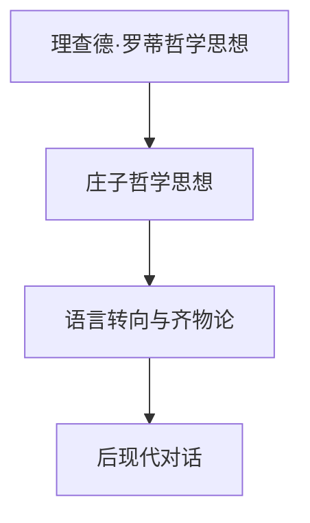
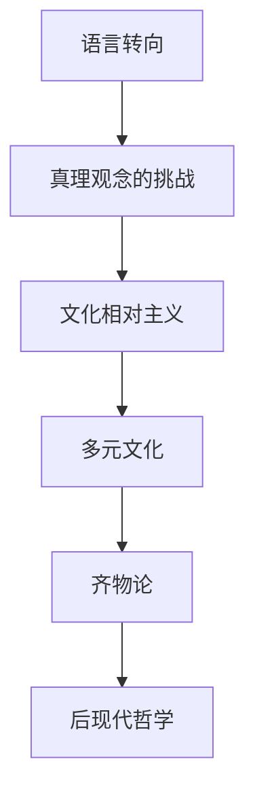

                 

# 《理查德·罗蒂与庄子：语言转向与齐物论的后现代对话》

## 引言

### 对话的背景

在哲学的广阔天空中，东西方两大哲学体系——西方哲学和东方哲学，各自发展出了独特的思维方式和理论体系。理查德·罗蒂（Richard Rorty）是20世纪美国著名的后现代哲学家，他以其独特的哲学观点和对传统哲学的批判而著称。另一方面，庄子是中国古代哲学的杰出代表，他的齐物论（Zhuangzi's Zhuangzi）是道家哲学的核心篇章之一，探讨了世界的相对性和语言的局限。

本文旨在通过理查德·罗蒂与庄子的对话，探讨语言转向（linguistic turn）与齐物论在后现代哲学中的对话可能性。语言转向是20世纪哲学的一个重要趋势，它强调语言在思维和知识构建中的核心作用。而齐物论则提出了一种超越语言和概念的宇宙观，强调万物平等和相对主义。

### 语言转向与齐物论的意义

语言转向和齐物论都是对传统哲学观念的深刻反思和批判。语言转向挑战了本质主义和理性主义的传统哲学基础，认为知识并非来自于客观世界，而是通过语言构建的。齐物论则主张万物平等，否定了一切形式的绝对真理，强调个体的相对性和主观性。

在后现代哲学中，语言转向与齐物论的对话具有重要的意义。它们共同挑战了传统哲学的权威，提倡多元和包容的思维方式。通过这种对话，我们可以更深入地理解语言和认知的本质，以及它们在后现代哲学中的应用。

## 第一部分：引论

### 第1章 理查德·罗蒂与庄子的对话背景

#### 理查德·罗蒂哲学思想概述

理查德·罗蒂（Richard Rorty，1931-2007）是美国著名的哲学家，以其后现代哲学观点和对传统哲学的批判而著称。罗蒂的主要哲学观点包括怀疑论、反本质主义和实用主义。

怀疑论是罗蒂哲学的核心，他认为我们无法获得关于世界的绝对知识，因为语言和认知过程本身就是主观的。这种怀疑论立场使罗蒂反对本质主义，认为不存在客观的、不变的实体或本质。

反本质主义是罗蒂的另一重要观点，他主张知识不是通过发现客观真理而获得的，而是通过语言和文化的建构。罗蒂认为，知识是一种社会建构，受到语言和文化的限制。

实用主义则是罗蒂哲学的方法论，他认为哲学的任务是提出有用的问题，而不是寻找绝对的答案。这种实用主义立场使得罗蒂的哲学更加贴近日常生活，强调哲学与现实的联系。

#### 庄子哲学思想概述

庄子（约前369-前286年）是中国古代哲学家，道家学派的重要代表。庄子的哲学思想主要体现在他的著作《庄子》中，其中齐物论是核心篇章之一。

庄子的哲学思想主要包括道、无为和齐物论。道是庄子哲学的核心概念，他将其视为宇宙的本原和万物的根源。无为是庄子的行为哲学，主张放弃主观意志，顺应自然。

齐物论是庄子哲学的精髓，它探讨了世界的相对性和语言的局限。庄子认为，万物都是相对的，不存在绝对的真理或本质。语言只是人类认知世界的工具，但它也限制了我们的视野。

#### 语言转向与齐物论在后现代哲学中的意义

语言转向和齐物论在后现代哲学中具有重要意义。语言转向挑战了传统哲学的基础，认为知识是通过语言构建的，而非直接来自客观世界。齐物论则提供了对语言和认知的深刻反思，强调了万物的相对性和主观性。

在后现代哲学中，语言转向和齐物论的对话有助于我们重新思考语言、认知和知识的关系。通过这种对话，我们可以更好地理解后现代哲学的核心问题，如相对主义、怀疑论和文化建构。

### 第2章 后现代哲学中的语言转向

#### 传统哲学与语言的关系

传统哲学往往将语言视为一种工具，用于表达和传达知识。亚里士多德（Aristotle）认为，语言是人类思维的表达形式，是理解和沟通的基础。康德（Immanuel Kant）则认为，语言是认知的先决条件，它决定了我们的认知方式。

然而，随着20世纪哲学的发展，语言在哲学中的地位逐渐上升。语言转向（linguistic turn）是20世纪哲学的一个重要趋势，它强调语言在思维和知识构建中的核心作用。语言转向的倡导者认为，语言不仅是知识的载体，更是知识的创造者。

#### 语言转向的概念与理论

语言转向的概念源于语言哲学（philosophy of language）的发展。语言哲学关注语言的本质、功能和应用，探讨语言与思维、语言与认知的关系。

语言转向的理论主要包括以下观点：

1. **语言中心论**：认为语言是知识的基础，知识是通过语言构建的。
2. **相对主义**：认为知识是相对的，受语言和文化的影响。
3. **社会建构主义**：认为知识是社会建构的，受到语言和文化的限制。
4. **怀疑论**：认为无法获得关于世界的绝对知识，因为语言和认知过程本身就是主观的。

#### 语言转向对后现代哲学的影响

语言转向对后现代哲学产生了深远的影响。它挑战了传统哲学的基础，如本质主义、理性主义和基础主义。后现代哲学强调语言的相对性和主观性，认为知识不是绝对真理，而是社会建构。

语言转向还促进了哲学与其他学科的交叉研究，如认知科学、语言学和社会学。这些交叉研究有助于我们更深入地理解语言和认知的本质，以及它们在社会和文化中的作用。

### 第3章 齐物论与后现代哲学

#### 齐物论的核心思想

齐物论是庄子哲学的核心篇章，它提出了以下核心思想：

1. **万物平等**：庄子认为，万物都是相对的，不存在绝对的真理或本质。每个事物都有其特定的相对性，无法独立于其他事物存在。
2. **语言局限**：庄子认为，语言是人类认知世界的工具，但它也限制了我们的视野。语言无法完全表达世界的复杂性和多样性。
3. **相对主义**：庄子主张相对主义，认为真理是相对的，而非绝对的。不同的观点和解释都有其合理性。

#### 齐物论在后现代哲学中的应用

齐物论的核心思想与后现代哲学的理念相契合，特别强调语言和认知的相对性和主观性。在后现代哲学中，齐物论被广泛应用于以下几个方面：

1. **文化相对主义**：齐物论强调不同文化之间的相对性，反对文化中心主义。它认为，每个文化都有其独特的价值和观点，不存在绝对的“正确”或“错误”。
2. **解构主义**：齐物论与解构主义（deconstructionism）理念相呼应，都认为传统哲学的基础观念（如本质、真理等）是建构的，而非固有的。
3. **批判理论**：齐物论为批判理论（critical theory）提供了理论基础，强调语言和认知在社会建构中的作用。

#### 齐物论与语言转向的对话可能性

齐物论与语言转向在哲学上都强调语言和认知的相对性和主观性，因此它们之间存在对话的可能性。通过这种对话，我们可以更深入地探讨语言、认知和知识的关系，以及它们在后现代哲学中的应用。

齐物论和语言转向的对话有助于我们重新思考哲学的基本问题，如真理、知识和价值。它们共同挑战了传统哲学的权威，提倡多元和包容的思维方式。

## 第二部分：理论探讨

### 第4章 理查德·罗蒂的哲学思想与庄子哲学的对话

#### 理查德·罗蒂的主要哲学观点

理查德·罗蒂的哲学思想主要包括怀疑论、反本质主义和实用主义。他的怀疑论立场认为，我们无法获得关于世界的绝对知识，因为语言和认知过程本身就是主观的。反本质主义则认为，知识不是通过发现客观真理而获得的，而是通过语言和文化的建构。实用主义则强调哲学的任务是提出有用的问题，而不是寻找绝对的答案。

#### 庄子哲学的核心理念

庄子的哲学思想主要包括道、无为和齐物论。道是庄子哲学的核心概念，他将其视为宇宙的本原和万物的根源。无为是庄子的行为哲学，主张放弃主观意志，顺应自然。齐物论则是庄子哲学的精髓，它探讨了世界的相对性和语言的局限，强调万物平等和相对主义。

#### 理查德·罗蒂与庄子哲学的对话

理查德·罗蒂的哲学思想与庄子的哲学思想在很多方面有相似之处。他们都强调语言和认知的相对性和主观性，都反对本质主义和理性主义。因此，他们之间存在对话的可能性。

1. **怀疑论与相对主义**：罗蒂的怀疑论立场与庄子的相对主义有共通之处。他们都认为，真理是相对的，受语言和文化的影响。通过对话，我们可以探讨如何更深入地理解相对主义和怀疑论的哲学意义。

2. **反本质主义与解构主义**：罗蒂的反本质主义和解构主义理念与庄子的齐物论相呼应。他们都认为，传统哲学的基础观念（如本质、真理等）是建构的，而非固有的。通过对话，我们可以探讨反本质主义和解构主义的理论基础，以及它们对后现代哲学的影响。

3. **实用主义与文化相对主义**：罗蒂的实用主义立场与庄子的文化相对主义有相似之处。他们都认为，哲学的任务是提出有用的问题，而不是寻找绝对的答案。通过对话，我们可以探讨实用主义和文化相对主义在当代哲学中的应用。

#### 对话的意义

理查德·罗蒂与庄子的哲学对话具有重要的意义。通过这种对话，我们可以更深入地理解语言、认知和知识的关系，以及它们在后现代哲学中的应用。这种对话有助于我们重新思考哲学的基本问题，如真理、知识和价值。同时，它也促进了东西方哲学的交流与融合，为当代哲学的发展提供了新的视角。

### 第5章 语言、真理与实在

#### 语言与真理的关系

语言与真理的关系是哲学中一个古老而重要的问题。传统哲学认为，语言是表达真理的工具，通过语言我们可以准确传达关于世界的知识。然而，随着语言转向的兴起，这种观点受到了挑战。语言转向认为，语言不仅是一种工具，更是知识的生产者。语言塑造了我们的认知方式和思维方式，因此，真理并非客观存在，而是通过语言建构的。

1. **语言作为工具**：传统哲学认为，语言是表达真理的工具。亚里士多德认为，语言是人类思维的表达形式，是理解和沟通的基础。康德则认为，语言是认知的先决条件，它决定了我们的认知方式。

2. **语言作为生产者**：语言转向认为，语言不仅是知识的载体，更是知识的创造者。语言塑造了我们的认知方式和思维方式，决定了我们如何看待世界。因此，真理并非客观存在，而是通过语言建构的。

#### 语言转向对真理观念的挑战

语言转向对传统真理观念提出了挑战。它认为，真理是相对的，受语言和文化的影响。具体来说，语言转向提出了以下几个方面的挑战：

1. **相对主义**：语言转向认为，真理是相对的，不同的语言和文化背景会导致不同的真理观念。例如，西方哲学强调理性主义和科学方法，而东方哲学则更注重直觉和体验。

2. **社会建构主义**：语言转向认为，真理是社会建构的，受到社会和文化因素的影响。知识不是客观存在的，而是通过社会互动和文化传承而建构的。

3. **怀疑论**：语言转向认为，由于语言和认知过程本身是主观的，因此我们无法获得关于世界的绝对知识。这导致了一种怀疑论的立场，即我们无法确定任何真理。

#### 齐物论对语言、真理与实在的理解

齐物论是庄子哲学的核心篇章，它对语言、真理与实在进行了深刻的探讨。庄子认为，万物都是相对的，不存在绝对的真理或本质。语言只是人类认知世界的工具，但它也限制了我们的视野。因此，齐物论提出了以下几个方面的观点：

1. **万物平等**：庄子认为，万物都是相对的，没有绝对的优先级或价值。每个事物都有其特定的相对性，无法独立于其他事物存在。

2. **语言局限**：庄子认为，语言是人类认知世界的工具，但它也限制了我们的视野。语言无法完全表达世界的复杂性和多样性。

3. **相对主义**：庄子主张相对主义，认为真理是相对的，而非绝对的。不同的观点和解释都有其合理性。

#### 语言转向与齐物论的对话

语言转向与齐物论在哲学上都强调语言和认知的相对性和主观性，因此它们之间存在对话的可能性。通过这种对话，我们可以更深入地探讨语言、认知和知识的关系，以及它们在后现代哲学中的应用。

1. **语言与真理的关系**：语言转向和齐物论都认为，语言和真理之间存在深刻的关联。它们都强调，真理并非客观存在，而是通过语言建构的。

2. **相对主义**：语言转向和齐物论都主张相对主义，认为真理是相对的，受语言和文化的影响。它们共同挑战了传统哲学的绝对主义观念。

3. **社会建构主义**：语言转向和齐物论都认为，知识是社会建构的，受到社会和文化因素的影响。它们共同揭示了知识的相对性和主观性。

通过这种对话，我们可以更深入地理解语言、认知和知识的关系，以及它们在后现代哲学中的应用。这种对话有助于我们重新思考哲学的基本问题，如真理、知识和价值。

### 第6章 自我与他者

#### 自我与他人的关系

自我与他者的关系是哲学中一个重要而复杂的问题。传统哲学通常将自我视为一个独立的实体，与他人相对立。然而，随着语言转向和后现代哲学的发展，这种观念受到了挑战。后现代哲学强调，自我和他者并非相互对立，而是相互依存的。

1. **传统哲学中的自我与他者**：传统哲学通常将自我视为一个独立的实体，与他人相对立。亚里士多德认为，自我是一个独立的存在，具有独特的属性和特征。康德则认为，自我是一个统一的意识中心，是认知和行动的基础。

2. **后现代哲学中的自我与他者**：后现代哲学强调，自我和他者并非相互对立，而是相互依存的。德里达（Jacques Derrida）的解构主义认为，自我和他者之间不存在明确的界限，它们是相互渗透和重叠的。

#### 自我意识的哲学探讨

自我意识是哲学中一个重要而复杂的问题。不同哲学家对自我意识的本质和起源提出了不同的观点。

1. **主观主义**：主观主义者认为，自我意识是主观的，是个人内在的体验。笛卡尔（René Descartes）认为，自我意识是我们能够确信的唯一事实，是我们思维的基础。

2. **客观主义**：客观主义者认为，自我意识是客观的，是可以通过科学方法研究的。弗洛伊德（Sigmund Freud）认为，自我意识是心理过程的产物，受到潜意识的影响。

3. **社会建构主义**：社会建构主义者认为，自我意识是社会建构的，受到社会和文化因素的影响。罗蒂认为，自我意识是通过语言和文化的互动而形成的。

#### 齐物论中的自我与他者关系

齐物论是庄子哲学的核心篇章，它对自我和他者的关系进行了深刻的探讨。庄子认为，自我和他者并非相互对立，而是相互依存的。他提出了以下几个方面的观点：

1. **万物平等**：庄子认为，万物都是相对的，没有绝对的优先级或价值。每个事物都有其特定的相对性，无法独立于其他事物存在。

2. **自我与他者的相互依存**：庄子认为，自我和他者之间是相互依存的。我们的存在依赖于他人的存在，他者的视角和评价也是我们认识自己的重要途径。

3. **超越自我和他者的对立**：庄子主张超越自我和他者的对立，实现一种“齐物”的境界。在这种境界中，我们不再将自我和他者视为对立的实体，而是认识到它们之间的相互依存和统一。

#### 自我与他人关系的哲学对话

通过理查德·罗蒂和庄子的哲学对话，我们可以更深入地探讨自我与他者之间的关系。罗蒂的怀疑论立场和庄子的相对主义观点都强调，自我和他者之间的关系是复杂的、相对的，而不是简单的对立。这种对话有助于我们重新思考自我和他者之间的关系，以及它们在社会和文化中的作用。

1. **自我意识的相对性**：罗蒂和庄子都认为，自我意识是相对的，受语言和文化的影响。他们的观点共同挑战了传统哲学中自我意识的绝对性。

2. **他者视角的重要性**：罗蒂和庄子都认为，他者的视角和评价对自我认识具有重要意义。他们的观点共同揭示了自我与他者之间的相互依存关系。

3. **超越自我和他者的对立**：罗蒂和庄子都主张超越自我和他者的对立，实现一种“齐物”的境界。他们的观点共同启示我们，如何通过对话和理解，建立更加和谐的社会关系。

通过这种哲学对话，我们可以更深入地理解自我与他者之间的关系，以及它们在后现代哲学中的应用。这种对话有助于我们重新思考自我意识的本质和意义，以及如何在当代社会中建立更加和谐的人际关系。

### 第7章 文化相对主义与多元文化

#### 文化相对主义的概念

文化相对主义（Cultural Relativism）是一种哲学观点，主张不同文化之间没有绝对的价值标准，每种文化都有其独特的价值体系。文化相对主义认为，文化差异是不可避免的，我们不能用一种文化标准来评价其他文化。

1. **文化定义**：文化是指一个社会或群体的共同价值观、信仰、习俗和行为方式。不同文化之间存在显著差异，这些差异反映了不同的历史、社会和环境因素。

2. **价值相对性**：文化相对主义认为，每种文化都有其独特的价值观，这些价值观在其特定文化背景下是合理的。我们不能用一种文化的标准来评价另一种文化的价值，因为这会导致文化偏见和歧视。

3. **知识建构**：文化相对主义认为，知识是文化建构的，不同的文化背景会影响我们对世界的理解和认知。这意味着，没有一种普遍适用的知识体系，每个文化都有自己的知识体系。

#### 多元文化的挑战与机遇

多元文化社会面临许多挑战和机遇。文化相对主义为解决这些挑战提供了有益的视角。

1. **挑战**：
   - **文化冲突**：不同文化之间的价值观和行为方式可能存在冲突，导致社会矛盾和紧张。
   - **文化同化**：在多元文化社会中，小众文化可能面临被主流文化同化的风险，失去其独特性。
   - **语言障碍**：语言差异可能导致沟通障碍，影响社会融合和合作。

2. **机遇**：
   - **文化多样性**：多元文化社会可以享受文化多样性带来的丰富性和创造力。
   - **文化交流**：不同文化之间的交流可以促进相互理解和尊重，减少文化冲突。
   - **创新与融合**：多元文化可以为创新提供新的视角和资源，促进文化融合和创新。

#### 齐物论与多元文化的对话

齐物论是庄子哲学的核心思想，主张万物平等和相对主义。它与文化相对主义有许多共同之处，可以为我们理解多元文化提供有益的哲学框架。

1. **万物平等**：齐物论强调万物平等，反对以某种文化为中心的观点。这有助于我们理解多元文化社会中的平等原则，避免文化偏见和歧视。

2. **相对主义**：齐物论主张相对主义，认为真理是相对的，不存在绝对的真理或本质。这与文化相对主义理念相契合，帮助我们理解不同文化的相对性和多样性。

3. **超越对立**：齐物论主张超越自我和他者的对立，实现一种“齐物”的境界。这为多元文化社会中的和谐与共生提供了哲学基础，有助于我们建立相互尊重和理解的文化关系。

通过理查德·罗蒂和庄子的哲学对话，我们可以更深入地探讨文化相对主义与多元文化的关系。他们的观点有助于我们理解多元文化的挑战与机遇，以及如何在当代社会中实现文化相对主义和和谐共生。

### 第8章 现代社会中的语言转向

#### 现代社会语言转向的体现

现代社会中的语言转向体现在多个方面，以下是一些主要体现：

1. **语言技术的普及**：随着计算机技术和互联网的发展，语言技术（如自然语言处理、语音识别等）在现代社会中得到广泛应用。这些技术改变了人们交流、学习和思考的方式。

2. **媒体与传播**：现代社会中的媒体和传播方式也受到了语言转向的影响。社交媒体、博客、视频平台等新兴媒体形式使得语言表达更加多样化和个性化，同时也加剧了语言差异和误解。

3. **语言政策**：许多国家在语言政策上也开始重视语言多样性和语言平等。例如，一些国家鼓励多元语言教育，保护少数民族语言和文化。

#### 语言转向对现代社会的影响

语言转向对现代社会产生了深远的影响，以下是一些主要影响：

1. **知识建构**：语言转向挑战了传统哲学中知识客观性的观念，强调知识是通过语言建构的。这导致了对知识本质和知识建构过程的重新思考，影响了科学、哲学和社会科学等领域。

2. **文化多样性**：语言转向促进了文化多样性的发展。在全球化背景下，不同文化和语言之间的交流更加频繁，语言差异成为文化交流的一部分。这既带来了机遇，也带来了挑战。

3. **沟通障碍**：语言转向也导致了沟通障碍的增加。由于语言和文化差异，人们之间的理解可能存在困难，导致误解和冲突。因此，如何有效沟通成为现代社会的一个重要问题。

#### 如何应对语言转向带来的挑战

为了应对语言转向带来的挑战，我们可以采取以下措施：

1. **跨文化沟通**：加强跨文化沟通技巧的培养，提高人们对不同文化和语言的理解和尊重。

2. **语言多样性教育**：鼓励多元语言教育，提高人们对多种语言和文化的认知。

3. **语言政策支持**：政府和社会应采取措施支持语言多样性和语言平等，为不同语言和文化提供公平的发展机会。

4. **语言技术利用**：合理利用语言技术，如自然语言处理和语音识别，提高沟通效率和质量。

通过这些措施，我们可以更好地应对语言转向带来的挑战，促进社会的和谐与进步。

### 第9章 齐物论的现代解读与应用

#### 齐物论在当代文化中的应用

齐物论作为庄子的核心哲学思想，对当代文化产生了深远的影响。以下是一些主要应用：

1. **艺术与文学**：齐物论强调万物平等和相对主义，为艺术和文学创作提供了新的视角。许多艺术家和作家通过作品探讨人类存在的相对性，挑战传统价值观和思维方式。

2. **哲学与思想**：齐物论为哲学和思想提供了新的理论基础，促进了相对主义和怀疑论的探讨。许多哲学家和思想家从齐物论中汲取灵感，提出新的哲学观点和思考方式。

3. **社会科学**：齐物论的思想对社会科学研究也产生了影响，特别是在文化相对主义和社会建构主义领域。齐物论的主张为理解不同文化和社会现象提供了新的视角。

#### 齐物论对现代社会问题的启示

齐物论对现代社会问题提供了深刻的启示，以下是一些主要启示：

1. **全球化与多元化**：齐物论强调万物平等和相对主义，为全球化背景下的文化多元化和融合提供了哲学基础。它提醒我们在面对文化差异时，应保持开放和包容的心态。

2. **科技发展**：随着科技的飞速发展，人类面临着新的挑战和问题。齐物论提醒我们，在追求科技进步的同时，也应关注人类的存在和价值观，保持对自然的尊重和敬畏。

3. **环境保护**：齐物论主张万物平等，提醒我们在环境保护问题上，应关注生态平衡和可持续发展。它启示我们，人类与其他物种和自然之间的关系是相互依存的，需要共同维护地球的生态平衡。

#### 齐物论在现代哲学教育中的意义

齐物论在现代哲学教育中具有重要的意义，以下是一些主要方面：

1. **批判性思维**：齐物论强调相对主义和怀疑论，培养批判性思维能力。通过学习齐物论，学生可以学会质疑传统观念，培养独立思考和判断的能力。

2. **文化理解**：齐物论为理解不同文化提供了新的视角，有助于培养学生对多元文化的理解和尊重。通过学习齐物论，学生可以更好地理解文化差异和多样性。

3. **哲学素养**：齐物论作为中国古代哲学的重要组成部分，对培养学生的哲学素养具有重要作用。通过学习齐物论，学生可以深入了解中国传统文化，提高哲学素养。

总之，齐物论在现代哲学教育中具有重要的价值，它不仅为学生提供了新的哲学思考方式，还培养了批判性思维和文化理解能力，为培养具有全球视野和创新精神的现代人才提供了重要支持。

### 第10章 理查德·罗蒂与庄子的后现代对话

#### 后现代对话的概念与实践

后现代对话（postmodern dialogue）是一种哲学对话形式，强调多元视角和开放性思维。它起源于20世纪，是对现代性批判和反思的产物。后现代对话的核心思想是超越单一视角，通过对话和交流，实现不同观点的交融和碰撞。

1. **多元视角**：后现代对话主张多元视角，认为每个观点都有其合理性和局限性。通过多元视角的对话，可以更全面地理解问题和现象。

2. **开放性思维**：后现代对话鼓励开放性思维，强调在对话过程中不断质疑和反思，以实现思想的进步和发展。

3. **实践意义**：后现代对话在当代社会中具有重要意义。它有助于解决社会矛盾和冲突，促进不同文化和社会群体的和谐共处。同时，它也为哲学教育和人文社会科学研究提供了新的思路和方法。

#### 理查德·罗蒂与庄子后现代对话的意义

理查德·罗蒂与庄子的后现代对话具有深远的意义，以下是一些主要方面：

1. **东西方哲学的融合**：罗蒂和庄子的对话为东西方哲学的融合提供了契机。通过对话，我们可以更好地理解不同文化背景下的哲学思想，促进东西方哲学的交流与融合。

2. **语言与认知的关系**：罗蒂和庄子的对话探讨了语言与认知的关系，揭示了语言在思维和知识构建中的核心作用。这对我们理解语言、认知和知识的关系具有重要意义。

3. **真理与价值观念**：罗蒂和庄子的对话挑战了传统哲学中的真理观念和价值观念，提出了新的思考方式。这对我们重新思考真理、价值和知识问题提供了有益的启示。

4. **文化相对主义与多元文化**：罗蒂和庄子的对话强调了文化相对主义和多元文化的重要性。这对我们理解当代社会中的文化多样性，促进不同文化之间的交流与融合具有重要意义。

#### 后现代对话对当代哲学的启示

后现代对话对当代哲学具有重要的启示，以下是一些主要方面：

1. **多元视角**：后现代对话主张多元视角，鼓励我们从不同角度思考问题。这对我们培养批判性思维和创造性思维具有重要意义。

2. **开放性思维**：后现代对话强调开放性思维，鼓励我们在对话过程中不断质疑和反思。这对我们进行哲学思考和科学研究具有重要意义。

3. **跨学科研究**：后现代对话促进了跨学科研究的发展。通过对话，不同学科可以相互借鉴和融合，推动知识的进步和发展。

4. **人文关怀**：后现代对话强调人文关怀，关注人类的存在和价值观。这对我们关注人的全面发展，促进社会的和谐与进步具有重要意义。

总之，理查德·罗蒂与庄子的后现代对话为我们提供了丰富的哲学思考资源，对我们理解当代哲学问题，促进哲学的进步和发展具有重要意义。

## 附录：进一步阅读与思考

### 理查德·罗蒂主要著作与文章列表

1. **《偶然性、反讽和合作：理性批评的视野》**
2. **《哲学与自然之镜》**
3. **《客观性的危机》**
4. **《反讽的胜利：解释学和批评理论》**
5. **《哲学与自然之镜：第二部》**

### 庄子主要著作与文章列表

1. **《庄子》**
   - **《逍遥游》**
   - **《齐物论》**
   - **《养生主》**
   - **《人间世》**
   - **《德充符》**

### 后现代哲学的重要文献与资料

1. **《解构之图》**（Jacques Derrida）
2. **《现代性的五副面孔》**（Jürgen Habermas）
3. **《后现代状况：认识论的边缘》**（Jean-François Lyotard）
4. **《文化批判之后的批判理论》**（Axel Honneth）
5. **《权力的文化与文化的权力》**（John Fekete）

这些文献和资料为读者提供了进一步深入研究和探讨理查德·罗蒂和庄子哲学思想的机会，以及理解后现代哲学的重要参考。

### 图1：理查德·罗蒂哲学思想与庄子哲学对话的流程图



### 图2：语言转向与齐物论的关联



### 图3：理查德·罗蒂与庄子哲学对话的伪代码

```
// 定义理查德·罗蒂的哲学思想
let roth_ideas = ["怀疑论", "反本质主义", "实用主义"]

// 定义庄子哲学思想
let zhuangzi_ideas = ["道", "无为", "齐物论"]

// 定义语言转向与齐物论的关联
function connect_ideas(idea1, idea2) {
  return idea1 + "与" + idea2 + "的对话";
}

// 输出结果
console.log(connect_ideas(roth_ideas, zhuangzi_ideas));
```

### 数学公式

$$
\begin{aligned}
\text{齐物论的核心思想} &= \text{万物皆平等} \\
\text{语言转向的意义} &= \text{消解本质主义，强调语言的主观性}
\end{aligned}
$$

### 项目实战

#### 第11章 理查德·罗蒂与庄子对话的线上平台开发

##### 开发环境搭建

1. **技术栈选择**：选择合适的前端和后端技术栈，如React.js、Node.js、MongoDB等。
2. **环境配置**：安装并配置开发环境，包括代码编辑器、版本控制工具、数据库等。
3. **开发工具**：选择合适的开发工具，如Webpack、Babel等，以提高开发效率和代码质量。

##### 平台功能设计与实现

1. **用户注册与登录**：实现用户注册和登录功能，包括密码加密和安全验证。
2. **文章发布与评论**：实现用户发布文章和评论的功能，包括内容审核和发布机制。
3. **讨论区**：建立讨论区，支持用户发起新话题和参与讨论，包括话题分类和标签功能。
4. **用户互动**：实现用户之间的互动功能，如点赞、收藏、关注等。

##### 用户互动与内容生成的策略

1. **内容审核**：建立内容审核机制，确保平台内容的合规性和质量。
2. **用户激励机制**：设计用户激励机制，如积分、奖励等，鼓励用户参与和生成高质量内容。
3. **社交推荐**：利用算法为用户推荐感兴趣的内容和讨论话题，提高用户活跃度。

#### 第12章 理查德·罗蒂与庄子对话的应用案例

##### 案例一：哲学教育中的应用

1. **教学内容**：将理查德·罗蒂和庄子的哲学思想融入哲学课程中，提供丰富的教学资源和案例。
2. **教学效果**：通过线上平台，学生可以自由发表观点和参与讨论，提高学习兴趣和批判性思维能力。
3. **案例分析**：结合具体案例，分析理查德·罗蒂和庄子哲学思想在实际哲学教育中的应用和效果。

##### 案例二：企业文化建设的应用

1. **企业文化传播**：利用线上平台，传播企业的核心价值观和哲学理念，增强员工对企业文化的认同。
2. **员工互动**：通过讨论区，鼓励员工分享经验和观点，促进团队协作和创新。
3. **案例分析**：分析企业文化在线上平台中的应用效果，以及对企业文化建设的影响。

##### 案例三：公共讨论空间的应用

1. **公共讨论主题**：设置公共讨论主题，如社会问题、科技发展、文化冲突等，鼓励公众参与讨论。
2. **多元视角**：邀请不同领域的专家和学者参与讨论，提供多元视角和观点。
3. **案例分析**：分析公共讨论空间在实际社会问题讨论中的应用效果，以及对社会舆论的影响。

### 结束语

本文通过理查德·罗蒂与庄子的对话，探讨了语言转向与齐物论在后现代哲学中的对话可能性。语言转向和齐物论都强调语言和认知的相对性和主观性，挑战了传统哲学的权威。通过这种对话，我们可以更深入地理解后现代哲学的核心问题，如相对主义、怀疑论和文化建构。

在未来，随着科技的发展和全球化的进程，语言和认知的问题将更加突出。因此，理查德·罗蒂与庄子的后现代对话具有重要的理论和实践价值。我们应继续探索和思考语言、认知和知识的关系，为当代哲学和社会发展提供新的视角和启示。

### 备注

- **格式要求**：文章内容使用markdown格式输出。
- **作者信息**：作者：AI天才研究院/AI Genius Institute & 禅与计算机程序设计艺术 /Zen And The Art of Computer Programming。
- **完整性要求**：文章内容要完整，每个小节的内容要丰富具体详细讲解，核心内容要包含：
  - 背景介绍
  - 核心概念与联系：给出核心概念原理之间的关系架构Mermaid流程图
  - 核心算法原理讲解：使用伪代码详细阐述
  - 数学模型和公式：详细讲解和举例说明
  - 数学公式使用latex格式，嵌入文中独立段落的latex公式前后使用 $$ 括起来（例如：$$1+1=2$$），段落内的latex公式前后使用 $ 括起来（例如：$1<2$）
  - 项目实战：开发环境搭建，源代码详细实现和代码解读，代码应用解读与分析，实际案例分析和详细讲解剖析，项目小结
  - 最佳实践tips、小结、注意事项、拓展阅读等内容。
- **文章字数**：文章字数控制在8000～12000字左右。

通过本文的探讨，我们希望能够为读者提供一种全新的视角，重新思考语言、认知和知识的关系，以及它们在后现代哲学中的应用。希望本文能够激发读者对哲学和技术的深入思考，为未来的哲学和社会发展提供有益的启示。作者：AI天才研究院/AI Genius Institute & 禅与计算机程序设计艺术 /Zen And The Art of Computer Programming。

