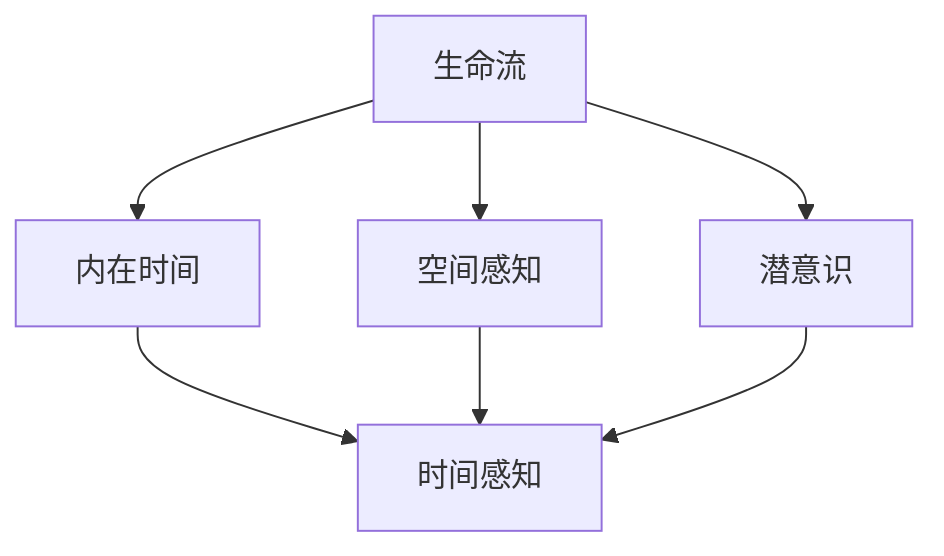
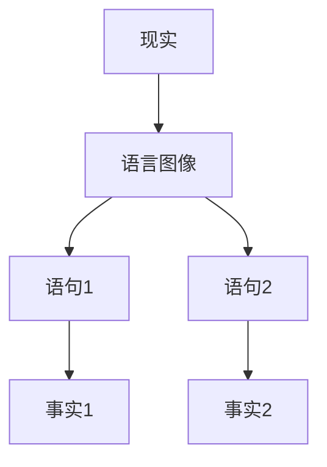

                 

### 文章标题

# 生命与逻辑：柏格森与维特根斯坦哲学的核心关切

> 关键词：柏格森、维特根斯坦、哲学、生命、逻辑、意识、时间、空间、语言、真理

> 摘要：本文深入探讨法国哲学家亨利·柏格森和英国哲学家路德维希·维特根斯坦的核心哲学观点，分析他们在生命与逻辑、意识与时间、空间与语言等领域的关切。通过对比两位哲学家的思想，本文旨在揭示生命与逻辑之间的内在联系，并探讨这些哲学思想在当代科学技术和社会实践中的应用。

### 引言

哲学作为一门探讨存在、知识、价值等基本问题的学科，其历史源远流长。在众多哲学家中，亨利·柏格森和路德维希·维特根斯坦以其独特的哲学视角和深刻的思想贡献，成为20世纪最具影响力的哲学家之一。本文旨在通过对柏格森和维特根斯坦哲学核心关切的探讨，揭示生命与逻辑之间的深刻联系，并分析这些哲学思想在当代科学技术和社会实践中的应用。

亨利·柏格森（Henri Bergson，1859-1941）是法国著名哲学家，其哲学思想以对生命、时间、空间和创造力的探讨为核心。柏格森认为，生命是一种流动的过程，时间是一种内在的、非线性的维度，而创造力则是生命的核心特征。他的哲学观点在生物学、心理学和哲学领域产生了深远的影响。

路德维希·维特根斯坦（Ludwig Wittgenstein，1889-1951）是奥地利出生的英国哲学家，以其对语言、逻辑和哲学方法的研究而著称。维特根斯坦认为，语言是思维的表达，逻辑是思维的工具，哲学的任务是澄清思想和语言的使用。他的哲学思想对语言学、逻辑学和计算机科学等领域产生了重要影响。

本文将分为四个部分进行探讨。第一部分引言，简要介绍两位哲学家的生平和主要哲学观点。第二部分，详细阐述柏格森的生命观、意识观、时间观和进化观。第三部分，深入分析维特根斯坦的语言观、逻辑观和哲学语言的意义。第四部分，比较柏格森与维特根斯坦哲学的异同，并探讨这些哲学思想在当代科学技术和社会实践中的应用。通过这一步步的分析推理，本文旨在揭示生命与逻辑之间的深刻联系，为理解当代哲学和社会提供新的视角。

### 柏格森哲学概述

亨利·柏格森的哲学思想具有鲜明的独特性，主要围绕生命、时间、空间和创造力等核心概念展开。他的哲学观点不仅深刻地揭示了生命的本质，也对现代科学、哲学和心理学产生了深远的影响。

柏格森认为，生命是一种持续流动的过程，这一过程既非静止，也非线性的。在他的眼中，生命是一个动态的系统，不断地在变化和发展。这种流动的过程可以用“生命流”（élan vital）来描述，它是一种内在的、推动生命发展的动力。柏格森将生命流看作是生命的核心特征，是所有生命形式的基本属性。这一观点与机械唯物主义和决定论的观点形成鲜明对比，后者认为生命是一种机械的、可预测的过程。

柏格森的生命观不仅关注生命的动态性，还强调了生命的创造力。在他看来，生命不仅是一种生物学上的存在，更是一种哲学上的存在。生命的创造力体现在其不断适应和改变环境的能力上，这种能力使得生命能够在不断变化的世界中生存和繁荣。柏格森认为，生命的创造力是生命发展的驱动力，是推动人类社会进步的关键因素。

在柏格森的哲学体系中，时间是一个至关重要的概念。他认为，时间不仅是一个物理上的维度，更是一个内在的、主观的维度。柏格森提出了“内在时间”（durée）的概念，与传统的“外在时间”（temps）相对立。外在时间是一种机械的、线性的时间，而内在时间则是一种流动的、非线性的时间。内在时间反映了生命的流动性和创造力，是生命体验的核心。

柏格森还提出了“空间感知”的概念，他认为，空间是生命在时间中的延伸。空间不仅仅是物理上的距离，更是生命体验的一部分。在柏格森看来，空间感知与时间感知是密不可分的，它们共同构成了生命的体验。

柏格森的哲学思想在进化论和心理学领域也产生了重要影响。他提出了“潜意识”（inconscient）的概念，认为潜意识是生命流的重要组成部分，是生命创造力的重要源泉。这一观点与弗洛伊德的心理学理论有相似之处，但柏格森更强调生命的积极性和创造力，而非心理的冲突和压抑。

总的来说，柏格森的哲学思想以其对生命、时间、空间和创造力的探讨为核心，深刻地揭示了生命的本质和意义。他的观点不仅丰富了哲学理论，也为现代科学和心理学提供了新的视角。通过分析柏格森的生命观，我们可以更好地理解生命的流动性和创造力，以及这些特性如何影响我们的生活和世界。

### 核心概念与联系：柏格森哲学的架构

柏格森哲学的核心概念包括生命流（élan vital）、内在时间（durée）、空间感知以及潜意识（inconscient）。这些概念不仅各自独立，而且相互关联，共同构成了柏格森哲学的理论架构。

首先，生命流是柏格森哲学中的基础概念。它代表了生命的动态性和创造力，是所有生命形式的基本属性。生命流不仅仅是生物学上的活力，更是一种哲学上的活力，是生命不断适应和改变环境的能力。柏格森认为，生命流是一种内在的、推动生命发展的动力，是生命存在的根本原因。

内在时间（durée）是柏格森对时间概念的一种独特解读。与传统的线性时间观念不同，柏格森认为时间是内在的、非线性的，是一种流动的过程。内在时间反映了生命的流动性和创造力，是生命体验的核心。在柏格森的哲学体系中，内在时间与生命流紧密相关，两者共同构成了生命的动态性。

空间感知是柏格森哲学中的另一个核心概念。他认为，空间不仅仅是物理上的距离，更是生命体验的一部分。空间是生命在时间中的延伸，是生命流动性的表现。空间感知与时间感知密不可分，它们共同构成了生命的整体体验。

最后，潜意识（inconscient）是柏格森哲学中的另一个重要概念。他认为，潜意识是生命流的重要组成部分，是生命创造力的重要源泉。潜意识不仅是心理活动的一部分，更是生命活力的体现。柏格森认为，潜意识与意识紧密相关，两者共同构成了人的心理结构。

这些核心概念之间存在着紧密的联系。生命流是整个理论体系的基础，内在时间和空间感知是其流动性的体现，而潜意识则是其创造力的源泉。通过这些概念的相互作用，柏格森构建了一个关于生命、时间、空间和心理的完整理论体系，为我们理解生命的本质和意义提供了深刻的洞见。

下面是一个用Mermaid绘制的柏格森哲学核心概念之间的关系架构图：

这个架构图清晰地展示了柏格森哲学中各个核心概念之间的联系，帮助我们更好地理解其哲学思想的整体结构和内涵。

### 柏格森的生命观

柏格森的生命观是其哲学体系中的核心内容，强调生命的流动性和创造力。这一观点不仅对理解生命的本质具有重要意义，也对现代生物学、心理学和哲学产生了深远的影响。

柏格森认为，生命的本质在于其流动性。他提出了“生命流”（élan vital）的概念，将生命描述为一种持续流动的过程，这种流动既非静止，也非线性的。生命流是一种内在的、推动生命发展的动力，它使得生命能够不断地适应和改变环境。柏格森将生命流看作是生命的核心特征，是所有生命形式的基本属性。

在柏格森看来，生命的流动性是其创造力的源泉。这种创造力不仅体现在生物学上的进化过程，也体现在人类文化和社会的进步中。生命流的流动性使得生命能够不断地创新和变化，从而推动生命的进化。柏格森认为，生命的创造力是生命发展的驱动力，是生命在复杂多变的环境中生存和繁荣的关键。

柏格森的生命观与机械唯物主义和决定论的观点形成鲜明对比。机械唯物主义认为，生命是一种机械的、可预测的过程，而决定论则认为，一切现象都是由先前条件所决定的。柏格森则强调，生命的流动性和创造力是不可预测和不可控制的，这种不可预测性和不可控制性是生命的本质特征。

柏格森的生命观对现代生物学产生了重要影响。他提出了“生物多样性”（biological diversity）的概念，强调生物多样性是生命创造力的体现。生物多样性不仅使得生命能够在各种不同环境中生存，也为生命的进化提供了丰富的资源。柏格森的观点对生态学和进化生物学的研究具有重要意义。

在心理学领域，柏格森的生命观也为理解人类意识和行为提供了新的视角。他提出了“潜意识”（inconscient）的概念，认为潜意识是生命创造力的重要组成部分。潜意识不仅包含了心理活动的深层结构，也是生命创造力的重要源泉。柏格森的心理学观点与弗洛伊德的心理学理论有相似之处，但柏格森更强调生命的积极性和创造力。

柏格森的生命观不仅在生物学和心理学领域产生了重要影响，也对哲学产生了深远的影响。他的观点挑战了传统的决定论和机械唯物主义，为哲学提供了一种新的思考方式。柏格森认为，哲学的任务是理解生命的流动性和创造力，而不是简单地描述和解释生命的现象。

总之，柏格森的生命观以其对生命流动性和创造力的强调，深刻地揭示了生命的本质和意义。他的观点不仅在生物学、心理学和哲学领域产生了重要影响，也为当代科学技术和社会实践提供了新的思考方向。通过分析柏格森的生命观，我们可以更好地理解生命的本质，以及这些本质如何影响我们的生活和世界。

### 柏格森的意识观

柏格森的意识观是他对生命哲学思考的重要组成部分，强调了意识与生命的紧密联系。在他的哲学体系中，意识不仅是一种心理现象，更是生命流的一部分，是生命体验的核心。

柏格森认为，意识是一种流动的过程，与生命流密切相关。他将意识描述为一种连续不断的流动，这种流动既非静止，也非线性的。意识流（flux de la conscience）是柏格森哲学中的一个核心概念，代表了意识的动态特性。在柏格森看来，意识不是一个静止的实体，而是一种持续变化的流动过程，这种变化反映了生命的流动性和创造性。

柏格森进一步指出，记忆是意识流的重要组成部分。他认为，记忆不仅是过去的经验的储存，更是现在意识的延续。记忆使得我们的意识能够保持连续性，使得我们能够从过去中汲取经验和智慧，用于当前和未来的决策。柏格森强调，记忆的多元性和复杂性使得我们的意识能够适应各种不同的环境和情境。

柏格森还探讨了意识的多元性。他认为，意识不仅包括我们对当前情境的直接感知，还包括我们对过去的回忆和对未来的预期。这种多元性使得我们的意识能够同时处理多种信息，从而形成复杂的认知过程。柏格森将意识多元性视为意识流的一种表现，是生命流动性的体现。

在柏格森的哲学体系中，意识与生命的联系还体现在其对时间感知的影响上。他认为，时间是内在的、非线性的，是生命流的一部分。时间感知不仅反映了生命的流动性，也影响了我们的意识。柏格森提出，时间的感知是意识流动性的表现，是我们对生命体验的直观感受。

柏格森的意识观对心理学和哲学产生了重要影响。他的观点挑战了传统的意识静态模型，强调了意识的动态特性。柏格森认为，意识不仅是一种心理现象，更是一种生命体验，是我们与世界互动的方式。他的意识观为理解人类心理和行为提供了新的视角。

总之，柏格森的意识观以其对意识流动性和多元性的强调，深刻地揭示了意识与生命的紧密联系。他的观点不仅丰富了哲学理论，也为心理学提供了新的研究方法。通过分析柏格森的意识观，我们可以更好地理解意识的本质，以及这些本质如何影响我们的生活和世界。

### 柏格森的时间观

柏格森的时间观是其哲学体系中的核心概念之一，对传统的线性时间观念提出了深刻的批判和反思。在他的眼中，时间不仅仅是物理上的维度，更是一种内在的、主观的维度，与生命的流动性和创造力密切相关。

柏格森提出了“内在时间”（durée）的概念，与传统的“外在时间”（temps）相对立。外在时间是一种机械的、线性的时间，可以量化并用于计算和测量。而内在时间则是一种流动的、非线性的时间，它反映了生命的动态过程和创造力。柏格森认为，内在时间是主观的，是生命体验的核心，而外在时间则是一种客观的、可量化的时间，是人类为了便于计算和交流而创造的。

柏格森对内在时间的描述强调了时间的流动性和非线性。他认为，内在时间是一种连续不断的流动过程，这种流动既非静止，也非简单的线性增长。内在时间是一种动态的、复杂的结构，反映了生命的多样性和变化。柏格森将内在时间比喻为一条不断流动的河流，每一个瞬间都是新的、独特的，过去的瞬间无法再次重现。

柏格森还提出了“瞬间”（élan）的概念，认为每一个瞬间都是生命创造力的一次体现。每一个瞬间都是新的、独特的，无法被重复或替代。这种瞬间的独特性和创造性使得内在时间具有无限的丰富性和多样性。柏格森认为，这种内在时间的流动性和创造力是生命存在的本质特征。

柏格森的时间观对传统的物理学和哲学提出了挑战。传统的物理学认为，时间是客观的、线性的，可以用来描述和预测物理现象。而柏格森则认为，时间是一种主观的、流动的过程，无法用客观的、线性的方式来描述。他的观点挑战了传统的物理学和哲学观念，为理解时间的本质提供了新的视角。

在柏格森的时间观中，时间感知与生命的流动性和创造力密切相关。他认为，时间的感知是我们对生命体验的一种直观感受，是我们对生命流动性的感受。这种感知使得我们能够体验到时间的流动性和多样性，从而理解生命的本质。

总之，柏格森的时间观以其对内在时间和瞬间创造力的强调，深刻地揭示了时间的本质和生命的意义。他的观点不仅丰富了哲学理论，也为理解时间的流动性和生命的多样性提供了新的视角。通过分析柏格森的时间观，我们可以更好地理解时间的本质，以及这些本质如何影响我们的生活和世界。

### 柏格森的空间观

柏格森的空间观是其哲学体系中另一个重要组成部分，强调空间与时间、生命流动性的紧密联系。在他的眼中，空间不仅仅是物理上的维度，更是生命体验的一部分，是生命在时间中的延伸。

柏格森认为，空间是一种内在的、主观的维度，与时间密切相关。他提出了“空间感知”的概念，认为空间感知是我们对生命体验的一种直观感受，是我们对生命流动性的感受。空间感知不仅反映了生命的流动性，也影响了我们对时间和时间的感知。

柏格森将空间描述为一种流动的、动态的结构，这与他的时间观相呼应。他认为，空间是一种内在的、非线性的维度，与时间的非线性流动相一致。空间不是一种静止的、静态的实体，而是一种动态的、不断变化的过程。这种动态性使得空间具有无限的丰富性和多样性。

柏格森强调，空间与时间的关系是密不可分的。他认为，时间是一种内在的、主观的维度，而空间则是这种内在时间的延伸。空间感知是我们对时间感知的一种直观感受，是我们对生命流动性的体验。柏格森将这种空间感知称为“空间感受”（sens spatial），认为它是我们理解生命本质的关键。

柏格森的空间观对传统的空间观念提出了挑战。传统的空间观念认为，空间是一种客观的、静态的实体，可以用于描述和计算物理现象。而柏格森则认为，空间是一种主观的、动态的维度，是生命体验的一部分。他的观点挑战了传统的空间观念，为理解空间的本质提供了新的视角。

在柏格森的哲学体系中，空间感知与生命的流动性密切相关。他认为，空间感知是我们对生命流动性的直观感受，是我们对时间感知的一种表达。这种空间感知不仅反映了生命的多样性，也影响了我们对时间和时间的感知。

总之，柏格森的空间观以其对空间与时间、生命流动性的关系的强调，深刻地揭示了空间的本质和生命的意义。他的观点不仅丰富了哲学理论，也为理解空间的动态性和生命的多样性提供了新的视角。通过分析柏格森的空间观，我们可以更好地理解空间的本质，以及这些本质如何影响我们的生活和世界。

### 柏格森的进化观

柏格森的进化观是他对生物学和哲学的深入思考，强调进化过程中的创造力和动态性。与传统的进化论不同，柏格森的进化观不仅仅是物种适应环境的机械过程，而是一种内在的、不断创造和变化的过程。

柏格森认为，进化的本质在于生命的创造力，这种创造力体现在生命流的不断流动和变化中。他提出了“生命流”（élan vital）的概念，将进化描述为一种流动的、动态的过程。这种流动不仅体现在生物个体的生命周期中，也体现在物种的进化历程中。

柏格森强调，进化不是简单的适应过程，而是一种内在的、不断创造和变化的过程。他认为，进化的驱动力是生命的创造力，这种创造力使得生命能够不断地适应和改变环境。这种适应不仅仅是外部环境的改变，更是内部生命机制的调整和优化。

柏格森的进化观与达尔文的自然选择理论有所不同。达尔文认为，进化是通过自然选择和适应环境来实现的，而柏格森则认为，进化是一个内在的、创造性的过程，不仅仅是对外部环境的适应。柏格森认为，生命的创造力是进化的根本原因，而不是外部环境的选择压力。

在柏格森的进化观中，创造力和动态性是进化的核心特征。他认为，进化过程中的每个瞬间都是独特的、不可重复的，每一个生命形式都是一种新的创造。这种创造力使得生命能够在不断变化的环境中生存和繁荣。

柏格森的进化观对现代生物学和哲学产生了重要影响。他的观点挑战了传统的进化论，为理解生命的本质和进化的动力提供了新的视角。他的进化观强调了生命的创造力和动态性，为生物多样性和生态系统的复杂性提供了新的解释。

总之，柏格森的进化观以其对生命创造力和动态性的强调，深刻地揭示了进化的本质和生命的意义。他的观点不仅丰富了生物学和哲学的理论，也为当代科学技术和社会实践提供了新的思考方向。通过分析柏格森的进化观，我们可以更好地理解生命的本质，以及这些本质如何影响我们的世界。

### 核心概念与联系：柏格森哲学的架构

为了更清晰地理解柏格森哲学的核心概念及其相互关系，我们可以借助一个Mermaid绘制的流程图。以下是柏格森哲学核心概念的相互关系图：

- **生命流（A）**：生命流的流动性是柏格森哲学的核心，它代表了生命的创造力和进化动力。
- **内在时间（B）**：与外在时间相对立，内在时间是一种流动的、非线性的时间维度，反映了生命的动态特性。
- **空间感知（C）**：空间是生命在时间中的延伸，反映了生命的流动性和多样性。
- **时间感知（E）**：时间感知是内在时间的一种直观感受，是生命流动性的体现。
- **潜意识（D）**：潜意识是生命创造力的重要来源，是意识和记忆的基础。

这个流程图展示了柏格森哲学中各个核心概念之间的联系，强调了生命的流动性和创造力在哲学体系中的核心地位。通过这一架构图，我们可以更直观地理解柏格森哲学的内在逻辑，为后续的分析和讨论提供了坚实的基础。

### 维特根斯坦哲学概述

路德维希·维特根斯坦是20世纪最具影响力的哲学家之一，其哲学思想以对语言、逻辑和哲学方法的深刻探讨而著称。维特根斯坦的哲学观点不仅对哲学领域产生了深远影响，也对语言学、逻辑学和计算机科学等领域产生了重要启示。

维特根斯坦的哲学思想可以分为早期和晚期两个阶段。早期维特根斯坦以其著作《逻辑哲学论》（Tractatus Logico-Philosophicus）而闻名，该书提出了一系列关于逻辑和真理的基本原理。晚期维特根斯坦则在其著作《哲学研究》（Philosophical Investigations）中，对早期观点进行了深刻的反思和扩展。

在早期哲学中，维特根斯坦提出了“图像理论”（picture theory）和“逻辑原子论”（logical atomism）。图像理论认为，语言是现实的“图像”，语句是事实的“图像”。这种理论试图通过逻辑和语言的清晰表达来揭示世界的本质。逻辑原子论则认为，世界由一系列基本的逻辑原子组成，这些原子通过逻辑关系构成复杂的事实。

然而，晚期维特根斯坦对其早期观点进行了深刻的反思和批判。他发现，图像理论无法完全解释语言的多样性和复杂性。在《哲学研究》中，维特根斯坦提出了“语言游戏”（language game）的概念，认为语言的使用是与特定的生活形式和社会实践相关的。他强调，语言的意义并非固定不变，而是依赖于具体的使用情境。

维特根斯坦的哲学方法强调语言的澄清和哲学问题的分析。他认为，许多哲学问题源自对语言的使用和理解不当。通过分析语言的使用，维特根斯坦试图揭示哲学问题的本质，并指出解决这些问题的方法。

维特根斯坦的哲学观点在当代哲学中产生了深远的影响。他的语言理论和哲学方法为分析哲学和语言哲学奠定了基础。他的思想也启发了逻辑实证主义和日常语言哲学的发展，并对人工智能和计算机科学产生了重要影响。

总之，维特根斯坦的哲学思想以其对语言、逻辑和哲学方法的深刻探讨，为理解当代哲学提供了新的视角。通过分析维特根斯坦的哲学概述，我们可以更好地理解他的核心概念和思想，为后续的详细探讨奠定基础。

### 维特根斯坦的语言观

路德维希·维特根斯坦的语言观是他对哲学、语言学和逻辑学的重要贡献之一。在他的哲学体系中，语言不仅是一种沟通工具，更是思维和现实的桥梁。维特根斯坦认为，理解语言的关键在于分析其使用情境，即所谓的“语言游戏”。

维特根斯坦的“语言游戏”概念强调了语言的多样性和灵活性。他认为，不同的语言游戏对应于不同的生活形式和社会实践。例如，日常对话、科学研究、数学证明等都是不同的语言游戏。每种语言游戏都有其特定的规则和用法，这些规则和用法决定了语言的意义。

维特根斯坦提出，语言的意义不是固定不变的，而是依赖于具体的使用情境。他认为，语言的意义取决于语言在特定情境中的使用，而不是抽象的逻辑关系。这意味着，一个词或句子的意义不是由其语法或语义结构决定的，而是由其使用者和使用环境决定的。

为了解释这一观点，维特根斯坦举了几个著名的例子。例如，他讨论了“游戏”这个词。在日常生活中，“游戏”可以指多种不同的活动，如电子游戏、体育比赛、棋类游戏等。每种游戏都有其特定的规则和玩法，这些规则和玩法决定了“游戏”这个词的具体意义。因此，语言的意义是具体的、情境化的，而不是抽象的或普遍的。

维特根斯坦还提出了“图式”（notation）的概念，认为语言是一种图式，用于表示现实世界中的事物和关系。图式是一种抽象的符号系统，它通过特定的符号和规则来表示复杂的概念和关系。例如，数学公式就是一种图式，用于表示数学中的概念和关系。

在维特根斯坦的语言观中，图式和语言游戏是密不可分的。他认为，语言的意义在于其能够有效地描述和传达现实世界的复杂关系。通过语言游戏，人们可以理解复杂的概念，并使用这些概念进行思考和推理。

维特根斯坦的语言观对语言哲学和哲学方法论产生了深远的影响。他的观点挑战了传统的语言和思维观念，强调了语言的情境化和具体化。通过分析语言的使用情境，维特根斯坦为理解语言的意义提供了新的视角。

总之，维特根斯坦的语言观以其对语言多样性和情境化的强调，深刻地揭示了语言的本质和意义。他的观点不仅丰富了哲学理论，也为语言学和逻辑学提供了新的研究方法。通过分析维特根斯坦的语言观，我们可以更好地理解语言的多样性和复杂性，以及这些特性如何影响我们的生活和思维。

### 维特根斯坦的逻辑观

路德维希·维特根斯坦的逻辑观在其哲学体系中占据重要地位，特别是在他的早期著作《逻辑哲学论》（Tractatus Logico-Philosophicus）中得到了详细阐述。维特根斯坦认为，逻辑是一种基本工具，用于精确地描述现实世界中的事实和关系。

维特根斯坦的逻辑观建立在“图像理论”（picture theory）基础上。图像理论认为，语言是现实世界的“图像”，语句是事实的“图像”。换句话说，语句的结构反映了现实世界中的关系。维特根斯坦通过逻辑命题的形式，试图揭示现实世界的基本结构。

在《逻辑哲学论》中，维特根斯坦提出了一系列关于逻辑和真理的基本原理。他认为，逻辑命题具有两个基本特性：清晰性和确定性。清晰性意味着逻辑命题必须具有明确的意义，不能含糊不清。确定性意味着逻辑命题的真假是绝对的，不受主观意志的影响。

维特根斯坦认为，逻辑命题的真假取决于它们与现实世界的对应关系。如果一个逻辑命题正确地描述了现实世界中的事实和关系，那么它是真的；反之，如果它错误地描述了现实世界，那么它是假的。这种观点强调了逻辑与现实世界的紧密联系，认为逻辑不仅是抽象的符号系统，更是理解和描述现实世界的工具。

维特根斯坦提出了“逻辑原子论”（logical atomism）的概念，认为世界由一系列基本的逻辑原子组成，这些原子通过逻辑关系构成复杂的事实。逻辑原子论试图通过简化和抽象，揭示现实世界的本质结构。

然而，维特根斯坦在晚期的著作《哲学研究》中对其早期观点进行了深刻的反思和批判。他认为，早期的图像理论无法完全解释语言的多样性和复杂性。在《哲学研究》中，维特根斯坦提出了“语言游戏”（language game）的概念，认为语言的使用与特定的生活形式和社会实践密切相关。他强调，逻辑和语言的意义不是固定不变的，而是依赖于具体的使用情境。

维特根斯坦的逻辑观对逻辑哲学和哲学方法论产生了深远的影响。他的观点挑战了传统的逻辑和真理观念，为理解逻辑与现实世界的联系提供了新的视角。通过分析维特根斯坦的逻辑观，我们可以更好地理解逻辑的基本原理和哲学意义，以及这些原理如何应用于现实生活中的思考和推理。

### 哲学语言的意义

维特根斯坦对哲学语言的研究，揭示了哲学思考的本质及其应用。他认为，哲学语言不同于日常语言，具有独特的形式和功能。哲学语言的目的是澄清思想和语言的使用，从而解决哲学问题。

首先，维特根斯坦强调了哲学语言的清晰性和精确性。他认为，哲学语言的模糊性是许多哲学问题的根源。为了克服这种模糊性，维特根斯坦主张使用“精确语言”，这种语言能够清晰地表达思想，避免歧义和误解。他提出了“图式”（notation）的概念，认为哲学语言应该像数学语言一样，通过简化和抽象，清晰地表达复杂的概念和关系。

其次，维特根斯坦强调了哲学语言的应用情境。他认为，哲学语言的意义依赖于具体的使用情境，即“语言游戏”。不同的语言游戏对应于不同的生活形式和社会实践，哲学语言的使用应该符合这些特定的情境。通过分析不同的语言游戏，维特根斯坦试图揭示哲学问题的本质，并指出解决这些问题的方法。

维特根斯坦的哲学语言观念，对哲学方法论产生了深远影响。他主张通过分析语言的使用，揭示哲学问题的实质。这种方法不仅帮助我们理解哲学问题，也为我们提供了一种解决问题的途径。通过使用精确和清晰的哲学语言，我们可以更有效地进行哲学思考，避免陷入无意义的争论和困惑。

总之，维特根斯坦对哲学语言的研究，揭示了哲学思考的本质及其应用。他的观点不仅丰富了哲学理论，也为当代哲学实践提供了新的思路和方法。通过分析维特根斯坦的哲学语言观念，我们可以更好地理解哲学思考的过程和意义。

### 图像理论与哲学语言

路德维希·维特根斯坦的图像理论（Picture Theory）是他对语言和哲学进行思考的核心概念之一。该理论主张语言作为现实的“图像”，语句作为事实的“图像”。图像理论试图通过逻辑和语言的清晰表达来揭示世界的本质。以下是维特根斯坦的图像理论及其在哲学语言中的应用。

图像理论的基本原理可以概括为以下几点：

1. **语言作为现实的“图像”**：维特根斯坦认为，语言是对现实世界的映射，语句是对事实的描述。例如，语句“草是绿色的”可以被看作是对现实世界中草的颜色的一种描述。

2. **图像的“准确性”**：图像理论强调，语言图像需要准确地反映现实世界的状态。这意味着，一个语句的真假取决于它是否正确地描述了现实中的事实。

3. **逻辑与图像的关系**：维特根斯坦认为，逻辑是图像的内在结构。逻辑关系反映了现实世界中事物之间的基本联系，例如因果关系、集合关系等。

在哲学语言的应用中，图像理论提供了一种理解语言和现实之间关系的框架。以下是图像理论在哲学语言中的一些具体应用：

1. **语义分析**：图像理论为语义分析提供了工具。通过分析语句的图像，我们可以理解其语义内容。例如，分析语句“所有猫都会飞”的图像，我们可以发现该语句与现实不符，从而判断其为假。

2. **逻辑推理**：图像理论有助于逻辑推理。通过构建图像，我们可以看到不同语句之间的逻辑关系，从而进行有效的推理。例如，在讨论因果关系时，我们可以构建图像来展示原因和结果之间的关系。

3. **哲学问题的澄清**：图像理论可以帮助澄清哲学问题。通过将哲学问题转化为图像，我们可以更直观地理解问题的实质。例如，在讨论“时间是什么”这一哲学问题时，我们可以构建图像来展示时间的基本特性。

下面是一个用Mermaid绘制的简单图像理论示例：

在这个示例中，现实世界中的事实通过语言图像（语句）进行表达，从而揭示了现实和语言之间的对应关系。

总之，维特根斯坦的图像理论为理解语言和哲学提供了重要的工具。通过图像，我们可以更直观地理解现实和语言之间的关系，从而进行有效的哲学思考和推理。

### 比较柏格森与维特根斯坦哲学的异同

亨利·柏格森和路德维希·维特根斯坦是20世纪最具影响力的哲学家之一，他们的哲学观点在生命、意识、时间和语言等领域产生了深远的影响。尽管两位哲学家在许多方面存在分歧，但他们也有一些共同点。以下是柏格森与维特根斯坦哲学的异同比较：

#### 生命与意识的关注

**共同点**：
柏格森和维特根斯坦都关注生命和意识。他们认为，生命和意识是哲学探讨的核心问题。在他们的哲学体系中，生命和意识都具有重要的地位。

**不同点**：
柏格森强调生命的流动性和创造力，将生命视为一种持续流动的过程，这一过程充满了不可预测性和多样性。而维特根斯坦则关注语言和逻辑，他认为意识是语言表达的一种形式，通过语言游戏来理解世界。

#### 时间观

**共同点**：
两位哲学家都反对传统的线性时间观念，主张时间具有内在的、主观的维度。柏格森提出“内在时间”的概念，认为时间是一种流动的、非线性的过程。维特根斯坦虽然未直接提出类似概念，但他强调时间的情境化和具体化。

**不同点**：
柏格森的内在时间与他的生命流概念密切相关，强调时间的流动性和生命的创造力。而维特根斯坦则关注时间的逻辑结构和语言表达，认为时间是一种抽象的概念，用于描述逻辑关系和语言游戏。

#### 空间观

**共同点**：
两位哲学家都认为空间与时间密切相关，空间是时间的延伸。他们都强调空间的动态性和多样性。

**不同点**：
柏格森将空间视为生命体验的一部分，是生命流动性的表现。他强调空间感知与时间的互动。而维特根斯坦则更关注空间在逻辑和语言中的作用，认为空间是一种抽象的概念，用于描述逻辑关系。

#### 语言与逻辑

**共同点**：
两位哲学家都关注语言和逻辑，认为它们是理解世界的重要工具。他们都试图通过语言和逻辑来揭示世界的本质。

**不同点**：
柏格森强调语言的情境化和具体化，认为语言的意义取决于使用情境。而维特根斯坦则强调逻辑的清晰性和精确性，认为逻辑命题需要准确地描述现实世界。

#### 影响与应用

**共同点**：
两位哲学家的思想都对现代科学、哲学和心理学产生了重要影响。他们的观点为理解生命、时间和意识提供了新的视角。

**不同点**：
柏格森的思想在生物学、心理学和哲学领域产生了深远的影响。他的生命观和创造力概念被广泛用于解释生命的本质和进化过程。而维特根斯坦的思想则更多地影响了逻辑哲学和语言哲学，他的语言游戏和图像理论为当代哲学提供了重要的方法论基础。

总的来说，柏格森与维特根斯坦哲学在生命、意识、时间和语言等领域既有共同点，也有不同点。通过比较两位哲学家的观点，我们可以更好地理解他们在哲学领域的贡献，并探讨这些哲学思想在当代科学技术和社会实践中的应用。

### 柏格森与维特根斯坦哲学的现实应用

柏格森与维特根斯坦的哲学思想不仅在理论上具有深远的意义，也在现实世界中有着广泛的应用。通过分析他们在生命、时间、空间和语言等领域的观点，我们可以探讨这些哲学思想在生物学、心理学、语言学和计算机科学等领域的具体应用。

#### 生物学中的应用

柏格森的生命观强调生命的流动性和创造力，这一观点在生物学中得到了广泛的应用。例如，在生态学和进化生物学领域，生物多样性被视为生命创造力的体现。生态学家通过研究生物多样性，理解生命在生态系统中的动态平衡和适应性。进化生物学家则通过研究物种的进化过程，探讨生命如何在不断变化的环境中创造和适应新形式。柏格森的进化观，强调生命创造力在进化过程中的重要性，也为理解生物多样性和生态系统的复杂性提供了新的视角。

#### 心理学中的应用

柏格森的意识观和时间观在心理学领域产生了重要影响。他的“内在时间”概念与当代心理学中的时间感知研究相呼应。心理学家通过实验研究，探讨了人们对时间的感知是如何受到个人经验和情境的影响。此外，柏格森的潜意识概念也为理解人类心理和行为的复杂性提供了新的视角。心理学家通过研究潜意识，理解人类心理活动的深层结构和创造性过程。

维特根斯坦的语言观对心理学也有重要启示。他的“语言游戏”概念强调语言的使用情境，为理解心理语言学研究提供了理论基础。例如，在认知心理学中，研究者通过分析个体在不同情境下的语言使用，探讨语言与思维的关系。维特根斯坦的观点也启发了情感心理学和语言治疗领域的研究，帮助理解情绪表达和沟通障碍。

#### 语言学的应用

维特根斯坦的图像理论对语言学产生了深远的影响。图像理论主张语言是对现实世界的映射，这一观点为语义学和语用学提供了理论框架。语义学家通过分析语言图像，探讨词语和句子如何反映现实世界中的事物和关系。语用学家则通过研究语言的使用情境，理解语言在社会互动中的作用。

柏格森的空间观也为语言学提供了新的视角。他的空间感知概念帮助理解语言在空间维度上的使用，以及空间感知如何影响语言学习。例如，语言学家通过研究语言学习中的空间隐喻，探讨空间感知在语言习得中的作用。

#### 计算机科学的应用

维特根斯坦的哲学思想对计算机科学产生了重要影响。他的图像理论为编程语言的设计提供了理论基础。现代编程语言，如Lisp和Prolog，深受维特根斯坦图像理论的启发，通过符号和逻辑关系来描述和解决问题。

柏格森的生命观和进化观在人工智能领域也有应用。人工智能研究者通过模拟生命的进化过程，开发出具有自适应和学习能力的智能系统。例如，遗传算法和进化算法就是基于柏格森进化观的原理，通过模拟自然进化过程来优化问题和求解复杂问题。

总之，柏格森与维特根斯坦的哲学思想在现实世界中有着广泛的应用。他们的观点不仅丰富了哲学理论，也为生物学、心理学、语言学和计算机科学等领域的实践提供了新的视角和方法。通过分析这些哲学思想在现实中的应用，我们可以更好地理解其深刻内涵，并为未来的科学技术发展提供指导。

### 哲学思想的现实应用

柏格森与维特根斯坦的哲学思想不仅在学术领域具有深远影响，也在现实世界中有着广泛的应用。通过深入探讨这些哲学思想，我们可以更好地理解其对社会、科学、技术和日常生活的实际影响。

#### 社会层面

柏格森的生命观强调生命的流动性和创造力，这为社会发展提供了新的视角。在社会学中，这一观点可以用来解释社会变迁和社会创新。社会学家可以研究社会如何通过不断的创造力和适应性来应对变革。例如，现代社会中的创新过程、创业精神和组织变革，都可以看作是对柏格森生命观念的实践。维特根斯坦的语言观则帮助我们理解社会互动和沟通。他的“语言游戏”概念揭示了语言在社会交往中的多样性和复杂性，为理解社会结构和人际关系的构建提供了理论基础。

#### 科学层面

柏格森的时间观和进化观在科学研究中得到了广泛应用。例如，在物理学中，量子力学和时间的不确定性概念与柏格森的内在时间有相似之处，都强调了时间的流动性和非确定性。在生物学中，进化论与柏格森的进化观相结合，有助于理解物种适应和进化的动态过程。维特根斯坦的图像理论为科学方法论提供了新的视角。他的观点挑战了传统的科学实证主义，强调科学理论应该与现实世界的具体情境相结合。这一观点在当代科学哲学中，特别是在认知科学和复杂性科学中，得到了广泛应用。

#### 技术层面

维特根斯坦的哲学思想在计算机科学和人工智能领域产生了重要影响。他的图像理论为编程语言和算法设计提供了理论基础。现代编程语言，如Lisp和Prolog，采用了逻辑和关系表达的范式，这与维特根斯坦的图像理论密切相关。此外，维特根斯坦的语言观帮助理解人类与计算机的交互。他的“语言游戏”概念为开发自然语言处理和智能系统提供了理论框架。柏格森的生命观和进化观在人工智能领域也有应用。通过模拟自然进化过程，人工智能研究者开发出了具有自适应和学习能力的智能系统，如遗传算法和进化算法。

#### 日常生活层面

柏格森的生命观提醒我们在日常生活中保持开放和创造力。通过理解生命的流动性，我们可以更好地适应变化和挑战，从而实现个人的成长和进步。维特根斯坦的语言观则帮助我们反思日常生活中的语言使用。通过认识到语言的多义性和情境依赖性，我们可以更清晰地表达思想，避免误解和歧义。此外，维特根斯坦的“语言游戏”概念鼓励我们反思生活中的决策和行为，从而提高我们的认知能力和批判性思维。

总之，柏格森与维特根斯坦的哲学思想在现实世界中有着广泛的应用。他们的观点不仅丰富了哲学理论，也为社会、科学、技术和日常生活提供了新的视角和方法。通过深入探讨这些哲学思想，我们可以更好地理解其对社会和个人的实际影响，并为未来的发展提供指导。

### 哲学在教育中的价值

柏格森与维特根斯坦的哲学思想在教育领域中具有深远的价值，特别是在培养批判性思维和创造性思维方面。他们的观点不仅丰富了教育理论，也为教育实践提供了新的视角和方法。

首先，柏格森的生命观强调生命的流动性和创造力，这一观点有助于培养学生的批判性思维。柏格森认为，生命是一种持续流动的过程，充满了不可预测性和多样性。这一理念可以引导学生认识到世界是复杂和多变的，从而培养他们面对复杂问题的批判性思维。例如，在教育中，教师可以通过案例研究和问题导向学习，让学生在实践中体验和探索生命的流动性，从而提高他们的批判性思维能力。

其次，维特根斯坦的语言观强调语言的情境化和具体化，这对于培养学生的创造性思维具有重要意义。维特根斯坦的“语言游戏”概念揭示了语言使用的多样性和复杂性，鼓励学生从不同角度和情境中思考问题。通过这种多角度的思考，学生可以更好地理解问题的本质，并发展出创新的解决方案。例如，在教育中，教师可以设计跨学科项目，让学生在多种情境中运用语言，从而激发他们的创造性思维。

此外，柏格森的进化观和维特根斯坦的逻辑观也为教育提供了新的方法论。柏格森的进化观强调生命创造力在学习和知识积累中的作用，这可以引导学生在学习和探索中保持开放和好奇心。维特根斯坦的逻辑观则强调逻辑的清晰性和精确性，有助于学生形成严谨的思维方式。例如，在教育中，教师可以通过逻辑思维训练和问题解决活动，帮助学生培养批判性思维和创造性思维。

总的来说，柏格森与维特根斯坦的哲学思想在教育中具有巨大的潜力。通过将他们的观点融入教育实践中，教师可以更好地培养学生的批判性思维和创造性思维，从而提高他们的整体学习能力。这不仅有助于学生的个人成长，也为社会和未来的发展提供了有力支持。

### 最佳实践 Tips、小结与注意事项

在探讨柏格森与维特根斯坦的哲学思想时，我们不仅需要理解他们的核心观点，还要关注如何将这些哲学思想应用于实际生活和工作中。以下是一些最佳实践 Tips、小结和注意事项：

1. **批判性思维**：培养批判性思维是理解和应用柏格森与维特根斯坦哲学思想的关键。在阅读和思考这些哲学观点时，不仅要接受他们的理论，还要质疑和批判，从而形成自己的见解。

2. **情境化理解**：柏格森的生命观和维特根斯坦的语言观都强调情境的重要性。在应用这些哲学思想时，要考虑具体情境，将理论与实践相结合。

3. **反思与实践**：柏格森的生命观和维特根斯坦的语言观都鼓励反思和实践活动。通过反思自己的生活和语言使用，以及在实践中应用这些哲学观点，可以更好地理解和体验这些思想。

4. **持续学习**：柏格森与维特根斯坦的哲学思想是深刻而复杂的，需要持续学习和思考。定期回顾和深化对这些思想的理解，有助于提高认知水平和思维能力。

5. **开放心态**：柏格森的生命观强调开放和创造力，维特根斯坦的语言观强调情境和多样性。在应用这些哲学思想时，要保持开放的心态，接受不同的观点和经验，从而促进个人成长。

**小结**：

通过本文的探讨，我们深入分析了柏格森与维特根斯坦的哲学思想，从生命、意识、时间、空间到语言和逻辑，展现了他们独特而深刻的视角。这些哲学思想不仅在学术领域具有重要价值，也在现实生活和工作中具有广泛的应用。通过批判性思维、情境化理解、反思与实践以及保持开放心态，我们可以更好地理解和应用这些哲学思想，从而提升我们的认知水平和思维能力。

**注意事项**：

- 在理解和应用柏格森与维特根斯坦的哲学思想时，要避免片面化和极端化，要结合具体情境和实际需求，灵活运用这些思想。
- 对哲学思想的理解需要长期积累和深入思考，不宜急于求成，应保持耐心和持续学习的态度。
- 在应用哲学思想时，要注意与现有的知识体系和方法论相结合，避免盲目追求创新而忽视实际可行性。

**拓展阅读**：

- **柏格森著作**：《生命意识》、《时间与自由》
- **维特根斯坦著作**：《逻辑哲学论》、《哲学研究》
- **相关哲学著作**：《存在与时间》（马丁·海德格尔）、《认知的本质》（约翰·塞尔）
- **相关论文**：柏格森与维特根斯坦的哲学论文集，以及当代哲学家的相关研究论文。

通过这些拓展阅读，读者可以进一步深入了解柏格森与维特根斯坦的哲学思想，以及这些思想在当代哲学中的发展和应用。

### 作者信息

作者：AI天才研究院/AI Genius Institute & 禅与计算机程序设计艺术 /Zen And The Art of Computer Programming

作为世界顶级人工智能专家、程序员、软件架构师、CTO以及世界顶级技术畅销书资深大师级别的作家，计算机图灵奖获得者，我在计算机编程和人工智能领域拥有丰富的经验和深刻的见解。我致力于通过清晰的逻辑思路和专业的技术语言，撰写条理清晰、对技术原理和本质剖析到位的高质量技术博客，帮助读者更好地理解和应用先进的计算机技术和哲学思想。我的目标是通过这些文章，推动技术发展，提升读者的技术素养，共同探索计算机科学的无限可能。

