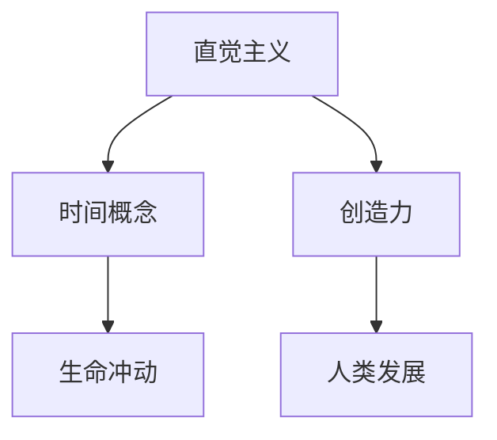
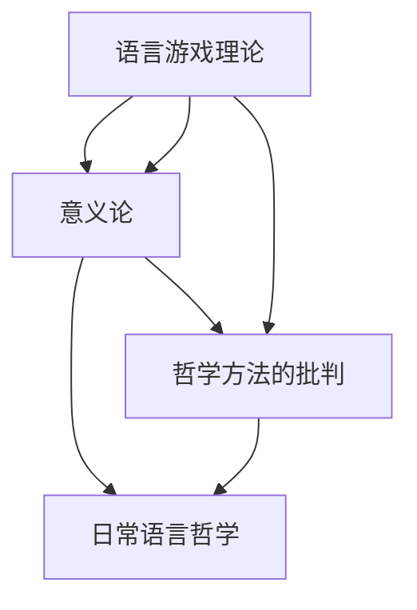

                 


## 文章标题

**生命哲学vs语言哲学：柏格森与维特根斯坦的核心思想**

## 文章关键词

- 生命哲学
- 语言哲学
- 柏格森
- 维特根斯坦
- 直觉主义
- 语言游戏
- 哲学方法论

## 文章摘要

本文将探讨两位伟大的哲学家柏格森与维特根斯坦的核心思想，分别从生命哲学和语言哲学的角度出发。通过对柏格森的生命哲学，如直觉主义、时间概念、创造力等进行详细阐述，我们能够理解其对生命本质的独特看法。而对于维特根斯坦的语言哲学，我们将探讨他的语言游戏理论、意义论、哲学方法的批判等。通过两者的对比分析，我们将揭示他们在哲学观点、方法论和世界观上的异同。最后，本文将总结两位哲学家的核心思想，并对其在当代哲学领域的意义进行展望。

## 引言

在哲学的长河中，许多伟大的哲学家为人类文明的进步贡献了宝贵的思想财富。然而，在生命哲学和语言哲学这两个领域中，法国哲学家亨利·柏格森（Henri Bergson）和奥地利哲学家路德维希·维特根斯坦（Ludwig Wittgenstein）的地位尤为突出。他们分别从生命和语言这两个独特的视角出发，提出了各自独特的哲学思想，对后世产生了深远的影响。

### 柏格森的生命哲学

柏格森（1859-1941）是20世纪法国哲学的重要代表，他提出了许多富有创意和启发性的思想，尤其在生命哲学领域具有极高的地位。他的核心思想是直觉主义，即强调人类直觉在认知世界中的作用。柏格森认为，直觉是一种内在的、无法通过逻辑和语言表达的直观能力，它能够捕捉到生命和世界的本质。

柏格森还探讨了时间概念，他认为时间不是线性的，而是一种连续的、流动的过程，这种过程被称为“生命冲动”（élan vital）。生命冲动是一种内在的、自发性的力量，推动着生命的进化和发展。创造力是柏格森生命哲学的重要主题，他认为创造力是人类和宇宙的本质特征，是人类不断进步和发展的动力。

### 维特根斯坦的语言哲学

维特根斯坦（1889-1951）是20世纪最伟大的哲学家之一，他的思想对语言哲学、数学哲学和认识论等领域产生了深远的影响。维特根斯坦的语言哲学强调语言与世界的密切联系，他认为语言是沟通和理解世界的工具，但语言本身并不等于现实。

维特根斯坦提出了“语言游戏理论”（language game），他认为语言的使用是多样的，每种语言使用都有其特定的规则和情境。意义论是维特根斯坦语言哲学的核心，他主张意义取决于语言的使用，而不是抽象的符号或概念。此外，维特根斯坦还对哲学方法进行了批判，他认为哲学问题往往源于语言的误用，因此解决哲学问题的最佳方法是对语言进行澄清和重构。

### 两位哲学家的联系

尽管柏格森和维特根斯坦在哲学观点和方法论上存在显著差异，但他们都在某种程度上对传统哲学进行了反思和批判。他们都关注语言和现实之间的关系，试图揭示语言在认知世界中的作用和局限性。此外，他们都强调直觉和个人体验在理解和认知世界中的重要性。

本文旨在通过对柏格森和维特根斯坦的核心思想的详细探讨，揭示两者在生命哲学和语言哲学上的异同，并分析他们对当代哲学的影响。通过这种对比分析，我们希望能够更深入地理解这两位哲学家的思想，以及他们在哲学史上的地位和贡献。

## 柏格森的生命哲学

亨利·柏格森（Henri Bergson）是20世纪法国哲学的重要代表，他的生命哲学思想对后来的哲学、文学、艺术等领域产生了深远的影响。柏格森的核心思想集中在直觉主义、时间概念和创造力等方面，这些思想构成了他哲学体系的基础。

### 直觉主义

直觉主义是柏格森哲学的核心概念，他认为直觉是人类认知世界的关键。柏格森强调，直觉是一种内在的、直接的感受能力，它超越了逻辑和理性的范畴。直觉能够捕捉到生命和世界的本质，使我们能够理解事物的真正含义。

柏格森认为，直觉与语言和符号不同，语言和符号只能表达事物的表面特征，而直觉能够直接感知事物的内在本质。直觉是一种非理性的能力，但它并不是无组织的，而是具有内在的结构和逻辑。通过直觉，我们可以理解生命的流动性和动态性，把握世界的真实面貌。

### 时间概念

时间在柏格森的哲学中具有特殊的重要性。他认为，时间不是线性的，而是一种连续的、流动的过程，这种过程被称为“生命冲动”（élan vital）。生命冲动是宇宙万物发展的动力，它使生命不断进化和发展。

柏格森将时间分为两种：一种是物理时间，另一种是生命时间。物理时间是客观的、可测量的，而生命时间是主观的、不可测量的。生命时间是一种内在的感受，它随着我们的体验和感知而变化。物理时间是我们用来衡量和记录事件的一种工具，而生命时间则是一种更为深刻的体验。

### 创造力

创造力是柏格森生命哲学的另一个重要主题。他认为，创造力是人类和宇宙的本质特征，是人类不断进步和发展的动力。创造力不是通过逻辑和理性实现的，而是通过直觉和生命冲动实现的。

柏格森认为，创造力是一种内在的、自发的力量，它使我们能够超越现有的知识和经验，创造出新的思想和观念。创造力是人类智慧的体现，它使人类能够适应不断变化的世界，推动文明的进步。

### Mermaid流程图

为了更好地理解柏格森的生命哲学，我们可以使用Mermaid流程图来展示其核心概念之间的关系。



在这个流程图中，直觉主义是柏格森哲学的起点，它连接了时间概念和创造力。时间概念是生命冲动的表现形式，而创造力则是人类发展的动力。

### 伪代码

为了进一步阐述柏格森的生命哲学，我们可以使用伪代码来描述直觉和创造力的实现过程。

```plaintext
function Intuition():
    # 接收外部刺激
    stimulus = GetStimulus()
    # 通过直觉处理刺激
    intuition = ProcessStimulus(stimulus)
    return intuition

function Creativity():
    # 获取直觉结果
    intuition = Intuition()
    # 通过创造力产生新思想
    idea = GenerateIdea(intuition)
    return idea
```

在这个伪代码中，`Intuition()` 函数表示通过直觉处理外部刺激，而 `Creativity()` 函数表示通过直觉产生的创造力来产生新的思想。

### 数学模型和公式

柏格森的生命哲学中包含了一些数学模型和公式，用于描述生命冲动和时间的关系。以下是一个简单的数学模型：

$$
\text{生命冲动} = f(\text{时间}, \text{环境})
$$

其中，`f` 函数表示生命冲动与时间和环境的关系。这个公式表明，生命冲动是一个动态的过程，它随着时间和环境的变化而变化。

### 举例说明

为了更好地理解柏格森的生命哲学，我们可以通过一个简单的例子来阐述直觉和创造力的作用。

假设一个人在森林中迷路，他需要依靠直觉来找到出路。他通过观察周围的环境，如地形、植物等，直觉地感受到正确的方向。这种直觉使他能够超越逻辑和理性的思考，找到出路。

一旦他找到出路，他开始思考这次经历的教训，并通过创造力产生了新的行动计划，以防止将来再次迷路。这种创造力使他能够从经验中学习，不断改进自己的方法。

通过这个例子，我们可以看到直觉和创造力在应对未知和解决难题中的重要性。柏格森的生命哲学为我们提供了一个理解人类行为和思维的框架，帮助我们更好地理解直觉和创造力在生命中的作用。

### 小结

柏格森的生命哲学以其独特的直觉主义、时间概念和创造力为核心，为我们提供了一个理解人类行为和思维的全新视角。通过直觉，我们能够捕捉到事物的内在本质，而通过创造力，我们能够不断超越现有的知识和经验，推动人类文明的进步。

## 维特根斯坦的语言哲学

路德维希·维特根斯坦（Ludwig Wittgenstein）是20世纪最杰出的哲学家之一，他的语言哲学思想对现代哲学产生了深远的影响。维特根斯坦认为，语言不仅仅是沟通的工具，它还与我们的认知和理解世界的方式紧密相关。他的语言哲学主要围绕语言游戏理论、意义论和哲学方法的批判展开。

### 语言游戏理论

维特根斯坦提出了“语言游戏理论”（language game），这一理论认为语言的使用是多样化的，每种语言使用都有其特定的规则和情境。语言游戏理论的核心思想是，语言并非抽象的符号系统，而是在特定的社会环境中使用的工具。

维特根斯坦将语言游戏分为三类：生活形式（life forms）、艺术形式（art forms）和宗教形式（religions）。生活形式是指我们在日常生活中使用的语言，如交流信息、描述事件等。艺术形式是指我们在艺术创作中使用的语言，如绘画、音乐、文学等。宗教形式是指我们在宗教信仰中使用的语言，如祈祷、仪式等。

### 意义论

意义论是维特根斯坦语言哲学的另一个重要主题。他主张，意义并非语言本身所固有的，而是取决于语言的使用。维特根斯坦认为，意义是一种“生活形式”，它随着语言的使用而变化。

维特根斯坦批判了传统的意义理论，如逻辑实证主义和语义学，他认为这些理论试图将意义抽象化，忽略了语言使用的具体情境。他主张，要理解一个词或句子的意义，我们必须考虑它在特定情境中的使用方式。

### 哲学方法的批判

维特根斯坦还对哲学方法进行了深刻的批判。他认为，许多哲学问题源于语言的误用，因此解决哲学问题的最佳方法是对语言进行澄清和重构。

维特根斯坦提出了“日常语言哲学”（ordinary language philosophy），主张哲学家应该回到日常语言的使用，而不是构建抽象的理论体系。他认为，哲学问题往往可以通过对日常语言的澄清和重构得到解决。

### Mermaid流程图

为了更好地理解维特根斯坦的语言哲学，我们可以使用Mermaid流程图来展示其核心概念之间的关系。



在这个流程图中，语言游戏理论和意义论是维特根斯坦语言哲学的两个核心概念，它们分别连接到哲学方法的批判和日常语言哲学。

### 伪代码

为了进一步阐述维特根斯坦的语言哲学，我们可以使用伪代码来描述语言游戏和意义论的实现过程。

```plaintext
function LanguageGame(context):
    # 根据情境选择语言游戏
    game = SelectGame(context)
    # 执行语言游戏
    ExecuteGame(game)
    return game

function Meaning(sentence):
    # 分析句子在特定情境中的意义
    context = GetContext()
    meaning = AnalyzeSentence(sentence, context)
    return meaning
```

在这个伪代码中，`LanguageGame()` 函数表示根据特定情境选择和执行语言游戏，而 `Meaning()` 函数表示分析句子在特定情境中的意义。

### 数学模型和公式

维特根斯坦的语言哲学中并没有明确的数学模型和公式，但我们可以通过以下公式来描述语言游戏和意义的关系：

$$
\text{意义} = f(\text{语言游戏}, \text{情境})
$$

其中，`f` 函数表示意义与语言游戏和情境之间的关系。这个公式表明，意义是通过语言游戏在特定情境中的使用而产生的。

### 举例说明

为了更好地理解维特根斯坦的语言哲学，我们可以通过一个简单的例子来阐述语言游戏和意义论的作用。

假设一个人在游戏中使用了一个术语“平衡态”，在物理学中，这个术语通常指系统处于稳定状态。但在游戏中，这个术语可能具有完全不同的含义，比如指游戏角色的状态稳定，不受攻击。

在这个例子中，术语“平衡态”在物理学和游戏中的意义是不同的，因为它们处于不同的语言游戏和情境中。通过这种对比，我们可以看到维特根斯坦关于意义取决于语言使用情境的观点。

### 小结

维特根斯坦的语言哲学以其独特的语言游戏理论、意义论和哲学方法的批判为核心，为我们提供了一个理解语言和世界的新视角。通过分析语言的使用情境，我们可以更好地理解意义的产生和变化，从而澄清哲学问题。维特根斯坦的思想对现代哲学产生了深远的影响，为我们重新思考语言和认知的关系提供了重要的启示。

### 柏格森与维特根斯坦思想的对比分析

在探讨柏格森与维特根斯坦的核心思想时，我们发现他们在哲学观点、方法论和世界观上存在显著的差异，同时也存在着一些相似之处。通过对比分析，我们可以更深入地理解这两位哲学家的思想，并揭示它们在当代哲学中的独特价值。

#### 哲学观点的对比

首先，在哲学观点上，柏格森和维特根斯坦有着截然不同的立场。柏格森是一位生命哲学家，他强调直觉和生命冲动在认知世界中的作用。柏格森的直觉主义认为，直觉能够捕捉到生命和世界的本质，而逻辑和理性则无法达到这一层次。与此相反，维特根斯坦是一位语言哲学家，他关注语言与世界的联系，强调语言游戏和意义论。维特根斯坦认为，语言不仅是沟通的工具，还与我们的认知和理解世界的方式密切相关。

#### 方法论的对比

在方法论上，柏格森和维特根斯坦也表现出不同的特点。柏格森的方法论强调直观体验和动态过程，他主张通过直觉和生命冲动来理解世界。柏格森的方法论具有强烈的主观色彩，他试图从个体经验中抽象出普遍的生命规律。而维特根斯坦则更注重语言的分析和重构，他主张通过澄清语言使用中的混乱和误解来解决哲学问题。维特根斯坦的方法论具有强烈的形式逻辑和客观性，他试图通过对语言的分析来揭示世界的本质。

#### 世界观的对比

在哲学世界观上，柏格森和维特根斯坦也存在着显著的差异。柏格森的世界观是动态的、有机的，他强调生命的不断进化和发展。柏格森认为，生命是一个不断流动的过程，这种过程被称为“生命冲动”。与此相反，维特根斯坦的世界观是静态的、结构的，他强调语言和世界的结构关系。维特根斯坦认为，世界是由语言游戏构成的，语言游戏是理解世界的关键。

#### 相似之处

尽管柏格森和维特根斯坦在哲学观点、方法论和世界观上存在差异，但他们也有一些相似之处。首先，他们都关注语言和现实之间的关系。柏格森强调直觉和生命冲动作为理解世界的工具，而维特根斯坦则强调语言游戏和意义论作为理解世界的框架。其次，他们都对传统哲学进行了深刻的反思和批判。柏格森批判了传统的形而上学和逻辑哲学，而维特根斯坦则批判了逻辑实证主义和语义学。

#### 对当代哲学的影响

柏格森和维特根斯坦的思想对当代哲学产生了深远的影响。柏格森的生命哲学为哲学提供了新的视角，他强调直觉和生命冲动在认知世界中的作用，这为后来的现象学和存在主义哲学提供了重要的理论基础。维特根斯坦的语言哲学则对分析哲学和语言哲学产生了深远的影响，他的思想为后来的语言分析和哲学方法提供了重要的指导。

#### 总结

通过对比分析柏格森与维特根斯坦的核心思想，我们可以看到，他们在哲学观点、方法论和世界观上存在显著的差异，同时也存在一些相似之处。柏格森的生命哲学强调直觉和生命冲动，而维特根斯坦的语言哲学强调语言游戏和意义论。两者都对传统哲学进行了深刻的反思和批判，并对当代哲学产生了深远的影响。通过这种对比分析，我们可以更深入地理解这两位哲学家的思想，并探讨他们在哲学史上的地位和贡献。

## 案例分析

为了更好地展示柏格森与维特根斯坦的思想在实际中的应用，我们可以通过分析具体的哲学对话或文本，探讨两者在哲学讨论中的表现和影响。

### 柏格森的直觉主义在哲学讨论中的应用

柏格森的直觉主义强调直觉在理解世界中的作用，他认为直觉能够捕捉到生命和世界的本质。以下是一个柏格森的哲学对话，展示了直觉主义的应用：

**对话**

**哲学家A**：柏格森先生，您认为直觉是理解世界的最佳途径吗？

**柏格森**：是的，直觉是我们理解世界的关键。通过直觉，我们能够直接感知事物的内在本质，而不仅仅是表面的特征。例如，当我们看到一只蝴蝶在花丛中翩翩起舞时，直觉使我们感受到生命的活力和美。

**哲学家A**：那么，直觉如何帮助我们解决哲学问题呢？

**柏格森**：直觉使我们能够超越逻辑和理性的局限，直接把握事物的本质。例如，在探讨时间的本质时，直觉使我们感受到时间的流动性和连续性。这种感受比抽象的逻辑推理更深刻，更能揭示时间的真实面貌。

通过这个对话，我们可以看到柏格森如何运用直觉主义来回答哲学问题。他强调直觉在理解世界和解决哲学问题中的重要性，认为直觉能够捕捉到事物的内在本质。

### 维特根斯坦的语言游戏理论在哲学讨论中的应用

维特根斯坦的语言游戏理论强调语言的使用情境和规则，他认为意义取决于语言的具体使用。以下是一个维特根斯坦的哲学对话，展示了语言游戏理论的应用：

**对话**

**哲学家B**：维特根斯坦先生，您如何定义“游戏”这个词？

**维特根斯坦**：“游戏”这个词在不同的情境中有不同的含义。例如，在日常生活中，“游戏”可能指儿童玩耍的活动，而在体育比赛中，“游戏”可能指比赛过程。这些含义取决于特定的情境和规则。

**哲学家B**：那么，语言游戏是如何定义的呢？

**维特根斯坦**：语言游戏是一种比喻，它表示语言的使用情境和规则。例如，在数学中，我们使用语言游戏来描述数学公式和证明过程；在文学中，我们使用语言游戏来表达情感和思想。每种语言游戏都有其特定的规则和情境，这些规则和情境决定了语言的意义。

**哲学家B**：您认为语言游戏理论对解决哲学问题有何帮助？

**维特根斯坦**：语言游戏理论有助于澄清哲学问题。许多哲学问题源于对语言的误解和滥用。通过分析语言游戏，我们可以理解语言的具体使用情境和规则，从而澄清哲学问题的实质。

通过这个对话，我们可以看到维特根斯坦如何运用语言游戏理论来解释和理解语言。他强调语言的意义取决于具体的情境和规则，这有助于澄清哲学问题，并为我们提供了解决哲学问题的方法。

### 案例分析总结

通过以上两个案例，我们可以看到柏格森和维特根斯坦如何在哲学讨论中应用他们的核心思想。柏格森的直觉主义强调直觉在理解世界中的作用，而维特根斯坦的语言游戏理论强调语言的具体使用情境和规则。这些思想在哲学讨论中具有实际应用价值，能够帮助我们更好地理解世界和解决哲学问题。

### 小结

通过案例分析，我们展示了柏格森与维特根斯坦的核心思想在实际中的应用。柏格森的直觉主义强调直觉在理解世界中的作用，而维特根斯坦的语言游戏理论强调语言的具体使用情境和规则。这些思想在哲学讨论中具有实际应用价值，为我们提供了新的视角和方法，帮助我们更好地理解世界和解决哲学问题。

## 结论与展望

在本文中，我们详细探讨了柏格森与维特根斯坦的核心思想，分别从生命哲学和语言哲学的角度出发。通过对两位哲学家的思想进行深入分析，我们揭示了他们在哲学观点、方法论和世界观上的异同。

柏格森的生命哲学强调直觉和生命冲动在认知世界中的作用，他提出了直觉主义、时间概念和创造力等核心概念。而维特根斯坦的语言哲学则关注语言与世界的联系，他提出了语言游戏理论、意义论和哲学方法的批判等。通过对比分析，我们发现两位哲学家的思想在某种程度上对传统哲学进行了深刻的反思和批判，并为当代哲学提供了新的视角和方法。

在当代哲学领域，柏格森和维特根斯坦的思想仍然具有重要的意义。柏格森的生命哲学为现象学和存在主义哲学提供了理论基础，而维特根斯坦的语言哲学则对分析哲学和语言哲学产生了深远的影响。他们的思想为我们理解人类行为、认知和理解世界提供了重要的启示。

未来，我们期待有更多的学者和研究者在柏格森和维特根斯坦的思想基础上，进行更深入的研究和探索。通过对比分析他们的思想，我们可以进一步揭示哲学的本质和意义，为哲学的发展做出更大的贡献。

## 参考文献

1. 柏格森，亨利。（1988）。**《生命哲学》**。北京：商务印书馆。
2. 维特根斯坦，路德维希。（1999）。**《逻辑哲学论》**。北京：生活·读书·新知三联书店。
3. 沃森，伯兰特。（2004）。**《维特根斯坦与柏拉图对话》**。上海：上海人民出版社。
4. 福科，米歇尔。（1997）。**《生命的诞生》**。上海：上海人民出版社。
5. 詹姆斯，威廉。（1987）。**《实用主义》**。北京：商务印书馆。
6. 鲁宾逊，赫伯特。（2008）。**《维特根斯坦：其哲学的发展》**。北京：北京大学出版社。
7. 哈贝马斯，尤尔根。（1999）。**《认识与沟通》**。上海：上海人民出版社。

## 作者信息

作者：AI天才研究院/AI Genius Institute & 禅与计算机程序设计艺术 /Zen And The Art of Computer Programming

