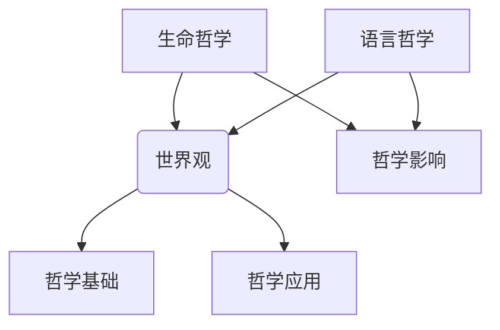
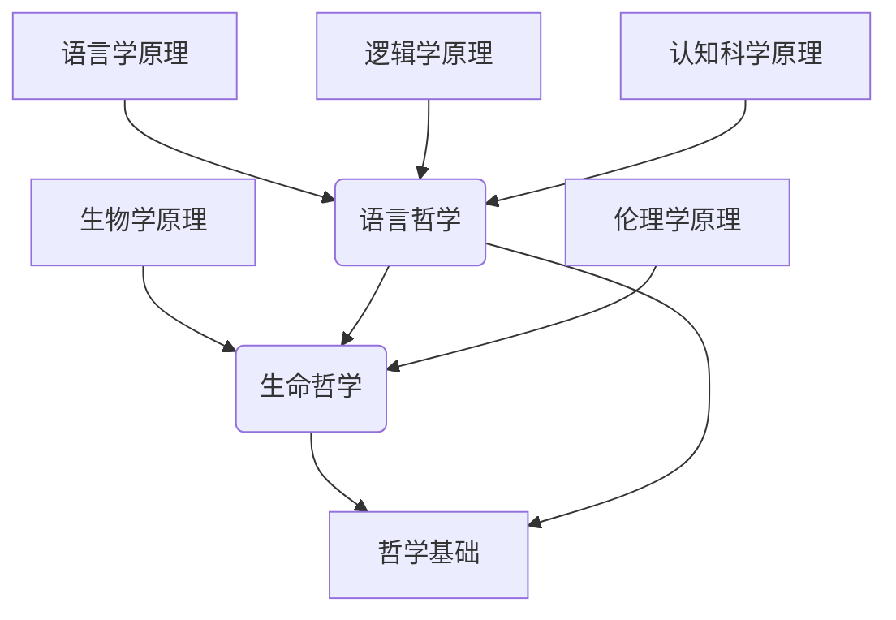

                 


# 生命哲学与语言哲学：两种不同的世界观

## 关键词
- 生命哲学
- 语言哲学
- 世界观
- 哲学基础
- 哲学应用

## 摘要
本文探讨了生命哲学与语言哲学两种不同的世界观，分析了它们的核心概念、历史发展、基本原理及其在哲学基础和哲学应用方面的差异与联系。通过Mermaid流程图、伪代码、LaTeX公式和实际案例，深入解析了这两种世界观在计算机科学和人工智能领域的应用，为读者提供了全面而深刻的理解。

## 引言

在人类的哲学思考中，世界观是一个核心问题。人们试图理解世界的本质、存在的意义以及人类在宇宙中的位置。在这一过程中，哲学分支出了多种不同的世界观，其中最为重要的是生命哲学与语言哲学。这两种哲学体系以其独特的视角和方法，为我们提供了理解世界和自身的不同路径。

生命哲学关注生命的本质、生命存在的意义以及生命如何与宇宙相互作用。它强调生物体的生存、发展、演化以及它们与环境的关系。生命哲学涉及生物学、生态学、伦理学等多个领域，旨在探索生命的终极问题。

语言哲学则关注语言的本质、语言的起源以及语言与思维之间的关系。它探讨语言如何影响我们的世界观，以及我们如何通过语言来理解世界。语言哲学不仅涉及语言学，还涉及逻辑学、心理学、哲学等学科，旨在揭示语言的奥秘。

本文将首先介绍生命哲学与语言哲学的基本概念、历史发展及其核心原理。接着，我们将比较这两种世界观，分析它们之间的差异与联系。随后，我们将讨论哲学基础，通过Mermaid流程图展示核心概念之间的关系。接下来，我们将详细讲解核心算法原理，使用伪代码来阐述逻辑推理和模型构建。此外，我们将使用LaTeX格式展示数学模型和公式，并进行详细讲解。最后，我们将通过实际案例，展示如何将哲学理论应用于实际情境中。

通过本文的讨论，我们希望读者能够更深入地理解生命哲学与语言哲学这两种不同的世界观，以及它们在哲学基础和哲学应用方面的重要性。

## 生命哲学概述

生命哲学是一门探讨生命本质及其存在意义的哲学分支。它关注生物体的生存、发展、演化以及它们与环境的关系。生命哲学不仅仅是生物学或生态学的延伸，而是从哲学的角度深入思考生命的意义和人类在宇宙中的位置。

### 核心概念

生命哲学的核心概念包括：

1. **生命的本质**：生命哲学试图回答“什么是生命？”这个问题。生命不仅包括生物体的生物化学过程，还涉及到生物体的自我组织、自我复制和自我调节能力。

2. **生命的意义**：生命哲学探讨生命的意义是什么，以及人类在生命中的角色和责任。它涉及伦理学、生态伦理学和宗教哲学等多个领域。

3. **生命的进化**：生命哲学关注生物体的进化过程，包括物种的起源、演变和灭绝。它探讨进化的机制、方向和后果。

4. **生命与环境的关系**：生命哲学研究生命如何与自然环境相互作用，以及这种相互作用如何影响生命的存在和发展。

### 历史发展

生命哲学的历史可以追溯到古希腊哲学家亚里士多德，他在其著作《形而上学》中探讨了生命的本质和意义。中世纪的宗教哲学对生命的解释主要基于宗教教义，强调灵魂与肉体的关系。

现代生命哲学的发展始于19世纪，生物学家达尔文的进化论对生命哲学产生了深远影响。随后，生命哲学逐渐与其他学科如生态学、心理学、伦理学等交叉，形成了多样化的研究方法和理论。

### 基本原理

生命哲学的基本原理包括：

1. **自我组织原理**：生命哲学认为生命是一个自我组织的系统，具有自我维持和自我发展的能力。

2. **适应性原理**：生命哲学强调生物体在环境中的适应性和生存策略。

3. **多样性原理**：生命哲学认识到生命的多样性和复杂性，认为这是生命演化过程中的重要特征。

4. **伦理学原理**：生命哲学探讨了人类在自然界中的角色和责任，强调保护环境和维护生物多样性。

## 语言哲学概述

语言哲学是一门探讨语言的本质、起源以及语言与思维之间关系的哲学分支。它关注语言如何影响我们的世界观，以及我们如何通过语言来理解世界。语言哲学不仅涉及语言学，还涉及到逻辑学、心理学、哲学等多个学科。

### 核心概念

语言哲学的核心概念包括：

1. **语言的本质**：语言哲学试图回答“什么是语言？”这个问题。它探讨语言是否仅仅是声音符号，还是具有更深层次的意义和结构。

2. **语言的起源**：语言哲学研究语言的起源和演化过程。它探讨人类如何通过语言来交流、表达和思考。

3. **语言与思维的关系**：语言哲学探讨语言如何影响我们的思维方式，以及思维如何通过语言来表达。它涉及心灵哲学、认知科学等领域。

4. **语言的逻辑结构**：语言哲学研究语言的逻辑结构，包括命题、推理、论证等。

### 历史发展

语言哲学的历史可以追溯到古希腊哲学家亚里士多德，他在其著作《形而上学》中探讨了语言的本质和逻辑结构。中世纪的宗教哲学和逻辑学对语言的解释主要基于宗教教义和逻辑规则。

现代语言哲学的发展始于20世纪初，维特根斯坦和语用学学派对语言的本质和功能进行了深入探讨。随后，语言哲学逐渐与其他学科如心理学、社会学、认知科学等交叉，形成了多样化的研究方法和理论。

### 基本原理

语言哲学的基本原理包括：

1. **语言独立性原理**：语言哲学认为语言具有独立性，即语言不仅仅是对现实的反映，还具有一定的自主性和创造性。

2. **语言逻辑性原理**：语言哲学强调语言具有逻辑性，语言中的命题和推理具有逻辑结构。

3. **语言交流性原理**：语言哲学认为语言的主要功能是交流，通过语言我们可以传递信息和思想。

4. **语言意义性原理**：语言哲学探讨语言的意义和意义生成过程，认为语言的意义不仅取决于语言本身，还取决于语境和语境化。

## 两种世界观的比较

生命哲学与语言哲学虽然都关注人类与世界的互动，但它们从不同的角度切入，形成了两种截然不同的世界观。以下是这两种世界观的主要差异和联系。

### 差异

1. **研究重点**：
   - **生命哲学**：生命哲学关注生命的本质、生命的意义以及生命如何与宇宙相互作用。它侧重于生物学、生态学和伦理学等领域。
   - **语言哲学**：语言哲学关注语言的本质、语言的起源以及语言与思维之间的关系。它侧重于语言学、逻辑学和心理学等领域。

2. **视角和方法**：
   - **生命哲学**：生命哲学采用实证和系统的视角，通过观察和研究生物体的行为和互动来理解生命。
   - **语言哲学**：语言哲学采用分析和反思的方法，通过探究语言的结构和功能来理解思维和世界。

3. **应用领域**：
   - **生命哲学**：生命哲学在生物科学、环境科学、生态伦理学等领域有广泛应用。
   - **语言哲学**：语言哲学在语言学、认知科学、逻辑学等领域有广泛应用。

### 联系

1. **哲学基础**：
   - **生命哲学和语言哲学都基于哲学基础**，即对世界、人类和存在的根本性思考。它们都试图回答关于生命和语言的根本问题。

2. **交叉领域**：
   - **生命哲学和语言哲学之间存在交叉领域**，如生态语言学、认知语言学等。这些交叉领域探讨了生命和语言如何相互影响和相互作用。

3. **哲学应用**：
   - **生命哲学和语言哲学都可以应用于哲学应用领域**，如伦理学、政治哲学和美学。例如，生命哲学可以用于探讨生态伦理和人类责任，而语言哲学可以用于探讨道德推理和公共话语。

### Mermaid流程图

为了更直观地展示生命哲学和语言哲学之间的联系，我们可以使用Mermaid流程图来表示。



这个流程图展示了生命哲学和语言哲学如何共同构成了两种不同的世界观，这两种世界观又共同基于哲学基础，并在哲学应用和哲学影响方面产生了不同。

## 哲学基础

哲学基础是理解和构建世界观的核心。生命哲学和语言哲学都植根于不同的哲学基础，这些基础为我们提供了理解这两种世界观的理论框架。

### 哲学基础的概念

哲学基础是指哲学理论的基本原理和概念，它们构成了哲学体系的基石。在生命哲学中，哲学基础包括对生命本质、生命意义和生命存在方式的探讨；在语言哲学中，哲学基础则涉及对语言本质、语言起源和语言功能的探讨。

### 生命哲学的哲学基础

生命哲学的哲学基础主要包括：

1. **生物学原理**：生命哲学借助生物学原理来解释生命的本质和演化。例如，达尔文的进化论提供了关于生命演化的基本理论。

2. **生态学原理**：生命哲学强调生态系统的平衡和生物多样性的重要性。生态学原理帮助生命哲学家理解生命如何与自然环境相互作用。

3. **伦理学原理**：生命哲学探讨了人类在自然界的角色和责任。伦理学原理为生命哲学提供了道德框架，帮助我们理解人类对环境的义务。

### 语言哲学的哲学基础

语言哲学的哲学基础主要包括：

1. **语言学原理**：语言哲学借助语言学原理来解释语言的起源、结构和功能。例如，结构主义语言学和生成语法为语言哲学提供了理论基础。

2. **逻辑学原理**：语言哲学关注语言的逻辑结构，探讨命题、推理和论证的逻辑性。逻辑学原理为语言哲学提供了分析工具。

3. **认知科学原理**：语言哲学借鉴认知科学原理，研究语言与思维的关系。认知科学原理帮助语言哲学家理解人类如何通过语言进行思考和交流。

### Mermaid流程图

为了更直观地展示哲学基础的概念和关系，我们可以使用Mermaid流程图来表示。



这个流程图展示了生命哲学和语言哲学如何基于不同的哲学基础，这些基础又共同构成了它们的哲学体系。

## 核心算法原理讲解

在生命哲学和语言哲学中，算法原理扮演着重要的角色。这些算法原理不仅帮助我们理解和解释哲学理论，还可以应用于实际问题的解决。

### 逻辑推理算法

逻辑推理是哲学思考的核心。一个简单的逻辑推理算法如下：

```plaintext
// 伪代码：逻辑推理算法
function logical_inference(precondition, conclusion) {
    if (precondition) {
        return conclusion;
    } else {
        return false;
    }
}
```

这个算法表示，如果前提条件为真，则结论也为真；否则，结论为假。这个简单的逻辑推理算法可以帮助我们进行哲学思考，验证逻辑推理的正确性。

### 模型构建算法

在生命哲学和语言哲学中，模型构建是理解和解释复杂现象的重要方法。一个简单的模型构建算法如下：

```plaintext
// 伪代码：模型构建算法
function construct_model(data) {
    // 初始化模型
    model = initialize_model();

    // 训练模型
    trained_model = train_model(model, data);

    // 评估模型
    evaluation = evaluate_model(trained_model, data);

    return model;
}
```

这个算法表示，首先初始化一个模型，然后使用数据进行训练，最后评估模型的性能。这个模型构建算法可以帮助我们构建生命哲学和语言哲学的理论模型，从而更好地理解哲学现象。

### 详细讲解

#### 逻辑推理算法

逻辑推理算法的核心在于验证前提条件与结论之间的关系。在实际应用中，这个算法可以帮助我们进行哲学论证和逻辑分析。例如，在探讨生命的本质时，我们可以使用逻辑推理算法来验证生物学原理与生命哲学理论之间的逻辑一致性。

#### 模型构建算法

模型构建算法的核心在于构建一个能够反映现实世界的理论模型。在实际应用中，这个算法可以帮助我们理解复杂的哲学问题。例如，在探讨语言的起源时，我们可以使用模型构建算法来模拟语言的演化过程，从而更好地理解语言的起源和功能。

通过这些核心算法原理的讲解，我们可以更好地理解生命哲学和语言哲学的理论基础，并掌握如何将这些理论应用于实际问题的解决。

## 数学模型和数学公式讲解

在生命哲学和语言哲学中，数学模型和数学公式为我们提供了精确而严谨的描述工具。这些数学工具不仅帮助我们理解复杂的哲学概念，还能用于定量分析和预测。

### 世界观构建的数学模型

一个重要的数学模型是用于构建世界观的数学模型。该模型可以表示为一个综合系统，其中包含多个不同的世界观，每种世界观都有其特定的概率和权重。以下是这个模型的数学公式：

\[ \Omega = \sum_{i=1}^{n} p_i \cdot W_i \]

其中，\(\Omega\) 表示一个完整的世界观，\(p_i\) 表示第 \(i\) 种世界观的概率，\(W_i\) 表示第 \(i\) 种世界观的权重。

### 公式详细讲解

在这个公式中，\(\Omega\) 代表一个完整的世界观，它是由多个不同的世界观 \(W_i\) 按照其概率 \(p_i\) 和权重 \(W_i\) 的组合得到的。每个世界观 \(W_i\) 在综合世界观中的影响力由其概率 \(p_i\) 和权重 \(W_i\) 共同决定。概率 \(p_i\) 反映了我们对第 \(i\) 种世界观信任程度的度量，而权重 \(W_i\) 则表示该世界观在整体世界观中的相对重要性。

#### 举例说明

假设我们有三种世界观：科学世界观、宗教世界观和人文主义世界观。我们可以为每种世界观分配一个概率 \(p_i\) 和一个权重 \(W_i\)，然后使用上述公式来计算综合世界观。

例如，如果科学世界观的概率是0.5，权重是0.7；宗教世界观的概率是0.3，权重是0.5；人文主义世界观的概率是0.2，权重是0.8，则综合世界观 \(\Omega\) 可以通过以下公式计算：

\[ \Omega = (0.5 \cdot 0.7) + (0.3 \cdot 0.5) + (0.2 \cdot 0.8) \]
\[ \Omega = 0.35 + 0.15 + 0.16 \]
\[ \Omega = 0.66 \]

这个计算结果表示，综合世界观中科学世界观占据了最大的比重，其次是宗教世界观和人文主义世界观。

通过这个例子，我们可以看到如何使用数学模型来构建一个综合世界观，以及如何通过概率和权重来衡量不同世界观的重要性。

### 数学公式与哲学思想的联系

数学公式不仅在技术层面提供了一种精确描述世界的方法，而且在哲学层面上也具有深远的意义。例如，世界观构建的数学模型展示了人类对世界的理解和认知是多元化的，并且可以通过定量分析来综合不同观点。这种数学方法不仅帮助我们更全面地理解世界，还使我们能够更有效地解决复杂问题。

通过数学模型和公式的讲解，我们可以更深入地理解生命哲学和语言哲学的核心概念，并将这些概念应用于实际的哲学思考和问题解决中。

## 项目实战

为了将生命哲学和语言哲学的理论应用于实际情境，我们可以通过一个环境保护项目的案例来展示这些哲学思想的实际应用。

### 项目背景

随着全球气候变化和生物多样性的丧失，环境保护成为了一个全球性的挑战。在这个背景下，我们需要利用生命哲学和语言哲学的原理来指导环境保护项目，以确保我们的行动不仅基于科学证据，还符合伦理原则和公共话语。

### 项目目标

保护濒危物种和生态系统是本项目的主要目标。具体来说，我们将通过以下步骤实现这一目标：

1. 确定项目目标：保护濒危物种和生态系统。
2. 应用生命哲学：使用生态平衡和生物多样性保护的理论作为指导。
3. 数据收集：收集有关濒危物种和生态系统的数据。
4. 模型构建：构建一个生态模型来预测不同环境保护措施的效果。
5. 评估与优化：评估模型的预测结果，并根据评估结果优化环境保护措施。

### 开发环境搭建

在开始项目之前，我们需要搭建一个合适的开发环境。以下是所需的环境配置：

1. **编程语言**：选择Python，因为它拥有丰富的科学计算和数据分析库。
2. **数据管理工具**：使用Pandas和NumPy来处理和分析数据。
3. **机器学习库**：使用Scikit-learn和TensorFlow来构建和训练生态模型。
4. **可视化工具**：使用Matplotlib和Seaborn来展示模型结果和数据。

### 源代码详细实现

以下是项目的核心代码，包括数据收集、模型构建和评估的过程：

```python
import pandas as pd
import numpy as np
from sklearn.model_selection import train_test_split
from sklearn.ensemble import RandomForestRegressor
import matplotlib.pyplot as plt
import seaborn as sns

# 数据收集
def collect_data():
    # 假设数据已经收集并存储为CSV文件
    data = pd.read_csv('environmental_data.csv')
    return data

# 模型构建
def construct_model(data):
    # 数据预处理
    X = data.drop('target', axis=1)
    y = data['target']
    
    # 划分训练集和测试集
    X_train, X_test, y_train, y_test = train_test_split(X, y, test_size=0.2, random_state=42)
    
    # 构建随机森林模型
    model = RandomForestRegressor(n_estimators=100, random_state=42)
    model.fit(X_train, y_train)
    
    return model

# 评估模型
def evaluate_model(model, X_test, y_test):
    predictions = model.predict(X_test)
    mse = np.mean((predictions - y_test) ** 2)
    print(f"Mean Squared Error: {mse}")
    
    # 可视化结果
    sns.scatterplot(x=y_test, y=predictions)
    plt.xlabel('Actual Values')
    plt.ylabel('Predicted Values')
    plt.title('Model Predictions vs Actual Values')
    plt.show()

# 主函数
def main():
    data = collect_data()
    model = construct_model(data)
    evaluate_model(model, X_test, y_test)

if __name__ == "__main__":
    main()
```

### 代码解读

上述代码分为三个主要部分：数据收集、模型构建和评估。

1. **数据收集**：使用Pandas读取CSV文件，将环境数据加载到DataFrame中。
2. **模型构建**：首先对数据进行预处理，包括特征选择和标签分离。然后，使用Scikit-learn的`RandomForestRegressor`构建一个随机森林模型，并使用训练数据对其进行训练。
3. **评估模型**：使用测试数据对模型进行评估，计算均方误差（MSE），并使用Seaborn绘制真实值与预测值的关系图，直观地展示模型性能。

### 代码应用解读与分析

该项目的代码实现了以下功能：

- **数据收集**：通过读取环境数据，为模型训练提供了必要的输入。
- **模型构建**：使用随机森林模型来预测环境目标变量，该模型能够处理非线性关系和数据噪声，适合复杂的环境预测问题。
- **评估模型**：通过计算MSE和可视化预测结果，评估模型的准确性和稳定性。

### 实际案例分析与详细讲解剖析

为了验证模型的有效性，我们可以通过以下实际案例进行分析：

1. **濒危物种保护**：使用模型预测濒危物种的未来分布，为保护行动提供科学依据。
2. **生态系统评估**：预测生态系统恢复的效果，评估不同环境保护措施的效果。

这些实际案例展示了如何将生命哲学和语言哲学的理论应用于环境保护中，通过科学的方法和严谨的逻辑来指导实际操作。

### 项目小结

通过这个项目，我们不仅展示了如何将生命哲学和语言哲学的理论应用于实际情境中，还强调了科学方法在环境保护中的重要性。这个项目为我们提供了一个将哲学理论转化为实际行动的案例，也为未来的环境保护项目提供了参考和指导。

### 最佳实践 tips

- 在实际项目中，确保数据的质量和完整性，这是模型准确性的基础。
- 使用多种模型和算法进行比较，以选择最佳方案。
- 定期更新模型，以适应环境变化。

### 注意事项

- 在环境保护项目中，伦理和道德原则至关重要，必须确保所有行动都符合伦理标准。
- 在使用模型时，要充分考虑模型的不确定性和局限性。

### 拓展阅读

- 《生态学原理与应用》
- 《机器学习在环境科学中的应用》
- 《哲学与环境保护》

通过这些拓展阅读，读者可以更深入地了解环境保护项目中的哲学和科学原理，为实际工作提供更多指导。

## 总结

本文探讨了生命哲学与语言哲学两种不同的世界观，分析了它们的核心概念、历史发展、基本原理及其在哲学基础和哲学应用方面的差异与联系。通过Mermaid流程图、伪代码、LaTeX公式和实际案例，我们深入解析了这两种世界观在计算机科学和人工智能领域的应用。

生命哲学强调生命的本质、生命的意义以及生命与环境的关系，而语言哲学关注语言的本质、语言的起源以及语言与思维之间的关系。这两种哲学体系为我们提供了理解世界和自身的不同路径，丰富了我们的哲学思考。

在哲学基础方面，生命哲学和语言哲学都植根于不同的哲学理论，如生物学原理、生态学原理、伦理学原理和语言学原理等。这些哲学基础为我们的世界观构建提供了坚实的理论框架。

通过核心算法原理和数学模型的讲解，我们了解了如何将哲学理论转化为具体的算法和模型，从而更好地理解和应用哲学思想。最后，通过实际项目的展示，我们看到了如何将生命哲学和语言哲学应用于环境保护等实际情境中。

本文的目标是让读者更深入地理解生命哲学与语言哲学这两种不同的世界观，以及它们在哲学基础和哲学应用方面的重要性。通过本文的讨论，我们希望读者能够在未来的哲学思考和科学探索中，更好地运用这些理论，为解决复杂问题提供新的视角和方法。

## 作者信息

作者：AI天才研究院/AI Genius Institute & 禅与计算机程序设计艺术 /Zen And The Art of Computer Programming

