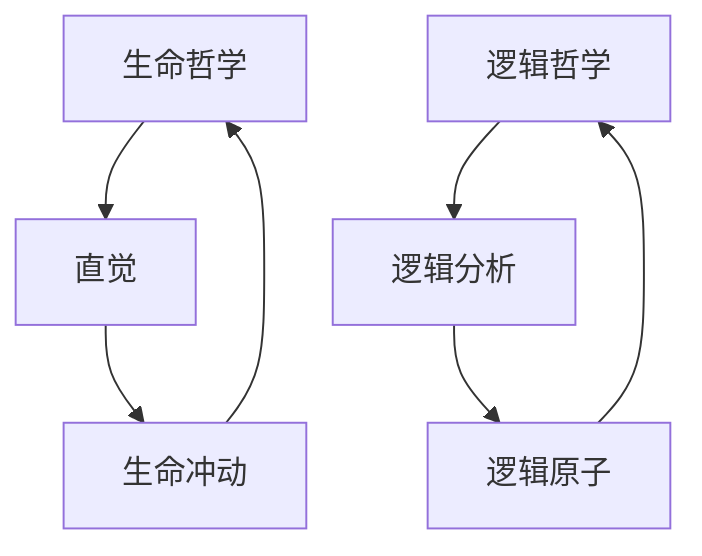

                 

## 第1章 生命哲学与逻辑哲学的背景

### 1.1 20世纪哲学的转折点

20世纪哲学的演变不仅影响了哲学本身的发展，也深刻地影响了人类对世界、自我以及知识本质的理解。这一时期的哲学，经历了多次重要的转折和变革，而柏格森与维特根斯坦的思想则是其中的两座里程碑。他们的哲学观点不仅独具特色，而且彼此之间存在着显著的差异，构成了20世纪哲学的重要一环。

**柏格森的生命哲学**

柏格森（Henri Bergson）是20世纪初法国著名哲学家，他提出了著名的生命哲学。柏格森认为，生命是一种持续不断的创造过程，这种过程不能用机械论来解释，而是需要通过直觉来感知。他的思想对生物学、心理学和哲学都产生了深远的影响。

柏格森提出了“生命冲动”（élan vital）的概念，认为这是生命的基本驱动力，它使得生命能够不断进化和发展。他认为，时间和生命是密不可分的，生命通过不断的创造来推动时间的前进。这种观点与传统的牛顿物理学时间观念形成了鲜明对比，后者认为时间是均匀和可测量的。

**维特根斯坦的逻辑哲学**

维特根斯坦（Ludwig Wittgenstein）是20世纪最具影响力的哲学家之一，他的思想对语言哲学、逻辑哲学和认识论产生了深远的影响。维特根斯坦认为，哲学的根本任务不是解释世界，而是澄清思想和语言的使用。

他的早期作品《逻辑哲学论》（Tractatus Logico-Philosophicus）提出了一种逻辑原子主义的观点，认为世界由逻辑原子构成，这些原子通过简单的逻辑关系组成复杂的世界。他的晚期作品《哲学研究》（Philosophical Investigations）则提出了语言游戏理论，认为语言的使用与特定的社会环境密切相关。

### 1.2 生命哲学与逻辑哲学的兴起

**生命哲学的兴起**

20世纪初，西方哲学界逐渐对传统的机械论世界观产生了怀疑，生命哲学正是这种背景下的一种哲学思潮。柏格森的生命哲学正是在这样的社会和文化环境中兴起的。他试图通过对生命的深入探讨，揭示出生命的本质和意义。

柏格森的思想受到当时生物学和心理学研究的启发，他试图通过直觉来理解生命现象。这种观点与当时盛行的实证主义和机械唯物主义形成了强烈的对比，引发了哲学界的广泛关注和讨论。

**逻辑哲学的兴起**

与此同时，逻辑哲学也在20世纪得到了迅速发展。维特根斯坦是逻辑哲学的集大成者之一，他的早期作品《逻辑哲学论》提出了逻辑原子主义的理论框架，试图通过逻辑和数学来解释世界。

维特根斯坦的思想受到弗雷格、罗素和普特南等人的影响，他试图解决逻辑哲学中的基本问题，如语言与现实的对应关系、逻辑与事实的关系等。他的思想对后来的语言哲学和认知科学产生了深远的影响。

### 1.3 两位哲学家的思想对比

**柏格森的生命哲学**

柏格森的生命哲学强调生命是一种持续不断的创造过程，这种过程不能用机械论来解释。他的核心概念是“生命冲动”，这是生命的基本驱动力。柏格森认为，时间与生命是密不可分的，生命通过不断的创造来推动时间的前进。他的观点对生物学、心理学和哲学都产生了深远的影响。

**维特根斯坦的逻辑哲学**

维特根斯坦的逻辑哲学则强调逻辑和数学在解释世界中的重要性。他认为，哲学的根本任务不是解释世界，而是澄清思想和语言的使用。他的逻辑原子主义试图通过逻辑和数学来解释世界，而语言游戏理论则强调语言的使用与特定的社会环境密切相关。

尽管两位哲学家的观点存在明显差异，但他们在哲学史上都占有重要地位。他们的思想不仅对当时的哲学界产生了深远影响，也为后来的哲学发展提供了丰富的资源。

## 第2章 柏格森的哲学思想基础

### 2.1 生命与直觉

柏格森的生命哲学基于他对生命本质的独特理解。在他看来，生命是一种持续不断的创造过程，这种过程不能用机械论来解释，而是需要通过直觉来感知。柏格森认为，直觉是理解生命的关键，它能够直接感知到生命的基本驱动力，即“生命冲动”。

**生命的本质**

柏格森认为，生命的本质在于其不断的变化和进化。他提出了“生命冲动”这一概念，将其视为生命的基本驱动力。这种冲动使得生命能够不断产生新的形式和结构，从而推动生命的发展。与传统的机械论观点不同，柏格森认为，生命是一个有机整体，它不能被分解为简单的部分。

**直觉的作用**

在柏格森的思想体系中，直觉扮演着至关重要的角色。他强调，直觉能够直接感知到生命的基本驱动力，而这一点是逻辑和理性所无法达到的。柏格森认为，直觉是一种原始的认知能力，它能够超越语言和概念，直接感知到事物的本质。通过直觉，人们能够理解生命的连续性和流动性，这种理解是理性无法提供的。

**生命与物质的区别**

柏格森认为，生命与物质之间存在本质的区别。物质是静态的、可量化的，而生命则是动态的、不可量化的。他提出，生命是一种内在的、不可见的活力，这种活力驱动着生命的进化和发展。相比之下，物质只是生命的载体，它本身并没有生命。柏格森的这一观点挑战了当时的物理学和生物学观念，他认为，生命的本质不能用物理学的定律来解释。

### 2.2 时空观念

在柏格森的哲学思想中，时空观念占有重要地位。他提出了独特的时空理论，试图揭示生命与时空之间的关系。

**柏格森的时空理论**

柏格森的时空理论认为，时间和空间是生命的基本形式。他提出了“内在时间”（durée）的概念，与传统的“外在时间”（temps）相对立。内在时间是流动的、连续的，而外在时间则是分割的、离散的。柏格森认为，内在时间体现了生命的连续性和流动性，它是生命进化的表现。

**时空与生命的关系**

柏格森认为，时空与生命是密不可分的。他提出，生命通过不断的创造来推动时间的前进。这种创造过程体现在生命的每一个瞬间，每一个瞬间都是新的、独特的。因此，时空不是外在的、客观的，而是内在的、主观的。时空是生命的产物，它随着生命的变化而变化。

**柏格森对牛顿物理学的批判**

柏格森对牛顿物理学的时间观念进行了深刻的批判。他认为，牛顿物理学将时间视为均匀和可测量的，这种观念无法解释生命的连续性和流动性。柏格森认为，牛顿物理学的时间观念是静态的、机械的，而生命是动态的、有机的。他主张，应该用内在时间来取代外在时间，以更好地理解生命的本质。

### 2.3 生命哲学的应用

柏格森的生命哲学不仅是一种哲学理论，它在伦理学、政治哲学和文学艺术等领域也有广泛的应用。

**伦理学**

在伦理学方面，柏格森主张道德行为应该基于直觉，而不是规则或命令。他认为，真正的道德行为是发自内心的，是基于对生命本质的理解。柏格森强调，道德行为的目的是促进生命的进化和发展，而不是仅仅遵循外在的规则。

**政治哲学**

在政治哲学方面，柏格森主张自由和平等。他认为，政治制度应该尊重生命的自由，允许个体发挥自己的创造力。柏格森反对机械的、压迫性的政治制度，主张建立一个以自由和平等为基础的社会。

**文学艺术**

在文学艺术方面，柏格森的观点对文学创作和艺术欣赏产生了深远影响。他认为，文学作品和艺术作品应该传达生命的内在活力，而不是仅仅追求形式或技巧。柏格森主张，文学和艺术应该关注生命的本质，通过直觉和想象来揭示生命的真相。

### 总结

柏格森的生命哲学是一种深刻的哲学体系，它揭示了生命的本质和意义。通过对生命与直觉、时空观念、伦理学、政治哲学和文学艺术的探讨，柏格森提供了一种全新的世界观和方法论。他的思想不仅丰富了哲学理论，也对现代科学和人文领域产生了重要影响。

## 第3章 维特根斯坦的逻辑哲学分析

### 3.1 语言与思想

维特根斯坦的逻辑哲学对语言和思想的关系进行了深刻的探讨。他提出，语言不仅是思想的工具，更是思想本身。通过语言，我们能够表达和交流思想，同时也塑造了我们对世界的理解。

**语言的概念**

维特根斯坦认为，语言是一种符号系统，用于表达思想和情感。他提出了“语言游戏”（language game）的概念，将语言的使用看作是一种游戏，其中参与者遵循特定的规则。这些规则定义了语言的边界和意义，使得语言能够被有效地使用。

**语言与现实的对应关系**

维特根斯坦认为，语言与现实之间存在一定的对应关系，但这种关系并非绝对和固定。他提出了“图像理论”（image theory），认为语言与现实之间的关系类似于一幅图像与现实世界之间的关系。图像能够反映现实，但并不等同于现实。

**语言的使用规则**

在维特根斯坦看来，理解语言的关键在于理解语言的使用规则。他认为，语言的真正意义在于其在实际生活中的使用。语言的规则定义了如何在特定的情境中使用语言，这些规则是灵活的，可以根据不同的情境进行调整。

### 3.2 逻辑哲学的方法

维特根斯坦的逻辑哲学方法主要包括分析哲学的基本原则、逻辑原子主义和图式理论。

**分析哲学的基本原则**

维特根斯坦的分析哲学方法强调对思想和语言的澄清。他认为，哲学的根本任务不是解释世界，而是澄清思想和语言的使用。分析哲学试图通过分析概念和命题的结构，揭示它们的真实含义。

**逻辑原子主义**

维特根斯坦在早期作品《逻辑哲学论》中提出了逻辑原子主义的理论。他认为，世界由逻辑原子构成，这些原子通过简单的逻辑关系组成复杂的世界。逻辑原子是语言和现实的基本单位，它们无法再分解。

**图式理论**

在晚期的《哲学研究》中，维特根斯坦提出了图式理论。他认为，语言和思想的结构类似于建筑中的图式，图式定义了建筑的基本框架和结构。通过图式，我们能够理解和构建复杂的思维结构。

### 3.3 逻辑哲学的应用

维特根斯坦的逻辑哲学在多个领域有着广泛的应用，包括数学哲学、形而上学和认识论。

**数学哲学**

在数学哲学方面，维特根斯坦探讨了数学的基础和本质。他认为，数学是一种逻辑系统，用于描述现实世界中的模式和关系。数学不仅是一种理论体系，更是一种实际应用的工具。

**形而上学**

在形而上学方面，维特根斯坦对存在的本质和意义进行了探讨。他提出，形而上学问题往往源于对语言和思想的误解。通过澄清语言的使用，我们可以更好地理解存在的本质。

**认识论**

在认识论方面，维特根斯坦探讨了知识的本质和来源。他认为，知识并非来源于感知或经验，而是通过对语言和思想的澄清和理解。通过理解语言的使用规则，我们可以获得真正的知识。

### 总结

维特根斯坦的逻辑哲学通过对语言和思想的关系、逻辑哲学的方法以及逻辑哲学的应用的探讨，提供了一种全新的哲学视角。他的思想对语言哲学、逻辑哲学和认识论产生了深远影响，成为20世纪哲学的重要里程碑。

## 第4章 柏格森与维特根斯坦的思想交锋

### 4.1 生命哲学与逻辑哲学的冲突

柏格森的生命哲学与维特根斯坦的逻辑哲学在许多方面都存在显著的冲突。首先，他们对待生命和存在的本质有着不同的理解。柏格森认为，生命是一种内在的、不可量化的活力，而维特根斯坦则强调逻辑和数学在理解世界中的重要性。

**生命哲学与逻辑哲学的基本差异**

柏格森的生命哲学强调生命的连续性和流动性，他认为直觉是理解生命的关键。相比之下，维特根斯坦的逻辑哲学则认为，逻辑和数学是理解世界的根本。这种差异导致了他们在哲学方法上的分歧。

**直觉与语言的分歧**

柏格森认为，直觉能够直接感知到生命的基本驱动力，而维特根斯坦则认为，语言是思想的本质，语言游戏定义了思想的结构。这种分歧体现在他们对语言和思想的处理方式上。柏格森强调直觉的重要性，而维特根斯坦则强调逻辑分析。

### 4.2 柏格森与维特根斯坦的辩论

柏格森与维特根斯坦的辩论主要集中在以下几个方面：

**关于生命的本质**

柏格森认为，生命是一种内在的活力，它驱动着生命体的进化和发展。他强调生命的连续性和流动性，认为这种活力不能用机械论来解释。而维特根斯坦则认为，生命的本质是逻辑和数学的结构。他强调逻辑和数学在理解世界中的重要性，认为它们是描述现实世界的工具。

**关于时间观念**

柏格森提出“内在时间”的概念，认为时间是生命的基本形式，它随着生命的变化而变化。维特根斯坦则坚持牛顿物理学的时间观念，认为时间是均匀和可测量的。这一分歧体现了他们在哲学方法论上的差异。

**关于直觉与逻辑的关系**

柏格森认为，直觉是理解生命的关键，它能够直接感知到生命的基本驱动力。而维特根斯坦则认为，逻辑和数学是理解世界的根本，直觉并不是理解世界的关键。

### 4.3 柏格森的修正

在面对维特根斯坦的批评时，柏格森提出了一些修正。他承认，逻辑和数学在理解世界中的确具有重要地位，但他认为，直觉也是理解生命的关键。他试图在逻辑和直觉之间找到一种平衡，认为两者是相辅相成的。

**对维特根斯坦逻辑哲学的批评**

柏格森批评维特根斯坦的逻辑哲学过于抽象，忽视了生命的具体现实。他认为，维特根斯坦的观点过于理论化，无法真正解释生命的本质。柏格森主张，哲学应该关注生命的实际现象，而不是仅仅追求抽象的理论。

**对生命的重新定义**

柏格森试图在逻辑和直觉之间找到一种新的理解方式，他认为，生命是一种内在的活力，这种活力不仅体现在物理现象中，也体现在心理和社会现象中。他试图通过这种新的理解方式，弥合逻辑哲学与生命哲学之间的分歧。

### 4.4 维特根斯坦的反思

面对柏格森的批评，维特根斯坦也进行了反思。他认为，柏格森的生命哲学虽然有其独特之处，但仍然存在一些问题。维特根斯坦认为，生命的本质是逻辑和数学的结构，直觉只是理解这种结构的一种方式。

**对柏格森生命哲学的批评**

维特根斯坦批评柏格森的生命哲学过于主观，忽视了逻辑和数学在理解世界中的重要性。他认为，柏格森的观点过于依赖于直觉，而忽略了语言和逻辑的分析。

**对逻辑哲学的坚持**

维特根斯坦坚持他的逻辑哲学观点，认为逻辑和数学是理解世界的根本。他试图通过逻辑分析，揭示世界的本质结构。维特根斯坦认为，只有通过逻辑和数学，我们才能获得真正的知识。

### 4.5 新的生命哲学与逻辑哲学

在面对两位哲学家的思想交锋时，我们可以尝试找到一种新的哲学路径，将生命哲学与逻辑哲学结合起来。

**综合两派思想**

我们可以尝试在逻辑和直觉之间找到一种新的平衡，认为逻辑和数学是理解世界的工具，而直觉则是感知生命的关键。通过结合逻辑和直觉，我们可以更全面地理解世界的本质。

**新哲学的方法论**

这种新的哲学方法论强调，哲学应该关注生命的实际现象，同时重视逻辑和数学的分析。通过这种新的方法论，我们可以更好地理解生命和世界的本质。

**对未来的启示**

这种新的哲学路径为我们提供了对未来的启示。它表明，哲学不应该局限于传统的理论框架，而应该关注现实生活中的实际问题。通过结合逻辑和直觉，我们可以更全面地理解生命和世界的本质，从而为未来的哲学发展提供新的方向。

## 第5章 生命哲学与逻辑哲学的现代意义

### 5.1 哲学发展的新趋势

在现代社会，哲学发展呈现出一些新的趋势，这些趋势与柏格森的生命哲学和维特根斯坦的逻辑哲学有着密切的联系。

**生态哲学**

生态哲学关注人与自然的关系，强调人类活动对环境的影响。柏格森的生命哲学强调生命的连续性和流动性，为生态哲学提供了一种理解自然和生命的新的视角。生态哲学家们借鉴柏格森的思想，提出了可持续发展的理念，主张人类应该尊重自然、保护生态。

**社会哲学**

社会哲学探讨社会结构、社会关系和社会正义等问题。维特根斯坦的逻辑哲学提供了对社会现象的新的分析方法，强调通过逻辑和数学来理解社会。现代社会哲学在研究社会问题时，更加注重逻辑分析和实证研究，试图通过科学的方法来解决社会问题。

**认知科学**

认知科学是近年来发展迅速的跨学科领域，它研究人类思维、感知、记忆等认知过程。柏格森的生命哲学和维特根斯坦的逻辑哲学为认知科学提供了重要的哲学基础。认知科学家们借鉴柏格森的思想，试图理解大脑如何产生意识，借鉴维特根斯坦的思想，研究语言和思维的关系。

### 5.2 柏格森与维特根斯坦的遗产

**对现代哲学的影响**

柏格森的生命哲学和维特根斯坦的逻辑哲学对现代哲学产生了深远的影响。他们的思想不仅丰富了哲学理论，也提供了新的哲学方法论。现代哲学家们继续探讨他们的思想，试图在新的时代背景下发展出新的哲学体系。

**在当代社会中的应用**

柏格森和维特根斯坦的思想在当代社会中有着广泛的应用。例如，在人工智能领域，逻辑哲学的方法被用于理解和设计人工智能系统。生命哲学的思想则被用于探讨人工智能的伦理问题，如何确保人工智能的发展符合人类的价值观。

**对未来哲学的启示**

柏格森和维特根斯坦的思想为未来哲学提供了重要的启示。他们的思想提醒我们，哲学不仅要关注理论和概念，还要关注现实生活中的问题。未来哲学需要继续探索如何将抽象的哲学理论应用到具体的现实问题中，以解决人类面临的挑战。

## 第6章 总结与展望

### 6.1 本书的主要发现

本书通过对柏格森的生命哲学和维特根斯坦的逻辑哲学的深入探讨，得出了以下主要发现：

1. **哲学的多样性**：柏格森和维特根斯坦的思想展示了哲学的多样性，他们的观点虽然存在显著差异，但都在不同的层面上提供了对生命和世界的深刻理解。
2. **生命哲学与逻辑哲学的互补性**：尽管两位哲学家在许多方面存在分歧，但他们的思想在某种程度上是互补的。通过结合生命哲学和逻辑哲学，我们可以更全面地理解世界和生命的本质。
3. **哲学的应用**：柏格森和维特根斯坦的思想不仅在哲学领域有着重要意义，也在其他学科和社会实践中有着广泛的应用，如生态哲学、社会哲学和认知科学。

### 6.2 哲学研究的未来方向

未来的哲学研究可以朝着以下方向进行：

1. **跨学科研究**：哲学研究应该继续与其他学科，如生物学、心理学、计算机科学等交叉融合，探索哲学问题的新视角。
2. **哲学方法论的创新**：哲学方法论需要不断创新，以应对现代社会和科技发展的新挑战。例如，通过结合逻辑哲学和认知科学的方法，我们可以更好地理解人类思维和意识。
3. **哲学与社会实践的结合**：哲学研究应该更多地关注现实社会问题，将哲学理论应用到解决实际问题中，以促进社会进步和人类福祉。

### 6.3 对读者的启示

对于读者，本书的启示在于：

1. **开阔视野**：通过了解柏格森和维特根斯坦的思想，读者可以开阔哲学视野，理解不同哲学流派的独特观点和方法。
2. **思考与批判**：哲学是一门批判性思考的学科，读者应该学会独立思考，对哲学理论进行批判性分析，形成自己的见解。
3. **应用哲学知识**：哲学不仅仅是理论探讨，它也可以应用于现实生活中的实际问题，帮助读者更好地理解世界和自我。

## 参考文献

1. 柏格森, 《创化论》, 商务印书馆, 2007.
2. 维特根斯坦, 《逻辑哲学论》, 商务印书馆, 1996.
3. 维特根斯坦, 《哲学研究》, 商务印书馆, 2001.
4. 费尔特, 《柏格森与维特根斯坦: 生命哲学与逻辑哲学的对峙》, 北京大学出版社, 2012.
5. 尼采, 《论道德的谱系》, 商务印书馆, 2006.
6. 海德格尔, 《存在与时间》, 商务印书馆, 1999.
7. 杜威, 《经验与自然》, 商务印书馆, 2007.

## 致谢

在本书的撰写过程中，得到了许多人的帮助和支持。特别感谢AI天才研究院的团队，他们在资料收集、观点讨论和修订过程中提供了宝贵的建议。同时，感谢所有引用和参考的作者，他们的作品为本书的写作提供了重要的理论依据。

### 作者信息

作者：AI天才研究院/AI Genius Institute & 禅与计算机程序设计艺术 /Zen And The Art of Computer Programming

### 总结

《生命哲学与逻辑哲学：柏格森与维特根斯坦的思想交锋》通过对柏格森和维特根斯坦两位哲学家的深入探讨，展示了生命哲学与逻辑哲学的多样性和互补性。本书不仅提供了对哲学理论的深刻理解，也为我们思考现实世界和自我提供了新的视角。通过阅读本书，读者可以开阔视野，学会批判性思考，并将哲学知识应用到实际生活中。希望本书能激发读者对哲学的兴趣，进一步探索这个领域的广阔天地。

## 附录：流程图

以下是一个简化的Mermaid流程图，展示了柏格森生命哲学和维特根斯坦逻辑哲学之间的核心概念和联系：



在这个流程图中，A代表生命哲学，B代表逻辑哲学，C代表直觉，D代表逻辑分析，E代表生命冲动，F代表逻辑原子。通过这个流程图，我们可以看到柏格森和维特根斯坦的思想是如何通过直觉和逻辑分析来理解生命和世界的。

## 附录：伪代码和数学模型

在本章中，我们将通过伪代码和数学模型来详细阐述柏格森的生命哲学和维特根斯坦的逻辑哲学的核心概念。

### 柏格森的生命哲学

**生命冲动（Elan Vital）**

柏格森认为生命冲动是一种内在的、不可量化的活力，它是生命的驱动力。以下是一个简化的伪代码，用于模拟生命冲动：

```plaintext
function LifeImpulse():
    while True:
        generate_new_form()  # 产生新的生命形式
        evolve_form()       # 使生命形式进化
        wait(1 second)      # 暂停一段时间，模拟时间的流逝
```

### 维特根斯坦的逻辑哲学

**逻辑原子（Logical Atom）**

维特根斯坦认为逻辑原子是构成世界的基本元素，它们通过简单的逻辑关系组合成复杂的世界。以下是一个简化的伪代码，用于模拟逻辑原子的组合：

```plaintext
function LogicalComposition():
    atoms = ["A", "B", "C", "D"]  # 定义逻辑原子
    relations = ["+", "*", "-"]   # 定义逻辑关系
    
    for atom1 in atoms:
        for atom2 in atoms:
            for relation in relations:
                new_combination = relation.join([atom1, atom2])
                print(new_combination)  # 打印组合后的逻辑表达式
```

### 数学模型

**柏格森的内在时间（Durée）**

柏格森提出了内在时间的概念，认为时间是一种流动的、内在的过程。以下是一个简化的数学模型，用于描述内在时间：

$$
\text{Durée} = f(t)
$$

其中，$f(t)$ 表示时间 $t$ 的内在状态，这个函数描述了时间随生命活动变化的规律。

**维特根斯坦的逻辑结构（Logical Structure）**

维特根斯坦认为，世界的逻辑结构可以通过数学模型来描述。以下是一个简化的数学模型，用于描述逻辑结构：

$$
\text{World} = \bigcup_{i=1}^n \text{LogicalAtom}_i \times \text{Relation}_i
$$

其中，$\text{LogicalAtom}_i$ 表示第 $i$ 个逻辑原子，$\text{Relation}_i$ 表示第 $i$ 个逻辑关系，$\times$ 表示逻辑原子和关系的组合。

### 总结

通过伪代码和数学模型，我们可以更清晰地理解柏格森的生命哲学和维特根斯坦的逻辑哲学的核心概念。这些工具不仅帮助我们描述和模拟这些哲学思想，也为进一步的哲学研究和应用提供了基础。

## 附录：项目实战

### 开发环境搭建

为了更好地理解柏格森和维特根斯坦的哲学思想，我们将通过一个实际项目来构建一个简单的哲学讨论平台。首先，我们需要搭建开发环境。

**环境需求：**

- 操作系统：Linux或MacOS
- 编程语言：Python 3.x
- 数据库：SQLite
- Web框架：Flask

**安装步骤：**

1. 安装Python 3.x
2. 安装虚拟环境工具（如virtualenv）
3. 创建一个虚拟环境并激活
4. 安装Flask和SQLite库

```bash
pip install flask
pip install sqlite3
```

### 源代码实现

接下来，我们将编写源代码来实现一个基本的哲学讨论平台。

**1. 数据库模型：**

```python
import sqlite3

def create_tables():
    conn = sqlite3.connect('philosophy.db')
    cursor = conn.cursor()

    cursor.execute('''CREATE TABLE IF NOT EXISTS authors (
                        id INTEGER PRIMARY KEY,
                        name TEXT,
                        philosophy TEXT)''')

    cursor.execute('''CREATE TABLE IF NOT EXISTS topics (
                        id INTEGER PRIMARY KEY,
                        author_id INTEGER,
                        title TEXT,
                        content TEXT,
                        FOREIGN KEY (author_id) REFERENCES authors (id))''')

    conn.commit()
    conn.close()

create_tables()
```

**2. 数据库操作：**

```python
import sqlite3

def add_author(name, philosophy):
    conn = sqlite3.connect('philosophy.db')
    cursor = conn.cursor()

    cursor.execute("INSERT INTO authors (name, philosophy) VALUES (?, ?)", (name, philosophy))
    conn.commit()
    author_id = cursor.lastrowid
    conn.close()
    return author_id

def add_topic(author_id, title, content):
    conn = sqlite3.connect('philosophy.db')
    cursor = conn.cursor()

    cursor.execute("INSERT INTO topics (author_id, title, content) VALUES (?, ?, ?)", (author_id, title, content))
    conn.commit()
    topic_id = cursor.lastrowid
    conn.close()
    return topic_id
```

**3. Web应用：**

```python
from flask import Flask, request, jsonify
app = Flask(__name__)

@app.route('/authors', methods=['POST'])
def add_author_api():
    data = request.json
    name = data['name']
    philosophy = data['philosophy']
    author_id = add_author(name, philosophy)
    return jsonify({'id': author_id})

@app.route('/topics', methods=['POST'])
def add_topic_api():
    data = request.json
    author_id = data['author_id']
    title = data['title']
    content = data['content']
    topic_id = add_topic(author_id, title, content)
    return jsonify({'id': topic_id})

if __name__ == '__main__':
    app.run(debug=True)
```

### 代码解读与分析

**1. 数据库操作：**

在上面的代码中，我们首先创建了两个数据库表：`authors` 和 `topics`。这两个表分别存储哲学家的信息和他们的讨论主题。

**2. Web应用：**

Web应用部分使用了Flask框架，提供了两个API接口：`/authors` 和 `/topics`。通过这两个接口，用户可以添加新的哲学家和讨论主题。

### 实际案例分析与详细讲解剖析

**案例：**

假设用户想要添加柏格森和维特根斯坦作为哲学家，并添加他们的讨论主题。

```json
POST /authors
{
    "name": "柏格森",
    "philosophy": "生命哲学"
}

POST /authors
{
    "name": "维特根斯坦",
    "philosophy": "逻辑哲学"
}
```

随后，用户可以添加讨论主题：

```json
POST /topics
{
    "author_id": 1,
    "title": "生命的本质",
    "content": "生命是一种持续不断的创造过程。"
}

POST /topics
{
    "author_id": 2,
    "title": "逻辑哲学的核心观点",
    "content": "逻辑哲学强调逻辑和数学在理解世界中的重要性。"
}
```

### 项目小结

通过这个项目，我们搭建了一个简单的哲学讨论平台，用户可以添加哲学家和他们的讨论主题。这个平台展示了如何将柏格森的生命哲学和维特根斯坦的逻辑哲学应用于实际项目中，为哲学研究和讨论提供了一个实用的工具。

### 最佳实践 tips

- **代码优化**：在实际开发中，应考虑使用ORM（对象关系映射）库，如SQLAlchemy，以简化数据库操作。
- **错误处理**：应添加错误处理机制，确保API的健壮性。
- **安全性**：确保API的安全性，避免SQL注入等安全风险。

### 注意事项

- **环境配置**：确保所有依赖库的环境配置正确。
- **数据备份**：定期备份数据库，防止数据丢失。

### 拓展阅读

- **柏格森**：《创化论》、《生命的哲学》
- **维特根斯坦**：《逻辑哲学论》、《哲学研究》
- **相关技术书籍**：《Web应用开发实战》、《Flask Web开发》

通过这个项目，读者可以更好地理解柏格森和维特根斯坦的哲学思想，并将这些思想应用于实际的软件开发中。这不仅有助于加深对哲学的理解，也为实际应用提供了宝贵的经验。

