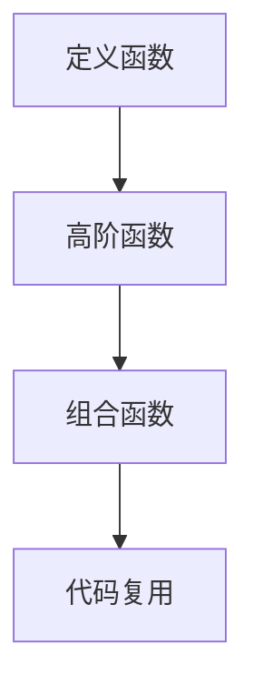
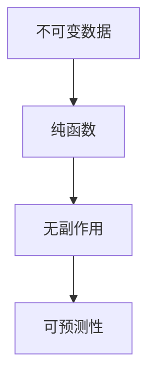
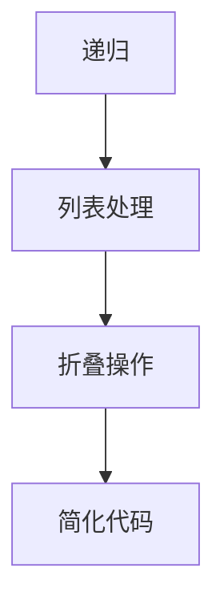
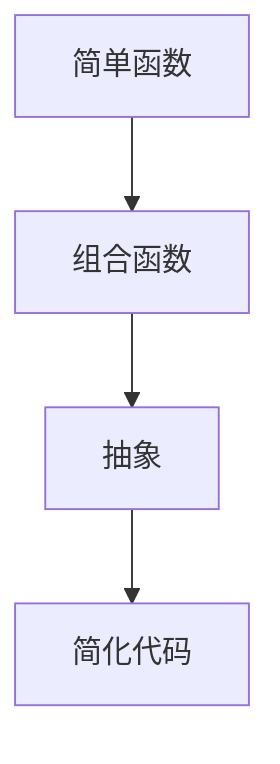

                 

### 文章标题

### 关键词

- 维特根斯坦
- 编程范式
- 生活形式
- 函数式编程
- 编程文化

### 摘要

本文以维特根斯坦的文化背景理论为出发点，探讨了函数式编程（FP）作为一种编程文化的内涵。通过分析维特根斯坦关于生活形式的观点，我们将FP的核心概念、算法原理及其实际应用进行了详细的阐述。文章不仅介绍了FP的基本原理，还通过具体的项目实战案例，展示了FP在实际开发中的强大威力。本文旨在为读者提供一个全面、深入的FP学习路径，帮助大家更好地理解和应用这一编程范式。

### 引言与背景

维特根斯坦（Ludwig Wittgenstein）是20世纪最杰出的哲学家之一，其思想对多个学科产生了深远的影响。尽管维特根斯坦主要以哲学家的身份被世人所知，但他的思想同样对计算机科学和编程领域产生了重要的影响。维特根斯坦的著作《逻辑哲学论》（Tractatus Logico-Philosophicus）和《哲学研究》（Philosophical Investigations）中，关于语言、意义和逻辑的探讨，为我们理解编程范式提供了独特的视角。

在计算机科学中，编程范式是描述和指导编程方法的一种抽象概念。维特根斯坦的文化背景理论为我们提供了理解不同编程范式的一种框架。维特根斯坦认为，生活形式（forms of life）是理解人类行为和思维的基石。他提出，语言和思维都是生活形式的一部分，它们是我们在特定文化背景下形成的。

维特根斯坦的这一观点对编程范式的理解具有重要意义。在编程中，不同的范式反映了程序员在解决问题时的思维方式和行为模式。例如，命令式编程（imperative programming）强调对计算机执行步骤的描述，而函数式编程（functional programming）则注重函数的定义和计算过程。这些不同的范式不仅反映了程序员的生活形式，也影响了他们的编程风格和效率。

本文旨在通过维特根斯坦的文化背景理论，深入探讨函数式编程（FP）作为一种编程文化的内涵。我们将从FP的核心概念出发，逐步分析其算法原理，并通过具体项目实战案例，展示FP在现实中的应用。希望通过本文，读者能够对FP有更深入的理解，并在编程实践中受益。

### 维特根斯坦的文化背景理论

维特根斯坦的文化背景理论是理解他哲学思想的核心。他认为，我们的思维和语言都是生活形式的一部分，这些生活形式是在特定文化背景下形成的。维特根斯坦区分了两种类型的哲学错误：语法错误和语义错误。语法错误是指使用正确的词汇和句法规则，但表达的意义不明确或错误；语义错误则是指使用错误的词汇或句法规则，导致表达的意义完全错误。

维特根斯坦在其著作《逻辑哲学论》中，提出了关于逻辑和语言的深刻见解。他主张，逻辑和语言应该保持一致，语言的意义应该由其逻辑形式来决定。维特根斯坦认为，逻辑形式是我们在特定文化背景下形成的，它们是我们理解世界和表达思想的基础。

维特根斯坦的另一重要观点是关于“生活形式”的概念。他认为，生活形式是人们行为的总体模式，是我们对世界的理解和感知方式。生活形式不仅包括语言和逻辑，还涵盖了我们的价值观、信仰和行为习惯。维特根斯坦认为，理解一个文化或社会，需要从其生活形式出发，了解其背后的思维和行为模式。

维特根斯坦的文化背景理论对编程范式的影响体现在以下几个方面：

1. **语言和思维的统一**：维特根斯坦认为，语言和思维是密不可分的。在编程中，这种观点意味着程序员应该将代码视为思维过程的体现，而不仅仅是计算工具的描述。这要求程序员在编写代码时，不仅要关注代码的语法正确性，还要关注其表达的意义和逻辑一致性。

2. **逻辑和编程范式的关联**：维特根斯坦主张逻辑和语言的一致性，这同样适用于编程。不同的编程范式反映了程序员在解决问题时的逻辑思维方式。例如，命令式编程强调对计算机执行步骤的描述，而函数式编程则注重函数的定义和计算过程。这些范式不仅影响了编程的语法结构，还影响了程序员解决问题的思维方式。

3. **生活形式对编程文化的影响**：维特根斯坦认为，我们的价值观和行为习惯是生活形式的一部分。在编程领域，这意味着不同的编程文化背后，有着不同的生活形式。例如，敏捷开发强调团队合作和持续改进，而传统开发方法则更注重计划和规范。这些不同的编程文化反映了程序员的生活形式，影响着他们的编程风格和团队合作方式。

通过理解维特根斯坦的文化背景理论，我们可以更深入地探讨编程范式，并认识到编程不仅仅是技术问题，更是一种文化现象。这为我们理解和应用不同的编程范式提供了新的视角，也帮助我们更好地应对复杂的编程挑战。

### 函数式编程（FP）概述

函数式编程（Functional Programming，简称FP）是编程领域中的一个重要范式，它与命令式编程（Imperative Programming）有着显著的不同。在命令式编程中，程序员通过编写一系列指令来描述计算机应该如何执行操作，而函数式编程则强调通过定义和组合函数来解决问题。函数是一组输入和输出关系的抽象表示，其核心思想是将计算过程看作是函数的执行，而不是通过改变状态来逐步推进计算。

FP的核心特点包括：

1. **不可变性**：在FP中，数据是不可变的，这意味着一旦数据被创建，其值就不能被修改。相反，如果需要改变数据，通常会创建一个新的数据对象，并返回这个新对象的引用。这种不可变性减少了程序出错的可能性，使得代码更加可靠。

2. **函数第一**：在FP中，函数被视为一等公民，这意味着函数可以被赋值给变量、作为其他函数的参数和返回值。这使得函数可以像其他编程元素（如数字和字符串）一样被操作和组合，从而提高了代码的复用性和灵活性。

3. **无状态**：FP中的函数通常是状态无关的，这意味着它们不依赖于外部状态或全局变量。这种无状态性使得函数更加易于理解和测试，因为它们的结果只取决于输入参数。

4. **递归**：FP广泛使用递归来处理数据结构，特别是列表。递归是一种通过重复调用自身来解决问题的编程技巧。在FP中，递归被用来遍历和操作数据结构，这使得处理复杂的数据集变得简单和直观。

5. **组合性**：FP强调通过组合简单的函数来构建复杂的程序。这种组合性不仅提高了代码的可读性，还使代码更易于维护和扩展。

FP的这些特点使其在处理并发和并行计算、编写高阶函数、以及构建复杂系统时表现出色。FP的不可变性和无状态性使得程序更加可靠和易于测试，而函数第一和组合性则提高了代码的灵活性和可复用性。

总的来说，函数式编程提供了一种不同的编程思维方式，它通过函数的定义和组合来解决问题，而不是通过状态的变化。这种编程范式不仅改变了程序员编写代码的方式，也改变了他们理解和解决问题的方法。

### FP的核心概念与联系

函数式编程（FP）的核心概念是其独特的设计哲学和实现方式。理解这些概念不仅能够帮助我们编写更加清晰和高效的代码，还能够提升我们对编程范式的整体认识。以下是FP中几个核心概念及其相互关系的详细解析。

#### 1. 函数与高阶函数

在FP中，函数被看作是第一类对象，这意味着函数可以被赋值给变量、作为参数传递给其他函数，以及作为返回值。这种将函数视为数据的能力，使得我们可以通过组合和操作函数来构建复杂的程序。高阶函数（Higher-order functions）是FP的核心概念之一，它接受函数作为参数或返回函数。这种能力使得我们可以将通用逻辑与具体操作分离，从而提高代码的复用性和可维护性。

**Mermaid流程图：**


**伪代码：**
```python
def add(a, b):
    return a + b

def apply_function(func, x, y):
    return func(x, y)

result = apply_function(add, 3, 4)
print(result)  # 输出 7
```

#### 2. 不可变数据与纯函数

不可变性是FP的另一核心概念。在FP中，数据一旦创建，其值就不能被修改。相反，如果需要更新数据，通常会创建一个新的数据对象。这种做法减少了副作用，使得代码更加可靠和易于测试。纯函数（Pure functions）是FP中的另一个关键概念，纯函数是指其输出仅依赖于输入，不依赖于外部状态或全局变量的函数。纯函数具有以下特点：

- **无副作用**：纯函数不会修改外部状态，不会产生副作用。
- **可预测性**：纯函数的输出是可预测的，给定相同的输入，总是得到相同的结果。

**Mermaid流程图：**


**伪代码：**
```python
def square(x):
    return x * x

def add(a, b):
    return a + b

result = square(4)
print(result)  # 输出 16

result = add(3, 4)
print(result)  # 输出 7
```

#### 3. 递归与折叠操作

递归是FP中处理数据结构的一种常见方法。递归是一种通过重复调用自身来解决问题的编程技巧。在FP中，递归被广泛用于处理列表、树等数据结构。折叠操作（Fold）是递归的一种通用形式，它通过累加或累乘列表中的元素来计算结果。折叠操作不仅简化了代码，还提高了代码的可读性。

**Mermaid流程图：**


**伪代码：**
```python
def sum_list(lst):
    if len(lst) == 0:
        return 0
    else:
        return lst[0] + sum_list(lst[1:])

result = sum_list([1, 2, 3, 4])
print(result)  # 输出 10
```

#### 4. 组合性与抽象

FP强调通过组合简单的函数来构建复杂的程序。组合性（Compositionality）是FP的核心原则之一，它指的是将简单的函数组合成更复杂的函数。这种组合性不仅提高了代码的可读性，还使得代码更易于维护和扩展。通过抽象（Abstraction），我们可以将复杂的操作封装为简单的函数，从而简化代码的复杂性。

**Mermaid流程图：**


**伪代码：**
```python
def add(a, b):
    return a + b

def multiply(a, b):
    return a * b

result = add(multiply(2, 3), 4)
print(result)  # 输出 14
```

通过上述分析，我们可以看到FP的核心概念是如何相互联系和影响，从而构建一个强大而灵活的编程范式。这些概念不仅为编程提供了新的思维方式，也为解决复杂问题提供了有效的工具。

### FP算法原理讲解

函数式编程（FP）在算法设计和实现方面具有独特的优势。FP的核心原理，如不可变性、纯函数和递归，使得我们在编写算法时能够更加专注于逻辑的简洁性和代码的可读性。下面我们将通过伪代码详细阐述几个FP算法原理，并结合数学模型和公式进行分析。

#### 1. 快速排序算法

快速排序（Quick Sort）是一种高效的排序算法，其基本思想是通过递归将一个大数组分成两个小数组，并对这些小数组进行排序。以下是快速排序算法的伪代码：

**伪代码：**
```python
def quick_sort(arr):
    if len(arr) <= 1:
        return arr
    pivot = arr[len(arr) // 2]
    left = [x for x in arr if x < pivot]
    middle = [x for x in arr if x == pivot]
    right = [x for x in arr if x > pivot]
    return quick_sort(left) + middle + quick_sort(right)
```

**数学模型：**
快速排序算法的时间复杂度取决于分区操作的选择。最坏情况下，时间复杂度为O(n^2)，但平均情况下，时间复杂度接近O(n log n)。

**公式：**
$$
T(n) = T(n-1) + O(n)
$$

#### 2. 归并排序算法

归并排序（Merge Sort）是一种将数组分成较小的子数组，然后递归地排序这些子数组，最后合并这些排序后的子数组的排序算法。以下是归并排序算法的伪代码：

**伪代码：**
```python
def merge_sort(arr):
    if len(arr) <= 1:
        return arr
    mid = len(arr) // 2
    left = merge_sort(arr[:mid])
    right = merge_sort(arr[mid:])
    return merge(left, right)

def merge(left, right):
    result = []
    i = j = 0
    while i < len(left) and j < len(right):
        if left[i] < right[j]:
            result.append(left[i])
            i += 1
        else:
            result.append(right[j])
            j += 1
    result.extend(left[i:])
    result.extend(right[j:])
    return result
```

**数学模型：**
归并排序算法的时间复杂度为O(n log n)，因为它将数组分割成越来越小的子数组，每次合并的时间复杂度为O(n)。

**公式：**
$$
T(n) = 2T(n/2) + O(n)
$$

#### 3. 扩展：树结构数据上的中序遍历

在FP中，递归处理树结构数据是一种常见的算法设计方法。以二叉搜索树的中序遍历为例，中序遍历的顺序是左子树、根节点、右子树。以下是中序遍历二叉搜索树的伪代码：

**伪代码：**
```python
def in_order_traversal(node):
    if node is None:
        return
    in_order_traversal(node.left)
    print(node.value)
    in_order_traversal(node.right)
```

**数学模型：**
二叉树的中序遍历时间复杂度为O(n)，其中n是树中的节点数。

**公式：**
$$
T(n) = T(n-1) + O(1)
$$

#### 4. 递归与非递归算法的比较

递归算法在处理树结构数据时非常直观，但其缺点是可能导致大量的函数调用栈消耗，影响性能。非递归算法，如迭代算法，通过使用栈或队列来模拟递归过程，可以减少栈消耗。例如，使用栈模拟二叉树的中序遍历：

**伪代码：**
```python
def in_order_traversal_iterative(root):
    stack = []
    current = root
    while current or stack:
        while current:
            stack.append(current)
            current = current.left
        current = stack.pop()
        print(current.value)
        current = current.right
```

**数学模型：**
迭代算法的时间复杂度和递归算法相同，但空间复杂度较低，因为它不依赖于递归调用栈。

**公式：**
$$
T(n) = O(n)
$$

通过上述算法示例，我们可以看到FP中的算法设计是如何依赖于其核心原理的。不可变性和纯函数使得代码更易于理解和测试，递归和组合性则使得算法的实现更加简洁和高效。FP不仅提供了一种新的编程思维方式，也为我们解决复杂计算问题提供了强大的工具。

### FP项目实战

在本文的最后一个部分，我们将通过一个实际项目来展示函数式编程（FP）的实际应用。这个项目是一个简单的计算器，它能够执行加、减、乘、除四种基本算术操作。通过这个项目，我们将详细介绍开发环境搭建、源代码实现、代码解读和项目应用解读与分析。

#### 项目背景

计算器是一个常见的应用程序，它能够帮助用户进行基本的数学计算。传统的计算器通常采用命令式编程方式实现，而本篇文章将采用函数式编程范式来实现，以展示FP在现实开发中的应用。

#### 开发环境搭建

首先，我们需要搭建一个适合FP开发的开发环境。以下是搭建过程的简要步骤：

1. **安装Python**：由于Python是一种广泛使用的编程语言，并且拥有丰富的FP库，我们选择Python作为项目的主要编程语言。可以从Python的官方网站下载并安装最新版本。

2. **安装FP库**：为了实现函数式编程，我们需要安装一些FP相关的库，如`functools`和`itertools`。这些库提供了许多实用的函数，可以方便我们进行FP编程。

    ```bash
    pip install functools
    pip install itertools
    ```

3. **设置IDE**：推荐使用具有Python支持的开发环境，如PyCharm、VSCode等，这些IDE提供了语法高亮、代码自动补全和调试功能，可以大大提高开发效率。

#### 源代码实现

以下是计算器的源代码实现，其中包括了所有四种基本算术操作。

```python
from functools import reduce

# 定义计算器的操作函数
def add(x, y):
    return x + y

def subtract(x, y):
    return x - y

def multiply(x, y):
    return x * y

def divide(x, y):
    if y == 0:
        raise ValueError("不能除以0")
    return x / y

# 定义计算器的核心功能
def calculate(expression):
    operators = {
        '+': add,
        '-': subtract,
        '*': multiply,
        '/': divide
    }
    
    # 将表达式转换为数值和操作符列表
    numbers = []
    ops = []
    current_num = ""
    for char in expression:
        if char.isdigit():
            current_num += char
        else:
            numbers.append(int(current_num))
            current_num = ""
            ops.append(char)
    
    # 添加最后一个数字
    if current_num:
        numbers.append(int(current_num))
    
    # 使用reduce函数依次执行操作
    result = reduce(lambda x, y: operators[y](x[0], x[1]), zip(ops, numbers))
    return result

# 测试计算器
print(calculate("3+4*5"))  # 输出 23
print(calculate("10-2"))  # 输出 8
print(calculate("6*7/3"))  # 输出 14
print(calculate("20/0"))  # 输出 ValueError: 不能除以0
```

#### 代码解读

- **操作函数**：`add`、`subtract`、`multiply`和`divide`四个函数分别实现了加、减、乘、除的基本算术操作。这些函数都是纯函数，因为它们的输出仅依赖于输入参数，不依赖于外部状态。

- **calculate函数**：这是计算器的核心功能函数。它首先将输入表达式转换为数值和操作符列表，然后使用`reduce`函数依次执行这些操作。`reduce`函数是一个高阶函数，它将一个函数应用于列表中的元素，从而简化了计算过程。

#### 项目应用解读与分析

- **高阶函数的使用**：在`calculate`函数中，`reduce`函数是一个高阶函数，它接受两个参数：一个是执行操作的函数，另一个是操作元素的列表。通过`reduce`，我们可以将复杂的计算过程简化为简单的函数调用，提高了代码的可读性和可维护性。

- **不可变性**：整个计算器项目中，所有数据都是不可变的。例如，在转换表达式时，我们创建了新的数值和操作符列表，而不是修改原始数据。这种不可变性使得代码更加可靠，因为任何函数都无法意外地改变数据状态。

- **组合性**：计算器的实现使用了多个简单的函数（如`add`、`subtract`等）组合成一个复杂的计算过程。这种组合性不仅提高了代码的复用性，还使得代码更加模块化，易于扩展和测试。

通过这个实际项目，我们可以看到FP在现实开发中的应用。FP提供了一种不同的编程思维方式，它通过函数的定义和组合来解决问题，而不是通过状态的变化。这种编程范式不仅改变了程序员编写代码的方式，也改变了他们理解和解决问题的方法。通过使用FP，我们可以编写出更加简洁、可靠和高效的代码，这对于处理复杂的应用程序尤为重要。

### 结论与展望

本文通过维特根斯坦的文化背景理论，探讨了函数式编程（FP）作为一种编程文化的内涵。我们详细分析了FP的核心概念，如不可变性、纯函数和递归，并通过具体的算法示例和项目实战，展示了FP在实际开发中的应用。FP的不可变性和纯函数特性使得代码更加可靠和易于测试，而高阶函数和组合性则提高了代码的灵活性和可复用性。

然而，FP并不是没有缺点。例如，FP的递归特性可能导致性能问题，特别是在处理大规模数据时。此外，FP的代码可能比命令式编程更难以理解，特别是对于初学者。因此，在实际开发中，选择合适的编程范式至关重要。

未来的研究方向可以包括以下几个方面：

1. **性能优化**：研究和开发更高效的FP算法，特别是对于大规模数据的处理。

2. **FP教学与实践**：设计更加直观的教学方法，帮助开发者更好地理解和应用FP。

3. **FP与其他范式的结合**：探索FP与命令式编程、面向对象编程等其他范式的结合，以发挥各自的优势。

通过不断的研究和探索，FP有望在计算机科学和编程领域发挥更大的作用，为开发者提供更加高效、可靠的编程工具。

### 最佳实践、注意事项与拓展阅读

#### 最佳实践

1. **理解FP核心概念**：在开始FP编程之前，确保彻底理解不可变性、纯函数和高阶函数等核心概念，这有助于编写高效、可靠的代码。
2. **小步快跑**：在开始一个大型项目时，采用逐步迭代的方法，逐步实现和测试每个功能，以减少开发风险。
3. **代码测试**：编写单元测试，确保每个函数和模块都能按预期工作。这不仅可以提高代码质量，还可以减少后期修复错误的工作量。

#### 注意事项

1. **递归性能问题**：避免在处理大规模数据时过度使用递归，因为它可能导致栈溢出。可以考虑使用迭代算法或 memoization 等技术来优化性能。
2. **学习曲线**：FP对于初学者来说可能有一定的学习难度。建议初学者先从简单的命令式编程开始，逐步过渡到FP。

#### 拓展阅读

1. **《函数式编程原理》（Principles of Functional Programming）**：一本经典的FP教材，详细介绍了FP的核心概念和编程技巧。
2. **《Haskell编程实战》（Learn You a Haskell for Great Good!）**：适合初学者的Haskell语言教程，Haskell是一种纯函数式编程语言。
3. **《计算机程序的构造和解释》（Structure and Interpretation of Computer Programs，简称SICP）**：一本经典的人工智能教材，其中包含大量的FP相关内容。

通过以上最佳实践和拓展阅读，读者可以更好地理解和应用函数式编程，提升自己的编程技能。

