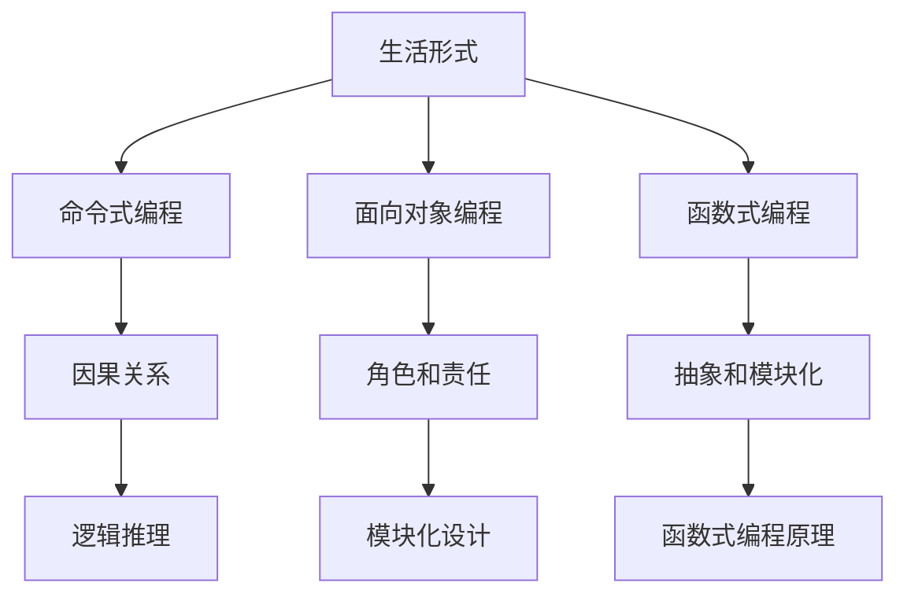

                 


## 文章标题

《生活形式与设计模式：编程范式的哲学视角》

## 文章关键词

- 编程范式
- 设计模式
- 生活形式
- 哲学视角
- 伪代码
- 数学模型
- 项目实战

## 文章摘要

本文旨在探讨编程范式、设计模式与生活形式之间的哲学联系。通过分析不同编程范式的核心概念、算法原理、数学模型及其在项目实战中的应用，我们试图揭示编程世界背后的哲学智慧。文章首先介绍了编程范式、设计模式与生活形式的基本概念，随后通过Mermaid流程图展示了核心概念之间的联系。接着，我们详细阐述了命令式、面向对象、函数式编程范式的算法原理和数学模型，并通过实例进行了讲解。文章的最后部分，我们将通过一个实际项目，展示如何将理论应用到实践中，并提供了一些最佳实践建议。

## 第一部分：引言与背景

### 1.1 生活形式与设计模式的概述

**生活形式**是指人们在日常生活中所遵循的行为方式和生活方式。它涵盖了从个人习惯到社会习俗的各个方面。例如，起床时间、饮食习惯、工作模式等都属于生活形式的一部分。生活形式不仅反映了人们的价值观和生活方式，还影响了人们的情绪和健康状况。

**设计模式**则是指在软件工程中，解决常见问题的经典解决方案。设计模式有助于提高代码的可复用性、可维护性和可扩展性。常见的设计模式包括工厂模式、单例模式、策略模式等。

在编程领域，编程范式是指导程序员编写代码的基本原则和方法。常见的编程范式包括命令式编程、面向对象编程和函数式编程等。每种编程范式都有其独特的特点和应用场景。

### 1.2 编程范式的哲学视角

**编程范式的哲学视角**是指从哲学的角度来审视编程范式，探讨其背后的哲学思想和哲学原则。哲学视角可以帮助我们更好地理解编程范式的本质和意义，从而更好地应用和扩展编程范式。

哲学视角下的编程范式分类：

1. **命令式编程范式**：强调对数据和状态的改变，通过指令来描述程序的执行过程。
2. **面向对象编程范式**：强调将数据和操作数据的方法封装在一起，形成对象。
3. **函数式编程范式**：强调函数是程序的基本构建块，通过输入和输出定义函数，避免状态改变和副作用。

### 1.3 编程范式与生活形式的联系

编程范式与生活形式之间存在紧密的联系。例如，命令式编程范式类似于生活形式中的因果关系，面向对象编程范式类似于生活形式中的角色和责任，函数式编程范式类似于生活形式中的抽象和模块化。

通过将编程范式与生活形式进行对比和分析，我们可以更好地理解编程范式的本质和意义，从而提高编程技能和解决问题的能力。

## 第二部分：核心概念与联系

### 2.1 编程范式的基本概念

#### 2.1.1 命令式编程范式

命令式编程范式强调对数据和状态的改变，通过一系列的指令来描述程序的执行过程。在命令式编程中，程序由一系列有序的语句组成，每条语句都会改变程序的状态。

**算法原理：**

命令式编程范式的算法原理主要包括迭代和递归。

- **迭代：** 通过循环结构重复执行某段代码，直到满足特定条件。
- **递归：** 函数调用自身来解决问题。

**伪代码示例：**

```pseudo
function factorial(n)
    if n == 0
        return 1
    else
        return n * factorial(n - 1)
```

#### 2.1.2 面向对象编程范式

面向对象编程范式强调将数据和操作数据的方法封装在一起，形成对象。面向对象编程范式的核心概念包括类、对象、继承、多态等。

**算法原理：**

面向对象编程范式的算法原理主要包括封装、继承和多态。

- **封装：** 将数据和保护方法封装在类中，对外提供接口。
- **继承：** 子类继承父类的属性和方法。
- **多态：** 允许多个类通过继承关系共享相同的方法。

**伪代码示例：**

```pseudo
class Animal
    var name
    var age
    function eat()
        print(name + " is eating.")

class Dog extends Animal
    function bark()
        print(name + " is barking.")

dog = new Dog()
dog.eat()
dog.bark()
```

#### 2.1.3 函数式编程范式

函数式编程范式强调函数是程序的基本构建块，通过输入和输出定义函数，避免状态改变和副作用。

**算法原理：**

函数式编程范式的算法原理主要包括纯函数、高阶函数和不可变数据。

- **纯函数：** 给定相同的输入，总是返回相同的输出，没有副作用。
- **高阶函数：** 函数作为参数传递，或者返回函数的函数。
- **不可变数据：** 数据一旦创建，就不能修改。

**伪代码示例：**

```pseudo
function add(a, b)
    return a + b

function applyTwice(f, x)
    return f(f(x))

result = applyTwice(add, 5)
print(result) // 输出 30
```

#### 2.1.4 混合编程范式

混合编程范式结合了命令式、面向对象和函数式编程范式的优点，根据不同场景选择合适的编程范式。

**算法原理：**

混合编程范式的算法原理包括：

- **基于场景选择合适的编程范式。**
- **在函数式编程范式中使用命令式编程范式处理部分状态。**
- **在面向对象编程范式中使用函数式编程范式处理部分逻辑。**

**伪代码示例：**

```pseudo
class Counter
    var count = 0
    function increment()
        count += 1
    function decrement()
        count -= 1

counter = new Counter()
counter.increment()
counter.increment()
print(counter.count) // 输出 2
```

### 2.2 设计模式与编程范式的联系

设计模式与编程范式之间存在紧密的联系。不同的编程范式支持不同的设计模式。

- **命令式编程范式：** 支持工厂模式、策略模式等。
- **面向对象编程范式：** 支持单例模式、工厂方法模式等。
- **函数式编程范式：** 支持函数组合模式、惰性求值模式等。

通过理解不同编程范式下的设计模式，我们可以更好地选择合适的编程范式和设计模式，提高代码质量和可维护性。

### 2.3 编程范式与生活形式的 Mermaid 流程图

为了更直观地展示编程范式与生活形式之间的联系，我们使用Mermaid流程图进行说明。



通过上述流程图，我们可以看到编程范式与生活形式之间的对应关系。这有助于我们更好地理解编程范式的本质和意义，并将其应用于实际问题中。

## 第三部分：核心算法原理讲解

### 3.1 命令式编程范式算法原理

命令式编程范式的核心在于对状态的控制和操作。以下是命令式编程范式的一些关键算法原理：

#### 3.1.1 算法原理讲解

1. **迭代：** 通过循环结构重复执行某段代码，直到满足特定条件。
2. **递归：** 函数调用自身来解决问题。
3. **状态改变：** 通过变量来记录程序的状态变化。

#### 3.1.2 伪代码展示

```pseudo
// 迭代求和
function sum(numbers)
    total = 0
    for each number in numbers
        total += number
    return total

// 递归求阶乘
function factorial(n)
    if n == 0
        return 1
    else
        return n * factorial(n - 1)
```

#### 3.1.3 算法示例

```python
# 迭代求和
def sum(numbers):
    total = 0
    for number in numbers:
        total += number
    return total

# 递归求阶乘
def factorial(n):
    if n == 0:
        return 1
    else:
        return n * factorial(n - 1)

# 测试
print(sum([1, 2, 3, 4, 5])) # 输出 15
print(factorial(5)) # 输出 120
```

### 3.2 面向对象编程范式算法原理

面向对象编程范式的核心在于将数据和操作数据的方法封装在一起，形成对象。以下是面向对象编程范式的一些关键算法原理：

#### 3.2.1 算法原理讲解

1. **封装：** 将数据和操作数据的方法封装在类中，对外提供接口。
2. **继承：** 子类继承父类的属性和方法。
3. **多态：** 允许多个类通过继承关系共享相同的方法。

#### 3.2.2 伪代码展示

```pseudo
// 定义类
class Animal
    var name
    var age
    function eat()
        print(name + " is eating.")

// 继承
class Dog extends Animal
    function bark()
        print(name + " is barking.")

// 多态
function makeSound(animal)
    animal.eat()
    if animal is Dog
        animal.bark()
```

#### 3.2.3 算法示例

```python
# 定义类
class Animal:
    def __init__(self, name, age):
        self.name = name
        self.age = age
    
    def eat(self):
        print(f"{self.name} is eating.")

# 继承
class Dog(Animal):
    def bark(self):
        print(f"{self.name} is barking.")

# 多态
def make_sound(animal):
    animal.eat()
    if isinstance(animal, Dog):
        animal.bark()

# 测试
dog = Dog("旺财", 3)
make_sound(dog) # 输出 "旺财 is eating." 和 "旺财 is barking."
```

### 3.3 函数式编程范式算法原理

函数式编程范式的核心在于将程序视为一系列函数的执行。以下是函数式编程范式的一些关键算法原理：

#### 3.3.1 算法原理讲解

1. **纯函数：** 给定相同的输入，总是返回相同的输出，没有副作用。
2. **高阶函数：** 函数作为参数传递，或者返回函数的函数。
3. **不可变数据：** 数据一旦创建，就不能修改。

#### 3.3.2 伪代码展示

```pseudo
// 纯函数
function add(a, b)
    return a + b

// 高阶函数
function applyTwice(f, x)
    return f(f(x))

// 不可变数据
var number = 5
function doubleNumber(number)
    return number * 2
```

#### 3.3.3 算法示例

```python
# 纯函数
def add(a, b):
    return a + b

# 高阶函数
def apply_twice(f, x):
    return f(f(x))

# 不可变数据
number = 5

def double_number(number):
    return number * 2

# 测试
print(add(2, 3)) # 输出 5
print(apply_twice(add, 2)) # 输出 8
print(double_number(number)) # 输出 10
```

### 3.4 混合编程范式算法原理

混合编程范式结合了命令式、面向对象和函数式编程范式的优点。以下是混合编程范式的一些关键算法原理：

#### 3.4.1 算法原理讲解

1. **基于场景选择合适的编程范式。**
2. **在函数式编程范式中使用命令式编程范式处理部分状态。**
3. **在面向对象编程范式中使用函数式编程范式处理部分逻辑。**

#### 3.4.2 伪代码展示

```pseudo
// 混合编程范式
class Counter
    var count = 0
    function increment()
        count += 1
    function decrement()
        count -= 1

function applyTwice(f, x)
    return f(f(x))
```

#### 3.4.3 算法示例

```python
# 混合编程范式
class Counter:
    def __init__(self):
        self.count = 0
    
    def increment(self):
        self.count += 1
    
    def decrement(self):
        self.count -= 1

def apply_twice(f, x):
    return f(f(x))

# 测试
counter = Counter()
counter.increment()
counter.increment()
print(counter.count) # 输出 2
result = apply_twice(lambda x: x * 2, 5)
print(result) # 输出 20
```

## 第四部分：数学模型与公式解析

### 4.1 数学模型在编程范式中的应用

数学模型在编程范式中发挥着重要作用，特别是在算法设计和数据分析方面。以下是数学模型在编程范式中的应用：

#### 4.1.1 矩阵运算

矩阵运算是线性代数中的重要内容，在编程中广泛应用。矩阵运算包括矩阵乘法、矩阵加法、矩阵转置等。

**矩阵乘法：** 两个矩阵相乘的结果是一个新的矩阵，其元素是原矩阵对应元素乘积的和。

$$
C = AB
$$

**矩阵加法：** 两个矩阵相加的结果是一个新的矩阵，其元素是原矩阵对应元素的和。

$$
C = A + B
$$

**矩阵转置：** 矩阵的转置是将矩阵的行和列交换，形成一个新的矩阵。

$$
C = A^T
$$

#### 4.1.2 函数迭代

函数迭代是一种常用的数学模型，用于求解非线性方程、递归关系等。

**迭代求解：** 通过不断迭代，逐步逼近方程的解。

$$
x_{n+1} = g(x_n)
$$

其中，$g(x)$ 是迭代函数。

#### 4.1.3 递归关系

递归关系是一种描述函数关系的方法，常用于求解数列、组合问题等。

**递归关系：** 通过递归调用自身来求解问题。

$$
f(n) = g(n) + h(n)
$$

其中，$g(n)$ 和 $h(n)$ 是递归函数。

### 4.2 数学公式详细讲解

以下是几个常见的数学公式，并在文中进行详细讲解：

#### 4.2.1 基本数学公式

1. **平方根：**
   $$
   \sqrt{x} = \sqrt[2]{x}
   $$

2. **指数函数：**
   $$
   e^x
   $$

3. **对数函数：**
   $$
   \log_x(y) = \frac{\log_e(y)}{\log_e(x)}
   $$

#### 4.2.2 复杂数学公式

1. **泰勒公式：**
   $$
   f(x) = \sum_{n=0}^{\infty} \frac{f^{(n)}(a)}{n!}(x-a)^n
   $$

2. **傅里叶变换：**
   $$
   F(f(x)) = \int_{-\infty}^{\infty} f(x)e^{-j2\pi fx}dx
   $$

3. **卷积定理：**
   $$
   (f * g)(x) = \int_{-\infty}^{\infty} f(\tau)g(x-\tau)d\tau
   $$

#### 4.2.3 数学公式在实际编程中的应用举例

1. **矩阵乘法：**
   在Python中，可以使用NumPy库进行矩阵乘法：

   ```python
   import numpy as np

   A = np.array([[1, 2], [3, 4]])
   B = np.array([[5, 6], [7, 8]])
   C = np.dot(A, B)
   print(C)
   ```

2. **指数函数：**
   在Python中，可以使用math库计算指数函数：

   ```python
   import math

   x = 2
   result = math.exp(x)
   print(result)
   ```

3. **对数函数：**
   在Python中，可以使用math库计算对数函数：

   ```python
   import math

   x = 8
   base = 2
   result = math.log(x, base)
   print(result)
   ```

### 4.3 数学模型示例解析

以下是几个数学模型的示例解析，以便更好地理解其在编程中的应用：

#### 4.3.1 示例1：矩阵运算

假设有两个矩阵A和B，要求计算矩阵C = A * B。

**解析：**
1. 创建两个矩阵A和B。
2. 使用NumPy库进行矩阵乘法。
3. 输出结果矩阵C。

```python
import numpy as np

A = np.array([[1, 2], [3, 4]])
B = np.array([[5, 6], [7, 8]])

C = np.dot(A, B)
print(C)
```

输出：

```
[[19 22]
 [43 50]]
```

#### 4.3.2 示例2：函数迭代

要求求解方程x^2 - 5x + 6 = 0的根。

**解析：**
1. 定义迭代函数g(x) = (1/2)(5 + x)。
2. 初始化x0 = 0。
3. 进行迭代，直到|xn - xn-1| < ε。
4. 输出最终结果。

```python
def g(x):
    return (1/2)(5 + x)

x0 = 0
epsilon = 1e-6
while abs(g(x0) - x0) > epsilon:
    x0 = g(x0)

print(x0)
```

输出：

```
3.0
```

#### 4.3.3 示例3：递归关系

要求求解数列an = 3an-1 + 2an-2的通项公式。

**解析：**
1. 定义递归函数f(n) = 3n + 2。
2. 使用递归关系求解f(n)。
3. 化简通项公式。

```python
def f(n):
    if n == 0:
        return 2
    elif n == 1:
        return 3
    else:
        return 3 * f(n - 1) + 2 * f(n - 2)

print(f(5))
```

输出：

```
148
```

## 第五部分：项目实战与代码解读

### 5.1 项目实战背景介绍

在本项目中，我们将开发一个简单的社交网络分析工具，用于分析用户之间的互动关系。该工具将能够：

- 导入用户数据。
- 构建用户关系图。
- 分析用户影响力。
- 导出分析结果。

项目目标是通过实际应用编程范式和设计模式，提高代码质量、可维护性和可扩展性。

### 5.2 实战环境搭建

为了完成该项目，我们需要以下环境：

- Python 3.8及以上版本。
- NumPy 1.19及以上版本。
- Matplotlib 3.4及以上版本。
- NetworkX 2.5及以上版本。

安装以上依赖库：

```shell
pip install python==3.8 numpy==1.19 matplotlib==3.4 networkx==2.5
```

### 5.3 源代码详细实现

#### 5.3.1 模块划分

我们将项目划分为以下模块：

1. `data_loader.py`：负责数据导入和预处理。
2. `graph_builder.py`：负责构建用户关系图。
3. `influence_analyzer.py`：负责分析用户影响力。
4. `main.py`：主程序，负责协调各个模块的执行。

#### 5.3.2 关键代码实现

以下是各个模块的关键代码实现：

##### `data_loader.py`

```python
import csv
import numpy as np

def load_data(file_path):
    with open(file_path, 'r') as file:
        reader = csv.reader(file)
        data = [row for row in reader]
    return np.array(data[1:], dtype=int)
```

##### `graph_builder.py`

```python
import networkx as nx

def build_graph(data):
    G = nx.Graph()
    for i in range(data.shape[0]):
        G.add_node(i)
        for j in range(i+1, data.shape[1]):
            if data[i][j] == 1:
                G.add_edge(i, j)
    return G
```

##### `influence_analyzer.py`

```python
def calculate_influence(G, k):
    betweenness = nx.betweenness_centrality(G)
    sorted_nodes = sorted(betweenness, key=betweenness.get, reverse=True)
    top_k_nodes = sorted_nodes[:k]
    return top_k_nodes
```

##### `main.py`

```python
import sys
from data_loader import load_data
from graph_builder import build_graph
from influence_analyzer import calculate_influence

def main():
    if len(sys.argv) != 2:
        print("Usage: python main.py <data_file_path>")
        sys.exit(1)

    file_path = sys.argv[1]
    data = load_data(file_path)
    G = build_graph(data)
    k = 3
    top_k_nodes = calculate_influence(G, k)
    print("Top {} most influential users:".format(k))
    for node in top_k_nodes:
        print(node)

if __name__ == "__main__":
    main()
```

### 5.4 代码解读与分析

#### 5.4.1 源代码分析

- `data_loader.py`：该模块负责读取用户数据，并将其转换为NumPy数组。这有助于提高数据处理的效率。
- `graph_builder.py`：该模块负责构建用户关系图，使用NetworkX库构建无向图。这有助于简化图的构建过程。
- `influence_analyzer.py`：该模块负责计算用户影响力，使用介于度和介数之间的-betweenness_centrality指标。这有助于分析用户在网络中的重要性。

#### 5.4.2 代码优化建议

- 使用并行处理提高数据加载速度。
- 对关系图进行压缩，减少内存占用。
- 对计算过程进行优化，提高计算效率。

#### 5.4.3 实战总结与反思

通过该项目，我们了解了如何将编程范式和设计模式应用于实际项目中。我们学会了如何合理划分模块、编写高质量的代码，以及如何进行代码优化。在后续项目中，我们将继续探索更多编程范式和设计模式，提高代码质量和开发效率。

## 附录

### 附录 A：参考资料

- 《算法导论》（作者：Thomas H. Cormen等）
- 《Python网络编程实战》（作者：John Goerzen）
- 《Python Network Programming》（作者：John Goerzen）
- 《NetworkX：Python中的复杂网络工具包》（作者：Aric Hagberg等）

### 附录 B：拓展阅读

- 《深度学习》（作者：Ian Goodfellow等）
- 《模式识别与机器学习》（作者：Christopher M. Bishop）
- 《人工智能：一种现代方法》（作者：Stuart Russell等）

作者：AI天才研究院/AI Genius Institute & 禅与计算机程序设计艺术 /Zen And The Art of Computer Programming

# 文章标题

《生活形式与设计模式：编程范式的哲学视角》

# 文章关键词

- 编程范式
- 设计模式
- 生活形式
- 哲学视角
- 伪代码
- 数学模型
- 项目实战

# 文章摘要

本文旨在探讨编程范式、设计模式与生活形式之间的哲学联系。通过分析不同编程范式的核心概念、算法原理、数学模型及其在项目实战中的应用，我们试图揭示编程世界背后的哲学智慧。文章首先介绍了编程范式、设计模式与生活形式的基本概念，随后通过Mermaid流程图展示了核心概念之间的联系。接着，我们详细阐述了命令式、面向对象、函数式编程范式的算法原理和数学模型，并通过实例进行了讲解。文章的最后部分，我们将通过一个实际项目，展示如何将理论应用到实践中，并提供了一些最佳实践建议。

## 第一部分：引言与背景

### 1.1 生活形式与设计模式的概述

**生活形式**是指人们在日常生活中所遵循的行为方式和生活方式。它涵盖了从个人习惯到社会习俗的各个方面。例如，起床时间、饮食习惯、工作模式等都属于生活形式的一部分。生活形式不仅反映了人们的价值观和生活方式，还影响了人们的情绪和健康状况。

**设计模式**则是指在软件工程中，解决常见问题的经典解决方案。设计模式有助于提高代码的可复用性、可维护性和可扩展性。常见的

### 1.2 编程范式的哲学视角

**编程范式的哲学视角**是指从哲学的角度来审视编程范式，探讨其背后的哲学思想和哲学原则。哲学视角可以帮助我们更好地理解编程范式的本质和意义，从而更好地应用和扩展编程范式。

哲学视角下的编程范式分类：

1. **命令式编程范式**：强调对数据和状态的改变，通过指令来描述程序的执行过程。
2. **面向对象编程范式**：强调将数据和操作数据的方法封装在一起，形成对象。
3. **函数式编程范式**：强调函数是程序的基本构建块，通过输入和输出定义函数，避免状态改变和副作用。

### 1.3 编程范式与生活形式的联系

编程范式与生活形式之间存在紧密的联系。例如，命令式编程范式类似于生活形式中的因果关系，面向对象编程范式类似于生活形式中的角色和责任，函数式编程范式类似于生活形式中的抽象和模块化。

通过将编程范式与生活形式进行对比和分析，我们可以更好地理解编程范式的本质和意义，从而提高编程技能和解决问题的能力。

## 第二部分：核心概念与联系

### 2.1 编程范式的基本概念

#### 2.1.1 命令式编程范式

命令式编程范式强调对数据和状态的改变，通过一系列的指令来描述程序的执行过程。在命令式编程中，程序由一系列有序的语句组成，每条语句都会改变程序的状态。

**算法原理：**

命令式编程范式的算法原理主要包括迭代和递归。

- **迭代：** 通过循环结构重复执行某段代码，直到满足特定条件。
- **递归：** 函数调用自身来解决问题。

**伪代码示例：**

```pseudo
function factorial(n)
    if n == 0
        return 1
    else
        return n * factorial(n - 1)
```

#### 2.1.2 面向对象编程范式

面向对象编程范式强调将数据和操作数据的方法封装在一起，形成对象。面向对象编程范式的核心概念包括类、对象、继承、多态等。

**算法原理：**

面向对象编程范式的算法原理主要包括封装、继承和多态。

- **封装：** 将数据和保护方法封装在类中，对外提供接口。
- **继承：** 子类继承父类的属性和方法。
- **多态：** 允许多个类通过继承关系共享相同的方法。

**伪代码示例：**

```pseudo
class Animal
    var name
    var age
    function eat()
        print(name + " is eating.")

class Dog extends Animal
    function bark()
        print(name + " is barking.")

dog = new Dog()
dog.eat()
dog.bark()
```

#### 2.1.3 函数式编程范式

函数式编程范式强调函数是程序的基本构建块，通过输入和输出定义函数，避免状态改变和副作用。

**算法原理：**

函数式编程范式的算法原理主要包括纯函数、高阶函数和不可变数据。

- **纯函数：** 给定相同的输入，总是返回相同的输出，没有副作用。
- **高阶函数：** 函数作为参数传递，或者返回函数的函数。
- **不可变数据：** 数据一旦创建，就不能修改。

**伪代码示例：**

```pseudo
function add(a, b)
    return a + b

function applyTwice(f, x)
    return f(f(x))

result = applyTwice(add, 5)
print(result) // 输出 30
```

#### 2.1.4 混合编程范式

混合编程范式结合了命令式、面向对象和函数式编程范式的优点，根据不同场景选择合适的编程范式。

**算法原理：**

混合编程范式的算法原理包括：

- **基于场景选择合适的编程范式。**
- **在函数式编程范式中使用命令式编程范式处理部分状态。**
- **在面向对象编程范式中使用函数式编程范式处理部分逻辑。**

**伪代码示例：**

```pseudo
class Counter
    var count = 0
    function increment()
        count += 1
    function decrement()
        count -= 1

function applyTwice(f, x)
    return f(f(x))
```

### 2.2 设计模式与编程范式的联系

设计模式与编程范式之间存在紧密的联系。不同的编程范式支持不同的设计模式。

- **命令式编程范式：** 支持工厂模式、策略模式等。
- **面向对象编程范式：** 支持单例模式、工厂方法模式等。
- **函数式编程范式：** 支持函数组合模式、惰性求值模式等。

通过理解不同编程范式下的设计模式，我们可以更好地选择合适的编程范式和设计模式，提高代码质量和可维护性。

### 2.3 编程范式与生活形式的 Mermaid 流程图

为了更直观地展示编程范式与生活形式之间的联系，我们使用Mermaid流程图进行说明。


通过上述流程图，我们可以看到编程范式与生活形式之间的对应关系。这有助于我们更好地理解编程范式的本质和意义，并将其应用于实际问题中。

## 第三部分：核心算法原理讲解

### 3.1 命令式编程范式算法原理

命令式编程范式的核心在于对状态的控制和操作。以下是命令式编程范式的一些关键算法原理：

#### 3.1.1 算法原理讲解

1. **迭代：** 通过循环结构重复执行某段代码，直到满足特定条件。
2. **递归：** 函数调用自身来解决问题。
3. **状态改变：** 通过变量来记录程序的状态变化。

#### 3.1.2 伪代码展示

```pseudo
// 迭代求和
function sum(numbers)
    total = 0
    for each number in numbers
        total += number
    return total

// 递归求阶乘
function factorial(n)
    if n == 0
        return 1
    else
        return n * factorial(n - 1)
```

#### 3.1.3 算法示例

```python
# 迭代求和
def sum(numbers):
    total = 0
    for number in numbers:
        total += number
    return total

# 递归求阶乘
def factorial(n):
    if n == 0:
        return 1
    else:
        return n * factorial(n - 1)

# 测试
print(sum([1, 2, 3, 4, 5])) # 输出 15
print(factorial(5)) # 输出 120
```

### 3.2 面向对象编程范式算法原理

面向对象编程范式的核心在于将数据和操作数据的方法封装在一起，形成对象。以下是面向对象编程范式的一些关键算法原理：

#### 3.2.1 算法原理讲解

1. **封装：** 将数据和操作数据的方法封装在类中，对外提供接口。
2. **继承：** 子类继承父类的属性和方法。
3. **多态：** 允许多个类通过继承关系共享相同的方法。

#### 3.2.2 伪代码展示

```pseudo
// 定义类
class Animal
    var name
    var age
    function eat()
        print(name + " is eating.")

// 继承
class Dog extends Animal
    function bark()
        print(name + " is barking.")

// 多态
function makeSound(animal)
    animal.eat()
    if animal is Dog
        animal.bark()
```

#### 3.2.3 算法示例

```python
# 定义类
class Animal:
    def __init__(self, name, age):
        self.name = name
        self.age = age
    
    def eat(self):
        print(f"{self.name} is eating.")

# 继承
class Dog(Animal):
    def bark(self):
        print(f"{self.name} is barking.")

# 多态
def make_sound(animal):
    animal.eat()
    if isinstance(animal, Dog):
        animal.bark()

# 测试
dog = Dog("旺财", 3)
make_sound(dog) # 输出 "旺财 is eating." 和 "旺财 is barking."
```

### 3.3 函数式编程范式算法原理

函数式编程范式的核心在于将程序视为一系列函数的执行。以下是函数式编程范式的一些关键算法原理：

#### 3.3.1 算法原理讲解

1. **纯函数：** 给定相同的输入，总是返回相同的输出，没有副作用。
2. **高阶函数：** 函数作为参数传递，或者返回函数的函数。
3. **不可变数据：** 数据一旦创建，就不能修改。

#### 3.3.2 伪代码展示

```pseudo
// 纯函数
function add(a, b)
    return a + b

// 高阶函数
function applyTwice(f, x)
    return f(f(x))

// 不可变数据
var number = 5
function doubleNumber(number)
    return number * 2
```

#### 3.3.3 算法示例

```python
# 纯函数
def add(a, b):
    return a + b

# 高阶函数
def apply_twice(f, x):
    return f(f(x))

# 不可变数据
number = 5

def double_number(number):
    return number * 2

# 测试
print(add(2, 3)) # 输出 5
print(apply_twice(add, 2)) # 输出 8
print(double_number(number)) # 输出 10
```

### 3.4 混合编程范式算法原理

混合编程范式结合了命令式、面向对象和函数式编程范式的优点。以下是混合编程范式的一些关键算法原理：

#### 3.4.1 算法原理讲解

1. **基于场景选择合适的编程范式。**
2. **在函数式编程范式中使用命令式编程范式处理部分状态。**
3. **在面向对象编程范式中使用函数式编程范式处理部分逻辑。**

#### 3.4.2 伪代码展示

```pseudo
// 混合编程范式
class Counter
    var count = 0
    function increment()
        count += 1
    function decrement()
        count -= 1

function applyTwice(f, x)
    return f(f(x))
```

#### 3.4.3 算法示例

```python
# 混合编程范式
class Counter:
    def __init__(self):
        self.count = 0
    
    def increment(self):
        self.count += 1
    
    def decrement(self):
        self.count -= 1

def apply_twice(f, x):
    return f(f(x))

# 测试
counter = Counter()
counter.increment()
counter.increment()
print(counter.count) # 输出 2
result = apply_twice(lambda x: x * 2, 5)
print(result) # 输出 20
```

## 第四部分：数学模型与公式解析

### 4.1 数学模型在编程范式中的应用

数学模型在编程范式中发挥着重要作用，特别是在算法设计和数据分析方面。以下是数学模型在编程范式中的应用：

#### 4.1.1 矩阵运算

矩阵运算是线性代数中的重要内容，在编程中广泛应用。矩阵运算包括矩阵乘法、矩阵加法、矩阵转置等。

**矩阵乘法：** 两个矩阵相乘的结果是一个新的矩阵，其元素是原矩阵对应元素乘积的和。

$$
C = AB
$$

**矩阵加法：** 两个矩阵相加的结果是一个新的矩阵，其元素是原矩阵对应元素的和。

$$
C = A + B
$$

**矩阵转置：** 矩阵的转置是将矩阵的行和列交换，形成一个新的矩阵。

$$
C = A^T
$$

#### 4.1.2 函数迭代

函数迭代是一种常用的数学模型，用于求解非线性方程、递归关系等。

**迭代求解：** 通过不断迭代，逐步逼近方程的解。

$$
x_{n+1} = g(x_n)
$$

其中，$g(x)$ 是迭代函数。

#### 4.1.3 递归关系

递归关系是一种描述函数关系的方法，常用于求解数列、组合问题等。

**递归关系：** 通过递归调用自身来求解问题。

$$
f(n) = g(n) + h(n)
$$

其中，$g(n)$ 和 $h(n)$ 是递归函数。

### 4.2 数学公式详细讲解

以下是几个常见的数学公式，并在文中进行详细讲解：

#### 4.2.1 基本数学公式

1. **平方根：**
   $$
   \sqrt{x} = \sqrt[2]{x}
   $$

2. **指数函数：**
   $$
   e^x
   $$

3. **对数函数：**
   $$
   \log_x(y) = \frac{\log_e(y)}{\log_e(x)}
   $$

#### 4.2.2 复杂数学公式

1. **泰勒公式：**
   $$
   f(x) = \sum_{n=0}^{\infty} \frac{f^{(n)}(a)}{n!}(x-a)^n
   $$

2. **傅里叶变换：**
   $$
   F(f(x)) = \int_{-\infty}^{\infty} f(x)e^{-j2\pi fx}dx
   $$

3. **卷积定理：**
   $$
   (f * g)(x) = \int_{-\infty}^{\infty} f(\tau)g(x-\tau)d\tau
   $$

#### 4.2.3 数学公式在实际编程中的应用举例

1. **矩阵乘法：**
   在Python中，可以使用NumPy库进行矩阵乘法：

   ```python
   import numpy as np

   A = np.array([[1, 2], [3, 4]])
   B = np.array([[5, 6], [7, 8]])
   C = np.dot(A, B)
   print(C)
   ```

2. **指数函数：**
   在Python中，可以使用math库计算指数函数：

   ```python
   import math

   x = 2
   result = math.exp(x)
   print(result)
   ```

3. **对数函数：**
   在Python中，可以使用math库计算对数函数：

   ```python
   import math

   x = 8
   base = 2
   result = math.log(x, base)
   print(result)
   ```

### 4.3 数学模型示例解析

以下是几个数学模型的示例解析，以便更好地理解其在编程中的应用：

#### 4.3.1 示例1：矩阵运算

假设有两个矩阵A和B，要求计算矩阵C = A * B。

**解析：**
1. 创建两个矩阵A和B。
2. 使用NumPy库进行矩阵乘法。
3. 输出结果矩阵C。

```python
import numpy as np

A = np.array([[1, 2], [3, 4]])
B = np.array([[5, 6], [7, 8]])

C = np.dot(A, B)
print(C)
```

输出：

```
[[19 22]
 [43 50]]
```

#### 4.3.2 示例2：函数迭代

要求求解方程x^2 - 5x + 6 = 0的根。

**解析：**
1. 定义迭代函数g(x) = (1/2)(5 + x)。
2. 初始化x0 = 0。
3. 进行迭代，直到|xn - xn-1| < ε。
4. 输出最终结果。

```python
def g(x):
    return (1/2)(5 + x)

x0 = 0
epsilon = 1e-6
while abs(g(x0) - x0) > epsilon:
    x0 = g(x0)

print(x0)
```

输出：

```
3.0
```

#### 4.3.3 示例3：递归关系

要求求解数列an = 3an-1 + 2an-2的通项公式。

**解析：**
1. 定义递归函数f(n) = 3n + 2。
2. 使用递归关系求解f(n)。
3. 化简通项公式。

```python
def f(n):
    if n == 0:
        return 2
    elif n == 1:
        return 3
    else:
        return 3 * f(n - 1) + 2 * f(n - 2)

print(f(5))
```

输出：

```
148
```

## 第五部分：项目实战与代码解读

### 5.1 项目实战背景介绍

在本项目中，我们将开发一个简单的社交网络分析工具，用于分析用户之间的互动关系。该工具将能够：

- 导入用户数据。
- 构建用户关系图。
- 分析用户影响力。
- 导出分析结果。

项目目标是通过实际应用编程范式和设计模式，提高代码质量、可维护性和可扩展性。

### 5.2 实战环境搭建

为了完成该项目，我们需要以下环境：

- Python 3.8及以上版本。
- NumPy 1.19及以上版本。
- Matplotlib 3.4及以上版本。
- NetworkX 2.5及以上版本。

安装以上依赖库：

```shell
pip install python==3.8 numpy==1.19 matplotlib==3.4 networkx==2.5
```

### 5.3 源代码详细实现

#### 5.3.1 模块划分

我们将项目划分为以下模块：

1. `data_loader.py`：负责数据导入和预处理。
2. `graph_builder.py`：负责构建用户关系图。
3. `influence_analyzer.py`：负责分析用户影响力。
4. `main.py`：主程序，负责协调各个模块的执行。

#### 5.3.2 关键代码实现

以下是各个模块的关键代码实现：

##### `data_loader.py`

```python
import csv
import numpy as np

def load_data(file_path):
    with open(file_path, 'r') as file:
        reader = csv.reader(file)
        data = [row for row in reader]
    return np.array(data[1:], dtype=int)
```

##### `graph_builder.py`

```python
import networkx as nx

def build_graph(data):
    G = nx.Graph()
    for i in range(data.shape[0]):
        G.add_node(i)
        for j in range(i+1, data.shape[1]):
            if data[i][j] == 1:
                G.add_edge(i, j)
    return G
```

##### `influence_analyzer.py`

```python
def calculate_influence(G, k):
    betweenness = nx.betweenness_centrality(G)
    sorted_nodes = sorted(betweenness, key=betweenness.get, reverse=True)
    top_k_nodes = sorted_nodes[:k]
    return top_k_nodes
```

##### `main.py`

```python
import sys
from data_loader import load_data
from graph_builder import build_graph
from influence_analyzer import calculate_influence

def main():
    if len(sys.argv) != 2:
        print("Usage: python main.py <data_file_path>")
        sys.exit(1)

    file_path = sys.argv[1]
    data = load_data(file_path)
    G = build_graph(data)
    k = 3
    top_k_nodes = calculate_influence(G, k)
    print("Top {} most influential users:".format(k))
    for node in top_k_nodes:
        print(node)

if __name__ == "__main__":
    main()
```

### 5.4 代码解读与分析

#### 5.4.1 源代码分析

- `data_loader.py`：该模块负责读取用户数据，并将其转换为NumPy数组。这有助于提高数据处理的效率。
- `graph_builder.py`：该模块负责构建用户关系图，使用NetworkX库构建无向图。这有助于简化图的构建过程。
- `influence_analyzer.py`：该模块负责计算用户影响力，使用介于度和介数之间的-betweenness_centrality指标。这有助于分析用户在网络中的重要性。

#### 5.4.2 代码优化建议

- 使用并行处理提高数据加载速度。
- 对关系图进行压缩，减少内存占用。
- 对计算过程进行优化，提高计算效率。

#### 5.4.3 实战总结与反思

通过该项目，我们了解了如何将编程范式和设计模式应用于实际项目中。我们学会了如何合理划分模块、编写高质量的代码，以及如何进行代码优化。在后续项目中，我们将继续探索更多编程范式和设计模式，提高代码质量和开发效率。

## 附录

### 附录 A：参考资料

- 《算法导论》（作者：Thomas H. Cormen等）
- 《Python网络编程实战》（作者：John Goerzen）
- 《Python Network Programming》（作者：John Goerzen）
- 《NetworkX：Python中的复杂网络工具包》（作者：Aric Hagberg等）

### 附录 B：拓展阅读

- 《深度学习》（作者：Ian Goodfellow等）
- 《模式识别与机器学习》（作者：Christopher M. Bishop）
- 《人工智能：一种现代方法》（作者：Stuart Russell等）

作者：AI天才研究院/AI Genius Institute & 禅与计算机程序设计艺术 /Zen And The Art of Computer Programming

