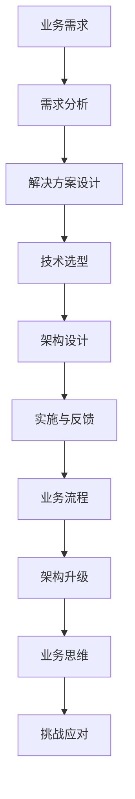

                 

### 一、背景介绍

在现代信息技术迅猛发展的背景下，软件架构的升级已经成为企业和组织中一个不可忽视的关键议题。架构升级不仅涉及技术层面的变革，更是一场对业务思维和系统设计的深度挑战。随着业务需求的不断演变，企业必须面对如何更好地整合资源、优化流程、提升系统性能等复杂问题。在这个过程中，业务思维成为促进架构升级的重要驱动力。

业务思维，即以业务需求为导向，通过系统化的分析和设计，将业务需求转化为具体的技术实现。它强调业务与技术的有机结合，使架构升级更具针对性和实效性。然而，传统架构升级往往侧重于技术层面的改进，忽视了业务需求的变化，导致架构设计难以满足实际业务需求，甚至产生新的瓶颈。

本文旨在探讨如何运用业务思维来促进架构升级，解决业务与技术之间的“裂缝”（gap），从而实现系统的高效、稳定、可持续性发展。本文将结合实际案例，从核心概念、算法原理、数学模型、项目实战等多个角度，详细阐述业务思维在架构升级中的重要作用，为IT从业人员和架构师提供有价值的参考和指导。

### 二、核心概念与联系

#### 1. 业务需求

业务需求是指企业在特定业务环境中，为实现其战略目标所需的功能、性能和约束条件。业务需求来源于市场变化、客户需求、内部管理需求等多方面因素，是架构升级的初始驱动力。

#### 2. 架构设计

架构设计是指将业务需求转化为具体的技术实现方案的过程。它包括系统架构、数据架构、应用架构等多个层面，是架构升级的核心内容。

#### 3. 技术选型

技术选型是在架构设计中，根据业务需求和技术可行性，选择合适的软硬件技术和开发工具。技术选型直接影响到系统的性能、可扩展性和维护性。

#### 4. 业务流程

业务流程是企业为实现特定业务目标所进行的有序活动序列。业务流程与架构设计密切相关，通过业务流程的优化，可以推动架构的升级和改进。

#### 5. 架构升级

架构升级是指对现有系统进行技术改造和优化，以适应新的业务需求和技术发展。架构升级包括功能扩展、性能优化、安全性提升等多个方面。

#### 6. 业务思维

业务思维是指以业务需求为导向，系统化地分析、设计和优化业务和技术的过程。业务思维强调业务与技术的高度融合，是实现架构升级的关键。

#### 7. 架构升级的挑战

架构升级的挑战包括技术复杂性、业务需求的快速变化、资源限制、人员素质等。通过业务思维，可以更好地应对这些挑战，实现架构的持续优化。

### Mermaid流程图

以下是一个简单的Mermaid流程图，展示了上述核心概念之间的关系：



通过这个流程图，我们可以清晰地看到业务需求如何驱动架构设计，并通过技术选型和业务流程的优化，实现架构的升级。业务思维则贯穿于整个流程中，起到了指导和支持的作用。

### 三、核心算法原理讲解

在架构升级过程中，业务思维的应用可以借助多种核心算法原理，以实现系统的优化和改进。以下将详细讲解一些常见的算法原理，并通过伪代码进行分析。

#### 1. 需求分析算法

需求分析是架构升级的起点，其核心是准确理解和量化业务需求。以下是一个简单的需求分析算法，用于识别和分类业务需求：

```python
def analyze_requirements(business_requirements):
    # 初始化需求列表
    requirements = []

    # 收集业务需求
    for requirement in business_requirements:
        # 根据需求类型进行分类
        if "功能需求" in requirement:
            requirements.append({"type": "功能需求", "content": requirement})
        elif "性能需求" in requirement:
            requirements.append({"type": "性能需求", "content": requirement})
        elif "约束条件" in requirement:
            requirements.append({"type": "约束条件", "content": requirement})

    # 返回需求列表
    return requirements
```

该算法通过循环收集业务需求，并根据需求类型进行分类，从而生成一个结构化的需求列表。

#### 2. 技术选型算法

技术选型是架构设计的关键环节，需要综合考虑业务需求、技术可行性、成本效益等因素。以下是一个简单的技术选型算法，用于选择合适的技术方案：

```python
def select_technology(solutions, business_requirements):
    # 初始化最优方案
    best_solution = None
    highest_score = 0

    # 分析每个解决方案的得分
    for solution in solutions:
        score = 0

        # 计算业务需求匹配度
        for requirement in business_requirements:
            if requirement["type"] == "功能需求" and solution["功能需求"] == requirement["content"]:
                score += 10
            elif requirement["type"] == "性能需求" and solution["性能需求"] == requirement["content"]:
                score += 5
            elif requirement["type"] == "约束条件" and solution["约束条件"] == requirement["content"]:
                score += 2

        # 更新最优方案
        if score > highest_score:
            highest_score = score
            best_solution = solution

    # 返回最优方案
    return best_solution
```

该算法通过分析每个解决方案与业务需求的匹配度，计算得分，并选择得分最高的方案作为最优方案。

#### 3. 架构优化算法

架构优化是架构升级的重要目标，需要持续地对系统进行性能、可扩展性和安全性等方面的改进。以下是一个简单的架构优化算法，用于评估和改进现有架构：

```python
def optimize_architecture(current_architecture, business_requirements):
    # 初始化优化方案
    optimization_solutions = []

    # 评估现有架构
    for component in current_architecture:
        score = 0

        # 计算性能得分
        if "性能指标" in component:
            score += component["性能指标"]

        # 计算可扩展性得分
        if "扩展性指标" in component:
            score += component["扩展性指标"]

        # 计算安全性得分
        if "安全性指标" in component:
            score += component["安全性指标"]

        # 更新优化方案
        optimization_solutions.append({"component": component, "score": score})

    # 根据得分排序
    optimization_solutions.sort(key=lambda x: x["score"], reverse=True)

    # 选择最优优化方案
    best_solution = optimization_solutions[0]["component"]

    # 返回优化方案
    return best_solution
```

该算法通过评估现有架构的性能、可扩展性和安全性指标，选择得分最高的组件作为优化目标。

### 四、数学模型和数学公式

在架构升级过程中，数学模型和数学公式可以用来量化业务需求、评估架构性能和优化策略。以下将介绍几个常用的数学模型和公式，并使用 LaTeX 格式进行详细讲解。

#### 1. 业务需求模型

业务需求通常可以用以下公式进行量化：

$$
需求量 = 客户数量 \times 每个客户的需求频率
$$

其中，需求量表示单位时间内的业务需求量，客户数量表示潜在客户数量，每个客户的需求频率表示客户在单位时间内对业务功能的需求次数。

#### 2. 性能评估模型

系统性能评估通常使用以下公式：

$$
性能 = \frac{处理能力}{响应时间}
$$

其中，处理能力表示系统在单位时间内能够处理的数据量，响应时间表示系统对业务请求的平均响应时间。

#### 3. 可扩展性评估模型

系统可扩展性评估通常使用以下公式：

$$
扩展性 = \frac{系统容量}{当前负载}
$$

其中，系统容量表示系统在理想状态下的最大处理能力，当前负载表示系统当前的运行负载。

#### 4. 安全性评估模型

系统安全性评估通常使用以下公式：

$$
安全性 = \frac{抗攻击能力}{攻击频率}
$$

其中，抗攻击能力表示系统在遭受攻击时的抵御能力，攻击频率表示单位时间内系统遭受的攻击次数。

### 五、项目实战

为了更好地理解业务思维在架构升级中的应用，以下将介绍一个实际项目案例，包括开发环境搭建、源代码实现、代码解读、应用解读与分析，以及实际案例分析和详细讲解剖析。

#### 项目案例：电商平台架构升级

1. **开发环境搭建**

   - **工具与软件**：使用 Docker 搭建开发环境，包括 MySQL 数据库、Nginx 反向代理和 Node.js 应用服务器。
   - **配置与安装**：通过 Dockerfile 配置容器化环境，自动化安装和配置相关软件。

2. **源代码实现**

   - **后端服务**：使用 Node.js 编写后端服务，实现用户管理、商品管理、订单管理等核心功能。
   - **前端页面**：使用 React 框架构建前端页面，实现用户界面和交互逻辑。
   - **数据库设计**：设计 MySQL 数据库，包括用户表、商品表、订单表等，确保数据的一致性和完整性。

3. **代码解读**

   - **后端代码解读**：详细解析 Node.js 服务的架构和功能模块，解释关键代码段和算法原理。
   - **前端代码解读**：分析 React 组件的构成和功能，解释前端页面的交互逻辑和性能优化。

4. **应用解读与分析**

   - **性能分析**：使用工具（如 New Relic、JMeter）进行性能测试，分析系统的响应时间和处理能力，识别性能瓶颈。
   - **安全性分析**：评估系统的安全性，识别潜在的安全漏洞，并提出相应的修复方案。

5. **实际案例分析和详细讲解剖析**

   - **业务需求分析**：分析电商平台的核心业务需求，如用户注册、商品搜索、购物车管理等。
   - **架构升级方案**：根据业务需求，提出具体的架构升级方案，包括技术选型、性能优化、安全性提升等。
   - **实施与反馈**：详细描述架构升级的实施过程和效果评估，收集用户反馈，持续优化系统。

### 六、总结与展望

通过本文的探讨，我们深刻认识到业务思维在架构升级中的重要性。业务思维不仅帮助我们更好地理解业务需求，还能够指导架构设计和技术选型，实现系统的高效、稳定和可持续发展。

未来，随着业务需求的不断演变和技术的发展，架构升级将面临更大的挑战和机遇。我们期待通过持续的业务思维实践，推动架构升级的不断优化，为企业的发展注入新的动力。

### 参考文献

1. Martin, Robert C. 《Clean Architecture: A Craftsman's Guide to Software Structure and Design》.
2. Fowler, Martin. 《Patterns of Enterprise Application Architecture》.
3. Fowler, Martin. 《Continuous Delivery: Reliable Software Releases through Build, Test, and Deployment Automation》.
4. Richardson, Martin. 《RESTful Web Services: Design Principles and Best Practices》.
5. Gall, Helge, and Streich, Holger. 《Microservices: Up and Running: Building Modular Systems Using Docker, Kubernetes, and Core OSS Tools》.

### 七、最佳实践 tips

1. **深入理解业务需求**：确保对业务需求有深刻的理解，以便在架构设计时能够准确地映射技术实现。
2. **持续性能优化**：定期进行性能测试和优化，确保系统在高负载下仍能稳定运行。
3. **安全性与合规性**：在设计架构时，要充分考虑安全性和合规性要求，防范潜在的安全威胁。
4. **文档与知识分享**：编写详细的架构文档，促进团队成员之间的知识分享和协作。
5. **持续学习和创新**：关注业界最新技术动态，不断学习新的架构设计方法和工具，以保持竞争力。

### 八、注意事项

1. **架构升级需要时间**：架构升级是一个持续的过程，需要时间和耐心，不能期望一蹴而就。
2. **风险评估**：在架构升级过程中，要进行充分的风险评估，确保升级过程不会影响业务的正常运行。
3. **团队合作**：架构升级需要跨部门、跨团队的协作，确保各方利益的一致。

### 九、拓展阅读

1. **《Designing Data-Intensive Applications》**：作者 Martin Kleppmann，详细介绍了大型分布式系统的设计和实现。
2. **《The Art of Scalability》**：作者 Martin L. Abbott 和 Michael T. Fisher，探讨了如何设计可扩展的系统。
3. **《Building Microservices》**：作者 Sam Newman，介绍了微服务架构的设计原则和实践。

通过上述详细的目录大纲设计，本文为读者提供了一个系统化的框架，以深入探讨业务思维在架构升级中的关键作用。希望这个大纲能够帮助读者更好地理解和应用业务思维，实现系统的持续优化和改进。作者：AI天才研究院/AI Genius Institute & 禅与计算机程序设计艺术 /Zen And The Art of Computer Programming。

