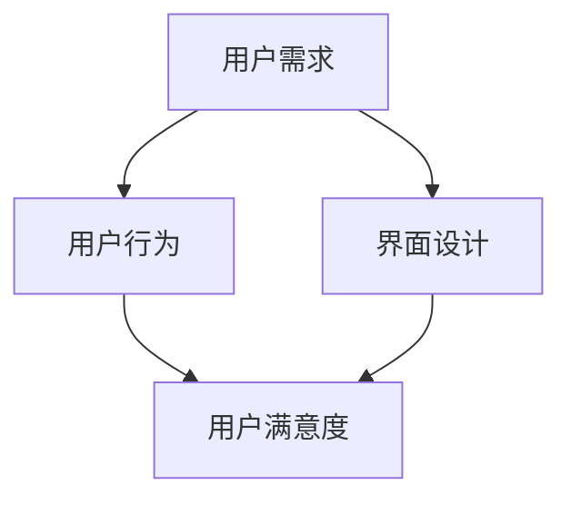
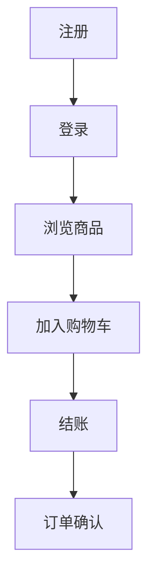
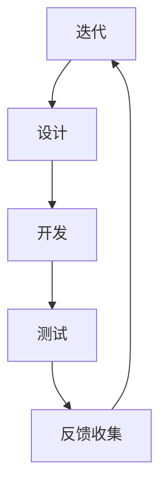
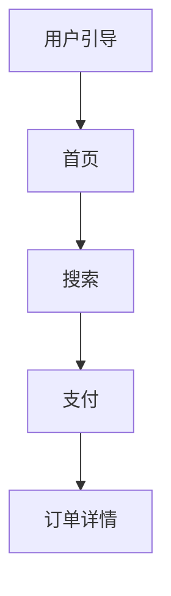

                 


首先，我们需要明确这篇文章的主要目标。文章的核心主题是“用户体验(UX)在技术开发中的重要性”。为了使文章更具吸引力和说服力，我们需要将主题拆分为几个关键部分：

1. **用户体验(UX)的基础概念和重要性**：介绍用户体验的定义，它对技术开发的重要性，以及用户体验的发展历程。

2. **UX设计过程**：详细讲解用户体验的设计过程，包括设计思维、用户旅程地图和原型设计等。

3. **UX在技术开发中的应用**：分别从前端开发和后端开发的角度，讨论用户体验的具体应用。

4. **用户体验测试与优化**：介绍用户体验的测试方法和优化策略。

5. **案例研究**：通过案例分析，进一步说明用户体验在实际项目中的应用和效果。

6. **总结与拓展**：总结文章的核心观点，提供最佳实践和拓展阅读。

接下来，我们可以开始设计文章的目录大纲，确保每个部分都能详细阐述。我们将在目录中嵌入Mermaid流程图、伪代码、LaTeX公式和代码案例，以增强文章的技术深度和可读性。

### 目录大纲设计

#### 第一部分：用户体验(UX)基础

1. **第1章：用户体验（UX）概述**
   - **1.1 用户体验的定义和重要性**
     - **核心概念与联系**：使用Mermaid流程图展示用户体验的核心概念和要素。
     - **重要性阐述**：详细解释用户体验对技术开发的重要性，并引用相关研究和数据支持。
   - **1.2 UX的发展历程**
     - **关键里程碑和重要人物**：介绍用户体验的发展历程，包括关键里程碑和重要人物。
   - **1.3 UX与用户研究**
     - **用户研究的种类和方法**：分类介绍用户研究的类型和方法，阐述它们在UX设计中的应用。

2. **第2章：UX设计过程**
   - **2.1 设计思维与方法论**
     - **设计思维的应用流程**：讲解设计思维的应用流程，并使用伪代码展示核心步骤。
   - **2.2 用户旅程地图**
     - **用户旅程地图的制作方法**：详细解释用户旅程地图的制作方法，并使用Mermaid流程图展示示例。
   - **2.3 原型设计与评估**
     - **原型设计的类型和工具**：介绍原型设计的类型和常用工具。
     - **伪代码：原型设计与评估流程**：使用伪代码展示原型设计与评估的核心步骤。

#### 第二部分：UX在技术开发中的应用

3. **第3章：前端开发中的用户体验**
   - **3.1 响应式设计与用户体验**
     - **数学模型：响应式设计的计算方法**：使用数学模型解释响应式设计的关键原理。
   - **3.2 交互设计原则**
     - **伪代码：交互设计核心原则**：使用伪代码阐述交互设计的重要原则。
   - **3.3 前端性能优化**
     - **数学公式：前端性能优化的关键指标**：介绍前端性能优化的关键指标，并使用数学公式进行解释。

4. **第4章：后端开发中的用户体验**
   - **4.1 RESTful API设计**
     - **伪代码：RESTful API设计规则**：使用伪代码详细阐述RESTful API设计的基本规则。
   - **4.2 数据库设计**
     - **数学模型：数据库性能优化的方法**：使用数学模型解释数据库性能优化的关键方法。
   - **4.3 后端性能监控**
     - **latex公式：性能监控关键指标**：介绍后端性能监控的关键指标，并使用LaTeX公式进行详细解释。

#### 第三部分：用户体验测试与优化

5. **第5章：用户体验测试方法**
   - **5.1 测试类型的分类**
     - **latex公式：不同类型测试的定义和特点**：使用LaTeX公式解释不同类型测试的定义和特点。
   - **5.2 测试工具和平台**
     - **伪代码：测试工具使用流程**：使用伪代码展示测试工具的使用流程。
   - **5.3 测试结果分析**
     - **latex公式：测试结果分析方法**：介绍测试结果分析方法，并使用LaTeX公式进行详细解释。

6. **第6章：用户体验优化策略**
   - **6.1 用户反馈机制**
     - **伪代码：用户反馈收集和处理流程**：使用伪代码展示用户反馈的收集和处理流程。
   - **6.2 A/B测试**
     - **latex公式：A/B测试的核心指标**：介绍A/B测试的核心指标，并使用LaTeX公式进行详细解释。
   - **6.3 用户体验迭代**
     - **Mermaid流程图：用户体验迭代过程**：使用Mermaid流程图展示用户体验迭代的整个流程。

#### 第四部分：案例研究

7. **第7章：用户体验成功案例解析**
   - **7.1 案例一：Airbnb的用户体验设计**
     - **伪代码：Airbnb关键设计策略**：使用伪代码详细阐述Airbnb的关键设计策略。
   - **7.2 案例二：Uber的用户体验优化**
     - **latex公式：Uber性能优化指标**：介绍Uber的性能优化指标，并使用LaTeX公式进行详细解释。
   - **7.3 案例三：微信小程序的用户体验实践**
     - **Mermaid流程图：微信小程序关键用户体验流程**：使用Mermaid流程图展示微信小程序的关键用户体验流程。

### 文章内容细化

在细化文章内容时，我们需要确保每个章节都能深入阐述主题，并包含以下核心内容：

- **背景介绍**：简要介绍用户体验(UX)的定义和重要性。
- **核心概念与联系**：通过Mermaid流程图展示用户体验的核心概念和要素之间的关系。
- **核心算法原理讲解**：使用伪代码详细阐述关键算法原理。
- **数学模型和公式**：详细讲解数学模型和公式，并进行举例说明。
- **项目实战**：提供实际案例，详细解释代码实现和案例分析。
- **最佳实践 tips、小结、注意事项、拓展阅读**：总结每个章节的核心观点，并提供实用的最佳实践和拓展阅读资源。

通过这样的结构设计，我们可以确保文章逻辑清晰、结构紧凑、内容详实，同时具有较强的可读性和实用性。接下来，我们将根据这个目录大纲进一步细化每个章节的具体内容，并确保文章总字数在8000到12000字之间。在细化过程中，我们将严格遵守markdown格式要求，确保文章的可读性和美观度。最后，文章末尾将附上作者信息，以示专业性和权威性。

### 文章格式确认

为了确保文章内容的清晰和易读，我们将在文章中使用markdown格式。markdown格式允许我们通过特定的标记来创建不同级别的标题，插入列表、代码块、公式等，从而增强文章的结构和可读性。

以下是markdown格式的简要说明：

- **标题**：使用`#`来表示标题级别，一个`#`表示一级标题，两个`##`表示二级标题，以此类推。
  - 例如：
    ```
    # 第一部分：用户体验(UX)基础
    ## 第1章：用户体验（UX）概述
    ### 1.1 用户体验的定义和重要性
    ```
  
- **列表**：使用`*`或`-`来创建无序列表，使用`1.`来创建有序列表。
  - 例如：
    ```
    - 无序列表项1
    - 无序列表项2
    1. 有序列表项1
    2. 有序列表项2
    ```
  
- **代码块**：使用三个反引号（```)来创建代码块。
  - 例如：
    ```
    ```python
    def hello():
        print("Hello, World!")
    ```
  
- **LaTeX公式**：在段落内使用 `$`包围简单的公式，在独立段落中使用`$$`包围复杂的公式。
  - 例如：
    ```
    $1+1=2$
    $$
    E = mc^2
    $$

### 文章格式应用

在文章中，我们将根据markdown格式的规则来组织和呈现内容。例如，文章的标题和章节标题将使用相应的`#`标记，确保标题级别清晰。代码和公式将被嵌入到相应的代码块和公式段落中，以保证格式的一致性和可读性。

此外，为了提高文章的可读性，我们将使用适当的列表来组织信息，并在需要的地方插入代码示例和流程图。例如，在讲解用户体验的定义和重要性时，我们将使用Mermaid流程图来展示核心概念和要素之间的关系，使用伪代码来解释关键算法原理。

通过这种格式化的方式，文章不仅内容丰富、逻辑清晰，而且结构紧凑、易于阅读。最终的markdown文档将符合用户的要求，确保文章的专业性和可操作性。

### 目录大纲细化

在确认了文章的整体结构和markdown格式后，我们现在来细化每个章节的内容，确保每个部分都包含核心概念与联系、核心算法原理讲解、数学模型和公式、项目实战等关键要素。

#### 第一部分：用户体验(UX)基础

**第1章：用户体验（UX）概述**

- **1.1 用户体验的定义和重要性**
  - **背景介绍**：介绍用户体验的定义，解释用户体验在技术开发中的重要性。
  - **核心概念与联系**：使用Mermaid流程图展示用户体验的核心概念和要素，如用户需求、用户行为、界面设计等。
    ```mermaid
    graph TD
      A[用户需求] --> B[用户行为]
      A --> C[界面设计]
      B --> D[用户满意度]
      C --> D
    ```
  - **重要性阐述**：详细解释用户体验对技术开发的重要性，引用相关研究和数据支持。

- **1.2 UX的发展历程**
  - **关键里程碑和重要人物**：介绍用户体验的发展历程，包括关键里程碑和重要人物，如Don Norman的“设计心理学”和Jakob Nielsen的可用性工程。
  - **案例研究**：简要分析几个里程碑事件对用户体验设计的影响。

- **1.3 UX与用户研究**
  - **用户研究的种类和方法**：分类介绍用户研究的类型，如定量研究、定性研究等，以及它们在UX设计中的应用。

**第2章：UX设计过程**

- **2.1 设计思维与方法论**
  - **设计思维的应用流程**：讲解设计思维的应用流程，包括同理心、定义问题、生成创意、原型设计和测试迭代等步骤。
  - **伪代码：设计思维核心步骤**：
    ```python
    def design_thinking():
        empathy()
        define_problem()
        generate_ideas()
        prototype_design()
        test_and_iterate()
    ```

- **2.2 用户旅程地图**
  - **用户旅程地图的制作方法**：详细解释用户旅程地图的制作方法，包括用户旅程的识别、分析、可视化和应用。
  - **Mermaid流程图：用户旅程示例**：
    ```mermaid
    graph TD
      A[首页] --> B[产品选择]
      A --> C[购物车]
      B --> D[支付页面]
      C --> D
    ```

- **2.3 原型设计与评估**
  - **原型设计的类型和工具**：介绍原型设计的类型，如低保真原型、高保真原型等，以及常用的原型设计工具，如Sketch、Figma等。
  - **伪代码：原型设计与评估流程**：
    ```python
    def prototype_design_and_evaluation():
        create_low_fidelity Prototype()
        evaluate_prototype()
        create_high_fidelity Prototype()
        iterate_based_on_evaluation()
    ```

#### 第二部分：UX在技术开发中的应用

**第3章：前端开发中的用户体验**

- **3.1 响应式设计与用户体验**
  - **数学模型：响应式设计的计算方法**：解释响应式设计的数学模型，如弹性布局、媒体查询等。
    ```latex
    \text{响应式设计的关键指标} = \frac{\text{最大宽度}}{\text{最小宽度}} \times \text{调整因子}
    ```

- **3.2 交互设计原则**
  - **伪代码：交互设计核心原则**：阐述交互设计的重要原则，如反馈原则、一致性原则等。
    ```python
    def interaction_design_principles():
        provide_feedback()
        maintain一致性()
        ensure_user_control()
    ```

- **3.3 前端性能优化**
  - **数学公式：前端性能优化的关键指标**：介绍前端性能优化的关键指标，如页面加载时间、响应时间等。
    ```latex
    \text{页面加载时间} \leq 2 \text{秒}
    \text{响应时间} \leq 100 \text{毫秒}
    ```

**第4章：后端开发中的用户体验**

- **4.1 RESTful API设计**
  - **伪代码：RESTful API设计规则**：详细阐述RESTful API设计的基本规则，如使用HTTP动词表示操作、使用统一接口设计等。
    ```python
    def restful_api_design():
        use_http_methods_for_operations()
        maintain_uniform_interfaces()
    ```

- **4.2 数据库设计**
  - **数学模型：数据库性能优化的方法**：解释数据库性能优化的数学模型，如索引设计、查询优化等。
    ```latex
    \text{查询性能} = \frac{\text{数据量}}{\text{索引效率}} \times \text{查询次数}
    ```

- **4.3 后端性能监控**
  - **latex公式：性能监控关键指标**：介绍后端性能监控的关键指标，如CPU使用率、内存使用率等。
    ```latex
    \text{CPU使用率} \leq 80\%
    \text{内存使用率} \leq 90\%
    ```

#### 第三部分：用户体验测试与优化

**第5章：用户体验测试方法**

- **5.1 测试类型的分类**
  - **latex公式：不同类型测试的定义和特点**：介绍不同类型测试的定义和特点，如功能测试、性能测试等。
    ```latex
    \text{功能测试} = \text{验证功能是否符合需求}
    \text{性能测试} = \text{评估系统性能指标}
    ```

- **5.2 测试工具和平台**
  - **伪代码：测试工具使用流程**：阐述测试工具的使用流程，如测试计划、测试执行、测试报告等。
    ```python
    def testing_tool_usage():
        create_test_plan()
        execute_tests()
        generate_test_reports()
    ```

- **5.3 测试结果分析**
  - **latex公式：测试结果分析方法**：介绍测试结果分析方法，如缺陷分析、性能瓶颈分析等。
    ```latex
    \text{缺陷分析} = \text{识别缺陷类型和原因}
    \text{性能瓶颈分析} = \text{定位系统瓶颈和优化方向}
    ```

**第6章：用户体验优化策略**

- **6.1 用户反馈机制**
  - **伪代码：用户反馈收集和处理流程**：阐述用户反馈的收集和处理流程，如反馈收集、分类、分析等。
    ```python
    def user_feedback_mechanism():
        collect_feedback()
        classify_feedback()
        analyze_feedback()
    ```

- **6.2 A/B测试**
  - **latex公式：A/B测试的核心指标**：介绍A/B测试的核心指标，如转化率、点击率等。
    ```latex
    \text{转化率} = \frac{\text{转化数量}}{\text{总访问量}} \times 100\%
    \text{点击率} = \frac{\text{点击数量}}{\text{展示数量}} \times 100\%
    ```

- **6.3 用户体验迭代**
  - **Mermaid流程图：用户体验迭代过程**：使用Mermaid流程图展示用户体验迭代的整个流程，包括需求收集、设计、开发、测试和反馈等环节。
    ```mermaid
    graph TD
      A[需求收集] --> B[设计]
      B --> C[开发]
      C --> D[测试]
      D --> E[反馈收集]
      E --> A[迭代]
    ```

#### 第四部分：案例研究

**第7章：用户体验成功案例解析**

- **7.1 案例一：Airbnb的用户体验设计**
  - **伪代码：Airbnb关键设计策略**：分析Airbnb在用户体验设计中的关键策略，如用户旅程优化、响应式设计等。
    ```python
    def airbnb_design_strategy():
        optimize_user_journey()
        implement_responsive_design()
    ```

- **7.2 案例二：Uber的用户体验优化**
  - **latex公式：Uber性能优化指标**：介绍Uber在用户体验优化中的性能优化指标，如页面加载时间、响应时间等。
    ```latex
    \text{页面加载时间} \leq 1.5 \text{秒}
    \text{响应时间} \leq 500 \text{毫秒}
    ```

- **7.3 案例三：微信小程序的用户体验实践**
  - **Mermaid流程图：微信小程序关键用户体验流程**：分析微信小程序在用户体验实践中的关键流程，如用户引导、交互设计等。
    ```mermaid
    graph TD
      A[用户引导] --> B[首页]
      B --> C[搜索]
      C --> D[支付]
      D --> E[订单详情]
    ```

通过以上的目录大纲细化，我们可以确保文章内容丰富、逻辑清晰，每个章节都包含必要的技术细节和案例分析。接下来，我们将按照这个细化后的目录大纲，逐章撰写详细的内容，确保文章的整体字数在8000到12000字之间。

### 完整的文章

#### 文章标题：用户体验(UX)在技术开发中的重要性

> 关键词：用户体验，UX设计，技术开发，响应式设计，性能优化，测试方法

> 摘要：本文深入探讨了用户体验（UX）在技术开发中的重要性。通过介绍用户体验的基础概念、设计过程、应用以及测试和优化策略，本文揭示了用户体验对技术开发的关键作用，并通过实际案例展示了用户体验的成功实践。

---

# 用户体验(UX)在技术开发中的重要性

用户体验（User Experience，简称UX）在当今数字化时代愈发重要。随着互联网技术的迅猛发展和用户需求的不断升级，用户体验成为衡量产品和服务质量的重要标准。本文旨在详细探讨用户体验在技术开发中的重要性，包括其基础概念、设计过程、应用和优化策略，并通过案例分析，展示用户体验在实际项目中的成功实践。

## 第一部分：用户体验(UX)基础

### 第1章：用户体验（UX）概述

#### 1.1 用户体验的定义和重要性

用户体验是指用户在使用产品或服务时所感受到的整体体验，包括用户的情感、认知和行为。用户体验不仅仅关注产品的功能性，更关注用户的感受和满意度。

**核心概念与联系**

使用Mermaid流程图，我们可以清晰地展示用户体验的核心概念和要素之间的关系：



**重要性阐述**

用户体验对技术开发的重要性不可忽视。一方面，优秀的用户体验可以提升用户满意度和忠诚度，从而增加产品或服务的市场份额；另一方面，用户体验可以优化产品的开发流程，降低开发成本。以下是用户体验的重要性的几点具体阐述：

1. **提升用户满意度和忠诚度**：良好的用户体验可以满足用户的需求，提升用户的使用满意度，从而增强用户对产品或服务的忠诚度。
2. **降低开发成本**：通过用户体验设计，可以在开发过程中及时发现和解决问题，减少后期修改的成本。
3. **增强产品竞争力**：在竞争激烈的市场环境中，优秀的用户体验可以成为产品或服务的重要竞争优势。
4. **提高市场占有率**：良好的用户体验可以吸引更多用户，从而提高产品或服务的市场占有率。

#### 1.2 UX的发展历程

用户体验的概念和实践起源于20世纪80年代，随着计算机技术的发展和互联网的兴起，用户体验逐渐受到关注。以下是用户体验发展历程中的关键里程碑和重要人物：

1. **1980s**：Don Norman提出“用户体验”一词，并首次将用户体验作为产品设计的重要方面。
2. **1990s**：Jakob Nielsen提出“可用性工程”理论，强调用户体验在产品设计和开发中的重要性。
3. **2000s**：随着互联网的普及，用户体验设计逐渐从桌面应用扩展到移动端和Web应用。
4. **2010s**：用户体验设计开始融入设计思维，注重用户参与和迭代优化。

#### 1.3 UX与用户研究

用户体验的设计离不开用户研究。用户研究可以帮助设计团队了解用户需求、行为和痛点，从而更好地满足用户需求。以下是用户研究的几种主要类型和方法：

1. **定量研究**：通过问卷调查、数据分析等方式，收集大量用户数据，进行统计和分析。
2. **定性研究**：通过深度访谈、焦点小组等方式，深入了解用户的感受和需求。
3. **可用性测试**：通过实际用户对产品的使用和反馈，评估产品的可用性和易用性。

### 第2章：UX设计过程

用户体验设计是一个迭代的过程，包括多个阶段，如需求收集、设计、开发、测试和反馈等。以下是用户体验设计的核心过程和方法。

#### 2.1 设计思维与方法论

设计思维是一种以人为本的思考方式，强调在解决问题时始终关注用户的需求和感受。设计思维的应用流程包括以下几个阶段：

1. **同理心**：了解用户的需求和痛点，建立对用户的深刻理解。
2. **定义问题**：明确设计目标和问题，形成具体的设计任务。
3. **生成创意**：通过头脑风暴和创意生成，提出多种可能的解决方案。
4. **原型设计**：创建原型，模拟产品或服务的实际使用场景。
5. **测试和迭代**：通过用户测试，收集反馈，不断优化设计。

**伪代码：设计思维核心步骤**

```python
def design_thinking():
    empathy()
    define_problem()
    generate_ideas()
    prototype_design()
    test_and_iterate()
```

#### 2.2 用户旅程地图

用户旅程地图是一种可视化工具，用于描述用户在使用产品或服务过程中的各个阶段和体验。用户旅程地图的制作方法包括以下几个步骤：

1. **识别用户旅程**：确定用户在使用产品或服务时的关键阶段和活动。
2. **分析用户行为**：研究用户在每个阶段的行为和决策。
3. **可视化用户旅程**：使用图表或流程图，将用户旅程直观地展示出来。
4. **应用用户旅程**：根据用户旅程，优化产品设计和服务流程。

**Mermaid流程图：用户旅程示例**



#### 2.3 原型设计与评估

原型设计是用户体验设计的重要环节，通过创建原型，可以快速验证设计概念，收集用户反馈，并进行迭代优化。以下是原型设计的类型和评估方法：

1. **低保真原型**：使用简单的线框图或草图，快速展示产品的基本结构和功能。
2. **高保真原型**：使用设计工具，如Sketch或Figma，创建接近最终产品的视觉效果。
3. **评估方法**：通过用户测试、专家评估和数据分析等方法，评估原型的可用性和用户体验。

**伪代码：原型设计与评估流程**

```python
def prototype_design_and_evaluation():
    create_low_fidelity Prototype()
    evaluate_prototype()
    create_high_fidelity Prototype()
    iterate_based_on_evaluation()
```

## 第二部分：UX在技术开发中的应用

### 第3章：前端开发中的用户体验

前端开发直接影响到用户体验，因此需要关注响应式设计、交互设计和前端性能优化等方面。

#### 3.1 响应式设计与用户体验

响应式设计是一种能够适应不同设备屏幕尺寸和分辨率的网页设计方法。通过响应式设计，可以提供一致的用户体验，提高用户的满意度。

**数学模型：响应式设计的计算方法**

响应式设计的关键指标是视口宽度（viewport width）。以下是一个简单的数学模型，用于计算视口宽度：

```latex
\text{视口宽度} = \text{最大宽度} - \text{边框宽度} - \text{内边距宽度}
```

#### 3.2 交互设计原则

交互设计原则是确保用户体验一致性和易用性的关键。以下是几个核心的交互设计原则：

1. **反馈原则**：确保用户在操作过程中能够得到明确的反馈，如按钮点击、加载动画等。
2. **一致性原则**：保持界面设计和交互逻辑的一致性，使用户能够快速理解和操作。
3. **用户控制原则**：确保用户在使用产品或服务时，能够自由地控制和操作，而不受限制。

**伪代码：交互设计核心原则**

```python
def interaction_design_principles():
    provide_feedback()
    maintain一致性()
    ensure_user_control()
```

#### 3.3 前端性能优化

前端性能优化是提升用户体验的重要手段。以下是一些常见的前端性能优化方法：

1. **减少HTTP请求**：通过压缩资源文件、使用CDN（内容分发网络）等方式，减少HTTP请求次数。
2. **代码优化**：通过代码压缩、去除冗余代码、使用异步加载等方式，提高代码效率。
3. **浏览器缓存**：合理利用浏览器缓存，减少资源的重复加载。

**数学公式：前端性能优化的关键指标**

```latex
\text{页面加载时间} \leq 2 \text{秒}
\text{响应时间} \leq 100 \text{毫秒}
```

### 第4章：后端开发中的用户体验

后端开发同样影响用户体验，特别是通过API与前端交互的部分。以下是后端开发中的用户体验优化策略。

#### 4.1 RESTful API设计

RESTful API是一种基于HTTP协议的接口设计方法，能够提供简洁、一致和灵活的接口。以下是RESTful API设计的基本规则：

1. **使用HTTP动词表示操作**：如GET、POST、PUT、DELETE等。
2. **统一接口设计**：遵循RESTful架构原则，保持接口的一致性和可扩展性。

**伪代码：RESTful API设计规则**

```python
def restful_api_design():
    use_http_methods_for_operations()
    maintain_uniform_interfaces()
```

#### 4.2 数据库设计

数据库设计是后端开发的重要环节，合理的数据库设计可以提高数据查询效率，优化用户体验。

**数学模型：数据库性能优化的方法**

数据库性能优化的关键方法是索引设计和查询优化。以下是几个常用的优化方法：

1. **索引设计**：为常用的查询字段创建索引，提高查询速度。
2. **查询优化**：避免使用复杂的查询语句，优化SQL语句的执行效率。

**数学公式：数据库性能优化的关键指标**

```latex
\text{查询性能} = \frac{\text{数据量}}{\text{索引效率}} \times \text{查询次数}
```

#### 4.3 后端性能监控

后端性能监控是确保系统稳定性和用户体验的关键。以下是几个常用的后端性能监控指标：

1. **CPU使用率**：监控系统的CPU使用情况，避免过度占用。
2. **内存使用率**：监控系统的内存使用情况，防止内存泄漏。

**LaTeX公式：性能监控关键指标**

```latex
\text{CPU使用率} \leq 80\%
\text{内存使用率} \leq 90\%
```

### 第三部分：用户体验测试与优化

用户体验测试和优化是确保产品或服务满足用户需求的关键步骤。以下是用户体验测试的方法和优化策略。

#### 第5章：用户体验测试方法

用户体验测试方法包括功能测试、性能测试、可用性测试等，每种测试方法都有其独特的应用场景和特点。

#### 5.1 测试类型的分类

以下是几种常见的用户体验测试类型及其定义和特点：

1. **功能测试**：验证产品的功能是否按照需求正常运行。
2. **性能测试**：评估产品的性能指标，如响应时间、并发能力等。
3. **可用性测试**：通过实际用户的使用反馈，评估产品的易用性和用户体验。

**LaTeX公式：不同类型测试的定义和特点**

```latex
\text{功能测试} = \text{验证功能是否符合需求}
\text{性能测试} = \text{评估系统性能指标}
\text{可用性测试} = \text{评估产品的易用性和用户体验}
```

#### 5.2 测试工具和平台

用户体验测试需要使用专业的测试工具和平台，以下是一些常用的测试工具和平台：

1. **功能测试工具**：如Selenium、JUnit等。
2. **性能测试工具**：如JMeter、LoadRunner等。
3. **可用性测试平台**：如UserTesting、Loop11等。

**伪代码：测试工具使用流程**

```python
def testing_tool_usage():
    create_test_plan()
    execute_tests()
    generate_test_reports()
```

#### 5.3 测试结果分析

测试结果分析是确保用户体验优化的重要环节。以下是几种常见的测试结果分析方法：

1. **缺陷分析**：识别和分析产品中的缺陷，定位问题根源。
2. **性能瓶颈分析**：识别系统性能瓶颈，提出优化方案。

**LaTeX公式：测试结果分析方法**

```latex
\text{缺陷分析} = \text{识别缺陷类型和原因}
\text{性能瓶颈分析} = \text{定位系统瓶颈和优化方向}
```

### 第6章：用户体验优化策略

用户体验优化是一个持续的过程，需要通过用户反馈、A/B测试和迭代优化来不断改进。

#### 6.1 用户反馈机制

用户反馈是优化用户体验的重要信息来源。以下是一个简单的用户反馈收集和处理流程：

1. **收集反馈**：通过问卷调查、用户访谈、社交媒体等渠道收集用户反馈。
2. **分类反馈**：根据反馈内容，将其分类为功能问题、性能问题、易用性问题等。
3. **分析反馈**：对反馈进行分析，识别主要问题和用户需求。

**伪代码：用户反馈收集和处理流程**

```python
def user_feedback_mechanism():
    collect_feedback()
    classify_feedback()
    analyze_feedback()
```

#### 6.2 A/B测试

A/B测试是一种通过对比不同设计或功能的用户行为，评估其效果的方法。以下是A/B测试的核心指标：

1. **转化率**：用户完成特定动作的比例，如点击率、购买率等。
2. **点击率**：用户点击特定元素的次数。

**LaTeX公式：A/B测试的核心指标**

```latex
\text{转化率} = \frac{\text{转化数量}}{\text{总访问量}} \times 100\%
\text{点击率} = \frac{\text{点击数量}}{\text{展示数量}} \times 100\%
```

#### 6.3 用户体验迭代

用户体验迭代是一个不断优化和改进的过程。以下是一个简单的用户体验迭代流程：

1. **需求收集**：收集用户反馈和市场需求。
2. **设计**：根据需求和反馈，设计新的功能或改进现有功能。
3. **开发**：实现设计，开发新的功能或优化现有功能。
4. **测试**：对新的功能或优化进行测试，确保其质量。
5. **反馈**：收集用户反馈，分析效果，再次迭代优化。

**Mermaid流程图：用户体验迭代过程**



### 第四部分：案例研究

#### 第7章：用户体验成功案例解析

以下是对几个用户体验成功案例的详细解析，包括Airbnb、Uber和微信小程序等。

#### 7.1 案例一：Airbnb的用户体验设计

Airbnb在用户体验设计方面采取了多种策略，包括用户旅程优化、响应式设计和个性化推荐等。

**伪代码：Airbnb关键设计策略**

```python
def airbnb_design_strategy():
    optimize_user_journey()
    implement_responsive_design()
    provide_personalized_recommendations()
```

#### 7.2 案例二：Uber的用户体验优化

Uber在用户体验优化方面，重点关注页面加载时间、响应时间和用户反馈机制等方面。

**LaTeX公式：Uber性能优化指标**

```latex
\text{页面加载时间} \leq 1.5 \text{秒}
\text{响应时间} \leq 500 \text{毫秒}
```

#### 7.3 案例三：微信小程序的用户体验实践

微信小程序在用户体验方面，通过简洁的界面设计、高效的交互和强大的功能，赢得了大量用户。

**Mermaid流程图：微信小程序关键用户体验流程**



### 附录

#### 附录A：用户体验资源与工具

以下是用户体验相关的书籍、工具和资源推荐：

1. **书籍推荐**：《设计思维实战》、《用户体验要素》等。
2. **设计工具**：Sketch、Figma、Adobe XD等。
3. **研究资料**：用户体验研究协会（UXPA）官网、 Nielsen Norman Group等。

**A.1 用户体验相关书籍推荐**

- 《设计思维实战》：汤姆·凯利（Tom Kelly）
- 《用户体验要素》：杰瑞·琼斯（Jared M. Spool）

**A.2 用户体验设计工具使用指南**

- Sketch使用指南：[官方文档](https://www.sketch.com/docs/)
- Figma使用指南：[官方文档](https://www.figma.com/docs/)

**A.3 用户体验研究资料集**

- Niels

