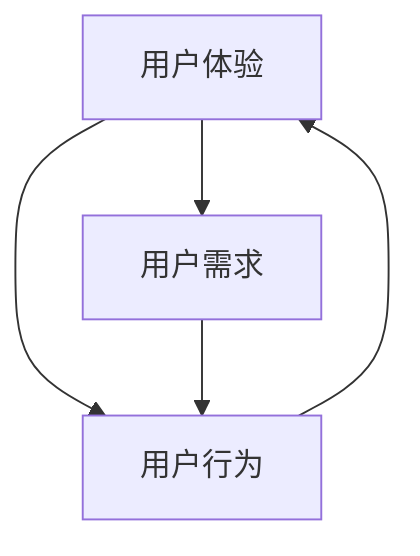

                 

### 文章标题

# 用户体验：将UX设计融入开发流程

### 关键词

- 用户体验（UX）
- 设计流程
- 开发流程
- 敏捷开发
- DevOps
- 跨部门协作

### 摘要

本文旨在探讨如何将用户体验（UX）设计融入软件开发流程，从而提升产品的质量和用户的满意度。文章首先介绍了UX设计的基本原则和方法，然后分析了传统的开发流程，接着详细阐述了UX设计与开发流程融合的方法和工具。通过具体的实战案例，本文展示了如何在实际项目中整合UX设计，并提供了最佳实践和注意事项。最后，文章对未来UX设计与开发趋势进行了展望，为读者指明了进一步探索的方向。

---

## 引言

在当今科技高速发展的时代，用户体验（User Experience, UX）已经成为影响产品成功与否的关键因素。用户体验不仅关系到用户对产品的满意度和忠诚度，还直接影响到产品的市场表现和商业价值。因此，如何将UX设计融入软件开发流程，已经成为软件开发者和设计师们共同关注的焦点。

传统的软件开发流程往往注重功能实现和性能优化，而忽视了用户体验的重要性。这种做法不仅可能导致产品在市场上表现不佳，还可能引发用户的不满和流失。为了改变这一现状，越来越多的团队开始将UX设计纳入开发流程，通过系统的方法和工具，确保产品在开发过程中始终关注用户体验。

本文将从以下几个方面展开讨论：

1. **UX设计基础**：介绍UX设计的历史、基本原则和方法。
2. **开发流程概述**：分析传统的软件开发流程，如瀑布模型、敏捷开发等。
3. **UX设计与开发流程的融合**：探讨如何将UX设计融入开发流程，介绍相关的工具和方法。
4. **项目实战**：通过具体案例展示如何在实际项目中整合UX设计。
5. **用户体验评估与改进**：介绍用户体验评估的方法和持续改进的实践。
6. **未来展望**：探讨未来的UX设计与开发趋势。

希望通过本文的阅读，读者能够对如何将UX设计融入开发流程有更加深入的理解，从而在实际工作中取得更好的效果。

## UX设计基础

### UX设计的历史与发展

用户体验（UX）设计作为现代产品设计的重要环节，其起源可以追溯到20世纪中期。当时，工业设计和人机交互领域的研究者开始关注产品的易用性和用户体验。1950年代，心理学家唐纳德·诺曼（Donald Norman）在《设计心理学》中首次提出了“用户体验”的概念，强调了设计应以人为本，注重用户的感受和需求。

随着计算机技术和互联网的快速发展，用户体验设计逐渐成为独立的设计领域。1980年代，人机交互（Human-Computer Interaction, HCI）领域的研究为UX设计提供了理论基础。进入21世纪，随着移动设备的普及和Web2.0的发展，用户体验设计的重要性日益凸显，越来越多的企业和设计师开始重视UX设计在产品开发中的价值。

### UX设计的基本原则

UX设计的基本原则包括一致性、简洁性、可访问性、可控性和反馈性。这些原则旨在为用户提供一个直观、高效和愉悦的使用体验。

1. **一致性**：用户在不同场景下使用产品时，应感受到一致的操作方式和界面布局。这有助于用户快速掌握产品功能，降低学习成本。
2. **简洁性**：产品界面应简洁明了，避免过多的装饰和冗余信息。简洁的设计有助于用户集中注意力，提高操作效率。
3. **可访问性**：产品应考虑不同用户的需求，包括视障、听障和行动不便的用户。通过无障碍设计，确保产品对所有用户均友好。
4. **可控性**：用户在使用产品时，应能直观地控制操作流程，避免意外操作和错误发生。
5. **反馈性**：产品应提供及时的反馈，让用户了解操作结果和系统状态，增加用户信心。

### UX设计的方法

UX设计的方法包括用户研究、原型设计、用户测试和迭代改进。这些方法共同构成了一个闭环，确保设计过程中始终关注用户体验。

1. **用户研究**：通过访谈、问卷调查、可用性测试等方法，了解用户的需求和行为模式。用户研究是UX设计的起点，为设计提供真实的数据支持。
2. **原型设计**：利用Sketch、Figma等工具，创建产品的低保真或高保真原型。原型设计有助于设计师和开发团队共同探讨产品的功能和界面布局。
3. **用户测试**：通过用户测试，验证原型设计的可行性和用户体验。用户测试可以发现问题，为后续设计提供改进方向。
4. **迭代改进**：根据用户测试的结果，不断迭代优化设计。迭代改进是UX设计的关键，通过不断的优化，确保产品最终达到理想状态。

### 用户研究方法

用户研究是UX设计的重要环节，以下介绍几种常见的用户研究方法：

1. **访谈**：通过面对面的访谈，深入了解用户的需求、行为和痛点。访谈可以获取详细的用户反馈，但需要专业的访谈技巧和数据分析能力。
2. **问卷调查**：通过在线问卷或纸质问卷，收集大量用户的反馈。问卷调查可以获取广泛的用户数据，但可能存在主观偏差和回答质量不一的问题。
3. **可用性测试**：在真实或模拟的使用场景中，观察用户使用产品的过程。可用性测试可以帮助发现产品设计和交互中的问题，为改进设计提供依据。
4. **田野调查**：深入用户的生活和工作环境，观察他们的日常行为和习惯。田野调查可以获得真实的用户体验，但需要耗费较长的时间和较高的成本。

### UX设计流程

UX设计流程可以分为以下几个阶段：

1. **需求分析**：收集用户需求和市场信息，确定产品的功能、特点和目标用户。
2. **竞品分析**：分析竞品产品的优势和不足，为自身产品提供设计参考。
3. **用户画像**：基于需求分析和竞品分析，创建目标用户的画像，明确设计方向。
4. **原型设计**：利用工具创建低保真或高保真原型，进行初步的交互设计。
5. **用户测试**：通过用户测试，验证原型的可行性和用户体验。
6. **迭代优化**：根据用户测试的结果，不断优化设计，直至达到预期效果。
7. **文档编写**：整理设计文档，包括用户需求文档、交互设计文档、UI设计规范等。

通过以上方法，UX设计师可以系统地开展设计工作，确保产品在开发过程中始终关注用户体验。

### 核心概念与联系

在UX设计中，核心概念包括用户体验、用户需求和用户行为。这些概念之间存在紧密的联系，共同构成了UX设计的基础。

1. **用户体验**：用户体验是指用户在使用产品过程中所感受到的所有感受和体验。用户体验包括视觉、操作、情感等多方面因素，直接影响用户的满意度。
2. **用户需求**：用户需求是指用户在特定场景下希望从产品中获得的功能和效果。用户需求是UX设计的出发点，决定了产品的功能和特性。
3. **用户行为**：用户行为是指用户在使用产品时的操作行为和互动方式。用户行为反映了用户需求，为UX设计提供了实际的数据支持。

这三种概念之间的关系可以用以下Mermaid流程图表示：



通过这个流程图，我们可以清晰地看到用户体验、用户需求和用户行为之间的相互影响和作用。用户体验是用户对产品整体感受的总结，用户需求是驱动设计的核心，而用户行为则是用户实际操作的具体表现。三者相互关联，共同构成了UX设计的核心框架。

### 核心算法原理讲解

在UX设计中，算法原理主要涉及数据分析和用户行为预测。以下将使用伪代码和详细讲解，阐述这些算法的基本原理。

#### 1. 数据分析算法

数据分析是UX设计的重要环节，通过分析用户行为数据，设计师可以深入了解用户需求和行为模式。以下是一个简单的数据分析算法，用于统计用户点击次数最多的功能：

```python
# 输入：用户行为数据（每个用户的行为记录，包括功能ID和点击次数）
# 输出：点击次数最多的功能ID

def analyze_click_data(user_data):
    click_count = {}  # 初始化点击次数统计字典
    for record in user_data:
        function_id = record['function_id']
        click_count[function_id] = click_count.get(function_id, 0) + record['click_count']
    max_click_id = max(click_count, key=click_count.get)
    return max_click_id
```

**详细解释：**
- `click_count` 用于记录每个功能的点击次数，初始值为0。
- 遍历用户行为数据，对于每个记录，更新对应功能的点击次数。
- 使用 `max()` 函数和 `key` 参数找到点击次数最多的功能ID。

#### 2. 用户行为预测算法

用户行为预测可以帮助设计师预测用户可能的使用路径和行为，从而优化用户体验。以下是一个简单的用户行为预测算法，使用决策树进行预测：

```python
# 输入：用户特征数据（包括用户年龄、性别、地域等特征）
# 输出：用户可能的下一步操作

from sklearn.tree import DecisionTreeClassifier
from sklearn.model_selection import train_test_split

def predict_user_behavior(user_features):
    X = user_features.values  # 特征数据
    y = user_features['next_action']  # 标签数据

    # 划分训练集和测试集
    X_train, X_test, y_train, y_test = train_test_split(X, y, test_size=0.2, random_state=42)

    # 训练决策树模型
    model = DecisionTreeClassifier()
    model.fit(X_train, y_train)

    # 预测用户行为
    predicted_actions = model.predict(X_test)

    # 输出预测结果
    return predicted_actions
```

**详细解释：**
- `X` 和 `y` 分别表示用户特征数据和标签数据。
- 使用 `train_test_split` 函数将数据划分为训练集和测试集。
- 使用 `DecisionTreeClassifier` 类训练决策树模型。
- 使用 `predict` 方法对测试集进行预测，并输出预测结果。

通过以上算法，设计师可以深入分析用户行为数据，预测用户可能的下一步操作，从而优化产品的交互设计和功能布局。这些算法不仅提高了设计效率，还为产品的持续迭代提供了数据支持。

### 数学模型和公式

在UX设计中，数学模型和公式广泛应用于用户行为分析和用户体验评估。以下将介绍两个典型的数学模型：马尔可夫决策过程（MDP）和线性回归模型。

#### 1. 马尔可夫决策过程（MDP）

马尔可夫决策过程（MDP）是一个用于决策优化的数学模型，适用于不确定环境中的决策问题。MDP的数学公式如下：

$$
V^*(s) = \max_{a} \sum_{s'} p(s' | s, a) \cdot \sum_{r} r(s', a) + \gamma V^*(s')
$$

其中：
- \( V^*(s) \) 表示状态 \( s \) 的最优价值函数。
- \( a \) 表示行动。
- \( s' \) 表示状态转移后的状态。
- \( p(s' | s, a) \) 表示从状态 \( s \) 选择行动 \( a \) 后转移到状态 \( s' \) 的概率。
- \( r(s', a) \) 表示在状态 \( s' \) 下执行行动 \( a \) 所获得的即时奖励。
- \( \gamma \) 表示折现因子，用于平衡当前奖励和未来奖励。

**详细讲解和举例：**
- 例如，在一个在线购物平台中，用户在浏览商品时，每个页面都代表一个状态，用户的点击行为代表行动。通过MDP模型，我们可以预测用户下一步最有可能点击的页面，从而优化推荐系统。
- 价值函数 \( V^*(s) \) 表示在状态 \( s \) 下执行最佳行动所能获得的最大期望收益。通过递归计算，可以找到每个状态的最优价值函数。

#### 2. 线性回归模型

线性回归模型是一种用于预测连续值的统计模型，广泛应用于用户体验分析。线性回归模型的数学公式如下：

$$
y = \beta_0 + \beta_1 \cdot x + \epsilon
$$

其中：
- \( y \) 表示因变量（目标值）。
- \( x \) 表示自变量（特征值）。
- \( \beta_0 \) 和 \( \beta_1 \) 分别表示截距和斜率，是模型的参数。
- \( \epsilon \) 表示随机误差。

**详细讲解和举例：**
- 例如，在用户体验评估中，我们可以使用线性回归模型预测用户对某个功能的满意度得分。自变量可以是用户的使用时长、操作次数等特征，因变量是用户满意度评分。
- 通过最小二乘法，我们可以估计模型的参数，从而建立预测模型。模型的斜率 \( \beta_1 \) 表示自变量对因变量的影响程度。

通过这些数学模型和公式，设计师可以更加科学和系统地分析用户行为，优化用户体验。这些模型不仅提高了设计决策的准确性，还为产品的持续改进提供了数据支持。

### 项目实战：UX设计与开发流程的整合

为了更好地展示如何将UX设计融入开发流程，本节将结合一个实际项目，详细描述项目的背景、设计阶段、开发阶段、测试与优化阶段，以及最终的项目小结。

#### 项目背景

该项目是一个企业级客户关系管理（CRM）系统，旨在帮助企业更好地管理客户信息和销售机会。项目团队由产品经理、UX设计师、前端开发工程师、后端开发工程师、测试工程师等多部门人员组成。项目的目标是在保证功能完善的前提下，提升用户的使用体验，提高用户满意度。

#### 设计阶段

在项目启动阶段，UX设计师首先进行了用户需求调研和竞品分析。通过访谈、问卷调查和可用性测试，设计师收集了大量的用户反馈，明确了用户的主要需求和使用场景。根据这些反馈，设计师制定了以下设计目标：

1. 界面简洁直观，减少用户的学习成本。
2. 优化功能布局，提高用户操作效率。
3. 加强系统反馈，提升用户信心。

为了实现这些目标，设计师采取了以下设计步骤：

1. **用户画像**：基于调研结果，创建目标用户的画像，明确设计方向。
2. **原型设计**：使用Sketch和Axure等工具，创建低保真和高保真原型，进行初步的交互设计。
3. **用户测试**：通过用户测试，验证原型的可行性和用户体验。根据测试结果，对原型进行迭代优化。

#### 开发阶段

在原型设计阶段完成后，前端开发工程师和后端开发工程师开始进行开发工作。为了确保UX设计在开发过程中得到有效落实，项目团队采取了以下措施：

1. **代码规范**：制定统一的代码规范，确保开发人员按照UX设计的要求进行编码。
2. **组件化开发**：采用Vue、React等前端框架，实现组件化开发，提高开发效率。
3. **迭代交付**：采用敏捷开发方法，分阶段交付功能模块，确保每次迭代都能提供完整的功能和良好的用户体验。

在开发过程中，UX设计师和开发团队保持密切沟通，设计师随时提供设计指导和反馈，确保开发成果符合设计预期。

#### 测试与优化阶段

在开发阶段完成后，测试工程师对系统进行了全面的测试，包括功能测试、性能测试和安全测试。在测试过程中，发现了一些用户体验问题，如页面加载速度较慢、某些功能操作不够直观等。针对这些问题，UX设计师和开发团队采取了以下优化措施：

1. **优化加载速度**：通过压缩图片、代码拆分和懒加载等技术，提高页面加载速度。
2. **改进功能操作**：对界面布局进行调整，提高操作直观性，降低用户错误率。

经过多次迭代优化，系统的用户体验得到了显著提升。

#### 项目小结

通过该项目，我们成功地实现了UX设计与开发流程的整合。以下是项目的主要收获和经验：

1. **紧密沟通**：UX设计师与开发团队之间的紧密沟通是项目成功的关键。通过定期的会议和反馈机制，确保设计理念在开发过程中得到有效落实。
2. **敏捷开发**：采用敏捷开发方法，分阶段交付功能模块，提高了开发效率，确保了每次迭代都能提供完整的功能和良好的用户体验。
3. **用户反馈**：重视用户反馈，通过用户测试和可用性测试，及时发现并解决问题，不断优化用户体验。

通过这个项目，我们深刻认识到UX设计在软件开发中的重要性，未来将继续探索如何更好地将UX设计融入开发流程，为用户提供更优质的产品体验。

### UX设计与用户体验评估

用户体验（UX）评估是确保产品满足用户需求和期望的关键环节。通过系统的方法和工具，UX设计师和开发团队可以评估产品的用户体验，识别问题并制定改进措施。以下将介绍用户体验评估的方法、工具和指标，以及用户体验反馈循环的概念。

#### 用户体验评估方法

用户体验评估方法主要包括可用性测试、用户调研和数据分析。这些方法可以从不同角度收集用户反馈，帮助团队全面了解用户体验。

1. **可用性测试**：在真实或模拟的使用场景中，观察用户使用产品的过程，记录用户的行为和反馈。可用性测试可以识别产品的易用性问题，如界面布局不合理、功能操作不直观等。

2. **用户调研**：通过访谈、问卷调查和用户访谈等方法，收集用户的反馈和需求。用户调研可以帮助团队了解用户的实际使用场景和痛点，为改进设计提供依据。

3. **数据分析**：通过分析用户行为数据，如页面访问量、点击率、转化率等，了解用户的操作习惯和偏好。数据分析可以量化用户体验，为改进设计提供数据支持。

#### 用户体验评估工具

用户体验评估工具包括可用性测试工具、用户调研工具和数据分析工具。以下介绍几种常用的评估工具：

1. **可用性测试工具**：如UsabilityHub、OptimalWorkshop等，这些工具提供了简便的测试流程和数据分析功能，可以帮助团队快速评估产品的易用性。

2. **用户调研工具**：如SurveyMonkey、Google表单等，这些工具可以在线创建问卷，收集用户反馈。通过分析问卷结果，团队可以了解用户的需求和期望。

3. **数据分析工具**：如Google Analytics、Mixpanel等，这些工具可以实时监控用户的操作行为，提供详细的用户行为分析报告。

#### 用户体验评估指标

用户体验评估指标包括易用性指标、满意度指标和忠诚度指标。以下介绍几种常见的用户体验评估指标：

1. **易用性指标**：如任务完成率、错误率、学习曲线等。这些指标反映了产品在易用性方面的表现。

2. **满意度指标**：如用户满意度评分、净推荐值（NPS）等。这些指标反映了用户对产品的整体满意度。

3. **忠诚度指标**：如用户留存率、活跃度等。这些指标反映了用户对产品的忠诚度和依赖程度。

#### 用户体验反馈循环

用户体验反馈循环是一个持续改进的过程，通过收集用户反馈、评估用户体验、制定改进措施，并再次收集用户反馈，团队可以不断优化产品。

用户体验反馈循环包括以下步骤：

1. **收集用户反馈**：通过可用性测试、用户调研和数据分析等方法，收集用户的反馈和需求。

2. **评估用户体验**：根据收集到的用户反馈，评估产品的用户体验，识别存在的问题。

3. **制定改进措施**：基于评估结果，制定改进方案，包括界面优化、功能改进等。

4. **实施改进措施**：将改进方案落实到开发计划中，进行迭代优化。

5. **再次收集用户反馈**：在改进措施实施后，再次进行可用性测试和用户调研，验证改进效果。

通过用户体验反馈循环，团队可以不断优化产品，提升用户体验。这种持续改进的方法不仅提高了产品的质量，还增强了用户的满意度和忠诚度。

### 未来展望：UX设计与开发趋势

随着科技的不断进步，用户体验（UX）设计与软件开发流程也在不断发展与变革。本文将从以下几个方面展望未来的UX设计与开发趋势，探讨它们对产品设计和开发带来的影响。

#### 1. 人工智能与UX设计

人工智能（AI）技术的发展正在深刻改变UX设计领域。通过AI技术，设计师可以更精准地了解用户需求和行为，实现个性化的用户体验。例如，基于用户行为数据，AI算法可以预测用户下一步操作，从而优化界面布局和功能推荐。此外，自然语言处理（NLP）技术的应用，使得语音交互和智能助手成为主流，进一步丰富了用户体验的方式。

未来，AI与UX设计的结合将更加紧密。设计师可以利用AI技术实现智能化的设计工具，如自动生成界面原型、自适应的交互设计等，提高设计效率和创造力。

**最佳实践**：在AI技术应用于UX设计时，需要注意保护用户隐私和数据安全，确保设计的透明性和可控性。

#### 2. 跨界融合与创新

随着技术的多元化，UX设计与多个领域的融合成为趋势。例如，物联网（IoT）的发展促使设计师关注智能设备和智能家居的交互体验；虚拟现实（VR）和增强现实（AR）技术的兴起，推动了新型沉浸式用户体验的设计。跨界融合不仅丰富了UX设计的内涵，也为开发者提供了更多创新的可能性。

**最佳实践**：在设计过程中，要深入了解各个领域的特点和需求，结合多学科知识，打造具有创新性和差异化的用户体验。

#### 3. 设计系统的普及

设计系统（Design System）是一种标准化和系统化的设计方法，旨在提高设计的一致性和可复用性。随着企业对设计质量和效率的要求不断提高，设计系统的普及将成为趋势。设计系统不仅有助于缩短设计到开发的时间，还能提升团队协作效率。

**最佳实践**：在设计系统实施过程中，要确保系统的灵活性和可扩展性，以适应不断变化的设计需求。

#### 4. 用户体验评估的智能化

随着数据分析技术和AI技术的进步，用户体验评估将变得更加智能化和精确化。未来的评估工具将能够自动收集和分析大量用户数据，提供实时反馈和预测。这种智能化的评估方式不仅提高了评估效率，还能更准确地识别用户体验问题。

**最佳实践**：在智能化评估工具的应用过程中，要结合专家经验和用户反馈，确保评估结果的准确性和可靠性。

#### 5. 持续迭代与敏捷开发

随着市场竞争的加剧，产品的迭代速度越来越快。敏捷开发方法已成为软件开发的主流，未来的UX设计也将更加注重持续迭代和敏捷开发。设计师需要与开发团队紧密协作，快速响应市场需求，持续优化用户体验。

**最佳实践**：在迭代过程中，要注重用户体验的持续改进，及时收集用户反馈，快速调整设计方向。

### 结论

未来的UX设计与开发趋势将继续以用户为中心，借助人工智能、跨界融合、设计系统、智能化评估和敏捷开发等技术手段，不断推动用户体验的提升。通过不断探索和实践，设计师和开发者将共同创造出更加优质和人性化的产品。在未来的道路上，让我们一起追求卓越，为用户提供更加美好的数字化体验。

## 附录

### A.1 设计工具与资源介绍

在UX设计领域，有许多优秀的设计工具和资源可以帮助设计师提高工作效率，以下是几种常用的工具和资源：

1. **Sketch**：一款强大的矢量界面设计工具，适用于创建iOS和MacOS的应用界面。
2. **Figma**：一款基于云端的协作设计工具，支持多人实时协作，适合跨部门团队使用。
3. **Adobe XD**：Adobe推出的一款交互设计工具，提供了丰富的原型设计和交互功能。
4. **Axure**：一款专业的原型设计工具，适用于创建复杂的应用程序原型。
5. **InVision**：一款原型设计和用户测试工具，支持将设计原型转化为交互式原型。
6. **UXPin**：一款支持UI设计和原型设计的工具，提供了丰富的交互组件和模板。

### A.2 开发环境搭建指南

为了更好地进行UX设计与开发，需要搭建合适的开发环境。以下是一个基本的开发环境搭建指南：

1. **操作系统**：推荐使用MacOS或Windows，因为大部分设计工具和开发工具都支持这些操作系统。
2. **设计工具**：下载并安装上述提到的设计工具，如Sketch、Figma、Adobe XD等。
3. **代码编辑器**：推荐使用VS Code、Sublime Text等支持多种编程语言的代码编辑器。
4. **开发框架**：根据项目需求，选择合适的前端和后端开发框架，如Vue、React、Node.js等。
5. **版本控制**：使用Git进行代码版本控制，推荐使用GitHub或GitLab进行项目管理和协作。

### A.3 项目案例代码解读

以下是一个简单的项目案例代码解读，假设项目是一个在线购物平台，涉及前端界面和后端功能。

**前端代码：**

```html
<!-- index.html -->
<!DOCTYPE html>
<html>
<head>
    <title>在线购物平台</title>
    <link rel="stylesheet" type="text/css" href="styles.css">
</head>
<body>
    <header>
        <h1>欢迎来到在线购物平台</h1>
        <nav>
            <ul>
                <li><a href="#">首页</a></li>
                <li><a href="#">商品分类</a></li>
                <li><a href="#">购物车</a></li>
                <li><a href="#">我的订单</a></li>
            </ul>
        </nav>
    </header>
    <main>
        <section>
            <h2>热门商品</h2>
            <div class="product">
                
                <h3>商品1名称</h3>
                <p>商品1描述</p>
                <button>立即购买</button>
            </div>
            <!-- 更多商品 -->
        </section>
    </main>
    <footer>
        <p>版权所有 &copy; 2023 在线购物平台</p>
    </footer>
</body>
</html>
```

**后端代码：**

```javascript
// server.js
const express = require('express');
const app = express();
const PORT = 3000;

app.use(express.json());

// 商品数据模拟
const products = [
    { id: 1, name: '商品1名称', description: '商品1描述', price: 100 },
    // 更多商品
];

// 获取商品列表接口
app.get('/products', (req, res) => {
    res.json(products);
});

// 添加商品接口
app.post('/products', (req, res) => {
    const newProduct = req.body;
    products.push(newProduct);
    res.status(201).send('商品添加成功');
});

app.listen(PORT, () => {
    console.log(`服务器启动成功，端口：${PORT}`);
});
```

**代码应用解读与分析：**

- **前端代码**：这是一个简单的HTML页面，包含了页面头部、导航栏、主要内容区域和页脚。通过CSS样式文件（styles.css）进行页面美化。
- **后端代码**：使用Node.js和Express框架构建简单的RESTful API，提供获取商品列表和添加商品的功能。

**实际案例分析和详细讲解剖析：**

- **案例背景**：一个在线购物平台需要提供商品列表和添加商品的功能。
- **设计思路**：前端设计一个简洁的界面，后端实现API接口，支持商品数据的增删改查。
- **实现细节**：前端页面使用HTML和CSS构建，后端使用Node.js和Express框架处理HTTP请求。

通过这个案例，我们可以看到如何将UX设计与开发流程相结合，实现一个简单的在线购物平台。在实际项目中，还需要考虑更多细节，如用户权限管理、数据验证、错误处理等。

### 项目小结

通过本案例，我们展示了如何将UX设计融入开发流程，从需求调研、设计阶段、开发阶段到测试与优化，每一步都紧密围绕用户体验展开。项目的成功实施证明了UX设计在提升产品质量和用户满意度方面的重要作用。未来，我们将继续探索如何更好地将UX设计与新技术相结合，为用户提供更加优质的产品和服务。

### 作者信息

作者：AI天才研究院/AI Genius Institute & 禅与计算机程序设计艺术 /Zen And The Art of Computer Programming

