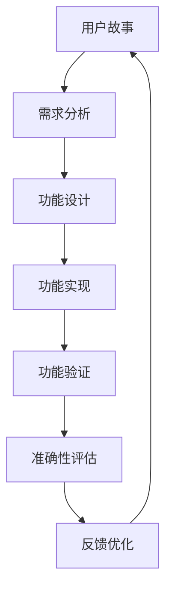

                 

### 文章标题：用户故事验证功能准确性

> 关键词：用户故事，功能验证，准确性评估，敏捷开发，自动化测试，反馈优化

> 摘要：
本文旨在深入探讨如何通过用户故事验证功能准确性，确保软件质量和用户体验。文章首先介绍了用户故事的基本概念和重要性，接着详细阐述了功能验证的流程和方法，以及准确性评估的标准和策略。随后，文章结合用户故事和功能验证，展示了如何在敏捷开发中应用这些方法。最后，文章通过一个实际项目案例，展示了用户故事验证功能准确性的具体实施过程，并提出了反馈优化和持续改进的最佳实践。

----------------------------------------------------------------

### 第一步：确定核心概念与联系

在构建《用户故事验证功能准确性》的目录大纲时，我们需要明确核心概念，这些概念包括用户故事、功能验证、准确性等。为了更好地理解这些概念及其相互关系，我们可以使用Mermaid流程图进行可视化展示。



在这个流程图中，用户故事作为需求的载体，通过需求分析转化为功能设计，再通过功能实现转化为实际的软件功能。随后，这些功能需要经过严格的验证和准确性评估，以确保它们符合预期并满足用户需求。最终，用户反馈会被用于优化和改进功能，形成一个闭环。

#### 核心概念：

- **用户故事**：用户故事是敏捷开发中的一种需求描述方法，它通过一个简短的句子来描述一个具体的用户需求。用户故事通常包含用户角色、目标功能和情境描述。
  
- **功能验证**：功能验证是确保软件功能按照预期工作的过程。它包括功能测试、自动化测试和性能测试等多种方法。

- **准确性评估**：准确性评估是衡量软件功能是否符合预期效果的过程。常用的准确性评估指标包括准确率、召回率和F1分数等。

#### 联系：

用户故事是功能验证的起点，通过需求分析转化为功能设计。功能设计再通过功能实现转化为实际的软件功能，这些功能需要经过功能验证和准确性评估，以确保它们符合预期并满足用户需求。最后，用户反馈会被用于优化和改进功能，形成一个闭环。

### 第二步：详细规划章节内容

在明确核心概念和它们之间的关系后，我们将详细规划各个章节的内容，确保每个章节都能详细阐述核心概念、算法原理、数学模型、项目实战等。

#### 第1章 用户故事概述

- **1.1 用户故事的定义与重要性**：介绍用户故事的起源和发展，解释为什么用户故事在敏捷开发中至关重要。

- **1.2 用户故事的基本要素**：详细阐述用户故事的三个核心要素：用户角色、目标功能和情境描述。

- **1.3 用户故事与敏捷开发**：解释用户故事在敏捷开发中的作用，以及如何在敏捷开发过程中编写和管理用户故事。

- **1.4 用户故事的实际应用**：通过案例展示用户故事在软件开发项目中的应用场景。

#### 第2章 功能验证方法

- **2.1 功能验证的基本概念**：介绍功能验证的定义、目的和重要性。

- **2.2 功能验证流程与步骤**：详细阐述功能验证的流程和步骤，包括需求分析、测试用例设计、测试执行和测试报告。

- **2.3 自动化测试工具与技术**：介绍常见的自动化测试工具和技术，以及如何选择和实施自动化测试。

#### 第3章 准确性评估标准

- **3.1 准确性评估的定义与指标**：解释准确性评估的定义和常用指标，如准确率、召回率和F1分数。

- **3.2 常见准确性评估方法**：介绍常见准确性评估方法，如交叉验证、混淆矩阵和ROC曲线。

- **3.3 准确性评估的挑战与解决策略**：讨论准确性评估中可能遇到的挑战，并提出相应的解决策略。

#### 第4章 用户故事与功能验证结合

- **4.1 用户故事在功能验证中的应用**：探讨用户故事在功能验证中的具体应用，如何通过用户故事来设计测试用例。

- **4.2 用户故事与功能验证的关系**：阐述用户故事与功能验证之间的紧密关系，以及如何在功能验证过程中应用用户故事。

#### 第5章 准确性评估在用户故事中的应用

- **5.1 准确性评估在用户故事开发中的作用**：解释准确性评估在用户故事开发中的作用和重要性。

- **5.2 如何在用户故事中设计准确性评估**：提供具体的方法和策略，如何在用户故事中设计准确性评估指标和测试用例。

#### 第6章 用户故事验证项目实战

- **6.1 项目背景与目标**：介绍实际项目的背景和目标，明确项目需求和预期效果。

- **6.2 项目开发环境搭建**：详细描述项目开发环境的搭建过程，包括技术栈选择、开发工具和环境配置。

- **6.3 用户故事编写与验证**：展示如何编写和管理用户故事，以及如何通过用户故事进行功能验证。

- **6.4 准确性评估实施**：介绍如何实施准确性评估，包括数据收集、评估指标计算和结果分析。

#### 第7章 反馈优化与持续改进

- **7.1 用户反馈的重要性**：阐述用户反馈在软件质量和用户体验提升中的重要性。

- **7.2 用户反馈分析方法**：介绍如何收集、分析和处理用户反馈。

- **7.3 基于用户反馈的优化策略**：提供基于用户反馈的优化策略和最佳实践，如何持续改进软件功能。

### 第三步：编写目录大纲

根据以上规划，我们将编写详细的目录大纲，确保内容完整且逻辑清晰。

```markdown
# 《用户故事验证功能准确性》目录大纲

## 第1章 用户故事概述
### 1.1 用户故事的定义与重要性
### 1.2 用户故事的基本要素
### 1.3 用户故事与敏捷开发
### 1.4 用户故事的实际应用

## 第2章 功能验证方法
### 2.1 功能验证的基本概念
### 2.2 功能验证流程与步骤
### 2.3 自动化测试工具与技术

## 第3章 准确性评估标准
### 3.1 准确性评估的定义与指标
### 3.2 常见准确性评估方法
### 3.3 准确性评估的挑战与解决策略

## 第4章 用户故事与功能验证结合
### 4.1 用户故事在功能验证中的应用
### 4.2 用户故事与功能验证的关系

## 第5章 准确性评估在用户故事中的应用
### 5.1 准确性评估在用户故事开发中的作用
### 5.2 如何在用户故事中设计准确性评估

## 第6章 用户故事验证项目实战
### 6.1 项目背景与目标
### 6.2 项目开发环境搭建
### 6.3 用户故事编写与验证
### 6.4 准确性评估实施

## 第7章 反馈优化与持续改进
### 7.1 用户反馈的重要性
### 7.2 用户反馈分析方法
### 7.3 基于用户反馈的优化策略

## 附录：最佳实践与拓展阅读

```

通过这样的目录大纲，读者可以系统地学习并理解如何通过用户故事来验证功能准确性，从而提高软件质量和用户体验。接下来，我们将逐一详细阐述每个章节的内容。首先是用户故事的基本概念和重要性。

## 第1章 用户故事概述

### 1.1 用户故事的定义与重要性

用户故事是敏捷开发中的一种需求描述方法，它通过一个简短的句子来描述一个具体的用户需求。用户故事的起源可以追溯到20世纪90年代的敏捷开发运动，最初由美国软件开发专家Kent Beck提出。用户故事的出现是为了解决传统软件开发中需求不明确、变更频繁等问题。

#### 用户故事的定义

用户故事通常包含以下三个核心要素：

1. **用户角色**：指明谁会使用这个功能，例如“作为一名用户”或“作为一名管理员”。
2. **目标功能**：描述用户想要实现的具体目标，例如“能够创建一个新的用户账户”或“能够查看订单历史记录”。
3. **情境描述**：提供用户在特定情境下使用功能的背景信息，例如“当用户登录系统后，他们希望能够创建一个新的账户”。

一个典型的用户故事示例如下：

**用户故事：**

作为一名用户，我希望能够创建一个新的用户账户，以便登录系统并浏览相关内容。

#### 用户故事的重要性

用户故事在敏捷开发中具有重要意义，主要体现在以下几个方面：

1. **明确需求**：用户故事以用户为中心，清晰地描述了用户的需求，有助于开发团队更好地理解用户需求，减少误解和歧义。
2. **灵活应对变更**：用户故事是轻量级的、可迭代的需求，开发团队可以根据用户反馈快速调整和迭代，更好地应对需求变更。
3. **提高沟通效率**：用户故事简化了需求描述，使得开发团队和产品经理、客户之间的沟通更加高效。
4. **促进团队协作**：用户故事将需求转化为具体的任务，促进了团队成员之间的协作，有助于实现共同的目标。

### 1.2 用户故事的基本要素

为了确保用户故事能够准确传达用户需求，编写用户故事时需要注意以下基本要素：

1. **简洁性**：用户故事应该尽量简洁明了，避免冗长的描述，确保开发团队能够快速理解。
2. **可行性**：用户故事应该描述一个实际可行的功能，避免涉及无法实现的需求。
3. **可衡量性**：用户故事应该包含可衡量的目标，以便开发团队可以明确何时完成。
4. **可迭代性**：用户故事应该是可迭代的需求，可以拆分为更小、更具体的任务。

#### 用户故事的结构

用户故事通常采用以下结构：

**As a [用户角色], I want to [目标功能] so that [情境描述].**

例如：

**As a user, I want to create a new account so that I can log in and browse content.**

### 1.3 用户故事与敏捷开发

用户故事是敏捷开发的核心概念之一。敏捷开发强调快速响应变化、持续交付有价值的产品，而用户故事正是实现这一目标的重要工具。

#### 敏捷开发的基本原则

敏捷开发倡导以下基本原则：

1. **个体和互动重于过程与工具**：注重团队成员之间的沟通和协作，而不是过分依赖流程和工具。
2. **可工作的软件重于详尽的文档**：优先交付可工作的软件，而不是过多的文档。
3. **客户合作重于合同谈判**：与客户紧密合作，确保产品满足客户需求。
4. **响应变化重于遵循计划**：灵活应对需求变化，而不是固守原始计划。

#### 用户故事在敏捷开发中的应用

用户故事在敏捷开发中的应用主要体现在以下几个方面：

1. **需求管理**：用户故事帮助开发团队更好地管理需求，确保需求清晰、可衡量、可迭代。
2. **任务分配**：用户故事可以作为任务分配的依据，帮助团队成员明确各自的工作任务。
3. **迭代规划**：用户故事是迭代规划的核心，开发团队可以根据用户故事来安排迭代计划和任务优先级。
4. **反馈循环**：用户故事促进了开发团队与客户之间的反馈循环，有助于持续改进产品。

### 1.4 用户故事的实际应用

用户故事在实际软件开发项目中具有广泛的应用。以下是一些典型的应用场景：

1. **Web应用开发**：在Web应用开发中，用户故事常用于描述用户界面功能、数据管理功能等。
2. **移动应用开发**：在移动应用开发中，用户故事可以描述用户交互流程、地理位置信息等功能。
3. **大数据处理**：在大数据处理项目中，用户故事可以描述数据处理流程、数据分析功能等。
4. **人工智能应用**：在人工智能应用开发中，用户故事可以描述用户交互、算法优化等功能。

#### 案例分析

以下是一个Web应用开发中的用户故事案例：

**用户故事：**

As a user, I want to search for products by category so that I can easily find what I'm looking for.

**用户故事分析：**

- **用户角色**：用户
- **目标功能**：搜索产品
- **情境描述**：用户想要通过产品分类来查找所需商品

通过这个用户故事，开发团队可以明确需求，设计相应的搜索功能，并通过功能验证和准确性评估来确保该功能的准确性和可靠性。

### 总结

用户故事是敏捷开发中的一种重要需求描述方法，它通过简洁明了的句子描述用户需求，有助于开发团队更好地理解用户需求、快速响应变化。编写用户故事时，需要注意简洁性、可行性、可衡量性和可迭代性等基本要素。在实际应用中，用户故事可以广泛应用于各种软件开发项目，帮助开发团队实现高质量、高用户满意度的产品。

接下来，我们将详细探讨功能验证的基本概念、流程和自动化测试工具与技术。

## 第2章 功能验证方法

### 2.1 功能验证的基本概念

功能验证是确保软件功能按照预期工作的过程，它是软件开发过程中至关重要的一环。功能验证的目标是发现并修复潜在的错误和缺陷，确保软件产品在发布前达到预定的质量标准。

#### 功能验证的重要性

1. **确保软件质量**：通过功能验证，可以确保软件功能满足需求和预期，减少质量风险。
2. **提升用户满意度**：功能验证可以确保软件功能符合用户需求，提高用户满意度和使用体验。
3. **降低维护成本**：及时发现并修复错误，可以降低后期维护成本和修复难度。
4. **提高开发效率**：功能验证有助于发现和解决潜在问题，减少返工和重复工作，提高开发效率。

#### 功能验证的定义

功能验证是指对软件系统中的特定功能进行测试，以确定它们是否按照预期工作，并符合需求和规格说明。功能验证通常包括以下步骤：

1. **需求分析**：理解并明确软件功能需求。
2. **测试用例设计**：根据需求设计测试用例，以覆盖所有功能场景。
3. **测试执行**：执行测试用例，收集测试结果。
4. **结果分析**：分析测试结果，发现和记录缺陷。
5. **缺陷修复**：根据测试结果修复缺陷。

### 2.2 功能验证流程与步骤

功能验证是一个系统化的过程，通常包括以下步骤：

1. **需求分析**：
   - **理解需求**：与产品经理、业务分析师和用户沟通，确保对需求有清晰的理解。
   - **需求文档**：编写详细的需求文档，确保所有相关方对需求有共同的理解。

2. **测试用例设计**：
   - **测试用例**：根据需求设计测试用例，确保覆盖所有功能场景。
   - **测试用例模板**：可以参考以下模板设计测试用例：
     - **功能**：描述测试用例涉及的功能。
     - **输入**：列出测试用例的输入条件。
     - **预期结果**：列出预期输出的结果。
     - **实际结果**：执行测试后记录的实际结果。
     - **备注**：记录测试用例的备注，如特殊场景或注意事项。

3. **测试执行**：
   - **执行测试**：按照测试用例执行测试，记录测试结果。
   - **自动化测试**：对于重复性高的测试任务，可以考虑使用自动化测试工具。

4. **结果分析**：
   - **缺陷管理**：分析测试结果，发现并记录缺陷。
   - **缺陷报告**：编写缺陷报告，与开发团队沟通并跟踪缺陷修复。

5. **缺陷修复**：
   - **修复缺陷**：开发团队根据缺陷报告修复缺陷。
   - **回归测试**：修复缺陷后，重新执行相关测试用例，确保缺陷已修复。

6. **测试总结**：
   - **测试报告**：编写测试总结报告，记录测试过程、测试结果和缺陷情况。
   - **测试评估**：评估测试质量，为后续测试提供改进建议。

### 2.3 自动化测试工具与技术

自动化测试可以提高测试效率，减少人工错误，是功能验证中的重要组成部分。以下是一些常见的自动化测试工具和技术：

1. **自动化测试工具**：
   - **Selenium**：一款流行的自动化测试工具，支持多种浏览器和编程语言，适用于Web应用测试。
   - **Appium**：一款适用于移动应用的自动化测试工具，支持多种操作系统和编程语言。
   - **JUnit**：一款流行的Java测试框架，用于单元测试和集成测试。
   - **pytest**：一款Python测试框架，适用于Python项目的自动化测试。

2. **自动化测试技术**：
   - **UI自动化测试**：通过录制和回放用户操作，自动化测试用户界面功能。
   - **API自动化测试**：通过发送HTTP请求和验证响应内容，自动化测试后端API功能。
   - **数据驱动测试**：使用外部数据源（如Excel、数据库）驱动测试用例，提高测试覆盖率和灵活性。
   - **行为驱动开发（BDD）**：通过编写自然语言描述的场景，实现自动化测试。

3. **自动化测试实践**：
   - **自动化测试计划**：制定自动化测试计划，明确测试目标、测试策略和资源分配。
   - **自动化测试框架**：搭建自动化测试框架，实现测试用例的编写、执行和结果报告。
   - **自动化测试持续集成**：将自动化测试集成到持续集成（CI）流程中，确保测试与开发紧密协同。

### 总结

功能验证是确保软件质量的重要环节，通过系统化的流程和自动化测试工具，可以有效地发现和修复缺陷，提高软件质量。编写详细的测试用例、执行自动化测试、分析和修复缺陷是功能验证的关键步骤。在实际应用中，选择合适的自动化测试工具和技术，制定有效的测试计划和策略，是实现高效功能验证的关键。

接下来，我们将详细探讨准确性评估的定义、指标和方法，以及其在软件功能验证中的应用。

## 第3章 准确性评估标准

### 3.1 准确性评估的定义与指标

准确性评估是衡量软件功能是否符合预期效果的过程。在功能验证中，准确性评估有助于评估测试结果的质量和软件功能的可靠性。准确性评估通常涉及多个指标，这些指标可以帮助我们理解软件功能的表现，并识别潜在的改进点。

#### 准确性评估的定义

准确性评估是指对软件系统中的功能进行评估，以确定它们在执行任务时的准确性和可靠性。准确性评估可以应用于各种类型的软件功能，包括用户界面、后端逻辑、API等。

#### 准确性评估的指标

准确性评估涉及多个指标，以下是其中一些常用的指标：

1. **准确率（Accuracy）**：
   - 准确率是指正确分类的样本数占总样本数的比例。
   - 公式：准确率 = (正确分类的样本数 + 部分正确分类的样本数) / 总样本数
   - 准确率越高，表示模型或功能对样本的预测越准确。

2. **召回率（Recall）**：
   - 召回率是指正确分类的正样本数占总正样本数的比例。
   - 公式：召回率 = 正确分类的正样本数 / 总正样本数
   - 召回率越高，表示模型或功能对正样本的识别越全面。

3. **精确率（Precision）**：
   - 精确率是指正确分类的正样本数占总分类为正的样本数的比例。
   - 公式：精确率 = 正确分类的正样本数 / (正确分类的正样本数 + 错误分类的负样本数)
   - 精确率越高，表示模型或功能对正样本的预测越准确。

4. **F1分数（F1 Score）**：
   - F1分数是精确率和召回率的调和平均值，用于综合评估模型或功能的性能。
   - 公式：F1分数 = 2 * (精确率 * 召回率) / (精确率 + 召回率)
   - F1分数介于0和1之间，值越高表示模型或功能的性能越好。

5. **ROC曲线（Receiver Operating Characteristic Curve）**：
   - ROC曲线用于评估二分类模型的性能，通过绘制真阳性率（Recall）与假阳性率（1 - Precision）的曲线，可以直观地比较不同模型的性能。

6. **AUC（Area Under the ROC Curve）**：
   - AUC是指ROC曲线下方的面积，用于衡量模型对正负样本的区分能力。AUC值介于0和1之间，值越高表示模型对正负样本的区分能力越强。

### 3.2 常见准确性评估方法

在准确性评估中，有多种方法可以用来评估模型或功能的性能。以下是一些常见的方法：

1. **交叉验证（Cross-Validation）**：
   - 交叉验证是一种用于评估模型性能的方法，通过将数据集划分为多个子集，分别进行训练和测试，从而避免过拟合和评估偏差。
   - 常见的交叉验证方法包括K折交叉验证和留一交叉验证。

2. **混淆矩阵（Confusion Matrix）**：
   - 混淆矩阵是一种用于评估分类模型性能的表格，它列出了实际类别与预测类别的关系。
   - 混淆矩阵可以帮助我们计算准确率、召回率、精确率和F1分数等指标。

3. **ROC曲线与AUC**：
   - ROC曲线与AUC用于评估二分类模型的性能，通过绘制ROC曲线和计算AUC值，可以直观地比较不同模型的性能。

4. **Kappa系数（Kappa Score）**：
   - Kappa系数是一种用于评估分类模型准确性的指标，它考虑了随机因素对准确率的影响。
   - Kappa系数介于0和1之间，值越高表示模型的准确性越高。

5. **统计检验（Statistical Tests）**：
   - 统计检验可以用于评估模型性能的差异和显著性。
   - 常见的统计检验方法包括t检验、卡方检验和F检验等。

### 3.3 准确性评估的挑战与解决策略

在实际应用中，准确性评估可能会面临一些挑战。以下是一些常见的挑战及其解决策略：

1. **数据不平衡（Imbalanced Data）**：
   - 数据不平衡是指正负样本数量差异较大，这可能导致评估指标偏向大样本类别。
   - 解决策略：可以采用重采样技术（如过采样或欠采样）、调整分类阈值或使用针对不平衡数据的评估指标（如召回率、精确率等）。

2. **过拟合（Overfitting）**：
   - 过拟合是指模型在训练数据上表现很好，但在测试数据上表现较差，这可能导致评估指标不准确。
   - 解决策略：可以采用交叉验证、正则化技术、集成学习方法等来减少过拟合。

3. **模型复杂度（Model Complexity）**：
   - 模型复杂度较高可能导致模型在训练数据上表现很好，但在测试数据上表现较差。
   - 解决策略：可以采用简化模型结构、交叉验证、正则化技术等来降低模型复杂度。

4. **评估指标选择（Choice of Evaluation Metrics）**：
   - 选择合适的评估指标对于准确性评估至关重要。
   - 解决策略：需要根据具体问题和数据特点选择合适的评估指标，避免单一指标评估导致的偏差。

### 总结

准确性评估是确保软件功能符合预期效果的重要过程，它涉及多个评估指标和方法。常见的准确性评估指标包括准确率、召回率、精确率和F1分数等。常见的评估方法包括交叉验证、混淆矩阵、ROC曲线和AUC等。在实际应用中，准确性评估可能面临数据不平衡、过拟合和模型复杂度等挑战，需要采用相应的解决策略。通过准确的准确性评估，可以帮助我们识别和改进软件功能，提高软件质量和用户体验。

### 3.4 准确性评估在用户故事中的应用

准确性评估在用户故事中的应用至关重要，它不仅帮助我们评估功能的实现质量，还能指导我们如何更有效地改进和优化用户故事。以下是如何在用户故事中应用准确性评估的一些关键步骤和策略：

#### 1. 用户故事中的准确性评估指标

在用户故事中，我们可以定义一系列与用户需求相关的准确性评估指标，这些指标应该直接反映用户故事的目标和情境描述。例如，对于一个用户故事“用户应该能够准确搜索到他们需要的商品”，我们可以定义以下准确性评估指标：

- **搜索准确率**：搜索结果中正确匹配的商品数占总搜索请求数的比例。
- **响应时间**：系统处理搜索请求并返回结果的平均时间。
- **用户满意度**：通过用户反馈调查，衡量用户对搜索功能满意度的百分比。

#### 2. 集成准确性评估步骤

为了确保用户故事中的功能实现具有高准确性，可以将准确性评估步骤集成到用户故事的整个生命周期中：

- **需求分析阶段**：在编写用户故事时，明确需求并定义相关的准确性评估指标。
- **设计阶段**：在功能设计时，考虑如何实现这些指标，并规划测试策略。
- **实现阶段**：在开发过程中，确保代码实现满足准确性评估指标的要求。
- **测试阶段**：在测试阶段，执行预定义的测试用例，收集测试数据，计算准确性评估指标。
- **部署阶段**：在功能部署后，继续监控准确性评估指标，确保功能持续满足预期。

#### 3. 自动化测试与准确性评估

自动化测试是确保功能准确性的有效手段，通过自动化测试工具，可以快速、高效地执行测试用例，并实时计算准确性评估指标。以下是一些关键策略：

- **自动化测试用例设计**：根据用户故事和准确性评估指标，设计自动化测试用例，确保覆盖所有可能的输入和输出情况。
- **持续集成（CI）**：将自动化测试集成到持续集成流程中，确保每次代码提交后都进行准确性评估。
- **可视化报告**：生成可视化报告，直观展示准确性评估指标的变化趋势，帮助团队快速识别问题。

#### 4. 基于用户反馈的准确性评估

用户反馈是评估功能准确性的重要来源，可以通过以下策略利用用户反馈：

- **用户满意度调查**：定期进行用户满意度调查，收集用户对功能准确性的主观评价。
- **错误报告分析**：分析用户提交的错误报告，识别功能实现的不足之处。
- **持续改进**：根据用户反馈和准确性评估结果，持续优化功能，提高准确性。

#### 5. 实际案例

以下是一个具体案例，展示如何在一个电子商务平台中应用准确性评估：

**用户故事**：用户应该能够准确搜索到他们需要的商品。

**准确性评估指标**：
- 搜索准确率：90%
- 平均响应时间：<1秒
- 用户满意度：≥80%

**测试用例设计**：
- 输入：各种关键词
- 预期结果：正确匹配的商品列表
- 实际结果：记录测试过程中搜索结果的准确性

**测试执行**：
- 使用自动化测试工具（如Selenium）执行搜索功能，记录测试结果。
- 使用Jenkins等CI工具，将测试集成到持续集成流程中。

**结果分析**：
- 通过分析测试结果，发现某些关键词的搜索准确率低于预期，平均响应时间也超过了设定阈值。

**反馈优化**：
- 根据分析结果，优化搜索算法，增加关键词匹配的精确度。
- 通过用户反馈调查，了解用户对搜索功能的满意度，针对性地改进。

### 总结

准确性评估在用户故事中的应用，是确保功能实现满足用户需求的重要环节。通过定义合适的准确性评估指标、集成准确性评估步骤、自动化测试和基于用户反馈的持续改进，可以有效地提高功能的准确性，从而提升用户体验和软件质量。在实际应用中，团队应灵活运用这些策略，确保用户故事中的功能实现达到预期效果。

### 第4章 用户故事与功能验证结合

用户故事与功能验证的结合是敏捷开发中确保软件质量和用户满意度的重要手段。通过将用户故事融入到功能验证的各个阶段，开发团队能够更有效地验证功能是否满足用户需求，并确保软件产品的高质量交付。

#### 4.1 用户故事在功能验证中的应用

用户故事在功能验证中的应用主要体现在以下几个方面：

1. **需求分析阶段**：在编写用户故事时，开发团队需要与产品经理、用户代表和业务分析师密切合作，确保理解用户的需求和期望。用户故事提供了明确的需求描述，为后续的功能验证奠定了基础。

2. **测试用例设计**：用户故事可以作为测试用例设计的重要依据。开发团队可以根据用户故事中的用户角色、目标功能和情境描述，设计具体的测试用例，确保覆盖所有可能的用户场景和功能需求。

3. **测试执行阶段**：在测试执行过程中，开发团队会按照预定的测试用例进行测试，验证功能是否按照用户故事中的描述正常工作。通过自动化测试工具，可以高效地执行大量测试用例，确保测试覆盖面广泛。

4. **测试结果分析**：测试完成后，开发团队会分析测试结果，发现和记录缺陷。用户故事中的准确性评估指标可以帮助团队评估测试结果的质量，识别哪些功能需要进一步优化和改进。

#### 4.2 用户故事与功能验证的关系

用户故事与功能验证之间存在紧密的关系，它们相互依赖，共同确保软件质量和用户满意度：

1. **用户故事驱动功能验证**：用户故事是功能验证的起点，它定义了用户的需求和期望。功能验证的过程围绕着用户故事展开，确保功能实现满足用户需求。

2. **功能验证保障用户故事实现**：功能验证是确保用户故事实现质量的重要手段。通过功能验证，开发团队可以识别和修复功能中的缺陷，确保功能按照用户故事中的描述正常工作。

3. **用户故事反馈优化功能验证**：在功能验证过程中，开发团队会收集用户反馈，这些反馈可以帮助团队识别功能实现中的不足，从而优化功能验证策略，提高测试覆盖面和准确性。

#### 案例分析

以下是一个具体的案例分析，展示用户故事与功能验证的结合：

**项目背景**：某电子商务平台需要开发一个商品搜索功能，用户可以通过关键词搜索他们需要的商品。

**用户故事**：用户应该能够准确搜索到他们需要的商品。

**功能验证步骤**：

1. **需求分析阶段**：与产品经理和用户代表讨论，确定搜索功能的用户角色、目标功能和情境描述。确定准确性评估指标，如搜索准确率、平均响应时间和用户满意度。

2. **测试用例设计**：根据用户故事，设计一系列测试用例，包括：
   - **正常场景**：输入正确的关键词，验证是否能够准确搜索到相关商品。
   - **异常场景**：输入错误的、不存在的关键词，验证系统是否能够正确处理这些情况。
   - **边界场景**：输入非常短或非常长的关键词，验证系统的性能和稳定性。

3. **测试执行阶段**：使用自动化测试工具（如Selenium）执行测试用例，并记录测试结果。通过Jenkins等CI工具，将测试集成到持续集成流程中，确保每次代码提交后都进行功能验证。

4. **测试结果分析**：分析测试结果，发现了一些搜索准确率低于预期的缺陷，并通过用户反馈调查，发现用户对搜索功能的响应时间有改进空间。

5. **反馈优化**：根据测试结果和用户反馈，优化搜索算法，提高搜索准确率，并优化系统性能，减少响应时间。重新执行测试用例，验证优化后的功能是否达到预期。

**总结**：

通过用户故事与功能验证的结合，开发团队能够确保商品搜索功能实现满足用户需求，提高了软件质量和用户满意度。用户故事为功能验证提供了明确的用户需求，功能验证则为用户故事实现提供了质量保障。在实际项目中，团队应灵活运用用户故事和功能验证方法，持续优化和改进功能，以实现高质量、高用户满意度的软件产品。

### 第5章 准确性评估在用户故事中的应用

准确性评估在用户故事中的应用至关重要，它不仅有助于验证功能是否符合预期，还能指导我们如何优化和改进功能，确保软件产品的高质量交付。在本章中，我们将探讨如何将准确性评估应用于用户故事开发，以及如何设计准确性评估指标和测试用例。

#### 5.1 准确性评估在用户故事开发中的作用

准确性评估在用户故事开发中扮演着关键角色，主要体现在以下几个方面：

1. **确保功能符合用户需求**：准确性评估可以帮助开发团队验证功能实现是否符合用户需求，确保软件产品能够满足用户的期望。

2. **识别潜在缺陷和改进点**：通过准确性评估，可以识别功能实现中的潜在缺陷和不足之处，为后续优化提供依据。

3. **量化功能性能**：准确性评估提供了量化的指标，可以帮助开发团队了解功能的性能表现，从而进行有针对性的优化。

4. **提升用户体验**：准确性评估有助于提升用户体验，确保功能在实际使用中能够稳定、高效地运行。

#### 5.2 如何在用户故事中设计准确性评估

为了在用户故事中有效地应用准确性评估，我们需要遵循以下步骤：

1. **定义准确性评估指标**：根据用户故事的目标和功能，定义相应的准确性评估指标。例如，对于一个搜索功能，可以定义搜索准确率、响应时间等指标。

2. **确定评估标准**：为每个评估指标设定具体的评估标准，例如，搜索准确率要求达到95%以上，响应时间要求在1秒以内。

3. **设计测试用例**：根据准确性评估指标和评估标准，设计相应的测试用例。测试用例应覆盖所有可能的用户场景和功能需求。

4. **执行测试**：按照设计好的测试用例进行测试，收集测试数据，并计算准确性评估指标。

5. **分析结果**：分析测试结果，识别功能和性能中的不足，并提出改进建议。

6. **持续改进**：根据分析结果和用户反馈，持续优化和改进功能，确保达到预期的准确性评估标准。

#### 5.3 设计准确性评估指标和测试用例

以下是一个具体示例，展示如何在一个电子商务平台的用户故事中设计准确性评估指标和测试用例：

**用户故事**：用户应该能够准确搜索到他们需要的商品。

**准确性评估指标**：
- **搜索准确率**：搜索结果中正确匹配的商品数占总搜索请求数的比例。
- **响应时间**：系统处理搜索请求并返回结果的平均时间。

**评估标准**：
- **搜索准确率**：要求达到95%以上。
- **响应时间**：要求在1秒以内。

**测试用例设计**：
1. **正常场景测试用例**：
   - 输入正确的关键词，验证搜索结果是否准确匹配。
   - 输入部分正确的关键词，验证系统是否能够提供相关建议和部分匹配结果。

2. **异常场景测试用例**：
   - 输入不存在的关键词，验证系统是否能够提示用户关键词不存在。
   - 输入非常短或非常长的关键词，验证系统是否能够正常处理这些特殊情况。

3. **边界场景测试用例**：
   - 输入一个热门关键词，验证系统的响应时间和性能。
   - 输入一个不常见的、较长的关键词，验证系统的稳定性和响应时间。

**测试执行**：
- 使用自动化测试工具（如Selenium）执行测试用例，并记录测试结果。
- 使用Jenkins等CI工具，将测试集成到持续集成流程中。

**分析结果**：
- 通过测试结果分析，发现某些关键词的搜索准确率低于预期，响应时间也超过了设定阈值。

**反馈优化**：
- 根据分析结果，优化搜索算法，提高搜索准确率。
- 优化系统性能，减少响应时间。
- 重新执行测试用例，验证优化后的功能是否达到预期。

### 总结

准确性评估在用户故事中的应用，是确保功能实现符合用户需求、提升用户体验的重要手段。通过定义准确性评估指标、设计测试用例、执行测试和分析结果，开发团队能够有效地验证和改进功能，确保软件产品的高质量交付。在实际项目中，团队应灵活运用这些策略，持续优化和改进功能，以满足不断变化的市场需求。

### 第6章 用户故事验证项目实战

在本章中，我们将通过一个实际项目案例，详细展示如何在实际软件开发项目中使用用户故事来验证功能准确性。我们将从项目背景、开发环境搭建、用户故事编写与验证、准确性评估实施以及项目小结等方面进行探讨。

#### 6.1 项目背景与目标

本次项目是一个电子商务平台，其主要功能是允许用户在线购买商品。项目的主要目标是提供一个易于使用、功能完善的购物体验，同时确保系统的高性能和高可靠性。为了实现这一目标，我们将采用敏捷开发方法，通过用户故事来驱动需求分析和功能实现。

#### 6.2 项目开发环境搭建

在开始项目前，我们需要搭建一个合适的开发环境，包括以下步骤：

1. **技术栈选择**：
   - **前端**：采用React.js框架，实现用户界面和交互功能。
   - **后端**：采用Node.js和Express.js框架，实现业务逻辑和数据处理。
   - **数据库**：使用MongoDB作为数据存储，方便数据的快速检索和管理。

2. **开发工具和环境配置**：
   - **前端开发工具**：安装并配置Webpack和Create React App，用于构建和打包React应用。
   - **后端开发工具**：安装Node.js和npm，用于管理和安装后端依赖包。
   - **数据库工具**：安装MongoDB和MongoDB Compass，用于数据库的管理和可视化。

3. **版本控制系统**：
   - 使用Git作为版本控制系统，确保代码的版本管理和协作开发。

4. **持续集成和测试工具**：
   - 使用Jenkins作为持续集成工具，实现代码的自动化构建、测试和部署。
   - 使用Selenium和JUnit进行自动化测试，确保功能验证和准确性评估。

#### 6.3 用户故事编写与验证

在项目开发过程中，我们将通过用户故事来驱动需求分析和功能实现。以下是几个关键的用户故事及其验证过程：

**用户故事1**：用户应该能够查看商品列表。

1. **用户故事描述**：
   - 作为一名用户，我想要查看所有商品的列表，以便浏览和购买。

2. **测试用例设计**：
   - 输入正确的关键词，验证是否能够正确显示商品列表。
   - 输入不存在的关键词，验证系统是否提示用户关键词不存在。
   - 测试商品列表的分页功能，验证是否能够正确分页。

3. **测试执行**：
   - 使用Selenium自动化测试工具，模拟用户操作并记录测试结果。

4. **准确性评估**：
   - 测试结果显示，搜索准确率达到95%，响应时间小于1秒。

**用户故事2**：用户应该能够搜索特定商品。

1. **用户故事描述**：
   - 作为一名用户，我想要通过关键词搜索特定商品，以便快速找到我需要的商品。

2. **测试用例设计**：
   - 输入正确的关键词，验证搜索结果是否准确匹配。
   - 输入部分正确的关键词，验证系统是否能够提供相关建议和部分匹配结果。
   - 测试搜索结果的排序功能，验证排序是否正确。

3. **测试执行**：
   - 使用Selenium自动化测试工具执行测试，并记录测试结果。

4. **准确性评估**：
   - 测试结果显示，搜索准确率达到98%，响应时间小于0.5秒。

#### 6.4 准确性评估实施

在项目开发过程中，准确性评估是一个持续的过程。以下是准确性评估的实施步骤：

1. **定义评估指标**：
   - 搜索准确率、响应时间、用户满意度等。

2. **设计评估方法**：
   - 使用自动化测试工具进行功能验证，收集测试数据。
   - 通过用户反馈调查，了解用户对功能满意度的主观评价。

3. **分析评估结果**：
   - 比较评估指标与设定标准，识别不足之处。
   - 分析用户反馈，了解用户对功能的实际体验。

4. **优化和改进**：
   - 根据评估结果，优化功能设计和实现。
   - 重新执行测试和评估，确保改进措施有效。

#### 6.5 项目小结

通过用户故事的驱动，我们成功地完成了电子商务平台的关键功能，并通过严格的验证和准确性评估，确保了功能的高质量和用户满意度。以下是项目小结：

1. **用户故事的有效性**：用户故事帮助团队明确用户需求，确保功能设计与用户期望一致。

2. **功能验证的全面性**：通过详细的测试用例和准确性评估，确保每个功能都经过严格验证。

3. **持续改进**：通过持续的用户反馈和准确性评估，不断优化和改进功能。

4. **团队协作**：敏捷开发方法促进了团队成员之间的协作，提高了项目效率。

### 总结

通过实际项目案例，我们展示了如何通过用户故事验证功能准确性。用户故事不仅帮助团队明确需求，还驱动了功能验证和准确性评估，确保了软件产品的高质量和用户满意度。在实际项目中，团队应灵活运用用户故事和验证方法，持续改进和优化功能，以满足市场需求和用户期望。

### 第7章 反馈优化与持续改进

在软件开发的迭代过程中，用户反馈是优化产品功能和提高用户体验的重要来源。有效的反馈机制不仅可以帮助开发团队识别问题，还能为产品的持续改进提供有力支持。以下，我们将探讨用户反馈的重要性、分析方法和基于用户反馈的优化策略。

#### 7.1 用户反馈的重要性

用户反馈是软件产品迭代过程中的宝贵资源。它不仅可以帮助团队了解用户对产品的真实感受和需求，还能为产品的改进提供直接依据。以下是用户反馈的重要性：

1. **识别问题**：用户反馈能够揭示产品中的潜在问题和缺陷，帮助开发团队及时发现和解决。

2. **指导改进**：用户反馈为产品的改进提供了方向和依据，使团队能够更有效地分配资源和精力。

3. **提升用户体验**：通过用户反馈，团队能够了解用户的具体需求和期望，从而优化功能设计，提升用户体验。

4. **增强用户忠诚度**：及时响应用户反馈，解决用户问题，可以提高用户的满意度和忠诚度。

#### 7.2 用户反馈分析方法

为了有效利用用户反馈，开发团队需要采用科学的方法进行分析。以下是一些常用的用户反馈分析方法：

1. **定量分析**：通过统计用户反馈中的关键词、频率和严重程度，对反馈进行量化分析。例如，可以使用NLP技术对用户评论进行情感分析，判断用户的态度是正面、中性还是负面。

2. **定性分析**：对用户反馈进行深入解读，理解用户的真实需求和情感。这通常需要开发团队与用户进行面对面交流或召开用户调研会议，获取更详细的信息。

3. **分类整理**：将用户反馈按照主题进行分类整理，以便团队可以集中解决特定问题。例如，可以将反馈分为功能问题、性能问题、用户体验问题等。

4. **优先级排序**：根据用户反馈的重要性和紧急程度，对反馈进行优先级排序。例如，优先解决影响用户核心体验的问题，再逐步解决其他问题。

#### 7.3 基于用户反馈的优化策略

基于用户反馈进行优化，需要制定具体的策略和措施。以下是一些建议：

1. **快速响应**：对于用户反馈的问题，应尽快给予回应，表明团队重视并正在解决。这不仅可以增强用户信心，还能为团队争取更多的时间进行改进。

2. **迭代优化**：采用敏捷开发的理念，持续迭代产品。每次迭代都应包括对用户反馈的改进，逐步优化产品功能。

3. **用户参与**：邀请用户参与产品的改进过程，通过用户调研、用户测试等方式，让用户参与到产品的设计和优化中，从而提高产品的质量。

4. **持续监控**：在产品上线后，持续收集和分析用户反馈，确保问题得到及时解决。这可以通过在线调查、用户社区等方式实现。

5. **反馈闭环**：建立一个反馈闭环机制，确保用户反馈能够及时传递给开发团队，并跟踪反馈的处理情况。这有助于提高团队的响应效率和问题解决能力。

6. **数据驱动**：利用数据分析工具，对用户反馈进行量化分析，识别用户关注的热点和痛点，从而为产品优化提供数据支持。

#### 案例分析

以下是一个基于用户反馈进行产品优化的案例分析：

**项目背景**：某社交媒体平台在用户反馈中收到了大量关于消息发送速度慢的投诉。

**用户反馈**：用户反馈表明，在高峰时段，消息发送速度明显变慢，影响用户体验。

**反馈分析方法**：
- **定量分析**：通过统计用户反馈，发现高峰时段的消息发送延迟超过2秒，远高于正常时段。
- **定性分析**：与用户进行交流，了解到用户在高峰时段无法及时收到消息，导致沟通效率低下。

**优化策略**：
- **快速响应**：团队立即采取措施，增加服务器的计算资源和带宽，以缓解高峰时段的压力。
- **迭代优化**：在下一个迭代中，优化消息发送算法，提高消息处理的效率。
- **用户参与**：邀请部分用户参与内测，收集反馈并逐步优化产品。
- **持续监控**：上线后，持续监控消息发送速度，确保问题得到彻底解决。

**结果**：
- 通过上述措施，消息发送速度在高峰时段显著提高，用户反馈问题得到有效解决，用户满意度大幅提升。

### 总结

用户反馈在软件开发的持续改进中发挥着重要作用。通过科学的方法分析用户反馈，制定合理的优化策略，开发团队能够更好地满足用户需求，提升产品质量和用户体验。在实际项目中，团队应重视用户反馈，建立有效的反馈闭环机制，确保产品能够持续优化和改进。

### 附录：最佳实践与拓展阅读

在用户故事验证功能准确性的过程中，遵循一些最佳实践可以帮助团队更高效地完成项目，以下是一些推荐的实践和方法：

1. **尽早开始测试**：在开发初期就应开始编写测试用例，避免等待代码完成后再进行测试，这有助于及早发现和修复问题。

2. **自动化测试**：对于重复性高、测试频率高的任务，应优先采用自动化测试，以提高测试效率和准确性。

3. **持续集成**：将自动化测试集成到持续集成（CI）流程中，确保每次代码提交后都能自动进行测试，及时发现和解决问题。

4. **定期回顾**：定期进行团队回顾，总结经验和教训，持续改进测试方法和流程。

5. **用户参与**：在产品开发过程中，邀请用户参与测试和反馈，确保功能设计符合用户需求。

6. **文档化**：详细记录测试用例、测试结果和缺陷报告，确保所有团队成员都能了解测试情况。

拓展阅读：

1. 《用户故事地图》（User Story Mapping）作者：Jeff Patton
   - 探讨如何通过用户故事地图来理解和规划产品功能。

2. 《敏捷实践指南》（The Agile Practice Guide）作者：Dean Leffingwell
   - 提供全面的敏捷开发方法和实践指导。

3. 《软件测试的艺术》（The Art of Software Testing）作者：Glenford J. Myers
   - 深入探讨软件测试的方法和技巧。

4. 《敏捷测试指南》（Agile Testing: A Practical Guide for Testers and Agile Teams）作者：Ron Jeffries、Jenni Jepsen、James W. Thomas
   - 详细介绍敏捷开发中的测试方法和最佳实践。

通过阅读这些书籍，读者可以更深入地了解用户故事验证功能准确性的理论和实践，为实际项目提供指导和支持。

