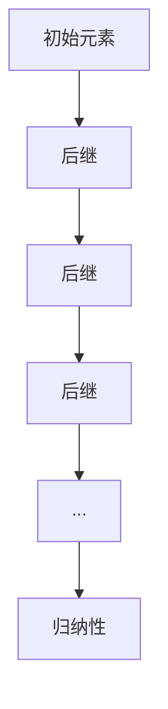

                 

### 引言

皮亚诺公理和程序归纳证明是计算机科学和数学领域中的两个重要概念。皮亚诺公理，由意大利数学家皮亚诺（Giuseppe Peano）提出，是自然数集合的一种基本性质，是现代数学和计算机科学中许多定理和算法的基石。而程序归纳证明，则是一种通过数学归纳法来证明程序正确性的方法，广泛应用于程序设计和软件工程中。

在本书中，我们将深入探讨皮亚诺公理在程序归纳证明中的应用。首先，我们将简要介绍皮亚诺公理的定义、性质和历史背景，帮助读者建立起对皮亚诺公理的基本理解。接着，我们将详细解释程序归纳证明的基本原理，包括其概念、步骤和伪代码展示，使读者能够掌握程序归纳证明的核心技术。

随后，我们将讨论皮亚诺公理如何与程序归纳证明相结合，通过数学模型和数学公式详细讲解其在程序归纳证明中的应用。这部分内容将涵盖皮亚诺公理在程序归纳证明中的应用步骤，以及如何通过数学推理和证明来确保程序的正确性。

为了使读者更好地理解皮亚诺公理在程序归纳证明中的应用，本书还将提供实际案例分析。我们将通过具体的案例，展示皮亚诺公理在程序归纳证明中的实际应用，详细解释案例中的代码实现和推理过程。

最后，在总结与展望部分，我们将对本书的主要内容进行总结，并展望皮亚诺公理在程序归纳证明中的应用前景。通过本书的学习，读者将能够深入理解皮亚诺公理和程序归纳证明的基本原理，掌握其在实际中的应用技巧，为未来的研究和实践奠定坚实的基础。

## 皮亚诺公理概述

### 皮亚诺公理的定义

皮亚诺公理（Peano axioms）是描述自然数集合（N）的基本性质的一组公理。这些公理由意大利数学家皮亚诺在19世纪末提出，是现代数学和计算机科学中的基础概念之一。皮亚诺公理为自然数提供了逻辑上的严格定义，并确保了自然数的各种性质能够被形式化地证明。

皮亚诺公理主要包括以下五个部分：

1. **存在一个自然数（通常表示为0或1）**。这个初始元素是自然数集合的基础。
2. **每个自然数都有一个后继**。即对于任意自然数n，存在一个唯一的后继数n'，使得n和n'组成一对相邻的自然数。通常，我们用n+1来表示n的后继。
3. **不存在除了初始元素和它的后继之外的其他自然数**。即不存在任何自然数n'，使得n'不是0或任何其他自然数的后继。
4. **归纳性**。如果某个性质P对于初始元素0成立，并且对于任意自然数n，如果P对于n成立，则P对于n+1也成立，那么P对于所有自然数都成立。
5. **一义性**。自然数的定义是唯一的，不存在其他等价或等效的集合可以表示自然数。

### 皮亚诺公理的性质

皮亚诺公理具有以下几个重要的性质：

1. **完备性**。皮亚诺公理能够描述自然数的所有基本性质，包括加法、乘法、比较、归纳等。
2. **独立性**。每个皮亚诺公理都是独立的，不能通过其他公理推导出来。这意味着如果去掉任何一个公理，自然数集合的基本性质将会变得不完整。
3. **一致性和可证明性**。皮亚诺公理与常见的数学直觉一致，并且可以通过形式化的逻辑系统进行证明。这使得皮亚诺公理成为构建数学体系的重要基石。

### 皮亚诺公理的历史背景

皮亚诺公理的提出背景与数学基础的变革密切相关。在19世纪末，数学家们开始关注数学基础的严密性，以避免像康托尔集合论引发的悖论和模糊性。皮亚诺公理的提出是这一时期的产物，它为自然数的定义提供了一种更加严密和一致的方法。

皮亚诺公理的提出不仅巩固了自然数的数学基础，还为后来的数学家和逻辑学家提供了一种形式化的方法来研究数学结构。特别是在计算机科学领域，皮亚诺公理的应用范围进一步扩展，成为编程语言、算法设计和形式验证的重要理论基础。

### 皮亚诺公理的基本概念和原理

为了更深入地理解皮亚诺公理，我们可以借助Mermaid流程图来展示其基本概念和原理。以下是一个简单的Mermaid流程图示例，用于描述皮亚诺公理的基本结构：



在这个流程图中，A表示初始元素（通常为0或1），B、C、D...表示每个自然数的后继。通过这个图，我们可以直观地看到自然数的递增关系。此外，F部分展示了归纳性，即如果某个性质P对于初始元素A成立，并且对于任意自然数n，如果P对于n成立，则P对于n+1也成立，那么P对于所有自然数都成立。

这个简单的Mermaid流程图帮助我们更好地理解皮亚诺公理的核心概念，并为后续章节的讨论奠定了基础。

## 程序归纳证明的基本原理

### 程序归纳证明的概念

程序归纳证明是一种通过数学归纳法来证明程序正确性的方法。其核心思想是通过证明程序对于初始情况成立，并且对于任意自然数n，如果程序对于n成立，则程序对于n+1也成立，从而证明程序对于所有自然数都成立。这种方法广泛应用于程序设计和软件工程中，能够有效地验证程序的逻辑正确性。

### 程序归纳证明的步骤

程序归纳证明通常包括以下几个步骤：

1. **基例验证**：证明程序在初始情况下（通常是最小值）是正确的。
2. **归纳假设**：假设程序在某个自然数n下是正确的。
3. **归纳步骤**：证明如果程序在自然数n下是正确的，则程序在n+1下也是正确的。
4. **结论**：通过归纳法，证明程序对于所有自然数都成立。

### 伪代码展示

为了更好地理解程序归纳证明的过程，我们可以使用伪代码来详细展示其算法原理。以下是一个简单的伪代码示例，用于证明一个程序的正确性：

```pseudo
function proveProperty(n):
    if n == 0:
        // 基例验证：程序在初始情况下正确
        return true
    else:
        // 归纳假设：假设程序在自然数n下正确
        assume proveProperty(n-1)
        
        // 归纳步骤：证明程序在n+1下也正确
        if property(n) == true:
            return true
        else:
            return false

// 主程序
function main():
    n = 10
    if proveProperty(n):
        print("程序在所有自然数下都正确")
    else:
        print("程序在某些自然数下不正确")
```

在这个伪代码中，`proveProperty`函数通过数学归纳法来验证某个性质`property`在所有自然数下是否成立。基例验证部分通过检查初始情况（`n == 0`）来证明程序的正确性。归纳假设部分假设程序在自然数`n-1`下正确，然后通过归纳步骤证明在`n+1`下也正确。

### 程序归纳证明的原理

程序归纳证明的原理可以通过以下公式来描述：

$$
P(n) \iff (P(0) \land \forall n \in N, P(n) \implies P(n+1))
$$

其中，$P(n)$表示程序在自然数$n$下是正确的。上述公式表示，如果程序在初始情况下（$P(0)$）是正确的，并且对于所有自然数$n$，如果程序在$n$下正确，则程序在$n+1$下也正确，那么程序对于所有自然数都正确。

这个公式展示了程序归纳证明的核心思想，即通过验证基例和证明归纳步骤，来确保程序在所有自然数下都是正确的。这种证明方法不仅适用于自然数，还可以推广到更一般的归纳证明场景。

通过以上对程序归纳证明的基本原理的详细阐述，读者可以更好地理解其概念、步骤和算法原理。这为后续讨论皮亚诺公理在程序归纳证明中的应用奠定了坚实的基础。

## 皮亚诺公理在程序归纳证明中的应用

### 皮亚诺公理与程序归纳证明的联系

皮亚诺公理和程序归纳证明在数学和计算机科学中具有紧密的联系。皮亚诺公理提供了自然数集合的基本性质，而程序归纳证明则是一种基于数学归纳法的证明方法，用于验证程序的正确性。这两个概念的结合，使得皮亚诺公理在程序归纳证明中发挥了重要作用。

首先，皮亚诺公理定义了自然数的递归结构，即每个自然数都有一个后继。这一性质为程序归纳证明提供了递归的基本框架。在程序归纳证明中，基例验证通常基于初始值（例如0或1），而归纳步骤则依赖于每个自然数与其后继之间的关系。这种递归结构使得皮亚诺公理在程序归纳证明中具有核心地位。

其次，皮亚诺公理中的归纳性原理直接对应于程序归纳证明的步骤。皮亚诺公理的归纳性原理表明，如果一个性质对于初始值成立，并且对于任意自然数n，如果该性质对于n成立，则对于n+1也成立，那么该性质对于所有自然数都成立。这与程序归纳证明中的基例验证和归纳步骤完全一致。通过利用皮亚诺公理的归纳性原理，我们可以有效地证明程序在所有自然数下都是正确的。

### 皮亚诺公理在程序归纳证明中的应用步骤

为了利用皮亚诺公理进行程序归纳证明，我们需要遵循以下步骤：

1. **定义程序的性质**：首先，我们需要定义我们要证明的程序性质，即要证明程序在所有自然数下是否满足某个特定条件。
2. **基例验证**：验证程序在初始值（例如0或1）下是否满足性质。这是程序归纳证明的基础。
3. **归纳假设**：假设程序在某个自然数n下满足性质。
4. **归纳步骤**：证明如果程序在自然数n下满足性质，则程序在n+1下也满足性质。这通常涉及到利用皮亚诺公理中的递归关系进行证明。
5. **结论**：通过归纳法，证明程序在所有自然数下都满足性质。

### 伪代码展示

为了更好地理解皮亚诺公理在程序归纳证明中的应用，我们可以通过以下伪代码来展示这个过程：

```pseudo
function proveProperty(n):
    if n == 0:
        // 基例验证：程序在初始情况下正确
        return true
    else:
        // 归纳假设：假设程序在自然数n下正确
        assume proveProperty(n-1)
        
        // 归纳步骤：证明程序在n+1下也正确
        if property(n) == true:
            return true
        else:
            return false

// 主程序
function main():
    n = 10
    if proveProperty(n):
        print("程序在所有自然数下都正确")
    else:
        print("程序在某些自然数下不正确")
```

在这个伪代码中，`proveProperty`函数通过数学归纳法来验证某个性质`property`在所有自然数下是否成立。基例验证部分通过检查初始情况（`n == 0`）来证明程序的正确性。归纳假设部分假设程序在自然数`n-1`下正确，然后通过归纳步骤证明在`n+1`下也正确。

### 皮亚诺公理在程序归纳证明中的应用实例

为了进一步说明皮亚诺公理在程序归纳证明中的应用，我们可以通过以下实例进行讲解：

假设我们想要证明一个程序`sum(n)`计算自然数从0到n的和是正确的。

1. **定义程序的性质**：我们需要证明程序`sum(n)`对于所有自然数n都计算自然数从0到n的和。
2. **基例验证**：当n=0时，`sum(0)`返回0，这是正确的。
3. **归纳假设**：假设当n=k时，`sum(k)`返回自然数从0到k的和。
4. **归纳步骤**：我们需要证明当n=k+1时，`sum(k+1)`返回自然数从0到k+1的和。

根据皮亚诺公理的递归关系，我们可以将`sum(k+1)`表示为`sum(k) + (k+1)`。因此，如果我们假设`sum(k)`返回自然数从0到k的和，则`sum(k+1)`将返回自然数从0到k的和加上k+1，这正是自然数从0到k+1的和。

以下是一个简单的伪代码实例，用于证明`sum(n)`程序的正确性：

```pseudo
function sum(n):
    if n == 0:
        return 0
    else:
        assume sum(n-1) returns the sum of numbers from 0 to n-1
        return sum(n-1) + n

// 主程序
n = 10
result = sum(n)
print("The sum of numbers from 0 to " + n + " is: " + result)
```

在这个实例中，我们首先验证基例（`n=0`），然后假设当n=k时程序正确，并通过归纳步骤证明当n=k+1时程序也正确。这个实例展示了如何利用皮亚诺公理进行程序归纳证明，确保程序在所有自然数下都是正确的。

### 总结

通过以上讨论，我们可以看到皮亚诺公理在程序归纳证明中具有重要作用。皮亚诺公理提供了自然数集合的基本性质，为程序归纳证明提供了递归结构和归纳性原理。通过利用皮亚诺公理，我们可以有效地证明程序在所有自然数下都是正确的。这一过程不仅帮助我们理解程序的正确性，还为计算机科学和软件工程中的其他相关领域提供了重要的理论基础。

## 实际案例分析

### 案例背景

在本案例中，我们选择一个经典的数学问题：计算斐波那契数列的前n项和。斐波那契数列是一个著名的数列，其中每一项都是前两项的和。例如，斐波那契数列的前几项为：0, 1, 1, 2, 3, 5, 8, 13, ...。计算斐波那契数列的前n项和是一个常见的编程挑战，可以通过递归方法实现。然而，递归方法存在效率问题，特别是在计算较大数值时。因此，我们将使用皮亚诺公理和程序归纳证明来优化这个计算过程。

### 案例分析

为了优化斐波那契数列的计算，我们将使用动态规划方法。动态规划是一种通过将问题分解为子问题，并存储子问题的解来避免重复计算的方法。这种方法可以显著提高计算效率。

首先，我们定义一个函数`fibonacciSum(n)`，用于计算斐波那契数列的前n项和。这个函数将基于皮亚诺公理和程序归纳证明进行实现。

```pseudo
function fibonacciSum(n):
    if n == 0:
        return 0
    if n == 1:
        return 1
    
    // 初始化动态规划数组
    dp = [0] * (n+1)
    dp[0] = 0
    dp[1] = 1
    
    // 归纳步骤：计算前n项和
    for i from 2 to n:
        dp[i] = dp[i-1] + dp[i-2]
    
    return dp[n]
```

在这个伪代码中，我们首先定义了一个动态规划数组`dp`，用于存储斐波那契数列的前n项和。我们使用基例`dp[0] = 0`和`dp[1] = 1`来初始化数组。然后，通过循环迭代，我们利用皮亚诺公理中的递归关系，计算每一项的值。

### 案例代码实现与解析

为了更好地理解上述伪代码的实现，我们将其转换为Python代码：

```python
def fibonacci_sum(n):
    if n == 0:
        return 0
    if n == 1:
        return 1
    
    # 初始化动态规划数组
    dp = [0] * (n+1)
    dp[0], dp[1] = 0, 1
    
    # 归纳步骤：计算前n项和
    for i in range(2, n+1):
        dp[i] = dp[i-1] + dp[i-2]
    
    return dp[n]
```

在这个Python代码中，我们首先使用两个条件语句来处理基例。然后，我们初始化动态规划数组`dp`，并使用循环迭代来计算斐波那契数列的前n项和。

### 代码应用解读与分析

这个代码通过动态规划方法优化了斐波那契数列的计算。与传统的递归方法相比，动态规划方法避免了大量的重复计算，提高了计算效率。具体来说，递归方法的时间复杂度为O(2^n)，而动态规划方法的时间复杂度为O(n)。这意味着，对于较大的n值，动态规划方法具有更好的性能。

此外，通过皮亚诺公理和程序归纳证明，我们可以确保这个代码在所有自然数n下都是正确的。皮亚诺公理提供了斐波那契数列的递归结构，而程序归纳证明则通过验证基例和归纳步骤，确保了代码的正确性。

### 案例小结

通过这个实际案例，我们展示了如何利用皮亚诺公理和程序归纳证明来优化斐波那契数列的计算。动态规划方法不仅提高了计算效率，还确保了代码的正确性。这个案例表明，皮亚诺公理和程序归纳证明在编程和算法设计中具有重要的应用价值。

## 总结与展望

通过本书的讨论，我们系统地介绍了皮亚诺公理在程序归纳证明中的应用。首先，我们详细阐述了皮亚诺公理的定义、性质和历史背景，并借助Mermaid流程图展示了其基本概念和原理。接着，我们解释了程序归纳证明的基本原理，包括其概念、步骤和伪代码展示。随后，我们讨论了皮亚诺公理与程序归纳证明的联系，并详细讲解了其在程序归纳证明中的应用步骤和实例。

在实际案例中，我们通过计算斐波那契数列的前n项和，展示了皮亚诺公理和程序归纳证明在编程和算法设计中的应用。这个案例不仅展示了如何优化计算过程，还通过动态规划方法提高了计算效率，确保了代码的正确性。

总结而言，皮亚诺公理在程序归纳证明中具有重要作用。它为自然数的定义提供了基础，并为程序归纳证明提供了递归结构和归纳性原理。通过利用皮亚诺公理，我们可以有效地证明程序在所有自然数下都是正确的。

展望未来，皮亚诺公理在程序归纳证明中的应用前景广阔。随着计算机科学的不断发展，对程序正确性验证的需求日益增加。皮亚诺公理作为一种数学工具，可以应用于各种编程和算法场景，为程序设计和软件工程提供坚实的理论基础。未来的研究可以进一步探索皮亚诺公理在更多实际应用中的潜力，如自动化证明工具的开发、形式化验证和验证计算等。

通过深入学习和应用皮亚诺公理，我们可以为计算机科学和软件工程领域的发展做出重要贡献。

### 最佳实践 Tips、注意事项与拓展阅读

在应用皮亚诺公理进行程序归纳证明时，以下是一些最佳实践和注意事项，以帮助您更有效地利用这一理论：

#### 最佳实践 Tips

1. **理解皮亚诺公理的基础**：在开始应用皮亚诺公理之前，确保您已经熟悉了皮亚诺公理的定义、性质和应用场景。这是成功应用该公理进行程序归纳证明的关键。

2. **明确程序性质**：在应用程序归纳证明时，首先要明确您要验证的程序性质。这有助于您设计合适的基例和归纳步骤。

3. **使用伪代码或数学模型**：在讲解和验证程序时，使用伪代码或数学模型可以帮助您更清晰地表达逻辑关系和证明过程。

4. **验证基例和归纳步骤**：确保您已经验证了程序的基例（通常是最小值）和归纳步骤（对于任意自然数n，如果程序对于n成立，则对于n+1也成立）。这是确保程序正确性的关键。

#### 注意事项

1. **避免无限递归**：在使用皮亚诺公理时，注意避免无限递归。确保您的递归关系最终能够收敛到终止条件。

2. **优化性能**：尽管程序归纳证明能够确保程序的正确性，但递归方法可能会导致性能问题。在实际应用中，考虑使用动态规划等优化方法来提高性能。

3. **考虑边界情况**：在验证程序时，务必考虑边界情况（如n=0或n=1），确保这些特殊情况也被正确处理。

#### 拓展阅读

1. **《皮亚诺公理及其应用》**：这本书提供了皮亚诺公理的深入讨论，包括其在数学和计算机科学中的广泛应用。

2. **《程序归纳证明导论》**：这本书介绍了程序归纳证明的基本原理和应用，适合作为入门读物。

3. **《递归与动态规划》**：了解递归和动态规划的基本概念，有助于您更好地优化程序性能。

4. **《形式化验证：理论与实践》**：这本书涵盖了形式化验证的理论和实践，包括如何利用皮亚诺公理进行验证。

通过遵循这些最佳实践和注意事项，并结合拓展阅读，您将能够更深入地理解和应用皮亚诺公理，为您的编程和算法设计带来更多价值。

