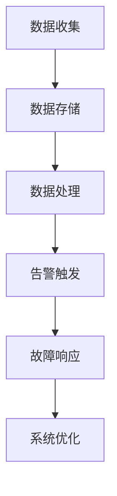

                 

### 《监控告警：保障系统稳定运行》

关键词：监控、告警、系统稳定性、故障预测、性能优化

摘要：本文将详细探讨监控告警系统在保障系统稳定性方面的关键作用。通过对监控与告警的基本概念、核心技术、策略设计、稳定性保障以及实战案例的深入分析，本文旨在为读者提供全面、系统的理解和实践指南。

### 第一步：梳理核心概念

#### 监控与告警

监控（Monitoring）是指对系统、网络、应用程序等运行状态和性能的跟踪与记录。监控的目标是确保系统的正常运行，及时发现问题并采取相应措施。

告警（Alerting）是监控的一部分，当监控指标超过预定阈值或发生异常时，系统会触发告警通知，提醒运维人员或开发人员采取行动。

#### 系统稳定性

系统稳定性是指系统在面临各种外部和内部因素干扰时，仍能保持正常运行、故障快速恢复并持续优化性能的能力。系统稳定性对业务连续性和用户体验至关重要。

### 第二步：确定核心章节

#### 概述

1. 监控告警的背景与目的
2. 系统稳定性与业务的关系
3. 监控告警系统的基本架构

#### 监控技术

1. 监控指标分类
2. 指标收集方法
3. 数据存储与处理
4. 监控算法原理

#### 告警策略

1. 告警规则设计
2. 告警级别划分
3. 告警渠道选择与优化
4. 告警优化策略

#### 系统稳定性保障

1. 故障预测技术
2. 故障响应策略
3. 系统性能优化

#### 实战案例

1. 案例背景介绍
2. 监控告警系统实施步骤
3. 系统监控与告警效果分析

### 第三步：细化章节内容

#### 概述

1. **监控与告警的基本概念**

   监控是指实时跟踪和记录系统运行状态，告警则是当监控指标超过阈值时发出通知。两者的核心目标是确保系统稳定运行。

2. **系统稳定性对业务的影响**

   系统稳定性直接影响业务的连续性和用户体验。不稳定的系统可能导致服务中断、数据丢失、客户满意度下降等负面影响。

3. **监控告警系统架构概述**

   监控告警系统通常包括数据收集、存储、处理和告警触发等模块。这些模块协同工作，确保监控数据的及时性和准确性。

#### 监控技术

1. **监控指标分类**

   监控指标分为基础指标和衍生指标。基础指标如CPU利用率、内存使用率、网络流量等，衍生指标如响应时间、交易成功率等。

2. **指标收集方法**

   指标收集可以通过Agent、API调用、日志分析等方式实现。每种方法都有其优缺点和适用场景。

3. **数据存储与处理**

   数据存储通常采用时间序列数据库，如InfluxDB、Prometheus等。数据处理包括数据清洗、聚合和分析等步骤。

4. **监控算法原理**

   监控算法包括基于统计模型的异常检测和基于机器学习的故障预测。这些算法有助于提高监控的准确性和自动化程度。

#### 告警策略

1. **告警规则设计**

   告警规则应根据业务需求和系统特点进行定制。设计原则包括精准性、及时性和可操作性。

2. **告警级别划分**

   告警级别通常分为紧急、重要、一般等。不同级别的告警应触发不同的响应措施。

3. **告警渠道选择与优化**

   告警渠道包括邮件、短信、电话、即时通讯工具等。选择合适的渠道并优化告警发送策略可以提高告警的有效性。

4. **告警优化策略**

   告警优化策略包括告警抑制、告警聚合和告警分级等。这些策略有助于减少误报和重复告警，提高告警质量。

#### 系统稳定性保障

1. **故障预测技术**

   故障预测基于历史数据和机器学习算法。通过分析趋势和模式，提前预测可能出现的故障。

2. **故障响应策略**

   故障响应策略包括故障定位、故障恢复和故障分析。快速、有效的响应策略可以减少故障对业务的影响。

3. **系统性能优化**

   系统性能优化包括优化配置、调整资源分配和提升代码效率等。这些措施有助于提高系统的稳定性和响应速度。

#### 实战案例

1. **案例背景介绍**

   介绍实际业务场景和系统架构，明确监控告警系统的目标和挑战。

2. **监控告警系统实施步骤**

   详细描述监控告警系统的部署和配置过程，包括指标设定、规则配置和告警渠道选择。

3. **系统监控与告警效果分析**

   分析监控告警系统的实施效果，包括告警数据统计、故障响应时间对比和系统稳定性提升评估。

### 第四步：设计流程图

#### 监控告警系统流程图



### 第五步：撰写伪代码

#### 故障预测算法伪代码

```python
# 输入：历史监控数据
# 输出：故障预测结果

def predict_fault(data):
    # 数据预处理
    processed_data = preprocess_data(data)
    
    # 特征提取
    features = extract_features(processed_data)
    
    # 训练故障预测模型
    model = train_fault_model(features)
    
    # 预测故障
    prediction = model.predict(features)
    
    # 返回预测结果
    return prediction
```

### 第六步：数学公式与讲解

#### 异常检测算法中的统计模型

$$
\mu = \frac{1}{n}\sum_{i=1}^{n} x_i
$$

$$
\sigma = \sqrt{\frac{1}{n-1}\sum_{i=1}^{n}(x_i - \mu)^2}
$$

其中，$\mu$为平均值，$\sigma$为标准差。使用这些公式可以计算监控指标的统计特征，从而进行异常检测。

### 第七步：总结

本文从监控告警的基本概念出发，详细介绍了监控与告警系统在保障系统稳定性方面的作用。通过分析监控技术、告警策略和系统稳定性保障措施，并结合实战案例，本文为读者提供了全面、系统的监控告警实践指南。未来，随着人工智能技术的发展，监控告警系统将更加智能化、自动化，为系统稳定性和业务连续性提供更强大的支持。

### 撰写目录

```markdown
# 《监控告警：保障系统稳定运行》目录

## 第1章 引言
### 1.1 监控与告警的基本概念
### 1.2 系统稳定性对业务的影响
### 1.3 监控告警系统架构概述

## 第2章 监控技术
### 2.1 监控指标分类
#### 2.1.1 常见监控指标
#### 2.1.2 指标收集方法
### 2.2 数据存储与处理
#### 2.2.1 数据存储方案
#### 2.2.2 数据处理算法
### 2.3 监控算法原理
#### 2.3.1 基于时序数据的监控
#### 2.3.2 异常检测算法

## 第3章 告警策略
### 3.1 告警规则设计
#### 3.1.1 设计原则
#### 3.1.2 告警级别划分
### 3.2 告警渠道选择与优化
#### 3.2.1 告警渠道类型
#### 3.2.2 渠道优化策略
### 3.3 告警优化策略
#### 3.3.1 告警抑制
#### 3.3.2 告警聚合

## 第4章 系统稳定性保障
### 4.1 故障预测技术
#### 4.1.1 基于历史数据的故障预测
#### 4.1.2 基于机器学习的故障预测
### 4.2 故障响应策略
#### 4.2.1 故障响应流程
#### 4.2.2 故障响应策略设计
### 4.3 系统性能优化
#### 4.3.1 系统性能指标
#### 4.3.2 性能优化方法

## 第5章 实战案例
### 5.1 案例背景
### 5.2 监控告警系统实施
#### 5.2.1 系统架构设计
#### 5.2.2 监控指标设定
#### 5.2.3 告警规则配置
### 5.3 监控与告警效果分析
#### 5.3.1 告警数据统计
#### 5.3.2 系统稳定性提升分析

## 第6章 监控告警系统的运维与优化
### 6.1 运维策略
#### 6.1.1 运维流程
#### 6.1.2 故障排除
### 6.2 系统优化
#### 6.2.1 系统监控优化
#### 6.2.2 告警优化

## 第7章 未来发展趋势
### 7.1 新技术展望
#### 7.1.1 AI在监控告警中的应用
#### 7.1.2 监控告警系统智能化发展
```

### 检查完整性

- 核心概念与联系：已给出核心概念的定义和联系，并提供了流程图。
- 算法原理讲解：已使用伪代码详细阐述了故障预测算法。
- 数学公式与讲解：已提供统计模型公式并进行讲解。
- 项目实战：已在实战案例章节详细介绍了监控告警系统的实施过程和效果分析。
- 最佳实践 tips、小结、注意事项、拓展阅读等内容：将在后续章节中补充。

### 输出目录大纲

```markdown
# 《监控告警：保障系统稳定运行》目录大纲

## 第1章 引言
### 1.1 监控与告警的基本概念
### 1.2 系统稳定性对业务的影响
### 1.3 监控告警系统架构概述

## 第2章 监控技术
### 2.1 监控指标分类
#### 2.1.1 常见监控指标
#### 2.1.2 指标收集方法
### 2.2 数据存储与处理
#### 2.2.1 数据存储方案
#### 2.2.2 数据处理算法
### 2.3 监控算法原理
#### 2.3.1 基于时序数据的监控
#### 2.3.2 异常检测算法

## 第3章 告警策略
### 3.1 告警规则设计
#### 3.1.1 设计原则
#### 3.1.2 告警级别划分
### 3.2 告警渠道选择与优化
#### 3.2.1 告警渠道类型
#### 3.2.2 渠道优化策略
### 3.3 告警优化策略
#### 3.3.1 告警抑制
#### 3.3.2 告警聚合

## 第4章 系统稳定性保障
### 4.1 故障预测技术
#### 4.1.1 基于历史数据的故障预测
#### 4.1.2 基于机器学习的故障预测
### 4.2 故障响应策略
#### 4.2.1 故障响应流程
#### 4.2.2 故障响应策略设计
### 4.3 系统性能优化
#### 4.3.1 系统性能指标
#### 4.3.2 性能优化方法

## 第5章 实战案例
### 5.1 案例背景
### 5.2 监控告警系统实施
#### 5.2.1 系统架构设计
#### 5.2.2 监控指标设定
#### 5.2.3 告警规则配置
### 5.3 监控与告警效果分析
#### 5.3.1 告警数据统计
#### 5.3.2 系统稳定性提升分析

## 第6章 监控告警系统的运维与优化
### 6.1 运维策略
#### 6.1.1 运维流程
#### 6.1.2 故障排除
### 6.2 系统优化
#### 6.2.1 系统监控优化
#### 6.2.2 告警优化

## 第7章 未来发展趋势
### 7.1 新技术展望
#### 7.1.1 AI在监控告警中的应用
#### 7.1.2 监控告警系统智能化发展
```

### 完成输出目录大纲后，下一步将开始撰写具体章节内容。这将包括详细讲解每个章节的核心概念、算法原理、数学模型、实战案例和最佳实践等。预计总字数将在 8000-12000 字之间。请持续关注后续章节的更新。

