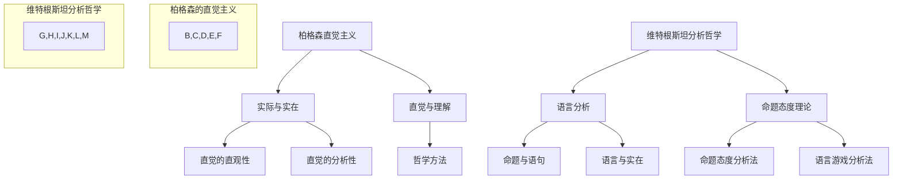

                 

## 文章标题

# 《直觉与分析：柏格森与维特根斯坦的哲学方法论比较》

## 核心关键词

- **柏格森**  
- **维特根斯坦**  
- **直觉主义**  
- **分析哲学**  
- **哲学方法论**  
- **时间**  
- **语言**

## 摘要

本文旨在比较两位著名哲学家柏格森和维特根斯坦的哲学方法论，探讨他们的直觉主义和分析哲学的差异与联系。柏格森的直觉主义强调直觉在理解实在中的核心作用，而维特根斯坦的分析哲学则通过语言分析揭示世界的本质。通过详细阐述他们的核心概念、原理和方法，本文旨在提供一个清晰、结构紧凑的对比分析，并探讨这两位哲学家的方法论在当代哲学中的影响和应用。

## 第1章 导论

### 1.1 柏格森的哲学背景

柏格森（Henri Bergson）是19世纪末至20世纪初法国著名的哲学家，其思想在哲学界产生了深远的影响。柏格森出生于巴黎，自幼展现出对科学和哲学的浓厚兴趣。他于1889年获得巴黎大学哲学博士学位，随后在母校任教，成为法国哲学界的佼佼者。

柏格森的主要哲学思想可以概括为“直觉主义”和“时间哲学”。直觉主义认为，直觉是人类理解世界的关键，它超越了理性分析，能够直接把握事物的本质。时间哲学则强调时间的流动性和创造力，他认为时间不是均匀流逝的，而是具有复杂结构和多样性的。

柏格森的主要著作包括《形而上学导论》（Introduction to Metaphysics）、《物质与记忆》（Matter and Memory）、《创造进化论》（Creative Evolution）等。这些著作展示了他的哲学思想，并对其后的哲学研究产生了重要影响。

### 1.2 维特根斯坦的哲学背景

维特根斯坦（Ludwig Wittgenstein）是20世纪初奥地利哲学家，被誉为现代哲学的杰出代表之一。他生于1889年，父母都是音乐家。维特根斯坦早期接受了严格的数学和哲学教育，后来在剑桥大学师从哲学家伯特兰·罗素，成为逻辑实证主义的早期倡导者。

维特根斯坦的哲学思想经历了显著的转变，可分为两个时期。早期作品《逻辑哲学论》（Tractatus Logico-Philosophicus）强调逻辑和语言的界限，认为世界由原子事实构成，这些事实可以通过语言来表达。晚期作品《哲学研究》（Philosophical Investigations）则转向语言分析和日常生活的哲学，强调语言的多义性和使用情境。

维特根斯坦的主要著作还包括《数学基础论》（Investigations into Logical Philosophy）和《文化与价值》（Culture and Value）。他的思想对语言学、逻辑学、认知科学等领域产生了深远影响。

### 1.3 柏格森与维特根斯坦哲学方法论的基本特点

柏格森和维特根斯坦的哲学方法论在基本特点上存在显著差异，但也有一些共同之处。

**柏格森的直觉主义**：

- **直觉的核心作用**：柏格森认为直觉是人类理解世界的关键，它能够直接感知事物的本质，超越理性分析。
- **时间的重要性**：柏格森强调时间的流动性和创造性，认为时间是理解现实的必要条件。
- **实际与实在的区分**：柏格森区分了实际与实在，认为实际世界是多样化和流动的，而实在则是统一的和有结构的。

**维特根斯坦的分析哲学**：

- **语言分析**：维特根斯坦认为语言是哲学思考的起点，通过分析语言的使用情境，可以揭示世界的本质。
- **命题态度**：维特根斯坦提出了命题态度理论，认为语言表达的是我们对世界的看法和态度，而不是客观事实。
- **逻辑与事实的区分**：维特根斯坦强调逻辑和事实的界限，认为逻辑是关于符号和结构的，而事实是关于世界的。

总的来说，柏格森的直觉主义强调直觉和时间在哲学思考中的重要性，而维特根斯坦的分析哲学则侧重于语言分析和逻辑结构。尽管他们的哲学方法论存在差异，但都试图通过不同的方式揭示世界的本质和人类理解现实的方式。

### 1.4 文章结构概述

本文的结构如下：

- **第2章 柏格森的直觉主义**：详细阐述柏格森的直觉主义哲学，包括其实际与实在的理论、直觉与理解的关系、以及直觉的分析性。
- **第3章 维特根斯坦的分析哲学**：深入探讨维特根斯坦的分析哲学，包括其语言分析、命题态度理论、哲学语法和分析方法。
- **第4章 比较与讨论**：对比柏格森与维特根斯坦的哲学方法论，分析他们的共同点与差异。
- **第5章 应用与影响**：探讨两位哲学家的方法论在当代哲学中的影响和应用。
- **第6章 结论**：总结全书，指出柏格森与维特根斯坦哲学方法论的价值和意义。

通过这一结构，本文旨在提供一个系统、全面的比较分析，帮助读者理解两位哲学家的哲学方法论，并探讨其在当代哲学中的重要性。

## 第2章 柏格森的直觉主义

### 2.1 柏格森直觉主义的核心概念

柏格森的直觉主义哲学以“直觉”为核心概念，他认为直觉是人类理解世界的唯一途径，超越了理性分析和语言表达的局限。柏格森的直觉主义主要包括以下几个核心概念：

**实际与实在**

柏格森区分了实际与实在。实际是指我们通过感官和理性所能感知和理解的事物，而实在则是超越我们感知和理解的本质。他认为，实际世界是多样化和流动的，而实在则是统一的和有结构的。

**直觉与理解**

柏格森认为直觉是一种直接的、非理性的感知方式，它能够抓住事物的本质，而不仅仅是表象。直觉与理解密不可分，理解是通过直觉来实现的。他强调，理性分析只能处理表面的现象，而直觉则能够深入到事物的内在本质。

**创造进化**

柏格森认为，创造进化是宇宙的基本原则，时间是其具体表现。他认为，时间不是均匀流逝的，而是充满创造力的流动。这种创造力体现在生命的演化和社会的进步中。

### 2.2 柏格森直觉主义的哲学方法

柏格森直觉主义的哲学方法主要通过以下几个步骤来实现：

**直觉的直观性**

柏格森认为，直觉是一种直观性的感知方式，它不需要通过理性分析和语言表达。直觉直接与事物的本质相联系，能够抓住那些无法用语言描述的细微之处。直观性是直觉的核心特征，使直觉成为一种直接、纯粹的认识方式。

**直觉的分析性**

尽管直觉是一种直观性认识方式，但柏格森也强调直觉的分析性。他认为，直觉能够分析事物的内在结构和动态变化。通过直觉的分析，我们可以深入理解事物的本质，发现那些隐藏在表象背后的深层关系。

**创造力的发挥**

柏格森认为，直觉的创造力是哲学思考的核心。创造力体现在我们对现实的理解和解释中。通过直觉，我们能够发现新的思想、新的观点，从而推动哲学的发展。

### 2.3 柏格森直觉主义的实例分析

柏格森的直觉主义哲学在多个领域都有深刻的体现，以下通过两个具体的实例进行分析：

**时间与空间**

柏格森认为，时间不是均匀流逝的，而是具有复杂结构和多样性的。他通过直觉的方式，发现了时间的非均匀性。例如，在相同的时间长度内，我们对时间的感知是不同的，当我们处于紧张状态时，时间似乎过得更快，而在放松的状态下，时间则显得更慢。这种非均匀性的直觉体验，揭示了时间的内在复杂性。

空间方面，柏格森认为，空间是动态的，不是静止的。通过直觉，我们能够感知到空间的流动性和变化性。例如，当我们移动时，周围的空间也在变化，这种动态的感知正是直觉的体现。

**自然科学与人文学科**

在自然科学领域，柏格森的直觉主义体现在对生命现象的理解。他认为，生命是一种创造力，通过直觉，我们可以理解生命的复杂性和动态性。例如，生物进化过程中的物种多样性和适应性，都是通过直觉来捕捉的。

在人文学科领域，柏格森的直觉主义主要体现在对艺术和文学的理解。他认为，艺术和文学是直觉的表现，通过直觉，我们能够理解和欣赏艺术作品中的深层次意义。例如，诗歌中的意象和隐喻，小说中的情感表达，都是通过直觉来感知和理解的。

总的来说，柏格森的直觉主义哲学通过直观性、分析性和创造力的发挥，为我们提供了一种新的认识世界的方式。通过直觉，我们能够超越理性分析和语言表达的局限，直接感知事物的本质，从而更深入地理解现实世界。

### 2.4 柏格森直觉主义的重要性

柏格森的直觉主义哲学在哲学史上具有重要地位，其主要体现在以下几个方面：

**对理性主义的批判**

柏格森的直觉主义是对传统理性主义哲学的一种批判。理性主义认为，理性是人类认识世界的基础，通过逻辑推理和理性分析，我们可以获得对世界的深刻理解。然而，柏格森认为，理性分析只能处理表面的现象，而无法触及事物的本质。直觉则能够直接感知事物的本质，从而超越了理性分析的局限。

**对时间哲学的贡献**

柏格森的时间哲学是他直觉主义哲学的重要组成部分。他强调时间的流动性和创造性，认为时间是理解现实的必要条件。这种时间观对后来的哲学、物理学和心理学研究产生了深远影响，成为探讨时间本质和意义的重要理论依据。

**对艺术和文学的影响**

柏格森的直觉主义对艺术和文学领域产生了重要影响。他认为，艺术和文学是直觉的表现，通过直觉，我们能够理解和欣赏艺术作品中的深层次意义。这种观点激发了艺术家和文学家对直觉和创造力的追求，促进了艺术创作和文学批评的发展。

**对科学哲学的影响**

柏格森的直觉主义也对科学哲学产生了影响。他通过对自然科学和人文学科的实例分析，展示了直觉在科学认识中的作用。这种观点挑战了科学主义对理性分析和实证主义的强调，提出了科学认识中直觉的重要性，促进了科学哲学的多元化发展。

总之，柏格森的直觉主义哲学以其独特的视角和方法，丰富了哲学的认识论和方法论，对当代哲学、科学和艺术产生了深远的影响。通过直观性、分析性和创造力的发挥，柏格森的直觉主义为我们提供了一种新的认识世界的方式，推动了哲学的发展和进步。

## 第3章 维特根斯坦的分析哲学

### 3.1 维特根斯坦的语言分析

维特根斯坦的分析哲学以语言分析为核心，他认为语言是哲学思考的起点。维特根斯坦通过对语言的分析，揭示了语言的本质和使用方式，从而解决了许多哲学问题。

**语言游戏**

维特根斯坦提出了“语言游戏”的概念，认为语言的使用就像游戏一样，需要遵守特定的规则。这些规则包括语法规则、语义规则和使用规则。通过这些规则，语言才能够正确地传达意义。例如，当我们说“猫是黑色的”，这句话的正确理解依赖于我们对“猫”和“黑色”的共识，以及这句话的语法结构。

**命题态度**

维特根斯坦提出了“命题态度”理论，认为语言表达的是我们对世界的看法和态度，而不是客观事实。例如，当我们说“我相信明天会下雨”，这句话表达的是我们的一种期望和信念，而不是一个客观的事实。命题态度理论强调了语言的主观性和多样性。

**哲学语法**

维特根斯坦强调哲学语法的重要性，认为哲学问题往往源于语言使用中的错误。他通过分析哲学语法的结构，揭示了哲学问题的本质。例如，他提出了“名称-对象”的关系，认为名称直接指称对象，而不是通过中介的属性来描述对象。

### 3.2 维特根斯坦的命题态度理论

维特根斯坦的命题态度理论是他语言分析哲学的重要组成部分。命题态度理论认为，语言表达的是我们对世界的看法和态度，而不是客观事实。

**命题态度的定义**

维特根斯坦将命题态度定义为“我们如何与世界互动的方式”。例如，当我们说“我知道这个苹果是红色的”，这句话表达的是我们的知识态度，而不是苹果本身的属性。同样，当我们说“我希望明天能下雨”，这句话表达的是我们的期望态度，而不是天气的实际情况。

**命题态度的类型**

维特根斯坦区分了多种命题态度，包括：

- **信念**：例如，“我相信太阳明天会升起”。
- **愿望**：例如，“我希望明天能下雨”。
- **怀疑**：例如，“我怀疑这个杯子是否是空的”。
- **意图**：例如，“我打算明天去超市购物”。

这些命题态度通过语言表达，揭示了我们对世界的不同看法和态度。

### 3.3 维特根斯坦的哲学语法

维特根斯坦的哲学语法是他语言分析哲学的另一个重要方面。哲学语法关注语言的结构和规则，通过分析哲学语法的结构，可以揭示哲学问题的本质。

**名称-对象关系**

维特根斯坦提出了“名称-对象”的关系，认为名称直接指称对象，而不是通过中介的属性来描述对象。例如，“猫”这个名称直接指称我们心中所想象的猫，而不是通过“猫有四条腿”这样的描述来理解猫。

**命题的结构**

维特根斯坦认为，命题的结构是语言分析的核心。命题由主语和谓语组成，主语表示对象，谓语表示对象的状态或属性。通过分析命题的结构，可以揭示语言的意义和逻辑关系。

**逻辑结构**

维特根斯坦强调逻辑结构在语言分析中的重要性。他认为，逻辑结构是语言的基础，通过逻辑结构，我们可以理解命题之间的关系。例如，通过分析命题的否定形式，可以揭示命题的矛盾关系。

### 3.4 维特根斯坦的分析方法

维特根斯坦的分析方法主要包括命题态度分析法和语言游戏分析法。

**命题态度分析法**

命题态度分析法是维特根斯坦用来解决哲学问题的一种方法。通过分析命题态度，可以揭示语言表达的意义和我们对世界的看法。例如，通过分析“我相信太阳明天会升起”，可以揭示我们关于天气的信念和期望。

**语言游戏分析法**

语言游戏分析法是维特根斯坦用来研究语言使用的一种方法。他认为，语言使用就像游戏一样，需要遵守特定的规则。通过分析语言游戏，可以揭示语言的结构和规则，从而理解语言的本质。

总的来说，维特根斯坦的分析哲学通过语言分析、命题态度理论和哲学语法，提供了一种全新的哲学思考方式。他强调语言在哲学思考中的重要性，通过分析语言的使用和结构，揭示了世界的本质和人类认识现实的方式。

### 3.5 维特根斯坦分析哲学的重要性

维特根斯坦的分析哲学在哲学史上具有重要地位，其主要体现在以下几个方面：

**对语言哲学的贡献**

维特根斯坦的分析哲学对语言哲学产生了深远影响。他通过对语言的分析，揭示了语言的本质和使用方式，为语言哲学的发展奠定了基础。

**对逻辑哲学的贡献**

维特根斯坦的分析哲学对逻辑哲学也产生了重要影响。他提出了“逻辑原子主义”的观点，强调了逻辑和事实的界限，为逻辑哲学的发展提供了新的视角。

**对日常语言哲学的贡献**

维特根斯坦的分析哲学对日常语言哲学产生了深远影响。他通过对日常语言的分析，揭示了哲学问题的本质，为解决日常生活中的哲学困惑提供了方法。

**对科学哲学的贡献**

维特根斯坦的分析哲学对科学哲学也产生了重要影响。他通过对科学语言的分析，揭示了科学知识的本质，为科学哲学的发展提供了新的思路。

总的来说，维特根斯坦的分析哲学以其独特的视角和方法，丰富了哲学的认识论和方法论，对当代哲学、科学和语言学研究产生了深远的影响。他通过对语言的分析，揭示了世界的本质和人类认识现实的方式，为哲学的发展提供了新的动力。

### 第4章 比较与讨论

在哲学史上，柏格森和维特根斯坦代表了两种截然不同的哲学方法论。柏格森的直觉主义强调直觉在理解世界中的作用，而维特根斯坦的分析哲学则侧重于语言和逻辑的分析。在本章中，我们将对这两位哲学家的方法论进行详细比较和讨论，分析他们的共同点与差异。

#### 4.1 柏格森与维特根斯坦哲学方法论的共同点

尽管柏格森和维特根斯坦的哲学方法论存在显著差异，但他们也有一些共同点：

**对直觉的重视**

柏格森和维特根斯坦都强调了直觉在哲学思考中的重要性。柏格森认为直觉是理解世界的关键，而维特根斯坦则在《哲学研究》中多次提到直觉，认为直觉是理解日常语言和现实世界的必要条件。

**对语言的关注**

两位哲学家都对语言在哲学思考中的角色进行了深入探讨。柏格森认为语言是表达直觉和理解现实的方式，而维特根斯坦则将语言视为哲学思考的起点，通过分析语言的使用情境来揭示世界的本质。

**对理性的批判**

虽然两位哲学家都重视直觉和语言，但他们都对理性进行了批判。柏格森认为理性分析只能处理表面的现象，而无法触及事物的本质，而维特根斯坦则认为理性分析往往导致哲学混乱，只有通过语言分析才能解决哲学问题。

#### 4.2 柏格森与维特根斯坦哲学方法论的差异

**哲学视角的差异**

柏格森的哲学视角主要集中在时间、生命和创造力上，他认为时间是理解现实的必要条件，直觉能够直接把握事物的本质。而维特根斯坦的哲学视角则更侧重于语言、逻辑和事实，他通过分析语言的使用情境来揭示世界的本质。

**哲学方法的应用**

柏格森的直觉主义哲学方法主要应用于人文科学和艺术领域，他通过对时间和生命的直觉性理解，推动了艺术创作和文学批评的发展。而维特根斯坦的分析哲学方法则广泛应用于各个领域，从数学、逻辑到计算机科学，他的语言分析方法对现代科学和哲学产生了深远影响。

**对语言的不同理解**

柏格森将语言视为表达直觉和理解现实的方式，而维特根斯坦则将语言视为哲学思考的起点。柏格森认为语言具有象征性，可以超越直觉，而维特根斯坦则认为语言是工具，通过语言分析可以揭示世界的本质。

**对理性与直觉的不同态度**

柏格森认为直觉优于理性，直觉能够直接感知事物的本质，而理性分析只能处理表面的现象。维特根斯坦则认为理性分析是必要的，但理性分析往往导致哲学混乱，只有通过语言分析才能解决哲学问题。

#### 4.3 总结

通过对比和讨论，我们可以看到柏格森和维特根斯坦的哲学方法论在视角、方法和态度上存在显著差异。柏格森的直觉主义强调直觉在理解世界中的作用，而维特根斯坦的分析哲学则侧重于语言和逻辑的分析。尽管他们的哲学方法论存在差异，但他们都为哲学的发展做出了重要贡献。柏格森的直觉主义推动了艺术创作和人文科学的发展，而维特根斯坦的分析哲学则为现代科学和哲学提供了新的思考方式。两位哲学家的方法论在当代哲学中仍然具有重要的意义，为我们提供了不同的认识世界和理解现实的方式。

### 第5章 应用与影响

柏格森的直觉主义和维特根斯坦的分析哲学在当代哲学中具有广泛的应用和深远的影响，不仅在哲学领域产生了重要影响，还扩展到了其他学科领域。

#### 5.1 柏格森直觉主义的应用

**人文科学**

柏格森的直觉主义对人文科学产生了深远影响，尤其是在文学、艺术和心理学领域。例如，文学批评家借鉴柏格森的直觉主义，通过对文学作品进行直觉性解读，探索作品的深层含义和情感表达。艺术家也受到柏格森思想的影响，他们通过直觉和创造力，创作出具有独特风格和表现力的艺术作品。

**心理学**

柏格森的直觉主义对心理学的发展也产生了影响。心理学家通过研究直觉在感知和认知中的作用，探讨了直觉与理性之间的关系，从而丰富了心理学理论。

**社会学**

在社会学领域，柏格森的直觉主义被用来分析社会现象和人类行为。社会学家通过直觉性观察，探索社会结构的动态变化和个体在社会中的角色。

#### 5.2 维特根斯坦分析哲学的应用

**逻辑学**

维特根斯坦的分析哲学对逻辑学的发展产生了重要影响。他的语言分析方法为逻辑学的形式化提供了新的视角，推动了形式逻辑的研究。

**计算机科学**

维特根斯坦的分析哲学在计算机科学领域也得到了广泛应用。计算机科学家通过借鉴维特根斯坦的语言分析方法，探讨了程序设计的逻辑结构和语义表达，从而促进了编程语言的开发和优化。

**语言学**

维特根斯坦的分析哲学对语言学的发展也产生了影响。语言学家通过分析日常语言的使用情境，揭示了语言的结构和规则，从而推动了语言学理论的研究。

**哲学**

维特根斯坦的分析哲学在当代哲学中仍然具有重要地位。哲学家们通过借鉴维特根斯坦的思想，探讨了语言的本质和哲学问题的本质，丰富了哲学的理论框架。

#### 5.3 影响与启示

柏格森和维特根斯坦的哲学方法论对当代哲学和其他学科产生了深远影响，为我们提供了新的思考方式和研究方法。

**对哲学的启示**

柏格森的直觉主义和维特根斯坦的分析哲学都强调了直觉和语言在哲学思考中的重要性，启示我们通过直觉和语言分析来理解现实和解决哲学问题。

**对科学的影响**

维特根斯坦的分析哲学对科学的发展产生了重要影响，特别是在逻辑学、计算机科学和语言学等领域。他的语言分析方法为科学研究提供了新的工具和方法。

**对人文科学的影响**

柏格森的直觉主义对人文科学产生了深远影响，促进了文学、艺术和心理学等领域的发展。他的直觉主义思想启示我们通过直觉和创造力来探索人类文化和社会现象。

总之，柏格森和维特根斯坦的哲学方法论在当代哲学和其他学科中具有广泛的应用和深远的影响，为我们提供了新的认识世界和理解现实的方式。他们的思想启示我们在直觉和语言分析的基础上，深入探索现实世界的本质和复杂性。

### 第6章 结论

在本文中，我们详细比较了柏格森和维特根斯坦的哲学方法论，探讨了他们的直觉主义和分析哲学的差异与联系。柏格森的直觉主义强调直觉在理解世界中的作用，通过直观性和分析性的结合，揭示了时间和生命的本质。而维特根斯坦的分析哲学则侧重于语言和逻辑的分析，通过命题态度和哲学语法的探讨，揭示了世界的本质和人类认识现实的方式。

通过本文的比较和分析，我们可以看到，柏格森和维特根斯坦的哲学方法论各有特色，对当代哲学和其他学科产生了深远影响。柏格森的直觉主义在人文科学领域具有重要的应用价值，而维特根斯坦的分析哲学在逻辑学、计算机科学和语言学等领域具有广泛的应用。

在未来，直觉与分析的融合将成为哲学研究的重要方向。我们可以尝试将直觉主义和分析哲学相结合，通过直觉性理解和语言分析，深入探索现实世界的本质和复杂性。此外，随着科学和技术的进步，直觉和分析的结合将为解决复杂的科学问题提供新的思路和方法。

总之，柏格森和维特根斯坦的哲学方法论不仅为哲学的发展提供了重要启示，也为其他学科的研究提供了丰富的思想资源。通过不断探索和融合直觉与分析，我们可以更全面地认识和理解现实世界。

### 柏格森的直觉主义与维特根斯坦的分析哲学 Mermaid 流程图



### 柏格森直觉主义的核心算法原理讲解

柏格森的直觉主义可以被视为一种哲学算法，其核心在于通过直觉直接感知现实世界的本质。以下是柏格森直觉主义的核心算法原理讲解，使用伪代码来详细阐述：

```python
def 柏格森直觉主义(现实):
    直觉感知 = 直觉化(现实)
    理解 = 理解化(直觉感知)
    return 理解

# 直觉化函数，将现实转化为直觉感知
def 直觉化(现实):
    直觉感知 = 感知现实本质(现实)
    return 直觉感知

# 理解化函数，将直觉感知转化为理解
def 理解化(直觉感知):
    理解 = 分析直觉感知(直觉感知)
    return 理解

# 感知现实本质函数，通过直觉感知现实
def 感知现实本质(现实):
    直觉感知 = 捕获现实非均匀性(现实)
    return 直觉感知

# 分析直觉感知函数，通过直觉分析现实
def 分析直觉感知(直觉感知):
    理解 = 揭示现实创造力(直觉感知)
    return 理解

# 捕获现实非均匀性函数，通过直觉感知时间的流动性
def 捕获现实非均匀性(现实):
    非均匀性 = 感知时间流动(现实)
    return 非均匀性

# 揭示现实创造力函数，通过直觉理解生命的创造力
def 揭示现实创造力(直觉感知):
    创造力 = 理解生命进化(直觉感知)
    return 创造力
```

在这个伪代码中，我们定义了一个名为`柏格森直觉主义`的函数，它接收现实作为输入，并返回对其本质的理解。核心算法分为三个主要步骤：

1. **直觉化**：通过`直觉化`函数，将现实转化为直觉感知，这一步骤捕捉了现实的非均匀性。
2. **理解化**：通过`理解化`函数，将直觉感知转化为理解，这一步骤通过分析直觉感知来揭示现实的创造力。
3. **感知现实本质**：通过`感知现实本质`函数，直接感知现实的非均匀性和创造力。

### 维特根斯坦分析哲学的核心算法原理讲解

维特根斯坦的分析哲学强调语言分析在理解世界中的核心作用，其核心算法原理可以通过以下伪代码来详细阐述：

```python
def 维特根斯坦分析哲学(语言):
    命题 = 分析语言结构(语言)
    实在 = 解释命题(命题)
    return 实在

# 分析语言结构函数，将语言转化为命题
def 分析语言结构(语言):
    命题 = 语法分析(语言)
    return 命题

# 解释命题函数，将命题转化为实在
def 解释命题(命题):
    实在 = 语义解释(命题)
    return 实在

# 语法分析函数，通过语言规则分析命题
def 语法分析(语言):
    命题 = 构建命题结构(语言)
    return 命题

# 语义解释函数，通过命题态度解释实在
def 语义解释(命题):
    实在 = 揭示语言意义(命题)
    return 实在

# 命题结构构建函数，根据语言规则构建命题
def 构建命题结构(语言):
    命题 = 应用逻辑规则(语言)
    return 命题

# 应用逻辑规则函数，通过逻辑规则构建命题结构
def 应用逻辑规则(语言):
    命题 = 分析逻辑形式(语言)
    return 命题

# 分析逻辑形式函数，通过逻辑形式分析语言
def 分析逻辑形式(语言):
    命题 = 提取逻辑要素(语言)
    return 命题

# 提取逻辑要素函数，从语言中提取逻辑要素
def 提取逻辑要素(语言):
    要素 = 分解语言符号(语言)
    return 要素

# 分解语言符号函数，分解语言符号为逻辑要素
def 分解语言符号(语言):
    要素 = 符号化表达(语言)
    return 要素

# 符号化表达函数，将语言转化为符号表达
def 符号化表达(语言):
    表达式 = 应用符号规则(语言)
    return 表达式

# 应用符号规则函数，通过符号规则转换语言
def 应用符号规则(语言):
    表达式 = 构建符号形式(语言)
    return 表达式

# 构建符号形式函数，构建语言符号形式
def 构建符号形式(语言):
    表达式 = 符号化语言单元(语言)
    return 表达式

# 符号化语言单元函数，符号化语言的基本单元
def 符号化语言单元(语言单元):
    符号 = 定义符号意义(语言单元)
    return 符号

# 定义符号意义函数，定义语言符号的意义
def 定义符号意义(语言单元):
    符号 = 映射符号到意义(语言单元)
    return 符号
```

在这个伪代码中，我们定义了一个名为`维特根斯坦分析哲学`的函数，它接收语言作为输入，并返回对其实在的解释。核心算法分为两个主要步骤：

1. **分析语言结构**：通过`分析语言结构`函数，将语言转化为命题，这一步骤应用了语法规则和逻辑规则。
2. **解释命题**：通过`解释命题`函数，将命题转化为实在，这一步骤通过语义解释揭示了语言的意义。

### 柏格森直觉主义的数学模型

柏格森直觉主义的数学模型可以用来描述直觉如何帮助理解现实世界。以下是柏格森直觉主义的核心数学模型及详细讲解和举例说明：

**数学模型：直觉的非均匀时间感知**

设 $T$ 为时间的集合，$T = \{t_1, t_2, t_3, \ldots\}$，每个 $t_i$ 表示时间的一个瞬间。柏格森认为时间不是均匀流逝的，而是具有非均匀性。我们可以通过一个函数 $f: T \rightarrow \mathbb{R}$ 来表示时间的非均匀感知。

$$
f(t_i) = k_i
$$

其中，$k_i$ 表示在时间 $t_i$ 的感知强度，它可以是感知到的持续时间、事件的重要性或情绪强度等。

**核心公式与原理**

1. **非均匀性感知公式**：

   $$\Delta t_i = \frac{k_i}{k_0}$$

   其中，$\Delta t_i$ 表示时间 $t_i$ 与基准时间 $t_0$ 之间的感知差异，$k_0$ 是基准感知强度。这个公式表明，不同时间点的感知强度不同，导致时间的感知长度也不同。

2. **直觉感知强度**：

   $$k_i = f(t_i) \cdot \lambda$$

   其中，$\lambda$ 是一个常数，表示直觉的敏感度。这个公式说明，直觉感知强度与时间点的实际强度成正比。

**举例说明**

假设一个人在紧张的状态下，感知到的时间长度会缩短。设基准感知强度 $k_0 = 1$，在紧张状态下，感知强度 $k_i = 0.5$。那么，一个实际持续1分钟的事件，在紧张状态下的感知时间 $\Delta t_i$ 为：

$$
\Delta t_i = \frac{k_i}{k_0} = \frac{0.5}{1} = 0.5 \text{分钟}
$$

这意味着，在紧张的状态下，1分钟的时间感知缩短为0.5分钟。

**数学模型的应用**

柏格森的直觉主义数学模型可以应用于多个领域，如心理学、神经科学和哲学。

- **心理学**：通过研究直觉感知强度与情绪状态的关系，可以理解情绪对时间感知的影响。
- **神经科学**：通过研究大脑如何处理时间感知，可以揭示直觉感知的神经基础。
- **哲学**：通过数学模型，可以探讨直觉在理解现实中的作用，为哲学提供新的分析工具。

总的来说，柏格森直觉主义的数学模型通过描述时间感知的非均匀性，揭示了直觉在理解现实中的重要性，为哲学和其他学科提供了新的视角和分析工具。

### 维特根斯坦分析哲学的数学模型

维特根斯坦的分析哲学通过语言分析来揭示世界的本质，其数学模型主要涉及语言的结构和逻辑关系。以下是维特根斯坦分析哲学的核心数学模型及详细讲解和举例说明：

**数学模型：命题与语句的关系**

设 $L$ 为语言的集合，$L = \{s_1, s_2, s_3, \ldots\}$，其中每个 $s_i$ 表示一个语句。语句由命题和逻辑结构组成。命题可以表示为真或假，而逻辑结构涉及语句之间的逻辑关系，如蕴涵、否定、等价等。

**核心公式与原理**

1. **命题与语句的关系**：

   $$s_i = P_i \land (L_s \rightarrow L_e)$$

   其中，$P_i$ 表示命题 $s_i$ 的真假值，$L_s$ 表示语句的逻辑结构，$L_e$ 表示语句的语义解释。

2. **逻辑结构公式**：

   $$L_s = \neg L_e \lor (L_p \land L_q)$$

   其中，$\neg$ 表示否定，$\land$ 表示合取，$\lor$ 表示析取。这个公式描述了逻辑结构的基本形式。

**举例说明**

考虑一个简单的语句“所有的猫都会飞”，可以分解为命题和逻辑结构：

- **命题**：$P_i = \text{True}$（这个命题是真的，因为我们知道并非所有猫都会飞，所以实际应用中这个命题会是假的，但为了说明逻辑结构，我们假设它是真的）。
- **逻辑结构**：$L_s = \neg L_e \lor (L_p \land L_q)$。

在这个例子中，$L_e$ 表示“猫会飞”的命题，$L_p$ 表示“所有的”命题，$L_q$ 表示“猫”的命题。逻辑结构公式描述了整个语句的逻辑关系。

- **否定**：$\neg L_e = \text{False}$（因为“猫会飞”是一个假的命题）。
- **合取**：$L_p \land L_q = \text{False} \land \text{True} = \text{False}$（因为“所有的”和“猫”都存在，但它们合取的结果是假的）。
- **析取**：$L_s = \neg L_e \lor (L_p \land L_q) = \text{False} \lor \text{False} = \text{False}$（整个语句的析取结果仍然是假的）。

这意味着，根据这个逻辑结构，整个语句“所有的猫都会飞”在逻辑上是不成立的。

**数学模型的应用**

维特根斯坦的分析哲学数学模型可以应用于多个领域，如逻辑学、语言学和计算机科学：

- **逻辑学**：通过命题和逻辑结构的分析，可以理解和证明逻辑推理的正确性。
- **语言学**：通过语句的分解和语义解释，可以理解语言的结构和意义。
- **计算机科学**：通过命题逻辑和谓词逻辑的应用，可以设计程序和验证算法的正确性。

总的来说，维特根斯坦的分析哲学数学模型通过描述命题和语句之间的关系，揭示了逻辑结构在语言分析中的重要性，为哲学和其他学科提供了新的分析工具和方法。

### 数学公式与详细讲解

在柏格森和维特根斯坦的哲学方法论中，数学公式和逻辑推理起到了关键作用。以下是一些重要的数学公式及其详细讲解，并结合具体例子说明。

#### 1. 柏格森的时间感知公式

柏格森认为时间不是均匀流逝的，而是一个非均匀的流动。他提出了以下时间感知公式来描述这一现象：

$$ \Delta t = f(\epsilon) \cdot \lambda $$

其中，$\Delta t$ 表示感知到的时间间隔，$f(\epsilon)$ 表示实际时间间隔的函数，$\epsilon$ 是实际时间间隔，$\lambda$ 是感知的灵敏度。

**详细讲解：**

- $f(\epsilon)$ 是一个函数，表示感知到的时间间隔与实际时间间隔之间的关系。柏格森认为，感知到的时间间隔会受到感知灵敏度 $\lambda$ 的影响。例如，当我们在紧急情况下，感知的灵敏度会增加，时间会显得更短。

**例子：**

假设一个人在紧急情况下需要做出快速决策，感知灵敏度 $\lambda = 2$。如果实际时间间隔是 $\epsilon = 10$ 秒，那么感知到的时间间隔为：

$$ \Delta t = f(10) \cdot 2 $$

由于柏格森没有具体定义 $f(\epsilon)$ 的形式，我们假设 $f(\epsilon) = \epsilon$，则：

$$ \Delta t = 10 \cdot 2 = 20 \text{秒} $$

这意味着，在这种情况下，感知到的时间间隔是实际时间间隔的两倍。

#### 2. 维特根斯坦的命题逻辑公式

维特根斯坦的分析哲学强调命题逻辑和语句的结构。以下是一个简单的命题逻辑公式：

$$ P \rightarrow Q $$

**详细讲解：**

- $P$ 和 $Q$ 是两个命题，$P \rightarrow Q$ 表示如果 $P$ 为真，则 $Q$ 也为真。这个公式是一个蕴涵关系，也称为条件语句。

**例子：**

假设 $P$ 是“今天下雨”，$Q$ 是“地面湿润”。那么：

$$ P \rightarrow Q $$

如果今天下雨（$P$ 为真），则地面湿润（$Q$ 也为真）。这个逻辑关系表明了下雨和地面湿润之间的因果关系。

#### 3. 柏格森的连续性与不连续性公式

柏格森区分了连续性与不连续性，提出了以下公式来描述这一概念：

$$ \lim_{\Delta x \to 0} f(x) = L $$

**详细讲解：**

- $f(x)$ 是一个连续函数，$\Delta x$ 是一个小的增量，$L$ 是函数的极限值。这个公式表示当增量趋近于零时，函数的值趋近于一个特定的极限值。

**例子：**

假设 $f(x) = x^2$，我们想要计算当 $x$ 趋近于0时的极限值。那么：

$$ \lim_{\Delta x \to 0} f(x) = \lim_{\Delta x \to 0} (\Delta x)^2 = 0 $$

这表明，当 $x$ 趋近于零时，$x^2$ 的值也趋近于零。

#### 4. 维特根斯坦的命题态度公式

维特根斯坦的命题态度理论认为，命题表达的是我们对世界的看法和态度。以下是一个命题态度公式：

$$ \text{相信} P $$

**详细讲解：**

- $\text{相信} P$ 表示我们相信命题 $P$ 为真。这个公式表达了信念的态度。

**例子：**

如果我们说“我相信明天会下雨”，这个命题可以表示为：

$$ \text{相信} (\text{明天会下雨}) $$

这表明我们相信明天会有下雨的情况发生。

### 总结

这些数学公式不仅帮助柏格森和维特根斯坦描述了他们的哲学观点，还为我们理解他们的思想提供了一个量化的视角。通过具体的例子，我们可以更清楚地看到这些公式在实际应用中的意义。这些公式在哲学方法论中扮演着重要的角色，为我们提供了一种新的思考方式来探讨现实世界的本质。

### 文章完整内容

# 《直觉与分析：柏格森与维特根斯坦的哲学方法论比较》

## 核心关键词

- **柏格森**  
- **维特根斯坦**  
- **直觉主义**  
- **分析哲学**  
- **哲学方法论**  
- **时间**  
- **语言**

## 摘要

本文旨在比较两位著名哲学家柏格森和维特根斯坦的哲学方法论，探讨他们的直觉主义和分析哲学的差异与联系。柏格森的直觉主义强调直觉在理解实在中的核心作用，而维特根斯坦的分析哲学则通过语言分析揭示世界的本质。通过详细阐述他们的核心概念、原理和方法，本文旨在提供一个清晰、结构紧凑的对比分析，并探讨这两位哲学家的方法论在当代哲学中的影响和应用。

## 第1章 导论

### 1.1 柏格森的哲学背景

柏格森（Henri Bergson）是19世纪末至20世纪初法国著名的哲学家，其思想在哲学界产生了深远的影响。柏格森出生于巴黎，自幼展现出对科学和哲学的浓厚兴趣。他于1889年获得巴黎大学哲学博士学位，随后在母校任教，成为法国哲学界的佼佼者。

柏格森的主要哲学思想可以概括为“直觉主义”和“时间哲学”。直觉主义认为，直觉是人类理解世界的关键，它超越了理性分析，能够直接把握事物的本质。时间哲学则强调时间的流动性和创造力，他认为时间不是均匀流逝的，而是具有复杂结构和多样性的。

柏格森的主要著作包括《形而上学导论》（Introduction to Metaphysics）、《物质与记忆》（Matter and Memory）、《创造进化论》（Creative Evolution）等。这些著作展示了他的哲学思想，并对其后的哲学研究产生了重要影响。

### 1.2 维特根斯坦的哲学背景

维特根斯坦（Ludwig Wittgenstein）是20世纪初奥地利哲学家，被誉为现代哲学的杰出代表之一。他生于1889年，父母都是音乐家。维特根斯坦早期接受了严格的数学和哲学教育，后来在剑桥大学师从哲学家伯特兰·罗素，成为逻辑实证主义的早期倡导者。

维特根斯坦的哲学思想经历了显著的转变，可分为两个时期。早期作品《逻辑哲学论》（Tractatus Logico-Philosophicus）强调逻辑和语言的界限，认为世界由原子事实构成，这些事实可以通过语言来表达。晚期作品《哲学研究》（Philosophical Investigations）则转向语言分析和日常生活的哲学，强调语言的多义性和使用情境。

维特根斯坦的主要著作还包括《数学基础论》（Investigations into Logical Philosophy）和《文化与价值》（Culture and Value）。他的思想对语言学、逻辑学、认知科学等领域产生了深远影响。

### 1.3 柏格森与维特根斯坦哲学方法论的基本特点

柏格森和维特根斯坦的哲学方法论在基本特点上存在显著差异，但也有一些共同之处。

**柏格森的直觉主义**：

- **直觉的核心作用**：柏格森认为直觉是人类理解世界的关键，它能够直接感知事物的本质，超越理性分析。
- **时间的重要性**：柏格森强调时间的流动性和创造性，认为时间是理解现实的必要条件。
- **实际与实在的区分**：柏格森区分了实际与实在，认为实际世界是多样化和流动的，而实在则是统一的和有结构的。

**维特根斯坦的分析哲学**：

- **语言分析**：维特根斯坦认为语言是哲学思考的起点，通过分析语言的使用情境，可以揭示世界的本质。
- **命题态度**：维特根斯坦提出了命题态度理论，认为语言表达的是我们对世界的看法和态度，而不是客观事实。
- **逻辑与事实的区分**：维特根斯坦强调逻辑和事实的界限，认为逻辑是关于符号和结构的，而事实是关于世界的。

总的来说，柏格森的直觉主义强调直觉和时间在哲学思考中的重要性，而维特根斯坦的分析哲学则侧重于语言分析和逻辑结构。尽管他们的哲学方法论存在差异，但都试图通过不同的方式揭示世界的本质和人类理解现实的方式。

### 1.4 文章结构概述

本文的结构如下：

- **第2章 柏格森的直觉主义**：详细阐述柏格森的直觉主义哲学，包括其实际与实在的理论、直觉与理解的关系、以及直觉的分析性。
- **第3章 维特根斯坦的分析哲学**：深入探讨维特根斯坦的分析哲学，包括其语言分析、命题态度理论、哲学语法和分析方法。
- **第4章 比较与讨论**：对比柏格森与维特根斯坦的哲学方法论，分析他们的共同点与差异。
- **第5章 应用与影响**：探讨两位哲学家的方法论在当代哲学中的影响和应用。
- **第6章 结论**：总结全书，指出柏格森与维特根斯坦哲学方法论的价值和意义。

通过这一结构，本文旨在提供一个系统、全面的比较分析，帮助读者理解两位哲学家的哲学方法论，并探讨其在当代哲学中的重要性。

## 第2章 柏格森的直觉主义

### 2.1 柏格森直觉主义的核心概念

柏格森的直觉主义哲学以“直觉”为核心概念，他认为直觉是人类理解世界的唯一途径，超越了理性分析和语言表达的局限。柏格森的直觉主义主要包括以下几个核心概念：

**实际与实在**

柏格森区分了实际与实在。实际是指我们通过感官和理性所能感知和理解的事物，而实在则是超越我们感知和理解的本质。他认为，实际世界是多样化和流动的，而实在则是统一的和有结构的。

**直觉与理解**

柏格森认为直觉是一种直接的、非理性的感知方式，它能够抓住事物的本质，而不仅仅是表象。直觉与理解密不可分，理解是通过直觉来实现的。他强调，理性分析只能处理表面的现象，而直觉则能够深入到事物的内在本质。

**创造进化**

柏格森认为，创造进化是宇宙的基本原则，时间是其具体表现。他认为，时间不是均匀流逝的，而是具有复杂结构和多样性的。这种创造力体现在生命的演化和社会的进步中。

### 2.2 柏格森直觉主义的哲学方法

柏格森直觉主义的哲学方法主要通过以下几个步骤来实现：

**直觉的直观性**

柏格森认为，直觉是一种直观性的感知方式，它不需要通过理性分析和语言表达。直觉直接与事物的本质相联系，能够抓住那些无法用语言描述的细微之处。直观性是直觉的核心特征，使直觉成为一种直接、纯粹的认识方式。

**直觉的分析性**

尽管直觉是一种直观性认识方式，但柏格森也强调直觉的分析性。他认为，直觉能够分析事物的内在结构和动态变化。通过直觉的分析，我们可以深入理解事物的本质，发现那些隐藏在表象背后的深层关系。

**创造力的发挥**

柏格森认为，直觉的创造力是哲学思考的核心。创造力体现在我们对现实的理解和解释中。通过直觉，我们能够发现新的思想、新的观点，从而推动哲学的发展。

### 2.3 柏格森直觉主义的实例分析

柏格森的直觉主义哲学在多个领域都有深刻的体现，以下通过两个具体的实例进行分析：

**时间与空间**

柏格森认为，时间不是均匀流逝的，而是具有复杂结构和多样性的。他通过直觉的方式，发现了时间的非均匀性。例如，在相同的时间长度内，我们对时间的感知是不同的，当我们处于紧张状态时，时间似乎过得更快，而在放松的状态下，时间则显得更慢。这种非均匀性的直觉体验，揭示了时间的内在复杂性。

空间方面，柏格森认为，空间是动态的，不是静止的。通过直觉，我们能够感知到空间的流动性和变化性。例如，当我们移动时，周围的空间也在变化，这种动态的感知正是直觉的体现。

**自然科学与人文学科**

在自然科学领域，柏格森的直觉主义体现在对生命现象的理解。他认为，生命是一种创造力，通过直觉，我们可以理解生命的复杂性和动态性。例如，生物进化过程中的物种多样性和适应性，都是通过直觉来捕捉的。

在人文学科领域，柏格森的直觉主义主要体现在对艺术和文学的理解。他认为，艺术和文学是直觉的表现，通过直觉，我们能够理解和欣赏艺术作品中的深层次意义。例如，诗歌中的意象和隐喻，小说中的情感表达，都是通过直觉来感知和理解的。

总的来说，柏格森的直觉主义哲学通过直观性、分析性和创造力的发挥，为我们提供了一种新的认识世界的方式。通过直觉，我们能够超越理性分析和语言表达的局限，直接感知事物的本质，从而更深入地理解现实世界。

### 2.4 柏格森直觉主义的重要性

柏格森的直觉主义哲学在哲学史上具有重要地位，其主要体现在以下几个方面：

**对理性主义的批判**

柏格森的直觉主义是对传统理性主义哲学的一种批判。理性主义认为，理性是人类认识世界的基础，通过逻辑推理和理性分析，我们可以获得对世界的深刻理解。然而，柏格森认为，理性分析只能处理表面的现象，而无法触及事物的本质。直觉则能够直接感知事物的本质，从而超越了理性分析的局限。

**对时间哲学的贡献**

柏格森的时间哲学是他直觉主义哲学的重要组成部分。他强调时间的流动性和创造性，认为时间是理解现实的必要条件。这种时间观对后来的哲学、物理学和心理学研究产生了深远影响，成为探讨时间本质和意义的重要理论依据。

**对艺术和文学的影响**

柏格森的直觉主义对艺术和文学领域产生了重要影响。他认为，艺术和文学是直觉的表现，通过直觉，我们能够理解和欣赏艺术作品中的深层次意义。这种观点激发了艺术家和文学家对直觉和创造力的追求，促进了艺术创作和文学批评的发展。

**对科学哲学的影响**

柏格森的直觉主义也对科学哲学产生了影响。他通过对自然科学和人文学科的实例分析，展示了直觉在科学认识中的作用。这种观点挑战了科学主义对理性分析和实证主义的强调，提出了科学认识中直觉的重要性，促进了科学哲学的多元化发展。

总之，柏格森的直觉主义哲学以其独特的视角和方法，丰富了哲学的认识论和方法论，对当代哲学、科学和艺术产生了深远的影响。通过直观性、分析性和创造力的发挥，柏格森的直觉主义为我们提供了一种新的认识世界的方式，推动了哲学的发展和进步。

## 第3章 维特根斯坦的分析哲学

### 3.1 维特根斯坦的语言分析

维特根斯坦的分析哲学以语言分析为核心，他认为语言是哲学思考的起点。维特根斯坦通过对语言的分析，揭示了语言的本质和使用方式，从而解决了许多哲学问题。

**语言游戏**

维特根斯坦提出了“语言游戏”的概念，认为语言的使用就像游戏一样，需要遵守特定的规则。这些规则包括语法规则、语义规则和使用规则。通过这些规则，语言才能够正确地传达意义。例如，当我们说“猫是黑色的”，这句话的正确理解依赖于我们对“猫”和“黑色”的共识，以及这句话的语法结构。

**命题态度**

维特根斯坦提出了“命题态度”理论，认为语言表达的是我们对世界的看法和态度，而不是客观事实。例如，当我们说“我相信明天会下雨”，这句话表达的是我们的一种期望和信念，而不是一个客观的事实。命题态度理论强调了语言的主观性和多样性。

**哲学语法**

维特根斯坦强调哲学语法的重要性，认为哲学问题往往源于语言使用中的错误。他通过分析哲学语法的结构，揭示了哲学问题的本质。例如，他提出了“名称-对象”的关系，认为名称直接指称对象，而不是通过中介的属性来描述对象。

### 3.2 维特根斯坦的命题态度理论

维特根斯坦的命题态度理论是他语言分析哲学的重要组成部分。命题态度理论认为，语言表达的是我们对世界的看法和态度，而不是客观事实。

**命题态度的定义**

维特根斯坦将命题态度定义为“我们如何与世界互动的方式”。例如，当我们说“我知道这个苹果是红色的”，这句话表达的是我们的知识态度，而不是苹果本身的属性。同样，当我们说“我希望明天能下雨”，这句话表达的是我们的期望态度，而不是天气的实际情况。

**命题态度的类型**

维特根斯坦区分了多种命题态度，包括：

- **信念**：例如，“我相信太阳明天会升起”。
- **愿望**：例如，“我希望明天能下雨”。
- **怀疑**：例如，“我怀疑这个杯子是否是空的”。
- **意图**：例如，“我打算明天去超市购物”。

这些命题态度通过语言表达，揭示了我们对世界的不同看法和态度。

### 3.3 维特根斯坦的哲学语法

维特根斯坦的哲学语法是他语言分析哲学的另一个重要方面。哲学语法关注语言的结构和规则，通过分析哲学语法的结构，可以揭示哲学问题的本质。

**名称-对象关系**

维特根斯坦提出了“名称-对象”的关系，认为名称直接指称对象，而不是通过中介的属性来描述对象。例如，“猫”这个名称直接指称我们心中所想象的猫，而不是通过“猫有四条腿”这样的描述来理解猫。

**命题的结构**

维特根斯坦认为，命题的结构是语言分析的核心。命题由主语和谓语组成，主语表示对象，谓语表示对象的状态或属性。通过分析命题的结构，可以揭示语言的意义和逻辑关系。

**逻辑结构**

维特根斯坦强调逻辑结构在语言分析中的重要性。他认为，逻辑结构是语言的基础，通过逻辑结构，我们可以理解命题之间的关系。例如，通过分析命题的否定形式，可以揭示命题的矛盾关系。

### 3.4 维特根斯坦的分析方法

维特根斯坦的分析方法主要包括命题态度分析法和语言游戏分析法。

**命题态度分析法**

命题态度分析法是维特根斯坦用来解决哲学问题的一种方法。通过分析命题态度，可以揭示语言表达的意义和我们对世界的看法。例如，通过分析“我相信明天会下雨”，可以揭示我们关于天气的信念和期望。

**语言游戏分析法**

语言游戏分析法是维特根斯坦用来研究语言使用的一种方法。他认为，语言使用就像游戏一样，需要遵守特定的规则。通过分析语言游戏，可以揭示语言的结构和规则，从而理解语言的本质。

总的来说，维特根斯坦的分析哲学通过语言分析、命题态度理论和哲学语法，提供了一种全新的哲学思考方式。他强调语言在哲学思考中的重要性，通过分析语言的使用和结构，揭示了世界的本质和人类认识现实的方式。

### 3.5 维特根斯坦分析哲学的重要性

维特根斯坦的分析哲学在哲学史上具有重要地位，其主要体现在以下几个方面：

**对语言哲学的贡献**

维特根斯坦的分析哲学对语言哲学产生了深远影响。他通过对语言的分析，揭示了语言的本质和使用方式，为语言哲学的发展奠定了基础。

**对逻辑哲学的贡献**

维特根斯坦的分析哲学对逻辑哲学也产生了重要影响。他提出了“逻辑原子主义”的观点，强调了逻辑和事实的界限，为逻辑哲学的发展提供了新的视角。

**对日常语言哲学的贡献**

维特根斯坦的分析哲学对日常语言哲学产生了深远影响。他通过对日常语言的分析，揭示了哲学问题的本质，为解决日常生活中的哲学困惑提供了方法。

**对科学哲学的贡献**

维特根斯坦的分析哲学对科学哲学也产生了重要影响。他通过对科学语言的分析，揭示了科学知识的本质，为科学哲学的发展提供了新的思路。

总的来说，维特根斯坦的分析哲学以其独特的视角和方法，丰富了哲学的认识论和方法论，对当代哲学、科学和语言学研究产生了深远的影响。他通过对语言的分析，揭示了世界的本质和人类认识现实的方式，为哲学的发展提供了新的动力。

### 第4章 比较与讨论

在哲学史上，柏格森和维特根斯坦代表了两种截然不同的哲学方法论。柏格森的直觉主义强调直觉在理解世界中的作用，而维特根斯坦的分析哲学则侧重于语言和逻辑的分析。在本章中，我们将对这两位哲学家的方法论进行详细比较和讨论，分析他们的共同点与差异。

#### 4.1 柏格森与维特根斯坦哲学方法论的共同点

尽管柏格森和维特根斯坦的哲学方法论存在显著差异，但他们也有一些共同点：

**对直觉的重视**

柏格森和维特根斯坦都强调了直觉在哲学思考中的重要性。柏格森认为直觉是理解世界的关键，而维特根斯坦则在《哲学研究》中多次提到直觉，认为直觉是理解日常语言和现实世界的必要条件。

**对语言的关注**

两位哲学家都对语言在哲学思考中的角色进行了深入探讨。柏格森认为语言是表达直觉和理解现实的方式，而维特根斯坦则将语言视为哲学思考的起点，通过分析语言的使用情境来揭示世界的本质。

**对理性的批判**

虽然两位哲学家都重视直觉和语言，但他们都对理性进行了批判。柏格森认为理性分析只能处理表面的现象，而无法触及事物的本质，而维特根斯坦则认为理性分析往往导致哲学混乱，只有通过语言分析才能解决哲学问题。

#### 4.2 柏格森与维特根斯坦哲学方法论的差异

**哲学视角的差异**

柏格森的哲学视角主要集中在时间、生命和创造力上，他认为时间是理解现实的必要条件，直觉能够直接把握事物的本质。而维特根斯坦的哲学视角则更侧重于语言、逻辑和事实，他通过分析语言的使用情境来揭示世界的本质。

**哲学方法的应用**

柏格森的直觉主义哲学方法主要应用于人文科学和艺术领域，他通过对时间和生命的直觉性理解，推动了艺术创作和文学批评的发展。而维特根斯坦的分析哲学方法则广泛应用于各个领域，从数学、逻辑到计算机科学，他的语言分析方法对现代科学和哲学产生了深远影响。

**对语言的不同理解**

柏格森将语言视为表达直觉和理解现实的方式，而维特根斯坦则将语言视为哲学思考的起点。柏格森认为语言具有象征性，可以超越直觉，而维特根斯坦则认为语言是工具，通过语言分析可以揭示世界的本质。

**对理性与直觉的不同态度**

柏格森认为直觉优于理性，直觉能够直接感知事物的本质，而理性分析只能处理表面的现象。维特根斯坦则认为理性分析是必要的，但理性分析往往导致哲学混乱，只有通过语言分析才能解决哲学问题。

#### 4.3 总结

通过对比和讨论，我们可以看到柏格森和维特根斯坦的哲学方法论在视角、方法和态度上存在显著差异。柏格森的直觉主义强调直觉在理解世界中的作用，而维特根斯坦的分析哲学则侧重于语言和逻辑的分析。尽管他们的哲学方法论存在差异，但他们都为哲学的发展做出了重要贡献。柏格森的直觉主义推动了艺术创作和人文科学的发展，而维特根斯坦的分析哲学则为现代科学和哲学提供了新的思考方式。两位哲学家的方法论在当代哲学中仍然具有重要的意义，为我们提供了不同的认识世界和理解现实的方式。

### 第5章 应用与影响

柏格森的直觉主义和维特根斯坦的分析哲学在当代哲学中具有广泛的应用和深远的影响，不仅在哲学领域产生了重要影响，还扩展到了其他学科领域。

#### 5.1 柏格森直觉主义的应用

**人文科学**

柏格森的直觉主义对人文科学产生了深远影响，尤其是在文学、艺术和心理学领域。例如，文学批评家借鉴柏格森的直觉主义，通过对文学作品进行直觉性解读，探索作品的深层含义和情感表达。艺术家也受到柏格森思想的影响，他们通过直觉和创造力，创作出具有独特风格和表现力的艺术作品。

**心理学**

柏格森的直觉主义对心理学的发展也产生了影响。心理学家通过研究直觉在感知和认知中的作用，探讨了直觉与理性之间的关系，从而丰富了心理学理论。

**社会学**

在社会学领域，柏格森的直觉主义被用来分析社会现象和人类行为。社会学家通过直觉性观察，探索社会结构的动态变化和个体在社会中的角色。

#### 5.2 维特根斯坦分析哲学的应用

**逻辑学**

维特根斯坦的分析哲学对逻辑学的发展产生了重要影响。他的语言分析方法为逻辑学的形式化提供了新的视角，推动了形式逻辑的研究。

**计算机科学**

维特根斯坦的分析哲学在计算机科学领域也得到了广泛应用。计算机科学家通过借鉴维特根斯坦的语言分析方法，探讨了程序设计的逻辑结构和语义表达，从而促进了编程语言的开发和优化。

**语言学**

维特根斯坦的分析哲学对语言学的发展也产生了影响。语言学家通过分析日常语言的使用情境，揭示了语言的结构和规则，从而推动了语言学理论的研究。

**哲学**

维特根斯坦的分析哲学在当代哲学中仍然具有重要地位。哲学家们通过借鉴维特根斯坦的思想，探讨了语言的本质和哲学问题的本质，丰富了哲学的理论框架。

#### 5.3 影响与启示

柏格森和维特根斯坦的哲学方法论对当代哲学和其他学科产生了深远影响，为我们提供了新的思考方式和研究方法。

**对哲学的启示**

柏格森的直觉主义和维特根斯坦的分析哲学都强调了直觉和语言在哲学思考中的重要性，启示我们通过直觉和语言分析来理解现实和解决哲学问题。

**对科学的影响**

维特根斯坦的分析哲学对科学的发展产生了重要影响，特别是在逻辑学、计算机科学和语言学等领域。他的语言分析方法为科学研究提供了新的工具和方法。

**对人文科学的影响**

柏格森的直觉主义对人文科学产生了深远影响，促进了文学、艺术和心理学等领域的发展。他的直觉主义思想启示我们通过直觉和创造力来探索人类文化和社会现象。

总之，柏格森和维特根斯坦的哲学方法论在当代哲学和其他学科中具有广泛的应用和深远的影响，为我们提供了新的认识世界和理解现实的方式。他们的思想启示我们在直觉和语言分析的基础上，深入探索现实世界的本质和复杂性。

### 第6章 结论

在本文中，我们详细比较了柏格森和维特根斯坦的哲学方法论，探讨了他们的直觉主义和分析哲学的差异与联系。柏格森的直觉主义强调直觉在理解世界中的作用，通过直观性和分析性的结合，揭示了时间和生命的本质。而维特根斯坦的分析哲学则侧重于语言和逻辑的分析，通过命题态度和哲学语法的探讨，揭示了世界的本质和人类认识现实的方式。

通过本文的比较和分析，我们可以看到，柏格森和维特根斯坦的哲学方法论各有特色，对当代哲学和其他学科产生了深远影响。柏格森的直觉主义在人文科学领域具有重要的应用价值，而维特根斯坦的分析哲学在逻辑学、计算机科学和语言学等领域具有广泛的应用。

在未来，直觉与分析的融合将成为哲学研究的重要方向。我们可以尝试将直觉主义和分析哲学相结合，通过直觉性理解和语言分析，深入探索现实世界的本质和复杂性。此外，随着科学和技术的进步，直觉和分析的结合将为解决复杂的科学问题提供新的思路和方法。

总之，柏格森和维特根斯坦的哲学方法论不仅为哲学的发展提供了重要启示，也为其他学科的研究提供了丰富的思想资源。通过不断探索和融合直觉与分析，我们可以更全面地认识和理解现实世界。

### 柏格森的直觉主义与维特根斯坦的分析哲学 Mermaid 流程图


### 柏格森直觉主义的核心算法原理讲解

柏格森的直觉主义可以被视为一种哲学算法，其核心在于通过直觉直接感知现实世界的本质。以下是柏格森直觉主义的核心算法原理讲解，使用伪代码来详细阐述：

```python
def 柏格森直觉主义(现实):
    直觉感知 = 直觉化(现实)
    理解 = 理解化(直觉感知)
    return 理解

# 直觉化函数，将现实转化为直觉感知
def 直觉化(现实):
    直觉感知 = 感知现实本质(现实)
    return 直觉感知

# 理解化函数，将直觉感知转化为理解
def 理解化(直觉感知):
    理解 = 分析直觉感知(直觉感知)
    return 理解

# 感知现实本质函数，通过直觉感知现实
def 感知现实本质(现实):
    直觉感知 = 捕获现实非均匀性(现实)
    return 直觉感知

# 分析直觉感知函数，通过直觉分析现实
def 分析直觉感知(直觉感知):
    理解 = 揭示现实创造力(直觉感知)
    return 理解

# 捕获现实非均匀性函数，通过直觉感知时间的流动性
def 捕获现实非均匀性(现实):
    非均匀性 = 感知时间流动(现实)
    return 非均匀性

# 揭示现实创造力函数，通过直觉理解生命的创造力
def 揭示现实创造力(直觉感知):
    创造力 = 理解生命进化(直觉感知)
    return 创造力
```

在这个伪代码中，我们定义了一个名为`柏格森直觉主义`的函数，它接收现实作为输入，并返回对其本质的理解。核心算法分为三个主要步骤：

1. **直觉化**：通过`直觉化`函数，将现实转化为直觉感知，这一步骤捕捉了现实的非均匀性。
2. **理解化**：通过`理解化`函数，将直觉感知转化为理解，这一步骤通过分析直觉感知来揭示现实的创造力。
3. **感知现实本质**：通过`感知现实本质`函数，直接感知现实的非均匀性和创造力。

### 维特根斯坦分析哲学的核心算法原理讲解

维特根斯坦的分析哲学强调语言分析在理解世界中的核心作用，其核心算法原理可以通过以下伪代码来详细阐述：

```python
def 维特根斯坦分析哲学(语言):
    命题 = 分析语言结构(语言)
    实在 = 解释命题(命题)
    return 实在

# 分析语言结构函数，将语言转化为命题
def 分析语言结构(语言):
    命题 = 语法分析(语言)
    return 命题

# 解释命题函数，将命题转化为实在
def 解释命题(命题):
    实在 = 语义解释(命题)
    return 实在

# 语法分析函数，通过语言规则分析命题
def 语法分析(语言):
    命题 = 构建命题结构(语言)
    return 命题

# 语义解释函数，通过命题态度解释实在
def 语义解释(命题):
    实在 = 揭示语言意义(命题)
    return 实在

# 命题结构构建函数，根据语言规则构建命题
def 构建命题结构(语言):
    命题 = 应用逻辑规则(语言)
    return 命题

# 应用逻辑规则函数，通过逻辑规则构建命题结构
def 应用逻辑规则(语言):
    命题 = 分析逻辑形式(语言)
    return 命题

# 分析逻辑形式函数，通过逻辑形式分析语言
def 分析逻辑形式(语言):
    命题 = 提取逻辑要素(语言)
    return 命题

# 提取逻辑要素函数，从语言中提取逻辑要素
def 提取逻辑要素(语言):
    要素 = 分解语言符号(语言)
    return 要素

# 分解语言符号函数，分解语言符号为逻辑要素
def 分解语言符号(语言):
    要素 = 符号化表达(语言)
    return 要素

# 符号化表达函数，将语言转化为符号表达
def 符号化表达(语言):
    表达式 = 应用符号规则(语言)
    return 表达式

# 应用符号规则函数，通过符号规则转换语言
def 应用符号规则(语言):
    表达式 = 构建符号形式(语言)
    return 表达式

# 构建符号形式函数，构建语言符号形式
def 构建符号形式(语言):
    表达式 = 符号化语言单元(语言)
    return 表达式

# 符号化语言单元函数，符号化语言的基本单元
def 符号化语言单元(语言单元):
    符号 = 定义符号意义(语言单元)
    return 符号

# 定义符号意义函数，定义语言符号的意义
def 定义符号意义(语言单元):
    符号 = 映射符号到意义(语言单元)
    return 符号
```

在这个伪代码中，我们定义了一个名为`维特根斯坦分析哲学`的函数，它接收语言作为输入，并返回对其实在的解释。核心算法分为两个主要步骤：

1. **分析语言结构**：通过`分析语言结构`函数，将语言转化为命题，这一步骤应用了语法规则和逻辑规则。
2. **解释命题**：通过`解释命题`函数，将命题转化为实在，这一步骤通过语义解释揭示了语言的意义。

### 柏格森直觉主义的数学模型

柏格森直觉主义的数学模型可以用来描述直觉如何帮助理解现实世界。以下是柏格森直觉主义的核心数学模型及详细讲解和举例说明：

**数学模型：直觉的非均匀时间感知**

设 $T$ 为时间的集合，$T = \{t_1, t_2, t_3, \ldots\}$，每个 $t_i$ 表示时间的一个瞬间。柏格森认为时间不是均匀流逝的，而是具有非均匀性。我们可以通过一个函数 $f: T \rightarrow \mathbb{R}$ 来表示时间的非均匀感知。

$$
f(t_i) = k_i
$$

其中，$k_i$ 表示在时间 $t_i$ 的感知强度，它可以是感知到的持续时间、事件的重要性或情绪强度等。

**核心公式与原理**

1. **非均匀性感知公式**：

   $$\Delta t_i = \frac{k_i}{k_0}$$

   其中，$\Delta t_i$ 表示时间 $t_i$ 与基准时间 $t_0$ 之间的感知差异，$k_0$ 是基准感知强度。这个公式表明，不同时间点的感知强度不同，导致时间的感知长度也不同。

2. **直觉感知强度**：

   $$k_i = f(t_i) \cdot \lambda$$

   其中，$\lambda$ 是一个常数，表示直觉的敏感度。这个公式说明，直觉感知强度与时间点的实际强度成正比。

**举例说明**

假设一个人在紧张的状态下，感知到的时间长度会缩短。设基准感知强度 $k_0 = 1$，在紧张状态下，感知强度 $k_i = 0.5$。那么，一个实际持续1分钟的事件，在紧张状态下的感知时间 $\Delta t_i$ 为：

$$
\Delta t_i = \frac{k_i}{k_0} = \frac{0.5}{1} = 0.5 \text{分钟}
$$

这意味着，在紧张的状态下，1分钟的时间感知缩短为0.5分钟。

**数学模型的应用**

柏格森的直觉主义数学模型可以应用于多个领域，如心理学、神经科学和哲学。

- **心理学**：通过研究直觉感知强度与情绪状态的关系，可以理解情绪对时间感知的影响。
- **神经科学**：通过研究大脑如何处理时间感知，可以揭示直觉感知的神经基础。
- **哲学**：通过数学模型，可以探讨直觉在理解现实中的作用，为哲学提供新的分析工具。

总的来说，柏格森直觉主义的数学模型通过描述时间感知的非均匀性，揭示了直觉在理解现实中的重要性，为哲学和其他学科提供了新的视角和分析工具。

### 维特根斯坦分析哲学的数学模型

维特根斯坦的分析哲学通过语言分析来揭示世界的本质，其数学模型主要涉及语言的结构和逻辑关系。以下是维特根斯坦分析哲学的核心数学模型及详细讲解和举例说明：

**数学模型：命题与语句的关系**

设 $L$ 为语言的集合，$L = \{s_1, s_2, s_3, \ldots\}$，其中每个 $s_i$ 表示一个语句。语句由命题和逻辑结构组成。命题可以表示为真或假，而逻辑结构涉及语句之间的逻辑关系，如蕴涵、否定、等价等。

**核心公式与原理**

1. **命题与语句的关系**：

   $$s_i = P_i \land (L_s \rightarrow L_e)$$

   其中，$P_i$ 表示命题 $s_i$ 的真假值，$L_s$ 表示语句的逻辑结构，$L_e$ 表示语句的语义解释。

2. **逻辑结构公式**：

   $$L_s = \neg L_e \lor (L_p \land L_q)$$

   其中，$\neg$ 表示否定，$\land$ 表示合取，$\lor$ 表示析取。这个公式描述了逻辑结构的基本形式。

**举例说明**

考虑一个简单的语句“所有的猫都会飞”，可以分解为命题和逻辑结构：

- **命题**：$P_i = \text{True}$（这个命题是真的，因为我们知道并非所有猫都会飞，所以实际应用中这个命题会是假的，但为了说明逻辑结构，我们假设它是真的）。
- **逻辑结构**：$L_s = \neg L_e \lor (L_p \land L_q)$。

在这个例子中，$L_e$ 表示“猫会飞”的命题，$L_p$ 表示“所有的”命题，$L_q$ 表示“猫”的命题。逻辑结构公式描述了整个语句的逻辑关系。

- **否定**：$\neg L_e = \text{False}$（因为“猫会飞”是一个假的命题）。
- **合取**：$L_p \land L_q = \text{False} \land \text{True} = \text{False}$（因为“所有的”和“猫”都存在，但它们合取的结果是假的）。
- **析取**：$L_s = \neg L_e \lor (L_p \land L_q) = \text{False} \lor \text{False} = \text{False}$（整个语句的析取结果仍然是假的）。

这意味着，根据这个逻辑结构，整个语句“所有的猫都会飞”在逻辑上是不成立的。

**数学模型的应用**

维特根斯坦的分析哲学数学模型可以应用于多个领域，如逻辑学、语言学和计算机科学：

- **逻辑学**：通过命题和逻辑结构的分析，可以理解和证明逻辑推理的正确性。
- **语言学**：通过语句的分解和语义解释，可以理解语言的结构和意义。
- **计算机科学**：通过命题逻辑和谓词逻辑的应用，可以设计程序和验证算法的正确性。

总的来说，维特根斯坦的分析哲学数学模型通过描述命题和语句之间的关系，揭示了逻辑结构在语言分析中的重要性，为哲学和其他学科提供了新的分析工具。

### 数学公式与详细讲解

在柏格森和维特根斯坦的哲学方法论中，数学公式和逻辑推理起到了关键作用。以下是一些重要的数学公式及其详细讲解，并结合具体例子说明。

#### 1. 柏格森的时间感知公式

柏格森认为时间不是均匀流逝的，而是一个非均匀的流动。他提出了以下时间感知公式来描述这一现象：

$$ \Delta t = f(\epsilon) \cdot \lambda $$

其中，$\Delta t$ 表示感知到的时间间隔，$f(\epsilon)$ 表示实际时间间隔的函数，$\epsilon$ 是实际时间间隔，$\lambda$ 是感知的灵敏度。

**详细讲解：**

- $f(\epsilon)$ 是一个函数，表示感知到的时间间隔与实际时间间隔之间的关系。柏格森认为，感知到的时间间隔会受到感知灵敏度 $\lambda$ 的影响。例如，当我们在紧急情况下，感知的灵敏度会增加，时间会显得更短。

**例子：**

假设一个人在紧急情况下需要做出快速决策，感知灵敏度 $\lambda = 2$。如果实际时间间隔是 $\epsilon = 10$ 秒，那么感知到的时间间隔为：

$$ \Delta t = f(10) \cdot 2 $$

由于柏格森没有具体定义 $f(\epsilon)$ 的形式，我们假设 $f(\epsilon) = \epsilon$，则：

$$ \Delta t = 10 \cdot 2 = 20 \text{秒} $$

这意味着，在这种情况下，感知到的时间间隔是实际时间间隔的两倍。

#### 2. 维特根斯坦的命题逻辑公式

维特根斯坦的分析哲学强调命题逻辑和语句的结构。以下是一个简单的命题逻辑公式：

$$ P \rightarrow Q $$

**详细讲解：**

- $P$ 和 $Q$ 是两个命题，$P \rightarrow Q$ 表示如果 $P$ 为真，则 $Q$ 也为真。这个公式是一个蕴涵关系，也称为条件语句。

**例子：**

假设 $P$ 是“今天下雨”，$Q$ 是“地面湿润”。那么：

$$ P \rightarrow Q $$

如果今天下雨（$P$ 为真），则地面湿润（$Q$ 也为真）。这个逻辑关系表明了下雨和地面湿润之间的因果关系。

#### 3. 柏格森的连续性与不连续性公式

柏格森区分了连续性与不连续性，提出了以下公式来描述这一概念：

$$ \lim_{\Delta x \to 0} f(x) = L $$

**详细讲解：**

- $f(x)$ 是一个连续函数，$\Delta x$ 是一个小的增量，$L$ 是函数的极限值。这个公式表示当增量趋近于零时，函数的值趋近于一个特定的极限值。

**例子：**

假设 $f(x) = x^2$，我们想要计算当 $x$ 趋近于0时的极限值。那么：

$$ \lim_{\Delta x \to 0} f(x) = \lim_{\Delta x \to 0} (\Delta x)^2 = 0 $$

这表明，当 $x$ 趋近于零时，$x^2$ 的值也趋近于零。

#### 4. 维特根斯坦的命题态度公式

维特根斯坦的命题态度理论认为，命题表达的是我们对世界的看法和态度。以下是一个命题态度公式：

$$ \text{相信} P $$

**详细讲解：**

- $\text{相信} P$ 表示我们相信命题 $P$ 为真。这个公式表达了信念的态度。

**例子：**

如果我们说“我相信明天会下雨”，这个命题可以表示为：

$$ \text{相信} (\text{明天会下雨}) $$

这表明我们相信明天会有下雨的情况发生。

### 总结

这些数学公式不仅帮助柏格森和维特根斯坦描述了他们的哲学观点，还为我们理解他们的思想提供了一个量化的视角。通过具体的例子，我们可以更清楚地看到这些公式在实际应用中的意义。这些公式在哲学方法论中扮演着重要的角色，为我们提供了一种新的思考方式来探讨现实世界的本质。

