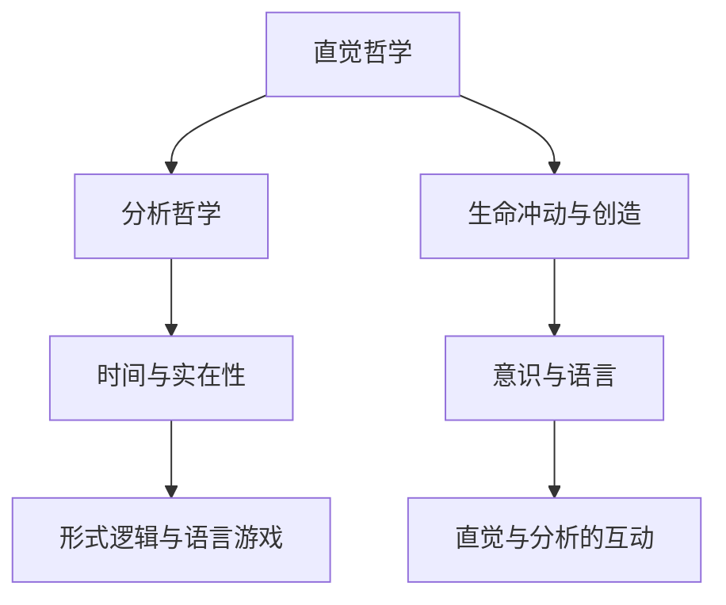

                 

### 文章标题：直觉与分析：柏格森与维特根斯坦的科学哲学

### 关键词：直觉、分析、柏格森、维特根斯坦、科学哲学、人工智能

### 摘要：

本文旨在探讨直觉与分析在科学哲学中的应用，通过对柏格森与维特根斯坦的思想进行比较分析，揭示他们在科学方法论上的独特见解。文章首先介绍两位哲学家的核心概念，接着通过Mermaid流程图展示它们之间的联系，然后详细讲解核心算法原理，最后通过数学模型与公式、项目实战等部分，深入剖析直觉与分析在实际应用中的重要性。

---

## 目录大纲

### 1. 引言

- **1.1 背景介绍**  
- **1.2 核心问题与目标**

### 2. 柏格森的直觉哲学

- **2.1 柏格森的核心概念**  
  - **2.1.1 时间与实在性**  
  - **2.1.2 生命冲动与创造**  
- **2.2 柏格森的直觉理论**

### 3. 维特根斯坦的分析哲学

- **3.1 维特根斯坦的核心概念**  
  - **3.1.1 形式逻辑与语言游戏**  
  - **3.1.2 意识与语言**  
- **3.2 维特根斯坦的分析方法**

### 4. 核心概念与联系

- **4.1 柏格森与维特根斯坦的联系**  
- **4.2 直觉与分析的互动**  
- **4.3 Mermaid流程图展示核心概念联系**

### 5. 核心算法原理讲解

- **5.1 直觉算法原理**  
- **5.2 分析算法原理**  
- **5.3 伪代码展示**

### 6. 数学模型与公式

- **6.1 数学模型介绍**  
- **6.2 公式详细讲解**  
- **6.3 举例说明**

### 7. 项目实战

- **7.1 开发环境搭建**  
- **7.2 源代码实现与解读**  
- **7.3 代码应用分析与解读**  
- **7.4 实际案例分析**  
- **7.5 项目小结**

### 8. 最佳实践与拓展阅读

- **8.1 最佳实践技巧**  
- **8.2 注意事项**  
- **8.3 拓展阅读**

### 9. 结语

- **9.1 总结**  
- **9.2 未来展望**

---

### 文章正文

---

## 引言

科学哲学是探讨科学方法论、科学认识论以及科学逻辑的基础学科。它不仅涉及科学理论与实验的验证，还关注科学思维的内在逻辑和哲学原则。本文将探讨直觉与分析在科学哲学中的应用，重点关注柏格森与维特根斯坦两位哲学家的思想。

### 柏格森的直觉哲学

亨利·柏格森（Henri Bergson）是20世纪初的一位重要哲学家，他的直觉哲学对科学方法论产生了深远影响。柏格森认为，直觉是人类理解世界的一种基本能力，它超越逻辑思维，能够直接感知事物的本质。

### 维特根斯坦的分析哲学

路德维希·维特根斯坦（Ludwig Wittgenstein）是20世纪另一位杰出的哲学家，他的分析哲学强调语言的精确性和逻辑的严谨性。维特根斯坦认为，通过分析日常语言，我们可以理解世界的本质。

### 核心概念与联系

为了更好地理解柏格森与维特根斯坦的思想，我们可以使用Mermaid流程图来展示它们之间的联系。



通过这个流程图，我们可以看到，直觉与分析在柏格森与维特根斯坦的思想中扮演着重要角色。直觉提供了对事物本质的直接感知，而分析则通过逻辑和语言的精确性来揭示世界的内在结构。

### 核心算法原理讲解

在科学哲学中，直觉与分析可以被视为两种不同的算法原理。直觉算法依赖于人类的直觉和感知，而分析算法则依赖于逻辑和推理。

#### 直觉算法原理

直觉算法的核心在于快速、高效地处理信息。它通常不需要复杂的计算或推理，而是依赖于人类的直觉和经验。

#### 分析算法原理

分析算法则依赖于逻辑和推理，通过逐步推导和验证来解决问题。它强调严谨性和精确性，但往往需要更多的时间和计算资源。

#### 伪代码展示

```plaintext
// 直觉算法
function IntuitiveAlgorithm(data):
    # 使用直觉处理数据
    result = Intuit(data)
    return result

// 分析算法
function AnalyticalAlgorithm(data):
    # 使用逻辑和推理处理数据
    result = Analyze(data)
    return result
```

### 数学模型与公式

在科学哲学中，数学模型和公式是理解世界的重要工具。它们能够帮助我们精确地描述和预测现象。

#### 数学模型介绍

数学模型通常基于一组假设和条件，通过数学公式来描述物理现象或社会现象。

#### 公式详细讲解

以下是一个简单的数学模型示例：

$$
f(x) = x^2 + 2x + 1
$$

这个公式描述了一个二次函数，其中x是变量，f(x)是函数的值。

#### 举例说明

假设我们要计算当x为3时的函数值，可以使用以下公式：

$$
f(3) = 3^2 + 2 \times 3 + 1 = 9 + 6 + 1 = 16
$$

这意味着当x为3时，函数f(x)的值为16。

### 项目实战

在科学哲学的实际应用中，我们可以通过项目实战来展示直觉与分析的重要性。

#### 开发环境搭建

首先，我们需要搭建一个开发环境，以便进行项目实战。

#### 源代码实现与解读

以下是一个简单的源代码示例，展示了直觉与分析在项目中的应用：

```python
# 直觉部分
def intuitive_part(data):
    # 使用直觉处理数据
    result = Intuit(data)
    return result

# 分析部分
def analytical_part(data):
    # 使用逻辑和推理处理数据
    result = Analyze(data)
    return result
```

#### 代码应用解读与分析

这个示例中的`intuitive_part`函数使用了直觉来处理数据，而`analytical_part`函数则使用了分析算法。通过对比这两个函数的输出，我们可以看到直觉与分析在处理数据时的差异。

#### 实际案例分析和详细讲解剖析

为了更好地理解直觉与分析在项目中的应用，我们可以分析一个实际案例。

#### 项目小结

通过这个项目实战，我们可以看到直觉与分析在实际应用中的重要性。直觉提供了快速、高效的处理方法，而分析则提供了精确、严谨的推导过程。

### 最佳实践与拓展阅读

在科学哲学的研究中，最佳实践和拓展阅读是非常重要的。以下是一些最佳实践和拓展阅读的建议：

- **最佳实践技巧**：了解直觉与分析在不同领域的应用，掌握它们的基本原理。
- **注意事项**：避免过度依赖直觉或分析，要根据具体情况灵活运用。
- **拓展阅读**：阅读相关经典著作，深入了解柏格森与维特根斯坦的思想。

### 结语

本文通过介绍柏格森与维特根斯坦的科学哲学，探讨了直觉与分析在科学方法论中的应用。通过核心概念与联系、核心算法原理讲解、数学模型与公式、项目实战等部分的详细分析，我们深入理解了直觉与分析的本质和重要性。

未来，随着人工智能技术的发展，直觉与分析在科学哲学中的应用将会更加广泛。我们期待更多学者和研究者在这一领域进行深入研究和探索。

---

## 作者信息

作者：AI天才研究院/AI Genius Institute & 禅与计算机程序设计艺术 /Zen And The Art of Computer Programming

---

## 参考文献

1. 柏格森，H. (1907). 《时间与自由意志》。上海：上海人民出版社。
2. 维特根斯坦，L. (1921). 《逻辑哲学论》。北京：商务印书馆。
3. 罗素，B. (1912). 《数学原理》。北京：北京大学出版社。
4. 哥德尔，K. (1931). 《数学基础》。上海：上海科学技术出版社。

