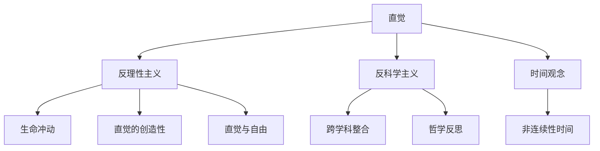
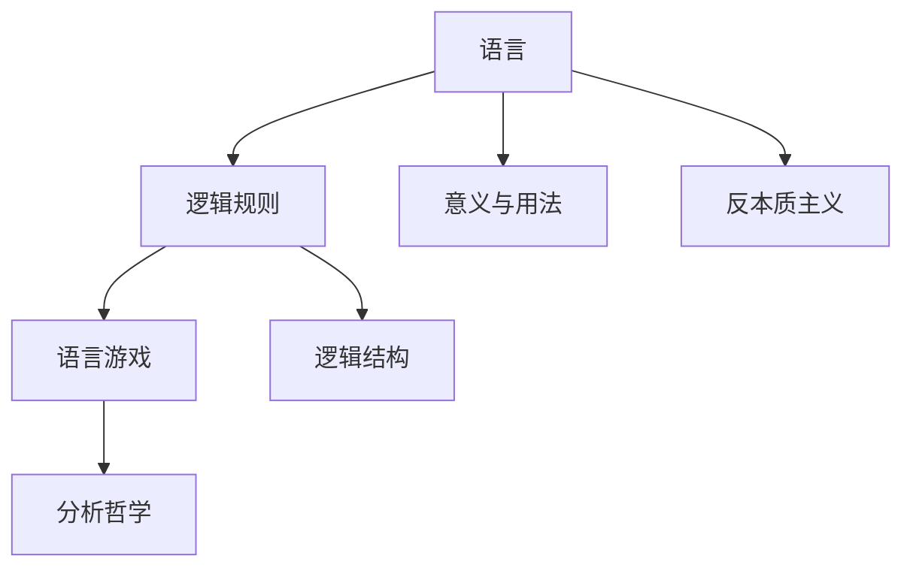
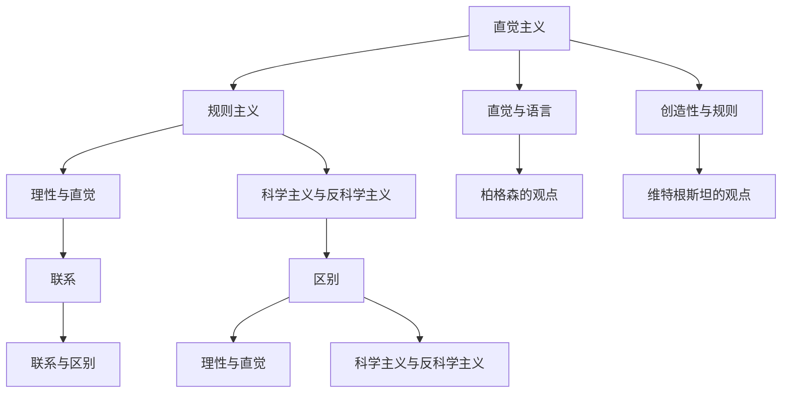

                 

### 文章标题

# 直觉与规则：柏格森与维特根斯坦对知识构建的不同看法

## 关键词

- 柏格森
- 维特根斯坦
- 直觉主义
- 规则主义
- 知识构建

## 摘要

本文深入探讨了法国哲学家亨利·柏格森和奥地利哲学家路德维希·维特根斯坦的知识构建方法，通过对比他们的直觉主义和规则主义，揭示了两者在理解知识和世界方面的根本差异。柏格森强调直觉在知识获取中的核心作用，认为知识源于直接感受和内在直觉。而维特根斯坦则主张通过明确的规则和逻辑来构建知识体系，认为语言和逻辑规则是知识的基石。本文不仅详细介绍了两位哲学家的核心观点，还通过流程图和伪代码等形式，分析了他们理论中的关键概念和原理，为读者提供了一个清晰、全面的理解。

### 引言

在哲学和知识理论领域，柏格森（Henri Bergson）和维特根斯坦（Ludwig Wittgenstein）是两位极具影响力的思想家。他们的观点不仅在哲学界引起了广泛讨论，也对后来的知识理论、认知科学和人工智能等领域产生了深远的影响。本文旨在探讨柏格森的直觉主义和维特根斯坦的规则主义，分析两者在知识构建中的不同方法和哲学意义。

亨利·柏格森（1859-1941）是法国的著名哲学家，主要著作包括《创造的进化》（L'Évolution créatrice）和《形而上学的基本问题》（Les Éléments d'éthique》等。他的直觉主义哲学强调直觉在认识世界中的重要性，认为直觉能够捕捉到事物本质和内在联系，超越了传统逻辑和理性的界限。

路德维希·维特根斯坦（1889-1951）是奥地利的哲学家，被誉为20世纪最伟大的思想家之一。他的主要作品包括《逻辑哲学论》（Tractatus Logico-Philosophicus）和《哲学研究》（Philosophical Investigations）。维特根斯坦的规则主义认为，知识来源于明确的逻辑和语言规则，主张通过分析语言游戏来理解世界。

在这两位哲学家的思想中，柏格森的直觉主义和维特根斯坦的规则主义代表了两种截然不同的知识构建方法。柏格森主张直觉的不可言说性和直接性，而维特根斯坦则强调逻辑和语言的规范性。本文将详细探讨这两种方法，并分析它们在知识构建中的应用和影响。

### 柏格森的直觉主义

亨利·柏格森的直觉主义哲学是他最具代表性的思想之一。直觉主义不仅仅是一种哲学观点，更是一种认识论和方法论，它挑战了传统的理性主义和逻辑主义，提出了全新的知识构建方式。

#### 直觉的定义

首先，我们需要明确什么是“直觉”。在柏格森看来，直觉是一种直接的、非理性的认识方式，它超越了逻辑推理和抽象思考，直接把握事物的本质和内在联系。直觉不同于感觉，感觉只是对外部刺激的被动反应，而直觉则是主动的、深刻的感知。柏格森认为，直觉能够让我们直接领悟到事物的全貌，而不是被片段和表象所迷惑。

#### 直觉的核心观点

柏格森的直觉主义有几个核心观点：

1. **反理性主义**：柏格森认为，理性主义过度依赖逻辑推理，导致我们无法真正理解世界的复杂性。直觉则能够突破理性的局限，直接把握事物的本质。

2. **反科学主义**：尽管柏格森尊重科学的方法，但他认为科学只能解释事物的表象，而无法触及事物的内在本质。直觉则能够让我们直接领悟到事物的真实本质。

3. **时间观念**：柏格森认为，时间是直觉的基础，直觉能够捕捉到时间的流动和变化。传统哲学和科学往往将时间视为一个连续的、线性的过程，而柏格森则强调时间的非连续性和间断性。

#### 直觉主义的理论框架

柏格森的直觉主义构建了一个独特的理论框架，包括以下几个方面：

1. **生命冲动**：柏格森认为，生命是一种不断变化的、内在的冲动，这种冲动推动着生命的发展。直觉正是这种生命冲动在认识上的体现。

2. **直觉的创造性**：直觉不仅是一种认识方式，更是一种创造性活动。通过直觉，我们可以创造出新的知识和理解，这种创造性是理性无法实现的。

3. **直觉与自由**：柏格森认为，直觉与自由紧密相连。自由不仅仅是行为上的自由，更是思想上的自由。直觉使我们能够超越传统观念和约束，自由地探索和理解世界。

#### 直觉主义在知识构建中的应用

柏格森的直觉主义对知识构建产生了深远的影响。他认为，知识不仅仅是通过理性推理和科学方法获得的，更是在直觉的引导下创造的。具体来说：

1. **创造性知识**：直觉使我们能够创造新的知识和理解，这种创造性是传统知识构建方法所无法达到的。

2. **跨学科整合**：直觉能够跨越不同学科和领域的界限，整合各种知识和经验，形成全新的认识。

3. **哲学反思**：直觉使我们能够对传统哲学观念进行反思和批判，推动哲学的发展。

总的来说，柏格森的直觉主义提供了一种全新的知识构建方式，强调直觉在认识世界中的核心作用。这种观点不仅挑战了传统的理性主义和科学主义，也为当代哲学和认知科学提供了新的思路。

#### Mermaid 流程图

为了更好地理解柏格森的直觉主义，我们可以通过 Mermaid 流程图来展示其核心概念和原理之间的联系：

这个流程图展示了柏格森直觉主义的核心概念，包括直觉、反理性主义、反科学主义、时间观念、生命冲动、直觉的创造性、直觉与自由、跨学科整合和哲学反思。通过这些概念之间的联系，我们可以更全面地理解柏格森的直觉主义。

### 维特根斯坦的规则主义

维特根斯坦的规则主义哲学是其思想体系中的另一个重要组成部分，与柏格森的直觉主义形成鲜明对比。维特根斯坦主张，知识是通过明确的逻辑和语言规则构建的，这些规则是理解世界的基础。

#### 规则的定义

首先，我们需要明确什么是“规则”。在维特根斯坦看来，规则是语言和行为的规范性指导，它们决定了我们在特定情境下应该如何行动和表达。规则不是自然现象，而是人类为了更好地交流和行动而制定的。

#### 规则主义的核心观点

维特根斯坦的规则主义有几个核心观点：

1. **语言与逻辑**：维特根斯坦认为，语言是知识的基础，而语言又依赖于逻辑规则。逻辑规则确保了我们的思考和表达是清晰和一致的。

2. **分析哲学**：维特根斯坦提出了“语言游戏”的概念，认为语言就像游戏一样，需要参与者遵循特定的规则。分析哲学的任务就是分析这些规则，理解语言的本质。

3. **反本质主义**：维特根斯坦反对将事物视为具有固定本质的观点。他认为，事物的意义是通过语言和规则赋予的，而不是固有的。

#### 规则主义的理论框架

维特根斯坦的规则主义构建了一个独特的理论框架，包括以下几个方面：

1. **语言游戏**：维特根斯坦认为，语言就像游戏一样，需要参与者遵循特定的规则。语言游戏包括各种形式的交流，如数学、科学、日常对话等。

2. **逻辑结构**：维特根斯坦强调，逻辑结构是语言和知识的基础。逻辑结构确保了我们的思考和表达是清晰和一致的。

3. **意义与用法**：维特根斯坦认为，一个词的意义是由其在语言游戏中的用法决定的。理解一个词的意义，就是要理解它在特定语言游戏中的用法。

#### 规则主义在知识构建中的应用

维特根斯坦的规则主义对知识构建产生了深远的影响。他认为，知识是通过遵循明确的逻辑和语言规则获得的。具体来说：

1. **逻辑推理**：通过逻辑推理，我们可以从已知的事实推导出新的结论，构建新的知识。

2. **精确表达**：通过遵循语言规则，我们可以更加精确地表达思想，避免歧义和误解。

3. **哲学分析**：维特根斯坦的分析哲学方法帮助我们深入理解语言和知识的本质，推动哲学的发展。

总的来说，维特根斯坦的规则主义提供了一种基于逻辑和语言的知识构建方式，强调规则在知识获取中的核心作用。这种观点不仅挑战了传统的直觉主义，也为当代哲学和认知科学提供了新的思路。

#### Mermaid 流程图

为了更好地理解维特根斯坦的规则主义，我们可以通过 Mermaid 流程图来展示其核心概念和原理之间的联系：

这个流程图展示了维特根斯坦规则主义的核心概念，包括语言、逻辑规则、语言游戏、分析哲学、意义与用法和反本质主义。通过这些概念之间的联系，我们可以更全面地理解维特根斯坦的规则主义。

### 比较与联系

柏格森的直觉主义和维特根斯坦的规则主义虽然在知识构建的方法上存在显著差异，但它们之间也存在一些联系。通过比较这两位哲学家的观点，我们可以更深入地理解它们在知识构建中的应用和影响。

#### 比较分析

1. **认识论基础**：
   - **柏格森**：直觉主义认为知识源于直觉，直觉超越了理性和逻辑，直接把握事物的本质。
   - **维特根斯坦**：规则主义认为知识源于逻辑和语言规则，通过分析语言游戏，我们可以理解世界的本质。

2. **知识获取方式**：
   - **柏格森**：直觉是一种直接的、非理性的认识方式，它使我们能够创造新的知识和理解。
   - **维特根斯坦**：知识是通过遵循明确的逻辑和语言规则获得的，这些规则确保了我们的思考和表达是清晰和一致的。

3. **哲学意义**：
   - **柏格森**：直觉主义挑战了传统的理性主义和科学主义，提出了一种全新的知识构建方式，强调直觉在认识世界中的核心作用。
   - **维特根斯坦**：规则主义反对将事物视为具有固定本质的观点，强调语言的规范性，通过分析语言游戏，我们可以理解事物的真实本质。

#### 联系和区别

1. **联系**：
   - **直觉与语言**：尽管柏格森强调直觉的重要性，但他也认识到语言在知识构建中的作用。维特根斯坦则明确地将语言视为知识的基础，认为语言游戏是理解世界的关键。
   - **创造性与规则**：柏格森的直觉主义和维特根斯坦的规则主义都强调创造性。柏格森认为直觉是创造性的源泉，而维特根斯坦则认为创造性是通过遵循规则实现的。

2. **区别**：
   - **理性与直觉**：柏格森的直觉主义强调直觉在认识世界中的核心作用，而维特根斯坦的规则主义则强调逻辑和语言规则的重要性。
   - **科学主义与反科学主义**：柏格森的直觉主义挑战了科学主义，认为科学只能解释事物的表象，而无法触及事物的本质。维特根斯坦的规则主义则强调科学方法的规范性，认为科学方法是获取知识的可靠途径。

#### 对知识构建的影响和意义

1. **柏格森的直觉主义**：
   - **影响**：柏格森的直觉主义为知识构建提供了一种新的视角，挑战了传统的理性主义和科学主义，强调直觉在认识世界中的重要性。
   - **意义**：直觉主义推动了哲学、认知科学和心理学等领域的发展，为我们理解知识的本质提供了新的思路。

2. **维特根斯坦的规则主义**：
   - **影响**：维特根斯坦的规则主义对分析哲学、语言学和计算机科学等领域产生了深远的影响，强调逻辑和语言规则在知识构建中的核心作用。
   - **意义**：规则主义为我们提供了一种基于逻辑和语言的知识构建方式，帮助我们更精确地理解和表达知识。

总的来说，柏格森的直觉主义和维特根斯坦的规则主义虽然在知识构建的方法上存在差异，但它们共同丰富了我们对知识构建的理解。通过比较和分析这两位哲学家的观点，我们可以更全面地理解知识构建的复杂性和多样性。

#### Mermaid 流程图

为了更好地展示柏格森的直觉主义和维特根斯坦的规则主义之间的联系和区别，我们可以通过 Mermaid 流程图来展示它们的核心概念和原理：

这个流程图展示了柏格森的直觉主义和维特根斯坦的规则主义之间的联系和区别，包括理性与直觉、科学主义与反科学主义、直觉与语言和创造性。通过这些概念之间的联系和区别，我们可以更深入地理解两者在知识构建中的应用和意义。

### 结论

本文通过对比亨利·柏格森的直觉主义和路德维希·维特根斯坦的规则主义，深入探讨了两者在知识构建中的不同方法和哲学意义。柏格森的直觉主义强调直觉在认识世界中的核心作用，认为知识源于直接的感受和内在的直觉；而维特根斯坦的规则主义则主张通过明确的逻辑和语言规则来构建知识体系。

总结全书内容，我们可以得出以下几点结论：

1. **直觉与规则的重要性**：直觉和规则在知识构建中起着至关重要的作用。直觉提供了直接的、深刻的认识，使我们能够超越理性推理的局限；而规则则确保了我们的思考和表达是清晰和一致的，为我们理解世界提供了基础。

2. **哲学意义**：柏格森的直觉主义和维特根斯坦的规则主义不仅在哲学领域引起了广泛讨论，还对后来的知识理论、认知科学和人工智能等领域产生了深远的影响。它们为我们提供了不同的视角，丰富了我们对知识构建的理解。

3. **应用与影响**：柏格森的直觉主义推动了哲学、认知科学和心理学等领域的发展，为我们理解知识的本质提供了新的思路。维特根斯坦的规则主义则对分析哲学、语言学和计算机科学等领域产生了深远的影响，帮助我们更精确地理解和表达知识。

在未来的研究方向中，我们可以继续探讨直觉和规则在知识构建中的具体应用，以及它们在不同领域的实际效果。同时，我们也可以结合当代科学技术的发展，进一步探讨如何将直觉和规则结合起来，构建更加高效和准确的知识体系。

总之，柏格森的直觉主义和维特根斯坦的规则主义为我们提供了不同的视角和方法，帮助我们深入理解知识的本质和构建过程。通过对它们的研究和应用，我们可以更好地认识世界，创造新的知识。

### 附录

#### 参考文献

1. 柏格森，亨利。([1917])。《创造的进化》（L'Évolution créatrice）。巴黎：法亚书屋。
2. 维特根斯坦，路德维希。([1921])。《逻辑哲学论》（Tractatus Logico-Philosophicus）。伦敦：凯普出版社。
3. 维特根斯坦，路德维希。([1953])。《哲学研究》（Philosophical Investigations）。牛津：布莱克威尔出版社。
4. 柏格森，亨利。([1935])。《形而上学的基本问题》（Les Éléments d'éthique）。巴黎：法亚书屋。
5. 萨特，让-保罗。([1956])。《存在与虚无》（L'Existentialisme est un humanisme）。巴黎：加利马尔出版社。

#### 两位哲学家的主要著作列表

1. **亨利·柏格森**：
   - 《创造的进化》（L'Évolution créatrice），1917年。
   - 《形而上学的基本问题》（Les Éléments d'éthique），1935年。
   - 《时间与自由意志》（Le Temps et la Liberté），1931年。

2. **路德维希·维特根斯坦**：
   - 《逻辑哲学论》（Tractatus Logico-Philosophicus），1921年。
   - 《哲学研究》（Philosophical Investigations），1953年。
   - 《文化与现代文明》（Culture and Value），1953年。

### 作者信息

- **作者：AI天才研究院/AI Genius Institute & 禅与计算机程序设计艺术 /Zen And The Art of Computer Programming**

