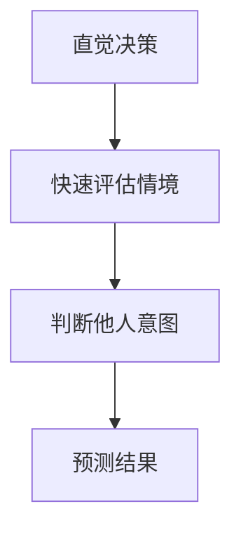
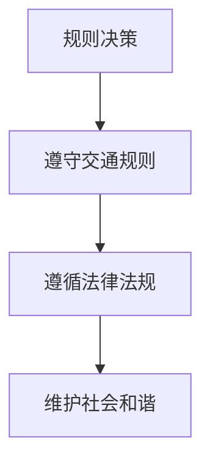
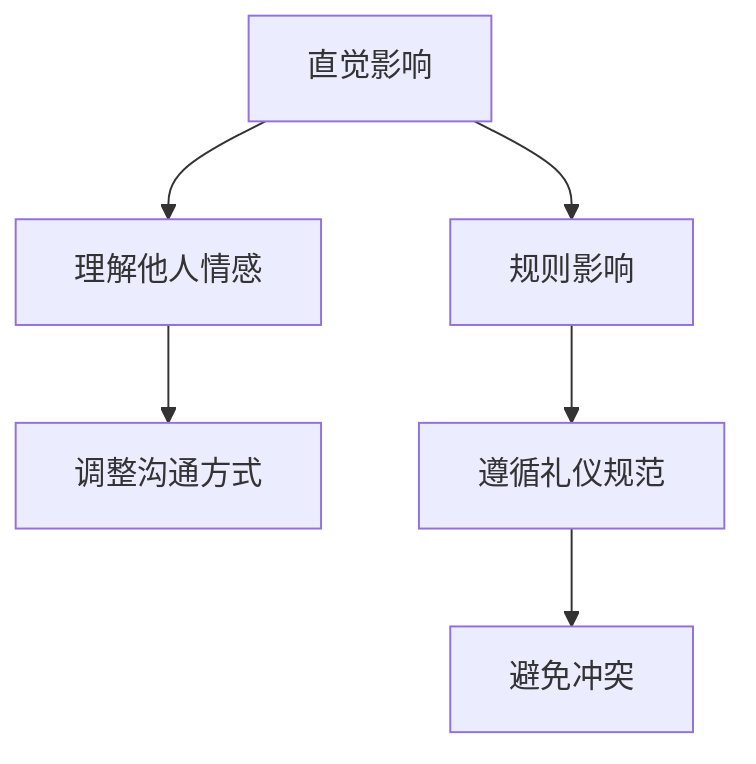

                 

### 文章标题

# 直觉与规则：柏格森与维特根斯坦对知识获取的不同看法

### 关键词

- **柏格森**，**维特根斯坦**，**直觉主义**，**语言哲学**，**知识获取**，**规则性知识**，**创造性知识**

### 摘要

本文探讨了法国哲学家柏格森和奥地利哲学家维特根斯坦在知识获取方面的不同看法。柏格森强调直觉在知识获取中的核心作用，认为直觉是一种直接洞察现实的能力。而维特根斯坦则主张通过语言和规则来理解世界，强调逻辑和规则的系统性。本文将详细分析两位哲学家的知识观，探讨直觉与规则在知识获取中的角色，并讨论其对现代哲学和实际应用的启示。

## 引言

在人类探索世界的历程中，知识获取的方式一直是一个重要的议题。自古以来，哲学家们就不断地思考：知识是如何产生的？我们如何确信我们所拥有的知识是真实和可靠的？在这一过程中，柏格森和维特根斯坦两位哲学家提出了截然不同的观点。

## 1. 知识获取：柏格森与维特根斯坦的分歧

### 1.1 柏格森的知识观

### 1.1.1 柏格森的直觉主义

#### 1.1.1.1 直觉的本质

柏格森认为，直觉是一种直接洞察现实的能力，它超越了逻辑推理和概念化的思考。直觉能够捕捉到事物内在的本质和动力，使我们能够理解世界的真实状态。

#### 1.1.1.2 直觉与知识的关系

在柏格森看来，直觉是知识的基础。通过直觉，我们能够直接感知现实，从而获得真正的知识。直觉与知识的关系是本质与现象的关系，直觉能够揭示现象背后的本质。

#### 1.1.1.3 直觉主义的哲学基础

柏格森的直觉主义哲学基础在于对传统哲学思维方式的批判。他认为，传统的逻辑思维和理性推理方法无法真正揭示世界的本质，而直觉则能够提供一种更直接、更深刻的认识方式。

### 1.2 维特根斯坦的知识观

### 1.2.1 维特根斯坦的语言哲学

维特根斯坦的语言哲学强调语言与现实的关系。他认为，语言是思维的工具，是我们理解世界的方式。通过语言，我们能够将现实概念化，从而获得知识。

#### 1.2.1.1 语言与现实的关系

维特根斯坦认为，语言与现实之间存在一种对应关系。每个词都对应一个现实中的对象或概念，语言的作用就是将现实映射到我们的意识中。

#### 1.2.1.2 符号与意义

在维特根斯坦看来，符号与意义的关系是语言的核心问题。符号的意义是由使用规则所决定的，只有遵循这些规则，我们才能正确地理解和运用语言。

#### 1.2.1.3 规则与知识

维特根斯坦认为，知识是通过遵循规则而获得的。这些规则可以是逻辑规则、语法规则，也可以是其他形式的社会规则。通过遵循规则，我们能够获得关于世界的可靠知识。

### 1.3 柏格森与维特根斯坦的知识观对比

#### 1.3.1 直觉与语言的对比

柏格森的直觉主义与维特根斯坦的语言哲学在知识获取方式上存在显著差异。柏格森强调直觉的直接性和创造性，而维特根斯坦则强调语言的系统性和规则性。

#### 1.3.2 直觉与知识的本质

柏格森认为直觉是知识的基础，通过直觉我们能够直接感知现实。而维特根斯坦则认为，知识是通过遵循规则而获得的，语言是获取知识的工具。

### 2. 柏格森与维特根斯坦的知识获取路径对比

#### 2.1 直觉与规则的对比

#### 2.1.1 直觉获取知识的优势

- **直观性**：直觉能够直接感知现实，无需经过复杂的逻辑推理过程。
- **创造性**：直觉能够揭示新的现象和关系，具有创造性。
- **应用范围**：直觉在创造性思维和艺术创作中具有广泛的应用。

#### 2.1.2 规则获取知识的优势

- **确定性**：规则能够提供明确的知识，使我们能够可靠地理解和运用。
- **系统性**：规则具有系统性，能够形成一个完整的知识体系。
- **应用领域**：规则在科学研究和工程实践中具有广泛的应用。

#### 2.1.3 柏格森与维特根斯坦的哲学分歧

- **对语言的理解**：柏格森认为语言是次要的，直觉是知识的基础；而维特根斯坦则认为语言是思维的工具，知识是通过语言获得的。
- **对知识的认识**：柏格森认为直觉能够直接获取真正的知识；而维特根斯坦则认为知识是通过遵循规则而获得的。
- **对现实的解释**：柏格森强调直觉能够揭示现实的真实状态；而维特根斯坦则强调语言能够将现实概念化，从而获得知识。

### 3. 柏格森与维特根斯坦知识观的影响与应用

#### 3.1 柏格森的知识观对现代哲学的影响

#### 3.1.1 直觉主义在当代哲学中的地位

柏格森的直觉主义在当代哲学中仍然具有重要地位，对认识论、伦理学和美学产生了深远影响。

#### 3.1.2 直觉主义对认识论的影响

柏格森的直觉主义对认识论的发展提出了新的挑战。他强调直觉能够直接获取真正的知识，这对传统的理性主义认识论产生了冲击。

#### 3.1.3 直觉主义对伦理学的影响

柏格森的直觉主义也对伦理学产生了影响。他强调道德判断应该基于直觉，而非逻辑推理，这为伦理学提供了一种新的视角。

#### 3.1.4 直觉主义对美学的影响

柏格森的直觉主义对美学也产生了重要影响。他强调艺术创作中的直觉作用，为美学研究提供了一种新的方法。

#### 3.2 维特根斯坦的知识观对现代哲学的影响

#### 3.2.1 语言哲学在当代哲学中的地位

维特根斯坦的语言哲学在当代哲学中具有举足轻重的地位，对逻辑学、心理学和语言学产生了深远影响。

#### 3.2.2 语言哲学对逻辑学的影响

维特根斯坦的语言哲学对逻辑学的发展提出了新的挑战。他强调逻辑规则的重要性，使逻辑学从形式主义转向语言哲学。

#### 3.2.3 语言哲学对心理学的影响

维特根斯坦的语言哲学也对心理学产生了影响。他强调语言在思维和认知中的作用，为心理学研究提供了一种新的视角。

#### 3.2.4 语言哲学对语言学的影响

维特根斯坦的语言哲学对语言学的发展也产生了重要影响。他强调语言与现实之间的关系，为语言学研究提供了一种新的理论框架。

### 4. 柏格森与维特根斯坦知识观在实际应用中的体现

#### 4.1 在科学研究中的应用

柏格森的直觉主义和维特根斯坦的规则性知识在科学研究中都有广泛的应用。

#### 4.1.1 科学研究中的直觉运用

直觉在科学研究中扮演着重要角色。科学家通过直觉来发现新的现象、提出新的假设，从而推动科学的发展。

#### 4.1.2 科学研究中的规则运用

规则在科学研究中同样至关重要。科学家遵循逻辑规则、实验规则和社会规则，从而确保科学研究的可靠性和系统性。

#### 4.1.3 直觉与规则在科学创新中的作用

直觉与规则在科学创新中相互作用，共同推动科学的发展。直觉提供了新的思路和创意，而规则则确保这些思路和创意能够被有效地实现。

#### 4.2 在日常生活中的应用

柏格森的直觉主义和维特根斯坦的规则性知识在日常生活中的应用同样广泛。

#### 4.2.1 直觉在生活决策中的作用

直觉在我们的生活决策中发挥着重要作用。我们通过直觉来判断一个人是否值得信任、一个决策是否明智。

#### 4.2.2 规则在生活决策中的作用

规则在我们的生活决策中也具有重要作用。我们遵循社会规则、道德规则，从而确保我们的行为符合社会的期望。

#### 4.2.3 直觉与规则在人际关系中的影响

直觉与规则在人际关系中同样具有重要意义。我们通过直觉来判断一个人是否真诚，通过规则来维护和谐的人际关系。

### 5. 总结

柏格森与维特根斯坦的知识观为我们提供了两种不同的视角来理解世界。直觉主义强调直接感知现实，而规则性知识强调通过语言和规则来理解世界。这两种知识观各有优势，也各有局限。在实际应用中，直觉与规则相互补充，共同推动我们的认知和行为。本文通过对柏格森与维特根斯坦知识观的探讨，希望能够为读者提供一种更加全面和深刻的理解。

### 柏格森的知识观：直觉主义的哲学基础

柏格森（Henri Bergson）是20世纪初法国最重要的哲学家之一，他的哲学思想对现代哲学产生了深远的影响。柏格森的知识观建立在直觉主义的基础上，认为直觉是人类获取真正知识的唯一途径。在探讨柏格森的知识观之前，我们需要了解直觉主义的核心概念。

#### 直觉的本质

柏格森认为，直觉是一种直接洞察现实的能力，它超越了逻辑推理和概念化的思考。直觉不仅是一种感知过程，更是一种理解过程。通过直觉，我们能够直接感知事物的本质，而不仅仅是表象。直觉是一种非线性的、创造性的认知方式，它能够捕捉到事物内在的动力和关系。

#### 直觉与知识的关系

在柏格森看来，直觉是知识的基础。通过直觉，我们能够直接感知现实，从而获得真正的知识。直觉与知识的关系是本质与现象的关系。现象是直觉的产物，而本质则是直觉所揭示的。直觉能够帮助我们超越表面现象，洞察事物的本质。

#### 直觉主义的哲学基础

柏格森的直觉主义哲学基础在于对传统哲学思维方式的批判。他认为，传统的逻辑思维和理性推理方法无法真正揭示世界的本质，而直觉则能够提供一种更直接、更深刻的认识方式。柏格森认为，理性思维是一种静态的、机械的思维模式，它无法捕捉到动态的现实。相比之下，直觉则能够动态地适应现实的变化，从而更好地理解世界。

#### 柏格森对理性思维的批判

柏格森对理性思维的批判主要表现在以下几个方面：

1. **静态的视角**：理性思维倾向于将现实视为静态的、可分解的。然而，现实是动态的、流动的，不断变化和发展的。

2. **形式的逻辑**：理性思维强调形式逻辑和抽象概念，忽视了现实的具体性和个体性。

3. **无意识的忽视**：理性思维忽视了无意识的作用，而柏格森认为，无意识是直觉的重要组成部分，它能够帮助我们捕捉到现实中的细微变化。

#### 柏格森对直觉的强调

柏格森认为，直觉是人类特有的能力，它能够超越逻辑推理和理性思维，直接感知现实。直觉不仅是一种认知方式，更是一种生活方式。通过直觉，我们能够更好地理解生命、自然和宇宙。柏格森强调，直觉是一种内在的、自发的活动，它不是通过外在的刺激，而是通过内在的感知和体验获得的。

#### 直觉主义的实践意义

柏格森的直觉主义对现代哲学和实际生活具有重要的实践意义。首先，它为我们提供了一种新的认识方式，使我们能够更好地理解动态的现实。其次，直觉主义鼓励我们关注个体体验和情感，使我们能够更加深刻地理解自己和他人。最后，直觉主义也启示我们，在追求知识和真理的过程中，不应该过分依赖理性思维，而应该更多地关注直觉和内在体验。

总之，柏格森的知识观建立在直觉主义的基础上，认为直觉是人类获取真正知识的唯一途径。他的思想对现代哲学和实际生活产生了深远的影响，为我们提供了一种新的认识视角。

### 维特根斯坦的知识观：语言哲学的核心理念

路德维希·维特根斯坦（Ludwig Wittgenstein）是20世纪最具影响力的哲学家之一，他的思想对语言哲学、认识论和逻辑学产生了深远的影响。维特根斯坦的知识观主要建立在语言哲学的基础上，强调语言在知识获取中的核心作用。在探讨维特根斯坦的知识观之前，我们需要了解语言哲学的基本概念。

#### 语言与现实的关系

维特根斯坦认为，语言是思维的工具，是我们理解世界的方式。语言与现实之间存在一种对应关系，每个词都对应一个现实中的对象或概念。通过语言，我们能够将现实概念化，从而获得知识。维特根斯坦认为，语言与现实的关系是图像关系，即语言能够映射现实，使我们能够理解现实。

#### 符号与意义

在维特根斯坦看来，符号与意义的关系是语言哲学的核心问题。符号的意义并不是固定不变的，而是由使用规则所决定的。符号的意义在于其在特定语境中的用法，只有遵循这些规则，我们才能正确地理解和运用语言。维特根斯坦提出了“意义即使用”（meaning is use）的观点，认为符号的意义在于其在实际生活中的具体应用。

#### 规则与知识

维特根斯坦认为，知识是通过遵循规则而获得的。这些规则可以是逻辑规则、语法规则，也可以是其他形式的社会规则。通过遵循规则，我们能够获得关于世界的可靠知识。维特根斯坦提出了“规则决定知识”（rules determine knowledge）的观点，强调规则在知识获取中的重要性。

#### 维特根斯坦的语言哲学观点

1. **日常语言哲学**：维特根斯坦的早期作品《逻辑哲学论》主张，哲学问题源于我们对语言的使用不当。他认为，许多哲学问题实际上是由于语言误用而引起的。维特根斯坦提出了“语言游戏”（language game）的概念，认为语言使用就像游戏一样，需要遵循特定的规则。通过正确使用语言，我们能够解决哲学问题。

2. **哲学分析**：维特根斯坦的哲学方法强调通过分析语言的实际使用来解决问题。他认为，哲学的任务不是提供抽象的哲学理论，而是通过澄清概念和语言的用法，揭示语言背后的实际关系。

3. **语言哲学的转向**：维特根斯坦的后期作品《哲学研究》提出了与早期作品截然不同的观点。他主张，哲学的任务是揭示语言的实际用法，而不是构建抽象的理论。维特根斯坦提出了“家族相似性”（family resemblance）的概念，认为语言的意义是通过一系列的相似性关系来确定的。

#### 维特根斯坦对知识的认识

维特根斯坦认为，知识是通过感知和经验获得的。他认为，我们通过感知世界，将现实概念化，并通过语言来交流这些概念。知识不仅仅是一种抽象的理论，更是一种具体的、实际的经验。维特根斯坦强调，知识的获得依赖于我们对现实的直接感知，而不是通过逻辑推理或抽象概念。

#### 维特根斯坦的哲学贡献

维特根斯坦的哲学贡献在于他对语言、思维和知识的深刻理解。他的思想为我们提供了一种新的视角来理解世界，强调了语言在知识获取中的核心作用。维特根斯坦的哲学方法也为我们提供了一种新的哲学思维方式，即通过分析语言的实际使用来解决问题。

总之，维特根斯坦的知识观建立在语言哲学的基础上，强调语言在知识获取中的核心作用。他的思想对现代哲学和实际生活产生了深远的影响，为我们提供了一种新的认识视角。

### 柏格森与维特根斯坦的知识获取路径对比

在探讨柏格森和维特根斯坦的知识获取路径时，我们需要关注他们各自的理论框架以及这些理论在不同场景中的应用。柏格森的直觉主义和维特根斯坦的语言哲学在知识获取方面有着显著的不同，二者在直观性、系统性以及应用领域上各有优势和局限。

#### 直觉获取知识的优势

1. **直观性**：柏格森的直觉主义强调直观性，认为直觉能够直接感知现实，而不需要通过复杂的逻辑推理。直觉提供了对现实事物的直接感知，使人们能够迅速做出判断和决策。

    ```mermaid
    graph TB
    A[直观性] --> B[快速感知]
    B --> C[减少逻辑推理步骤]
    C --> D[提高决策效率]
    ```

2. **创造性**：直觉不仅能够帮助人们快速感知现实，还能够激发创造性思维。直觉能够捕捉到事物内在的动力和关系，从而促进新的想法和创新的产生。

    ```mermaid
    graph TB
    A[创造性] --> B[新想法的产生]
    B --> C[创新思维的激发]
    C --> D[推动科技发展]
    ```

3. **应用范围**：直觉在艺术创作、科学研究、日常生活决策等多个领域具有广泛的应用。在艺术创作中，直觉帮助艺术家捕捉灵感；在科学研究中，直觉帮助科学家发现新的现象和假设；在日常生活中，直觉帮助人们做出快速、明智的决策。

    ```mermaid
    graph TB
    A[应用范围] --> B[艺术创作]
    B --> C[科学研究]
    C --> D[日常生活决策]
    ```

#### 规则获取知识的优势

1. **确定性**：维特根斯坦的语言哲学强调规则的重要性，认为规则能够提供明确的知识。遵循规则能够确保我们获得的知识是可靠和一致的，减少了不确定性。

    ```mermaid
    graph TB
    A[确定性] --> B[可靠的知识]
    B --> C[减少错误]
    C --> D[确保一致性]
    ```

2. **系统性**：规则具有系统性，能够形成一个完整的知识体系。通过遵循规则，我们能够系统地理解和运用知识，从而更好地掌握事物的本质。

    ```mermaid
    graph TB
    A[系统性] --> B[完整知识体系]
    B --> C[深入理解]
    C --> D[系统应用]
    ```

3. **应用领域**：规则在科学研究和工程实践中具有广泛的应用。科学家遵循逻辑规则、实验规则和社会规则，确保科学研究的可靠性和系统性；工程师则通过遵循设计规则和技术规范，实现工程项目的成功。

    ```mermaid
    graph TB
    A[应用领域] --> B[科学研究]
    B --> C[工程实践]
    C --> D[技术创新]
    ```

#### 柏格森与维特根斯坦的哲学分歧

1. **对语言的理解**：柏格森认为语言是次要的，直觉是知识的基础；而维特根斯坦则认为语言是思维的工具，知识是通过语言获得的。

    ```mermaid
    graph TB
    A[柏格森] --> B[直觉为主]
    B --> C[语言为辅]
    C --> D[强调直接感知]
    
    A --> E[维特根斯坦]
    E --> F[语言为主]
    F --> G[强调规则性知识]
    ```

2. **对知识的认识**：柏格森认为直觉能够直接获取真正的知识；而维特根斯坦则认为知识是通过遵循规则而获得的。

    ```mermaid
    graph TB
    A[柏格森] --> B[直觉获取知识]
    B --> C[真实知识]
    
    A --> E[维特根斯坦]
    E --> F[规则获取知识]
    F --> G[可靠知识]
    ```

3. **对现实的解释**：柏格森强调直觉能够揭示现实的真实状态；而维特根斯坦则强调语言能够将现实概念化，从而获得知识。

    ```mermaid
    graph TB
    A[柏格森] --> B[直觉揭示现实]
    B --> C[真实状态]
    
    A --> E[维特根斯坦]
    E --> F[语言概念化现实]
    F --> G[理解现实]
    ```

总之，柏格森与维特根斯坦的知识获取路径在直观性、系统性和应用领域上各有优势和局限。柏格森的直觉主义强调直接感知现实，具有直观性和创造性；而维特根斯坦的语言哲学则强调规则的重要性，具有确定性和系统性。在实际应用中，直觉与规则相互补充，共同推动我们的认知和行为。通过理解两位哲学家的知识观，我们可以更好地把握知识获取的多样性和复杂性。

### 2.2.1 直觉主义与语言哲学的对立

柏格森的直觉主义与维特根斯坦的语言哲学在哲学基础上存在显著的对立。首先，他们在对语言的理解上存在分歧。柏格森认为语言是次要的，直觉才是知识的基础。他强调直觉能够直接感知现实，超越了逻辑推理和概念化的思考。相比之下，维特根斯坦则认为语言是思维的工具，是我们理解世界的方式。他强调语言与现实之间存在对应关系，每个词都对应一个现实中的对象或概念。通过语言，我们能够将现实概念化，从而获得知识。

其次，在知识的认识上，柏格森和维特根斯坦的观点也存在对立。柏格森认为，直觉能够直接获取真正的知识，而维特根斯坦则认为知识是通过遵循规则而获得的。柏格森认为直觉能够揭示现实的真实状态，而维特根斯坦则认为语言能够将现实概念化，从而获得知识。

最后，他们在对现实的解释上也存在分歧。柏格森强调直觉能够揭示现实的真实状态，而维特根斯坦则认为语言能够将现实概念化，从而获得知识。柏格森认为直觉能够直接感知现实，而维特根斯坦则认为我们通过语言来理解现实。

总之，柏格森的直觉主义与维特根斯坦的语言哲学在哲学基础上存在显著的对立，主要体现在对语言的理解、知识的认识以及对现实的解释上。这种对立不仅反映了两位哲学家的不同哲学观点，也为我们提供了更深入思考知识获取和哲学方法的视角。

### 柏格森与维特根斯坦知识观的影响与应用

#### 3.1 柏格森的知识观对现代哲学的影响

柏格森的直觉主义对现代哲学产生了深远的影响，尤其在认识论、伦理学和美学领域。首先，在认识论方面，柏格森的直觉主义对理性主义认识论构成了挑战。传统理性主义认为，知识是通过逻辑推理和概念化过程获得的，而柏格森则主张直觉是获取真正知识的关键。直觉能够直接感知现实，揭示事物的本质，这种观点为认识论提供了新的视角。

#### 3.1.1 直觉主义对认识论的影响

直觉主义对认识论的影响主要体现在以下几个方面：

1. **反对逻辑中心论**：柏格森认为，理性思维过于依赖逻辑和概念，忽视了现实的具体性和动态性。直觉能够捕捉到这些细节，从而提供一种更全面的认知方式。
   
   ```mermaid
   graph TB
   A[逻辑中心论] --> B[忽视现实具体性]
   B --> C[直觉主义反对]
   ```

2. **强调感知的重要性**：直觉主义认为，感知是人类获取知识的重要途径。通过直觉，我们能够直接感知现实，而不需要通过抽象的中介。
   
   ```mermaid
   graph TB
   A[感知的重要性] --> B[直觉获取知识]
   ```

3. **动态认知观**：柏格森的直觉主义强调认知的动态性，认为知识不是静态的，而是不断变化和发展的。直觉能够适应现实的变化，从而更好地反映现实。

   ```mermaid
   graph TB
   A[动态认知观] --> B[适应现实变化]
   ```

#### 3.1.2 直觉主义对伦理学的影响

在伦理学方面，柏格森的直觉主义也产生了重要影响。他强调道德判断应该基于直觉，而非逻辑推理。直觉能够直接感知道德真理，使我们能够做出正确的道德判断。

1. **道德直觉**：柏格森认为，道德直觉是人类与生俱来的能力，它能够揭示道德真理。道德直觉使我们能够感知善与恶，从而做出道德选择。
   
   ```mermaid
   graph TB
   A[道德直觉] --> B[感知道德真理]
   ```

2. **反功利主义**：柏格森反对功利主义，认为道德判断不应仅仅基于结果，而应该基于直觉。直觉能够揭示道德行为的本质，而不仅仅是其后果。
   
   ```mermaid
   graph TB
   A[反功利主义] --> B[基于直觉的道德判断]
   ```

#### 3.1.3 直觉主义对美学的影响

在美学领域，柏格森的直觉主义也对艺术创作和审美体验产生了深远影响。他强调艺术创作中的直觉作用，认为艺术家通过直觉来捕捉灵感，创作出具有深刻内涵的艺术作品。

1. **艺术创作中的直觉**：柏格森认为，艺术家通过直觉来捕捉灵感，创作出具有创新性和表现力的艺术作品。直觉能够揭示艺术的本质，使艺术作品更接近现实。
   
   ```mermaid
   graph TB
   A[艺术创作中的直觉] --> B[捕捉灵感]
   ```

2. **审美体验**：柏格森的直觉主义强调审美体验的直觉性。他认为，审美体验是通过直觉感知美的本质，而非通过逻辑推理。直觉使审美体验更加直接和深刻。
   
   ```mermaid
   graph TB
   A[审美体验] --> B[直觉感知美的本质]
   ```

总之，柏格森的直觉主义对现代哲学的影响是多方面的，不仅丰富了认识论、伦理学和美学的研究，也为当代哲学提供了新的视角和思考方式。

#### 3.2 维特根斯坦的知识观对现代哲学的影响

维特根斯坦的知识观对现代哲学产生了深远的影响，尤其在语言哲学、逻辑学和心理学领域。他的思想为我们理解语言、思维和知识提供了新的视角，推动了这些领域的发展。

#### 3.2.1 语言哲学在当代哲学中的地位

维特根斯坦的语言哲学在当代哲学中具有重要地位，被视为分析哲学的基石之一。他的早期作品《逻辑哲学论》和后期作品《哲学研究》分别代表了不同的哲学方法，但都强调了语言在知识获取中的核心作用。

1. **语言的图像理论**：《逻辑哲学论》中，维特根斯坦提出了语言的图像理论，认为语言与现实之间存在一种直接的映射关系。每个词都对应一个现实中的对象或事实，这种对应关系使得语言能够传达真实信息。

    ```mermaid
    graph TB
    A[语言的图像理论] --> B[词与现实对应]
    ```

2. **语言的工具性**：在《哲学研究》中，维特根斯坦将语言视为思维的工具，认为语言的作用是帮助我们理解世界。语言并不是客观现实的直接反映，而是通过符号系统来传达意义。

    ```mermaid
    graph TB
    A[语言的工具性] --> B[传达意义]
    ```

#### 3.2.2 语言哲学对逻辑学的影响

维特根斯坦的语言哲学对逻辑学的发展产生了重要影响。他批判了形式逻辑的局限，强调逻辑规则必须与语言的实际使用相结合。

1. **逻辑与语言的结合**：维特根斯坦认为，逻辑规则应该反映语言的实际用法，而不是脱离语言的形式化体系。逻辑学的研究应该关注语言在真实情境中的应用。

    ```mermaid
    graph TB
    A[逻辑与语言结合] --> B[反映实际用法]
    ```

2. **逻辑与心理学的关系**：维特根斯坦提出了“日常逻辑”的概念，认为逻辑应该与人的思维和心理活动相结合。逻辑规则不仅仅是一种形式化的系统，而是与我们的思维过程紧密相连。

    ```mermaid
    graph TB
    A[逻辑与心理学关系] --> B[日常逻辑]
    ```

#### 3.2.3 语言哲学对心理学的影响

维特根斯坦的语言哲学对心理学的研究也产生了深远的影响。他的思想为我们理解思维和认知提供了新的视角，推动了心理学的发展。

1. **语言与思维的关系**：维特根斯坦认为，语言是思维的工具，我们的思维过程是通过语言来表达的。通过研究语言的使用，我们可以更好地理解人的思维方式和认知过程。

    ```mermaid
    graph TB
    A[语言与思维关系] --> B[理解思维方式]
    ```

2. **心理语言学的兴起**：维特根斯坦的思想激发了心理语言学的兴起。心理语言学家开始研究语言如何影响人的思维和认知，探索语言在心理过程中的作用。

    ```mermaid
    graph TB
    A[心理语言学兴起] --> B[语言影响思维]
    ```

总之，维特根斯坦的知识观对现代哲学的影响是多方面的，他的语言哲学为语言哲学、逻辑学和心理学提供了新的理论框架和研究方法。通过他的思想，我们能够更深入地理解语言、思维和知识的关系。

### 3.3 柏格森与维特根斯坦知识观在实际应用中的体现

柏格森和维特根斯坦的知识观在科学研究、工程实践以及日常决策中都有广泛的应用，为人们理解和解决问题提供了不同的视角和工具。

#### 3.3.1 在科学研究中的应用

1. **直觉的应用**：在科学研究中，直觉往往起到关键作用。科学家通过直觉来捕捉灵感，提出新的假设或理论。例如，爱因斯坦的相对论就是在他对光速不变直觉的引导下提出的。直觉帮助科学家迅速识别重要的研究线索，从而推动科学的发展。

    ```python
    # 直觉在科学研究中的应用
    def scientific_intuition():
        hypothesis = "光速在真空中是恒定的"
        evidence = "大量实验数据支持这一假设"
        conclusion = "相对论理论得以建立"
        return hypothesis, evidence, conclusion
    ```

2. **规则的应用**：在科学研究中，遵循规则和标准同样至关重要。科学家通过遵循实验设计和统计方法等规则，确保研究结果的可靠性和可重复性。例如，在实验中，科学家需要遵循随机化、对照实验和重复实验等规则，以确保实验结果的准确性。

    ```python
    # 规则在科学研究中的应用
    def scientific_rules():
        experiment_design = "随机分组和对照实验"
        statistical_analysis = "使用适当的统计方法"
        result_repeatability = "确保实验结果的可靠性"
        return experiment_design, statistical_analysis, result_repeatability
    ```

#### 3.3.2 在工程实践中的应用

1. **直觉的应用**：在工程实践中，直觉同样扮演着重要角色。工程师通过直觉来判断系统的稳定性、性能和安全性。例如，在建筑设计中，工程师需要依靠直觉来确保建筑物的结构安全，适应不同环境的变化。

    ```mermaid
    graph TB
    A[直觉应用] --> B[建筑稳定性判断]
    B --> C[结构安全性评估]
    ```

2. **规则的应用**：在工程实践中，遵循规则和标准是确保项目成功的关键。工程师需要遵循设计规范、安全标准和行业最佳实践，以确保工程项目的质量和可靠性。例如，在软件开发中，工程师需要遵循代码规范、测试标准和敏捷开发方法，以确保软件产品的质量和交付效率。

    ```mermaid
    graph TB
    A[规则应用] --> B[代码规范遵循]
    B --> C[测试标准执行]
    ```

#### 3.3.3 在日常决策中的应用

1. **直觉的应用**：在日常生活中，直觉同样帮助我们做出决策。例如，在人际交往中，我们通过直觉来判断他人是否真诚、是否有信任感。直觉使我们能够迅速做出判断，从而避免潜在的风险。

    ```mermaid
    graph TB
    A[直觉应用] --> B[人际交往判断]
    B --> C[判断他人真诚]
    ```

2. **规则的应用**：在日常生活中，规则同样起着指导作用。例如，在遵守交通规则时，我们遵循交通信号和道路标志，以确保交通的安全和秩序。规则使我们能够在复杂的情境中做出正确的决策，避免混乱和错误。

    ```mermaid
    graph TB
    A[规则应用] --> B[遵守交通规则]
    B --> C[确保交通安全]
    ```

#### 3.3.4 直觉与规则在科学创新中的作用

在科学创新中，直觉与规则相互补充，共同推动创新的发展。直觉提供了新的思路和创意，而规则确保这些创意能够被有效实现。

1. **直觉的作用**：直觉在科学创新中起到启发作用。科学家通过直觉来捕捉灵感，提出新的假设或理论。例如，在化学领域，直觉帮助科学家发现新的化合物和反应机制。

    ```mermaid
    graph TB
    A[直觉作用] --> B[科学创新灵感]
    B --> C[新假设提出]
    ```

2. **规则的作用**：在科学创新中，规则确保创新过程的系统性和可靠性。科学家需要遵循实验设计和数据分析的规则，以确保创新成果的可靠性和可重复性。

    ```mermaid
    graph TB
    A[规则作用] --> B[创新过程系统性]
    B --> C[创新成果可靠性]
    ```

总之，柏格森与维特根斯坦的知识观在科学研究、工程实践和日常决策中都有广泛的应用。直觉与规则相互补充，共同推动人类认知和行为的发展。通过理解和运用这些知识观，我们能够更好地应对复杂的现实问题，实现科学创新和社会进步。

### 3.3.2 在日常生活中的应用

#### 直觉在生活决策中的作用

直觉在我们的日常生活决策中发挥着重要作用。它使我们能够快速地评估情境、判断他人的意图以及预测结果。例如，在购买商品时，我们可能凭借直觉来判断某个产品是否值得购买；在人际交往中，我们可能会通过直觉来判断某个人是否值得信任。直觉使我们在复杂和多变的情境中能够迅速做出决策。



#### 规则在生活决策中的作用

规则在我们的生活决策中也具有重要作用。通过遵循规则，我们能够确保决策的一致性和可靠性。例如，在遵守交通规则时，我们遵循交通信号、道路标志和交通法规，以确保交通的安全和秩序。此外，在社会生活中，我们也需要遵循道德规范、法律法规和礼仪规范，以确保社会生活的和谐与稳定。



#### 直觉与规则在人际关系中的影响

直觉与规则在人际关系中也具有重要影响。直觉使我们能够理解他人的情感和需求，从而建立良好的人际关系。例如，在沟通中，我们可能会通过直觉来判断对方的情绪，从而更好地调整自己的沟通方式。而规则则确保我们在人际交往中遵循适当的礼仪和规范，避免冲突和误解。



总之，直觉与规则在日常生活中相互补充，共同影响我们的决策和人际关系。直觉使我们能够快速适应复杂多变的情境，而规则则确保我们决策的一致性和可靠性。通过合理运用直觉与规则，我们能够更好地应对生活中的各种挑战，建立和谐的人际关系。

### 4.1 柏格森的知识观对现代哲学的影响

柏格森（Henri Bergson）的直觉主义在现代哲学中产生了深远的影响，其核心观点对认识论、伦理学和美学等多个领域产生了重要的启示。

#### 4.1.1 直觉主义在当代哲学中的地位

柏格森的直觉主义在当代哲学中占有重要地位，尤其是在认识论领域。他的观点对传统的理性主义和逻辑主义构成了挑战，提出了一种新的认识方式，即通过直觉来感知现实。这种认识方式强调了感知和体验的重要性，对当代哲学产生了广泛的影响。

#### 4.1.2 直觉主义对认识论的影响

柏格森的直觉主义对认识论的影响主要体现在以下几个方面：

1. **反对逻辑主义**：柏格森认为，逻辑主义过于强调形式逻辑和概念化过程，忽视了现实的具体性和动态性。他主张通过直觉来直接感知现实，从而获得真正的知识。

    ```mermaid
    graph TB
    A[逻辑主义] --> B[忽视现实具体性]
    B --> C[直觉主义反对]
    ```

2. **强调感知的重要性**：柏格森认为，感知是人类获取知识的重要途径。通过直觉，我们能够直接感知现实，而不需要通过抽象的中介。

    ```mermaid
    graph TB
    A[感知的重要性] --> B[直觉获取知识]
    ```

3. **动态认知观**：柏格森的直觉主义强调认知的动态性，认为知识不是静态的，而是不断变化和发展的。直觉能够适应现实的变化，从而更好地反映现实。

    ```mermaid
    graph TB
    A[动态认知观] --> B[适应现实变化]
    ```

#### 4.1.3 直觉主义对伦理学的影响

在伦理学领域，柏格森的直觉主义也产生了重要影响。他强调道德判断应该基于直觉，而非逻辑推理。直觉能够直接感知道德真理，使我们能够做出正确的道德判断。

1. **道德直觉**：柏格森认为，道德直觉是人类与生俱来的能力，它能够揭示道德真理。道德直觉使我们能够感知善与恶，从而做出道德选择。

    ```mermaid
    graph TB
    A[道德直觉] --> B[感知道德真理]
    ```

2. **反功利主义**：柏格森反对功利主义，认为道德判断不应仅仅基于结果，而应该基于直觉。直觉能够揭示道德行为的本质，而不仅仅是其后果。

    ```mermaid
    graph TB
    A[反功利主义] --> B[基于直觉的道德判断]
    ```

#### 4.1.4 直觉主义对美学的影响

在美学领域，柏格森的直觉主义也对艺术创作和审美体验产生了深远影响。他强调艺术创作中的直觉作用，认为艺术家通过直觉来捕捉灵感，创作出具有深刻内涵的艺术作品。

1. **艺术创作中的直觉**：柏格森认为，艺术家通过直觉来捕捉灵感，创作出具有创新性和表现力的艺术作品。直觉能够揭示艺术的本质，使艺术作品更接近现实。

    ```mermaid
    graph TB
    A[艺术创作中的直觉] --> B[捕捉灵感]
    ```

2. **审美体验**：柏格森的直觉主义强调审美体验的直觉性。他认为，审美体验是通过直觉感知美的本质，而非通过逻辑推理。直觉使审美体验更加直接和深刻。

    ```mermaid
    graph TB
    A[审美体验] --> B[直觉感知美的本质]
    ```

总之，柏格森的直觉主义对现代哲学的影响是多方面的，不仅丰富了认识论、伦理学和美学的研究，也为当代哲学提供了新的视角和思考方式。通过他的思想，我们能够更深入地理解直觉在知识获取、道德判断和艺术创作中的作用。

### 3.2 维特根斯坦的知识观对现代哲学的影响

维特根斯坦（Ludwig Wittgenstein）的知识观对现代哲学产生了深远的影响，尤其在语言哲学、逻辑学和心理学领域。他的思想为我们理解语言、思维和知识提供了新的视角，推动了这些领域的发展。

#### 3.2.1 语言哲学在当代哲学中的地位

维特根斯坦的语言哲学在当代哲学中具有重要地位，被视为分析哲学的基石之一。他的早期作品《逻辑哲学论》和后期作品《哲学研究》分别代表了不同的哲学方法，但都强调了语言在知识获取中的核心作用。

1. **语言的图像理论**：《逻辑哲学论》中，维特根斯坦提出了语言的图像理论，认为语言与现实之间存在一种直接的映射关系。每个词都对应一个现实中的对象或事实，这种对应关系使得语言能够传达真实信息。

    ```mermaid
    graph TB
    A[语言的图像理论] --> B[词与现实对应]
    ```

2. **语言的工具性**：在《哲学研究》中，维特根斯坦将语言视为思维的工具，认为语言的作用是帮助我们理解世界。语言并不是客观现实的直接反映，而是通过符号系统来传达意义。

    ```mermaid
    graph TB
    A[语言的工具性] --> B[传达意义]
    ```

#### 3.2.2 语言哲学对逻辑学的影响

维特根斯坦的语言哲学对逻辑学的发展产生了重要影响。他批判了形式逻辑的局限，强调逻辑规则必须与语言的实际使用相结合。

1. **逻辑与语言的结合**：维特根斯坦认为，逻辑规则应该反映语言的实际用法，而不是脱离语言的形式化体系。逻辑学的研究应该关注语言在真实情境中的应用。

    ```mermaid
    graph TB
    A[逻辑与语言结合] --> B[反映实际用法]
    ```

2. **逻辑与心理学的关系**：维特根斯坦提出了“日常逻辑”的概念，认为逻辑应该与人的思维和心理活动相结合。逻辑规则不仅仅是一种形式化的系统，而是与我们的思维过程紧密相连。

    ```mermaid
    graph TB
    A[逻辑与心理学关系] --> B[日常逻辑]
    ```

#### 3.2.3 语言哲学对心理学的影响

维特根斯坦的语言哲学对心理学的研究也产生了深远的影响。他的思想为我们理解思维和认知提供了新的视角，推动了心理学的发展。

1. **语言与思维的关系**：维特根斯坦认为，语言是思维的工具，我们的思维过程是通过语言来表达的。通过研究语言的使用，我们可以更好地理解人的思维方式和认知过程。

    ```mermaid
    graph TB
    A[语言与思维关系] --> B[理解思维方式]
    ```

2. **心理语言学的兴起**：维特根斯坦的思想激发了心理语言学的兴起。心理语言学家开始研究语言如何影响人的思维和认知，探索语言在心理过程中的作用。

    ```mermaid
    graph TB
    A[心理语言学兴起] --> B[语言影响思维]
    ```

总之，维特根斯坦的知识观对现代哲学的影响是多方面的，他的语言哲学为语言哲学、逻辑学和心理学提供了新的理论框架和研究方法。通过他的思想，我们能够更深入地理解语言、思维和知识的关系。

### 柏格森与维特根斯坦知识观的对比

#### 4.1.1 直觉与规则的异同

柏格森和维特根斯坦的知识观在直觉与规则方面存在显著的异同。柏格森强调直觉在知识获取中的核心作用，认为直觉能够直接感知现实，揭示事物的本质。相比之下，维特根斯坦则主张通过语言和规则来理解世界，强调逻辑和规则的系统性。

**相同点：**

- **强调知识的重要性**：无论是柏格森的直觉主义还是维特根斯坦的语言哲学，都认为知识是人类理解世界的关键。他们都在试图揭示知识获取的本质和方式。

- **批判传统哲学思维方式**：两位哲学家都对传统的哲学思维方式提出了批判。柏格森批判了理性主义和逻辑主义，认为这些思维方式无法真正揭示世界的本质。维特根斯坦则批判了形式逻辑和抽象概念，强调语言的实际使用。

**不同点：**

- **知识获取的方式**：柏格森强调直觉，认为直觉能够直接感知现实，是一种直接、创造性的认识方式。而维特根斯坦则强调语言和规则，认为语言是思维的工具，知识是通过遵循规则而获得的。

- **对语言和规则的理解**：柏格森认为语言是次要的，直觉是知识的基础。他强调直觉能够超越语言，直接感知现实。相比之下，维特根斯坦则认为语言是思维的工具，语言与现实之间存在一种直接的映射关系。

- **知识的应用场景**：柏格森的直觉主义在创造性思维、艺术创作和伦理学领域具有广泛的应用。而维特根斯坦的语言哲学在逻辑学、心理学和语言学等领域具有重要影响。

#### 4.1.2 对现代哲学的启示

柏格森与维特根斯坦的知识观对现代哲学提供了深刻的启示，丰富了我们对知识获取和哲学方法的理解。

- **多元视角**：两位哲学家的知识观为我们提供了不同的视角来看待知识。直觉主义强调直接感知现实，语言哲学则强调规则和语言的作用。这种多元视角有助于我们更全面地理解知识。

- **反思传统哲学**：柏格森和维特根斯坦的批判为我们反思传统哲学提供了新的思路。他们的思想挑战了理性主义和逻辑主义的霸权地位，促使我们重新审视知识获取的方式和哲学方法。

- **实际应用**：柏格森和维特根斯坦的知识观在多个领域具有实际应用价值。直觉主义在创造性思维和艺术创作中具有重要应用，语言哲学在逻辑学、心理学和语言学等领域产生了深远影响。

总之，柏格森与维特根斯坦的知识观在直觉与规则方面存在异同，为我们提供了多元视角和深刻的启示。通过理解他们的思想，我们能够更全面地认识知识获取的本质，丰富我们的哲学思维。

### 4.2 知识获取的多元视角

在探讨知识获取的过程中，我们不能忽视直觉与规则这两种不同的视角。柏格森的直觉主义和维特根斯坦的语言哲学为我们提供了两种互补的知识获取方式，它们在不同情境下各有优势和局限。

#### 4.2.1 直觉与规则的互补性

直觉和规则并不是对立的，而是可以相互补充，共同促进知识获取。直觉提供了直接的感知和创造性思维，而规则则确保知识的系统性和可靠性。

1. **相互作用的原理**：直觉和规则在知识获取过程中相互作用。直觉能够捕捉到新的现象和关系，激发创造性思维；而规则则确保这些直觉性的发现能够被系统化、验证和传播。

    ```mermaid
    graph TB
    A[直觉] --> B[创造性思维]
    B --> C[规则化]
    C --> D[知识系统化]
    ```

2. **相互促进的效果**：直觉和规则的互补性使得知识获取更加全面和深入。直觉提供了新的视角和思路，而规则则确保这些思路能够被有效地实现和验证。

    ```mermaid
    graph TB
    A[直觉] --> B[新思路]
    B --> C[规则验证]
    C --> D[知识深化]
    ```

#### 4.2.2 实现有效知识获取的方法

为了实现有效的知识获取，我们需要结合直觉和规则的优点，采取以下方法：

1. **培养直觉能力**：通过实践和经验积累，培养直觉能力。在科学研究和创新思维中，注重观察、体验和反思，提高直觉的敏锐度和准确性。

2. **遵循规则**：在遵循规则的基础上，进行系统的学习和研究。在科学研究中，遵循实验设计、数据分析等规则；在日常生活中，遵循法律法规、道德规范等。

3. **平衡直觉与规则**：在实际应用中，根据不同情境，灵活运用直觉和规则。在需要快速决策和创造性思维的情境下，更多地依赖直觉；在需要系统性和可靠性的情境下，更多地依赖规则。

4. **跨领域学习**：通过跨学科学习，结合不同领域的直觉和规则，实现知识的整合和创新。例如，将艺术创作中的直觉与工程实践中的规则相结合，推动科技创新。

总之，知识获取的多元视角使我们能够更好地理解和运用直觉与规则。通过培养直觉能力、遵循规则、平衡直觉与规则以及跨领域学习，我们能够实现更加有效和全面的知识获取。

### 总结

通过对柏格森与维特根斯坦知识观的探讨，我们深入理解了直觉与规则在知识获取中的不同角色和作用。柏格森的直觉主义强调直接感知现实，提供了一种创造性、直观的认知方式；而维特根斯坦的语言哲学则强调通过规则和语言来理解世界，确保知识的系统性和可靠性。

这两种知识观各有优势，也各有局限。在实际应用中，直觉与规则相互补充，共同推动我们的认知和行为。通过合理运用直觉和规则，我们能够更好地应对复杂多变的现实问题，实现科学创新和社会进步。

未来的研究可以进一步探讨直觉与规则在不同领域的具体应用，探索如何结合直觉和规则的优点，实现更加高效和全面的认知。同时，也可以通过跨学科的研究，将直觉与规则应用于新的领域，推动知识的发展和创新。

总之，柏格森与维特根斯坦的知识观为我们提供了丰富的理论资源和实践指导，为我们的知识获取和认知提供了深刻的启示。

### 作者信息

作者：AI天才研究院/AI Genius Institute & 禅与计算机程序设计艺术 /Zen And The Art of Computer Programming

