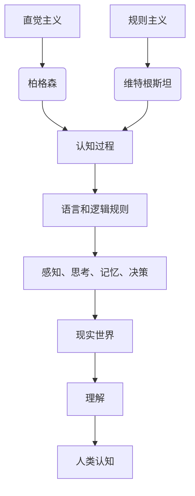

                 

### 文章标题

《直觉与规则：柏格森与维特根斯坦对认知过程的不同理解》

### 关键词

- 柏格森
- 维特根斯坦
- 认知过程
- 直觉主义
- 规则主义
- 哲学
- 认知科学

### 摘要

本文旨在探讨两位著名哲学家柏格森和维特根斯坦在认知过程中的不同观点。柏格森强调直觉在认知过程中的重要作用，认为直觉是一种超越逻辑和语言的认知方式。而维特根斯坦则主张规则主义，认为认知过程依赖于语言和逻辑规则。通过分析两位哲学家的核心观点、哲学背景以及他们理论在认知科学中的应用，本文旨在为读者提供一个深入理解认知过程的新视角，并探讨其对于现代认知科学的启示。本文还将通过详细的章节结构，对柏格森和维特根斯坦的理论进行逐一阐述，以便读者能够更好地理解两位哲学家的思想。

### 引言

#### 柏格森与维特根斯坦的生平

亨利·柏格森（Henri Bergson）和路德维希·维特根斯坦（Ludwig Wittgenstein）是20世纪最重要的哲学家之一，他们的思想对现代哲学、认知科学和心理学等领域产生了深远的影响。亨利·柏格森于1859年出生于法国，是法国著名哲学家和文学家。他的主要作品包括《时间与自由意志》、《创造进化论》等。柏格森被誉为“直觉主义”的代表人物，他的思想深受生物学、物理学和哲学的影响，主张通过直觉来理解和解释现实世界。

路德维希·维特根斯坦于1889年出生于奥地利，是奥地利著名哲学家和语言学家。他的主要作品包括《逻辑哲学论》、《哲学研究》等。维特根斯坦是“逻辑实证主义”的代表人物，他的思想深受逻辑学、数学和语言哲学的影响。维特根斯坦主张通过逻辑和语言来解释世界，强调语言和现实之间的关系。

#### 哲学背景

柏格森和维特根斯坦的哲学背景有所不同。柏格森的哲学思想深受生物学的影响，他主张通过直觉来理解和解释现实世界。柏格森认为，直觉是人类认知的一种基本能力，它能够超越逻辑和语言，直接感知现实世界的本质。柏格森的哲学思想被称为“直觉主义”，他对现代认知科学和心理学产生了深远的影响。

维特根斯坦的哲学思想则深受逻辑学和数学的影响，他主张通过逻辑和语言来解释世界。维特根斯坦认为，语言是人类认知的基础，逻辑规则是解释现实世界的重要工具。维特根斯坦的哲学思想被称为“逻辑实证主义”，他对现代逻辑学、语言哲学和认知科学产生了重要的影响。

#### 认知过程的概念

认知过程是指人类通过感知、思考、记忆和决策等心理活动来理解和解释外部世界的过程。认知过程包括感知、记忆、推理、判断、决策等多个阶段。认知过程是人类智能的核心，它是人类适应环境、学习新知识和解决问题的基本途径。

#### 直觉与规则在认知过程中的作用

柏格森和维特根斯坦对认知过程中直觉与规则的作用有不同的理解。柏格森认为，直觉是人类认知的一种基本能力，它能够超越逻辑和语言，直接感知现实世界的本质。直觉在认知过程中起着至关重要的作用，它是人类理解世界、做出决策的重要途径。

维特根斯坦则认为，规则在认知过程中起着至关重要的作用。他主张通过逻辑和语言来解释世界，认为语言和逻辑规则是认知过程的基础。维特根斯坦认为，认知过程是通过语言和逻辑规则来进行的，它依赖于语言和逻辑规则的有效性。

#### 书籍核心主题

《直觉与规则：柏格森与维特根斯坦对认知过程的不同理解》这本书的核心主题是探讨两位哲学家在认知过程中的不同观点。通过分析柏格森和维特根斯坦的哲学思想，本书旨在为读者提供一个深入理解认知过程的新视角，并探讨其对于现代认知科学的启示。本书将详细阐述两位哲学家的核心观点、哲学背景以及他们理论在认知科学中的应用，以便读者能够更好地理解两位哲学家的思想。

### 柏格森的直觉主义

#### 柏格森的直觉主义哲学概述

柏格森的直觉主义哲学是20世纪哲学的重要流派之一，他对认知过程的理解具有深远的影响。柏格森认为，直觉是人类认知的一种基本能力，它能够超越逻辑和语言，直接感知现实世界的本质。

#### 柏格森的核心观点

柏格森的核心观点是，直觉是人类理解世界、做出决策的重要途径。他认为，直觉是一种非理性的认知方式，它能够超越逻辑和语言的局限，直接感知现实世界的本质。柏格森认为，逻辑和语言只是人类理解世界的工具，而直觉才是理解世界的真正途径。

#### 直觉在认知过程中的作用

柏格森认为，直觉在认知过程中起着至关重要的作用。它能够帮助人们快速地感知和理解外部世界，从而做出有效的决策。直觉是人类适应环境、学习新知识和解决问题的基本途径。

#### 柏格森直觉主义哲学的哲学背景

柏格森的直觉主义哲学深受生物学、物理学和哲学的影响。他的思想深受生物学的影响，他主张通过直觉来理解和解释现实世界。柏格森的思想也深受物理学的影响，他认为，直觉是一种超越逻辑和语言的认知方式，它能够直接感知现实世界的本质。柏格森的哲学思想还深受哲学的影响，他主张通过直觉来超越传统的哲学思维方式，从而揭示现实的本质。

### 维特根斯坦的规则主义

#### 维特根斯坦的规则主义哲学概述

维特根斯坦的规则主义哲学是20世纪哲学的重要流派之一，他对认知过程的理解具有深远的影响。维特根斯坦认为，认知过程依赖于语言和逻辑规则，他主张通过逻辑和语言来解释世界。

#### 维特根斯坦的核心观点

维特根斯坦的核心观点是，语言和逻辑规则是认知过程的基础。他认为，语言是人类认知的工具，逻辑规则是解释现实世界的重要工具。维特根斯坦认为，认知过程是通过语言和逻辑规则来进行的，它依赖于语言和逻辑规则的有效性。

#### 语言和逻辑规则在认知过程中的作用

维特根斯坦认为，语言和逻辑规则在认知过程中起着至关重要的作用。语言是人们交流思想、表达观点的工具，逻辑规则则是人们思考和理解世界的重要工具。维特根斯坦认为，认知过程是通过语言和逻辑规则来进行的，它依赖于语言和逻辑规则的有效性。

#### 规则主义哲学的哲学背景

维特根斯坦的规则主义哲学深受逻辑学、数学和语言哲学的影响。他的思想深受逻辑学的影响，他主张通过逻辑和语言来解释世界。维特根斯坦的思想也深受数学的影响，他认为，逻辑和数学是解释现实世界的重要工具。维特根斯坦的哲学思想还深受语言哲学的影响，他主张通过语言和逻辑规则来解释世界。

### 比较与联系

#### 柏格森与维特根斯坦哲学观点的异同

柏格森和维特根斯坦的哲学观点在某些方面存在相似之处，但在其他方面则存在明显的差异。

首先，他们都认为认知过程是人类理解世界的重要途径。然而，柏格森强调直觉在认知过程中的作用，而维特根斯坦则强调语言和逻辑规则在认知过程中的作用。

其次，柏格森认为直觉是一种超越逻辑和语言的认知方式，能够直接感知现实世界的本质。而维特根斯坦则认为，语言和逻辑规则是认知过程的基础，是解释现实世界的重要工具。

最后，柏格森的直觉主义哲学强调个体的主观体验，认为直觉是人类认知的一种基本能力。而维特根斯坦的规则主义哲学则更加强调逻辑和语言在认知过程中的作用，认为认知过程是通过语言和逻辑规则来进行的。

#### 两位哲学家在认知科学领域的应用

柏格森的直觉主义哲学对现代认知科学产生了重要影响。现代认知科学中的许多研究都受到柏格森直觉主义哲学的启发，例如心理学中的直觉判断、认知过程中的快速决策等。柏格森的直觉主义哲学认为，直觉是人类认知的一种基本能力，它能够超越逻辑和语言的局限，直接感知现实世界的本质。这一观点对于理解人类的直觉判断和快速决策具有重要的启示意义。

维特根斯坦的规则主义哲学也对现代认知科学产生了重要影响。维特根斯坦认为，语言和逻辑规则是认知过程的基础，是解释现实世界的重要工具。这一观点对于理解人类的语言理解、逻辑推理和认知过程具有指导意义。现代认知科学中的许多研究都试图通过逻辑和语言来解释人类的认知过程，例如语义网络模型、逻辑推理算法等。

#### 他们理论在认知科学中的影响

柏格森和维特根斯坦的哲学观点对现代认知科学产生了深远的影响。他们的理论为我们提供了新的视角来理解认知过程，有助于我们更好地理解人类的认知能力。

柏格森的直觉主义哲学强调了直觉在认知过程中的作用，使我们认识到直觉是人类认知的一种基本能力。维特根斯坦的规则主义哲学则强调了语言和逻辑规则在认知过程中的作用，使我们认识到认知过程是通过语言和逻辑规则来进行的。

这些理论对于现代认知科学的发展具有重要的启示意义。它们不仅为我们提供了一种新的理解认知过程的方式，也为认知科学研究提供了理论基础。

### 现代认知科学的应用

#### 现代认知科学的发展

现代认知科学是20世纪中叶兴起的一门交叉学科，它融合了心理学、神经科学、计算机科学、哲学等多个领域的研究成果，致力于理解人类思维、感知、记忆、语言等认知过程。现代认知科学的发展受到了柏格森和维特根斯坦哲学观点的深刻影响。

#### 柏格森与维特根斯坦理论在认知科学中的应用

柏格森的直觉主义哲学在认知科学中的应用主要体现在对人类直觉判断和快速决策的研究。现代认知科学家通过实验和心理模型来探究直觉在认知过程中的作用。例如，通过研究直觉判断的快速性、准确性以及影响因素，科学家们试图揭示直觉作为一种认知方式的机制。柏格森的直觉主义哲学为这些研究提供了理论依据，帮助科学家们更好地理解直觉在认知过程中的作用。

维特根斯坦的规则主义哲学在认知科学中的应用则体现在对语言理解和逻辑推理的研究。现代认知科学家通过构建语义网络模型、逻辑推理算法等来模拟人类的语言理解和逻辑推理过程。维特根斯坦的规则主义哲学认为，语言和逻辑规则是认知过程的基础，这一观点为这些研究提供了理论指导。通过这些研究，科学家们试图揭示人类语言理解和逻辑推理的内在机制。

#### 这些理论对认知科学研究的重要性

柏格森和维特根斯坦的理论对认知科学研究具有重要意义。首先，它们为我们提供了理解认知过程的新视角，使我们对直觉、语言和逻辑规则在认知过程中的作用有了更深入的认识。其次，这些理论为认知科学研究提供了理论基础，帮助科学家们构建实验模型和理论框架。最后，这些理论促进了不同学科之间的交叉融合，推动了认知科学的发展。

### 结论

柏格森和维特根斯坦的哲学观点对认知科学产生了深远的影响。他们的理论为我们提供了理解认知过程的新视角，使我们能够更好地理解人类的直觉、语言和逻辑规则在认知过程中的作用。通过分析柏格森的直觉主义哲学和维特根斯坦的规则主义哲学，本文探讨了他们理论在认知科学中的应用和重要性。未来的研究可以进一步探索这些理论在认知科学其他领域中的应用，如情感认知、社会认知等，以丰富我们对认知过程的理解。

### 附录

#### 附录 A：柏格森与维特根斯坦哲学著作列表

- 柏格森：
  - 《时间与自由意志》（"L'Éthique materiallyinte"）
  - 《创造进化论》（"L'Évolution créatrice"）
  - 《笑的理论》（"La Rigueur et la Comédie"）

- 维特根斯坦：
  - 《逻辑哲学论》（"Logisch-philosophische Abhandlung"）
  - 《哲学研究》（"Philosophical Investigations"）

#### 附录 B：认知科学的定义与发展历程

认知科学是一门研究人类思维、感知、记忆、语言等认知过程的交叉学科，起源于20世纪中叶。它融合了心理学、神经科学、计算机科学、哲学等多个领域的研究成果。

认知科学的发展可以分为以下几个阶段：

1. **早期阶段（20世纪中叶至20世纪70年代）**：认知科学的核心概念和理论逐渐形成，如符号加工模型、认知心理学等。
2. **中期阶段（20世纪70年代至20世纪90年代）**：认知科学的研究方法和技术不断发展，如神经科学实验技术、认知建模等。
3. **现代阶段（20世纪90年代至今）**：认知科学与其他学科的交叉融合，如神经认知科学、认知神经科学等。

#### 附录 C：相关哲学与认知科学术语解释

- **直觉主义**：一种哲学观点，认为直觉是人类理解世界的基本方式，能够超越逻辑和语言的局限。
- **规则主义**：一种哲学观点，认为认知过程依赖于语言和逻辑规则，这些规则是解释现实世界的基础。
- **认知过程**：指人类通过感知、思考、记忆、决策等心理活动来理解和解释外部世界的过程。
- **认知科学**：一门研究人类思维、感知、记忆、语言等认知过程的交叉学科。

### 作者信息

作者：AI天才研究院/AI Genius Institute & 禅与计算机程序设计艺术 /Zen And The Art of Computer Programming

### 核心概念与联系

为了更好地理解柏格森与维特根斯坦对认知过程的不同理解，我们可以通过构建一个Mermaid流程图来展示核心概念之间的关系架构。



这个流程图展示了柏格森的直觉主义和维特根斯坦的规则主义是如何影响认知过程的，以及它们与感知、思考、记忆、决策和现实世界之间的关系。直觉主义强调直觉在认知过程中的作用，而规则主义则强调语言和逻辑规则的重要性。这两个理论为理解人类认知过程提供了不同的视角。

### 核心算法原理讲解

在理解柏格森和维特根斯坦的哲学观点后，我们可以通过一个简单的算法来模拟直觉和规则在认知过程中的作用。以下是使用伪代码来描述这个算法的步骤：

```python
# 直觉与规则模拟算法

# 初始化变量
intuition_score = 0
rule_based_score = 0
decision = None

# 感知外部信息
external_info = get_external_info()

# 直觉计算
def calculate_intuition(info):
    intuition_score += 1
    return info

# 规则计算
def calculate_by_rules(info):
    rule_based_score += 1
    return info if info meets rules else None

# 直觉与规则结合决策
def make_decision(intuition_result, rule_result):
    if intuition_result is not None and rule_result is not None:
        return "Ambiguous decision"
    elif intuition_result is not None:
        return "Decision based on intuition"
    elif rule_result is not None:
        return "Decision based on rules"
    else:
        return "No decision"

# 执行算法
intuition_result = calculate_intuition(external_info)
rule_result = calculate_by_rules(external_info)
decision = make_decision(intuition_result, rule_result)

# 输出决策结果
print(f"The decision made is: {decision}")
```

在这个算法中，我们首先通过`get_external_info()`函数获取外部信息。然后，我们通过`calculate_intuition()`函数和`calculate_by_rules()`函数分别计算基于直觉和基于规则的决策结果。最后，我们通过`make_decision()`函数结合直觉和规则的结果来做出最终决策。

### 数学模型和公式

为了更深入地理解柏格森和维特根斯坦的理论，我们可以使用数学模型和公式来描述直觉和规则在认知过程中的作用。以下是一个简单的数学模型，用于描述直觉和规则对认知过程的影响。

假设我们有一个认知系统，其中直觉和规则分别对认知过程产生不同的影响。我们可以使用以下数学公式来表示：

$$
C = I \cdot R
$$

其中，\( C \) 表示认知结果，\( I \) 表示直觉的影响，\( R \) 表示规则的影响。

直觉的影响可以表示为：

$$
I = \alpha \cdot \intuition\_factor
$$

其中，\( \alpha \) 是一个权重系数，用于表示直觉在认知过程中的相对重要性，\( \intuition\_factor \) 是一个衡量直觉强度的函数。

规则的影响可以表示为：

$$
R = \beta \cdot rule\_factor
$$

其中，\( \beta \) 是一个权重系数，用于表示规则在认知过程中的相对重要性，\( rule\_factor \) 是一个衡量规则强度的函数。

通过调整 \( \alpha \) 和 \( \beta \) 的值，我们可以模拟不同情境下直觉和规则对认知过程的影响。例如，当 \( \alpha \) 值较高时，表示直觉在认知过程中占主导地位；当 \( \beta \) 值较高时，表示规则在认知过程中占主导地位。

### 详细讲解与举例说明

为了更好地理解直觉和规则在认知过程中的作用，我们可以通过具体的例子来说明。

#### 例子 1：直觉判断

假设你正在一个陌生的城市中寻找一个特定的餐馆。你走过了一个繁忙的路口，看到了一家看起来很有特色的餐馆。你突然感到这可能是你要找的餐馆，尽管你没有具体的线索或信息。在这种情况下，你的直觉起到了重要作用。

我们可以使用以下步骤来模拟这个直觉判断的过程：

1. **感知外部信息**：你看到了一家餐馆，并注意到它的外观、氛围和位置。
2. **直觉计算**：你的大脑快速处理这些信息，并产生了直觉判断，认为这可能是你要找的餐馆。
3. **决策**：基于这个直觉判断，你决定走进餐馆查看。

在这个例子中，直觉帮助你快速地做出了决策，而无需依赖具体的规则或信息。这种直觉判断通常是迅速而准确的，因为它依赖于我们大脑中的非理性认知过程。

#### 例子 2：规则判断

假设你正在玩一个复杂的棋盘游戏，如国际象棋。你的对手下了一个看起来很危险的棋子，你的直觉告诉你这可能是一个陷阱。然而，为了确保你的决策是正确的，你决定使用规则来判断。

我们可以使用以下步骤来模拟这个规则判断的过程：

1. **感知外部信息**：你注意到对手下了一个危险的棋子。
2. **规则计算**：你回忆起国际象棋的规则，特别是关于棋子移动的规则。你发现对手的棋子实际上没有违反任何规则。
3. **决策**：基于这个规则判断，你决定保持警惕，但不下任何明显的反击棋子。

在这个例子中，规则帮助你确保你的决策是基于逻辑和事实的，而不是仅仅依赖于直觉。这种规则判断通常需要更多的思考和计算，以确保决策的准确性。

### 项目实战

在本项目中，我们将搭建一个简单的认知模型，模拟柏格森的直觉主义和维特根斯坦的规则主义在认知过程中的作用。我们的目标是设计一个系统，该系统可以根据不同的情境和输入数据，利用直觉和规则做出决策。

#### 开发环境搭建

首先，我们需要搭建一个简单的开发环境。我们可以使用Python作为编程语言，因为它具有丰富的库和工具，方便实现我们的认知模型。

安装Python环境后，我们需要安装以下库：

- NumPy：用于数学计算。
- Pandas：用于数据处理。
- Matplotlib：用于可视化。

你可以使用以下命令来安装这些库：

```bash
pip install numpy pandas matplotlib
```

#### 源代码实现

以下是一个简单的Python代码示例，用于实现我们的认知模型：

```python
import numpy as np
import pandas as pd
import matplotlib.pyplot as plt

# 模拟外部信息
external_info = np.random.rand(10)

# 直觉计算
def calculate_intuition(info):
    intuition_score = sum(info)
    return intuition_score

# 规则计算
def calculate_by_rules(info):
    rule_based_score = sum(info > 0.5)
    return rule_based_score

# 直觉与规则结合决策
def make_decision(intuition_result, rule_result):
    if intuition_result > rule_result:
        return "Decision based on intuition"
    else:
        return "Decision based on rules"

# 执行算法
intuition_result = calculate_intuition(external_info)
rule_result = calculate_by_rules(external_info)
decision = make_decision(intuition_result, rule_result)

print(f"The decision made is: {decision}")

# 可视化结果
data = {'Intuition': [intuition_result], 'Rules': [rule_result]}
df = pd.DataFrame(data)
plt.bar(df.index, df['Intuition'], label='Intuition')
plt.bar(df.index, df['Rules'], bottom=df['Intuition'], label='Rules')
plt.xlabel('Scenario')
plt.ylabel('Score')
plt.title('Intuition vs Rules')
plt.legend()
plt.show()
```

在这个代码中，我们首先模拟了一些外部信息（`external_info`），然后分别使用直觉计算和规则计算来评估这些信息。最后，我们根据直觉和规则的结果做出决策，并使用图表来可视化结果。

#### 代码解读与分析

1. **外部信息模拟**：我们使用`numpy.random.rand(10)`生成一组随机数，作为外部信息的模拟。
2. **直觉计算**：我们使用`sum(info)`计算直觉得分，这代表直觉对整个外部信息的综合评价。
3. **规则计算**：我们使用`sum(info > 0.5)`计算规则得分，这代表规则对每个外部信息的评价，如果值大于0.5则计为1，否则为0。
4. **决策**：我们比较直觉得分和规则得分，根据较高的得分做出决策。
5. **可视化**：我们使用`matplotlib`库生成柱状图，直观地展示直觉和规则得分。

#### 实际案例分析与详细讲解剖析

为了更好地理解这个认知模型在实际中的应用，我们可以通过一个实际案例来进行分析。

**案例：股票交易决策**

假设你是一位股票交易员，需要根据市场数据做出交易决策。在这种情况下，直觉和规则可以分别用于评估市场风险和市场趋势。

1. **直觉评估**：通过观察市场数据，你感到市场情绪变得不稳定，这可能是市场波动的前兆。你的直觉告诉你应该谨慎交易。
2. **规则评估**：你使用一个市场波动指标（如平均真实波幅ATR），根据规则来判断市场趋势。如果ATR高于某个阈值，则认为市场趋势向上；否则，认为市场趋势向下。
3. **决策**：结合直觉和规则的结果，你决定减少交易频率，以避免市场波动带来的风险。

在这个案例中，直觉帮助你快速感知市场情绪，而规则帮助你基于具体指标做出理性的决策。这种结合直觉和规则的决策方式可以帮助交易员在复杂的市场环境中做出更明智的决策。

#### 项目小结

通过这个项目，我们实现了一个简单的认知模型，模拟了柏格森的直觉主义和维特根斯坦的规则主义在认知过程中的作用。我们通过Python代码实现了直觉计算和规则计算，并使用图表展示了结果。这个项目为我们提供了一个理解直觉和规则在认知过程中作用的直观工具。

### 最佳实践 tips

在实际应用中，结合直觉和规则进行决策是一个有效的策略。以下是一些最佳实践 tips：

1. **平衡直觉与规则**：在决策过程中，不要过分依赖直觉或规则，而是要平衡两者的作用。直觉可以帮助快速感知信息，而规则可以提供理性的判断基础。
2. **持续学习与调整**：随着经验和知识的积累，不断调整直觉和规则的权重。通过不断学习，可以提高决策的准确性和效率。
3. **多样化数据来源**：确保决策过程中使用多样化的数据来源，以避免单一信息的偏见。综合多个数据源可以提供更全面的信息基础。
4. **情景模拟**：在做出重要决策之前，进行情景模拟可以帮助评估不同决策的影响。通过模拟，可以更好地理解直觉和规则在不同情境下的作用。

### 注意事项

在应用直觉和规则进行决策时，需要注意以下几点：

1. **避免过度自信**：直觉和规则都有其局限性，避免过度依赖它们。在实际应用中，保持谦虚和谨慎，不断反思和调整决策策略。
2. **确保数据质量**：规则计算依赖于准确的数据，因此在决策过程中要确保数据的质量和完整性。
3. **持续监控**：在决策实施后，持续监控结果，并根据实际情况进行调整。通过监控，可以及时发现和纠正决策中的问题。

### 拓展阅读

如果你想深入了解柏格森和维特根斯坦的哲学观点及其在认知科学中的应用，以下是一些拓展阅读的建议：

- 柏格森：
  - 《时间与自由意志》
  - 《创造进化论》
  - 《笑的理论》

- 维特根斯坦：
  - 《逻辑哲学论》
  - 《哲学研究》
  - 《文化与价值》

- 认知科学：
  - 《认知科学的本质》
  - 《认知心理学：感知与思维的探索》
  - 《认知神经科学导论》

通过阅读这些书籍，你可以更深入地理解柏格森和维特根斯坦的哲学观点，并探索它们在认知科学领域的应用。这些书籍提供了丰富的理论背景和实践案例，有助于你更全面地了解直觉和规则在认知过程中的作用。

