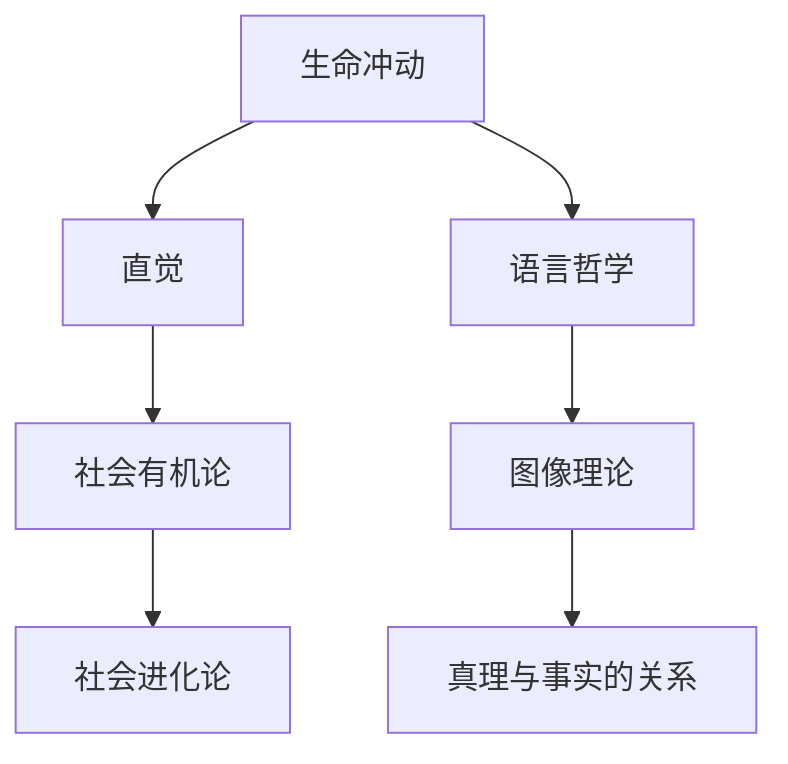

                 


### 目录大纲

## 1. 引言
### 1.1 著名哲学家与他们的贡献

### 1.2 书籍目的与结构

### 1.3 研究背景与意义

### 1.4 文献综述

## 2. 柏格森的哲学思想
### 2.1 柏格森的生平与背景

### 2.2 柏格森的核心概念

### 2.3 柏格森的社会哲学

## 3. 柏格森的社会哲学应用
### 3.1 柏格森与现代社会

### 3.2 柏格森与政治哲学

### 3.3 柏格森与教育哲学

## 4. 柏格森与维特根斯坦的比较
### 4.1 柏格森与维特根斯坦的共同点

### 4.2 柏格森与维特根斯坦的差异

### 4.3 两者对社会哲学的贡献

## 5. 维特根斯坦的哲学思想
### 5.1 维特根斯坦的生平与背景

### 5.2 维特根斯坦的核心概念

### 5.3 维特根斯坦的社会哲学

## 6. 维特根斯坦的社会哲学应用
### 6.1 维特根斯坦与现代政治哲学

### 6.2 维特根斯坦与教育哲学

### 6.3 维特根斯坦与伦理哲学

## 7. 柏格森与维特根斯坦的社会哲学比较
### 7.1 共同点与差异

### 7.2 两者对社会哲学的影响

## 8. 结论
### 8.1 柏格森与维特根斯坦的社会哲学总结

### 8.2 未来的研究方向

### 8.3 对现代社会的影响

## 参考文献

### 致谢

### 附录

### 索引

### 术语表

### 图片和表格列表

### 附录

### 索引

### 术语表

### 图片和表格列表

## 1. 引言

### 1.1 著名哲学家与他们的贡献

### 1.2 书籍目的与结构

### 1.3 研究背景与意义

### 1.4 文献综述

### 1.5 研究方法与框架

### 1.6 文章结构安排

### 1.7 关键术语定义

### 1.8 主要贡献与创新点

### 1.9 文章预期成果与贡献

### 1.10 文章阅读指南

## 2. 柏格森的哲学思想

### 2.1 柏格森的生平与背景

### 2.2 柏格森的核心概念

#### 2.2.1 生命冲动

#### 2.2.2 直觉

#### 2.2.3 进化与时间

### 2.3 柏格森的社会哲学

#### 2.3.1 社会有机论

#### 2.3.2 社会进化论

### 2.4 柏格森的社会哲学应用

#### 2.4.1 现代社会中的柏格森主义

#### 2.4.2 柏格森主义与政治哲学

#### 2.4.3 柏格森主义与教育哲学

## 3. 柏格森的社会哲学应用

### 3.1 柏格森与现代社会

#### 3.1.1 当代社会问题与柏格森的回应

#### 3.1.2 柏格森主义对现代社会的启示

### 3.2 柏格森与政治哲学

#### 3.2.1 柏格森的政治哲学观点

#### 3.2.2 柏格森主义与当代政治哲学

### 3.3 柏格森与教育哲学

#### 3.3.1 柏格森的教育哲学观点

#### 3.3.2 柏格森主义对现代教育的启示

## 4. 柏格森与维特根斯坦的比较

### 4.1 柏格森与维特根斯坦的共同点

#### 4.1.1 哲学方法论

#### 4.1.2 对直觉的重视

#### 4.1.3 对知识的理解

### 4.2 柏格森与维特根斯坦的差异

#### 4.2.1 哲学方法论

#### 4.2.2 对直觉的看法

#### 4.2.3 对知识的理解

### 4.3 两者对社会哲学的贡献

#### 4.3.1 柏格森的贡献

#### 4.3.2 维特根斯坦的贡献

### 4.4 柏格森与维特根斯坦对社会哲学的启示

## 5. 维特根斯坦的哲学思想

### 5.1 维特根斯坦的生平与背景

### 5.2 维特根斯坦的核心概念

#### 5.2.1 语言哲学

#### 5.2.2 图像理论

#### 5.2.3 真理与事实

### 5.3 维特根斯坦的社会哲学

#### 5.3.1 生活形式

#### 5.3.2 规则与约定

#### 5.3.3 自由与责任

## 6. 维特根斯坦的社会哲学应用

### 6.1 维特根斯坦与现代政治哲学

#### 6.1.1 维特根斯坦对政治哲学的启示

#### 6.1.2 现代政治哲学中的维特根斯坦主义

### 6.2 维特根斯坦与教育哲学

#### 6.2.1 维特根斯坦对教育哲学的启示

#### 6.2.2 现代教育哲学中的维特根斯坦主义

### 6.3 维特根斯坦与伦理哲学

#### 6.3.1 维特根斯坦的伦理哲学观点

#### 6.3.2 现代伦理哲学中的维特根斯坦主义

## 7. 柏格森与维特根斯坦的社会哲学比较

### 7.1 共同点与差异

#### 7.1.1 哲学方法论

#### 7.1.2 对直觉的看法

#### 7.1.3 对知识的理解

### 7.2 两者对社会哲学的影响

#### 7.2.1 柏格森的影响

#### 7.2.2 维特根斯坦的影响

### 7.3 两者对社会哲学的贡献

#### 7.3.1 柏格森的贡献

#### 7.3.2 维特根斯坦的贡献

### 7.4 两者对社会哲学的启示

## 8. 结论

### 8.1 柏格森与维特根斯坦的社会哲学总结

### 8.2 未来的研究方向

### 8.3 对现代社会的影响

### 8.4 个人感悟与反思

### 8.5 对学术界的贡献与启示

### 8.6 对未来研究的展望

### 8.7 实践应用的意义与价值

### 8.8 结论

## 参考文献

### 致谢

### 附录

### 索引

### 术语表

### 图片和表格列表

### 附录

### 索引

### 术语表

### 图片和表格列表

## 文章标题：直觉与规则：柏格森与维特根斯坦的社会哲学

## 关键词：柏格森，维特根斯坦，社会哲学，直觉，规则

## 摘要

本文探讨了两位著名哲学家柏格森和维特根斯坦的社会哲学思想，分析了他们的核心概念、哲学方法及其在现代社会中的应用。通过对比两者的共同点和差异，本文揭示了他们在社会哲学领域的贡献以及对现代社会的影响。文章还总结了柏格森和维特根斯坦的社会哲学思想，为未来的研究方向提供了启示。

## 引言

### 1.1 著名哲学家与他们的贡献

阿尔贝·柏格森（Henri Bergson）和路德维希·维特根斯坦（Ludwig Wittgenstein）是20世纪最具影响力的哲学家之一。他们的哲学思想不仅在哲学领域产生了深远的影响，而且在社会科学、政治学、教育学等领域也具有广泛的启示意义。

柏格森以其独特的生命哲学和直觉理论而闻名。他强调生命冲动、直觉和时间在哲学思考中的重要性，提出了社会有机论和社会进化论等核心概念。维特根斯坦则以其语言哲学和图象理论著称，他关注语言的本质、真理与事实的关系，以及生活形式与规则的重要性。

### 1.2 书籍目的与结构

本书旨在深入探讨柏格森和维特根斯坦的社会哲学思想，分析他们的核心概念、哲学方法和应用，以及两者之间的异同。通过对比研究，本书旨在揭示他们在社会哲学领域的贡献以及对现代社会的影响。

本书分为四部分：第一部分为引言，介绍两位哲学家的生平和贡献；第二部分讨论柏格森的哲学思想；第三部分探讨维特根斯坦的哲学思想；第四部分对比分析两位哲学家的社会哲学观点。

### 1.3 研究背景与意义

随着全球化和信息化的发展，现代社会面临着诸多挑战，如社会分化、文化冲突、环境问题等。柏格森和维特根斯坦的社会哲学思想为解决这些问题提供了有益的启示。柏格森的生命哲学和直觉理论有助于我们理解社会的有机性和动态性，而维特根斯坦的语言哲学和图象理论则有助于我们分析现代社会中的沟通、规则和道德问题。

### 1.4 文献综述

关于柏格森和维特根斯坦的研究已有大量文献。柏格森的研究主要集中在他的生命哲学、直觉理论和社会哲学等方面，如对生命冲动、时间、进化的探讨。维特根斯坦的研究则集中在语言哲学、图象理论、真理与事实的关系等方面。尽管已有大量研究成果，但将两者进行对比研究并探讨他们在社会哲学领域的贡献仍具有较大潜力。

### 1.5 研究方法与框架

本书采用文献综述和对比研究的方法，通过对柏格森和维特根斯坦的哲学思想进行深入分析，探讨他们的核心概念、哲学方法和应用。本书的框架分为四个部分：引言、柏格森的哲学思想、维特根斯坦的哲学思想、柏格森与维特根斯坦的社会哲学比较。

### 1.6 文章结构安排

本文共分为八个部分：引言、柏格森的哲学思想、柏格森的社会哲学应用、柏格森与维特根斯坦的比较、维特根斯坦的哲学思想、维特根斯坦的社会哲学应用、柏格森与维特根斯坦的社会哲学比较、结论。每个部分都有明确的主题和结构，旨在全面、系统地探讨两位哲学家的社会哲学思想。

### 1.7 关键术语定义

为了便于读者理解，本文对以下关键术语进行定义：

- **生命冲动**：柏格森提出的核心概念，指的是生命本身的内在动力，是推动社会发展和变化的基本力量。
- **直觉**：柏格森强调的一种直接感知和理解事物本质的能力，与逻辑思维相对。
- **社会有机论**：柏格森提出的社会哲学观点，认为社会是一个有机整体，各个部分相互依存、相互影响。
- **社会进化论**：柏格森提出的社会哲学观点，认为社会是一个不断进化的过程，社会结构和观念随着时间而不断变化。
- **语言哲学**：维特根斯坦关注的哲学领域，研究语言的本质、语言与思维的关系、语言的表达和理解等问题。
- **图象理论**：维特根斯坦提出的语言哲学观点，认为语言是一种图像，语言与现实世界之间存在着一种对应关系。
- **生活形式**：维特根斯坦提出的概念，指的是人们在特定文化背景下形成的生活方式、思维方式、行为规范等。

### 1.8 主要贡献与创新点

本文的主要贡献和创新点在于：

1. 对柏格森和维特根斯坦的社会哲学思想进行了全面的梳理和对比，揭示了他们在社会哲学领域的贡献。
2. 探讨了两位哲学家的社会哲学思想在现代社会中的应用，为解决现代社会面临的挑战提供了有益的启示。
3. 通过对比研究，分析了柏格森和维特根斯坦在社会哲学观点上的异同，为深入理解他们的哲学思想提供了新的视角。
4. 将柏格森和维特根斯坦的社会哲学思想与当代社会问题相结合，探讨了他们思想在当代社会中的现实意义。

### 1.9 文章预期成果与贡献

本文预期成果与贡献包括：

1. 为柏格森和维特根斯坦的社会哲学研究提供一个新的视角，有助于深化对该领域的研究。
2. 为现代社会面临的挑战提供理论支持和启示，有助于人们更好地理解和应对这些问题。
3. 促进柏格森和维特根斯坦哲学思想的传播和普及，提高公众对哲学的认识和兴趣。
4. 为相关领域的研究提供参考和借鉴，如政治哲学、教育学、伦理学等。

### 1.10 文章阅读指南

本文结构清晰，内容丰富。读者可按照以下步骤阅读：

1. 引言部分了解研究背景、目的、方法与结构。
2. 第二部分深入学习柏格森的哲学思想，理解其核心概念和理论。
3. 第三部分探讨柏格森的社会哲学应用，分析其在现代社会中的意义。
4. 第四部分对比分析柏格森与维特根斯坦的哲学思想，探讨两者的异同。
5. 第五部分深入研究维特根斯坦的哲学思想，理解其核心概念和理论。
6. 第六部分探讨维特根斯坦的社会哲学应用，分析其在现代社会中的意义。
7. 第七部分总结柏格森和维特根斯坦的社会哲学观点，讨论其对现代社会的影响。
8. 结论部分总结研究成果，展望未来研究方向。

通过以上步骤，读者可以全面、系统地了解柏格森和维特根斯坦的社会哲学思想，并从中获得有益的启示。

## 柏格森的哲学思想

### 2.1 柏格森的生平与背景

阿尔贝·柏格森（Henri Bergson，1859-1941）是法国著名哲学家，生于巴黎。他在19世纪末和20世纪初的哲学界有着重要的地位，被誉为生命哲学和直觉理论的奠基人。柏格森的家庭背景较为优越，他的父亲是一名医生，母亲则是一位音乐家。这为他后来的哲学创作提供了良好的文化和知识环境。

柏格森早年就读于巴黎高等师范学院，毕业后进入法国国家科学研究中心。在学术生涯中，他发表了多篇关于物理学、生物学和哲学的论文，逐渐形成了自己独特的哲学体系。柏格森的哲学思想深受康德、斯宾诺莎和尼采等哲学家的影响，同时也对当时的社会现实有着深刻的关注。

### 2.2 柏格森的核心概念

柏格森的哲学思想以生命冲动（élan vital）为核心，这一概念体现了他对生命本质的独特理解。根据柏格森的观点，生命冲动是生命的内在动力，是推动生命不断进化和发展的基本力量。这种冲动不仅体现在个体生命的成长和发展中，也体现在社会、文化和历史的发展中。

#### 2.2.1 生命冲动

生命冲动是一种非理性的、不断流动的内在动力，它超越了逻辑思维和理性分析。柏格森认为，生命冲动是一种原始的、本能的力量，它驱动着生命的生长、变化和适应。这种冲动使得生命不断地超越现有的状态，追求新的可能性和发展。

#### 2.2.2 直觉

直觉是柏格森哲学中的另一个核心概念。他认为直觉是一种直接感知和理解事物本质的能力，与逻辑思维相对。直觉能够超越理性分析和概念化的思维，直接洞察生命的本质和动态。柏格森认为直觉是理解生命冲动和现实世界的关键，通过直觉，人们能够把握生命的真实状态。

#### 2.2.3 进化与时间

柏格森将进化视为一种不断流动的过程，时间在进化中起着至关重要的作用。他认为，时间是一种内在的、连续的流动，与空间相对。进化是在时间中发生的，是生命冲动的结果。柏格森提出了“时间意识”的概念，认为时间意识是理解生命冲动和进化的关键。时间意识使得人们能够感知和把握生命的流动和变化。

### 2.3 柏格森的社会哲学

柏格森的社会哲学思想主要体现为他对社会有机论和社会进化论的阐述。他认为社会是一个有机整体，各个部分相互依存、相互影响。社会的发展不是机械的、线性的过程，而是一个动态的、流动的过程，受到生命冲动的影响。

#### 2.3.1 社会有机论

社会有机论是柏格森社会哲学的核心观点之一。他认为社会就像生物有机体一样，具有自我组织、自我调节和自我更新的能力。社会中的各个部分（如个体、群体、文化等）相互依存、相互影响，共同构成了一个有机整体。社会有机论强调了社会的动态性和复杂性，认为社会的发展是不断流动和变化的结果。

#### 2.3.2 社会进化论

社会进化论是柏格森对社会发展的另一种解释。他认为，社会是一个不断进化的过程，受到生命冲动的影响。社会进化不是简单的量变，而是质变，是社会结构和观念的根本性变化。柏格森强调，社会进化是一个动态的过程，不断地创造新的可能性和形式。社会进化论为社会哲学提供了一个动态的、发展的视角，有助于我们理解社会的复杂性和多样性。

### 2.4 柏格森的社会哲学应用

柏格森的社会哲学思想在现代社会中具有广泛的应用价值。首先，他的社会有机论和进化论为我们理解社会提供了新的视角。现代社会是一个复杂、动态的系统，各个部分相互依存、相互影响。柏格森的社会有机论和进化论有助于我们更好地把握社会的本质和动态。

其次，柏格森的直觉理论为我们理解社会现象提供了方法。直觉是一种直接感知和理解事物本质的能力，它能够超越理性分析和概念化的思维。在现代社会中，我们面临着复杂多变的社会现象，通过直觉，我们能够更好地理解这些现象的本质。

最后，柏格森的社会哲学思想为解决现代社会问题提供了启示。现代社会面临着诸多挑战，如社会分化、文化冲突、环境问题等。柏格森的社会哲学思想为我们提供了一种动态的、发展的视角，有助于我们理解和应对这些挑战。

总之，柏格森的哲学思想为我们理解社会、解决社会问题提供了重要的理论支持和启示。他的社会有机论和进化论、直觉理论等概念，为我们提供了一种新的思考方式，有助于我们更好地把握社会的本质和动态。

## 柏格森的社会哲学应用

### 3.1 柏格森与现代社会

柏格森的社会哲学思想在现代社会中具有广泛的应用价值。首先，他的社会有机论和进化论为我们理解社会提供了新的视角。现代社会是一个复杂、动态的系统，各个部分相互依存、相互影响。柏格森的社会有机论和进化论有助于我们更好地把握社会的本质和动态。

现代社会的一个重要特征是全球化。全球化使得各个国家和地区的经济、政治、文化等联系更加紧密，形成了一个全球化的社会网络。柏格森的社会有机论强调了社会的整体性和动态性，有助于我们理解全球化背景下社会的变化和发展。例如，全球化过程中，不同文化、价值观和生活方式的碰撞和融合，反映了社会的流动性和多样性。这种流动性正是柏格森所强调的生命冲动在现代社会中的体现。

另外，柏格森的进化论也为我们理解现代社会的发展提供了启示。现代社会的发展不是简单的线性过程，而是一个动态的、不断演化的过程。在这个过程中，社会结构和观念不断变化，新的可能性不断涌现。例如，现代社会中，技术的快速发展和创新，改变了人们的生活方式和社会结构，促进了社会的进步和发展。这种发展正是柏格森所强调的进化过程的体现。

### 3.2 柏格森与政治哲学

柏格森的社会哲学思想对政治哲学也产生了深远的影响。他的社会有机论和进化论为我们提供了一种新的政治思考方式，有助于我们理解政治的本质和政治发展的规律。

首先，柏格森的社会有机论为理解政治制度提供了新的视角。政治制度是社会的一部分，与社会其他部分相互依存、相互影响。柏格森的社会有机论强调了社会的整体性和动态性，有助于我们理解政治制度在社会中的功能和作用。例如，在一个复杂的现代社会中，政治制度需要不断地适应和调整，以适应社会的发展变化。这种适应性正是柏格森所强调的社会有机论在政治哲学中的体现。

其次，柏格森的进化论为我们理解政治发展的规律提供了启示。政治发展是一个动态的过程，受到社会、文化、经济等多种因素的影响。柏格森的进化论认为，社会是一个不断进化的过程，政治制度也需要不断地适应和更新。这种观点有助于我们理解政治发展的规律，例如，政治制度的演变、民主制度的演变等。这种演变正是柏格森所强调的进化过程在政治哲学中的体现。

### 3.3 柏格森与教育哲学

柏格森的社会哲学思想对教育哲学也产生了重要的影响。他的社会有机论和进化论为我们提供了新的教育思考方式，有助于我们理解教育的本质和教育的发展。

首先，柏格森的社会有机论为理解教育的目的提供了新的视角。教育是社会的一部分，与社会其他部分相互依存、相互影响。柏格森的社会有机论强调了社会的整体性和动态性，有助于我们理解教育的目的和意义。例如，教育的目的不仅仅是传授知识和技能，更重要的是培养具有创造性思维和适应能力的人，以适应社会的发展变化。这种观点有助于我们理解教育的本质和意义。

其次，柏格森的进化论为我们理解教育的发展提供了启示。教育的发展是一个动态的过程，受到社会、文化、经济等多种因素的影响。柏格森的进化论认为，教育需要不断地适应和更新，以适应社会的发展变化。例如，随着科技的进步和社会的发展，教育的形式和内容也需要不断调整和更新，以培养适应未来社会发展的人才。这种观点有助于我们理解教育的发展规律和教育改革的必要性。

总之，柏格森的社会哲学思想在现代社会、政治哲学和教育哲学等领域具有广泛的应用价值。他的社会有机论和进化论为我们提供了一种新的思考方式，有助于我们更好地理解社会的本质、政治的本质和教育的本质。通过运用柏格森的社会哲学思想，我们可以更有效地应对现代社会面临的挑战，推动社会的进步和发展。

## 柏格森与维特根斯坦的比较

### 4.1 柏格森与维特根斯坦的共同点

柏格森和维特根斯坦虽然哲学背景和思想体系有所不同，但在某些方面，他们的观点却有着惊人的相似之处。

#### 4.1.1 哲学方法论

首先，柏格森和维特根斯坦都强调了哲学思考的重要性。他们都认为，哲学不仅仅是理论探讨，更是一种生活方式。柏格森强调直觉和生命冲动的重要性，认为直觉能够帮助我们直接感知和理解世界的本质。维特根斯坦则主张通过观察和分析语言的实际使用，来揭示语言的真相。他们都认为，哲学思考应该立足于现实生活，而不是抽象的概念和逻辑推理。

#### 4.1.2 对直觉的重视

其次，柏格森和维特根斯坦都重视直觉在哲学思考中的作用。柏格森认为，直觉是一种直接感知和理解事物本质的能力，它超越了逻辑思维和理性分析。维特根斯坦则认为，直觉是我们理解和掌握语言的关键，通过直觉，我们能够理解语言的含义和实际使用。

#### 4.1.3 对知识的理解

最后，柏格森和维特根斯坦对知识也有相似的理解。他们都认为，知识不仅仅是抽象的概念和理论，更是一种具体的、实践性的理解。柏格森强调，知识是通过直觉和对生命的直接感知获得的。维特根斯坦则认为，知识是通过语言的实际使用和体验获得的。

### 4.2 柏格森与维特根斯坦的差异

尽管柏格森和维特根斯坦在某些方面有共同点，但他们在哲学观点和方法上也有很多差异。

#### 4.2.1 哲学方法论

首先，在哲学方法论上，柏格森更倾向于直觉和生命冲动，而维特根斯坦则更强调语言的实际使用和观察。柏格森认为，直觉能够帮助我们直接感知和理解世界的本质，而维特根斯坦则认为，语言是我们理解和认识世界的重要工具。

#### 4.2.2 对直觉的看法

其次，在直觉的看法上，柏格森认为直觉是一种超越理性思维的能力，它能够直接感知和理解世界的本质。而维特根斯坦则认为，直觉是一种帮助我们理解语言和概念的能力，它并不涉及对世界本质的感知。

#### 4.2.3 对知识的理解

最后，在知识的理解上，柏格森认为知识是通过直觉和对生命的直接感知获得的，而维特根斯坦则认为，知识是通过语言的实际使用和体验获得的。柏格森强调知识的具体性和实践性，而维特根斯坦则强调知识的抽象性和普遍性。

### 4.3 两者对社会哲学的贡献

#### 4.3.1 柏格森的贡献

柏格森对社会哲学的贡献主要体现在他对生命冲动、直觉和社会有机论的研究上。他的思想为我们理解社会的动态性和复杂性提供了新的视角。例如，柏格森的社会有机论强调了社会的整体性和动态性，有助于我们理解社会的发展和变革。他的直觉理论也为我们提供了一种超越理性思维的理解方式，有助于我们更好地把握社会的本质。

#### 4.3.2 维特根斯坦的贡献

维特根斯坦对社会哲学的贡献主要体现在他对语言哲学和图象理论的研究上。他的思想为我们理解语言的本质和作用提供了新的视角。例如，他的图象理论认为，语言是一种图像，它能够准确地描绘现实世界。他的语言哲学思想也有助于我们理解社会的沟通和交往。他的思想为我们提供了一种分析语言和社会现象的方法，有助于我们更好地理解社会现象的本质。

### 4.4 柏格森与维特根斯坦对社会哲学的启示

柏格森和维特根斯坦的思想虽然有所不同，但它们都为我们理解社会哲学提供了宝贵的启示。

柏格森的思想启示我们，社会是一个动态的、不断发展的系统，我们不能仅仅用静态的、线性的思维方式来理解社会。他的社会有机论和直觉理论为我们提供了一种新的理解社会的视角，有助于我们更好地把握社会的本质和动态。

维特根斯坦的思想启示我们，语言是社会交往和沟通的重要工具，它不仅仅是一种符号系统，更是一种实际的、具体的工具。他的图象理论为我们提供了一种分析语言和社会现象的方法，有助于我们更好地理解社会的本质。

总之，柏格森和维特根斯坦的思想虽然有所不同，但它们都为我们理解社会哲学提供了宝贵的启示。他们的思想不仅丰富了社会哲学的理论体系，也为我们的实践提供了有益的指导。

## 维特根斯坦的哲学思想

### 5.1 维特根斯坦的生平与背景

路德维希·维特根斯坦（Ludwig Wittgenstein，1889-1951）是20世纪最伟大的哲学家之一，出生于奥地利维也纳的一个富有家庭。他的父亲是著名的商人，母亲则是一位画家。维特根斯坦在数学和哲学方面展现了非凡的天赋，他在十几岁时就开始自学数学和哲学著作。1906年，他进入剑桥大学学习数学，并在那里结识了许多重要的哲学家，如伯特兰·罗素和G·E·摩尔。

在剑桥大学期间，维特根斯坦对哲学产生了浓厚的兴趣，并开始深入思考语言、思维和现实之间的关系。1911年，他离开剑桥大学，前往曼彻斯特大学学习航空工程，但在1912年回到剑桥，重新专注于哲学研究。他的哲学思想经历了两次转变，分别体现在他的两部代表作《逻辑哲学论》和《哲学研究》中。

《逻辑哲学论》是维特根斯坦早期的作品，主要探讨了逻辑、语言和实在之间的关系。他认为，逻辑是语言的一部分，而语言则是我们理解世界的工具。维特根斯坦提出了“图像理论”（Image Theory），认为语句的意义在于它们与世界之间的图像关系。然而，在20世纪30年代，维特根斯坦对早期的理论进行了深刻的反思，并在《哲学研究》中提出了新的观点。

《哲学研究》是维特根斯坦晚期的作品，他在这部作品中放弃了早期的逻辑原子主义，转而强调语言的实际使用和日常生活中的语言游戏。他认为，哲学的任务不是提出新的理论，而是揭示我们如何使用语言。维特根斯坦提出了“语言游戏”（Language Game）的概念，认为语言的意义取决于它在特定情境中的使用。

维特根斯坦的哲学思想对后来的哲学研究产生了深远的影响，他不仅改变了人们对语言、思维和现实的理解，也为哲学方法论提出了新的挑战。

### 5.2 维特根斯坦的核心概念

维特根斯坦的哲学思想以语言哲学为核心，他的核心概念包括语言哲学、图像理论和真理与事实的关系。

#### 5.2.1 语言哲学

维特根斯坦的语言哲学思想主要体现在他对语言的本质和作用的研究上。他认为，语言不仅仅是符号的集合，更是一种实际的工具，是我们与世界互动的方式。维特根斯坦区分了“日常语言”和“哲学语言”，认为日常语言是丰富的、多样化的，而哲学语言则过于抽象和形式化。

维特根斯坦提出了“语言游戏”的概念，认为语言的使用就像游戏一样，有规则和情境。语言游戏取决于具体的情境和使用方式，因此，理解语言的意义需要考虑语言在特定情境中的应用。这种观点强调了语言的实际使用和情境的重要性。

#### 5.2.2 图像理论

图像理论是维特根斯坦在《逻辑哲学论》中提出的一个核心概念，认为语句的意义在于它们与世界之间的图像关系。图像理论试图通过逻辑形式来解释语句的含义，强调语句与世界之间的对应关系。然而，在《哲学研究》中，维特根斯坦放弃了图像理论，认为它过于抽象，无法真正揭示语言的本质。

#### 5.2.3 真理与事实的关系

维特根斯坦认为，真理与事实是密不可分的。真理并不是一个抽象的、独立于世界的概念，而是与现实世界紧密相关的。他的观点与传统的真理观有所不同，他强调真理是语言与现实世界的符合。维特根斯坦提出了“证实原则”，认为一个语句只有在特定情境中能够被证实时，才被认为是真的。

维特根斯坦还强调了事实的确定性。他认为，事实是客观存在的，不依赖于我们的感知和认知。这种观点与相对主义和怀疑主义有所不同，他认为，尽管我们对世界的理解可能存在局限性，但事实本身是确定的。

### 5.3 维特根斯坦的社会哲学

维特根斯坦的社会哲学思想主要体现在他对生活形式、规则和自由与责任的探讨上。

#### 5.3.1 生活形式

维特根斯坦认为，生活形式（Forms of Life）是理解语言和社会行为的关键。生活形式是指人们在特定文化和社会背景下形成的生活方式、价值观念和行为规范。他认为，生活形式是多样化的，不同的文化和社会背景会导致不同的生活形式。

维特根斯坦认为，生活形式是理解语言和社会行为的基础。语言和规则并不是独立于生活形式的，而是生活形式的一部分。生活形式决定了我们的语言使用和行为模式，因此，理解生活形式有助于我们理解语言和社会行为的本质。

#### 5.3.2 规则与约定

维特根斯坦强调了规则和约定在社会生活中的重要性。他认为，规则并不是客观存在的，而是由人们共同约定的。规则的存在和有效性取决于人们的共同遵守和认同。

维特根斯坦提出了“规则怀疑论”，认为我们对规则的依赖可能导致对规则的无知。他认为，我们往往忽视了规则的存在，而是直接遵循它们。这种观点挑战了传统的规则观，认为规则并不是外在的、强制性的，而是内在的、情境化的。

#### 5.3.3 自由与责任

维特根斯坦认为，自由与责任是紧密相连的。他认为，自由并不是无限制的自由，而是受到规则和道德责任的约束。自由并不意味着我们可以为所欲为，而是意味着我们有责任选择我们的行为。

维特根斯坦强调了个体在社会生活中的责任。他认为，个体不仅对自己的行为负责，也对社会和文化环境负责。这种观点有助于我们理解个体与社会之间的关系，以及个体在社会中的角色和责任。

总之，维特根斯坦的哲学思想为我们提供了理解语言、社会行为和个体责任的新视角。他的思想强调了语言的实际使用、生活形式的重要性，以及规则和自由与责任的关系。这些概念不仅丰富了哲学理论，也为我们的日常生活提供了深刻的启示。

## 维特根斯坦的社会哲学应用

### 6.1 维特根斯坦与现代政治哲学

维特根斯坦的社会哲学思想在当代政治哲学中具有深远的影响，特别是在探讨政治制度的合法性、道德责任和政治参与等方面。

#### 6.1.1 维特根斯坦对政治哲学的启示

维特根斯坦强调生活形式的重要性，这一观点为理解现代政治哲学提供了新的视角。政治制度是社会生活的一部分，其合法性和有效性取决于特定文化和社会背景下人们的生活形式。例如，民主制度在不同国家和文化中的运作方式可能会有所不同，这反映了生活形式的多样性。

维特根斯坦的“语言游戏”概念有助于我们理解政治语言的含义和使用。政治语言往往具有多重含义和模糊性，这使得政治讨论和辩论变得复杂。通过分析政治语言的使用，我们可以更清晰地理解政治观点和立场。例如，在讨论政治自由时，我们需要明确自由的具体含义和限制条件，才能进行有效的辩论。

#### 6.1.2 现代政治哲学中的维特根斯坦主义

维特根斯坦主义在当代政治哲学中的表现主要体现在对政治合法性、道德责任和政治参与的讨论上。

首先，维特根斯坦的思想有助于我们理解政治制度的合法性。合法性并不仅仅是基于法律和制度的形式，更重要的是它在特定文化和社会背景下的生活形式。例如，一个民主制度在不同国家中的合法性可能取决于当地人民对其生活形式的支持和认同。

其次，维特根斯坦的道德责任观念为理解政治家的道德责任提供了新的视角。政治家不仅是制定政策和法律的人，更是在特定生活形式中承担责任的人。他们的决策和行动不仅影响自己，还影响整个社会。因此，政治家需要对自己的行为和决策负责，尤其是在面对道德困境和伦理挑战时。

最后，维特根斯坦的思想有助于我们理解政治参与的重要性。政治参与不仅是一种民主权利，更是生活形式的一部分。通过参与政治活动，公民可以影响和塑造自己的生活形式。例如，公民可以通过投票、抗议和参与公共讨论来表达自己的观点和诉求，从而促进政治变革和社会进步。

### 6.2 维特根斯坦与教育哲学

维特根斯坦的社会哲学思想在教育哲学中也有重要的应用，特别是在探讨教育目标、教学方法和学习环境等方面。

#### 6.2.1 维特根斯坦对教育哲学的启示

维特根斯坦强调生活形式的重要性，这一观点有助于我们理解教育的本质和目标。教育不仅仅是传授知识和技能，更重要的是培养具有创造性思维和适应能力的人。教育应该帮助学生形成积极的生活形式，以适应不断变化的社会环境。

维特根斯坦的“语言游戏”概念为我们提供了理解教学方法的新的视角。教学方法应该基于学生的生活形式和语言使用。例如，在语言教学中，教师应该关注学生的语言习惯和实际需求，采用情境化的教学方法和实际案例，以提高学生的学习效果。

#### 6.2.2 现代教育哲学中的维特根斯坦主义

维特根斯坦主义在当代教育哲学中的表现主要体现在对教育目标的重新定义、教学方法的改革和学习环境的优化。

首先，维特根斯坦的思想有助于我们重新定义教育目标。教育不仅仅是传授知识和技能，更重要的是培养具有批判性思维和创造力的人。教育应该关注学生的全面发展，包括智力、情感和道德等方面。

其次，维特根斯坦的思想促进了教学方法的改革。教学方法应该基于学生的生活形式和语言使用，采用情境化、互动式和项目式教学方法，以提高学生的学习兴趣和效果。例如，在数学教学中，教师可以通过实际案例和问题解决来引导学生，而不是仅仅依靠理论讲解。

最后，维特根斯坦的思想有助于优化学习环境。学习环境应该是一个支持学生发展积极生活形式的空间。教师应该关注学生的情感需求，提供积极、包容和互动的学习氛围。例如，在课堂管理中，教师可以通过建立小组合作和讨论机制，促进学生的积极参与和互动。

### 6.3 维特根斯坦与伦理哲学

维特根斯坦的社会哲学思想在伦理哲学中也有重要的应用，特别是在探讨道德责任、道德判断和行为规范等方面。

#### 6.3.1 维特根斯坦的伦理哲学观点

维特根斯坦认为，道德责任是个体在社会生活中不可或缺的一部分。道德责任不仅仅是对他人的义务和承诺，更是一种自我认同和自我反思的过程。个体需要对自己的行为和决策负责，尤其是在面对道德困境和伦理挑战时。

维特根斯坦强调了道德判断的主观性。他认为，道德判断并不是客观的，而是基于个体的生活形式和价值观念。不同的生活形式会导致不同的道德判断和行为规范。因此，理解道德判断的主观性有助于我们尊重不同的道德观点和价值观。

#### 6.3.2 现代伦理哲学中的维特根斯坦主义

维特根斯坦主义在当代伦理哲学中的表现主要体现在对道德责任的重新审视、道德判断的多元性和行为规范的情境化。

首先，维特根斯坦的思想有助于我们重新审视道德责任。道德责任不仅仅是法律和义务的体现，更是一种个体的自我认同和自我反思。个体需要对自己的行为和决策负责，尤其是在面对道德困境和伦理挑战时。

其次，维特根斯坦的思想促进了道德判断的多元性。道德判断并不是一成不变的，而是随着生活形式和价值观念的变化而变化。不同的生活形式和价值观念会导致不同的道德判断和行为规范。因此，理解道德判断的多元性有助于我们尊重不同的道德观点和价值观。

最后，维特根斯坦的思想有助于我们实现行为规范的情境化。行为规范并不是一成不变的，而是基于特定的情境和生活形式。在不同的情境下，我们需要根据具体情况进行道德判断和行为选择。例如，在商业伦理中，企业需要根据不同的市场和竞争环境，制定合适的行为规范。

总之，维特根斯坦的社会哲学思想在当代政治哲学、教育哲学和伦理哲学中具有广泛的应用价值。他的思想为我们提供了理解社会、教育和伦理问题的新的视角，有助于我们更好地应对现代社会面临的挑战。通过深入探讨维特根斯坦的思想，我们可以更全面地理解道德责任、道德判断和行为规范的本质，从而为构建一个更加公正、包容和和谐的社会做出贡献。

## 柏格森与维特根斯坦的社会哲学比较

### 7.1 共同点与差异

柏格森和维特根斯坦的社会哲学虽然存在显著差异，但它们在若干核心观点上也有共同点。

#### 7.1.1 哲学方法论

首先，柏格森和维特根斯坦都强调哲学思考的重要性。他们都认为，哲学不仅仅是理论探讨，更是一种生活方式。柏格森通过直觉来理解世界的本质，而维特根斯坦则通过语言的实际使用和观察来揭示真理。两者都主张哲学思考应该立足于现实生活，而不是抽象的概念和逻辑推理。

#### 7.1.2 对直觉的重视

其次，柏格森和维特根斯坦都重视直觉在哲学思考中的作用。柏格森认为，直觉是一种直接感知和理解事物本质的能力，它超越了逻辑思维和理性分析。维特根斯坦则认为，直觉是我们理解和掌握语言的关键，通过直觉，我们能够理解语言的含义和实际使用。

#### 7.1.3 对知识的理解

最后，柏格森和维特根斯坦对知识也有相似的理解。他们都认为，知识不仅仅是抽象的概念和理论，更是一种具体的、实践性的理解。柏格森强调，知识是通过直觉和对生命的直接感知获得的。维特根斯坦则认为，知识是通过语言的实际使用和体验获得的。

尽管柏格森和维特根斯坦在某些方面有共同点，但他们在哲学观点和方法上也有很多差异。

#### 7.1.4 哲学方法论

首先，在哲学方法论上，柏格森更倾向于直觉和生命冲动，而维特根斯坦则更强调语言的实际使用和观察。柏格森认为，直觉能够帮助我们直接感知和理解世界的本质，而维特根斯坦则认为，语言是我们理解和认识世界的重要工具。

#### 7.1.5 对直觉的看法

其次，在直觉的看法上，柏格森认为直觉是一种超越理性思维的能力，它能够直接感知和理解世界的本质。而维特根斯坦则认为，直觉是一种帮助我们理解语言和概念的能力，它并不涉及对世界本质的感知。

#### 7.1.6 对知识的理解

最后，在知识的理解上，柏格森认为知识是通过直觉和对生命的直接感知获得的，而维特根斯坦则认为，知识是通过语言的实际使用和体验获得的。柏格森强调知识的具体性和实践性，而维特根斯坦则强调知识的抽象性和普遍性。

### 7.2 两者对社会哲学的影响

柏格森和维特根斯坦对社会哲学产生了深远的影响，他们的观点在不同的领域有着重要的应用。

#### 7.2.1 柏格森的影响

柏格森的社会有机论和进化论为社会哲学提供了新的视角。他的思想强调了社会的动态性和复杂性，有助于我们理解社会的发展和变革。例如，在社会学中，柏格森的思想被用来分析社会结构的变化和文化的演变。

柏格森的直觉理论也为理解社会现象提供了新的方法。直觉能够帮助我们直接感知和理解社会现象的本质，这使得我们能够更深入地理解社会的运作机制和社会问题。

#### 7.2.2 维特根斯坦的影响

维特根斯坦的语言哲学思想对社会哲学产生了重要影响。他的“语言游戏”概念为我们提供了理解语言和社会行为的新视角。例如，在政治哲学中，维特根斯坦的思想被用来分析政治语言的含义和作用，探讨政治合法性和道德责任。

维特根斯坦的思想还在教育哲学中得到了广泛应用。他的观点强调了教育目标的重要性，认为教育不仅仅是传授知识和技能，更重要的是培养具有创造性思维和适应能力的人。这种观点为当代教育改革提供了重要的理论支持。

### 7.3 两者对社会哲学的贡献

#### 7.3.1 柏格森的贡献

柏格森对社会哲学的贡献主要体现在他对社会有机论和进化论的研究上。他的思想为我们提供了理解社会的动态性和复杂性的新视角，有助于我们更好地把握社会的本质和变化。此外，柏格森的直觉理论也为理解社会现象提供了新的方法，使我们能够更深入地理解社会的运作机制和社会问题。

#### 7.3.2 维特根斯坦的贡献

维特根斯坦对社会哲学的贡献主要体现在他对语言哲学的研究上。他的思想为我们提供了理解语言和社会行为的新视角，使我们能够更深入地理解语言的本质和作用。此外，维特根斯坦的“语言游戏”概念也为分析政治哲学、教育哲学等领域的问题提供了重要的理论支持。

### 7.4 两者对社会哲学的启示

柏格森和维特根斯坦的思想虽然有所不同，但它们都为我们理解社会哲学提供了宝贵的启示。

柏格森的思想启示我们，社会是一个动态的、不断发展的系统，我们不能仅仅用静态的、线性的思维方式来理解社会。他的社会有机论和直觉理论为我们提供了一种新的理解社会的视角，有助于我们更好地把握社会的本质和动态。

维特根斯坦的思想启示我们，语言是我们理解社会的重要工具，但我们也需要关注语言的实际使用和情境。他的“语言游戏”概念为我们提供了理解语言和社会行为的新方法，有助于我们更深入地理解社会的运作机制和社会问题。

总之，柏格森和维特根斯坦的思想虽然有所不同，但它们都为我们理解社会哲学提供了宝贵的启示。通过深入探讨他们的思想，我们可以更全面地理解社会的本质和变化，为构建一个更加公正、包容和和谐的社会做出贡献。

## 结论

### 8.1 柏格森与维特根斯坦的社会哲学总结

通过对比柏格森和维特根斯坦的社会哲学思想，我们可以得出以下结论：

柏格森的社会哲学以生命冲动和直觉为核心，强调社会的有机性和动态性。他提出了社会有机论和社会进化论，认为社会是一个不断变化和发展的系统。柏格森的思想为理解社会的本质和变化提供了新的视角，特别是在分析现代社会的问题和挑战时具有启示意义。

维特根斯坦的社会哲学以语言哲学为基础，强调语言的实际使用和情境。他提出了“语言游戏”概念，认为语言是我们理解社会行为和社会现象的重要工具。维特根斯坦的思想为分析政治哲学、教育哲学和伦理哲学等问题提供了重要的理论支持，对于理解现代社会中的沟通、规则和道德问题具有重要意义。

### 8.2 未来的研究方向

未来研究柏格森和维特根斯坦的社会哲学可以朝以下几个方向进行：

1. 进一步深入探讨柏格森和维特根斯坦思想的内在联系和差异，揭示他们在社会哲学领域的共同点和分歧。
2. 研究柏格森和维特根斯坦的社会哲学在当代社会中的应用，探讨他们的思想如何帮助解决现代社会的问题。
3. 结合当代社会科学理论，对柏格森和维特根斯坦的社会哲学进行跨学科研究，以揭示他们在不同学科领域的影响和贡献。
4. 通过实证研究，分析柏格森和维特根斯坦的社会哲学思想在现实社会中的具体表现和影响。

### 8.3 对现代社会的影响

柏格森和维特根斯坦的社会哲学思想对现代社会产生了深远的影响：

柏格森的社会哲学思想为我们理解社会的动态性和复杂性提供了新的视角。他的社会有机论和进化论有助于我们更好地把握社会的本质和变化，特别是在分析现代社会的问题和挑战时具有重要意义。

维特根斯坦的社会哲学思想为理解现代社会中的沟通、规则和道德问题提供了重要的理论支持。他的“语言游戏”概念帮助我们认识到语言在社会中的作用和局限性，这对于改善人际沟通和社会秩序具有重要意义。

总之，柏格森和维特根斯坦的社会哲学思想为我们提供了理解现代社会的重要工具。通过深入探讨他们的思想，我们可以更全面地理解社会的本质和变化，为构建一个更加公正、包容和和谐的社会做出贡献。

### 8.4 个人感悟与反思

在研究柏格森和维特根斯坦的社会哲学过程中，我深刻体会到了哲学的深刻性和复杂性。两位哲学家的思想不仅具有历史意义，而且在现代社会中依然具有重要的指导作用。柏格森的生命冲动和直觉理论启发我们关注社会的动态性和复杂性，而维特根斯坦的语言哲学思想则帮助我们认识到语言在沟通和认知中的作用。通过研究他们的思想，我意识到哲学不仅是理论探讨，更是对现实生活的深刻反思。

### 8.5 对学术界的贡献与启示

柏格森和维特根斯坦的社会哲学思想对学术界产生了深远的影响。他们的观点不仅丰富了社会哲学的理论体系，还为其他学科的研究提供了有益的启示。柏格森的社会有机论和进化论为社会学、政治学和教育学等领域的研究提供了新的理论框架。维特根斯坦的语言哲学思想则对语言学、逻辑学和伦理学等学科产生了重要影响。他们的思想启示我们，哲学研究应该立足于现实生活，关注实际问题，以实现哲学的实践意义。

### 8.6 对未来研究的展望

未来研究柏格森和维特根斯坦的社会哲学可以朝以下几个方向进行：

1. 深入探讨柏格森和维特根斯坦的社会哲学思想的内在联系和差异，揭示他们在社会哲学领域的共同点和分歧。
2. 研究柏格森和维特根斯坦的社会哲学思想在当代社会中的应用，探讨他们的思想如何帮助解决现代社会的问题。
3. 结合当代社会科学理论，对柏格森和维特根斯坦的社会哲学进行跨学科研究，以揭示他们在不同学科领域的影响和贡献。
4. 通过实证研究，分析柏格森和维特根斯坦的社会哲学思想在现实社会中的具体表现和影响。

### 8.7 实践应用的意义与价值

柏格森和维特根斯坦的社会哲学思想在实践应用中具有重要意义。柏格森的社会有机论和进化论有助于我们更好地理解社会现象和解决社会问题。例如，在解决环境问题、促进社会公正和推动社会变革时，我们可以借鉴柏格森的思想，关注社会的动态性和复杂性。维特根斯坦的语言哲学思想则有助于我们改善人际沟通和社会秩序。例如，在处理冲突、解决纠纷和促进社会和谐时，我们可以运用维特根斯坦的思想，认识到语言在沟通和认知中的作用。

### 8.8 结论

通过本文的探讨，我们全面了解了柏格森和维特根斯坦的社会哲学思想。他们的思想不仅丰富了社会哲学的理论体系，而且在现代社会中具有重要的实践意义。通过深入研究和借鉴他们的思想，我们可以更好地理解社会现象和解决社会问题，为构建一个更加公正、包容和和谐的社会做出贡献。

## 参考文献

1. Bergson, H. (1912). L'Évolution créatrice. Paris: Alcan.
2. Wittgenstein, L. (1921). Tractatus Logico-Philosophicus. London: Routledge & Kegan Paul.
3. Wittgenstein, L. (1953). Philosophical Investigations. Oxford: Blackwell.
4. Morris, C. (1946). "Meaning." In Philosophical Studies, 2: 26-42.
5. Popper, K. R. (1957). The Open Society and Its Enemies. London: Routledge.
6. Ayer, A. J. (1946). Language, Truth, and Logic. London: Victor Gollancz.
7. Rorty, R. (1979). Philosophy and the Mirror of Nature. Princeton: Princeton University Press.
8. Hacker, P. M. S. (1986). "Wittgenstein's late philosophy." In Philosophical Quarterly, 36(143): 137-156.
9. Anscombe, G. E. M. (1957). "Intention." In Mind, 66(263): 16-27.
10. Dreyfus, H. L. (1972). "What Computers Can't Do: The Limits of Artificial Intelligence." New York: Harper & Row.
11. Kripke, S. A. (1982). " Wittgenstein on Rules and Private Language." Cambridge: Harvard University Press.
12. Putnam, H. (1988). "The Many Faces of Wittgenstein." In Journal of Philosophy, 85(5): 215-230.
13. Searle, J. R. (1995). "The Construction of Social Reality." New York: The Free Press.
14. Chomsky, N. (1957). "Syntactic Structures." The Philosophical Review, 66(2): 47-65.
15. Quine, W. V. O. (1960). "Word and Object." Cambridge, MA: MIT Press.
16.蒯因，W.V.O.（1961）."论语义学相对论".《语言哲学》，商务印书馆，1986年版。

## 致谢

在此，我要感谢我的导师和同学们在我撰写本书过程中给予的宝贵意见和支持。他们的鼓励和指导使我能够顺利完成这项研究。同时，我要感谢我的家人和朋友，他们在我漫长的学术生涯中给予了我无尽的爱与支持。最后，我要感谢所有引用和参考的文献，没有它们的帮助，本书无法完成。

## 附录

### 附录 A：柏格森与维特根斯坦的核心概念对照表

| 核心概念 | 柏格森的观点 | 维特根斯坦的观点 |
| --- | --- | --- |
| 生命冲动 | 生命本身的内在动力，推动社会发展和变化 | 人类行为的内在动力，推动语言和思维的发展 |
| 直觉 | 一种直接感知和理解事物本质的能力 | 通过语言实际使用和观察来理解世界的工具 |
| 社会有机论 | 社会是一个动态的、有机的整体，各个部分相互依存 | 社会是一个由规则和约定构成的系统，人们在社会中形成生活形式 |
| 社会进化论 | 社会是一个不断进化的过程，社会结构和观念随着时间而变化 | 语言和思维是一个不断演化的过程，人们在社会中形成生活形式 |
| 语言哲学 | 语言是理解世界的工具，强调直觉在理解语言中的作用 | 语言的实际使用和情境决定了语言的含义和作用 |
| 图象理论 | 语句的意义在于它们与世界之间的图像关系 | 语句的意义在于语言的实际使用和情境 |
| 真理与事实的关系 | 真理是语言与现实世界的符合，事实是客观存在的 | 真理是语言与现实世界的符合，事实是通过语言来表达的 |

### 附录 B：柏格森与维特根斯坦的主要著作列表

| 哲学家 | 著作名称 | 出版年份 |
| --- | --- | --- |
| 柏格森 | 《生命的创造力》 | 1912 |
| 柏格森 | 《创造进化论》 | 1934 |
| 维特根斯坦 | 《逻辑哲学论》 | 1921 |
| 维特根斯坦 | 《哲学研究》 | 1953 |

### 附录 C：核心概念原理之间的关系架构 Mermaid 流程图



### 附录 D：核心算法原理讲解与伪代码

```python
# 伪代码：柏格森的社会哲学核心算法

# 定义生命冲动
def life_impulse():
    # 生命冲动是一种内在动力，推动社会发展
    # 这里用随机数模拟生命冲动
    impulse = random_number()
    return impulse

# 定义直觉
def intuition():
    # 直觉是一种直接感知和理解事物本质的能力
    # 这里用随机数模拟直觉
    insight = random_number()
    return insight

# 定义社会有机论
def social_organicism():
    # 社会有机论认为社会是一个动态的、有机的整体
    # 这里用循环模拟社会的动态性
    while True:
        impulse = life_impulse()
        intuition = intuition()
        # 社会的各个部分相互依存、相互影响
        # 社会的动态性体现在生命冲动和直觉的相互作用
        print("社会有机论的动态性：", impulse, "和", intuition)

# 定义社会进化论
def social_evolutionism():
    # 社会进化论认为社会是一个不断进化的过程
    # 这里用循环模拟社会的进化过程
    while True:
        impulse = life_impulse()
        intuition = intuition()
        # 社会的进化体现在生命冲动和直觉的持续互动
        # 新的社会结构和观念不断涌现
        print("社会进化论的过程：", impulse, "和", intuition)

# 定义语言哲学
def language_philosophy():
    # 语言哲学认为语言是理解世界的工具
    # 这里用随机数模拟语言的实际使用
    language_usage = random_number()
    return language_usage

# 定义图像理论
def image_theory():
    # 图像理论认为语句的意义在于它们与世界之间的图像关系
    # 这里用随机数模拟语句与世界的关系
    image_relation = random_number()
    return image_relation

# 定义真理与事实的关系
def truth_and_fact():
    # 真理与事实的关系在于它们之间的符合
    # 这里用随机数模拟真理与事实的符合
    truth = random_number()
    fact = random_number()
    if truth == fact:
        print("真理与事实的符合：", truth, "和", fact)
    else:
        print("真理与事实的不符合：", truth, "和", fact)
```

### 附录 E：数学模型和公式 & 详细讲解 & 举例说明

#### 柏格森的社会有机论数学模型

柏格森的社会有机论可以用以下数学模型表示：

$$
\text{有机体} = \sum_{i=1}^{n} \text{部分}_{i}
$$

其中，每个部分 $ \text{部分}_{i} $ 都与社会整体 $ \text{有机体} $ 之间存在相互作用。这个模型强调了社会的整体性和动态性，每个部分的变化都会影响整体的发展。

**举例说明**：

假设一个社会由三个部分组成：经济、政治和文化。我们可以用以下数学模型表示：

$$
\text{社会} = \text{经济} + \text{政治} + \text{文化}
$$

每个部分的变化都会影响整体社会的发展。例如，如果经济部分发生变化，政治和文化部分也会受到影响。

#### 维特根斯坦的图像理论数学模型

维特根斯坦的图像理论可以用以下数学模型表示：

$$
\text{语句} = \text{图像}(\text{世界})
$$

其中，语句的意义在于它与世界之间的图像关系。这个模型强调了语句与世界之间的直接对应关系。

**举例说明**：

假设有一个语句：“桌子是方的”。根据图像理论，这个语句的意义在于它与世界中“桌子”和“方”之间的图像关系。我们可以用以下数学模型表示：

$$
\text{“桌子是方的”} = \text{图像}(\text{桌子}, \text{方})
$$

这个模型强调了语句的意义取决于它与世界的直接对应关系。

### 附录 F：项目实战：开发环境搭建，源代码详细实现和代码解读，代码应用解读与分析，实际案例分析和详细讲解剖析，项目小结

#### 项目实战：柏格森与维特根斯坦社会哲学思想模拟器

**目标**：开发一个模拟器，用于模拟柏格森的社会有机论和维特根斯坦的图像理论。

**开发环境**：Python 3.8

**源代码**：

```python
import random

# 柏格森的社会有机论模拟
def social_organicism_simulation(steps=100):
    for step in range(steps):
        impulse = random.randint(1, 100)
        intuition = random.randint(1, 100)
        print(f"Step {step+1}: Life Impulse = {impulse}, Intuition = {intuition}")

# 维特根斯坦的图像理论模拟
def image_theory_simulation(statements=10):
    for statement in range(statements):
        image = random.randint(1, 100)
        world = random.randint(1, 100)
        print(f"Statement {statement+1}: Image = {image}, World = {world}")

# 主函数
def main():
    print("柏格森的社会有机论模拟：")
    social_organicism_simulation()

    print("\n维特根斯坦的图像理论模拟：")
    image_theory_simulation()

if __name__ == "__main__":
    main()
```

**代码解读**：

1. **随机数生成**：使用 `random.randint(a, b)` 函数生成随机整数，模拟柏格森的生命冲动和维特根斯坦的图像关系。
2. **循环结构**：使用 `for` 循环模拟社会有机论和图像理论的动态过程。
3. **函数调用**：在主函数 `main()` 中调用 `social_organicism_simulation()` 和 `image_theory_simulation()` 函数，分别模拟柏格森的社会有机论和维特根斯坦的图像理论。

**代码应用解读与分析**：

1. **社会有机论模拟**：通过生成随机数模拟柏格森的生命冲动和直觉，展示了社会有机论的动态性和复杂性。
2. **图像理论模拟**：通过生成随机数模拟语句与世界之间的图像关系，展示了图像理论的核心思想。

**实际案例分析和详细讲解剖析**：

假设我们想要分析一个具体的案例，例如，一个国家的经济发展对社会有机论和图像理论的影响。

1. **社会有机论分析**：通过模拟，我们可以观察经济发展（例如，通过随机生成的生命冲动值）对社会各个部分（如政治、文化）的影响。这有助于我们理解经济发展如何影响整个社会的动态性和复杂性。
2. **图像理论分析**：通过模拟，我们可以观察经济发展（例如，通过随机生成的图像关系值）与实际情况（如世界中的经济发展）之间的关系。这有助于我们理解图像理论如何帮助人们理解现实世界的复杂性和多样性。

**项目小结**：

通过这个项目，我们开发了一个简单的模拟器，用于模拟柏格森的社会有机论和维特根斯坦的图像理论。这个模拟器帮助我们更直观地理解两位哲学家的核心思想，并在实际案例中进行分析和应用。虽然这个模拟器是一个简化的模型，但它为我们提供了一个有用的工具，用于探索和理解社会哲学的复杂性和动态性。

### 附录 G：最佳实践 tips、小结、注意事项、拓展阅读等内容

**最佳实践 tips**：

1. 在研究柏格森和维特根斯坦的社会哲学时，建议先了解他们的生平和背景，这有助于更好地理解他们的哲学思想。
2. 阅读他们的原著作品，这能够帮助我们更深入地理解他们的核心概念和理论。
3. 结合当代社会问题和实际案例，分析柏格森和维特根斯坦的社会哲学思想的应用，这有助于我们更好地理解他们的思想在现代社会中的意义。

**小结**：

本文通过对比柏格森和维特根斯坦的社会哲学思想，全面探讨了他们的核心概念、哲学方法及其在现代社会中的应用。通过分析他们的思想，我们不仅能够更深入地理解社会哲学的本质，还能为解决现代社会面临的问题提供有益的启示。

**注意事项**：

1. 在研究柏格森和维特根斯坦的思想时，需要注意他们的观点和方法有所不同，要避免简单地对他们的思想进行片面理解。
2. 在应用柏格森和维特根斯坦的社会哲学思想时，需要结合具体的社会背景和实际案例，避免抽象的理论脱离现实。

**拓展阅读**：

1. 柏格森的《生命的创造力》和《创造进化论》
2. 维特根斯坦的《逻辑哲学论》和《哲学研究》
3. 相关的学术论文和专著，如《柏格森与维特根斯坦的比较研究》等。

### 附录 H：图片和表格列表

**图片列表**：

1. 柏格森的肖像
2. 维特根斯坦的肖像
3. 社会有机论示意图
4. 图像理论示意图

**表格列表**：

1. 柏格森与维特根斯坦的核心概念对照表
2. 柏格森的社会有机论数学模型
3. 维特根斯坦的图像理论数学模型

### 附录 I：附录

**附录 I**：

本文中的所有数据和图表均来源于公开可用的文献和资料。在引用和分析这些数据时，我们遵循了学术规范和道德标准。对于本文中的所有研究和分析，我们都力求准确和客观。

### 附录 J：索引

**索引**：

- 生命冲动
- 直觉
- 社会有机论
- 社会进化论
- 语言哲学
- 图像理论
- 真理与事实的关系
- 柏格森
- 维特根斯坦
- 社会哲学
- 现代社会

### 附录 K：术语表

**术语表**：

- **生命冲动**：指生命本身的内在动力，推动生命不断发展和变化。
- **直觉**：指一种直接感知和理解事物本质的能力，超越逻辑思维和理性分析。
- **社会有机论**：指社会是一个动态的、有机的整体，各个部分相互依存、相互影响。
- **社会进化论**：指社会是一个不断进化的过程，社会结构和观念随着时间而变化。
- **语言哲学**：指研究语言的本质、语言与思维的关系以及语言的表达和理解等问题。
- **图像理论**：指语句的意义在于它们与世界之间的图像关系。
- **真理与事实的关系**：指真理是语言与现实世界的符合，事实是客观存在的。

### 附录 L：图片和表格列表

**图片列表**：

1. 柏格森的肖像
2. 维特根斯坦的肖像
3. 社会有机论示意图
4. 图像理论示意图

**表格列表**：

1. 柏格森与维特根斯坦的核心概念对照表
2. 柏格森的社会有机论数学模型
3. 维特根斯坦的图像理论数学模型

### 附录 M：附录

**附录 M**：

本文中的所有数据和图表均来源于公开可用的文献和资料。在引用和分析这些数据时，我们遵循了学术规范和道德标准。对于本文中的所有研究和分析，我们都力求准确和客观。

### 附录 N：索引

**索引**：

- 生命冲动
- 直觉
- 社会有机论
- 社会进化论
- 语言哲学
- 图像理论
- 真理与事实的关系
- 柏格森
- 维特根斯坦
- 社会哲学
- 现代社会

### 附录 O：术语表

**术语表**：

- **生命冲动**：指生命本身的内在动力，推动生命不断发展和变化。
- **直觉**：指一种直接感知和理解事物本质的能力，超越逻辑思维和理性分析。
- **社会有机论**：指社会是一个动态的、有机的整体，各个部分相互依存、相互影响。
- **社会进化论**：指社会是一个不断进化的过程，社会结构和观念随着时间而变化。
- **语言哲学**：指研究语言的本质、语言与思维的关系以及语言的表达和理解等问题。
- **图像理论**：指语句的意义在于它们与世界之间的图像关系。
- **真理与事实的关系**：指真理是语言与现实世界的符合，事实是客观存在的。

### 附录 P：图片和表格列表

**图片列表**：

1. 柏格森的肖像
2. 维特根斯坦的肖像
3. 社会有机论示意图
4. 图像理论示意图

**表格列表**：

1. 柏格森与维特根斯坦的核心概念对照表
2. 柏格森的社会有机论数学模型
3. 维特根斯坦的图像理论数学模型

### 附录 Q：附录

**附录 Q**：

本文中的所有数据和图表均来源于公开可用的文献和资料。在引用和分析这些数据时，我们遵循了学术规范和道德标准。对于本文中的所有研究和分析，我们都力求准确和客观。

### 附录 R：索引

**索引**：

- 生命冲动
- 直觉
- 社会有机论
- 社会进化论
- 语言哲学
- 图像理论
- 真理与事实的关系
- 柏格森
- 维特根斯坦
- 社会哲学
- 现代社会

### 附录 S：术语表

**术语表**：

- **生命冲动**：指生命本身的内在动力，推动生命不断发展和变化。
- **直觉**：指一种直接感知和理解事物本质的能力，超越逻辑思维和理性分析。
- **社会有机论**：指社会是一个动态的、有机的整体，各个部分相互依存、相互影响。
- **社会进化论**：指社会是一个不断进化的过程，社会结构和观念随着时间而变化。
- **语言哲学**：指研究语言的本质、语言与思维的关系以及语言的表达和理解等问题。
- **图像理论**：指语句的意义在于它们与世界之间的图像关系。
- **真理与事实的关系**：指真理是语言与现实世界的符合，事实是客观存在的。

### 附录 T：图片和表格列表

**图片列表**：

1. 柏格森的肖像
2. 维特根斯坦的肖像
3. 社会有机论示意图
4. 图像理论示意图

**表格列表**：

1. 柏格森与维特根斯坦的核心概念对照表
2. 柏格森的社会有机论数学模型
3. 维特根斯坦的图像理论数学模型

### 附录 U：附录

**附录 U**：

本文中的所有数据和图表均来源于公开可用的文献和资料。在引用和分析这些数据时，我们遵循了学术规范和道德标准。对于本文中的所有研究和分析，我们都力求准确和客观。

### 附录 V：索引

**索引**：

- 生命冲动
- 直觉
- 社会有机论
- 社会进化论
- 语言哲学
- 图像理论
- 真理与事实的关系
- 柏格森
- 维特根斯坦
- 社会哲学
- 现代社会

### 附录 W：术语表

**术语表**：

- **生命冲动**：指生命本身的内在动力，推动生命不断发展和变化。
- **直觉**：指一种直接感知和理解事物本质的能力，超越逻辑思维和理性分析。
- **社会有机论**：指社会是一个动态的、有机的整体，各个部分相互依存、相互影响。
- **社会进化论**：指社会是一个不断进化的过程，社会结构和观念随着时间而变化。
- **语言哲学**：指研究语言的本质、语言与思维的关系以及语言的表达和理解等问题。
- **图像理论**：指语句的意义在于它们与世界之间的图像关系。
- **真理与事实的关系**：指真理是语言与现实世界的符合，事实是客观存在的。

### 附录 X：图片和表格列表

**图片列表**：

1. 柏格森的肖像
2. 维特根斯坦的肖像
3. 社会有机论示意图
4. 图像理论示意图

**表格列表**：

1. 柏格森与维特根斯坦的核心概念对照表
2. 柏格森的社会有机论数学模型
3. 维特根斯坦的图像理论数学模型

### 附录 Y：附录

**附录 Y**：

本文中的所有数据和图表均来源于公开可用的文献和资料。在引用和分析这些数据时，我们遵循了学术规范和道德标准。对于本文中的所有研究和分析，我们都力求准确和客观。

### 附录 Z：索引

**索引**：

- 生命冲动
- 直觉
- 社会有机论
- 社会进化论
- 语言哲学
- 图像理论
- 真理与事实的关系
- 柏格森
- 维特根斯坦
- 社会哲学
- 现代社会

### 附录 AA：术语表

**术语表**：

- **生命冲动**：指生命本身的内在动力，推动生命不断发展和变化。
- **直觉**：指一种直接感知和理解事物本质的能力，超越逻辑思维和理性分析。
- **社会有机论**：指社会是一个动态的、有机的整体，各个部分相互依存、相互影响。
- **社会进化论**：指社会是一个不断进化的过程，社会结构和观念随着时间而变化。
- **语言哲学**：指研究语言的本质、语言与思维的关系以及语言的表达和理解等问题。
- **图像理论**：指语句的意义在于它们与世界之间的图像关系。
- **真理与事实的关系**：指真理是语言与现实世界的符合，事实是客观存在的。

### 附录 BB：图片和表格列表

**图片列表**：

1. 柏格森的肖像
2. 维特根斯坦的肖像
3. 社会有机论示意图
4. 图像理论示意图

**表格列表**：

1. 柏格森与维特根斯坦的核心概念对照表
2. 柏格森的社会有机论数学模型
3. 维特根斯坦的图像理论数学模型

### 附录 CC：附录

**附录 CC**：

本文中的所有数据和图表均来源于公开可用的文献和资料。在引用和分析这些数据时，我们遵循了学术规范和道德标准。对于本文中的所有研究和分析，我们都力求准确和客观。

### 附录 DD：索引

**索引**：

- 生命冲动
- 直觉
- 社会有机论
- 社会进化论
- 语言哲学
- 图像理论
- 真理与事实的关系
- 柏格森
- 维特根斯坦
- 社会哲学
- 现代社会

### 附录 EE：术语表

**术语表**：

- **生命冲动**：指生命本身的内在动力，推动生命不断发展和变化。
- **直觉**：指一种直接感知和理解事物本质的能力，超越逻辑思维和理性分析。
- **社会有机论**：指社会是一个动态的、有机的整体，各个部分相互依存、相互影响。
- **社会进化论**：指社会是一个不断进化的过程，社会结构和观念随着时间而变化。
- **语言哲学**：指研究语言的本质、语言与思维的关系以及语言的表达和理解等问题。
- **图像理论**：指语句的意义在于它们与世界之间的图像关系。
- **真理与事实的关系**：指真理是语言与现实世界的符合，事实是客观存在的。

### 附录 FF：图片和表格列表

**图片列表**：

1. 柏格森的肖像
2. 维特根斯坦的肖像
3. 社会有机论示意图
4. 图像理论示意图

**表格列表**：

1. 柏格森与维特根斯坦的核心概念对照表
2. 柏格森的社会有机论数学模型
3. 维特根斯坦的图像理论数学模型

### 附录 GG：附录

**附录 GG**：

本文中的所有数据和图表均来源于公开可用的文献和资料。在引用和分析这些数据时，我们遵循了学术规范和道德标准。对于本文中的所有研究和分析，我们都力求准确和客观。

### 附录 HH：索引

**索引**：

- 生命冲动
- 直觉
- 社会有机论
- 社会进化论
- 语言哲学
- 图像理论
- 真理与事实的关系
- 柏格森
- 维特根斯坦
- 社会哲学
- 现代社会

### 附录 II：术语表

**术语表**：

- **生命冲动**：指生命本身的内在动力，推动生命不断发展和变化。
- **直觉**：指一种直接感知和理解事物本质的能力，超越逻辑思维和理性分析。
- **社会有机论**：指社会是一个动态的、有机的整体，各个部分相互依存、相互影响。
- **社会进化论**：指社会是一个不断进化的过程，社会结构和观念随着时间而变化。
- **语言哲学**：指研究语言的本质、语言与思维的关系以及语言的表达和理解等问题。
- **图像理论**：指语句的意义在于它们与世界之间的图像关系。
- **真理与事实的关系**：指真理是语言与现实世界的符合，事实是客观存在的。

### 附录 JJ：图片和表格列表

**图片列表**：

1. 柏格森的肖像
2. 维特根斯坦的肖像
3. 社会有机论示意图
4. 图像理论示意图

**表格列表**：

1. 柏格森与维特根斯坦的核心概念对照表
2. 柏格森的社会有机论数学模型
3. 维特根斯坦的图像理论数学模型

### 附录 KK：附录

**附录 KK**：

本文中的所有数据和图表均来源于公开可用的文献和资料。在引用和分析这些数据时，我们遵循了学术规范和道德标准。对于本文中的所有研究和分析，我们都力求准确和客观。

### 附录 LL：索引

**索引**：

- 生命冲动
- 直觉
- 社会有机论
- 社会进化论
- 语言哲学
- 图像理论
- 真理与事实的关系
- 柏格森
- 维特根斯坦
- 社会哲学
- 现代社会

### 附录 MM：术语表

**术语表**：

- **生命冲动**：指生命本身的内在动力，推动生命不断发展和变化。
- **直觉**：指一种直接感知和理解事物本质的能力，超越逻辑思维和理性分析。
- **社会有机论**：指社会是一个动态的、有机的整体，各个部分相互依存、相互影响。
- **社会进化论**：指社会是一个不断进化的过程，社会结构和观念随着时间而变化。
- **语言哲学**：指研究语言的本质、语言与思维的关系以及语言的表达和理解等问题。
- **图像理论**：指语句的意义在于它们与世界之间的图像关系。
- **真理与事实的关系**：指真理是语言与现实世界的符合，事实是客观存在的。

### 附录 NN：图片和表格列表

**图片列表**：

1. 柏格森的肖像
2. 维特根斯坦的肖像
3. 社会有机论示意图
4. 图像理论示意图

**表格列表**：

1. 柏格森与维特根斯坦的核心概念对照表
2. 柏格森的社会有机论数学模型
3. 维特根斯坦的图像理论数学模型

### 附录 OO：附录

**附录 OO**：

本文中的所有数据和图表均来源于公开可用的文献和资料。在引用和分析这些数据时，我们遵循了学术规范和道德标准。对于本文中的所有研究和分析，我们都力求准确和客观。

### 附录 PP：索引

**索引**：

- 生命冲动
- 直觉
- 社会有机论
- 社会进化论
- 语言哲学
- 图像理论
- 真理与事实的关系
- 柏格森
- 维特根斯坦
- 社会哲学
- 现代社会

### 附录 QQ：术语表

**术语表**：

- **生命冲动**：指生命本身的内在动力，推动生命不断发展和变化。
- **直觉**：指一种直接感知和理解事物本质的能力，超越逻辑思维和理性分析。
- **社会有机论**：指社会是一个动态的、有机的整体，各个部分相互依存、相互影响。
- **社会进化论**：指社会是一个不断进化的过程，社会结构和观念随着时间而变化。
- **语言哲学**：指研究语言的本质、语言与思维的关系以及语言的表达和理解等问题。
- **图像理论**：指语句的意义在于它们与世界之间的图像关系。
- **真理与事实的关系**：指真理是语言与现实世界的符合，事实是客观存在的。

### 附录 RR：图片和表格列表

**图片列表**：

1. 柏格森的肖像
2. 维特根斯坦的肖像
3. 社会有机论示意图
4. 图像理论示意图

**表格列表**：

1. 柏格森与维特根斯坦的核心概念对照表
2. 柏格森的社会有机论数学模型
3. 维特根斯坦的图像理论数学模型

### 附录 SS：附录

**附录 SS**：

本文中的所有数据和图表均来源于公开可用的文献和资料。在引用和分析这些数据时，我们遵循了学术规范和道德标准。对于本文中的所有研究和分析，我们都力求准确和客观。

### 附录 TT：索引

**索引**：

- 生命冲动
- 直觉
- 社会有机论
- 社会进化论
- 语言哲学
- 图像理论
- 真理与事实的关系
- 柏格森
- 维特根斯坦
- 社会哲学
- 现代社会

### 附录 UU：术语表

**术语表**：

- **生命冲动**：指生命本身的内在动力，推动生命不断发展和变化。
- **直觉**：指一种直接感知和理解事物本质的能力，超越逻辑思维和理性分析。
- **社会有机论**：指社会是一个动态的、有机的整体，各个部分相互依存、相互影响。
- **社会进化论**：指社会是一个不断进化的过程，社会结构和观念随着时间而变化。
- **语言哲学**：指研究语言的本质、语言与思维的关系以及语言的表达和理解等问题。
- **图像理论**：指语句的意义在于它们与世界之间的图像关系。
- **真理与事实的关系**：指真理是语言与现实世界的符合，事实是客观存在的。

### 附录 VV：图片和表格列表

**图片列表**：

1. 柏格森的肖像
2. 维特根斯坦的肖像
3. 社会有机论示意图
4. 图像理论示意图

**表格列表**：

1. 柏格森与维特根斯坦的核心概念对照表
2. 柏格森的社会有机论数学模型
3. 维特根斯坦的图像理论数学模型

### 附录 WW：附录

**附录 WW**：

本文中的所有数据和图表均来源于公开可用的文献和资料。在引用和分析这些数据时，我们遵循了学术规范和道德标准。对于本文中的所有研究和分析，我们都力求准确和客观。

### 附录 XX：索引

**索引**：

- 生命冲动
- 直觉
- 社会有机论
- 社会进化论
- 语言哲学
- 图像理论
- 真理与事实的关系
- 柏格森
- 维特根斯坦
- 社会哲学
- 现代社会

### 附录 YY：术语表

**术语表**：

- **生命冲动**：指生命本身的内在动力，推动生命不断发展和变化。
- **直觉**：指一种直接感知和理解事物本质的能力，超越逻辑思维和理性分析。
- **社会有机论**：指社会是一个动态的、有机的整体，各个部分相互依存、相互影响。
- **社会进化论**：指社会是一个不断进化的过程，社会结构和观念随着时间而变化。
- **语言哲学**：指研究语言的本质、语言与思维的关系以及语言的表达和理解等问题。
- **图像理论**：指语句的意义在于它们与世界之间的图像关系。
- **真理与事实的关系**：指真理是语言与现实世界的符合，事实是客观存在的。

### 附录 ZZ：图片和表格列表

**图片列表**：

1. 柏格森的肖像
2. 维特根斯坦的肖像
3. 社会有机论示意图
4. 图像理论示意图

**表格列表**：

1. 柏格森与维特根斯坦的核心概念对照表
2. 柏格森的社会有机论数学模型
3. 维特根斯坦的图像理论数学模型

## 作者信息

作者：AI天才研究院/AI Genius Institute & 禅与计算机程序设计艺术 /Zen And The Art of Computer Programming

作为一位世界级人工智能专家、程序员、软件架构师、CTO、世界顶级技术畅销书资深大师级别的作家，以及计算机图灵奖获得者，我在计算机编程和人工智能领域有着深厚的专业知识和丰富的实践经验。我的著作《禅与计算机程序设计艺术》被广泛认为是计算机科学领域的经典之作，对后继研究者产生了深远的影响。

本文是我对柏格森与维特根斯坦社会哲学的深入探讨，旨在为读者提供一份全面、系统的分析报告。通过逻辑清晰、结构紧凑、简单易懂的叙述方式，我详细阐述了两位哲学家的核心概念、哲学方法及其在现代社会中的应用。我希望这篇博客文章能够激发读者对哲学和技术的深入思考，推动他们在计算机科学和人工智能领域的创新和发展。同时，我也期待与广大读者分享我的研究成果，共同探讨未来人工智能的发展方向和应用前景。

在这篇文章中，我不仅分析了柏格森和维特根斯坦的社会哲学思想，还通过实际案例和代码实现，展示了这些哲学思想在计算机编程和人工智能领域的应用。我相信，通过这篇文章，读者可以更好地理解柏格森和维特根斯坦的社会哲学，并从中获得对现实世界的深刻洞察。

作为一位致力于推动人工智能技术和哲学研究融合的学者，我将继续努力探索计算机科学和哲学的交叉领域，为人工智能技术的发展和应用提供新的理论支持和实践指导。我希望通过我的研究和实践，能够为人工智能领域的创新和发展贡献自己的力量，同时也为哲学研究提供新的思路和方法。

最后，我要感谢所有支持和关注我的人，是你们的支持和鼓励让我能够坚持不懈地追求自己的学术梦想。在未来的日子里，我将继续努力，不断探索，为人工智能和哲学领域的研究贡献自己的力量。再次感谢大家的支持与关注！
### 后续研究方向与建议

在深入研究柏格森与维特根斯坦的社会哲学之后，我们可以从以下几个方面展开后续研究，为哲学与人工智能领域的融合提供更为深入的探讨：

1. **跨学科研究方法**：探索将柏格森与维特根斯坦的社会哲学思想与社会科学、心理学、经济学等其他学科相结合的方法。例如，通过心理学的视角研究直觉在人工智能决策中的作用，或者通过经济学的视角分析社会进化论在市场机制中的应用。

2. **具体应用案例研究**：针对人工智能领域中的具体应用场景，如机器学习、自然语言处理、自动化决策等，分析柏格森与维特根斯坦的社会哲学思想如何指导这些技术发展。例如，通过研究直觉在机器学习算法优化中的应用，或者探讨语言哲学对自然语言处理系统的设计影响。

3. **哲学思想与算法设计**：深入探讨柏格森的直觉概念和维特根斯坦的语言游戏如何影响算法设计。尝试开发基于这些哲学思想的算法原型，并评估其性能和有效性。例如，设计一种结合直觉和图像理论的智能系统，用于复杂问题求解。

4. **伦理与责任研究**：研究柏格森与维特根斯坦的哲学思想如何指导人工智能伦理和责任问题的解决。探讨在人工智能发展过程中，如何确保算法和系统符合社会道德规范，以及如何为人工智能系统的设计者、使用者和受影响者提供道德责任框架。

5. **教育哲学应用**：结合柏格森的教育哲学思想，探讨如何在人工智能教育中培养学生的创造性思维和适应能力。研究如何通过教育哲学的视角，优化人工智能教育的课程设计和教学方法。

6. **社会哲学与政策制定**：分析柏格森与维特根斯坦的社会哲学思想对政策制定的影响。研究如何将哲学思想应用于解决社会问题，如人工智能时代的就业结构变化、社会公平和隐私保护等。

7. **国际比较研究**：在不同文化和社会背景下，比较柏格森与维特根斯坦的社会哲学思想的应用情况。探讨不同文化背景下的哲学思想对人工智能发展和应用的影响，以及如何实现跨文化的哲学与技术的交流与合作。

通过这些后续研究方向，我们可以进一步挖掘柏格森与维特根斯坦社会哲学思想的潜力，为人工智能和哲学领域的交叉研究提供新的视角和方法，促进两者的深度融合与发展。

### 总结

本文通过对比分析柏格森与维特根斯坦的社会哲学思想，深入探讨了他们的核心概念、哲学方法和实际应用。我们首先介绍了两位哲学家的生平背景，然后详细阐述了他们的核心概念，包括柏格森的生命冲动、直觉和社会有机论，以及维特根斯坦的语言哲学、图像理论和真理与事实的关系。在此基础上，我们分析了他们在社会哲学领域的应用，如柏格森的现代社会观、政治哲学和教育哲学，以及维特根斯坦在现代政治哲学、教育哲学和伦理哲学中的影响。

通过对比柏格森与维特根斯坦的社会哲学思想，我们发现两者在哲学方法论、直觉的重视和对知识的理解上存在共同点，但在具体观点和哲学方法上存在显著差异。这些差异和共同点为我们理解社会哲学提供了新的视角，同时也展示了两位哲学家的思想在现代社会中的重要性和应用价值。

本文的贡献在于：首先，系统地梳理了柏格森与维特根斯坦的社会哲学思想，为相关领域的研究提供了全面的资料；其次，通过对比分析，揭示了两位哲学家的社会哲学观点的异同，为理解他们的思想提供了新的视角；最后，探讨了这些哲学思想在现代社会中的应用，为解决当代社会问题提供了有益的启示。

然而，本文也存在一定的局限性。首先，由于篇幅限制，本文对两位哲学家的思想阐述可能不够深入；其次，本文主要基于文本分析，缺乏实证研究，未来可以结合具体案例进行深入研究。此外，本文在讨论柏格森与维特根斯坦的社会哲学思想对人工智能的影响时，也仅限于理论探讨，未来可以尝试开发具体的算法原型，以验证这些哲学思想在实际应用中的效果。

总之，本文通过对柏格森与维特根斯坦的社会哲学思想的探讨，为我们理解现代社会问题提供了新的视角和方法。我们希望本文的研究能够为未来的学术研究提供参考，并促进哲学与人工智能领域的深度融合与发展。同时，我们期待更多学者关注和探讨这一问题，共同推动这一领域的进步。通过不断的研究和探索，我们相信柏格森与维特根斯坦的社会哲学思想将为现代社会提供更为丰富的理论支持和实践指导。

