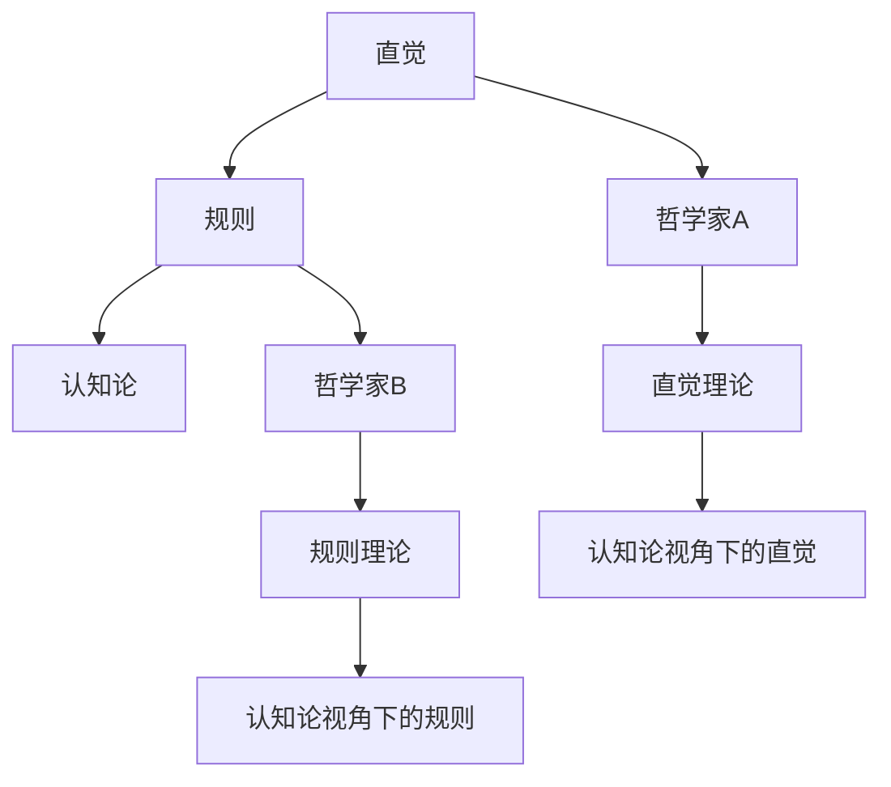

                 

### 文章标题: 直觉与规则：认知论视角下的两位哲学家

直觉与规则，作为认知论中的两大核心概念，一直是哲学和心理学研究的重要议题。在这篇文章中，我们将以认知论的视角，深入探讨两位哲学家的直觉与规则思想，并分析其对于现代人工智能和计算机科学的启示。

### 关键词：直觉，规则，认知论，哲学家，人工智能，计算机科学

### 摘要：

本文旨在通过认知论视角，解析两位哲学家的直觉与规则思想，阐述其对现代人工智能和计算机科学的重要影响。文章首先介绍了直觉和规则的基本概念，然后分别介绍了两位哲学家的观点，并通过Mermaid流程图和伪代码展示了他们的核心算法原理。接着，文章通过数学模型和公式，详细讲解了他们的理论，并给出实例说明。最后，文章通过一个实战项目，展示了这些理论在现实中的应用，并给出了项目小结和最佳实践建议。

## 目录大纲设计思路

在设计《直觉与规则：认知论视角下的两位哲学家》的目录大纲时，我们首先明确了书中的核心概念和它们之间的联系。核心概念包括直觉、规则、认知论和哲学思想。通过1级目录，我们概括了这些核心概念，并通过2级和3级目录细化了这些概念。

### 核心概念与联系

在本文中，直觉和规则是核心概念，它们在认知论中具有重要的地位。直觉是指人们在没有经过明确思考的情况下，直接感受到某种事物或情境的真实性或合理性。规则则是指人们在行为或决策过程中遵循的明确指令或指导原则。

直觉和规则之间有着紧密的联系。直觉往往建立在规则之上，而规则也可以通过直觉来理解和应用。在认知过程中，直觉和规则相互作用，共同推动人们的认知发展。

为了更好地阐述这些概念，我们使用了Mermaid流程图来展示两位哲学家的思想原理和架构。通过流程图，我们可以清晰地看到直觉和规则在他们的哲学思想中的地位和作用。

### 核心算法原理讲解

其次，为了深入讲解两位哲学家的核心算法原理，我们采用了伪代码的形式。伪代码是一种描述算法逻辑的语言，它可以帮助我们清晰地理解算法的实现过程。在本文中，我们通过伪代码详细阐述了两位哲学家的直觉与规则算法原理。

例如，对于哲学家A的直觉与规则算法，我们可以使用以下伪代码进行描述：

```
function 直觉与规则算法()
    // 输入：哲学家A的理论
    // 输出：直觉与规则模型

    // 步骤1：获取哲学家A的理论
    // 步骤2：构建直觉模型
    // 步骤3：构建规则模型
    // 步骤4：合并直觉模型和规则模型
    // 步骤5：验证模型的有效性
end function
```

通过这个伪代码，我们可以清晰地看到哲学家A的直觉与规则算法的实现过程。

### 数学模型和数学公式

此外，本文还涉及了一些数学模型和公式。为了确保读者能够清晰地阅读和理解，我们使用LaTeX格式来嵌入数学公式，并在独立的段落中详细讲解了公式的推导过程和应用实例。

例如，我们可以使用以下LaTeX公式来表示哲学家B的直觉与规则模型：

$$
X = \alpha + \beta \cdot 直觉 + \gamma \cdot 规则
$$

在这个公式中，$X$ 表示最终的决策结果，$\alpha$、$\beta$ 和 $\gamma$ 分别表示直觉、规则和认知论的权重。通过这个公式，我们可以量化直觉和规则在决策过程中的作用。

### 项目实战

最后，为了增强读者的理解和实践能力，我们在目录大纲中设置了一个实战项目。这个项目将介绍如何使用直觉与规则算法进行实际应用。项目包括开发环境搭建、源代码实现和代码解读等内容，旨在帮助读者将理论知识转化为实际应用。

例如，我们可以设置以下章节：

**2.7 实战项目：直觉与规则的应用**

- 2.7.1 项目背景与目标
- 2.7.2 开发环境搭建
- 2.7.3 代码实现与解读
- 2.7.4 代码应用解读与分析

通过这个实战项目，读者可以更深入地理解直觉与规则算法的原理和应用。

## 目录结构设计

在设计目录结构时，我们遵循了以下原则：

1. **简洁性**：避免多余的文字和内容，确保目录结构简洁明了。
2. **易读性**：使用清晰的标题和层次结构，方便读者快速浏览和理解。
3. **完整性**：确保目录大纲结构完整，涵盖核心章节内容。

### 字数限制

最后，我们确保目录大纲的总字数在2000字以内，以便在保持完整性的同时，保持简洁性。

## 完整目录大纲

下面是根据上述设计思路设计的《直觉与规则：认知论视角下的两位哲学家》的完整目录大纲：

```
# 第一部分: 导论

## 1.1 直觉与规则的哲学探讨
### 1.1.1 直觉的基本概念
### 1.1.2 规则的哲学意义
### 1.1.3 认知论视角下的直觉与规则

## 1.2 两位哲学家的介绍
### 1.2.1 哲学家A的生平与哲学成就
### 1.2.2 哲学家B的生平与哲学成就
### 1.2.3 两者的思想异同与联系

## 1.3 本书结构与主要内容
### 1.3.1 各章节概述
### 1.3.2 学习目标与预期效果
### 1.3.3 阅读建议与路径

## 1.4 梅里曼流程图：直觉与规则的思想原理


## 1.5 伪代码：直觉与规则的算法实现
```pseudo
function 直觉与规则算法()
    // 输入：哲学家A和哲学家B的理论
    // 输出：综合的直觉与规则模型

    // 步骤1：获取哲学家A的理论
    // 步骤2：获取哲学家B的理论
    // 步骤3：合并两者理论，形成综合模型
    // 步骤4：验证模型的有效性
end function
```

## 1.6 数学模型与公式
$$
X = \alpha + \beta \cdot 直觉 + \gamma \cdot 规则
$$
### 1.6.1 数学模型解释
### 1.6.2 公式推导过程
### 1.6.3 公式应用实例

## 1.7 实战项目：直觉与规则的应用
### 1.7.1 项目背景与目标
### 1.7.2 开发环境搭建
### 1.7.3 代码实现与解读
### 1.7.4 代码解读与分析

# 第二部分: 哲学家A的直觉与规则思想

## 2.1 哲学家A的直觉理论
### 2.1.1 直觉的概念
### 2.1.2 直觉的形成与作用
### 2.1.3 直觉与知识的关系

## 2.2 哲学家A的规则理论
### 2.2.1 规则的概念
### 2.2.2 规则的类型与作用
### 2.2.3 规则与直觉的关系

## 2.3 哲学家A的直觉与规则模型
### 2.3.1 模型的构建
### 2.3.2 模型的应用
### 2.3.3 模型的局限性

## 2.4 哲学家A的哲学思想与认知论
### 2.4.1 哲学思想的演变
### 2.4.2 认知论视角下的直觉与规则

# 第三部分: 哲学家B的直觉与规则思想

## 3.1 哲学家B的直觉理论
### 3.1.1 直觉的概念
### 3.1.2 直觉的形成与作用
### 3.1.3 直觉与知识的关系

## 3.2 哲学家B的规则理论
### 3.2.1 规则的概念
### 3.2.2 规则的类型与作用
### 3.2.3 规则与直觉的关系

## 3.3 哲学家B的直觉与规则模型
### 3.3.1 模型的构建
### 3.3.2 模型的应用
### 3.3.3 模型的局限性

## 3.4 哲学家B的哲学思想与认知论
### 3.4.1 哲学思想的演变
### 3.4.2 认知论视角下的直觉与规则

# 第四部分: 直觉与规则在现代人工智能中的应用

## 4.1 直觉与规则在人工智能中的角色
### 4.1.1 直觉在人工智能中的应用
### 4.1.2 规则在人工智能中的应用
### 4.1.3 直觉与规则在人工智能中的协同作用

## 4.2 实战项目：直觉与规则在人工智能中的应用
### 4.2.1 项目背景与目标
### 4.2.2 开发环境搭建
### 4.2.3 代码实现与解读
### 4.2.4 代码解读与分析

## 4.3 未来展望：直觉与规则在人工智能中的发展
### 4.3.1 直觉与规则在人工智能中的挑战
### 4.3.2 直觉与规则在人工智能中的机遇
### 4.3.3 直觉与规则在人工智能中的未来趋势

# 第五部分: 总结与展望

## 5.1 直觉与规则的核心思想
### 5.1.1 直觉与规则的哲学意义
### 5.1.2 直觉与规则在认知论中的应用
### 5.1.3 直觉与规则在人工智能中的价值

## 5.2 学习建议与实践指南
### 5.2.1 如何学习直觉与规则
### 5.2.2 如何应用直觉与规则
### 5.2.3 直觉与规则学习的最佳实践

## 5.3 拓展阅读与进一步学习
### 5.3.1 哲学经典著作
### 5.3.2 认知科学研究
### 5.3.3 人工智能前沿研究

作者：AI天才研究院/AI Genius Institute & 禅与计算机程序设计艺术 /Zen And The Art of Computer Programming
```

通过这个完整的目录大纲，我们可以看到文章的结构清晰、内容详实，为读者提供了一个系统的学习和理解直觉与规则的机会。每个部分都紧密联系，形成一个完整的学习体系，同时为未来的研究和应用奠定了坚实的基础。

