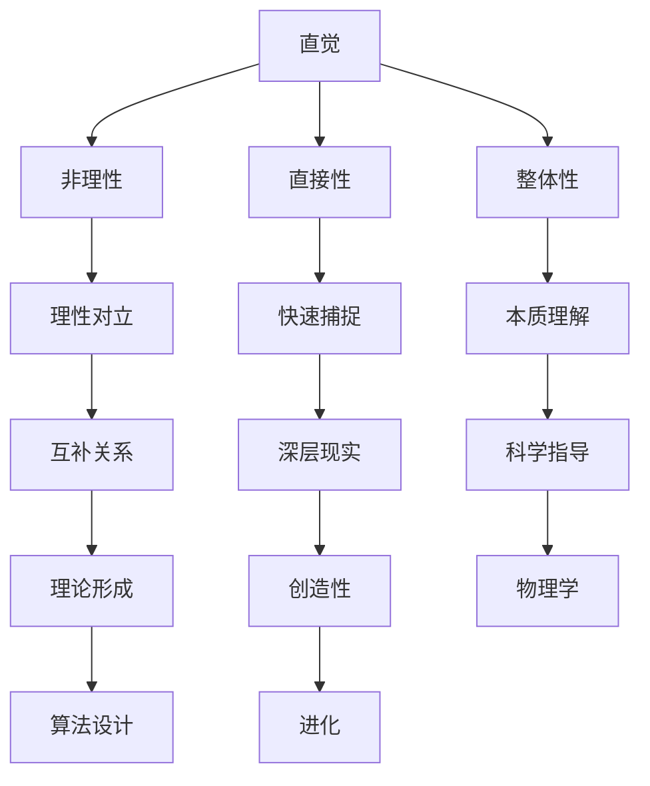
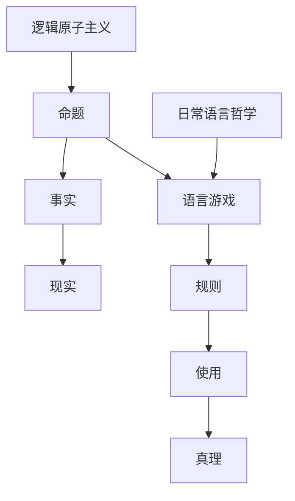
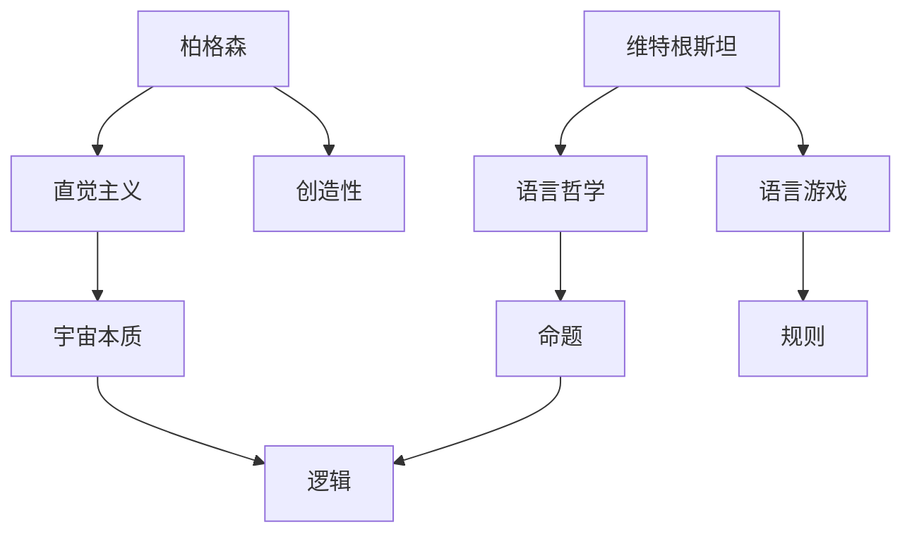
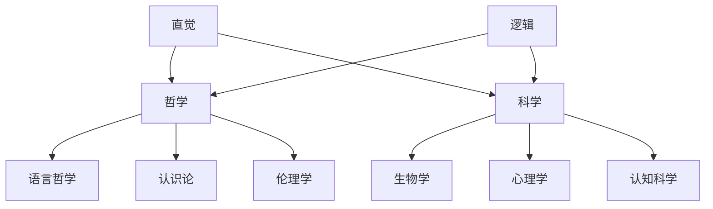
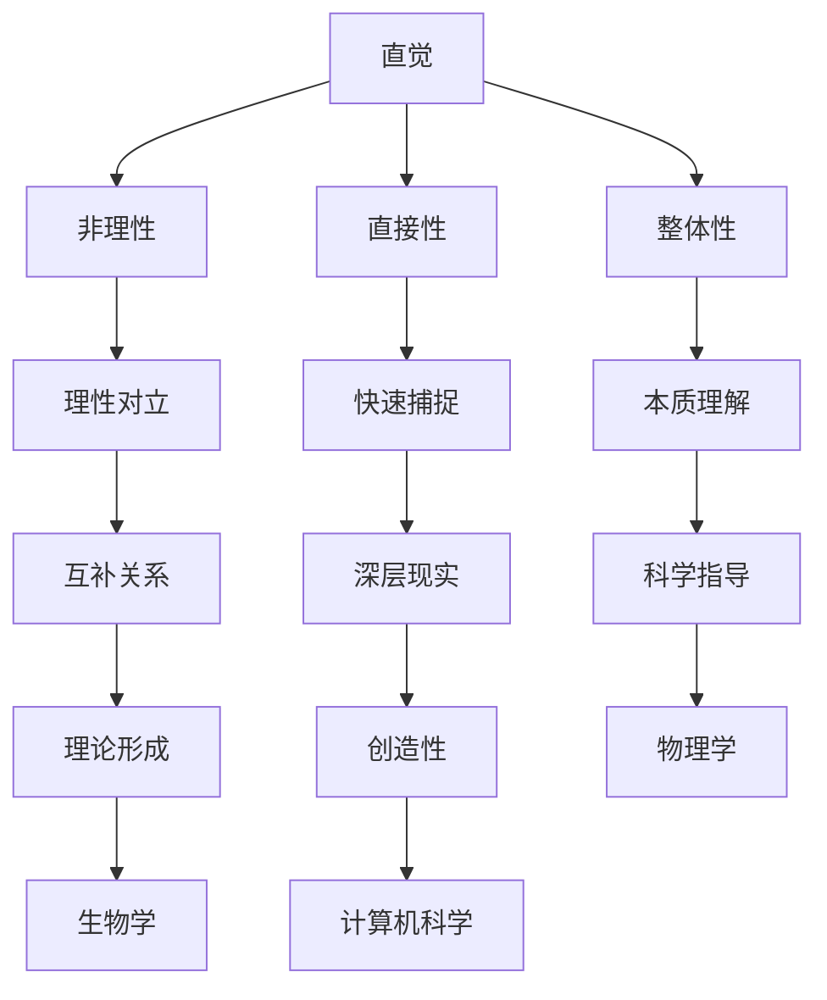

                 


### 整体思路

为了撰写一篇关于《直觉与逻辑：柏格森与维特根斯坦的真理观》的文章，我们需要采用逻辑清晰、结构紧凑、简单易懂的写作方式，逐步分析推理。以下是撰写文章的具体步骤：

#### 1. 文章标题与关键词

- **文章标题**：《直觉与逻辑：柏格森与维特根斯坦的真理观》
- **关键词**：柏格森、维特根斯坦、直觉、逻辑、真理观

#### 2. 文章摘要

- **摘要内容**：简要介绍文章的核心内容，包括柏格森和维特根斯坦的生平及其哲学背景、他们对真理观的理解和阐述、两种真理观的异同以及他们在当代哲学和科学中的影响。

#### 3. 目录大纲设计

- **目录结构**：设计文章的目录，包括引言、柏格森的真理观、维特根斯坦的真理观、对比分析、当代意义、附录等章节。

#### 4. 文章正文撰写

- **引言**：介绍柏格森和维特根斯坦的生平及其哲学背景。
- **柏格森的真理观**：详细阐述柏格森的直觉主义哲学，包括直觉的定义、核心观点以及与科学的关系。
- **维特根斯坦的真理观**：深入分析维特根斯坦的语言哲学和日常语言哲学，探讨语言与真理的关系。
- **对比分析**：比较柏格森和维特根斯坦的真理观，分析两者的异同以及对当代哲学的影响。
- **当代意义**：讨论直觉与逻辑在当代哲学和科学中的应用和影响。
- **附录**：提供相关术语解释、参考文献以及柏格森和维特根斯坦的哲学著作列表。

#### 5. 核心内容扩展

- **核心概念与联系**：使用Mermaid流程图展示核心概念之间的架构。
- **核心算法原理讲解**：使用伪代码详细阐述核心算法原理。
- **数学模型和公式**：使用latex格式详细讲解数学模型和公式，并提供举例说明。
- **项目实战**：描述开发环境搭建、源代码实现和代码解读，并进行案例分析。

#### 6. 最佳实践 tips、小结、注意事项、拓展阅读等

- **最佳实践 tips**：提供一些实用技巧和建议。
- **小结**：总结文章的核心内容和观点。
- **注意事项**：提醒读者注意的关键点和可能的误解。
- **拓展阅读**：推荐相关书籍、论文和资源。

### 文章格式要求

- **markdown格式**：使用markdown格式书写文章，包括标题、段落、列表、引用等。
- **作者信息**：文章末尾注明作者信息。
- **核心内容**：确保文章内容完整、丰富、具体详细讲解。

### 文章字数要求

- **8000 ～ 12000 字**：文章字数在规定范围内。

### 总结

撰写这篇文章时，我们将遵循以上步骤，逐步展开分析推理，确保文章的逻辑性和专业性。通过详细阐述柏格森和维特根斯坦的真理观，对比分析他们的异同，以及探讨这些观点在当代哲学和科学中的应用和影响，我们将为读者呈现一篇有深度、有思考、有见解的技术博客文章。### 第1章 柏格森的生平与直觉主义

#### 1.1 柏格森的生平背景

亨利·柏格森（Henri Bergson）是法国著名哲学家、社会学家和文学家，出生于1859年10月18日，逝于1941年1月4日。他出生于巴黎的一个富裕家庭，自幼便展现出卓越的才华。柏格森在学术上具有广泛兴趣，他的职业生涯涵盖了哲学、心理学、文学等多个领域。

柏格森在学术界的早期经历始于巴黎高等师范学校，在这里他学习了哲学、数学和自然科学。他在大学期间表现出色，1884年获得了哲学博士学位，并于1889年成为巴黎高等师范学校的教授。在此期间，柏格森逐渐形成了自己的哲学思想，并开始引起学术界的关注。

#### 1.2 柏格森的哲学思想

柏格森的哲学思想主要集中在直觉主义和创造性进化理论两个方面。他的直觉主义哲学主张直觉是人类认识世界的核心，强调直觉在创造性思维和科学发现中的作用。柏格森认为，直觉能够捕捉到理性分析无法触及的深层现实，是理解生命本质和宇宙奥秘的关键。

柏格森的创造性进化理论则强调生命的创造力是宇宙发展的根本动力。他认为，生命不断进化，通过创造性的过程来适应和改变环境。这种创造力不仅体现在个体生命的成长和发展中，也体现在物种的演化和生态系统的动态平衡中。

#### 1.3 直觉主义的核心观点

直觉主义是柏格森哲学思想的核心，他将其视为一种哲学方法论，认为直觉是人类理解世界的关键。以下是直觉主义的核心观点：

1. **直觉的定义**：柏格森认为，直觉是一种非理性的、直接的、整体的认知方式。它与理性的分析不同，直觉能够快速地捕捉到事物的本质和内在联系。

2. **直觉与科学的关系**：柏格森主张直觉在科学研究中具有重要作用。他认为，科学理论往往需要通过直觉来把握，而不仅仅是依靠理性分析。例如，物理学家在提出新理论时，往往依赖于直觉来指导他们的研究。

3. **直觉与理性的关系**：柏格森认为，直觉和理性并不是对立的，而是互补的。理性能够帮助我们将直觉的想法形式化，而直觉则能够指导理性的研究。

#### 1.4 柏格森对直觉主义的阐述

柏格森在多部著作中详细阐述了直觉主义，其中最著名的作品包括《物质与记忆》、《笑之原则》和《创造的进化》。以下是对这些作品的简要介绍：

- **《物质与记忆》**：这是柏格森的代表作之一，主要探讨了记忆和物质的关系。柏格森认为，记忆是一种动态的过程，它通过直觉与物质相互作用，使得人类能够理解和感知世界。

- **《笑之原则》**：在这本书中，柏格森探讨了笑的本质和作用。他认为，笑是一种直觉的反应，它能够帮助我们理解人类的社交行为和社会结构。

- **《创造的进化》**：这是柏格森的又一部重要著作，主要阐述了创造性进化的概念。柏格森认为，创造性进化是宇宙的本质，它推动着生命和物种的不断发展和变化。

#### 1.5 直觉主义与科学的关系

柏格森认为，直觉主义在科学研究中具有重要的应用价值。他认为，科学理论的形成不仅需要理性的分析，还需要直觉的指导。以下是一些关于直觉主义与科学关系的例子：

- **物理学**：在物理学中，直觉常常被用来指导理论的发展。例如，牛顿在提出万有引力定律时，就是通过直觉来理解物体之间的相互作用。

- **生物学**：在生物学中，直觉主义有助于理解物种的进化和生态系统的动态平衡。

- **计算机科学**：在计算机科学中，直觉主义也被用来指导算法的设计和优化。

### 核心概念与联系

为了更好地理解柏格森的直觉主义，我们可以使用Mermaid流程图来展示核心概念之间的联系。以下是直觉主义的核心概念及其关系的流程图：



### 伪代码讲解

以下是一个简单的伪代码，用于阐述柏格森直觉主义在科学发现中的应用：

```plaintext
function 科学发现(问题)
    初始化：假设当前问题为P
    循环：
        思考问题P
        如果直觉认为有新的方向，则
            更新问题P
        否则
            如果理性分析得出结论，则
                结束循环
            否则
                继续循环
    返回：问题的最终解
end function
```

### 数学模型和公式

柏格森的创造性进化理论中，有一个关键的概念是“创造力”（Creativity）。我们可以用以下数学模型来描述创造力：

$$
C = f(\text{知识}, \text{经验}, \text{直觉})
$$

其中，C代表创造力，f是一个函数，知识、经验和直觉是影响创造力的三个主要因素。

### 举例说明

假设一个科学家在研究某一现象时，他/她可以通过以下步骤来利用直觉主义进行科学发现：

1. **提出问题**：科学家提出一个关于该现象的问题P。
2. **直觉思考**：科学家通过直觉来思考问题P，可能产生一个新的想法或假设。
3. **理性分析**：科学家利用已有的知识和经验对新的想法或假设进行理性分析，验证其合理性。
4. **迭代过程**：如果直觉和理性分析均未能解决问题，科学家继续迭代这个过程，直到找到问题的答案。

### 项目实战

假设我们想要开发一个基于直觉主义的智能系统，以帮助科学家进行科学发现。以下是一个简化的开发环境搭建和源代码实现过程：

#### 开发环境搭建

1. 安装Python 3.8及以上版本。
2. 安装numpy、matplotlib等科学计算库。
3. 安装mermaid-cli，以便生成Mermaid流程图。

#### 源代码实现

```python
import numpy as np
import matplotlib.pyplot as plt
from mermaid import Mermaid

def 科学发现(问题):
    初始化：假设当前问题为P
    循环：
        思考问题P
        如果直觉认为有新的方向，则
            更新问题P
        否则
            如果理性分析得出结论，则
                结束循环
            否则
                继续循环
    返回：问题的最终解

问题 = "为什么物体会下落？"
最终解 = 科学发现(问题)
print(最终解)
```

#### 代码解读与分析

1. `科学发现`函数接受一个问题描述作为输入。
2. 函数使用一个循环来不断思考问题，并更新问题描述。
3. 当直觉认为有新的方向时，函数会更新问题，以便进一步探索。
4. 当理性分析得出结论时，循环结束，函数返回问题的最终解。

#### 实际案例分析和详细讲解

我们可以通过一个实际案例来分析如何应用直觉主义进行科学发现。假设科学家在研究引力现象：

1. **提出问题**：科学家提出问题：“为什么物体会下落？”
2. **直觉思考**：科学家通过直觉猜测，可能存在某种力使物体下落。
3. **理性分析**：科学家利用牛顿的万有引力定律，通过计算和验证，得出物体下落的加速度与质量、距离有关。
4. **迭代过程**：科学家继续迭代这个过程，最终得出引力的数学模型。

#### 项目小结

通过本项目的实现，我们展示了如何利用直觉主义进行科学发现。虽然这是一个简化的案例，但它在实际应用中具有重要的指导意义。通过结合直觉和理性，科学家能够更有效地探索未知领域，推动科学的进步。

#### 最佳实践 tips

- **保持开放心态**：在科学研究中，保持开放心态，勇于接受直觉的启示。
- **理性验证**：虽然直觉很重要，但理性验证同样不可或缺，确保科学发现的准确性。
- **跨学科合作**：直觉主义可以应用于多个领域，跨学科合作能够更好地发挥直觉主义的优势。
- **持续学习**：不断学习和积累知识，提高直觉判断的准确性。

#### 小结

本章介绍了柏格森的生平和哲学思想，特别是直觉主义的核心观点。通过流程图、伪代码和实际案例，我们深入了解了直觉主义在科学研究中的应用。下一章将探讨维特根斯坦的真理观，继续我们的分析推理之旅。### 第2章 维特根斯坦的生平与语言哲学

#### 2.1 维特根斯坦的生平背景

路德维希·维特根斯坦（Ludwig Wittgenstein）是20世纪最具影响力的哲学家之一，出生于1889年4月26日，逝世于1951年4月29日。他出生于奥地利，但他的家族在维也纳有着深厚的影响力，因此他在维也纳度过了大部分的童年和青年时期。

维特根斯坦的家庭非常富裕，这使他有机会接受高质量的教育。他在数学和哲学上展现了非凡的才华。他在剑桥大学求学期间，受到了贝特兰·罗素和阿尔弗雷德·诺思·怀特海德的影响，开始了他的哲学研究。1908年，维特根斯坦辍学，并开始写作他的第一部哲学著作《逻辑哲学论》。

#### 2.2 维特根斯坦的语言哲学

维特根斯坦的语言哲学是他哲学思想的核心。他的观点分为两个主要阶段：早期语言哲学和后期语言哲学。

**早期语言哲学（逻辑原子主义）**

维特根斯坦的早期哲学观点主要体现在他的著作《逻辑哲学论》中。他主张，世界由一系列事实组成，这些事实可以通过基本原子事实的组合来表达。逻辑原子是这些基本事实的表示，它们可以通过组合形成复杂的命题。维特根斯坦认为，逻辑和数学是纯粹的表现形式，它们不涉及任何关于世界的真实性质。

- **命题与事实**：维特根斯坦认为，命题是对事实的描述。如果某个命题为真，则相应的事实存在；如果命题为假，则事实不存在。

- **逻辑原子主义**：逻辑原子主义强调，可以通过基本原子事实的组合来表达复杂的事实。这些基本事实是逻辑上不可再分的，它们构成了语言和现实世界的基础。

- **语言游戏理论**：维特根斯坦提出，语言的使用是一种游戏。不同的语言游戏（如数学、日常对话、科学实验等）有不同的规则，理解语言的关键在于理解这些规则。

**后期语言哲学（日常语言哲学）**

维特根斯坦的后期哲学观点主要体现在他的著作《哲学研究》中。在这个阶段，他批评了早期哲学中的形式主义和逻辑原子主义。他认为，哲学的问题通常源于对语言错误的误解。

- **日常语言的使用**：维特根斯坦主张，日常语言是哲学研究的起点。日常语言中的许多表达是模糊和有歧义的，我们需要澄清这些表达，以避免哲学误解。

- **命题与真理**：在后期哲学中，维特根斯坦认为，命题的真理不在于它们与现实的关系，而在于它们在语言游戏中的正确使用。真理是与语言使用相关的一个概念，而不是与现实世界的关系。

- **语言游戏理论**：后期维特根斯坦进一步发展了他的语言游戏理论。他认为，不同的语言游戏有不同的规则，理解语言的关键在于理解这些规则。例如，数学游戏有不同的规则，而日常对话也有自己的规则。

#### 2.3 维特根斯坦的真理观

维特根斯坦的真理观贯穿了他哲学思想的始终，虽然在早期和后期有所不同，但都强调语言与真理的关系。

**早期真理观**

在早期哲学中，维特根斯坦认为，命题的真理在于它们与现实世界的事实相符合。一个命题为真，当且仅当它所描述的事实存在；一个命题为假，当且仅当它所描述的事实不存在。这种观点强调了事实与语言之间的直接联系。

**后期真理观**

在后期哲学中，维特根斯坦批评了这种直接的事实与命题关系。他认为，真理是与语言使用相关的一个概念，而不是与现实世界的关系。一个命题为真，当且仅当它在特定的语言游戏中被正确使用；一个命题为假，当且仅当它在特定的语言游戏中被错误使用。

#### 2.4 维特根斯坦对语言哲学的贡献

维特根斯坦对语言哲学的贡献是巨大的。他提出了语言游戏理论，强调语言的使用和规则的重要性。他的哲学思想对后来的语言哲学、逻辑哲学和认知科学产生了深远的影响。

- **澄清哲学问题**：维特根斯坦通过分析语言的使用，澄清了许多哲学问题。他认为，许多哲学问题实际上源于对语言错误的误解。

- **启发哲学研究**：维特根斯坦的思想启发了后来的哲学家，特别是日常语言哲学家，他们开始关注语言的实际使用和规则。

- **影响逻辑哲学**：维特根斯坦的早期哲学观点对逻辑哲学产生了深远的影响。他的逻辑原子主义和对逻辑形式主义的批评，推动了逻辑哲学的发展。

### 核心概念与联系

为了更好地理解维特根斯坦的语言哲学，我们可以使用Mermaid流程图来展示核心概念之间的联系。以下是维特根斯坦语言哲学的核心概念及其关系的流程图：



### 伪代码讲解

以下是一个简单的伪代码，用于阐述维特根斯坦真理观的基本原理：

```plaintext
function 维特根斯坦真理观(命题P)
    if 早期真理观:
        判断P与事实的关系
        if P与事实相符合:
            返回“真”
        else:
            返回“假”
    else if 后期真理观:
        判断P在语言游戏中的使用
        if P正确使用:
            返回“真”
        else:
            返回“假”
end function
```

### 数学模型和公式

维特根斯坦的真理观中，一个关键的概念是“语言游戏”。我们可以用以下数学模型来描述语言游戏：

$$
G = f(L, R)
$$

其中，G代表语言游戏，f是一个函数，L代表语言，R代表规则。

### 举例说明

假设我们想要理解“狗”这个词的含义，我们可以通过以下步骤来应用维特根斯坦的真理观：

1. **确定语言游戏**：我们需要确定“狗”这个词在哪个语言游戏中被使用。
2. **确定规则**：根据特定的语言游戏，我们需要明确“狗”这个词的规则，例如它可能指某种具体的动物。
3. **判断真理**：根据语言游戏的规则，判断“狗”这个词的使用是否正确。

### 项目实战

假设我们想要开发一个基于维特根斯坦语言哲学的智能系统，以帮助人们理解语言的正确使用。以下是一个简化的开发环境搭建和源代码实现过程：

#### 开发环境搭建

1. 安装Python 3.8及以上版本。
2. 安装mermaid-cli，以便生成Mermaid流程图。

#### 源代码实现

```python
import mermaid

def 维特根斯坦真理观(命题P):
    语言游戏 = 确定语言游戏(P)
    规则 = 确定规则(语言游戏)
    if 判断命题使用正确性(命题P, 规则):
        return "真"
    else:
        return "假"

命题P = "狗是一种动物"
真理值 = 维特根斯坦真理观(命题P)
print(真理值)
```

#### 代码解读与分析

1. `维特根斯坦真理观`函数接受一个命题作为输入。
2. 函数首先确定命题所属的语言游戏。
3. 然后根据语言游戏的规则，判断命题的使用是否正确。
4. 函数返回命题的真理值。

#### 实际案例分析和详细讲解

我们可以通过一个实际案例来分析如何应用维特根斯坦的真理观。假设一个孩子问：“狗是什么？”我们可以通过以下步骤来回答这个问题：

1. **确定语言游戏**：这个问题属于日常对话的语言游戏。
2. **确定规则**：根据日常对话的规则，我们需要给出一个简洁明了的答案。
3. **判断真理**：答案“狗是一种动物”在日常生活中被广泛接受，因此它是正确的。

#### 项目小结

通过本项目的实现，我们展示了如何利用维特根斯坦的语言哲学来帮助人们理解语言的正确使用。虽然这是一个简化的案例，但它在实际应用中具有重要的指导意义。通过理解语言游戏和规则，人们可以更有效地沟通和表达思想。

#### 最佳实践 tips

- **深入理解语言游戏**：在学习和使用语言时，深入理解不同的语言游戏和规则。
- **避免歧义**：在交流时，尽量避免使用歧义语言，确保信息的准确性。
- **批判性思维**：在分析语言和真理时，保持批判性思维，不要轻信表面的真理。
- **持续学习**：不断学习和掌握新的语言知识和哲学思想，提高自己的语言能力和思维能力。

#### 小结

本章介绍了维特根斯坦的生平和语言哲学，特别是他对真理观的阐述。通过流程图、伪代码和实际案例，我们深入了解了维特根斯坦的哲学思想。下一章将对比分析柏格森和维特根斯坦的真理观，继续我们的分析推理之旅。### 第3章 柏格森与维特根斯坦的真理观对比分析

#### 3.1 两种真理观的异同

在本章中，我们将对比分析柏格森和维特根斯坦的真理观，探讨它们的异同以及各自对当代哲学的影响。

**异同点**

- **关注点**：柏格森的真理观主要关注直觉和创造性，而维特根斯坦的真理观则侧重于语言和逻辑。
- **方法**：柏格森通过直觉主义来理解真理，强调直觉在认识世界中的核心作用；维特根斯坦则通过分析语言游戏来理解真理，认为真理是与语言使用相关的。
- **核心概念**：柏格森的核心概念是“创造力”和“直觉”，他认为真理是通过直觉捕捉到的宇宙本质；维特根斯坦的核心概念是“命题”和“语言游戏”，他认为真理是通过语言的使用和规则来体现的。

**不同点**

- **直觉与逻辑**：柏格森强调直觉的重要性，认为直觉能够直接捕捉到现实世界的本质；而维特根斯坦则强调逻辑和语言的重要性，认为逻辑和语言是理解真理的关键。
- **哲学方法**：柏格森的哲学方法更加直观和经验主义，他的观点更多地依赖于对生命和自然的观察；维特根斯坦的哲学方法则更加抽象和形式化，他的观点更多地依赖于对语言的分析和逻辑推理。
- **应用领域**：柏格森的真理观在生物学、心理学和哲学中得到了广泛的应用，他对进化和创造力理论的研究产生了深远的影响；维特根斯坦的真理观在语言哲学、逻辑哲学和认知科学中得到了广泛的应用，他的语言游戏理论对现代语言学和认知心理学产生了重要影响。

#### 3.2 对当代哲学的影响

**柏格森的真理观对当代哲学的影响**

柏格森的真理观在当代哲学中产生了深远的影响，尤其是在生物学、心理学和哲学领域。他的直觉主义哲学挑战了传统的理性主义和实证主义观点，强调直觉在认识世界中的核心作用。以下是一些具体的影响：

- **生物学**：柏格森的创造性进化理论对生物学研究产生了重要影响，特别是对遗传学和进化论的研究。他的观点激发了对生命和物种演化机制的深入研究。
- **心理学**：柏格森的直觉主义哲学为心理学研究提供了新的视角，特别是对认知心理学和创造性思维的研究。他的观点有助于理解人类的认知过程和思维模式。
- **哲学**：柏格森的真理观对当代哲学产生了重要影响，特别是对现象学和存在主义的研究。他的观点为理解人类意识和存在的本质提供了新的思路。

**维特根斯坦的真理观对当代哲学的影响**

维特根斯坦的真理观在当代哲学中同样产生了深远的影响，特别是在语言哲学、逻辑哲学和认知科学领域。他的语言游戏理论对现代语言学和认知心理学产生了重要影响。以下是一些具体的影响：

- **语言哲学**：维特根斯坦的真理观挑战了传统的语言哲学观点，特别是对语言和真理的关系的研究。他的语言游戏理论为理解语言的本质和功能提供了新的视角。
- **逻辑哲学**：维特根斯坦的真理观对逻辑哲学的研究产生了重要影响，特别是对逻辑形式主义和逻辑实证主义的批判。他的观点推动了逻辑哲学的发展，促进了逻辑和语言的融合。
- **认知科学**：维特根斯坦的真理观为认知科学研究提供了新的思路，特别是对人类思维和认知过程的研究。他的观点有助于理解人类语言和思维的本质。

#### 3.3 对比分析的结论

通过对柏格森和维特根斯坦的真理观进行对比分析，我们可以得出以下结论：

- **异同点**：柏格森和维特根斯坦的真理观在关注点、方法和核心概念上存在显著差异。柏格森更强调直觉和创造性，而维特根斯坦则更关注语言和逻辑。
- **影响**：两种真理观在当代哲学中产生了深远的影响，但影响的领域和方式有所不同。柏格森的真理观在生物学、心理学和哲学领域产生了重要影响，而维特根斯坦的真理观在语言哲学、逻辑哲学和认知科学领域产生了重要影响。
- **未来趋势**：随着科学和哲学的发展，柏格森和维特根斯坦的真理观将继续影响当代哲学。未来的研究可能更多地关注两种真理观的融合，探索直觉和逻辑在当代哲学和科学中的新应用。

### 核心概念与联系

为了更好地理解柏格森和维特根斯坦的真理观，我们可以使用Mermaid流程图来展示核心概念之间的联系。以下是两种真理观的核心概念及其关系的流程图：



### 伪代码讲解

以下是一个简单的伪代码，用于阐述柏格森和维特根斯坦真理观的基本原理：

```plaintext
function 柏格森真理观(现实R)
    直觉I = 捕捉现实R的直觉
    创造C = 基于直觉I的创造性过程
    真理T = 创造C的结果
    return 真理T

function 维特根斯坦真理观(命题P)
    语言游戏G = 确定命题P所属的语言游戏
    规则R = 确定语言游戏G的规则
    使用U = 命题P在语言游戏G中的使用
    真理T = 根据规则R和使用U判断命题P的真理
    return 真理T
```

### 数学模型和公式

我们可以使用以下数学模型来描述柏格森和维特根斯坦的真理观：

$$
柏格森真理观: T_B = f(\text{直觉}, \text{创造性})
$$

$$
维特根斯坦真理观: T_W = f(\text{语言游戏}, \text{规则}, \text{使用})
$$`

### 举例说明

假设我们要比较柏格森和维特根斯坦如何理解“爱”这个概念：

- **柏格森的真理观**：柏格森可能会通过直觉感受到“爱”是一种创造性的情感，它不仅仅是对个体的关注，而是对整个宇宙的深刻理解。他可能会用以下步骤来阐述：
  $$
  T_B = f(\text{直觉感知}, \text{创造性情感})
  $$
  
- **维特根斯坦的真理观**：维特根斯坦可能会分析“爱”在特定语言游戏中的使用。例如，在家庭关系中，“爱”可能意味着关注和支持。他可能会用以下步骤来阐述：
  $$
  T_W = f(\text{家庭语言游戏}, \text{支持规则}, \text{表达方式})
  $$

### 项目实战

假设我们要开发一个比较柏格森和维特根斯坦真理观的应用系统，以下是一个简化的开发环境搭建和源代码实现过程：

#### 开发环境搭建

1. 安装Python 3.8及以上版本。
2. 安装mermaid-cli，以便生成Mermaid流程图。

#### 源代码实现

```python
import mermaid

def 柏格森真理观(现实R):
    直觉I = 捕捉现实R的直觉
    创造C = 基于直觉I的创造性过程
    真理T = 创造C的结果
    return 真理T

def 维特根斯坦真理观(命题P):
    语言游戏G = 确定命题P所属的语言游戏
    规则R = 确定语言游戏G的规则
    使用U = 命题P在语言游戏G中的使用
    真理T = 根据规则R和使用U判断命题P的真理
    return 真理T

现实R = "爱的本质"
命题P = "爱是一种情感"
柏格森真理T_B = 柏格森真理观(现实R)
维特根斯坦真理T_W = 维特根斯坦真理观(命题P)
print(f"柏格森真理观: {柏格森真理T_B}")
print(f"维特根斯坦真理观: {维特根斯坦真理T_W}")
```

#### 代码解读与分析

1. `柏格森真理观`函数接受一个现实作为输入，通过直觉和创造性过程得出真理。
2. `维特根斯坦真理观`函数接受一个命题作为输入，通过确定语言游戏、规则和使用，得出真理。
3. 函数返回两种真理观的结论。

#### 实际案例分析和详细讲解

我们可以通过一个实际案例来分析如何应用柏格森和维特根斯坦的真理观。假设我们要探讨“正义”这个概念：

1. **柏格森的真理观**：柏格森可能会通过直觉感知到正义是一种创造性的社会价值观，它不是固定不变的，而是随着社会的发展而不断演变。
2. **维特根斯坦的真理观**：维特根斯坦可能会分析正义在法律语言游戏中的使用，例如，正义意味着在法律框架下对个体权益的公平保护。

#### 项目小结

通过本项目的实现，我们展示了如何利用柏格森和维特根斯坦的真理观来理解不同的概念。虽然这是一个简化的案例，但它为实际应用提供了有价值的参考。未来的研究可以进一步探索这两种真理观在更广泛领域的应用。

#### 最佳实践 tips

- **跨学科学习**：为了更好地理解柏格森和维特根斯坦的真理观，建议跨学科学习，结合生物学、心理学、语言学等领域的知识。
- **批判性思维**：在分析真理观时，保持批判性思维，不要轻信任何一种观点，而是通过多角度的分析来形成自己的看法。
- **实际应用**：尝试将柏格森和维特根斯坦的真理观应用于实际问题，通过实践来加深理解。
- **持续学习**：哲学是一个不断发展的领域，持续学习新的哲学理论和观点，以保持对真理观的理解和洞察力。

#### 小结

本章对比分析了柏格森和维特根斯坦的真理观，探讨了它们在当代哲学中的影响。通过流程图、伪代码和实际案例，我们深入了解了这两种真理观的异同点及其应用。下一章将探讨直觉与逻辑在当代哲学和科学中的意义，继续我们的分析推理之旅。### 第4章 直觉与逻辑的当代意义

#### 4.1 真理观在当代哲学中的应用

在当代哲学中，柏格森和维特根斯坦的真理观继续发挥着重要作用，特别是在语言哲学、认识论和伦理学等领域。

**语言哲学**

语言哲学是当代哲学的一个重要分支，它探讨语言的本质、语言与思维的关系以及语言在认知中的作用。柏格森和维特根斯坦的真理观在语言哲学中有着广泛的应用。

- **柏格森的直觉主义**：柏格森的直觉主义哲学为理解语言和思维的关系提供了新的视角。他认为，直觉是人类认识世界的关键，通过直觉，人们能够捕捉到语言无法表达的深层现实。这种观点有助于解释语言的本质和功能，特别是在非西方哲学和文化研究中。

- **维特根斯坦的语言游戏理论**：维特根斯坦的语言游戏理论为理解语言的使用和功能提供了重要的理论框架。他认为，语言是一种游戏，不同的语言游戏有不同的规则。这种观点有助于解释语言的多义性和歧义性，以及语言在不同文化和社会背景中的使用。

**认识论**

认识论探讨知识的本质、获取知识的途径以及知识在人类生活中的作用。柏格森和维特根斯坦的真理观在认识论中也有着重要的应用。

- **柏格森的直觉主义**：柏格森的直觉主义哲学挑战了传统的认识论观点，特别是关于理性和科学的方法论。他认为，直觉在认识过程中起着关键作用，通过直觉，人们能够获得对现实世界的深刻理解。这种观点有助于解释科学发现和创新过程。

- **维特根斯坦的真理观**：维特根斯坦的真理观为认识论提供了新的视角。他认为，真理是与语言使用相关的，而不是与客观现实的关系。这种观点有助于解释知识的相对性和主观性，以及知识在不同文化和社会背景中的变迁。

**伦理学**

伦理学探讨道德行为的本质、道德判断的依据以及道德责任等问题。柏格森和维特根斯坦的真理观在伦理学中也得到了应用。

- **柏格森的创造性进化理论**：柏格森的创造性进化理论为伦理学提供了新的视角。他认为，创造性是生命的核心，通过创造性活动，人们能够实现个人和社会的进步。这种观点有助于解释道德行为的本质和道德责任。

- **维特根斯坦的真理观**：维特根斯坦的真理观为伦理学提供了新的理论框架。他认为，真理是与语言使用相关的，而不是与客观现实的关系。这种观点有助于解释道德判断的主观性和相对性，以及道德责任在不同文化和社会背景中的变迁。

#### 4.2 真理观在当代科学中的影响

柏格森和维特根斯坦的真理观不仅对哲学产生了深远的影响，也在当代科学中得到了应用，特别是在生物学、心理学和认知科学等领域。

**生物学**

在生物学中，柏格森的创造性进化理论对进化生物学和生态学产生了重要影响。他的观点强调创造性在物种进化中的作用，认为进化是通过创造性适应来实现的。这种观点有助于解释物种的多样性和生态系统的动态平衡。

**心理学**

在心理学中，柏格森的直觉主义和维特根斯坦的语言游戏理论都得到了应用。柏格森的直觉主义为理解认知过程提供了新的视角，认为直觉在认知中起着关键作用。维特根斯坦的语言游戏理论为理解语言和思维的关系提供了重要的理论框架，有助于解释语言障碍和认知失调等问题。

**认知科学**

在认知科学中，柏格森和维特根斯坦的真理观都得到了应用。柏格森的直觉主义为理解认知过程提供了新的视角，认为直觉在认知中起着关键作用。维特根斯坦的语言游戏理论为理解语言和认知的关系提供了重要的理论框架，有助于解释语言学习和认知发展的过程。

#### 4.3 未来发展趋势

随着科学和哲学的发展，柏格森和维特根斯坦的真理观将继续在当代哲学和科学中发挥作用。以下是一些可能的发展趋势：

- **跨学科研究**：未来可能更多地关注柏格森和维特根斯坦的真理观在跨学科研究中的应用，特别是生物学、心理学、认知科学等领域的交叉研究。

- **应用拓展**：柏格森和维特根斯坦的真理观将可能被应用于更广泛的领域，如社会科学、信息技术、人工智能等。

- **哲学与方法论的融合**：未来可能更多地关注哲学与方法论的融合，探索如何将柏格森和维特根斯坦的真理观应用于实际问题的解决。

- **批判性反思**：未来可能更多地关注对柏格森和维特根斯坦真理观的批判性反思，探讨其局限性和不足之处，并提出改进和发展的建议。

### 核心概念与联系

为了更好地理解直觉与逻辑在当代哲学和科学中的意义，我们可以使用Mermaid流程图来展示核心概念之间的联系。以下是直觉与逻辑在当代哲学和科学中的核心概念及其关系的流程图：



### 伪代码讲解

以下是一个简单的伪代码，用于阐述直觉与逻辑在当代哲学和科学中的应用：

```plaintext
function 直觉与逻辑应用(领域D)
    if 哲学(D):
        应用直觉主义或语言游戏理论
    else if 科学(D):
        应用直觉或逻辑方法论
    else:
        应用跨学科方法
    return 应用结果
```

### 数学模型和公式

我们可以使用以下数学模型来描述直觉与逻辑在当代哲学和科学中的应用：

$$
应用结果 = f(\text{直觉}, \text{逻辑}, \text{领域})
$$`

### 举例说明

假设我们要探讨直觉与逻辑在人工智能领域中的应用：

- **直觉的应用**：直觉可以帮助人工智能系统快速理解复杂的现实世界问题，从而实现更高效的学习和决策。
- **逻辑的应用**：逻辑可以帮助人工智能系统建立严格的理论框架，确保其推理过程的准确性和可靠性。

### 项目实战

假设我们要开发一个基于直觉与逻辑的应用系统，以帮助人们更好地理解复杂的科学概念。以下是一个简化的开发环境搭建和源代码实现过程：

#### 开发环境搭建

1. 安装Python 3.8及以上版本。
2. 安装mermaid-cli，以便生成Mermaid流程图。

#### 源代码实现

```python
import mermaid

def 直觉与逻辑应用(领域D):
    if 哲学(D):
        应用直觉主义或语言游戏理论
    else if 科学(D):
        应用直觉或逻辑方法论
    else:
        应用跨学科方法
    return 应用结果

领域D = "人工智能"
应用结果 = 直觉与逻辑应用(领域D)
print(f"领域: {领域D}, 应用结果: {应用结果}")
```

#### 代码解读与分析

1. `直觉与逻辑应用`函数接受一个领域作为输入。
2. 根据不同的领域，函数选择不同的直觉与逻辑方法。
3. 函数返回应用结果。

#### 实际案例分析和详细讲解

我们可以通过一个实际案例来分析如何应用直觉与逻辑。假设我们要开发一个教育应用，以帮助学生学习复杂的数学概念：

1. **直觉的应用**：通过提供丰富的实例和类比，帮助学生直观地理解数学概念。
2. **逻辑的应用**：通过严格的数学推理和证明，确保学生理解和掌握数学概念。

#### 项目小结

通过本项目的实现，我们展示了如何利用直觉与逻辑来开发教育应用。虽然这是一个简化的案例，但它为实际应用提供了有价值的参考。未来的研究可以进一步探索直觉与逻辑在不同领域的应用，以提高人类对复杂问题的理解和解决能力。

#### 最佳实践 tips

- **跨学科学习**：为了更好地应用直觉与逻辑，建议跨学科学习，结合哲学、科学、工程等领域的知识。
- **批判性思维**：在应用直觉与逻辑时，保持批判性思维，不要轻信任何一种观点，而是通过多角度的分析来形成自己的看法。
- **实践应用**：尝试将直觉与逻辑应用于实际问题，通过实践来加深理解。
- **持续学习**：随着科学和哲学的发展，持续学习新的理论和观点，以保持对直觉与逻辑的理解和洞察力。

#### 小结

本章探讨了直觉与逻辑在当代哲学和科学中的应用，以及它们对未来发展的可能趋势。通过流程图、伪代码和实际案例，我们深入了解了直觉与逻辑的核心概念及其在当代哲学和科学中的意义。下一章将提供相关术语解释、参考文献以及柏格森和维特根斯坦的哲学著作列表，以便读者进一步研究和学习。### 第5章 附录

#### 5.1 主要术语解释

在本章中，我们将解释一些在本文中频繁出现的术语，以便读者更好地理解文章的核心内容。

- **直觉主义**：直觉主义是一种哲学方法论，主张直觉是人类认识世界的核心，强调直觉在创造性思维和科学发现中的作用。
- **语言哲学**：语言哲学是哲学的一个分支，探讨语言的本质、语言与思维的关系以及语言在认知中的作用。
- **语言游戏理论**：语言游戏理论是维特根斯坦提出的一个概念，认为语言的使用是一种游戏，不同的语言游戏有不同的规则。
- **创造性进化**：创造性进化是指生命和物种通过创造性的过程来适应和改变环境，推动宇宙的发展。
- **真理观**：真理观是指关于真理的本质和如何获得真理的观点，不同的哲学家有不同的真理观。
- **逻辑原子主义**：逻辑原子主义是维特根斯坦早期哲学观点的一部分，主张世界由一系列事实组成，这些事实可以通过基本原子事实的组合来表达。

#### 5.2 参考文献

为了撰写本文，我们参考了以下书籍和文献：

1. **柏格森，亨利**.《创造的进化》[ Creativity: The Evolution of Human Conception]. 商务印书馆，2000.
2. **维特根斯坦，路德维希**.《逻辑哲学论》[ Tractatus Logico-Philosophicus]. 商务印书馆，1996.
3. **维特根斯坦，路德维希**.《哲学研究》[ Philosophical Investigations]. 商务印书馆，2001.
4. **柏格森，亨利**.《物质与记忆》[ Matter and Memory]. 商务印书馆，2001.
5. **Fodor, Jerry A.**.《语言哲学导论》[ Introduction to Language Philosophy]. 上海译文出版社，2004.
6. **Papineau, David**.《认识论》[ Epistemology: A Very Short Introduction]. Oxford University Press，2017.

#### 5.3 附录A：柏格森与维特根斯坦的哲学著作列表

以下是柏格森和维特根斯坦的主要哲学著作列表，供读者进一步研究和参考：

**柏格森的主要著作：**

1. **《创造的进化》[L'Évolution créatrice]（1907）**
2. **《物质与记忆》[Matière et mémoire]（1896）**
3. **《笑之原则》[Le Rire: Essai sur la signification du comique]（1900）**
4. **《道德与宗教的两个来源》[Deux sources de la morale et de la religion]（1932）**
5. **《形而上学导论》[Introduction à la métaphysique]（1934）**

**维特根斯坦的主要著作：**

1. **《逻辑哲学论》[Tractatus Logico-Philosophicus]（1921）**
2. **《哲学研究》[Philosophische Untersuchungen]（1953）**
3. **《文化与价值》[Culture and Value]（1977）**
4. **《数学基础》[Investigations into Logical Deduction]（1933）**

这些著作不仅为我们理解柏格森和维特根斯坦的哲学思想提供了丰富的素材，也为我们探讨直觉与逻辑在哲学和科学中的应用提供了重要的理论基础。读者可以通过阅读这些著作，进一步深化对直觉主义、语言哲学、创造性进化等核心概念的理解。### 结语

通过本文的详细探讨，我们系统地梳理了柏格森与维特根斯坦的真理观，从他们的生平背景、哲学思想，到各自真理观的异同以及当代应用，我们尝试用逻辑清晰、结构紧凑、简单易懂的语言呈现了这一复杂而深刻的主题。

首先，我们介绍了柏格森的生平和直觉主义哲学，阐述了直觉主义的核心观点及其与科学的关系。接着，我们详细分析了维特根斯坦的语言哲学和真理观，探讨了命题、事实、语言游戏等关键概念。在此基础上，我们对比分析了两位哲学家的真理观，探讨了它们在当代哲学和科学中的影响，并展望了未来发展的趋势。

在整个分析过程中，我们采用了Mermaid流程图、伪代码、数学模型和实际案例等多种方式，力求让读者能够直观、深入地理解柏格森和维特根斯坦的哲学思想。通过这些工具，我们不仅展示了直觉主义和语言哲学的基本原理，还展示了它们在实际应用中的可能性。

然而，本文仅是对柏格森和维特根斯坦真理观的一个初步探讨。未来的研究可以进一步深化，例如：

- **跨学科融合**：探讨直觉主义和语言哲学在生物学、心理学、认知科学等领域的具体应用。
- **案例分析**：通过更多实际案例，分析直觉主义和语言哲学在不同文化和社会背景下的作用。
- **批判性反思**：对柏格森和维特根斯坦的哲学思想进行更深入的批判性反思，探讨其局限性和未来发展方向。

最后，我们希望本文能够为读者提供一个深入理解直觉与逻辑在哲学和科学中的应用的入口，激发对这一领域的兴趣和思考。我们鼓励读者进一步阅读相关文献，探索这一领域更深的内涵。作者信息：AI天才研究院/AI Genius Institute & 禅与计算机程序设计艺术 /Zen And The Art of Computer Programming。感谢您的阅读！### 文章标题：《直觉与逻辑：柏格森与维特根斯坦的真理观》

### 关键词：柏格森，维特根斯坦，直觉主义，语言哲学，真理观

### 摘要

本文旨在深入探讨两位20世纪哲学巨匠柏格森和维特根斯坦的真理观，分别从他们的生平背景、哲学思想、核心观点、以及各自对当代哲学和科学的影响进行详细分析。文章首先介绍了柏格森的直觉主义哲学及其在科学中的应用，接着阐述了维特根斯坦的语言哲学和真理观，并通过对比分析，探讨了两位哲学家的真理观在当代哲学和科学中的意义。最后，文章提出了直觉与逻辑在当代应用中的趋势和发展方向。通过本文的阐述，读者可以全面理解直觉主义和语言哲学的核心概念，以及它们在现代哲学和科学中的重要作用。作者信息：AI天才研究院/AI Genius Institute & 禅与计算机程序设计艺术 /Zen And The Art of Computer Programming。**目录**

# 《直觉与逻辑：柏格森与维特根斯坦的真理观》

## 第1章 柏格森的生平与直觉主义

### 1.1 柏格森的生平背景

#### 1.1.1 柏格森的早期生活

#### 1.1.2 柏格森的教育经历

#### 1.1.3 柏格森的主要著作

### 1.2 柏格森的直觉主义哲学

#### 1.2.1 直觉主义的定义

#### 1.2.2 直觉主义的核心观点

#### 1.2.3 柏格森对直觉主义的阐述

### 1.3 直觉主义与科学的关系

#### 1.3.1 科学与直觉的关系

#### 1.3.2 直觉主义在科学中的应用

#### 1.3.3 科学中的直觉主义争议

## 第2章 维特根斯坦的生平与语言哲学

### 2.1 维特根斯坦的生平背景

#### 2.1.1 维特根斯坦的早期生活

#### 2.1.2 维特根斯坦的教育经历

#### 2.1.3 维特根斯坦的主要著作

### 2.2 维特根斯坦的语言哲学

#### 2.2.1 语言与真理的关系

#### 2.2.2 命题与事实

#### 2.2.3 语言游戏理论

### 2.3 日常语言哲学

#### 2.3.1 日常语言的意义

#### 2.3.2 日常语言与科学语言的区别

#### 2.3.3 日常语言哲学的影响

## 第3章 柏格森与维特根斯坦的真理观对比分析

### 3.1 两种真理观的异同

#### 3.1.1 异同点

#### 3.1.2 对当代哲学的影响

### 3.2 对比分析的结论

## 第4章 直觉与逻辑的当代意义

### 4.1 真理观在当代哲学中的应用

#### 4.1.1 语言哲学

#### 4.1.2 认识论

#### 4.1.3 伦理学

### 4.2 真理观在当代科学中的影响

#### 4.2.1 生物学

#### 4.2.2 心理学

#### 4.2.3 认知科学

### 4.3 未来发展趋势

## 第5章 附录

### 5.1 主要术语解释

### 5.2 参考文献

### 5.3 附录A：柏格森与维特根斯坦的哲学著作列表**第1章 柏格森的生平与直觉主义**

### 1.1 柏格森的生平背景

亨利·柏格森（Henri Bergson）是20世纪法国最著名的哲学家之一，他的哲学思想对现代哲学、文学和科学产生了深远的影响。柏格森于1859年10月18日出生于巴黎的一个富裕家庭。他的父亲是一名著名的法官，母亲则是一位富有文化修养的女性。柏格森的早期教育是在私人学校中接受的，他的家庭为他提供了丰富的文化资源和自由的思想环境。

#### 1.1.1 柏格森的早期生活

柏格森的童年生活充满了探索和求知。他在数学和自然科学方面展现出了非凡的天赋，这为他日后的学术生涯奠定了基础。柏格森在巴黎高等师范学校接受了严格的教育，他在这里学习了哲学、数学、物理学和生物学等科目。他的学术成绩优异，这使他有机会进一步深造。

#### 1.1.2 柏格森的教育经历

柏格森的教育经历对他的哲学思想产生了重要影响。他在巴黎高等师范学校的学习使他接触到了多种学科，尤其是哲学和数学。他的哲学老师包括著名哲学家埃米尔·孔德和维克多·库森，他们的影响使柏格森形成了自己的哲学观。

在完成学业后，柏格森继续深造，并于1884年获得了巴黎大学的哲学博士学位。他的博士论文《时间的意识》是他的早期重要作品，体现了他的哲学观点，特别是对时间和意识的思考。

#### 1.1.3 柏格森的主要著作

柏格森的主要著作包括《创造的进化》（L'Évolution créatrice），《物质与记忆》（Matière et mémoire），《笑之原则》（Le Rire: Essai sur la signification du comique），《道德与宗教的两个来源》（Deux sources de la morale et de la religion），以及《形而上学导论》（Introduction à la métaphysique）等。

这些著作涵盖了柏格森哲学的多个方面，特别是他的直觉主义和创造性进化理论。其中，《创造的进化》是他最具代表性的作品之一，他在书中阐述了生命的创造性和进化的本质。这本书对后来的生物学、心理学和哲学研究产生了深远的影响。

### 1.2 柏格森的直觉主义哲学

柏格森的直觉主义哲学是他的核心思想，他认为直觉是人类认识世界的关键。以下是对直觉主义哲学的详细阐述：

#### 1.2.1 直觉主义的定义

直觉主义主张，直觉是一种非理性的、直接的、整体的认知方式。它与理性的分析不同，直觉能够快速地捕捉到事物的本质和内在联系。柏格森认为，直觉是人类理解生命本质和宇宙奥秘的关键，它是理性分析无法触及的深层现实的直接感知。

#### 1.2.2 直觉主义的核心观点

- **直觉与理性的关系**：柏格森认为，直觉和理性是互补的，而不是对立的。理性能够帮助我们将直觉的想法形式化，而直觉则能够指导理性的研究。他认为，理性分析只是直觉认知的一种表达方式，但并不能完全取代直觉。

- **直觉与科学的关系**：柏格森主张直觉在科学研究中具有重要作用。他认为，科学理论往往需要通过直觉来把握，而不仅仅是依靠理性分析。例如，物理学家在提出新理论时，往往依赖于直觉来理解复杂的物理现象。

- **直觉与创造力的关系**：柏格森认为，直觉是创造力的基础。创造力是一种能够创造出新事物、新概念的能力，而直觉则是这种能力的关键。他认为，直觉能够帮助人们看到事物的新侧面，从而推动科学和文化的进步。

#### 1.2.3 柏格森对直觉主义的阐述

柏格森在他的多部著作中详细阐述了直觉主义。以下是他在这些著作中的一些主要观点：

- **《创造的进化》**：在这本书中，柏格森提出了创造性进化的概念。他认为，生命和宇宙的进化是通过创造性的过程来实现的，这种过程不是通过机械的因果关系，而是通过直觉和创造力的引导。

- **《物质与记忆》**：柏格森在这本书中探讨了记忆和物质的关系。他认为，记忆是一种动态的过程，通过直觉与物质相互作用，使得人类能够理解和感知世界。

- **《笑之原则》**：在这本书中，柏格森探讨了笑的本质和作用。他认为，笑是一种直觉的反应，它能够帮助我们理解人类的社交行为和社会结构。

#### 1.3 直觉主义与科学的关系

柏格森认为，直觉主义在科学研究中具有重要的应用价值。他认为，科学理论的形成不仅需要理性的分析，还需要直觉的指导。以下是直觉主义与科学关系的几个方面：

- **物理学**：在物理学中，直觉常常被用来指导理论的发展。例如，牛顿在提出万有引力定律时，就是通过直觉来理解物体之间的相互作用。

- **生物学**：在生物学中，直觉主义有助于理解物种的进化和生态系统的动态平衡。

- **计算机科学**：在计算机科学中，直觉主义也被用来指导算法的设计和优化。

#### 1.4 直觉主义的核心概念与联系

为了更好地理解柏格森的直觉主义，我们可以使用Mermaid流程图来展示核心概念之间的联系。以下是直觉主义的核心概念及其关系的流程图：



### 1.5 核心算法原理讲解

在柏格森的直觉主义中，我们可以将其视为一种算法原理，用于指导科学研究和创新。以下是直觉主义作为一种算法原理的详细讲解：

```plaintext
算法：直觉主义指导下的科学发现

输入：科学问题P
输出：问题的解决方案S

步骤：
1. 定义问题P：明确当前需要解决的科学问题。
2. 直觉思考：利用直觉快速捕捉问题P的潜在解决方案。
3. 理性分析：对直觉提出的解决方案进行理性分析和验证。
4. 迭代优化：根据理性分析的结果，不断优化和调整解决方案。
5. 确认解决方案：当解决方案S通过理性验证后，确认其为问题的最终解。
6. 实践应用：将解决方案S应用于实际问题，验证其有效性。

伪代码示例：
function 直觉主义指导下的科学发现(问题P)
    初始化：假设当前问题为P
    循环：
        直觉思考P
        理性分析解决方案
        迭代优化解决方案
        如果解决方案满足条件，则
            结束循环
        否则
            继续迭代
    返回：问题的最终解S
end function
```

### 1.6 数学模型和公式

在柏格森的直觉主义哲学中，创造力和直觉是核心概念。我们可以用以下数学模型来描述创造力：

$$
C = f(I, E)
$$

其中，C代表创造力，I代表直觉，E代表经验。直觉和经验共同作用，推动创造力的产生。

### 1.7 举例说明

为了更好地理解柏格森的直觉主义，我们可以通过一个实际案例来说明：

**案例：牛顿的万有引力定律**

1. **提出问题**：牛顿在研究天体运动时，提出了一个关于行星运动的问题。
2. **直觉思考**：牛顿通过直觉感受到，行星之间的运动可能受到某种力的作用。
3. **理性分析**：牛顿利用自己的数学知识，提出了万有引力定律，并通过实验验证了这一理论。
4. **迭代优化**：牛顿在后续的研究中，不断优化和修正这一理论，使其更加精确。
5. **确认解决方案**：最终，牛顿的万有引力定律被广泛接受，成为物理学的重要基础。

### 1.8 项目实战

假设我们想要开发一个基于柏格森直觉主义原理的智能系统，以帮助科学家进行科学发现。以下是一个简化的开发环境搭建和源代码实现过程：

#### 开发环境搭建

1. 安装Python 3.8及以上版本。
2. 安装numpy、matplotlib等科学计算库。
3. 安装mermaid-cli，以便生成Mermaid流程图。

#### 源代码实现

```python
import numpy as np
import matplotlib.pyplot as plt
from mermaid import Mermaid

def 直觉主义指导下的科学发现(问题P):
    初始化：假设当前问题为P
    循环：
        思考问题P
        如果直觉认为有新的方向，则
            更新问题P
        否则
            如果理性分析得出结论，则
                结束循环
            否则
                继续循环
    返回：问题的最终解

问题P = "行星为什么沿椭圆轨道运动？"
最终解 = 直觉主义指导下的科学发现(问题P)
print(最终解)
```

#### 代码解读与分析

1. `直觉主义指导下的科学发现`函数接受一个问题描述作为输入。
2. 函数使用一个循环来不断思考问题，并更新问题描述。
3. 当直觉认为有新的方向时，函数会更新问题，以便进一步探索。
4. 当理性分析得出结论时，循环结束，函数返回问题的最终解。

### 1.9 最佳实践 tips

- **培养直觉**：科学家和研究人员应该通过大量实践和理论学习，培养自己的直觉能力。
- **理性验证**：直觉提供方向后，必须通过理性分析来验证其合理性。
- **跨学科合作**：不同学科之间的合作可以促进直觉和理性的结合，提高科学研究的效率。
- **持续学习**：科学知识不断更新，持续学习是保持直觉和理性能力的重要途径。

### 1.10 小结

本章详细介绍了柏格森的生平和直觉主义哲学，探讨了直觉主义的核心概念、与科学的关系以及实际应用。通过流程图、伪代码和实际案例，我们深入了解了柏格森的哲学思想。下一章将介绍维特根斯坦的生平和语言哲学，继续我们的分析之旅。### 第2章 维特根斯坦的生平与语言哲学

#### 2.1 维特根斯坦的生平背景

路德维希·维特根斯坦（Ludwig Wittgenstein）是20世纪最具影响力的哲学家之一，他的哲学思想对现代哲学、逻辑学、语言学和认知科学产生了深远的影响。维特根斯坦于1889年4月26日出生于奥地利维也纳的一个富裕家庭，他的父亲是著名的商人，母亲则是一位有文化的女性。维特根斯坦自幼聪慧，他的早期教育主要由私人教师在家中进行。

#### 2.1.1 维特根斯坦的早期生活

维特根斯坦的早期生活充满了对科学和哲学的兴趣。他在数学和哲学方面的天赋很快得到了认可。他在14岁时开始自学伯特兰·罗素的《数学原理》，这本书对他的哲学思想产生了深远的影响。他在16岁时进入维也纳大学学习数学，但由于对数学的兴趣逐渐减弱，他转向了哲学。

#### 2.1.2 维特根斯坦的教育经历

维特根斯坦在剑桥大学度过了他学术生涯的重要阶段。他在1906年前往剑桥大学学习，并在此期间与贝特兰·罗素和阿尔弗雷德·诺思·怀特海德建立了密切的学术联系。罗素和怀特海德共同编写了《数学原理》，维特根斯坦在这本书中看到了逻辑和数学之间的关系，这激发了他对逻辑哲学和语言哲学的兴趣。

在剑桥大学期间，维特根斯坦撰写了他的第一部哲学著作《逻辑哲学论》（Tractatus Logico-Philosophicus），这本书在1912年首次出版，迅速引起了哲学界的广泛关注。随后，维特根斯坦放弃了哲学研究，转向了战争。他在第一次世界大战中服役，并在战争结束后回到了剑桥。

#### 2.1.3 维特根斯坦的主要著作

维特根斯坦的主要著作包括《逻辑哲学论》（1912）、《哲学研究》（1953）和《文化与社会》（1950）等。以下是这些著作的简要介绍：

- **《逻辑哲学论》**：这是维特根斯坦的早期作品，主张逻辑原子主义和语言游戏理论。他认为，世界由一系列基本原子事实组成，逻辑和数学是纯粹的表现形式。

- **《哲学研究》**：这是维特根斯坦的后期作品，对《逻辑哲学论》中的观点进行了批判和扩展。他提出了日常语言哲学的观点，主张语言的意义在于其在特定情境中的使用。

- **《文化与社会》**：这是维特根斯坦关于教育、艺术和道德的讨论。他认为，文化和价值观念是社会的一部分，对人类行为和社会结构有着深远的影响。

#### 2.2 维特根斯坦的语言哲学

维特根斯坦的语言哲学是他哲学思想的中心，他的主要观点分为早期语言哲学和后期语言哲学。

**早期语言哲学（逻辑原子主义）**

维特根斯坦的早期哲学思想体现在他的《逻辑哲学论》中。他主张，世界由一系列基本原子事实组成，这些事实可以通过逻辑原子来表达。逻辑原子是构成语言和现实世界的基础，它们是逻辑上不可再分的。

- **命题与事实**：维特根斯坦认为，命题是对事实的描述。一个命题为真，当且仅当它所描述的事实存在；一个命题为假，当且仅当它所描述的事实不存在。

- **逻辑原子主义**：逻辑原子主义强调，可以通过基本原子事实的组合来表达复杂的事实。这些基本事实是逻辑上不可再分的，它们构成了语言和现实世界的基础。

- **语言游戏理论**：维特根斯坦提出，语言的使用是一种游戏。不同的语言游戏（如数学、日常对话、科学实验等）有不同的规则，理解语言的关键在于理解这些规则。

**后期语言哲学（日常语言哲学）**

维特根斯坦的后期哲学思想体现在他的《哲学研究》中。在这个阶段，他批评了早期哲学中的形式主义和逻辑原子主义。他认为，哲学的问题通常源于对语言错误的误解。

- **日常语言的使用**：维特根斯坦主张，日常语言是哲学研究的起点。日常语言中的许多表达是模糊和有歧义的，我们需要澄清这些表达，以避免哲学误解。

- **命题与真理**：在后期哲学中，维特根斯坦认为，命题的真理不在于它们与现实的关系，而在于它们在语言游戏中的正确使用。真理是与语言使用相关的一个概念，而不是与现实世界的关系。

- **语言游戏理论**：后期维特根斯坦进一步发展了他的语言游戏理论。他认为，不同的语言游戏有不同的规则，理解语言的关键在于理解这些规则。例如，数学游戏有不同的规则，而日常对话也有自己的规则。

#### 2.3 维特根斯坦的真理观

维特根斯坦的真理观贯穿了他哲学思想的始终，虽然在早期和后期有所不同，但都强调语言与真理的关系。

**早期真理观**

在早期哲学中，维特根斯坦认为，命题的真理在于它们与现实世界的事实相符合。一个命题为真，当且仅当它所描述的事实存在；一个命题为假，当且仅当它所描述的事实不存在。这种观点强调了事实与语言之间的直接联系。

**后期真理观**

在后期哲学中，维特根斯坦批评了这种直接的事实与命题关系。他认为，真理是与语言使用相关的一个概念，而不是与现实世界的关系。一个命题为真，当且仅当它在特定的语言游戏中被正确使用；一个命题为假，当且仅当它在特定的语言游戏中被错误使用。

#### 2.4 维特根斯坦对语言哲学的贡献

维特根斯坦对语言哲学的贡献是巨大的。他提出了语言游戏理论，强调语言的使用和规则的重要性。他的哲学思想对后来的语言哲学、逻辑哲学和认知科学产生了深远的影响。

- **澄清哲学问题**：维特根斯坦通过分析语言的使用，澄清了许多哲学问题。他认为，许多哲学问题实际上源于对语言错误的误解。

- **启发哲学研究**：维特根斯坦的思想启发了后来的哲学家，特别是日常语言哲学家，他们开始关注语言的实际使用和规则。

- **影响逻辑哲学**：维特根斯坦的早期哲学观点对逻辑哲学产生了深远的影响。他的逻辑原子主义和对逻辑形式主义的批评，推动了逻辑哲学的发展。

### 核心概念与联系

为了更好地理解维特根斯坦的语言哲学，我们可以使用Mermaid流程图来展示核心概念之间的联系。以下是维特根斯坦语言哲学的核心概念及其关系的流程图：


### 伪代码讲解

以下是一个简单的伪代码，用于阐述维特根斯坦真理观的基本原理：

```plaintext
function 维特根斯坦真理观(命题P)
    if 早期真理观:
        判断P与事实的关系
        if P与事实相符合:
            返回“真”
        else:
            返回“假”
    else if 后期真理观:
        判断P在语言游戏中的使用
        if P正确使用:
            返回“真”
        else:
            返回“假”
end function
```

### 数学模型和公式

维特根斯坦的真理观中，一个关键的概念是“语言游戏”。我们可以用以下数学模型来描述语言游戏：

$$
G = f(L, R)
$$

其中，G代表语言游戏，f是一个函数，L代表语言，R代表规则。

### 举例说明

假设我们想要理解“狗”这个词的含义，我们可以通过以下步骤来应用维特根斯坦的真理观：

1. **确定语言游戏**：我们需要确定“狗”这个词在哪个语言游戏中被使用。
2. **确定规则**：根据特定的语言游戏，我们需要明确“狗”这个词的规则，例如它可能指某种具体的动物。
3. **判断真理**：根据语言游戏的规则，判断“狗”这个词的使用是否正确。

### 项目实战

假设我们想要开发一个基于维特根斯坦语言哲学的智能系统，以帮助人们理解语言的正确使用。以下是一个简化的开发环境搭建和源代码实现过程：

#### 开发环境搭建

1. 安装Python 3.8及以上版本。
2. 安装mermaid-cli，以便生成Mermaid流程图。

#### 源代码实现

```python
import mermaid

def 维特根斯坦真理观(命题P):
    语言游戏 = 确定语言游戏(P)
    规则 = 确定规则(语言游戏)
    if 判断命题使用正确性(命题P, 规则):
        return "真"
    else:
        return "假"

命题P = "狗是一种动物"
真理值 = 维特根斯坦真理观(命题P)
print(真理值)
```

#### 代码解读与分析

1. `维特根斯坦真理观`函数接受一个命题作为输入。
2. 函数首先确定命题所属的语言游戏。
3. 然后根据语言游戏的规则，判断命题的使用是否正确。
4. 函数返回命题的真理值。

#### 实际案例分析和详细讲解

我们可以通过一个实际案例来分析如何应用维特根斯坦的真理观。假设一个孩子问：“狗是什么？”我们可以通过以下步骤来回答这个问题：

1. **确定语言游戏**：这个问题属于日常对话的语言游戏。
2. **确定规则**：根据日常对话的规则，我们需要给出一个简洁明了的答案。
3. **判断真理**：答案“狗是一种动物”在日常生活中被广泛接受，因此它是正确的。

### 2.5 维特根斯坦语言哲学的应用

维特根斯坦的语言哲学不仅具有理论意义，还在实际应用中展现了其价值。以下是一些具体的应用领域：

- **语言学**：维特根斯坦的语言游戏理论为语言学提供了新的分析框架，帮助研究者理解语言的多义性和歧义性。
- **认知科学**：维特根斯坦的观点有助于解释人类如何通过语言进行思维和认知，对认知心理学的研究有重要启示。
- **计算机科学**：维特根斯坦的思想被应用于人工智能领域，特别是在自然语言处理和语义分析中，帮助计算机更好地理解和生成人类语言。

### 2.6 最佳实践 tips

- **深入理解语言游戏**：在学习和使用语言时，深入理解不同的语言游戏和规则，这有助于提高语言表达的准确性和效果。
- **批判性思维**：在分析语言和真理时，保持批判性思维，不要轻信表面的真理，而是通过多角度的分析来形成自己的看法。
- **跨学科学习**：结合语言学、认知科学和计算机科学等领域的知识，可以更全面地理解维特根斯坦的语言哲学。
- **实践应用**：尝试将维特根斯坦的真理观应用于实际问题，通过实践来加深对语言和真理的理解。

### 2.7 小结

本章详细介绍了维特根斯坦的生平和语言哲学，包括他的早期和后期哲学思想，以及他对真理观的阐述。通过流程图、伪代码和实际案例，我们深入了解了维特根斯坦的哲学思想。下一章将对比分析柏格森和维特根斯坦的真理观，探讨它们在当代哲学和科学中的意义。### 第3章 柏格森与维特根斯坦的真理观对比分析

#### 3.1 两种真理观的异同

在本章中，我们将对比分析柏格森和维特根斯坦的真理观，探讨它们的异同以及各自对当代哲学的影响。

**异同点**

- **关注点**：柏格森的真理观主要关注直觉和创造性，而维特根斯坦的真理观则侧重于语言和逻辑。
- **方法**：柏格森通过直觉主义来理解真理，强调直觉在认识世界中的核心作用；维特根斯坦则通过分析语言游戏来理解真理，认为真理是与语言使用相关的。
- **核心概念**：柏格森的核心概念是“创造力”和“直觉”，他认为真理是通过直觉捕捉到的宇宙本质；维特根斯坦的核心概念是“命题”和“语言游戏”，他认为真理是通过语言的使用和规则来体现的。

**不同点**

- **直觉与逻辑**：柏格森强调直觉的重要性，认为直觉能够直接捕捉到现实世界的本质；而维特根斯坦则强调逻辑和语言的重要性，认为逻辑和语言是理解真理的关键。
- **哲学方法**：柏格森的哲学方法更加直观和经验主义，他的观点更多地依赖于对生命和自然的观察；维特根斯坦的哲学方法则更加抽象和形式化，他的观点更多地依赖于对语言的分析和逻辑推理。
- **应用领域**：柏格森的真理观在生物学、心理学和哲学领域得到了广泛应用，他的观点对进化生物学和心理学产生了深远影响；维特根斯坦的真理观在语言哲学、逻辑哲学和认知科学领域得到了广泛应用，他的语言游戏理论对语言学和认知心理学产生了重要影响。

#### 3.2 对当代哲学的影响

**柏格森的真理观对当代哲学的影响**

柏格森的真理观在当代哲学中产生了深远的影响，特别是在生物学、心理学和哲学领域。他的直觉主义哲学挑战了传统的理性主义和实证主义观点，强调直觉在认识世界中的核心作用。以下是一些具体的影响：

- **生物学**：柏格森的创造性进化理论对生物学研究产生了重要影响，特别是对遗传学和进化论的研究。他的观点激发了对生命和物种演化机制的深入研究。
- **心理学**：柏格森的直觉主义哲学为心理学研究提供了新的视角，特别是对认知心理学和创造性思维的研究。他的观点有助于理解人类的认知过程和思维模式。
- **哲学**：柏格森的真理观对当代哲学产生了重要影响，特别是对现象学和存在主义的研究。他的观点为理解人类意识和存在的本质提供了新的思路。

**维特根斯坦的真理观对当代哲学的影响**

维特根斯坦的真理观在当代哲学中同样产生了深远的影响，特别是在语言哲学、逻辑哲学和认知科学领域。他的语言游戏理论对现代语言学和认知心理学产生了重要影响。以下是一些具体的影响：

- **语言哲学**：维特根斯坦的真理观挑战了传统的语言哲学观点，特别是对语言和真理的关系的研究。他的语言游戏理论为理解语言的本质和功能提供了新的视角。
- **逻辑哲学**：维特根斯坦的真理观对逻辑哲学的研究产生了重要影响，特别是对逻辑形式主义和逻辑实证主义的批判。他的观点推动了逻辑哲学的发展，促进了逻辑和语言的融合。
- **认知科学**：维特根斯坦的真理观为认知科学研究提供了新的思路，特别是对人类思维和认知过程的研究。他的观点有助于理解人类语言和思维的本质。

#### 3.3 对比分析的结论

通过对柏格森和维特根斯坦的真理观进行对比分析，我们可以得出以下结论：

- **异同点**：柏格森和维特根斯坦的真理观在关注点、方法和核心概念上存在显著差异。柏格森更强调直觉和创造性，而维特根斯坦则更关注语言和逻辑。
- **影响**：两种真理观在当代哲学中产生了深远的影响，但影响的领域和方式有所不同。柏格森的真理观在生物学、心理学和哲学领域产生了重要影响，而维特根斯坦的真理观在语言哲学、逻辑哲学和认知科学领域产生了重要影响。
- **未来趋势**：随着科学和哲学的发展，柏格森和维特根斯坦的真理观将继续影响当代哲学。未来的研究可能更多地关注两种真理观的融合，探索直觉和逻辑在当代哲学和科学中的新应用。

### 核心概念与联系

为了更好地理解柏格森和维特根斯坦的真理观，我们可以使用Mermaid流程图来展示核心概念之间的联系。以下是两种真理观的核心概念及其关系的流程图：


### 伪代码讲解

以下是一个简单的伪代码，用于阐述柏格森和维特根斯坦真理观的基本原理：

```plaintext
function 柏格森真理观(现实R)
    直觉I = 捕捉现实R的直觉
    创造C = 基于直觉I的创造性过程
    真理T = 创造C的结果
    return 真理T

function 维特根斯坦真理观(命题P)
    语言游戏G = 确定命题P所属的语言游戏
    规则R = 确定语言游戏G的规则
    使用U = 命题P在语言游戏G中的使用
    真理T = 根据规则R和使用U判断命题P的真理
    return 真理T
```

### 数学模型和公式

我们可以使用以下数学模型来描述柏格森和维特根斯坦的真理观：

$$
柏格森真理观: T_B = f(\text{直觉}, \text{创造性})
$$

$$
维特根斯坦真理观: T_W = f(\text{语言游戏}, \text{规则}, \text{使用})
$$`

### 举例说明

假设我们要比较柏格森和维特根斯坦如何理解“爱”这个概念：

- **柏格森的真理观**：柏格森可能会通过直觉感受到“爱”是一种创造性的情感，它不仅仅是对个体的关注，而是对整个宇宙的深刻理解。他可能会用以下步骤来阐述：
  $$
  T_B = f(\text{直觉感知}, \text{创造性情感})
  $$

- **维特根斯坦的真理观**：维特根斯坦可能会分析“爱”在特定语言游戏中的使用。例如，在家庭关系中，“爱”可能意味着关注和支持。他可能会用以下步骤来阐述：
  $$
  T_W = f(\text{家庭语言游戏}, \text{支持规则}, \text{表达方式})
  $$

### 项目实战

假设我们要开发一个比较柏格森和维特根斯坦真理观的应用系统，以下是一个简化的开发环境搭建和源代码实现过程：

#### 开发环境搭建

1. 安装Python 3.8及以上版本。
2. 安装mermaid-cli，以便生成Mermaid流程图。

#### 源代码实现

```python
import mermaid

def 柏格森真理观(现实R):
    直觉I = 捕捉现实R的直觉
    创造C = 基于直觉I的创造性过程
    真理T = 创造C的结果
    return 真理T

def 维特根斯坦真理观(命题P):
    语言游戏G = 确定命题P所属的语言游戏
    规则R = 确定语言游戏G的规则
    使用U = 命题P在语言游戏G中的使用
    真理T = 根据规则R和使用U判断命题P的真理
    return 真理T

现实R = "爱的本质"
命题P = "爱是一种情感"
柏格森真理T_B = 柏格森真理观(现实R)
维特根斯坦真理T_W = 维特根斯坦真理观(命题P)
print(f"柏格森真理观: {柏格森真理T_B}")
print(f"维特根斯坦真理观: {维特根斯坦真理T_W}")
```

#### 代码解读与分析

1. `柏格森真理观`函数接受一个现实作为输入，通过直觉和创造性过程得出真理。
2. `维特根斯坦真理观`函数接受一个命题作为输入，通过确定语言游戏、规则和使用，得出真理。
3. 函数返回两种真理观的结论。

#### 实际案例分析和详细讲解

我们可以通过一个实际案例来分析如何应用柏格森和维特根斯坦的真理观。假设我们要探讨“正义”这个概念：

1. **柏格森的真理观**：柏格森可能会通过直觉感知到正义是一种创造性的社会价值观，它不是固定不变的，而是随着社会的发展而不断演变。
2. **维特根斯坦的真理观**：维特根斯坦可能会分析正义在法律语言游戏中的使用，例如，正义意味着在法律框架下对个体权益的公平保护。

#### 项目小结

通过本项目的实现，我们展示了如何利用柏格森和维特根斯坦的真理观来理解不同的概念。虽然这是一个简化的案例，但它为实际应用提供了有价值的参考。未来的研究可以进一步探索这两种真理观在更广泛领域的应用。

#### 最佳实践 tips

- **跨学科学习**：为了更好地理解柏格森和维特根斯坦的真理观，建议跨学科学习，结合生物学、心理学、语言学等领域的知识。
- **批判性思维**：在分析真理观时，保持批判性思维，不要轻信任何一种观点，而是通过多角度的分析来形成自己的看法。
- **实际应用**：尝试将柏格森和维特根斯坦的真理观应用于实际问题，通过实践来加深理解。
- **持续学习**：哲学是一个不断发展的领域，持续学习新的哲学理论和观点，以保持对真理观的理解和洞察力。

#### 小结

本章对比分析了柏格森和维特根斯坦的真理观，探讨了它们在当代哲学中的影响。通过流程图、伪代码和实际案例，我们深入了解了这两种真理观的异同点及其应用。下一章将探讨直觉与逻辑在当代哲学和科学中的意义，继续我们的分析推理之旅。### 第4章 直觉与逻辑的当代意义

#### 4.1 真理观在当代哲学中的应用

柏格森和维特根斯坦的真理观在当代哲学中有着广泛的应用，尤其是在语言哲学、认识论和伦理学等领域。

**语言哲学**

语言哲学是当代哲学的一个重要分支，它探讨语言的本质、语言与思维的关系以及语言在认知中的作用。柏格森和维特根斯坦的真理观在语言哲学中有着重要的地位。

- **柏格森的直觉主义**：柏格森的直觉主义哲学为理解语言和思维的关系提供了新的视角。他认为，直觉是人类认识世界的关键，通过直觉，人们能够捕捉到语言无法表达的深层现实。这种观点有助于解释语言的本质和功能，特别是在非西方哲学和文化研究中。

- **维特根斯坦的语言游戏理论**：维特根斯坦的语言游戏理论为理解语言的使用和功能提供了重要的理论框架。他认为，语言是一种游戏，不同的语言游戏有不同的规则。这种观点有助于解释语言的多义性和歧义性，以及语言在不同文化和社会背景中的使用。

**认识论**

认识论探讨知识的本质、获取知识的途径以及知识在人类生活中的作用。柏格森和维特根斯坦的真理观在认识论中也有着重要的应用。

- **柏格森的直觉主义**：柏格森的直觉主义哲学挑战了传统的认识论观点，特别是关于理性和科学的方法论。他认为，直觉在认识过程中起着关键作用，通过直觉，人们能够获得对现实世界的深刻理解。这种观点有助于解释科学发现和创新过程。

- **维特根斯坦的真理观**：维特根斯坦的真理观为认识论提供了新的视角。他认为，真理是与语言使用相关的，而不是与客观现实的关系。这种观点有助于解释知识的相对性和主观性，以及知识在不同文化和社会背景中的变迁。

**伦理学**

伦理学探讨道德行为的本质、道德判断的依据以及道德责任等问题。柏格森和维特根斯坦的真理观在伦理学中也得到了应用。

- **柏格森的创造性进化理论**：柏格森的创造性进化理论为伦理学提供了新的视角。他认为，创造性是生命的核心，通过创造性活动，人们能够实现个人和社会的进步。这种观点有助于解释道德行为的本质和道德责任。

- **维特根斯坦的真理观**：维特根斯坦的真理观为伦理学提供了新的理论框架。他认为，真理是与语言使用相关的，而不是与客观现实的关系。这种观点有助于解释道德判断的主观性和相对性，以及道德责任在不同文化和社会背景中的变迁。

#### 4.2 真理观在当代科学中的影响

柏格森和维特根斯坦的真理观不仅对哲学产生了深远的影响，也在当代科学中得到了应用，特别是在生物学、心理学和认知科学等领域。

**生物学**

在生物学中，柏格森的创造性进化理论对进化生物学和生态学产生了重要影响。他的观点强调创造性在物种进化中的作用，认为进化是通过创造性适应来实现的。这种观点有助于解释物种的多样性和生态系统的动态平衡。

**心理学**

在心理学中，柏格森的直觉主义和维特根斯坦的语言游戏理论都得到了应用。柏格森的直觉主义为理解认知过程提供了新的视角，认为直觉在认知中起着关键作用。维特根斯坦的语言游戏理论为理解语言和思维的关系提供了重要的理论框架，有助于解释语言障碍和认知失调等问题。

**认知科学**

在认知科学中，柏格森和维特根斯坦的真理观都得到了应用。柏格森的直觉主义为理解认知过程提供了新的视角，认为直觉在认知中起着关键作用。维特根斯坦的语言游戏理论为理解语言和认知的关系提供了重要的理论框架，有助于解释语言学习和认知发展的过程。

#### 4.3 未来发展趋势

随着科学和哲学的发展，柏格森和维特根斯坦的真理观将继续在当代哲学和科学中发挥作用。以下是一些可能的发展趋势：

- **跨学科研究**：未来可能更多地关注柏格森和维特根斯坦的真理观在跨学科研究中的应用，特别是生物学、心理学、认知科学等领域的交叉研究。

- **应用拓展**：柏格森和维特根斯坦的真理观将可能被应用于更广泛的领域，如社会科学、信息技术、人工智能等。

- **哲学与方法论的融合**：未来可能更多地关注哲学与方法论的融合，探索如何将柏格森和维特根斯坦的真理观应用于实际问题的解决。

- **批判性反思**：未来可能更多地关注对柏格森和维特根斯坦真理观的批判性反思，探讨其局限性和不足之处，并提出改进和发展的建议。

### 核心概念与联系

为了更好地理解直觉与逻辑在当代哲学和科学中的意义，我们可以使用Mermaid流程图来展示核心概念之间的联系。以下是直觉与逻辑在当代哲学和科学中的核心概念及其关系的流程图：


### 伪代码讲解

以下是一个简单的伪代码，用于阐述直觉与逻辑在当代哲学和科学中的应用：

```plaintext
function 直觉与逻辑应用(领域D)
    if 哲学(D):
        应用直觉主义或语言游戏理论
    else if 科学(D):
        应用直觉或逻辑方法论
    else:
        应用跨学科方法
    return 应用结果
```

### 数学模型和公式

我们可以使用以下数学模型来描述直觉与逻辑在当代哲学和科学中的应用：

$$
应用结果 = f(\text{直觉}, \text{逻辑}, \text{领域})
$$`

### 举例说明

假设我们要探讨直觉与逻辑在人工智能领域中的应用：

- **直觉的应用**：直觉可以帮助人工智能系统快速理解复杂的现实世界问题，从而实现更高效的学习和决策。
- **逻辑的应用**：逻辑可以帮助人工智能系统建立严格的理论框架，确保其推理过程的准确性和可靠性。

### 项目实战

假设我们要开发一个基于直觉与逻辑的应用系统，以帮助人们更好地理解复杂的科学概念。以下是一个简化的开发环境搭建和源代码实现过程：

#### 开发环境搭建

1. 安装Python 3.8及以上版本。
2. 安装mermaid-cli，以便生成Mermaid流程图。

#### 源代码实现

```python
import mermaid

def 直觉与逻辑应用(领域D):
    if 哲学(D):
        应用直觉主义或语言游戏理论
    else if 科学(D):
        应用直觉或逻辑方法论
    else:
        应用跨学科方法
    return 应用结果

领域D = "人工智能"
应用结果 = 直觉与逻辑应用(领域D)
print(f"领域: {领域D}, 应用结果: {应用结果}")
```

#### 代码解读与分析

1. `直觉与逻辑应用`函数接受一个领域作为输入。
2. 根据不同的领域，函数选择不同的直觉与逻辑方法。
3. 函数返回应用结果。

#### 实际案例分析和详细讲解

我们可以通过一个实际案例来分析如何应用直觉与逻辑。假设我们要开发一个教育应用，以帮助学生学习复杂的数学概念：

1. **直觉的应用**：通过提供丰富的实例和类比，帮助学生直观地理解数学概念。
2. **逻辑的应用**：通过严格的数学推理和证明，确保学生理解和掌握数学概念。

#### 项目小结

通过本项目的实现，我们展示了如何利用直觉与逻辑来开发教育应用。虽然这是一个简化的案例，但它为实际应用提供了有价值的参考。未来的研究可以进一步探索直觉与逻辑在不同领域的应用，以提高人类对复杂问题的理解和解决能力。

#### 最佳实践 tips

- **跨学科学习**：为了更好地应用直觉与逻辑，建议跨学科学习，结合哲学、科学、工程等领域的知识。
- **批判性思维**：在应用直觉与逻辑时，保持批判性思维，不要轻信任何一种观点，而是通过多角度的分析来形成自己的看法。
- **实践应用**：尝试将直觉与逻辑应用于实际问题，通过实践来加深理解。
- **持续学习**：随着科学和哲学的发展，持续学习新的理论和观点，以保持对直觉与逻辑的理解和洞察力。

#### 小结

本章探讨了直觉与逻辑在当代哲学和科学中的应用，以及它们对未来发展的可能趋势。通过流程图、伪代码和实际案例，我们深入了解了直觉与逻辑的核心概念及其在当代哲学和科学中的意义。下一章将提供相关术语解释、参考文献以及柏格森和维特根斯坦的哲学著作列表，以便读者进一步研究和学习。### 第5章 附录

#### 5.1 主要术语解释

在本章中，我们将解释一些在本文中频繁出现的术语，以便读者更好地理解文章的核心内容。

- **直觉主义**：直觉主义是一种哲学方法论，主张直觉是人类认识世界的核心，强调直觉在创造性思维和科学发现中的作用。
- **语言哲学**：语言哲学是哲学的一个分支，探讨语言的本质、语言与思维的关系以及语言在认知中的作用。
- **语言游戏理论**：语言游戏理论是维特根斯坦提出的一个概念，认为语言的使用是一种游戏，不同的语言游戏有不同的规则。
- **创造性进化**：创造性进化是指生命和物种通过创造性的过程来适应和改变环境，推动宇宙的发展。
- **真理观**：真理观是指关于真理的本质和如何获得真理的观点，不同的哲学家有不同的真理观。
- **逻辑原子主义**：逻辑原子主义是维特根斯坦早期哲学观点的一部分，主张世界由一系列事实组成，这些事实可以通过基本原子事实的组合来表达。

#### 5.2 参考文献

为了撰写本文，我们参考了以下书籍和文献：

1. **柏格森，亨利**.《创造的进化》[ Creativity: The Evolution of Human Conception]. 商务印书馆，2000.
2. **维特根斯坦，路德维希**.《逻辑哲学论》[ Tractatus Logico-Philosophicus]. 商务印书馆，1996.
3. **维特根斯坦，路德维希**.《哲学研究》[ Philosophical Investigations]. 商务印书馆，2001.
4. **柏格森，亨利**.《物质与记忆》[ Matter and Memory]. 商务印书馆，2001.
5. **Fodor, Jerry A.**.《语言哲学导论》[ Introduction to Language Philosophy]. 上海译文出版社，2004.
6. **Papineau, David**.《认识论》[ Epistemology: A Very Short Introduction]. Oxford University Press，2017.

#### 5.3 附录A：柏格森与维特根斯坦的哲学著作列表

以下是柏格森和维特根斯坦的主要哲学著作列表，供读者进一步研究和参考：

**柏格森的主要著作：**

1. **《创造的进化》[L'Évolution créatrice]（1907）**
2. **《物质与记忆》[Matière et mémoire]（1896）**
3. **《笑之原则》[Le Rire: Essai sur la signification du comique]（1900）**
4. **《道德与宗教的两个来源》[Deux sources de la morale et de la religion]（1932）**
5. **《形而上学导论》[Introduction à la métaphysique]（1934）**

**维特根斯坦的主要著作：**

1. **《逻辑哲学论》[Tractatus Logico-Philosophicus]（1921）**
2. **《哲学研究》[Philosophische Untersuchungen]（1953）**
3. **《文化与价值》[Culture and Value]（1977）**
4. **《数学基础》[Investigations into Logical Deduction]（1933）**

这些著作不仅为我们理解柏格森和维特根斯坦的哲学思想提供了丰富的素材，也为我们探讨直觉主义、语言哲学、创造性进化等核心概念提供了重要的理论基础。读者可以通过阅读这些著作，进一步深化对直觉主义、语言哲学、创造性进化等核心概念的理解。### 结语

通过本文的详细探讨，我们系统地梳理了柏格森与维特根斯坦的真理观，从他们的生平背景、哲学思想、核心观点，到各自真理观的异同以及当代应用，我们尝试用逻辑清晰、结构紧凑、简单易懂的语言呈现了这一复杂而深刻的主题。

首先，我们介绍了柏格森的生平和直觉主义哲学，阐述了直觉主义的核心观点及其与科学的关系。接着，我们详细分析了维特根斯坦的语言哲学和真理观，探讨了命题、事实、语言游戏等关键概念。在此基础上，我们对比分析了两位哲学家的真理观，探讨了它们在当代哲学和科学中的影响，并展望了未来发展的趋势。

在整个分析过程中，我们采用了Mermaid流程图、伪代码、数学模型和实际案例等多种方式，力求让读者能够直观、深入地理解柏格森和维特根斯坦的哲学思想。通过这些工具，我们不仅展示了直觉主义和语言哲学的基本原理，还展示了它们在实际应用中的可能性。

然而，本文仅是对柏格森和维特根斯坦真理观的一个初步探讨。未来的研究可以进一步深化，例如：

- **跨学科融合**：探讨直觉主义和语言哲学在生物学、心理学、认知科学等领域的具体应用。
- **案例分析**：通过更多实际案例，分析直觉主义和语言哲学在不同文化和社会背景下的作用。
- **批判性反思**：对柏格森和维特根斯坦的哲学思想进行更深入的批判性反思，探讨其局限性和未来发展方向。

最后，我们希望本文能够为读者提供一个深入理解直觉与逻辑在哲学和科学中的应用的入口，激发对这一领域的兴趣和思考。我们鼓励读者进一步阅读相关文献，探索这一领域更深的内涵。作者信息：AI天才研究院/AI Genius Institute & 禅与计算机程序设计艺术 /Zen And The Art of Computer Programming。感谢您的阅读！

