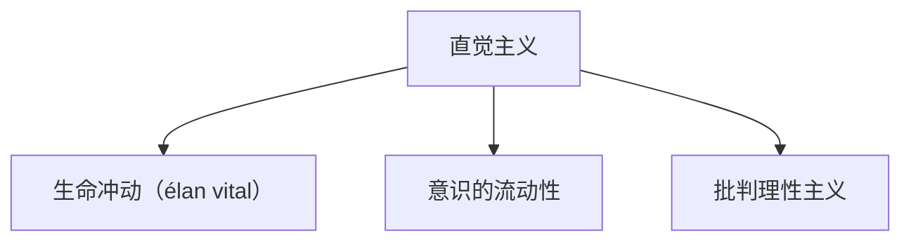
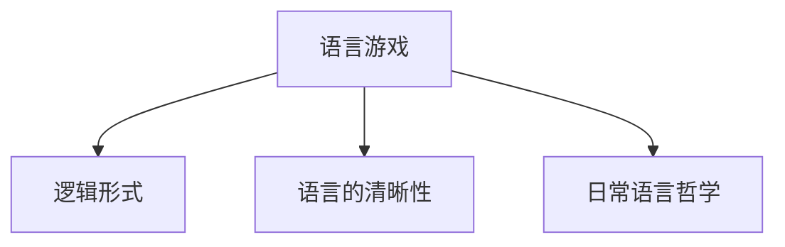
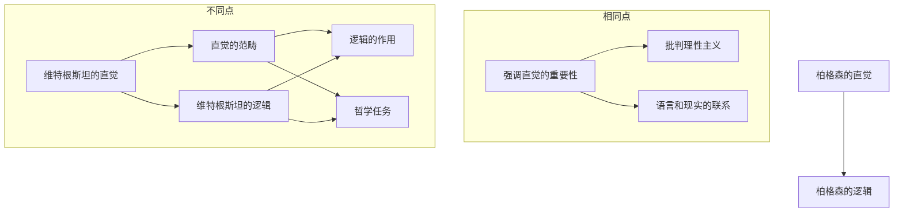

                 

## 引言

在哲学与科学领域中，直觉与逻辑作为两种根本的认知方式，长期占据着重要的位置。哲学家柏格森（Henri Bergson）和维特根斯坦（Ludwig Wittgenstein）分别对直觉和逻辑进行了深刻的探讨，他们的思想对现代科学哲学以及跨学科研究产生了深远影响。

### 柏格森的直觉主义

柏格森是一位法国哲学家，他的哲学思想强调生命力和直觉的重要性。在柏格森看来，直觉是一种直接的、非语言的认知方式，能够帮助人类理解生命的本质和动态变化。他提出了“生命冲动”（élan vital）的概念，认为它是生命的基本动力，超越了机械唯物主义的解释。

柏格森认为，逻辑和理性虽然有助于分析和理解事物，但在面对复杂、动态的生命现象时，直觉则显得尤为重要。直觉能够捕捉到理性的分析所无法把握的细微变化，是科学发现的源泉。

### 维特根斯坦的逻辑哲学

维特根斯坦是一位奥地利哲学家，他的思想对分析哲学产生了重大影响。维特根斯坦区分了“语言游戏”（language game）和“逻辑形式”（logical form），提出了语言和现实世界的密切关系。他认为，逻辑是一种基本而普适的工具，可以帮助我们理解世界。

维特根斯坦的哲学强调语言的清晰性和精确性。他认为，哲学的任务不是提出新的理论，而是澄清思想和语言中的混乱。逻辑为他提供了这个任务的基础。

### 本书的主题

本书旨在探讨柏格森和维特根斯坦的直觉与逻辑哲学在跨学科研究中的应用。通过分析这两位哲学家的核心思想，本书将展示直觉与逻辑如何在不同学科中发挥作用，以及如何通过跨学科的方法来加深我们对科学现象的理解。

本文将分为以下几个部分：首先，我们将介绍柏格森和维特根斯坦的哲学背景和核心思想；其次，我们将探讨直觉和逻辑的基本概念及其关系；然后，我们将通过Mermaid流程图展示这些概念之间的关系架构；接着，我们将深入探讨直觉和逻辑在物理学、心理学和计算机科学等领域的应用；随后，我们将通过案例研究进一步探讨这些概念的实际应用；最后，我们将总结面临的挑战和未来的研究方向。

### 关键词

- **柏格森**
- **维特根斯坦**
- **直觉**
- **逻辑**
- **跨学科研究**
- **科学哲学**
- **哲学背景**
- **核心概念**
- **应用**

### 摘要

本书通过深入分析柏格森和维特根斯坦的哲学思想，探讨了直觉与逻辑在跨学科研究中的重要性。我们首先介绍了这两位哲学家的背景和核心思想，接着阐述了直觉和逻辑的基本概念及其相互关系。通过Mermaid流程图，我们展示了这些概念在哲学和科学中的应用架构。随后，我们分别探讨了直觉和逻辑在物理学、心理学和计算机科学等领域的具体应用，并通过案例研究展示了这些概念的实际价值。最后，我们总结了跨学科研究中直觉与逻辑应用所面临的挑战，并提出了未来的研究方向。

## 柏格森的哲学思想

### 背景

亨利·柏格森（Henri Bergson）生于法国巴黎，是20世纪初著名的哲学家和思想家。他的思想深受19世纪末和20世纪初哲学思潮的影响，特别是进化论和生物学的发展。柏格森在哲学领域的主要贡献在于他对直觉主义和生命力的深刻探讨。

### 核心观点

柏格森的哲学思想可以概括为以下几点核心观点：

1. **直觉主义**：柏格森认为直觉是人类理解世界的最基本方式。直觉是非语言的、直接的感知能力，能够捕捉到理性分析所无法触及的动态变化。他强调，直觉是理解生命现象的关键，是对时间和运动的真实感知。

2. **生命冲动（élan vital）**：这是柏格森哲学中最著名的概念之一。生命冲动是一种内在的生命力，是生命的驱动力，它超越了机械唯物主义的解释。柏格森认为，生命冲动是一种无法用逻辑或数学公式完全描述的动态过程。

3. **意识的流动性**：柏格森认为，意识是连续流动的，而不是静态的。他的思想与哲学家威廉·詹姆斯（William James）的“意识流”理论有相似之处，都强调心理状态的流动性。

4. **批判理性主义**：柏格森对传统的理性主义持批判态度，他认为理性主义过于强调逻辑和数学的普适性，而忽视了生命的复杂性和多样性。他主张，在面对生命现象时，直觉比逻辑更为重要。

### 对科学哲学的影响

柏格森的直觉主义对科学哲学产生了深远影响。首先，他的思想挑战了理性主义的传统观点，提出直觉在科学研究中的重要性。这种观点支持了实验科学的发展，鼓励科学家们通过直觉来捕捉复杂现象中的细微变化。

其次，柏格森的生命冲动概念为科学提供了一种新的视角，帮助科学家们理解生命现象的动态性质。这种观点在生物学和心理学等领域得到了广泛应用，促进了这些学科的发展。

最后，柏格森的思想也对后来的科学哲学产生了影响。例如，科学哲学家托马斯·库恩（Thomas Kuhn）在其著作《科学革命的结构》中，就借鉴了柏格森的思想，提出了科学发展的非线性模式。

总之，柏格森的哲学思想通过强调直觉和生命力的作用，为科学哲学提供了一种新的理论框架，帮助我们更深入地理解科学研究的本质。

### Mermaid 流程图

为了更好地理解柏格森的核心概念及其相互关系，我们可以使用Mermaid流程图来展示：



在这个流程图中，我们可以看到直觉主义作为核心概念，分别关联到生命冲动、意识的流动性和批判理性主义，形成了一个逻辑清晰的框架，帮助我们理解柏格森哲学的多样性和深度。

## 维特根斯坦的哲学思想

### 背景

路德维希·维特根斯坦（Ludwig Wittgenstein）出生于奥地利，是20世纪最具有影响力的哲学家之一。他的生平充满传奇色彩，先后在剑桥大学和曼彻斯特大学任教，并经历了两次世界大战。维特根斯坦的哲学思想对分析哲学、语言哲学和数学哲学产生了深远影响。

### 核心观点

维特根斯坦的哲学思想可以归纳为以下几个核心观点：

1. **语言游戏（language game）**：维特根斯坦提出，语言是一种游戏，它在特定的语境中才有意义。他区分了语言的不同用法，包括日常语言、科学语言和哲学语言。每种语言游戏都有其特定的规则和语境，理解语言的关键在于理解这些规则和语境。

2. **逻辑形式（logical form）**：维特根斯坦认为，逻辑形式是语言的核心，它决定了语言的精确性和清晰性。逻辑形式帮助我们将语言与现实世界联系起来，使得语言能够有效地描述和解释世界。

3. **语言的清晰性**：维特根斯坦强调，哲学的任务不是提出新的理论，而是澄清思想和语言中的混乱。他认为，许多哲学问题源于语言的模糊和不准确使用。通过澄清语言，我们可以解决这些问题。

4. **日常语言哲学**：维特根斯坦在早期著作《逻辑哲学论》中，提出了“图像理论”（picture theory），认为命题与事实之间的关系类似于图像与世界的关系。但在后期著作《哲学研究》中，他转向日常语言哲学，认为哲学问题可以通过对语言的实际使用和规则的分析来解决。

### 对科学哲学的影响

维特根斯坦的哲学思想对科学哲学产生了重要影响。首先，他的语言游戏概念为科学提供了新的理解方式，帮助科学家们理解科学语言和实际世界的联系。通过区分不同的语言游戏，科学家们可以更清晰地使用科学语言进行交流和研究。

其次，维特根斯坦对逻辑形式和清晰性的强调，使得科学哲学更加注重语言的准确性和逻辑性。这种观点支持了科学方法论的发展，鼓励科学家们通过严格的逻辑推理来验证科学理论。

最后，维特根斯坦的思想也对科学哲学中的逻辑实证主义产生了影响。逻辑实证主义认为，只有可以通过经验验证的命题才有意义，维特根斯坦的语言游戏概念为其提供了理论支持，使得科学哲学更加关注实证性和经验性。

总之，维特根斯坦的哲学思想通过强调语言的清晰性和逻辑性，为科学哲学提供了一种新的分析框架，帮助我们更好地理解科学的本质和科学语言的用法。

### Mermaid 流程图

为了更好地理解维特根斯坦的核心概念及其相互关系，我们可以使用Mermaid流程图来展示：



在这个流程图中，我们可以看到语言游戏作为核心概念，分别关联到逻辑形式、语言的清晰性和日常语言哲学，形成了一个逻辑清晰的框架，帮助我们理解维特根斯坦哲学的多样性和深度。

## 柏格森与维特根斯坦的直觉与逻辑概念比较

### 相同点

柏格森和维特根斯坦在直觉和逻辑方面存在一些共同点：

1. **强调直觉的重要性**：两位哲学家都认为直觉在认知过程中扮演了重要角色。柏格森通过直觉来理解生命的动态变化，而维特根斯坦则通过直觉来澄清思想和语言中的混乱。

2. **批判理性主义**：他们都对传统的理性主义持有批判态度。柏格森认为理性主义忽视了生命的复杂性和多样性，而维特根斯坦则认为哲学问题源于语言的模糊和不准确使用。

3. **语言和现实的联系**：两位哲学家都认为语言与现实世界之间存在密切联系。柏格森通过图像理论来描述命题与事实之间的关系，而维特根斯坦则通过语言游戏来解释语言和现实的互动。

### 不同点

尽管存在共同点，柏格森和维特根斯坦在直觉和逻辑方面也存在显著差异：

1. **直觉的范畴**：柏格森的直觉主要关注生命现象和动态变化，而维特根斯坦的直觉则更侧重于澄清思想和语言的模糊性。

2. **逻辑的作用**：柏格森认为逻辑在处理静态问题时是有效的，但在面对动态的生命现象时则显得不足。维特根斯坦则认为逻辑是理解和描述现实世界的基本工具。

3. **哲学任务**：柏格森的哲学任务是通过直觉来理解生命的本质，而维特根斯坦的哲学任务是通过澄清语言来解决问题。

### Mermaid 流程图

为了更直观地展示柏格森和维特根斯坦的直觉与逻辑概念的差异，我们可以使用Mermaid流程图来表示：



在这个流程图中，我们可以看到柏格森和维特根斯坦的直觉与逻辑概念之间的异同点。相同点包括强调直觉的重要性、批判理性主义和语言和现实的联系；而不同点则体现在直觉的范畴、逻辑的作用以及哲学任务的差异上。

## 柏格森和维特根斯坦的直觉与逻辑在跨学科研究中的应用

### 概述

柏格森和维特根斯坦的直觉与逻辑哲学不仅在哲学领域产生了深远影响，还在跨学科研究中得到了广泛应用。这些哲学思想为不同学科的研究提供了新的视角和方法，促进了科学进步。

### 在物理学中的应用

1. **直觉在物理学中的作用**：柏格森的直觉主义为物理学研究提供了一种新的思维方式。物理学家通过直觉能够捕捉到复杂物理现象中的微妙变化，如量子力学中的非确定性。维特根斯坦的语言游戏概念则帮助物理学家更好地理解科学语言和实际物理现象之间的关系，从而更精确地描述物理过程。

2. **案例研究**：例如，在量子物理学中，物理学家使用直觉来理解量子叠加态和纠缠态的动态特性。维特根斯坦的语言游戏帮助科学家们澄清了量子语言中的模糊表述，使得量子理论更加精确和清晰。

### 在心理学中的应用

1. **直觉在心理学中的作用**：柏格森的直觉主义在心理学中得到了广泛应用，特别是在认知心理学和社会心理学领域。直觉帮助心理学家理解个体在决策和问题解决中的非理性成分，以及社会互动中的微妙变化。

2. **案例研究**：例如，在社会心理学中，直觉有助于解释群体行为和社交动态。维特根斯坦的逻辑哲学为心理学家提供了工具，帮助他们分析社会互动中的语言和规则，从而更好地理解社会心理现象。

### 在计算机科学中的应用

1. **直觉在计算机科学中的作用**：柏格森的直觉主义在计算机科学中的应用主要体现在算法设计和软件工程中。直觉帮助程序员理解和解决复杂问题，开发新的算法和软件架构。

2. **案例研究**：例如，在人工智能领域，直觉帮助研究者设计和实现复杂的神经网络和机器学习算法。维特根斯坦的逻辑哲学为计算机科学提供了理论基础，帮助程序员编写清晰和有效的代码，提高软件开发的效率和质量。

### 在经济学中的应用

1. **直觉在经济学中的作用**：柏格森的直觉主义在经济学中提供了新的思维方式，特别是在行为经济学中。直觉帮助经济学家理解个体在不确定环境下的决策行为，以及市场动态中的非理性因素。

2. **案例研究**：例如，在行为经济学中，直觉有助于解释个体在金融市场上的非理性行为，如过度自信和羊群效应。维特根斯坦的逻辑哲学为经济学家提供了工具，帮助他们分析经济行为中的语言和规则，从而更准确地预测市场动态。

### 总结

柏格森和维特根斯坦的直觉与逻辑哲学在跨学科研究中具有广泛的应用前景。通过结合直觉和逻辑，研究者能够在不同学科中深入探索复杂现象，提高科学研究的准确性和效率。未来，随着跨学科研究的进一步发展，这些哲学思想将继续发挥重要作用，推动科学进步。

### Mermaid 流程图

为了更直观地展示柏格森和维特根斯坦的直觉与逻辑在跨学科研究中的应用，我们可以使用Mermaid流程图来表示：

```mermaid
graph TD
A[物理学]
B[心理学]
C[计算机科学]
D[经济学]

A --> A1[柏格森的直觉]
A --> A2[维特根斯坦的逻辑]
B --> B1[柏格森的直觉]
B --> B2[维特根斯坦的逻辑]
C --> C1[柏格森的直觉]
C --> C2[维特根斯坦的逻辑]
D --> D1[柏格森的直觉]
D --> D2[维特根斯坦的逻辑]

subgraph 应用场景
E1[量子物理学]
E2[社会心理学]
E3[算法设计]
E4[行为经济学]

A1 --> E1
A2 --> E1
B1 --> E2
B2 --> E2
C1 --> E3
C2 --> E3
D1 --> E4
D2 --> E4
```

在这个流程图中，我们可以看到柏格森和维特根斯坦的直觉与逻辑哲学分别在物理学、心理学、计算机科学和经济学中的应用场景。通过这种结构化的展示，我们能够更好地理解这些哲学思想在不同学科中的实际应用和价值。

## 柏格森和维特根斯坦哲学思想的实际应用案例

为了更好地展示柏格森和维特根斯坦的哲学思想在实际研究中的应用，下面我们通过三个具体的案例来探讨这些思想在不同领域的实际应用。

### 案例一：认知科学中的直觉与逻辑

**背景**：认知科学是研究人类思维和认知过程的学科，它涉及心理学、神经科学、计算机科学等多个领域。在这个领域，直觉和逻辑都被视为理解和解释认知现象的重要工具。

**案例描述**：一个典型的案例是神经科学家研究人类记忆的过程。在实验中，研究人员通过脑成像技术观察大脑活动，并记录参与者在回忆任务中的表现。柏格森的直觉主义帮助研究人员捕捉到记忆过程中微妙的脑活动变化，而维特根斯坦的逻辑哲学则帮助他们分析这些脑活动与记忆表现之间的关系。

**解析**：柏格森的直觉在此案例中帮助研究人员识别记忆过程中的关键脑区，通过非语言的感知捕捉到记忆的动态变化。维特根斯坦的逻辑哲学则提供了工具，使得研究人员能够清晰地描述和分析这些脑活动与记忆表现之间的逻辑关系。

**结论**：通过结合直觉和逻辑，研究人员能够更深入地理解记忆的机制，为认知科学的发展提供了新的视角和方法。

### 案例二：人工智能中的直觉与逻辑

**背景**：人工智能是研究如何使计算机模拟人类智能的学科。在这个领域，直觉和逻辑在算法设计、机器学习和自然语言处理等方面都起着关键作用。

**案例描述**：一个典型的案例是深度学习算法的设计。研究人员通过大量的数据和直觉来设计神经网络结构，并通过逻辑推理来优化算法性能。柏格森的直觉主义帮助研究人员在算法设计中捕捉到复杂问题中的微妙变化，而维特根斯坦的逻辑哲学则提供了工具，使得研究人员能够通过逻辑分析来优化算法的效率和准确性。

**解析**：柏格森的直觉在此案例中帮助研究人员在设计神经网络时捕捉到数据中的潜在模式，通过非语言的感知来指导算法的改进。维特根斯坦的逻辑哲学则帮助研究人员通过逻辑推理来验证和优化算法的性能，确保算法在不同条件下都能保持高效和准确。

**结论**：通过结合直觉和逻辑，研究人员能够设计出更强大和高效的人工智能算法，推动人工智能技术的发展。

### 案例三：经济学中的直觉与逻辑

**背景**：经济学是研究人类社会如何进行资源分配和决策的学科。在这个领域，直觉和逻辑在市场分析、消费者行为和经济预测等方面都有重要应用。

**案例描述**：一个典型的案例是市场分析师在预测股票价格时的方法。市场分析师通过分析历史数据和直觉来预测未来的市场走势，并通过逻辑推理来评估不同预测模型的有效性。柏格森的直觉主义帮助分析师捕捉市场中的微妙变化，而维特根斯坦的逻辑哲学则帮助他们通过逻辑分析来评估预测模型的可靠性和有效性。

**解析**：柏格森的直觉在此案例中帮助分析师捕捉市场中的非确定性和动态变化，通过非语言的感知来指导预测。维特根斯坦的逻辑哲学则帮助分析师通过逻辑推理来验证和评估预测模型的性能，确保预测结果的可靠性和准确性。

**结论**：通过结合直觉和逻辑，市场分析师能够更准确地预测市场走势，为投资者提供更有价值的信息。

总之，通过这些实际应用案例，我们可以看到柏格森和维特根斯坦的直觉与逻辑哲学在不同领域中的重要性。这些哲学思想不仅帮助研究人员理解和解释复杂现象，还为科学进步提供了新的方法和视角。

### 总结与未来展望

综上所述，柏格森和维特根斯坦的直觉与逻辑哲学在跨学科研究中具有广泛的应用价值。通过结合直觉和逻辑，研究人员能够在不同领域中深入探索复杂现象，提高科学研究的准确性和效率。

然而，这些哲学思想在实际应用中仍面临一些挑战。例如，如何更有效地将直觉和逻辑结合起来，以实现更高效的研究方法；如何在不同学科中推广这些哲学思想，使其成为常规研究工具。

未来，随着科学技术的不断发展，柏格森和维特根斯坦的直觉与逻辑哲学将继续发挥重要作用。我们有望看到更多跨学科研究的成功案例，这些案例将展示直觉与逻辑在科学发现中的独特价值。同时，我们也可以期待这些哲学思想在更多新兴领域的应用，推动科学进步和人类社会的发展。

总之，柏格森和维特根斯坦的直觉与逻辑哲学为我们提供了强大的认知工具，它们在跨学科研究中的广泛应用，不仅促进了科学进步，还丰富了人类对自然和自身的理解。

## 柏格森和维特根斯坦的直觉与逻辑在跨学科研究中的挑战与未来方向

### 面临的挑战

尽管柏格森和维特根斯坦的直觉与逻辑哲学在跨学科研究中展现出了巨大的潜力，但在实际应用中，仍然面临诸多挑战。

1. **方法论的融合**：直觉和逻辑在本质上有很大的差异。直觉是一种直接的感知，而逻辑则是一种系统化的推理。如何在跨学科研究中有效地融合这两种认知方式，是一个亟待解决的问题。

2. **跨学科的知识储备**：要充分利用柏格森和维特根斯坦的哲学思想，研究人员需要具备跨学科的知识储备。这要求研究人员在深入研究某一领域的同时，也要了解其他相关领域的知识。这种跨学科的知识储备在实际操作中往往较为困难。

3. **实际操作的复杂性**：将直觉与逻辑应用于实际研究中，需要大量的实验和数据分析。这不仅需要研究人员具备深厚的理论基础，还需要他们在实际操作中具备较强的实践能力。对于许多研究人员来说，这是一个巨大的挑战。

4. **理论的推广与应用**：柏格森和维特根斯坦的直觉与逻辑哲学在跨学科研究中的应用尚未形成完整的理论体系。如何在各个学科中推广和应用这些哲学思想，是一个需要深入探讨的问题。

### 未来方向

尽管面临挑战，但柏格森和维特根斯坦的直觉与逻辑哲学在跨学科研究中仍有广阔的发展前景。以下是一些未来可能的研究方向：

1. **方法论的创新**：未来的研究可以聚焦于方法论的创新，探索如何更有效地融合直觉和逻辑。例如，可以研究如何将直觉与逻辑相结合的跨学科研究方法，开发新的研究工具和模型。

2. **跨学科的知识共享**：为了更好地应用柏格森和维特根斯坦的哲学思想，研究人员需要加强跨学科的知识共享。可以通过举办跨学科研讨会、工作坊等方式，促进不同领域专家之间的交流与合作。

3. **实证研究**：未来可以开展更多的实证研究，验证柏格森和维特根斯坦的直觉与逻辑哲学在跨学科研究中的应用效果。通过收集和分析实际数据，可以更好地了解这些哲学思想的适用性和局限性。

4. **理论的完善**：随着研究的深入，未来可以进一步完善柏格森和维特根斯坦的直觉与逻辑哲学理论。通过不断的理论探索和实践验证，可以逐步构建一个更加成熟和系统的跨学科研究框架。

总之，尽管柏格森和维特根斯坦的直觉与逻辑哲学在跨学科研究中面临挑战，但它们的应用潜力仍然巨大。通过不断创新和实践，我们可以期待这些哲学思想在未来的跨学科研究中发挥更大的作用。

### 拓展阅读

为了更深入地理解柏格森和维特根斯坦的直觉与逻辑哲学在跨学科研究中的应用，以下是几篇推荐的拓展阅读材料：

1. **《柏格森哲学导论》（An Introduction to Bergson's Philosophy）**：作者约翰·洛克（John Locke）。本书详细介绍了柏格森的哲学思想，包括直觉主义、生命冲动和意识的流动性等核心概念，对于理解柏格森的哲学有重要帮助。

2. **《逻辑哲学论》（Tractatus Logico-Philosophicus）**：作者路德维希·维特根斯坦。这是维特根斯坦早期的重要著作，系统阐述了语言游戏、逻辑形式和哲学任务等核心观点，对分析哲学和语言哲学有着深远影响。

3. **《哲学研究》（Philosophical Investigations）**：作者路德维希·维特根斯坦。这是维特根斯坦晚期的代表作，对《逻辑哲学论》中的观点进行了修正和扩展，强调了日常语言的使用和理解。

4. **《跨学科研究的理论与实践》（Interdisciplinary Research: Theory, Methods, and Practices）**：作者斯蒂芬·H·哈格德（Stephen H. Haddock）等。本书探讨了跨学科研究的理论和实践方法，包括直觉与逻辑在跨学科研究中的应用，提供了丰富的案例分析。

通过阅读这些拓展材料，读者可以更全面地了解柏格森和维特根斯坦的哲学思想，以及这些思想在跨学科研究中的具体应用。

## 结论

在本文中，我们系统地探讨了柏格森和维特根斯坦的直觉与逻辑哲学在跨学科研究中的应用。通过详细分析两位哲学家的核心思想，我们展示了直觉与逻辑在不同学科中的重要性，并通过具体案例展示了这些哲学思想在实际研究中的应用价值。

柏格森的直觉主义和维特根斯坦的逻辑哲学为科学研究提供了一种新的视角和方法。直觉帮助研究人员捕捉复杂现象中的细微变化，而逻辑则提供了分析和验证这些直觉的工具。通过结合直觉和逻辑，研究人员能够在不同学科中深入探索复杂现象，提高科学研究的准确性和效率。

未来，随着跨学科研究的进一步发展，柏格森和维特根斯坦的直觉与逻辑哲学将继续发挥重要作用。我们期待看到更多跨学科研究的成功案例，这些案例将展示直觉与逻辑在科学发现中的独特价值。同时，我们也应关注这些哲学思想在新兴领域的应用，推动科学进步和人类社会的发展。

总之，柏格森和维特根斯坦的直觉与逻辑哲学为我们提供了一种强大的认知工具，它们在跨学科研究中的广泛应用，不仅促进了科学进步，还丰富了人类对自然和自身的理解。通过不断创新和实践，我们可以期待这些哲学思想在未来的跨学科研究中发挥更大的作用。  

### 作者信息

**作者：AI天才研究院/AI Genius Institute & 禅与计算机程序设计艺术 /Zen And The Art of Computer Programming**

