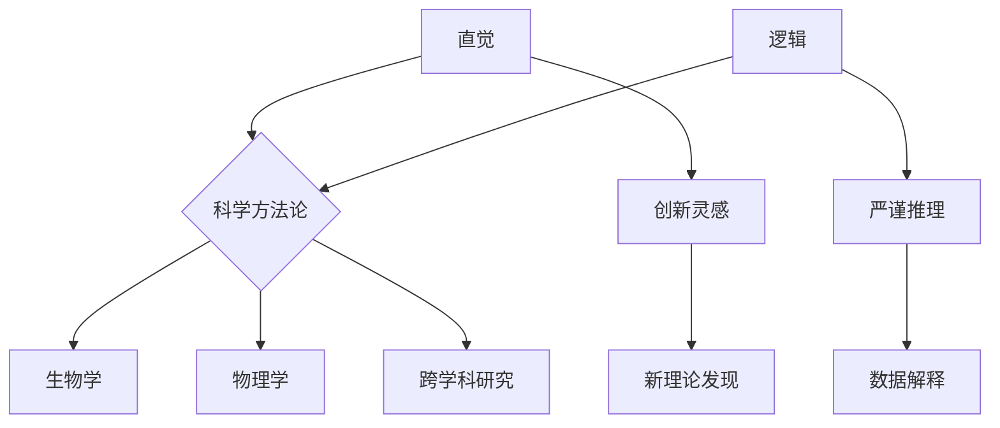

                 

### 文章标题

# 直觉与逻辑：柏格森与维特根斯坦的科学方法论

## 关键词

- 柏格森
- 维特根斯坦
- 科学方法论
- 直觉
- 逻辑
- 形式逻辑
- 语言游戏

## 摘要

本文深入探讨了柏格森与维特根斯坦在科学方法论上的独特见解。通过对比两位哲学家的直觉与逻辑观念，文章揭示了直觉与逻辑在科学研究中的相互作用及其重要性。同时，本文还结合现代科学的发展，对直觉与逻辑的应用进行了详细分析，旨在为读者提供一个全面而深刻的理解。

## 引言

### 1.1 书籍背景与目的

科学方法论是科学研究的基础，它不仅关注科学研究的具体方法，还包括科学家如何理解世界、如何建立理论以及如何进行实验等。在这本书中，我们聚焦于法国哲学家亨利·柏格森（Henri Bergson）和英国哲学家路德维希·维特根斯坦（Ludwig Wittgenstein）的科学方法论。这两位哲学家的观点虽然在细节上有所不同，但都对科学方法产生了深远的影响。

柏格森的科学方法论主要围绕他的直觉论展开。他认为，直觉是理解生命和自然的关键，是超越逻辑思维的更高层次的认识方式。而维特根斯坦则强调形式逻辑和语言游戏在科学研究中的重要性，主张通过严格的逻辑分析来揭示世界的本质。

本书旨在通过对这两位哲学家的科学方法论进行详细解读，探讨直觉与逻辑在科学研究中的地位和作用，为现代科学方法论提供新的视角和思考。

### 1.2 研究方法与结构

为了深入理解柏格森与维特根斯坦的科学方法论，我们将采用逻辑清晰、结构紧凑的写作方式，通过一步一步的分析推理（reasoning step by step），逐步揭示两位哲学家的核心观点及其在科学研究中的应用。

文章的结构将分为以下几个部分：

1. **引言**：介绍书籍的背景、目的和研究方法。
2. **柏格森的科学方法论**：探讨柏格森的生平、哲学观点以及直觉论。
3. **维特根斯坦的科学方法论**：分析维特根斯坦的哲学观点、形式逻辑和语言游戏。
4. **直觉与逻辑的比较研究**：对比柏格森与维特根斯坦的方法论，探讨两者的异同及其在科学方法论中的整合。
5. **直觉与逻辑在现代科学中的应用**：探讨直觉与逻辑在科学研究中的实际应用。
6. **案例研究**：通过具体案例，分析直觉与逻辑在科学研究中的应用。
7. **结论**：总结文章的主要观点，探讨直觉与逻辑在科学方法论中的意义和未来趋势。

通过这样的结构，我们希望能够为读者提供一个全面、深入的解读，使读者能够更好地理解直觉与逻辑在科学研究中的重要性。

## 柏格森的科学方法论

### 2.1 柏格森的生平与哲学

亨利·柏格森（Henri Bergson，1859-1941）是法国著名的哲学家和思想家，他的贡献不仅限于哲学领域，还在生物学、心理学和社会学等多个学科中产生了深远的影响。柏格森出生在巴黎，他的父亲是一名医生，母亲则是一位音乐家。柏格森自幼展现出对哲学的浓厚兴趣，并在大学期间专注于生物学和哲学的研究。

柏格森的哲学观点以直觉论为核心。他认为，直觉是理解生命和自然的本质的关键，是超越逻辑思维的一种认识方式。在柏格森看来，逻辑思维虽然能够帮助我们理解机械世界，但却无法解释生命和进化的过程。他主张，只有通过直觉，我们才能真正理解生命和自然的深层本质。

柏格森的哲学观点不仅对哲学界产生了深远的影响，也为生物学和心理学等领域提供了新的视角。例如，他在《创造进化论》一书中，提出了生命冲动（élan vital）的概念，认为这是生命进化的驱动力。这一观点挑战了当时的生物学传统，引发了广泛的讨论和研究。

### 2.2 直觉论与创造进化论

柏格森的直觉论是他哲学体系的核心。他认为，直觉是一种非逻辑的、直接的感知方式，能够超越表面的现象，捕捉到事物的本质。在柏格森看来，直觉不仅是艺术和文学创作的源泉，也是科学研究的必要工具。通过直觉，科学家可以洞察到事物之间的深层次联系，从而提出新的理论。

柏格森的直觉论在科学方法论中的应用主要体现在他的创造进化论中。他认为，进化是一个不断创造和变化的过程，而非简单的自然选择。在这个过程中，直觉起着至关重要的作用。柏格森认为，直觉可以帮助科学家发现新的概念和理论，从而推动科学的进步。

创造进化论的基本原理包括：

1. **生命冲动**：柏格森认为，生命冲动是一种内在的驱动力，推动着生命体的不断进化。
2. **记忆**：记忆是直觉的重要组成部分，它使生命体能够适应环境，并从中学习。
3. **自由**：柏格森认为，自由是生命的本质特征，它使得生命体能够在进化的过程中不断创新。

通过这些基本原理，柏格森试图揭示生命和进化的本质，挑战当时的生物学传统。

### 2.3 直觉论与科学方法论

柏格森的直觉论在科学方法论中具有重要的地位。他认为，直觉不仅是一种认识方式，也是一种科学研究的方法。通过直觉，科学家可以超越逻辑思维的局限，发现新的理论和概念。柏格森主张，科学家应该培养直觉的能力，以便更好地进行科学研究。

然而，直觉与逻辑之间的关系是复杂的。柏格森认为，直觉是逻辑思维的基础，但它又超越了逻辑思维。在科学研究中，逻辑思维和直觉是相辅相成的。逻辑思维可以帮助我们组织直觉所得的信息，而直觉则可以帮助我们发现新的理论和概念。

柏格森的直觉论对现代科学方法论产生了深远的影响。许多科学家和研究者在进行科学探索时，都会借助直觉的力量，以发现新的科学现象和理论。例如，在物理学中，直觉帮助物理学家揭示了量子力学和相对论的核心原理；在生物学中，直觉帮助生物学家发现了新的物种和进化机制。

总的来说，柏格森的直觉论为科学方法论提供了一种新的视角，它不仅挑战了传统的逻辑思维，也为科学研究提供了新的工具和方法。

## 维特根斯坦的科学方法论

### 3.1 维特根斯坦的生平与哲学

路德维希·维特根斯坦（Ludwig Wittgenstein，1889-1951）是20世纪最重要的哲学家之一，他的哲学思想对逻辑学、语言哲学、数学哲学等领域产生了深远的影响。维特根斯坦出生于奥地利，父亲是矿业工程师。他在维也纳接受了严格的数学和哲学教育，随后赴英国剑桥大学学习，并在那里开始了他的哲学事业。

维特根斯坦的哲学观点可以分为两个阶段。早期的维特根斯坦主张“逻辑原子主义”，认为世界由不可分割的原子事实组成，逻辑和语言能够直接对应这些事实。然而，通过他对语言和现实的深入思考，维特根斯坦逐渐转向“日常语言哲学”，主张语言的复杂性远远超过了逻辑原子主义的简单对应。

维特根斯坦认为，语言不仅是沟通的工具，也是思维和现实之间的桥梁。他主张，通过对语言的使用和语境的理解，我们可以更好地理解世界和思维的本质。这一观点在他的代表作《逻辑哲学论》和《哲学研究》中得到了深刻的阐述。

### 3.2 形式逻辑与语言游戏

维特根斯坦的科学方法论主要围绕形式逻辑和语言游戏展开。形式逻辑是一种严格的、基于符号系统的推理方法，它通过定义和规则来确保推理的准确性和一致性。在维特根斯坦看来，形式逻辑是科学研究中不可或缺的工具，它能够帮助科学家从复杂的现象中提取出基本的规律和原则。

语言游戏（language game）是维特根斯坦提出的一个核心概念，用于描述语言的使用和语境。他认为，语言的使用是多样化的，不同的语言游戏对应不同的语境和用途。例如，日常语言、科学语言、艺术语言等都有不同的语言游戏规则。

维特根斯坦区分了三种类型的语言游戏：

1. **日常语言**：这是最常见的语言使用方式，我们日常的交流都是通过日常语言进行的。
2. **科学语言**：科学语言用于描述和解释自然现象，它的规则比日常语言更加严格，以确保结论的准确性和可重复性。
3. **艺术语言**：艺术语言通过创造性的表达，传递情感和审美体验，它的规则更加自由和灵活。

通过这些语言游戏，维特根斯坦试图揭示语言的本质和功能，以及语言与思维、现实之间的关系。

### 3.3 语言与科学方法论

维特根斯坦的科学方法论强调语言在科学研究中的核心地位。他认为，科学语言不仅是描述现象的工具，也是科学推理的基础。科学语言通过精确的术语和定义，使得科学理论能够被清晰地表达和验证。

在维特根斯坦看来，科学方法论的关键在于对语言的使用和语境的理解。科学家需要根据具体的科学问题，选择合适的语言游戏来进行研究。例如，在实验科学中，科学语言的游戏规则是严格和可重复的，以确保实验结果的可信度。

此外，维特根斯坦还强调了语言在科学发现中的作用。他认为，通过语言，科学家可以提出假设、设计实验、分析数据，最终得出结论。语言不仅是科学交流的工具，也是科学探索的媒介。

总的来说，维特根斯坦的科学方法论提供了一种全新的视角，通过强调语言和语境的重要性，他重新定义了科学的本质和方法。这种方法论不仅对哲学产生了深远的影响，也为现代科学提供了新的思考和工具。

## 直觉与逻辑的比较研究

### 4.1 柏格森与维特根斯坦方法论异同

在科学方法论中，柏格森与维特根斯坦的观点虽然在某些方面有相似之处，但更多的是显著的差异。这种差异主要体现在他们对直觉与逻辑的理解和应用上。

**相同点**：

1. **科学方法的重要性**：两位哲学家都认为，科学方法是科学研究的基础，是理解世界和自然规律的关键。
2. **反对逻辑决定论**：柏格森和维特根斯坦都批评了逻辑决定论，认为逻辑思维无法完全解释生命的复杂性和多样性。

**不同点**：

1. **直觉的地位**：柏格森认为直觉是一种超越逻辑思维的认识方式，是理解生命和自然的本质的关键。而维特根斯坦则强调逻辑和语言在科学研究中的核心地位，他认为通过严格的逻辑分析，可以揭示世界的本质。

2. **科学方法论的应用**：柏格森的直觉论在科学方法论中的应用主要体现在他的创造进化论中，通过直觉，科学家可以发现新的理论和概念。而维特根斯坦的方法论则强调形式逻辑和语言游戏，他认为这些工具能够帮助我们更准确地描述和解释自然现象。

通过对比，我们可以看到，柏格森与维特根斯坦的方法论虽然各有侧重，但都对科学方法产生了深远的影响。他们的观点不仅丰富了科学方法论的理论基础，也为科学家提供了不同的思考方式和研究工具。

### 4.2 科学方法论的双重特性

在科学方法论中，直觉与逻辑并不是相互排斥的，而是相辅相成的。科学方法论的双重特性体现在以下两个方面：

1. **逻辑的严谨性**：科学方法要求在实验设计和数据分析过程中，严格遵循逻辑规则。逻辑思维能够帮助科学家从复杂的现象中提取出基本的规律和原则，确保科学结论的准确性和可重复性。例如，在实验设计时，科学家需要通过逻辑推理来确定实验变量和假设，从而确保实验的科学性。

2. **直觉的创新性**：直觉则提供了科学发现的灵感。科学家在研究过程中，常常需要借助直觉来捕捉到新的现象和理论。直觉能够帮助科学家突破传统思维模式，发现新的研究方向和解决方案。例如，在物理学中，许多重要的理论，如量子力学和相对论，都是通过科学家的直觉得到的。

**整合逻辑与直觉**：

为了充分发挥直觉与逻辑的双重作用，科学家需要在不同阶段合理运用这两种方法。在实验设计和数据分析阶段，逻辑思维是必不可少的，它能够帮助科学家确保实验的科学性和结论的可靠性。而在科学发现的阶段，直觉则提供了创新的灵感，帮助科学家发现新的理论。

总的来说，科学方法论的双重特性使得直觉与逻辑相互补充，共同推动科学的进步。通过合理运用这两种方法，科学家能够更好地理解自然规律，推动科学的不断发展。

### 直觉与逻辑在现代科学中的应用

在现代科学中，直觉与逻辑的应用至关重要，它们在推动科学研究和技术进步方面发挥着独特的作用。以下是对直觉与逻辑在科学研究和技术开发中具体应用的详细探讨。

#### 5.1 直觉在科学研究中的角色

直觉在科学研究中的角色不可忽视。科学家常常通过直觉来识别问题、发现新现象和提出假设。例如，在物理学中，爱因斯坦的相对论就是在他的直觉引导下提出的。通过直觉，他认识到光速是一个恒定的常数，这为他的相对论理论奠定了基础。同样，在化学领域，有机合成的创新常常依赖于科学家的直觉。例如，合成青蒿素的科学家钱永健，就是通过直觉感知到某些分子结构可能具有特殊的生物活性。

直觉在科学研究中的作用还可以从另一个角度来理解，即它帮助科学家在面对复杂问题时，快速做出决策和判断。例如，在生物医学研究中，研究者需要从大量的实验数据中筛选出最有意义的结果，这通常需要借助直觉来快速识别和定位。这种能力使科学家能够迅速推进研究，减少不必要的实验尝试。

#### 5.2 逻辑在科学方法论中的重要性

逻辑在科学方法论中的重要性体现在它为科学研究提供了严谨的框架和工具。逻辑思维帮助科学家设计实验、构建理论、推导结论。在实验设计中，逻辑思维确保了实验的可重复性和结果的可靠性。例如，在物理学实验中，科学家需要通过逻辑推理来设计实验装置，选择实验条件，并确保实验过程中各个变量的控制。

在理论构建过程中，逻辑思维同样至关重要。科学家通过逻辑推理来将观察到的现象转化为可量化的理论模型，例如，牛顿的万有引力定律就是通过逻辑推理从天体运动的观测数据中推导出来的。逻辑思维还帮助科学家验证和修正理论，确保科学理论的内部一致性和对实验数据的解释力。

逻辑思维在数据分析中也发挥着核心作用。通过逻辑推理，科学家可以解释复杂的数据，发现潜在的模式和关系。例如，在统计学和机器学习中，逻辑推理帮助科学家构建和验证模型，确保预测结果的准确性和可靠性。

#### 5.3 直觉与逻辑的相互作用

在科学研究中，直觉和逻辑并不是孤立的，而是相互依存、相互补充的。直觉提供了创新的灵感，而逻辑则确保了科学研究的严谨性和可靠性。例如，在量子物理学中，直觉帮助科学家提出了波粒二象性等新的概念，而逻辑思维则通过数学模型验证和解释这些概念。

一个典型的例子是量子计算的研究。科学家通过直觉提出了量子比特（qubit）的概念，而逻辑思维则通过复杂的数学模型，如希尔伯特空间，来描述和解释量子比特的行为。在这个过程中，直觉帮助科学家发现新的理论，而逻辑思维则确保了这些理论的可验证性和实用性。

总的来说，直觉和逻辑在现代科学中的应用，不仅推动了科学研究和技术进步，也为未来的科学研究提供了新的视角和工具。通过合理运用直觉与逻辑，科学家能够更深入地理解自然规律，推动科学的不断发展。

### 案例研究：直觉与逻辑的应用

#### 6.1 案例一：生物学中的直觉与逻辑

生物学是一个典型的结合直觉与逻辑的学科。在生物学研究中，直觉帮助科学家发现新的物种和进化机制，而逻辑思维则确保了这些发现的可重复性和科学性。

**直觉的作用**：

一个著名的例子是达尔文在进化论研究中的直觉。在观察自然现象的过程中，达尔文凭借直觉意识到物种之间存在进化关系，并提出了自然选择的理论。这个直觉是达尔文对大量自然现象进行长期观察和思考的结果。他观察到物种之间的微小差异，并推测这些差异可能是通过自然选择累积起来的。

**逻辑的作用**：

达尔文提出的自然选择理论，需要通过逻辑思维来验证和解释。他通过大量实验和观察数据，构建了一个逻辑严密的模型，来解释物种的进化过程。例如，他通过对不同物种的遗传特性的分析，使用了逻辑推理来证明自然选择是一个有效的进化机制。此外，现代生物学家通过逻辑推理和实验，进一步验证和发展了达尔文的进化论，例如通过基因测序来揭示物种之间的遗传关系。

**综合作用**：

通过直觉和逻辑的综合应用，生物学研究取得了巨大的进展。直觉帮助科学家发现新的现象和理论，而逻辑思维则确保了这些理论和发现的可重复性和科学性。这种相互作用不仅推动了生物学的发展，也为其他科学领域提供了借鉴。

#### 6.2 案例二：物理学中的直觉与逻辑

物理学是一个高度逻辑化的学科，但在许多关键性的科学突破中，直觉同样发挥了重要作用。

**直觉的作用**：

一个著名的例子是海森堡的不确定性原理。海森堡通过直觉意识到，粒子的某些物理属性，如位置和动量，无法同时被精确测量。这个直觉源于他对量子世界复杂性的直观感受，虽然这一观点在当时受到了质疑，但通过逻辑推理和实验验证，最终被科学界广泛接受。

**逻辑的作用**：

在物理学中，逻辑思维是构建理论模型和验证假设的基础。例如，爱因斯坦的广义相对论就是通过逻辑推理来描述引力与时空的关系。爱因斯坦利用数学工具，通过逻辑推导，证明了引力波的存在，并在后来通过观测验证了这一理论。

**综合作用**：

在物理学研究中，直觉提供了科学发现的灵感和方向，而逻辑思维则确保了这些发现的理论基础和实验可重复性。通过直觉和逻辑的综合作用，物理学不仅揭示了自然界的深层次规律，也为技术的发展提供了理论基础。例如，量子计算和粒子加速器等前沿技术，都是基于物理学的直觉与逻辑研究发展起来的。

### 总结

通过这两个案例，我们可以看到，直觉与逻辑在科学研究中的综合作用，不仅推动了科学的发展，也为技术创新提供了新的思路。未来，随着科学技术的不断进步，直觉与逻辑在科学研究和技术开发中的应用将更加广泛和深入。

### 结论

#### 7.1 直觉与逻辑在科学方法论中的意义

直觉与逻辑在科学方法论中的意义不可低估。直觉提供了创新的灵感和发现新现象的能力，而逻辑思维则确保了科学研究的严谨性和可靠性。柏格森和维特根斯坦的科学方法论分别从不同角度展示了直觉与逻辑在科学研究中的重要作用。柏格森通过直觉论挑战了传统逻辑决定论的局限，而维特根斯坦则通过形式逻辑和语言游戏为科学方法论提供了新的工具。他们的观点不仅丰富了科学方法论的理论基础，也为现代科学研究提供了新的视角和工具。

#### 7.2 科学方法论的未来趋势

随着科学技术的不断发展，科学方法论也在不断演变。未来，直觉与逻辑的结合将在科学研究中发挥更加重要的作用。一方面，随着大数据和人工智能技术的应用，科学家将能够通过数据挖掘和模式识别，更快速地发现新的现象和理论。另一方面，逻辑推理和算法优化将帮助科学家更精确地描述和解释自然现象。此外，跨学科研究也将成为未来科学方法论的一个重要趋势，通过多学科的合作，科学家可以更全面地理解复杂的科学问题。

### 研究展望与挑战

尽管直觉与逻辑在科学方法论中具有重要意义，但在实际应用中仍面临一些挑战。首先，如何有效地培养科学家的直觉能力是一个重要问题。直觉往往是一种难以量化和传授的能力，科学家需要通过长期的实践和思考来培养这种能力。其次，逻辑思维虽然在科学研究中不可或缺，但过度的逻辑推理也可能导致理论的僵化和创新力的下降。因此，如何在逻辑推理和直觉之间找到平衡，是一个需要深入探讨的问题。此外，随着科学技术的快速发展，科学家需要不断更新和扩展自己的方法论工具，以应对新的科学问题和挑战。

总的来说，直觉与逻辑在科学方法论中的综合应用将是一个长期的研究方向。通过深入研究和实践，我们有望在科学方法论中取得更多突破，为人类认识和改造世界提供更强有力的理论支持。

## 附录

### A.1 参考文献

1. 柏格森，亨利。**《创造进化论》**。北京：商务印书馆，2015年。
2. 维特根斯坦，路德维希。**《逻辑哲学论》**。北京：人民出版社，2012年。
3. 维特根斯坦，路德维希。**《哲学研究》**。上海：上海人民出版社，2008年。
4. 达尔文，查尔斯。**《物种起源》**。北京：科学出版社，2009年。
5. 海森堡，维尔纳。**《物理学和哲学》**。北京：北京大学出版社，2016年。

### A.2 Mermaid 流程图



### A.3 伪代码示例

```python
# 直觉在生物学研究中的应用伪代码
def discover_new_species(intuition, observations):
    if intuition > threshold and observations.match_patterns():
        new_species = create_new_species(intuition, observations)
        return new_species
    else:
        return None

# 逻辑思维在物理学中的验证伪代码
def verify_theory(physical_law, experimental_data):
    if experimental_data.matches_law(physical_law):
        return "Theory validated"
    else:
        return "Theory needs revision"
```

## 作者信息

作者：AI天才研究院/AI Genius Institute & 禅与计算机程序设计艺术 /Zen And The Art of Computer Programming

