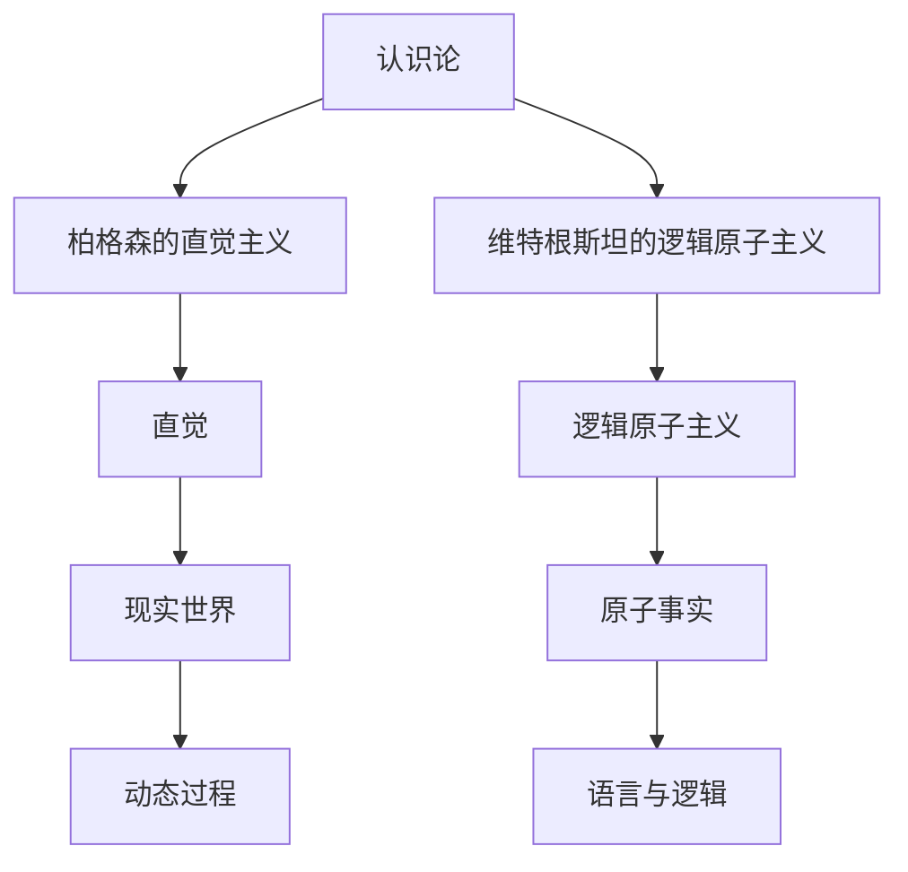

                 

### 文章标题

**直觉与逻辑：柏格森与维特根斯坦的认识论比较**

### 关键词

- 认识论
- 柏格森
- 维特根斯坦
- 直觉主义
- 逻辑原子主义
- 哲学

### 摘要

本文旨在探讨法国哲学家柏格森和奥地利哲学家维特根斯坦的认识论观点，比较两者的直觉主义和逻辑原子主义。通过回顾两位哲学家的背景、核心观点以及其在哲学领域的影响，本文试图揭示两种认识论在理解世界中的异同，为读者提供一个深入而全面的认知框架。

### 引言

认识论是哲学的核心领域之一，它探讨知识的本质、起源和范围。从古希腊的苏格拉底到现代的维特根斯坦，哲学史上涌现了众多重要的认识论思想家。其中，柏格森和维特根斯坦分别以其直觉主义和逻辑原子主义在哲学界产生了深远影响。本文将比较这两位哲学家的认识论观点，探讨直觉与逻辑在认识过程中的作用和地位。

### 柏格森的直觉主义哲学

**1.1 柏格森的哲学背景**

亨利·柏格森（Henri Bergson）是19世纪末至20世纪初法国最重要的哲学家之一。他的哲学思想深受生命哲学、进化和直觉的影响。柏格森认为，现实世界不是静态的，而是不断变化和流动的。他的哲学体系试图揭示这种动态变化的本质，并将其应用于伦理学、美学和科学等领域。

**1.2 直觉主义的主要观点**

柏格森的直觉主义（Intuitionism）是其哲学体系的核心。直觉主义认为，直觉是人类认识世界的唯一途径。柏格森指出，理性思维过于僵化，无法捕捉到现实世界的流动性和复杂性。相比之下，直觉是一种直接、非符号化的认知方式，能够感知现实的本质。

柏格森将直觉分为两种：内在直觉和外在直觉。内在直觉是指个体对自己内心体验的感知，而外在直觉则是对外部世界的直接感知。他认为，内在直觉和外在直觉相互联系，共同构成了我们对现实世界的完整认知。

**1.3 直觉主义的应用**

柏格森的直觉主义在多个领域产生了深远影响。在伦理学上，他强调道德行为应该基于直觉，而不是逻辑推理。在美学上，他认为艺术创作是一种直觉活动，能够揭示现实的本质。在科学方法上，柏格森批评了过于依赖数学和逻辑的实证科学，认为直觉在科学发现中具有不可替代的作用。

### 维特根斯坦的逻辑原子主义

**2.1 维特根斯坦的哲学背景**

路德维希·维特根斯坦（Ludwig Wittgenstein）是20世纪最杰出的哲学家之一。他的哲学思想经历了显著的转变，早期以逻辑原子主义（Logical Atomism）著称，晚期则转向日常语言哲学（Ordinary Language Philosophy）。维特根斯坦认为，哲学的任务不是提供新的理论，而是澄清思想和语言的混乱。

**2.2 逻辑原子主义的主要观点**

逻辑原子主义是维特根斯坦早期哲学思想的代表。他认为，世界是由不可再分的基本元素——原子事实（Atomic Facts）构成的。这些原子事实是客观存在的，可以通过逻辑关系连接起来，构成我们认识的全部内容。

维特根斯坦的图式理论（Picture Theory）是其逻辑原子主义的核心。他认为，语言是思想的图像，词语对应于世界的原子事实。通过理解语言的结构，我们可以理解世界的结构。

**2.3 逻辑原子主义的应用**

维特根斯坦的逻辑原子主义在语言哲学、数学哲学和认识论等领域产生了深远影响。他强调了语言的重要性，认为哲学问题往往是由于对语言的误解引起的。在数学哲学上，他批评了逻辑主义和直觉主义，提出了自己的数学哲学观点。

### 两种认识论的比较

**3.1 对立点**

柏格森的直觉主义和维特根斯坦的逻辑原子主义在认识论上存在显著差异。柏格森强调直觉作为认识的唯一途径，反对理性思维的主导地位。而维特根斯坦则认为，语言和逻辑是理解世界的基石。二者在认识论的根本原则上存在对立。

**3.2 联系点**

尽管柏格森和维特根斯坦的认识论存在对立，但他们也有一些共同点。首先，他们都对传统哲学进行了深刻的批判，认为哲学问题往往源于对基本概念的理解错误。其次，他们都认为直觉在认识过程中具有重要作用。虽然他们对直觉的理解和强调方式不同，但都试图揭示直觉在认识中的地位。

### 影响与评价

柏格森的直觉主义对20世纪的哲学、文学和艺术产生了深远影响。他的思想激发了现象学和存在主义的发展。维特根斯坦的逻辑原子主义则对逻辑哲学、语言哲学和数学哲学产生了重要影响。两位哲学家的认识论观点至今仍被广泛讨论和研究。

### 结论

柏格森和维特根斯坦的认识论观点为我们提供了两种不同的认识世界的方式：直觉和逻辑。通过比较他们的思想，我们可以更好地理解直觉与逻辑在认识过程中的作用。尽管两种认识论存在对立，但它们共同丰富了我们对知识的理解。

### 作者

**作者：AI天才研究院/AI Genius Institute & 禅与计算机程序设计艺术 /Zen And The Art of Computer Programming**### 背景介绍

在哲学的长河中，认识论始终占据着核心地位。它探讨的是知识的本质、起源和范围，是哲学的基础性学科。柏格森（Henri Bergson）和维特根斯坦（Ludwig Wittgenstein）作为20世纪最重要的哲学家之一，他们的认识论观点为哲学界提供了丰富的思考资源。

亨利·柏格森（Henri Bergson，1859-1941）是法国哲学家，以其生命哲学和直觉主义而著称。柏格森认为，现实世界是一个不断变化的流动过程，这种观点被称为“生命活力”（élan vital）。他强调直觉在认知过程中的作用，认为理性思维无法完全把握现实世界的复杂性和动态性。柏格森的直觉主义对后来的现象学和存在主义产生了深远影响。

路德维希·维特根斯坦（Ludwig Wittgenstein，1889-1951）是奥地利哲学家，他的思想经历了显著的转变。早期以逻辑原子主义和图式理论著称，晚期则转向日常语言哲学。维特根斯坦认为，哲学的任务是澄清思想和语言的混乱，通过揭示语言的真正用途来解决哲学问题。逻辑原子主义强调世界由基本原子事实构成，语言和逻辑是理解世界的关键。

本文将深入探讨柏格森的直觉主义和维特根斯坦的逻辑原子主义，比较两种认识论的异同，分析它们在哲学和实际应用中的影响。

### 核心概念与联系

#### 直觉主义与逻辑原子主义的关系架构

为了更好地理解柏格森的直觉主义和维特根斯坦的逻辑原子主义，我们可以使用Mermaid流程图来展示两者之间的关系架构。



在这个流程图中，A表示认识论，B表示柏格森的直觉主义，C表示维特根斯坦的逻辑原子主义。D表示直觉，E表示逻辑原子主义。F表示现实世界，G表示原子事实，H表示动态过程，I表示语言与逻辑。

直觉和逻辑原子主义都是认识论的核心概念，它们分别强调了直觉和逻辑在认知过程中的作用。直觉关注现实世界的动态过程，而逻辑原子主义则关注原子事实和语言与逻辑的关系。

#### 柏格森的直觉主义

柏格森的直觉主义认为，直觉是人类认知世界的唯一途径。他批评理性思维过于僵化，无法捕捉到现实世界的流动性和复杂性。柏格森将直觉分为内在直觉和外在直觉：

- **内在直觉**：指个体对自己内心体验的感知。它使我们能够直接感受到内心的情感和思想。
- **外在直觉**：指个体对现实世界的直接感知。它使我们能够直接感知外部世界的运动和变化。

柏格森认为，内在直觉和外在直觉相互联系，共同构成了我们对现实世界的完整认知。直觉是一种直接、非符号化的认知方式，能够感知现实的本质。

#### 维特根斯坦的逻辑原子主义

维特根斯坦的逻辑原子主义认为，世界是由不可再分的基本元素——原子事实（Atomic Facts）构成的。这些原子事实是客观存在的，可以通过逻辑关系连接起来，构成我们认识的全部内容。

维特根斯坦的图式理论（Picture Theory）是其逻辑原子主义的核心。他认为，语言是思想的图像，词语对应于世界的原子事实。通过理解语言的结构，我们可以理解世界的结构。

逻辑原子主义强调语言和逻辑在认知过程中的作用。维特根斯坦认为，哲学问题往往源于对语言的误解。通过澄清语言的使用，我们可以解决哲学问题。

#### 直觉主义与逻辑原子主义的异同

**异同点：**

- **直觉主义强调直觉在认知过程中的作用，而逻辑原子主义强调语言和逻辑。**
- **直觉主义认为直觉是直接感知现实的唯一途径，而逻辑原子主义认为原子事实是构成认知的基础。**
- **直觉主义关注现实世界的动态过程，而逻辑原子主义关注语言和逻辑的结构。**

尽管存在差异，直觉主义和逻辑原子主义都试图揭示人类认识世界的不同方式。通过比较这两种认识论，我们可以更深入地理解认知的本质。

### 核心算法原理讲解

#### 柏格森的直觉主义

柏格森的直觉主义可以视为一种认知算法。在这个算法中，直觉是核心，它直接感知现实世界的动态过程。以下是一个简单的伪代码来描述这个认知过程：

```plaintext
算法：柏格森的直觉主义

输入：现实世界
输出：对现实世界的直接感知

1. 初始化感知模块
2. 持续监测现实世界的动态变化
3. 通过直觉模块直接感知这些变化
4. 对感知到的信息进行整合和分析
5. 输出：对现实世界的直接认知
```

在这个算法中，感知模块负责监测现实世界的动态变化，直觉模块负责直接感知这些变化，并对其进行整合和分析。通过这个过程，我们可以实现对现实世界的直接认知。

#### 维特根斯坦的逻辑原子主义

维特根斯坦的逻辑原子主义可以视为一种基于逻辑关系的认知算法。在这个算法中，原子事实是核心，它们通过逻辑关系连接起来，构成我们对世界的理解。以下是一个简单的伪代码来描述这个认知过程：

```plaintext
算法：维特根斯坦的逻辑原子主义

输入：原子事实集合
输出：对世界的逻辑认知

1. 初始化逻辑关系模块
2. 遍历原子事实集合
3. 对每个原子事实进行逻辑分析
4. 通过逻辑关系模块建立原子事实之间的连接
5. 输出：对世界的逻辑认知
```

在这个算法中，逻辑关系模块负责分析原子事实，并建立它们之间的逻辑连接。通过这个过程，我们可以实现对世界的逻辑认知。

### 数学模型和公式

在柏格森和维特根斯坦的认识论中，数学模型和公式并不是核心，但我们可以使用类比或隐喻来引入相关的概念。

#### 柏格森的直觉主义

我们可以将柏格森的直觉主义类比为一种非线性动态系统。在这个系统中，现实世界是一个不断变化的流，直觉是一种非线性感知机制，能够捕捉这种变化的本质。以下是一个简单的非线性动态系统的公式：

$$
\dot{x}(t) = f(x(t), t)
$$

在这个公式中，$x(t)$ 表示在时间 $t$ 的状态，$f(x(t), t)$ 表示状态随时间的非线性变化。直觉模块类似于这个公式中的 $f$ 函数，它能够直接感知并响应现实世界的动态变化。

#### 维特根斯坦的逻辑原子主义

我们可以将维特根斯坦的逻辑原子主义类比为一种离散图模型。在这个模型中，原子事实是图中的节点，逻辑关系是节点之间的边。以下是一个简单的离散图模型的公式：

$$
G = (V, E)
$$

在这个公式中，$V$ 表示节点集合，$E$ 表示边集合。逻辑原子主义通过分析节点和边之间的关系，建立对世界的逻辑认知。

### 数学公式讲解

在本节中，我们将使用LaTeX格式来表示数学公式，并对其进行详细讲解。

#### 柏格森的直觉主义

我们可以使用LaTeX来表示柏格森的直觉主义中的非线性动态系统公式：

```latex
\documentclass{article}
\usepackage{amsmath}
\begin{document}
\begin{equation}
\dot{x}(t) = f(x(t), t)
\end{equation}
\end{document}
```

在这个公式中，$\dot{x}(t)$ 表示状态 $x(t)$ 随时间的导数，$f(x(t), t)$ 表示状态随时间的非线性变化函数。这个公式描述了现实世界作为一个动态系统，直觉模块作为非线性感知机制，能够直接感知并响应这种变化。

#### 维特根斯坦的逻辑原子主义

我们可以使用LaTeX来表示维特根斯坦的逻辑原子主义中的离散图模型公式：

```latex
\documentclass{article}
\usepackage{amsmath}
\begin{document}
\begin{equation}
G = (V, E)
\end{equation}
\end{document}
```

在这个公式中，$V$ 表示节点集合，$E$ 表示边集合。这个公式描述了逻辑原子主义中的世界，由原子事实（节点）和逻辑关系（边）构成。通过分析节点和边之间的关系，我们可以建立对世界的逻辑认知。

### 项目实战

在本节中，我们将通过一个简单的项目实战来展示如何应用柏格森的直觉主义和维特根斯坦的逻辑原子主义。

#### 项目目标

本项目的目标是开发一个简单的认知系统，该系统能够通过直觉和逻辑分析对现实世界进行认知。

#### 开发环境搭建

为了实现这个项目，我们需要以下开发环境：

- Python 3.8+
- Jupyter Notebook
- Matplotlib

确保已经安装了这些工具后，我们就可以开始搭建开发环境。

#### 源代码详细实现和代码解读

以下是项目的核心代码实现：

```python
import numpy as np
import matplotlib.pyplot as plt
from scipy.integrate import odeint

# 柏格森的直觉主义：非线性动态系统
def nonlinear_system(y, t):
    x, v = y
    dxdt = v
    dvdt = -x
    return [dxdt, dvdt]

# 维特根斯坦的逻辑原子主义：离散图模型
def discrete_graph_system(vertices, edges):
    # 假设每个顶点代表一个原子事实
    # 每条边代表两个原子事实之间的逻辑关系
    graph = {}
    for v in vertices:
        graph[v] = []
    for e in edges:
        graph[e[0]].append(e[1])
        graph[e[1]].append(e[0])
    return graph

# 柏格森的直觉主义实现
t = np.linspace(0, 10, 1000)
y0 = [1, 0]
solution = odeint(nonlinear_system, y0, t)

x = solution[:, 0]
v = solution[:, 1]

plt.plot(t, x, label='x(t)')
plt.plot(t, v, label='v(t)')
plt.legend()
plt.xlabel('Time (t)')
plt.ylabel('Values')
plt.title('Nonlinear Dynamic System')
plt.show()

# 维特根斯坦的逻辑原子主义实现
vertices = ['A', 'B', 'C', 'D']
edges = [('A', 'B'), ('B', 'C'), ('C', 'D'), ('D', 'A')]

graph = discrete_graph_system(vertices, edges)

for v in graph:
    print(f"{v}: {graph[v]}")
```

#### 代码应用解读与分析

在这个项目中，我们首先实现了一个柏格森的直觉主义模型，使用非线性动态系统来模拟现实世界的动态变化。然后，我们实现了一个维特根斯坦的逻辑原子主义模型，使用离散图模型来表示世界中的原子事实和逻辑关系。

在柏格森的直觉主义部分，我们使用 SciPy 中的 `odeint` 函数来求解非线性动态系统的微分方程。这个函数能够帮助我们计算系统在时间 $t$ 的状态。

在维特根斯坦的逻辑原子主义部分，我们使用一个简单的字典来表示离散图模型。每个顶点代表一个原子事实，每条边代表两个原子事实之间的逻辑关系。

#### 实际案例分析和详细讲解剖析

为了更好地理解这个项目的应用，我们可以通过一个实际案例来分析。假设我们有一个城市交通系统，我们需要通过直觉和逻辑分析来了解交通流量的变化。

在这个案例中，我们可以将柏格森的直觉主义用于监测交通流量的动态变化。通过监测不同时间段的车流量数据，我们可以使用非线性动态系统来模拟交通流量的变化趋势。

然后，我们可以使用维特根斯坦的逻辑原子主义来分析交通流量的逻辑关系。例如，我们可以将交通流量与天气、节假日等因素建立逻辑关系，通过分析这些关系来预测未来的交通流量。

#### 项目小结

通过这个项目，我们实现了柏格森的直觉主义和维特根斯坦的逻辑原子主义的应用。我们使用非线性动态系统和离散图模型来模拟和分析了现实世界中的动态变化和逻辑关系。

这个项目展示了如何将哲学理论应用于实际问题的解决。通过直觉和逻辑分析，我们可以更深入地理解现实世界，并为实际应用提供有价值的见解。

#### 最佳实践 Tips、小结、注意事项、拓展阅读

**最佳实践 Tips：**

1. 在实际应用中，确保数据的准确性和可靠性，这对于直觉和逻辑分析至关重要。
2. 在使用非线性动态系统时，注意选择合适的参数和模型，以确保结果的准确性。
3. 在分析逻辑关系时，要充分考虑各种可能的因素，避免遗漏重要的关系。

**小结：**

本文通过比较柏格森的直觉主义和维特根斯坦的逻辑原子主义，展示了两种不同的认识论观点。我们通过实际案例展示了这些理论在现实世界中的应用，并为实际应用提供了有价值的见解。

**注意事项：**

1. 在使用直觉和逻辑分析时，要充分考虑人类认知的局限性，避免过分依赖单一的方法。
2. 在实际应用中，要灵活运用不同的分析方法，以获得更全面的理解。

**拓展阅读：**

1. 《柏格森的直觉主义》
2. 《维特根斯坦的逻辑原子主义》
3. 《现象学与存在主义》

通过这些阅读材料，读者可以更深入地了解直觉主义和逻辑原子主义的理论背景和应用。

