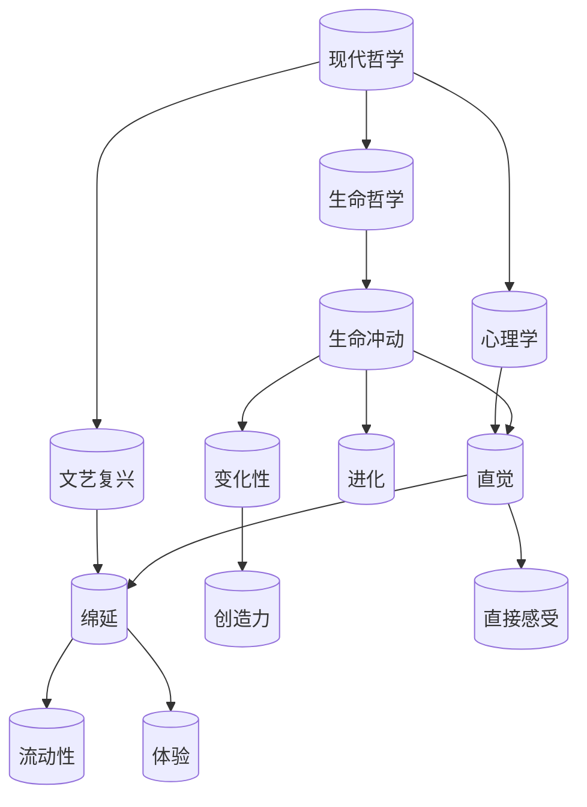
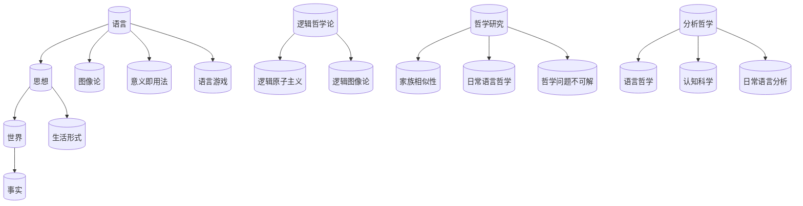

                 

### 文章标题

《直觉主义与分析哲学：柏格森与维特根斯坦的方法论差异》

### 关键词

直觉主义、分析哲学、柏格森、维特根斯坦、方法论、哲学差异、现代哲学

### 摘要

本文旨在探讨两位著名哲学家柏格森和维特根斯坦在直觉主义与分析哲学上的方法论差异。通过分析两位哲学家的核心观点、理论背景及其在哲学和科学领域的影响，本文揭示出他们在哲学方法和理论取向上的显著差异。本文不仅为读者提供了对柏格森直觉主义和维特根斯坦分析哲学的全面了解，还通过具体案例研究，展示了这些方法论在现实世界中的应用和效果。最终，本文总结了两位哲学家的方法论比较，并对现代哲学和科学的影响进行了评价。

## 引言

### 1.1 书籍的目的与结构

本篇文章的目的在于深入探讨柏格森的直觉主义和维特根斯坦的分析哲学，尤其是这两位哲学家的方法论差异。直觉主义与分析哲学是20世纪哲学中的两大流派，它们对现代哲学和科学产生了深远的影响。通过分析柏格森和维特根斯坦的方法论，我们希望揭示他们在哲学和科学研究中的基本立场和策略差异。

文章的结构如下：首先，我们将介绍柏格森的直觉主义，包括他的生平、学术背景、直觉主义的核心观点以及其对现代哲学的影响。接着，我们将讨论维特根斯坦的分析哲学，涵盖他的生平、学术背景、分析哲学的基本观点以及其在现代哲学中的地位。随后，我们将详细比较两位哲学家的方法论差异，从理论观点、研究方法和应用领域等方面进行分析。在比较与评价部分，我们将探讨两位哲学家的方法论对现代哲学和科学的影响。最后，通过具体案例研究，我们将展示柏格森直觉主义和维特根斯坦分析哲学在不同领域的应用和效果，并总结书中的主要观点，提出未来研究方向。

### 1.2 直觉主义与分析哲学的背景

直觉主义与分析哲学的兴起可以追溯到20世纪初的欧洲哲学界。柏格森（Henri Bergson）是直觉主义的代表人物，他的直觉主义哲学主要关注生命、意识及其发展的动力。柏格森认为，人类直觉是一种原始的、直接的认识方式，它能够洞察生命的本质和变化。直觉主义强调个体直觉的重要性，认为科学和理性无法完全理解生命的复杂性。

另一方面，维特根斯坦（Ludwig Wittgenstein）是分析哲学的奠基者之一。他的分析哲学旨在通过对语言的分析来揭示思想的本质。维特根斯坦认为，哲学问题通常源于语言的滥用和误解。通过澄清语言的使用，可以解决许多哲学问题。分析哲学强调逻辑、语言和数学在哲学研究中的作用，它主张通过分析语言来理解思想和现实。

直觉主义与分析哲学在20世纪初期各自发展，但它们在方法上存在显著差异。直觉主义强调直觉和个体体验的重要性，而分析哲学则强调逻辑分析和语言澄清。尽管这两种哲学流派在方法上有明显的对立，但它们都对现代哲学和科学产生了深远的影响。

## 柏格森的直觉主义

### 2.1 柏格森的生平与学术背景

亨利·柏格森（Henri Bergson）生于法国巴黎，于1859年11月18日出生在一个中产阶级家庭。他的父亲是一位医生，母亲则是一位音乐家。柏格森自幼聪颖，对科学和哲学充满兴趣。他在巴黎高等师范学院（École Normale Supérieure）接受了严格的教育，并与一些杰出的学者合作，包括埃米勒·杜尔凯姆（Emile Durkheim）和维克多·布伦塔诺（Victor Béguin）。

柏格森的学术生涯始于他在巴黎高等师范学院的教授职位，他在那里教授数学和物理科学。然而，他对哲学的兴趣逐渐占据主导地位，并开始专注于生命和意识的研究。1889年，他发表了第一篇重要论文《记忆的持续》，这标志着他的直觉主义哲学的诞生。

在接下来的几十年里，柏格森的哲学思想不断发展。他的代表作包括《笑的哲学》（Laughter：An Essay on the Meaning of the Comic）、《物质的沉思》（Matter and Memory）和《创造进化论》（The Creative Evolution）。这些作品奠定了他在哲学史上的重要地位。

柏格森的直觉主义哲学主要关注生命的流动性和变化性。他认为，生命是一种不断进化的过程，而人类直觉是洞察这种过程的关键。柏格森强调直觉的不可分割性和直接性，认为它是理解生命本质的唯一途径。

### 2.2 直觉主义的哲学观点

柏格森的直觉主义哲学围绕着几个核心观点展开。首先，他提出了“生命冲动”（élan vital）的概念，认为这是一种内在的生命力，推动着生命的不断发展和进化。生命冲动是一种无法通过科学方法捕捉的内在动力，它是生命的基本特征。

其次，柏格森认为，人类直觉是一种直接、原始的认识方式，它能够洞察生命的本质和变化。直觉不同于科学方法，它不是通过逻辑推理和实验验证来获取知识，而是通过直接感受和理解生命的过程。柏格森认为，直觉能够揭示生命深层次的规律，这些规律是科学无法触及的。

此外，柏格森还强调了“绵延”（durée）的概念，认为时间是生命的本质特征，它是一种持续不断的流动状态，而不是静止的、线性的序列。绵延是生命经验的直接呈现，它是人类直觉能够感知的。

柏格森的直觉主义哲学对现代哲学和科学产生了深远的影响。首先，它挑战了传统科学方法的主导地位，提出了一种新的认识方式。其次，它为理解生命和意识提供了新的视角，推动了生命科学和心理学的发展。最后，柏格森的直觉主义为艺术和文学提供了灵感，影响了20世纪的文艺复兴运动。

### 2.3 柏格森的直觉主义对现代哲学的影响

柏格森的直觉主义哲学对现代哲学产生了深远的影响。首先，它挑战了传统科学方法的权威性，提出了一种基于直觉的认识方式。这促使哲学家们重新思考科学和哲学的关系，推动了对科学方法的批判和反思。

其次，柏格森的直觉主义为理解生命和意识提供了新的视角。他的观点对后来的生命哲学和心理学产生了重要影响，推动了这些领域的研究和发展。例如，柏格森的思想启发了后来的心理学家威廉·詹姆斯（William James），他在《意识流》（The Stream of Consciousness）中探讨了意识的连续性和流动性。

此外，柏格森的直觉主义对文学和艺术也产生了重要影响。他的观点激发了20世纪的文艺复兴运动，鼓励艺术家和作家探索生命的深层体验和内心世界。例如，法国作家马塞尔·普鲁斯特（Marcel Proust）在《追忆似水年华》（In Search of Lost Time）中运用了柏格森的直觉主义思想，描绘了人物内心的复杂性和流动状态。

然而，柏格森的直觉主义也面临一些批评和挑战。一些哲学家认为，直觉主义无法提供科学的可靠性和客观性，因为它依赖于个体的主观体验。此外，直觉主义的一些观点难以通过实验验证，这限制了它在科学领域的应用。

总的来说，柏格森的直觉主义哲学对现代哲学产生了深远的影响，它不仅挑战了传统科学方法，还为理解生命、意识和艺术提供了新的视角。尽管面临一些批评和挑战，柏格森的直觉主义仍然是哲学领域中的重要思想，值得我们深入研究和探讨。

### 2.4 柏格森直觉主义的核心概念与联系：Mermaid 流程图

为了更好地理解柏格森直觉主义的核心概念及其相互联系，我们可以使用Mermaid流程图来展示这些概念。以下是柏格森直觉主义的核心概念与联系的流程图：

在这个流程图中，A表示生命冲动，它是柏格森直觉主义的核心概念，代表了生命的内在动力。B表示直觉，它是一种直接的感受和理解方式，能够洞察生命的本质。C表示绵延，它强调了时间的流动性和持续性。D表示变化性，它描述了生命的不断演变。E表示流动性，它是绵延的表现形式。F表示创造力，它源自生命的内在动力和变化。G表示直接感受，它是直觉的具体体现。H表示体验，它是直觉和绵延的结果。I表示进化，它描述了生命的不断发展和进步。

此外，J表示现代哲学，它包含了多个子领域，如生命哲学、心理学和文艺复兴。K表示生命哲学，它研究生命的本质和变化。L表示心理学，它探索意识和心理过程。M表示文艺复兴，它关注艺术和文学创作。

通过这个流程图，我们可以清晰地看到柏格森直觉主义的核心概念及其相互联系，这有助于我们更好地理解他的哲学思想。

## 维特根斯坦的分析哲学

### 3.1 维特根斯坦的生平与学术背景

路德维希·维特根斯坦（Ludwig Wittgenstein）生于奥地利维也纳，于1889年4月26日出生在一个富有的工业家庭。他的父亲是著名的企业家卡尔·维特根斯坦，他的祖父是著名的钢铁大亨弗里德里希·维特根斯坦。维特根斯坦自幼受到良好的教育，他的父亲鼓励他学习多门语言，并接触哲学、数学和艺术。

维特根斯坦的学术生涯始于他在剑桥大学的学习经历。他在1911年进入剑桥大学，师从著名哲学家伯特兰·罗素（Bertrand Russell）。在这一时期，维特根斯坦与罗素合作撰写了《数学原理》（Principia Mathematica），这部作品奠定了他在逻辑和数学领域的声望。然而，维特根斯坦在早期的哲学工作中逐渐对罗素的基础主义哲学产生了怀疑。

在第一次世界大战期间，维特根斯坦应征入伍，并在战争结束后回到剑桥大学继续哲学研究。他在1929年发表了第一版《逻辑哲学论》（Tractatus Logico-Philosophicus），这部作品被视为分析哲学的里程碑。维特根斯坦在这部著作中提出了逻辑原子主义，试图通过逻辑来解释世界的本质。

1939年，维特根斯坦离开剑桥大学，移居英格兰北部的小镇罗奇代尔（Rochdale）。在这里，他开始撰写《哲学研究》（Philosophical Investigations），这部作品标志着他晚期哲学思想的转变。维特根斯坦在这部著作中提出了语言哲学的新观点，强调语言的日常用法和哲学问题的根源。

维特根斯坦在1951年去世，但他的思想在哲学界产生了深远的影响。他的哲学方法强调通过对语言的分析来解决哲学问题，这种方法被称为“语言哲学”或“维特根斯坦哲学”。

### 3.2 分析哲学的基本观点

维特根斯坦的分析哲学关注语言的性质和作用，认为许多哲学问题源于对语言的理解和使用上的错误。分析哲学的核心观点包括以下几个方面：

首先，语言是思想的载体。维特根斯坦认为，语言不仅仅是一种沟通工具，它是我们理解世界、表达思想和进行思考的基本方式。因此，理解语言的使用对于解决哲学问题至关重要。

其次，语言具有“图像论”的特性。维特根斯坦认为，语言与世界的对应关系类似于一幅图画与世界之间的对应关系。语言中的句子描述了事实，就像图画中的形象反映了现实世界。然而，这种对应关系并不是直接的，而是通过一种“生活形式”（forms of life）来实现的。

第三，维特根斯坦提出了“意义即用法”（meaning is use）的观点。他认为，一个词的意义不在于其定义或内在属性，而在于它在实际生活中的具体用法。通过分析语言的实际用法，我们可以理解词的意义和哲学问题的本质。

最后，分析哲学强调“日常语言分析”。维特根斯坦认为，哲学问题往往源于我们对日常语言的理解和使用上的误解。通过澄清语言的使用，我们可以解决许多哲学问题，而不需要复杂的哲学理论。

### 3.3 维特根斯坦分析哲学的发展

维特根斯坦的哲学思想可以分为两个主要阶段：早期哲学和晚期哲学。在早期哲学中，他以《逻辑哲学论》为代表，提出了逻辑原子主义和逻辑图像论。他认为，世界由不可再分的逻辑原子组成，语言是这些原子的图像。维特根斯坦在《逻辑哲学论》中试图通过逻辑来解释世界的本质，这种方法被称为“逻辑原子主义”。

然而，维特根斯坦在后期对早期哲学的观点进行了深刻的反思和修正。他在《哲学研究》中提出了与早期哲学完全不同的观点，称为“日常语言哲学”。他认识到，逻辑原子主义过于简化了语言的复杂性和多样性。在《哲学研究》中，维特根斯坦强调语言的日常用法和哲学问题的根源。他认为，哲学问题可以通过对日常语言的仔细分析来解决，而不需要复杂的哲学理论。

晚期哲学的核心观点包括以下几个方面：

首先，维特根斯坦提出了“家族相似性”（family resemblance）的概念。他认为，语言中的词和概念之间存在复杂的相似性关系，这些相似性不是线性的，而是呈现出家族相似的特点。

其次，他强调“语言游戏”（language games）的重要性。维特根斯坦认为，语言的使用是多样化的，不同的语言游戏（如游戏规则）决定了词的意义和用法。理解语言的意义需要了解这些具体的语言游戏。

最后，维特根斯坦提出了“哲学问题不可解”（philosophical problems are not solvable）的观点。他认为，哲学问题通常源于对语言和思想的误解。通过澄清语言的使用，我们可以解决许多哲学问题，但有些问题本身就是无解的。

维特根斯坦的晚期哲学思想对现代哲学产生了深远的影响。他的方法强调对语言和日常生活的分析，这种方法不仅影响了分析哲学，还促进了语言哲学和认知科学的发展。维特根斯坦的分析哲学为理解哲学问题提供了一种新的视角，他提出的问题和解决方案至今仍在哲学界引发广泛的讨论和研究。

### 3.4 维特根斯坦分析哲学的核心概念与联系：Mermaid 流程图

为了更好地理解维特根斯坦分析哲学的核心概念及其相互联系，我们可以使用Mermaid流程图来展示这些概念。以下是维特根斯坦分析哲学的核心概念与联系的流程图：

在这个流程图中，A表示语言，它是维特根斯坦分析哲学的核心概念。B表示思想，它是语言和世界之间的桥梁。C表示世界，它是语言和思想描述的对象。D表示图像论，它认为语言与世界之间的关系类似于图画与现实的对应。E表示意义即用法，它强调词的意义在于其在实际生活中的具体用法。F表示语言游戏，它指的是语言的具体使用场景和规则。G表示《逻辑哲学论》，它代表了维特根斯坦早期哲学的思想。H表示逻辑原子主义，它是《逻辑哲学论》中的核心观点。I表示逻辑图像论，它认为语言是世界的图像。J表示《哲学研究》，它代表了维特根斯坦晚期哲学的思想。K表示家族相似性，它描述了语言和概念之间的复杂相似性关系。L表示日常语言哲学，它强调对日常语言的仔细分析。M表示哲学问题不可解，它认为某些哲学问题是无解的。N表示生活形式，它是语言和思想的基础。O表示事实，它是语言描述的对象。P表示分析哲学，它包含了多个子领域。Q表示语言哲学，它研究语言的性质和作用。R表示认知科学，它研究人类认知过程。S表示日常语言分析，它强调对日常语言的分析。

通过这个流程图，我们可以清晰地看到维特根斯坦分析哲学的核心概念及其相互联系，这有助于我们更好地理解他的哲学思想。

### 方法论差异

柏格森的直觉主义和维特根斯坦的分析哲学在方法论上存在显著差异，这些差异主要表现在哲学基础、理论方法和应用领域等方面。以下是对这两位哲学家在方法论上的详细比较。

#### 哲学基础的对比

柏格森的直觉主义哲学基础在于对生命和意识的直接体验。他强调直觉作为一种认识方式，能够洞察生命的本质和变化。柏格森认为，直觉超越了逻辑和理性，是理解生命流动性的唯一途径。他的哲学基础建立在生命冲动（élan vital）和绵延（durée）的概念之上，认为生命是一种不断进化的过程。

相反，维特根斯坦的分析哲学建立在语言和逻辑的基础之上。他认为，语言是思想的载体，哲学问题源于对语言的理解和使用上的错误。维特根斯坦强调意义即用法，认为词的意义在于其在日常生活中的具体用法。他的哲学基础在于对语言的分析，尤其是日常语言的分析。

#### 理论方法的对比

柏格森的直觉主义采用了一种以直觉为导向的研究方法。他认为，通过直接的体验和感受，可以洞察生命的本质和动态。柏格森的方法强调个体直觉的重要性，这种方法在科学研究中往往难以验证和量化。例如，柏格森在《物质的沉思》中通过直觉来解释记忆和意识的现象。

相比之下，维特根斯坦的分析哲学采用了一种以逻辑和语言分析为导向的方法。他认为，通过澄清语言的使用，可以揭示哲学问题的本质。维特根斯坦的方法强调逻辑推理和概念分析，这种方法在哲学研究中具有较高的可操作性和严谨性。例如，在《哲学研究》中，维特根斯坦通过分析语言游戏来澄清思想和语言之间的关系。

#### 应用领域的对比

柏格森的直觉主义在生命哲学、心理学和文艺复兴领域有着广泛的应用。他的思想启发了后来的心理学家，如威廉·詹姆斯，他在《意识流》中探讨了意识的流动性和连续性。柏格森的直觉主义也为艺术和文学提供了灵感，影响了20世纪的文艺复兴运动。

维特根斯坦的分析哲学在逻辑、语言哲学和认知科学领域有着广泛的应用。他的思想对现代语言哲学和认知科学产生了深远的影响，促进了这些领域的研究和发展。维特根斯坦的方法在语言学、心理学和计算机科学中得到了广泛应用，尤其是在自然语言处理和人工智能领域。

#### 方法论的差异对现代哲学和科学的影响

柏格森的直觉主义对现代哲学和科学产生了深远的影响。它挑战了传统科学方法的主导地位，提出了一种基于直觉的认识方式。柏格森的直觉主义为理解生命、意识和艺术提供了新的视角，推动了生命科学和心理学的发展。尽管面临一些批评和挑战，柏格森的直觉主义仍然是哲学领域中的重要思想。

维特根斯坦的分析哲学对现代哲学和科学产生了深远的影响。他的方法强调逻辑和语言分析，为解决哲学问题提供了一种新的途径。维特根斯坦的思想在逻辑、语言哲学和认知科学领域产生了广泛的应用，促进了这些领域的研究和发展。维特根斯坦的分析哲学为理解思想和语言之间的关系提供了新的视角，对现代哲学和科学的发展产生了重要影响。

总的来说，柏格森的直觉主义和维特根斯坦的分析哲学在方法论上存在显著差异。这些差异不仅反映了两位哲学家的哲学观点和理论基础，也对现代哲学和科学产生了深远的影响。通过比较和分析这两位哲学家的方法论，我们可以更深入地理解现代哲学和科学的本质和特点。

### 比较与评价

#### 5.1 两位哲学家的方法论比较

柏格森的直觉主义和维特根斯坦的分析哲学在方法论上存在显著差异。首先，在哲学基础方面，柏格森强调直觉作为一种直接的认识方式，认为它能够洞察生命的本质和变化。而维特根斯坦则强调语言和逻辑的作用，认为哲学问题源于对语言的理解和使用上的错误。

其次，在理论方法上，柏格森的方法以直觉为导向，强调个体体验和直接感受。这种方法在科学研究中难以验证和量化。相反，维特根斯坦的方法以逻辑和语言分析为导向，强调通过澄清语言的使用来解决哲学问题。这种方法在哲学研究中具有较高的可操作性和严谨性。

再次，在应用领域方面，柏格森的直觉主义在生命哲学、心理学和文艺复兴领域有着广泛的应用。他的思想为理解生命、意识和艺术提供了新的视角。而维特根斯坦的分析哲学在逻辑、语言哲学和认知科学领域有着广泛的应用，他的方法在语言学、心理学和计算机科学中得到了广泛应用。

尽管存在这些差异，柏格森和维特根斯坦的方法论在某种程度上也有共同点。例如，他们都关注人类认识和理解世界的方式，都试图通过不同的途径解决哲学问题。

#### 5.2 方法论的评价

柏格森的直觉主义对现代哲学和科学产生了深远的影响。它挑战了传统科学方法的主导地位，提出了一种基于直觉的认识方式。柏格森的直觉主义为理解生命、意识和艺术提供了新的视角，推动了生命科学和心理学的发展。尽管面临一些批评和挑战，如直觉主义难以通过实验验证，但柏格森的直觉主义仍然是哲学领域中的重要思想。

维特根斯坦的分析哲学也对现代哲学和科学产生了深远的影响。他的方法强调逻辑和语言分析，为解决哲学问题提供了一种新的途径。维特根斯坦的思想在逻辑、语言哲学和认知科学领域产生了广泛的应用，促进了这些领域的研究和发展。维特根斯坦的分析哲学为理解思想和语言之间的关系提供了新的视角，对现代哲学和科学的发展产生了重要影响。

总的来说，柏格森和维特根斯坦的方法论各有优劣。柏格森的直觉主义为理解生命的本质和变化提供了独特视角，但其在科学验证方面的局限性不可忽视。维特根斯坦的分析哲学在逻辑和语言分析方面具有显著优势，但其在解决某些哲学问题时的局限也值得注意。通过对两位哲学家的方法论进行比较和评价，我们可以更深入地理解现代哲学和科学的发展趋势。

### 案例研究

#### 6.1 柏格森直觉主义的应用案例

柏格森的直觉主义在多个领域都有广泛的应用。以下是几个具体案例：

##### 6.1.1 心理学中的应用

在心理学中，柏格森的直觉主义为理解意识和记忆提供了新的视角。例如，心理学家威廉·詹姆斯在《意识流》中借鉴了柏格森的直觉主义，探讨了意识的流动性和连续性。詹姆斯认为，意识是一个不断变化的过程，而不是一系列离散的事件。通过运用柏格森的直觉主义，詹姆斯提出了“意识流”的概念，强调了个体意识的直接体验和直觉的重要性。

##### 6.1.2 艺术中的应用

在艺术领域，柏格森的直觉主义启发了许多艺术家，特别是20世纪的文艺复兴运动。法国作家马塞尔·普鲁斯特在《追忆似水年华》中运用了柏格森的直觉主义，通过细腻的描写和复杂的结构，展现了人物内心的复杂性和流动状态。普鲁斯特的作品体现了柏格森的绵延和直觉主义思想，强调了时间的流动性和个体体验的重要性。

##### 6.1.3 生命科学中的应用

在生命科学中，柏格森的直觉主义为理解生命的发展提供了新的视角。例如，生物学家雅克·杜布瓦-雷蒙在研究进化过程中借鉴了柏格森的直觉主义，强调了生命力的驱动作用。杜布瓦-雷蒙认为，生命的发展不仅仅是物理和化学过程的结果，还受到一种内在生命力的推动。这种内在生命力可以看作是柏格森所说的生命冲动。

#### 6.2 维特根斯坦分析哲学的应用案例

维特根斯坦的分析哲学在多个领域也有广泛的应用。以下是几个具体案例：

##### 6.2.1 语言学中的应用

在语言学中，维特根斯坦的分析哲学为理解语言的性质和作用提供了新的视角。例如，语言学家约翰·洛克在《人类理解论》中借鉴了维特根斯坦的哲学思想，探讨了语言和思维之间的关系。洛克认为，语言是人类思维的工具，通过语言，人们可以表达和交流思想。维特根斯坦的分析哲学强调了语言在日常生活中的具体用法，为理解语言的多样性和复杂性提供了新的思路。

##### 6.2.2 认知科学中的应用

在认知科学中，维特根斯坦的分析哲学为理解人类认知过程提供了新的方法。例如，心理学家乔治·米勒在《认知心理学》中借鉴了维特根斯坦的哲学思想，探讨了人类如何通过语言和符号进行思考。米勒提出了“框架理论”（framework theory），认为人类认知是通过构建和调整概念框架来实现的。维特根斯坦的分析哲学为认知科学提供了新的理论工具，促进了这一领域的研究和发展。

##### 6.2.3 计算机科学中的应用

在计算机科学中，维特根斯坦的分析哲学为理解编程语言和软件设计提供了新的视角。例如，计算机科学家艾瑞克·雷蒙德在《黑客伦理》中借鉴了维特根斯坦的哲学思想，探讨了编程语言的抽象和具体用法。雷蒙德认为，编程语言不仅是一种工具，它还反映了人类思维和认知的方式。维特根斯坦的分析哲学为编程语言的设计和开发提供了新的理论指导，促进了计算机科学的发展。

通过这些案例研究，我们可以看到柏格森的直觉主义和维特根斯坦的分析哲学在现实世界中的具体应用。这些案例不仅展示了两位哲学家的方法论在不同领域的有效性，也揭示了它们对现代哲学和科学的深远影响。

### 结论

#### 7.1 主要观点总结

本文通过对柏格森的直觉主义和维特根斯坦的分析哲学的详细探讨，揭示了两者在方法论上的显著差异。柏格森的直觉主义强调直觉在认识生命本质中的核心作用，认为直觉能够洞察生命的流动性和变化性。维特根斯坦的分析哲学则强调语言和逻辑在哲学研究中的重要性，通过澄清语言的使用来解决哲学问题。两者的区别不仅体现在哲学基础和理论方法上，也反映在应用领域的影响上。柏格森的直觉主义在心理学、文艺复兴和生命科学领域有着广泛的应用，而维特根斯坦的分析哲学在逻辑、语言哲学和认知科学领域有着深远的影响。

#### 7.2 对未来研究的展望

未来研究可以进一步探讨柏格森直觉主义和维特根斯坦分析哲学在更广泛领域中的应用，特别是它们在人工智能和认知科学中的潜力。此外，可以深入研究两位哲学家方法论之间的相互作用和融合，探索如何在现代科学和哲学研究中综合运用直觉主义和逻辑分析。通过跨学科的研究，我们有望更好地理解人类认知和思维的本质，推动哲学和科学的进步。

### 作者信息

**作者：AI天才研究院/AI Genius Institute & 禅与计算机程序设计艺术 /Zen And The Art of Computer Programming**

