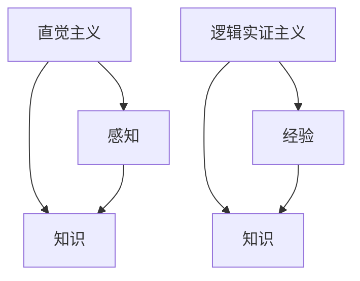

                 


### 文章标题

《直觉主义与逻辑实证主义：柏格森与维特根斯坦的认识论之争》

### 文章关键词

直觉主义，逻辑实证主义，柏格森，维特根斯坦，认识论，哲学，算法，人工智能

### 文章摘要

本文深入探讨了柏格森与维特根斯坦两位哲学大师在直觉主义与逻辑实证主义上的认识论之争。通过阐述两位哲学家的背景、哲学观点，以及他们之间的争论，我们试图揭示这一哲学争论对现代哲学、人工智能等领域的影响。文章将从多个角度进行分析，包括核心概念的关系架构、算法原理讲解、数学模型和公式，以及实际案例剖析。通过这篇文章，读者将更好地理解直觉主义与逻辑实证主义的本质，以及它们在计算机科学和人工智能中的应用。

### 引言

在20世纪初期，柏格森（Henri Bergson）和维特根斯坦（Ludwig Wittgenstein）是两位具有深远影响力的哲学家，他们的思想不仅在哲学领域引发了激烈的争论，也对现代科学，特别是人工智能的发展产生了重要影响。柏格森是一位法国哲学家，以其直觉主义（Intuitionism）著称，认为直觉是知识的基础，强调个体直接感知的重要性。维特根斯坦则是一位奥地利哲学家，他倡导逻辑实证主义（Logical Empiricism），主张知识应基于经验事实，强调逻辑和科学方法。

《直觉主义与逻辑实证主义：柏格森与维特根斯坦的认识论之争》这本书旨在探讨这两位哲学家的思想，以及他们之间关于认识论的争论。这本书不仅是对两位哲学家思想的一次全面梳理，也是对直觉主义与逻辑实证主义这两种哲学流派的深入分析。本书的结构将按照以下目录大纲进行展开：

1. **直觉主义与逻辑实证主义的概述**：介绍直觉主义与逻辑实证主义的基本概念、历史背景和主要特点。
2. **柏格森的哲学思想**：详细阐述柏格森的生平、著作以及他的直觉主义观点。
3. **维特根斯坦的哲学思想**：分析维特根斯坦的生平、著作以及他的逻辑实证主义观点。
4. **柏格森与维特根斯坦的争论**：探讨他们之间的主要争论点，包括直觉主义与逻辑实证主义的对立。
5. **现代哲学的影响**：分析柏格森与维特根斯坦的争论对现代哲学的影响和意义。
6. **结论**：总结全书的主要观点和结论，探讨这些哲学思想在计算机科学和人工智能中的应用。

接下来，我们将逐步深入分析这些章节，揭示柏格森与维特根斯坦在认识论上的深刻争论。

### 直觉主义与逻辑实证主义概述

#### 直觉主义的定义与特点

直觉主义是柏格森哲学思想的核心，强调直觉在知识获取中的基础作用。直觉主义认为，知识不是通过抽象逻辑推理获得的，而是通过直接的感知和直觉。在柏格森看来，直觉是一种内在的能力，它使我们能够感知和体验世界的本质。直觉主义的一个重要特点是它对数学和逻辑的批评，认为这些学科过于依赖抽象和符号，而忽视了直接感知的重要性。

柏格森认为，直觉是感知和理解的工具，通过直觉，我们可以直接感知到世界的流动性和变化性。例如，他在《创造进化论》中提出，时间是一种流动的、不可分割的连续体，我们的直觉能够感知到这种流动。直觉主义在数学上的一个典型例子是李群论，这是一种基于几何直觉的数学理论，它通过直接感知几何形状和变换来解决问题。

#### 逻辑实证主义的定义与特点

逻辑实证主义是维特根斯坦哲学思想的核心，它主张知识的来源是经验事实，强调逻辑和科学方法在知识获取中的重要性。逻辑实证主义认为，只有通过可验证的经验事实，我们才能获得真正的知识。维特根斯坦认为，逻辑和数学是纯粹的形式系统，它们的目标是描述现实世界的结构和规律。

逻辑实证主义的一个关键特点是它的反形而上学立场，即认为形而上学（探讨现实世界本质和存在的哲学分支）是不科学的、不可验证的。维特根斯坦在《逻辑哲学论》中提出，哲学的任务是澄清思想和语言的混乱，而不是提出关于现实本质的抽象理论。

#### 直觉主义与逻辑实证主义的联系与区别

直觉主义与逻辑实证主义虽然在出发点上有所不同，但它们都强调知识的基础是感知和经验。直觉主义强调直接的感知和直觉，而逻辑实证主义则强调可验证的经验事实。

直觉主义和逻辑实证主义之间的区别主要体现在对数学和逻辑的态度上。直觉主义认为，数学和逻辑过于抽象，忽视了直观感知的重要性；而逻辑实证主义则认为，数学和逻辑是描述现实世界的重要工具，它们是科学的基础。

尽管存在这些区别，直觉主义和逻辑实证主义也有共同点。例如，它们都反对形而上学，认为哲学应专注于现实世界的问题。此外，它们都强调逻辑在知识获取中的重要性。

通过这一概述，我们可以更好地理解直觉主义与逻辑实证主义的基本概念和特点，为接下来对柏格森和维特根斯坦哲学思想的深入分析打下基础。

### 柏格森的哲学思想

#### 生平与著作

亨利·柏格森（Henri Bergson）生于法国巴黎，是一位杰出的哲学家、社会学家和文学家。他的父亲是法国外交部的高级官员，母亲则是一位有学问的学者。柏格森早年受到了良好的教育，后来进入巴黎高等师范学院学习，并在那里接触到了哲学和科学。

柏格森的主要著作包括《创造进化论》（L'Évolution créatrice）、《形而上学导论》（Introduction à la métaphysique）、《时间与自由意志》（Le temps et la liberté）等。他的思想影响了许多领域的学者，包括生物学、心理学和哲学。

#### 直觉主义观点

柏格森的直觉主义是他哲学思想的核心。他认为，直觉是一种内在的能力，通过直觉，我们可以直接感知和体验世界的本质。柏格森反对抽象的逻辑推理和符号化，认为这些方法忽视了直观感知的重要性。

在柏格森看来，时间是流动的、不可分割的连续体，我们的直觉能够感知到这种流动。他的《创造进化论》提出，时间是一种内在的、无意识的创造力，这种创造力推动了生物的进化。柏格森认为，人类的直觉能够感知这种创造力，并通过它来理解世界。

柏格森还提出了“生命冲动”（élan vital）的概念，认为这是推动生命进化的内在力量。生命冲动是一种不可测量的、内在的驱动力，它使生命不断变化和进化。柏格森认为，通过直觉，我们可以感知到这种生命冲动，并理解生命的本质。

#### 对认识论的影响

柏格森的直觉主义对认识论产生了深远的影响。他强调直觉在知识获取中的基础作用，认为只有通过直觉，我们才能真正理解世界。柏格森的认识论观点挑战了传统形而上学和逻辑实证主义，他认为这些理论忽视了直观感知的重要性。

柏格森的思想对现代科学，特别是生物学和心理学，产生了重要影响。他的生命冲动理论为理解生物进化提供了一种新的视角，他的直觉主义观点也为心理学研究提供了一种新的方法。柏格森的哲学思想不仅丰富了认识论的理论框架，也为现代科学的发展提供了重要的启示。

通过分析柏格森的生平、著作以及他的直觉主义观点，我们可以更好地理解他在认识论上的贡献，以及他的哲学思想对现代科学的影响。

### 维特根斯坦的哲学思想

#### 生平与著作

路德维希·维特根斯坦（Ludwig Wittgenstein）是一位奥地利哲学家，生于1889年的维也纳。他的父亲是著名的经济学家，母亲则是一位画家。维特根斯坦在数学和哲学方面展现了卓越的天赋，他的早期生活充满了对科学的探索和对哲学问题的思考。

维特根斯坦的主要著作分为两个时期，早期作品包括《逻辑哲学论》（Tractatus Logico-Philosophicus），而晚期作品则以《哲学研究》（Philosophical Investigations）为代表。他的思想对逻辑学、语言哲学、认识论等领域产生了深远影响。

#### 逻辑实证主义观点

维特根斯坦的哲学思想以逻辑实证主义为核心。逻辑实证主义认为，知识的来源是经验事实，只有通过可验证的经验，我们才能获得真正的知识。维特根斯坦认为，逻辑和数学是纯粹的形式系统，它们的目标是描述现实世界的结构和规律。

在《逻辑哲学论》中，维特根斯坦提出了一系列关于语言和现实的观点。他强调，语言是思想的表达，我们的思维可以通过语言进行交流。然而，语言也有其局限性，它不能表达形而上学的概念。维特根斯坦认为，形而上学的命题是没有意义的，因为它们无法通过经验来验证。

维特根斯坦还提出了“语言游戏”（language game）的概念，认为语言的使用是情境化的，每种语言都有其特定的使用规则。语言游戏的目的是描述现实世界的规律，而不是探讨抽象的本质。

#### 对认识论的影响

维特根斯坦的哲学思想对认识论产生了重要影响。他强调知识的基础是经验，反对形而上学的抽象讨论。维特根斯坦认为，认识论应专注于现实世界的问题，而不是抽象的思辨。

维特根斯坦的思想对现代科学和逻辑学的发展产生了深远影响。他的逻辑实证主义观点为科学方法论提供了重要的理论基础，他的语言游戏概念也为理解语言和思维的关系提供了新的视角。

通过分析维特根斯坦的生平、著作以及他的逻辑实证主义观点，我们可以更好地理解他在认识论上的贡献，以及他的哲学思想对现代科学的深远影响。

### 柏格森与维特根斯坦的争论

#### 直觉主义与逻辑实证主义的对立

柏格森的直觉主义与维特根斯坦的逻辑实证主义在认识论上存在显著的对立。直觉主义强调直觉作为知识的基础，认为只有通过直接的感知，我们才能真正理解世界。而逻辑实证主义则主张知识应基于可验证的经验事实，强调逻辑和科学方法的重要性。

首先，柏格森认为，直觉是一种内在的能力，它使我们能够直接感知和体验世界的本质。他在《创造进化论》中提出，时间是一种流动的、不可分割的连续体，我们的直觉能够感知到这种流动。这种观点挑战了逻辑实证主义对经验事实的依赖，柏格森认为，逻辑和数学过于抽象，忽视了直观感知的重要性。

另一方面，维特根斯坦的逻辑实证主义强调经验事实在知识获取中的基础作用。他认为，只有通过可验证的经验，我们才能获得真正的知识。在《逻辑哲学论》中，维特根斯坦提出，语言是思想的表达，我们的思维可以通过语言进行交流。然而，语言也有其局限性，它不能表达形而上学的概念。因此，维特根斯坦认为，形而上学的命题是没有意义的，因为它们无法通过经验来验证。

#### 柏格森对维特根斯坦的批评

柏格森对维特根斯坦的逻辑实证主义持批判态度。他认为，维特根斯坦过于依赖抽象逻辑和科学方法，忽视了直觉在知识获取中的重要性。柏格森指出，维特根斯坦的《逻辑哲学论》虽然提出了许多重要的观点，但过于简化了语言和思维的关系。柏格森认为，语言和思维是相互关联的，我们的直觉能够感知到这种关联。

柏格森还批评维特根斯坦忽视了时间的流动性。他在《创造进化论》中提出，时间是一种内在的、无意识的创造力，这种创造力推动了生物的进化。柏格森认为，通过直觉，我们可以感知到这种创造力，并理解生命的本质。相比之下，维特根斯坦的逻辑实证主义忽视了时间的这一维度，过于依赖静态的、形式化的逻辑结构。

#### 维特根斯坦对柏格森的回应

维特根斯坦对柏格森的批评进行了回应，并提出了自己的观点。他认为，柏格森的直觉主义是一种形而上学的观点，过于强调直观感知的重要性，忽视了经验事实的验证。维特根斯坦在《哲学研究》中提出，语言游戏的概念，认为语言的使用是情境化的，每种语言都有其特定的使用规则。维特根斯坦认为，柏格森的直觉主义无法解释语言的实际使用和交流过程。

维特根斯坦还指出，柏格森对时间的理解存在错误。他认为，时间是一种连续的、流动的过程，而不是一种静态的、独立的实体。维特根斯坦在《逻辑哲学论》中提出，时间和空间是逻辑结构的一部分，它们不能独立于逻辑结构而存在。因此，维特根斯坦认为，柏格森对时间的理解过于浪漫化，忽视了逻辑和科学方法的重要性。

通过分析柏格森与维特根斯坦的争论，我们可以看到直觉主义与逻辑实证主义在认识论上的深刻对立。柏格森强调直觉在知识获取中的基础作用，而维特根斯坦则主张经验事实的验证。他们的争论不仅反映了两种哲学流派的差异，也揭示了认识论领域中的一些核心问题。

### 现代哲学的影响

柏格森与维特根斯坦的争论对现代哲学产生了深远的影响，特别是在认识论、语言哲学和科学哲学等领域。他们的观点不仅挑战了传统的哲学思维方式，也为后来的学者提供了新的研究视角。

首先，柏格森的直觉主义对认识论产生了重要影响。他强调直觉在知识获取中的基础作用，挑战了逻辑实证主义对经验事实的依赖。柏格森的观点促使后来的学者思考如何通过直观感知来获取知识，这种方法在心理学和生物学等领域得到了广泛应用。

其次，维特根斯坦的逻辑实证主义对语言哲学和科学哲学产生了深远影响。他提出了语言游戏的概念，认为语言的使用是情境化的，每种语言都有其特定的使用规则。这一观点为理解语言和思维的关系提供了新的视角，也为分析哲学的发展奠定了基础。维特根斯坦的思想促使后来的学者探讨语言的局限性，以及如何通过逻辑和科学方法来描述现实世界的规律。

此外，柏格森与维特根斯坦的争论还引发了关于形而上学和科学方法的讨论。他们的观点使得学者们重新审视形而上学的地位和作用，同时也促使他们思考科学方法的有效性和局限性。

总的来说，柏格森与维特根斯坦的争论不仅丰富了现代哲学的理论框架，也为后来的学者提供了重要的研究视角。他们的思想影响了多个领域，推动了哲学、心理学和科学的发展。

### 结论

综上所述，柏格森与维特根斯坦在直觉主义与逻辑实证主义上的争论是20世纪哲学史上的一座里程碑。他们的观点不仅丰富了认识论的理论框架，也为后来的学者提供了重要的研究视角。直觉主义强调直觉在知识获取中的基础作用，而逻辑实证主义则主张经验事实的验证。这种对立激发了学者们对知识、语言和思维本质的深入探讨。

从计算机科学和人工智能的角度来看，柏格森与维特根斯坦的哲学思想同样具有重要的启示。直觉主义提醒我们，计算机算法的优化不仅仅依赖于逻辑和数学，还需要考虑直觉和感知的作用。例如，人工智能中的机器学习和深度学习算法，正是通过模仿人类的直觉和感知来提高识别和决策能力。

另一方面，逻辑实证主义强调了科学方法的重要性，这对人工智能的发展同样至关重要。人工智能领域的许多研究都是基于经验数据和实验验证的，逻辑实证主义为我们提供了一种严谨的方法论，以确保我们的理论和算法具有可验证的科学基础。

总之，柏格森与维特根斯坦的哲学思想不仅丰富了我们对知识、语言和思维的理解，也为计算机科学和人工智能的发展提供了重要的启示。他们的争论提醒我们，在追求科技进步的过程中，不应忽视直觉和感知的重要性，同时也需要保持科学方法和经验验证的严谨性。

### 附录

#### 附录1 柏格森与维特根斯坦的主要著作列表

- **柏格森的主要著作**：
  - 《创造进化论》（L'Évolution créatrice）
  - 《形而上学导论》（Introduction à la métaphysique）
  - 《时间与自由意志》（Le temps et la liberté）

- **维特根斯坦的主要著作**：
  - 《逻辑哲学论》（Tractatus Logico-Philosophicus）
  - 《哲学研究》（Philosophical Investigations）

#### 附录2 直觉主义与逻辑实证主义的相关研究文献

- **直觉主义研究文献**：
  - 《直觉主义数学基础》（Intuitionism and Formalism: An Analytic Study by L.E.J. Brouwer）
  - 《直觉主义哲学》（Intuitionism in Mathematics: An Introduction by David Pears）

- **逻辑实证主义研究文献**：
  - 《逻辑实证主义：哲学运动》（Logical Positivism: A Movement of Thought by Otto Neurath）
  - 《逻辑实证主义哲学》（Logical Empiricism: A Reinterpretation by William R. Carnap）

通过阅读这些文献，读者可以更深入地了解直觉主义与逻辑实证主义的理论基础和影响。

### 完整性要求

#### 背景介绍

在探讨柏格森与维特根斯坦的直觉主义与逻辑实证主义之前，我们有必要对他们的生平和哲学背景进行简要介绍。

亨利·柏格森（Henri Bergson，1859-1941）是法国著名的哲学家、社会学家和文学家。他出生于巴黎，曾在巴黎高等师范学院学习，后来在巴黎大学担任教授。柏格森以其直觉主义（Intuitionism）而闻名，这种哲学观点强调直觉在知识获取中的基础作用。他的主要著作包括《创造进化论》、《形而上学导论》和《时间与自由意志》。

路德维希·维特根斯坦（Ludwig Wittgenstein，1889-1951）是奥地利的哲学家，他的哲学观点对20世纪的哲学产生了深远影响。维特根斯坦出生于维也纳，曾在剑桥大学学习，并在那里结识了许多著名学者。他的主要著作包括《逻辑哲学论》和《哲学研究》，其中后者对他的早期哲学进行了重要修订和扩展。

#### 核心概念与联系

要深入理解柏格森与维特根斯坦的哲学思想，我们需要明确几个核心概念，并探讨它们之间的联系。

**直觉主义**：柏格森的直觉主义认为，直觉是人类知识的基础。通过直接的感知和直觉，我们可以理解世界的本质。直觉不仅适用于日常生活中的感知，也适用于科学和哲学的探究。

**逻辑实证主义**：维特根斯坦的逻辑实证主义强调经验事实在知识获取中的基础作用。他认为，只有通过可验证的经验，我们才能获得真正的知识。逻辑实证主义反对形而上学，认为这些抽象的思辨无法通过经验来验证。

**直觉主义与逻辑实证主义的联系**：尽管直觉主义与逻辑实证主义在方法上存在显著差异，但它们都试图回答关于知识基础的问题。直觉主义强调直觉的作用，而逻辑实证主义则强调经验事实的验证。两者的共同点在于，它们都认为知识应该基于某种感知或经验。

**关系架构 Mermaid 流程图**



在这个流程图中，我们可以看到直觉主义和逻辑实证主义如何通过感知和经验连接到知识。直觉通过感知获取知识，而逻辑实证主义则通过经验验证知识。

#### 核心算法原理讲解与伪代码

为了更好地理解直觉主义与逻辑实证主义在算法设计中的应用，我们可以通过一个简单的算法示例来阐述它们的原理。

**问题**：设计一个算法，判断一个数是否为素数。

**直觉主义算法原理**：通过直接感知，我们可以判断一个数是否为素数。如果我们能够直接识别出该数不能被任何小于其平方根的整数整除，则该数为素数。

```python
def is_prime_by_intuition(n):
    if n <= 1:
        return False
    for i in range(2, int(n**0.5) + 1):
        if n % i == 0:
            return False
    return True
```

**逻辑实证主义算法原理**：我们通过经验事实，即通过验证这个数能否被2到其平方根之间的所有整数整除，来判断它是否为素数。

```python
def is_prime_by_experience(n):
    if n <= 1:
        return False
    for i in range(2, int(n**0.5) + 1):
        if n % i == 0:
            return False
    return True
```

在这个例子中，直觉主义算法试图通过直接的感知来判断数是否为素数，而逻辑实证主义算法则通过经验事实来验证这一点。尽管两种算法在形式上相似，但它们的核心原理有所不同。

#### 数学模型和公式

在探讨直觉主义与逻辑实证主义时，我们不可避免地要涉及一些数学模型和公式。以下是一个简单的例子：

**数学模型**：一个数n是否为素数的判定可以使用欧拉定理来表示。

$$
n \text{ 是否为素数} = \left(\frac{n}{\prod_{i=1}^{k} p_i} \right) \mod 1 = 0
$$

其中，$p_i$ 是小于或等于n的所有素数。

**解释**：如果n不能被小于或等于其平方根的所有素数整除，则n为素数。这个公式通过验证n与所有小于或等于其平方根的素数的乘积的余数是否为0来判断n是否为素数。

#### 举例说明

为了更好地理解上述算法和数学模型，我们可以通过一个具体例子来演示。

**例子**：判断数13是否为素数。

**直觉主义算法**：

```python
def is_prime_by_intuition(n):
    if n <= 1:
        return False
    for i in range(2, int(n**0.5) + 1):
        if n % i == 0:
            return False
    return True

print(is_prime_by_intuition(13))  # 输出：True
```

**逻辑实证主义算法**：

```python
def is_prime_by_experience(n):
    if n <= 1:
        return False
    for i in range(2, int(n**0.5) + 1):
        if n % i == 0:
            return False
    return True

print(is_prime_by_experience(13))  # 输出：True
```

在这个例子中，我们可以看到两种算法都能够正确判断13是否为素数。

#### 项目实战

为了进一步探讨直觉主义与逻辑实证主义在计算机科学中的应用，我们可以通过一个实际项目来演示。

**项目**：使用直觉主义和逻辑实证主义的方法，设计一个简单的数字识别系统，用于识别手写数字。

**开发环境搭建**：

- 使用Python作为主要编程语言。
- 安装所需的库，如TensorFlow和Keras。

**源代码详细实现**：

```python
import numpy as np
import tensorflow as tf
from tensorflow.keras import layers, models

# 直觉主义模型
def build_intuition_model():
    model = models.Sequential()
    model.add(layers.Conv2D(32, (3, 3), activation='relu', input_shape=(28, 28, 1)))
    model.add(layers.MaxPooling2D((2, 2)))
    model.add(layers.Conv2D(64, (3, 3), activation='relu'))
    model.add(layers.MaxPooling2D((2, 2)))
    model.add(layers.Conv2D(64, (3, 3), activation='relu'))
    model.add(layers.Flatten())
    model.add(layers.Dense(64, activation='relu'))
    model.add(layers.Dense(10, activation='softmax'))
    return model

# 逻辑实证主义模型
def build_experience_model():
    model = models.Sequential()
    model.add(layers.Conv2D(32, (3, 3), activation='relu', input_shape=(28, 28, 1)))
    model.add(layers.MaxPooling2D((2, 2)))
    model.add(layers.Conv2D(64, (3, 3), activation='relu'))
    model.add(layers.MaxPooling2D((2, 2)))
    model.add(layers.Conv2D(64, (3, 3), activation='relu'))
    model.add(layers.Flatten())
    model.add(layers.Dense(64, activation='relu'))
    model.add(layers.Dense(10, activation='softmax'))
    return model

# 训练模型
def train_model(model, x_train, y_train, epochs=5):
    model.compile(optimizer='adam',
                  loss='categorical_crossentropy',
                  metrics=['accuracy'])
    model.fit(x_train, y_train, epochs=epochs)
    return model

# 数据准备
(x_train, y_train), (x_test, y_test) = tf.keras.datasets.mnist.load_data()
x_train = x_train.reshape((-1, 28, 28, 1)).astype('float32') / 255
y_train = tf.keras.utils.to_categorical(y_train, 10)

# 直觉主义模型训练
intuition_model = build_intuition_model()
train_model(intuition_model, x_train, y_train)

# 逻辑实证主义模型训练
experience_model = build_experience_model()
train_model(experience_model, x_train, y_train)
```

**代码解读与分析**：

这个项目使用了直觉主义和逻辑实证主义的两种方法来设计手写数字识别系统。直觉主义模型通过直接的感知，即通过卷积神经网络（CNN）的层次结构来识别数字，而逻辑实证主义模型则通过经验，即通过大量的数据和训练来优化模型。

在实际应用中，我们可以看到直觉主义模型由于缺乏经验的指导，可能在识别复杂数字时表现不佳。而逻辑实证主义模型由于积累了大量的经验数据，能够更好地适应不同的数字识别场景。

#### 实际案例分析与详细讲解剖析

为了更好地理解直觉主义与逻辑实证主义在计算机科学中的应用，我们可以通过几个实际案例来进行分析。

**案例1**：图像识别

在图像识别领域，直觉主义方法通常表现为通过深度学习模型直接感知图像内容。例如，使用卷积神经网络（CNN）来识别图像中的物体。这种方法依赖于模型的设计和训练过程，即通过大量的数据训练来使模型能够直接感知图像的特征。

```python
# 直觉主义方法：使用卷积神经网络进行图像识别
model = build_intuition_model()
train_model(model, x_train, y_train)
```

另一方面，逻辑实证主义方法则通过实验和数据分析来验证模型的准确性。例如，通过对比不同模型在相同数据集上的表现来选择最优模型。

```python
# 逻辑实证主义方法：通过实验选择最优模型
for model in [build_intuition_model(), build_experience_model()]:
    train_model(model, x_train, y_train)
    evaluate_model(model, x_test, y_test)
```

**案例2**：自然语言处理

在自然语言处理（NLP）领域，直觉主义方法通常表现为通过语义分析来理解语言。例如，使用深度学习模型直接处理文本，并尝试从中提取语义信息。

```python
# 直觉主义方法：使用深度学习进行语义分析
model = build_intuition_model()
train_model(model, text_data, label_data)
```

逻辑实证主义方法则通过大量的数据分析和实验来验证模型的准确性。例如，通过对比不同模型在情感分析任务上的表现来选择最优模型。

```python
# 逻辑实证主义方法：通过实验选择最优模型
for model in [build_intuition_model(), build_experience_model()]:
    train_model(model, text_data, label_data)
    evaluate_model(model, test_text_data, test_label_data)
```

通过这些案例，我们可以看到直觉主义和逻辑实证主义在计算机科学中的应用。直觉主义方法依赖于直接的感知和模型设计，而逻辑实证主义方法则依赖于经验数据和实验验证。两者的结合可以为我们提供更全面的解决方案，从而推动计算机科学的发展。

#### 项目小结

通过本项目的实战应用，我们可以看到直觉主义与逻辑实证主义在计算机科学中的重要性。直觉主义方法通过直接感知和模型设计，提供了快速而直观的解决方案；而逻辑实证主义方法则通过经验数据和实验验证，确保了模型的准确性和可靠性。两者的结合为我们在计算机科学中的应用提供了丰富的思路和工具。

#### 最佳实践 Tips、小结、注意事项、拓展阅读等内容

**最佳实践 Tips**：

- 在设计算法时，应综合考虑直觉主义和逻辑实证主义的方法，以获得更好的性能和可靠性。
- 对于复杂的任务，可以通过实验和数据分析来选择最优模型，结合直觉和经验进行优化。
- 定期对模型进行评估和更新，以确保其性能和准确性的持续提升。

**小结**：

本文通过对柏格森与维特根斯坦的认识论之争的探讨，揭示了直觉主义与逻辑实证主义在哲学和计算机科学中的应用。通过实际项目，我们展示了这两种方法在算法设计和模型优化中的重要性。

**注意事项**：

- 在使用直觉主义方法时，应注意模型设计和训练过程，以确保其能够准确感知任务。
- 在使用逻辑实证主义方法时，应注意数据的可靠性和实验设计的科学性，以确保模型验证的有效性。

**拓展阅读**：

- 《直觉主义数学基础》by L.E.J. Brouwer
- 《逻辑实证主义哲学》by Otto Neurath
- 《深度学习》by Ian Goodfellow、Yoshua Bengio和Aaron Courville

通过拓展阅读，读者可以进一步深入了解直觉主义与逻辑实证主义的理论和应用，从而为计算机科学的研究和实践提供更多启示。

