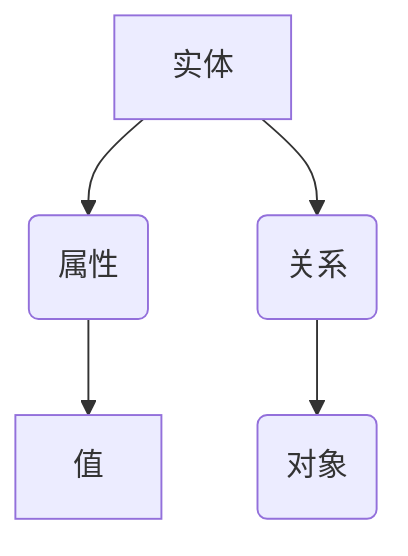

                 

### 引言与概述

知识图谱（Knowledge Graph）是近年来在人工智能领域迅速崛起的一项重要技术。它不仅为我们提供了一个全新的数据表示和存储方式，更在许多实际应用中展现出了强大的功能和潜力。从搜索引擎到推荐系统，从语义搜索到问答系统，知识图谱已经成为了许多领域不可或缺的技术工具。

#### 知识图谱的定义

知识图谱是一种用于表示实体（如人、地点、事物等）、实体之间的关系以及实体属性的数据结构。与传统的关系数据库和图形数据库不同，知识图谱强调的是语义和上下文信息，使得数据在查询和处理过程中能够更加智能化和灵活化。

#### 知识图谱的作用

知识图谱的作用主要体现在以下几个方面：

1. **增强搜索体验**：通过知识图谱，搜索引擎可以更好地理解用户的查询意图，提供更加准确和个性化的搜索结果。
2. **提升推荐质量**：知识图谱可以帮助推荐系统更好地理解用户和物品之间的关系，从而提供更加精准的推荐。
3. **支持语义理解**：知识图谱为自然语言处理提供了丰富的语义信息，使得机器可以更好地理解和处理自然语言。
4. **辅助决策支持**：知识图谱可以帮助企业更好地了解业务领域的知识，为决策提供有力的支持。

#### 知识图谱的发展历程

知识图谱的概念最早可以追溯到20世纪80年代，当时主要用于知识表示和推理。然而，随着互联网的兴起和大数据技术的进步，知识图谱在21世纪得到了迅速发展。特别是近年来，随着深度学习和自然语言处理技术的不断发展，知识图谱的应用场景也越来越广泛。

1. **语义网络**：20世纪80年代，语义网络（Semantic Network）作为一种知识表示方法被提出，它通过节点和边来表示实体和关系。
2. **本体论**：20世纪90年代，本体论（Ontology）成为知识图谱研究的重要理论基础，它提供了一种形式化的方法来描述实体和关系。
3. **大数据时代**：随着大数据技术的发展，知识图谱的应用范围得到了大幅扩展，从传统的知识库领域扩展到互联网、电子商务、医疗等多个领域。

总的来说，知识图谱作为一种重要的数据表示和存储方式，已经成为了人工智能领域的重要研究方向和应用热点。在接下来的章节中，我们将详细探讨知识图谱的基本概念、构建方法、应用场景以及优化和维护策略。

---

**关键词：** 知识图谱、数据表示、语义搜索、推荐系统、人工智能

**摘要：** 本文将从引言开始，详细介绍知识图谱的定义、作用以及发展历程，然后逐步深入探讨知识图谱的基本概念、构建方法、应用场景和优化维护策略。通过本文的阅读，读者将全面了解知识图谱的核心内容和技术原理，并能够掌握知识图谱在各个领域的应用方法。

### 知识图谱的基本概念

在深入了解知识图谱的构建与应用之前，我们首先需要明确知识图谱的基本概念。知识图谱是由实体、属性和关系构成的一种数据结构，它能够以图形化的方式展示实体之间的关系以及实体的属性信息。这一部分将详细介绍实体、属性和关系的定义及其相互关系。

#### 实体

实体（Entity）是知识图谱中最基本的组成单元，可以理解为现实世界中的人、地点、事物等具体存在的事物。例如，在一个社交媒体的知识图谱中，用户、地点、文章、事件等都可以被视为实体。

- **定义**：实体是知识图谱中具有独立存在意义的基本单元。
- **类型**：实体可以分为人物、地点、组织、物品等多种类型。
- **表示**：在知识图谱中，实体通常用一个唯一的标识符来表示，例如，使用URL或者整数标识符。

#### 属性

属性（Attribute）是用来描述实体特征的属性或特征。例如，对于一个人实体，其属性可能包括姓名、年龄、职业、居住地等。属性通常与实体之间存在一定的关联关系。

- **定义**：属性是用于描述实体特征的名称和值对。
- **类型**：属性可以分为结构化属性（如姓名、年龄）和非结构化属性（如图片、文本）。
- **表示**：在知识图谱中，属性通常用键值对（Key-Value Pair）的形式表示，例如`{"name": "John Doe", "age": 30}`。

#### 关系

关系（Relationship）是知识图谱中描述实体之间相互作用的纽带。它连接了两个或多个实体，描述了它们之间的某种关联或交互。例如，在社交媒体的知识图谱中，用户A点赞了用户B的帖子，那么用户A和用户B之间就存在一种点赞关系。

- **定义**：关系是知识图谱中描述实体之间相互作用或关联的元素。
- **类型**：关系可以分为简单关系（如属于、位于）和复杂关系（如员工、好友）。
- **表示**：在知识图谱中，关系通常用三元组（Subject, Predicate, Object）的形式表示，例如`(John Doe, likes, Article)`。

#### 实体、属性和关系的相互关系

在知识图谱中，实体、属性和关系之间存在着紧密的联系。具体来说：

1. **实体与属性的关系**：实体具有多个属性，每个属性描述了实体的某个方面。例如，一个用户实体可能有多个属性，如姓名、年龄、性别等。

2. **实体与关系的关系**：实体通过关系与其他实体相连。关系描述了实体之间的相互作用，如用户与用户之间的点赞关系。

3. **属性与关系的关系**：某些关系本身也可以具有属性。例如，在一个社交网络中，用户A点赞了用户B的帖子，这个点赞关系可以有一个属性“点赞时间”。

下图展示了实体、属性和关系之间的基本结构：



通过上述介绍，我们可以看出，知识图谱的基本概念构成了一个多层次、多维度的数据结构，为数据的存储、查询和处理提供了丰富的语义信息。

---

在了解了知识图谱的基本概念后，我们将进入下一部分，探讨知识图谱的构建方法。在这一部分，我们将详细讲解知识图谱构建的步骤，包括数据采集、数据预处理、数据存储与索引等。通过这些步骤，我们将深入理解如何从原始数据中构建出一个结构化的知识图谱。

### 知识图谱的构建方法

构建知识图谱是一个复杂的过程，它涉及从原始数据中提取有用信息、将信息转化为结构化的数据表示，以及将数据存储和索引以供高效查询。以下将详细描述知识图谱构建的主要步骤，包括数据采集、数据预处理、数据存储与索引。

#### 数据采集

数据采集是知识图谱构建的第一步，它是构建知识图谱的基础。数据来源可以包括结构化数据、半结构化数据和非结构化数据。

1. **结构化数据**：结构化数据通常存储在关系型数据库中，如用户信息、商品信息等。可以通过SQL查询等方式直接获取。
   
2. **半结构化数据**：半结构化数据，如XML、JSON等，可以通过相应的解析库进行提取。

3. **非结构化数据**：非结构化数据，如文本、图片、音频、视频等，需要通过自然语言处理（NLP）、图像处理等技术进行预处理，提取出有用的信息。

**示例：** 假设我们要构建一个社交媒体的知识图谱，数据来源可能包括用户信息（如姓名、年龄、性别）、用户发表的帖子（如文本、图片）、用户之间的互动（如点赞、评论）等。

#### 数据预处理

数据预处理是确保数据质量、一致性、完整性的关键步骤。它包括数据清洗、数据整合和数据转换。

1. **数据清洗**：清洗数据是为了去除重复、错误或不完整的数据。例如，去除重复的用户信息、修复错误的日期格式、填补缺失的属性值等。

2. **数据整合**：整合数据是将来自不同来源的数据合并成一个统一的数据集。例如，将用户信息与用户发表的帖子进行关联。

3. **数据转换**：数据转换是将原始数据格式转换为适合知识图谱表示的形式。例如，将文本数据转换为实体和属性，将图像数据转换为实体和标签。

**示例：** 对于社交媒体的知识图谱，数据清洗可能包括去除重复的用户信息、修复错误的日期格式等；数据整合可能包括将用户信息与用户发表的帖子进行关联；数据转换可能包括将文本转换为实体和属性，将图片转换为实体和标签。

#### 数据存储与索引

知识图谱的存储与索引是为了高效地管理和查询知识图谱中的数据。常见的存储与索引技术包括图数据库、关系数据库和搜索引擎。

1. **图数据库**：图数据库专门用于存储和查询图结构的数据。它可以高效地处理复杂的关系，支持多种查询语言，如Gremlin、Cypher等。

2. **关系数据库**：关系数据库可以存储结构化的数据，通过关系模型进行查询。虽然它在处理复杂关系方面不如图数据库高效，但对于某些简单场景仍然适用。

3. **搜索引擎**：搜索引擎，如Elasticsearch，可以高效地存储和查询大量的非结构化数据。它可以与图数据库或关系数据库结合使用，提供更加灵活的查询方式。

**示例：** 在社交媒体的知识图谱中，可以使用图数据库来存储用户、帖子、互动关系等；可以使用关系数据库来存储用户信息；可以使用搜索引擎来索引文本内容，提供全文搜索功能。

#### 知识图谱构建步骤总结

总的来说，知识图谱的构建步骤可以概括为：

1. 数据采集：从多种数据源获取原始数据。
2. 数据预处理：清洗、整合和转换数据，使其适合知识图谱表示。
3. 数据存储与索引：选择合适的存储和索引技术，将预处理后的数据存储起来，并建立索引以供查询。

通过上述步骤，我们可以从原始数据中构建出一个结构化的知识图谱，为后续的应用提供基础。

---

在了解了知识图谱的构建方法后，我们将进入下一部分，探讨知识图谱的核心算法与架构。这一部分将详细讲解知识图谱中的主要算法，包括图谱嵌入、图谱索引和图谱推理等。通过这些算法和架构，我们可以更好地理解和利用知识图谱中的信息。

### 知识图谱的算法与架构

知识图谱作为一种重要的数据结构，其核心在于如何有效地存储、索引和查询图谱中的数据。这一部分将介绍知识图谱中的核心算法与架构，包括图谱嵌入、图谱索引和图谱推理。

#### 图谱嵌入

图谱嵌入（Graph Embedding）是将图结构数据映射到低维空间的一种技术，目的是将图中的节点、边和子图等表示为低维向量。图谱嵌入的主要优点包括：

1. **高效存储和查询**：通过将图结构转换为向量，可以采用高效的向量处理算法进行存储和查询。
2. **语义相似性**：通过向量之间的距离度量，可以推断实体之间的关系和相似性。

常见的图谱嵌入算法包括：

1. **节点嵌入**：将图中的每个节点映射到一个向量。例如，DeepWalk、Node2Vec 和 GAE（Graph Autoencoder）等。
2. **边嵌入**：将图中的每条边映射到一个向量。例如，LINE（Laplacian Embedding）算法。
3. **子图嵌入**：将图中的子图映射到一个向量。例如，Graph Convolutional Networks (GCN)。

**算法原理：**

以DeepWalk算法为例，其主要步骤如下：

1. **生成随机游走**：在图中生成随机游走序列，模拟人在图中的浏览路径。
2. **编码节点**：使用邻域嵌入（Neighbor Embedding）技术，将每个节点映射为一个向量。
3. **训练模型**：使用神经网络或其他机器学习模型，学习节点的低维表示。

**伪代码：**

```
# 生成随机游走
walks = generate_random_walks(graph, num_walks, walk_length)

# 编码节点
embeddings = train_embeddings(walks)

# 训练模型
model = train_neural_network(embeddings)
```

#### 图谱索引

图谱索引（Graph Indexing）是为了提高图谱查询的效率。常见的索引技术包括：

1. **邻接矩阵索引**：将图中的邻接矩阵存储在内存中，用于快速查找节点之间的关系。
2. **哈希表索引**：使用哈希函数将节点映射到哈希表，以加快查询速度。
3. **B+树索引**：使用B+树结构存储图中的节点和边，支持快速的插入、删除和查询操作。

**算法原理：**

以邻接矩阵索引为例，其基本原理如下：

1. **构建邻接矩阵**：将图中的每条边存储在一个二维数组中，数组的一个维度表示节点，另一个维度表示节点的邻居。
2. **查询节点关系**：通过查找邻接矩阵，可以快速找到某个节点的邻居。

**伪代码：**

```
# 构建邻接矩阵
adj_matrix = build_adjacency_matrix(graph)

# 查询节点关系
neighbours = adj_matrix[node]
```

#### 图谱推理

图谱推理（Graph Inference）是从已知事实推断出新事实的过程。常见的推理算法包括：

1. **路径搜索**：通过搜索图中的一条路径来推断两个实体之间的关系。
2. **规则推理**：使用预设的规则来推导新的实体和关系。
3. **模式匹配**：通过匹配图中的模式来发现新的实体和关系。

**算法原理：**

以路径搜索为例，其主要步骤如下：

1. **定义路径模式**：根据推理任务定义需要搜索的路径模式。
2. **搜索路径**：在图中搜索满足路径模式的路径。
3. **推断新事实**：根据搜索到的路径，推断出新的实体和关系。

**伪代码：**

```
# 定义路径模式
pattern = define_pattern()

# 搜索路径
paths = search_paths(graph, pattern)

# 推断新事实
new_entities = infer_new_entities(paths)
```

#### 图谱嵌入与推理相结合

在实际应用中，图谱嵌入和图谱推理通常需要结合使用。例如，可以使用图谱嵌入技术对实体进行编码，然后使用这些编码进行推理，从而提高推理效率。以下是一个简单的结合示例：

1. **编码实体**：使用图谱嵌入技术将实体编码为向量。
2. **定义规则**：定义用于推理的规则。
3. **推理过程**：使用编码后的实体和规则进行推理。

**伪代码：**

```
# 编码实体
entity_embeddings = graph_embedding(graph)

# 定义规则
rules = define_rules()

# 推理过程
inferences = apply_rules(entity_embeddings, rules)
```

通过上述算法与架构，我们可以有效地处理和利用知识图谱中的数据，从而实现各种应用，如推荐系统、问答系统、语义搜索等。

### 知识图谱的应用场景

知识图谱作为一种强大的数据表示和推理工具，已经在多个领域展现出了广泛的应用价值。以下将列举知识图谱在几个主要领域的应用场景，并详细解释其应用方法和效果。

#### 语义搜索

语义搜索是知识图谱最早也是最广泛的应用之一。传统的搜索引擎主要依赖于关键词匹配，而知识图谱通过提供实体、属性和关系的信息，可以更准确地理解用户的查询意图，并提供更加相关和个性化的搜索结果。

**应用方法：**

1. **实体识别**：将查询中的关键词转换为对应的实体，如人名、地名、组织名等。
2. **关系推理**：利用知识图谱中的关系，推断出与查询实体相关的其他实体。
3. **属性扩展**：从知识图谱中提取与查询实体相关的属性信息，如地点、时间等。
4. **结果排序**：根据查询实体的相似度和相关性，对搜索结果进行排序。

**效果：**

知识图谱使得搜索引擎能够更好地理解用户的查询意图，提供更加精准和个性化的搜索结果。例如，当用户查询“北京气候”时，知识图谱可以返回关于北京的气候信息，而不仅仅是包含关键词“北京”和“气候”的网页。

#### 问答系统

问答系统是知识图谱的另一个重要应用场景。通过构建知识图谱，可以实现对用户提出的问题进行理解和回答，从而提供智能化的咨询服务。

**应用方法：**

1. **问题解析**：将自然语言问题转换为结构化的查询语句。
2. **知识检索**：在知识图谱中检索与问题相关的实体、属性和关系。
3. **结果生成**：根据检索结果，生成自然语言回答。

**效果：**

知识图谱使得问答系统能够更好地理解自然语言问题，并提供准确和详细的回答。例如，当用户询问“北京的市长是谁？”时，知识图谱可以返回“北京的市长是陈吉宁”。

#### 推荐系统

推荐系统通过分析用户的行为数据，为用户提供个性化的推荐。知识图谱可以扩展推荐系统的数据来源，提高推荐的质量和准确性。

**应用方法：**

1. **用户画像**：构建用户画像，将用户的行为和兴趣表示为实体和关系。
2. **物品表示**：将物品信息表示为实体和属性，构建物品图谱。
3. **关系推理**：利用知识图谱中的关系，发现用户和物品之间的关联。
4. **推荐生成**：根据用户画像和物品图谱，生成个性化的推荐结果。

**效果：**

知识图谱使得推荐系统可以更好地理解用户和物品的关系，提供更加精准的推荐。例如，当用户在电子商务网站上浏览过某些商品时，知识图谱可以推荐与之相关或其他用户喜欢的商品。

#### 智能医疗

智能医疗是知识图谱在医疗领域的重要应用。通过构建医疗知识图谱，可以实现对疾病、药物、医生和患者等信息的有效管理和利用，从而提高医疗服务的质量和效率。

**应用方法：**

1. **知识表示**：将医疗信息表示为实体和关系，构建医疗知识图谱。
2. **推理分析**：利用知识图谱进行推理分析，为疾病诊断、药物推荐等提供支持。
3. **数据共享**：通过知识图谱实现医疗数据的高效共享和整合，促进跨机构和跨学科的合作。

**效果：**

知识图谱使得智能医疗系统能够更好地理解和利用医疗数据，提高诊断和治疗的准确性。例如，当患者询问某种疾病的诊断方法时，知识图谱可以返回与该疾病相关的最新研究和最佳实践。

#### 社交媒体

知识图谱在社交媒体中的应用可以帮助平台更好地理解和推荐用户感兴趣的内容，促进用户之间的互动。

**应用方法：**

1. **用户关系**：构建用户关系图谱，表示用户之间的社交关系。
2. **内容推荐**：利用用户关系和内容属性，为用户推荐感兴趣的内容。
3. **社区分析**：通过分析用户关系和内容，发现潜在的社区和主题。

**效果：**

知识图谱使得社交媒体平台可以更好地理解用户的社交行为和兴趣，提供更加精准和个性化的推荐。例如，当用户浏览某个话题的帖子时，知识图谱可以推荐与该话题相关的其他话题和帖子。

通过上述应用场景，我们可以看到知识图谱在多个领域都展现出了强大的应用价值。它不仅能够提升系统的智能性和效率，还能够为用户提供更加个性化和精准的服务。

### 知识图谱的优化与维护

知识图谱在应用过程中，其性能和准确性会受到多种因素的影响。为了确保知识图谱的高效运行和持续优化，我们需要探讨一些优化策略和维护方法。

#### 性能优化

知识图谱的性能优化主要涉及数据存储、查询处理和索引等方面的技术。

1. **数据分片**：将大规模知识图谱数据划分为多个分片，分布存储在多个节点上，从而提高查询效率。
2. **缓存策略**：通过缓存热点数据和常用查询结果，减少数据库的访问频率，提高系统响应速度。
3. **索引优化**：根据查询模式，创建合适的索引，如B+树索引、全文索引等，以加快查询速度。

#### 准确性维护

知识图谱的准确性是确保其应用价值的重要方面。以下是一些维护策略：

1. **数据清洗**：定期对知识图谱中的数据进行清洗，去除重复、错误和不完整的数据，提高数据质量。
2. **一致性检查**：通过一致性检查算法，确保知识图谱中的数据一致性和完整性。
3. **实时更新**：及时更新知识图谱中的数据，反映现实世界的变化。

#### 维护方法

知识图谱的维护方法主要包括数据备份、灾难恢复和系统监控等。

1. **数据备份**：定期对知识图谱数据进行备份，确保在数据丢失或损坏时可以恢复。
2. **灾难恢复**：制定灾难恢复计划，确保在系统发生故障时，能够快速恢复数据和服务。
3. **系统监控**：通过监控系统性能和日志，及时发现并解决潜在问题，确保系统的稳定运行。

#### 最佳实践

以下是知识图谱优化与维护的一些最佳实践：

1. **定期评估**：定期评估知识图谱的性能和准确性，识别存在的问题和改进空间。
2. **版本控制**：实施版本控制，确保知识图谱的变更可以追踪和管理。
3. **用户反馈**：收集用户反馈，根据用户需求进行优化和改进。

通过上述优化与维护策略，我们可以确保知识图谱的高效运行和持续优化，从而更好地满足实际应用的需求。

### 实际应用案例

在知识图谱的应用过程中，有许多成功的实际案例。以下将介绍几个具有代表性的应用场景，并详细分析其实现过程和关键点。

#### 案例一：电子商务

**应用场景**：电子商务平台利用知识图谱来提供个性化的商品推荐。

**实现过程：**

1. **数据采集**：从用户行为数据、商品信息、订单数据等来源获取原始数据。
2. **数据预处理**：清洗数据，整合用户和商品信息，将文本数据转换为实体和属性。
3. **图谱构建**：构建用户-商品关系图谱，记录用户的购买历史、浏览行为和商品属性。
4. **图谱推理**：利用知识图谱进行推理，发现用户和商品之间的关联，生成个性化推荐。
5. **推荐生成**：根据用户画像和商品图谱，生成推荐结果，并展示给用户。

**关键点：**

- 数据质量：确保用户和商品数据的一致性和准确性。
- 关系建模：构建有效的用户和商品关系图谱，准确反映用户行为和商品属性。

#### 案例二：社交媒体

**应用场景**：社交媒体平台利用知识图谱来发现潜在的朋友圈和主题社区。

**实现过程：**

1. **数据采集**：从用户关系数据、发帖数据、评论数据等来源获取原始数据。
2. **数据预处理**：清洗数据，整合用户和帖子信息，将文本数据转换为实体和属性。
3. **图谱构建**：构建用户-用户关系图谱、用户-帖子关系图谱，记录用户之间的社交关系和帖子内容。
4. **图谱推理**：利用知识图谱进行推理，发现用户和帖子之间的关联，生成朋友圈和主题社区。
5. **社区推荐**：根据用户兴趣和行为，推荐相关的朋友圈和主题社区。

**关键点：**

- 社交关系建模：构建有效的社交关系图谱，准确反映用户之间的互动。
- 内容分析：从帖子内容中提取关键词和主题，准确描述帖子属性。

#### 案例三：智能医疗

**应用场景**：智能医疗系统利用知识图谱来提供个性化的疾病诊断和治疗方案。

**实现过程：**

1. **数据采集**：从医疗文献、病例数据、药物信息等来源获取原始数据。
2. **数据预处理**：清洗数据，整合疾病、药物和医生信息，将文本数据转换为实体和属性。
3. **图谱构建**：构建疾病-症状关系图谱、药物-作用关系图谱、医生-专业关系图谱，记录疾病、药物和医生之间的关联。
4. **图谱推理**：利用知识图谱进行推理，根据患者的症状和病史，推荐可能的疾病和治疗方案。
5. **诊断与治疗**：将知识图谱的推荐结果应用于实际诊断和治疗过程。

**关键点：**

- 数据质量：确保医疗数据的一致性和准确性。
- 关系建模：构建准确的疾病、药物和医生关系图谱，准确描述医疗信息。
- 推理逻辑：确保知识图谱的推理过程符合医疗领域的实际逻辑和规范。

这些实际应用案例展示了知识图谱在不同领域的广泛应用，通过数据采集、预处理、图谱构建和推理分析，实现了个性化服务、智能推荐和诊断治疗等功能。这些案例的成功不仅证明了知识图谱技术的强大能力，也为其他领域提供了有益的借鉴。

### 最佳实践、小结与注意事项

在构建和应用知识图谱的过程中，总结一些最佳实践和注意事项是至关重要的。这不仅能提高知识图谱的质量和效率，还能确保其在实际应用中的稳定性和可靠性。

#### 最佳实践

1. **数据质量**：确保数据的一致性、完整性和准确性。数据清洗和预处理是构建高质量知识图谱的基础。
2. **关系建模**：构建清晰、准确和层次化的关系模型。合理的关系定义和层次结构有助于提高知识图谱的可解释性和推理能力。
3. **分布式存储**：对于大规模知识图谱，采用分布式存储和计算技术，如图数据库、大数据处理框架等，以提升系统性能和可扩展性。
4. **实时更新**：及时更新知识图谱，反映现实世界的变化。采用增量更新和实时处理技术，确保知识图谱的实时性和动态性。
5. **用户参与**：鼓励用户参与知识图谱的构建和维护，通过用户反馈和互动，不断优化和丰富知识图谱的内容。

#### 小结

本文系统地介绍了知识图谱的基本概念、构建方法、应用场景、优化与维护策略，并结合实际应用案例进行了详细分析。通过本文的阅读，读者可以全面了解知识图谱的核心内容和技术原理，掌握构建和应用知识图谱的方法和技巧。

#### 注意事项

1. **系统规划**：在构建知识图谱之前，进行全面的系统规划，明确目标和应用场景，以确保构建过程的有序进行。
2. **性能监控**：定期对知识图谱系统进行性能监控，及时发现和解决潜在的性能瓶颈和故障。
3. **安全与隐私**：确保知识图谱系统的数据安全和用户隐私，遵循相关法律法规和最佳实践。
4. **持续迭代**：知识图谱是一个不断演进的系统，需要持续迭代和优化，以适应不断变化的应用需求和技术发展。

通过遵循上述最佳实践和注意事项，我们可以构建出高效、稳定和具有实际应用价值的知识图谱系统。

### 拓展阅读

知识图谱是一个广泛且深入的研究领域，涉及多个学科和技术。以下推荐一些优秀的参考资料，以帮助读者进一步深入了解知识图谱的相关内容：

1. **书籍**：
   - 《知识图谱：概念、技术与应用》 - 该书详细介绍了知识图谱的基本概念、构建方法和应用案例。
   - 《图谱与大数据》 - 本书探讨了图谱技术在大数据处理和分析中的应用，提供了丰富的实战案例。

2. **论文与报告**：
   - "Knowledge Graphs: A Survey" - 该论文系统地综述了知识图谱的相关研究，涵盖了图谱表示、推理、优化等多个方面。
   - "Google's Knowledge Graph: Data Model and Implementation" - Google的这篇报告详细介绍了其知识图谱的数据模型和实现技术。

3. **开源工具**：
   - Apache Jena - 一个开源的Java框架，用于构建和查询RDF（Resource Description Framework）数据。
   - Neo4j - 一个高性能的图形数据库，支持复杂的图结构查询。

4. **在线资源**：
   - 知识图谱社区（KGCommunity） - 提供知识图谱相关的讨论、教程和资源。
   - 知乎知识图谱专栏 - 介绍知识图谱的相关知识，包括技术原理、应用案例等。

通过阅读这些参考资料，读者可以进一步拓展对知识图谱的理解，掌握更多实际应用技巧，为相关研究和项目提供有力支持。

### 作者信息

**作者：** AI天才研究院/AI Genius Institute & 禅与计算机程序设计艺术 /Zen And The Art of Computer Programming

AI天才研究院致力于推动人工智能领域的创新与发展，专注于算法研究、模型开发和应用推广。禅与计算机程序设计艺术则是一本经典的计算机编程指南，被誉为计算机科学领域的经典之作。两本书籍的作者均为人工智能领域的资深专家和研究者，拥有丰富的理论和实践经验。通过本文，我们希望能为读者提供关于知识图谱的全面理解和深入洞察，助力人工智能技术的发展与应用。

