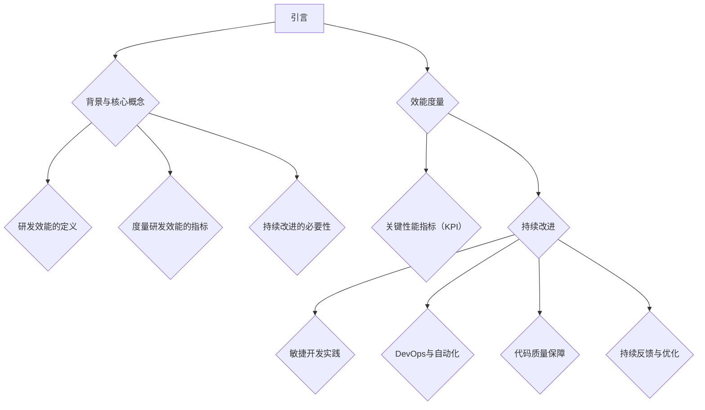
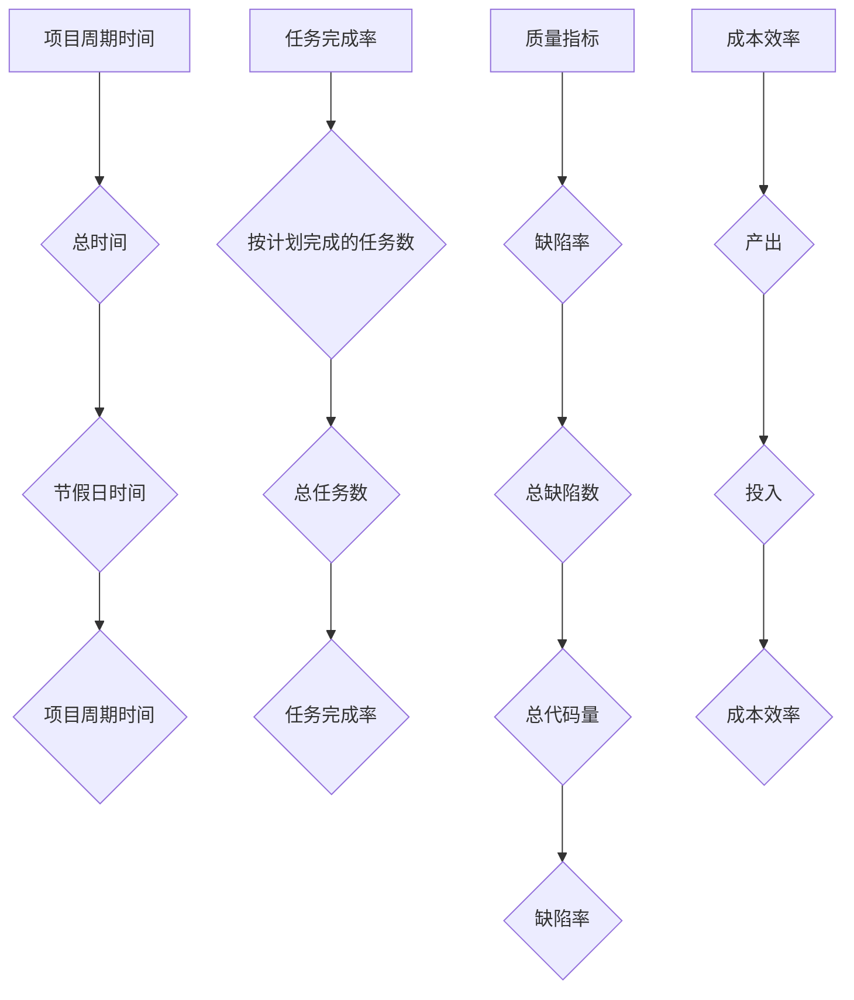
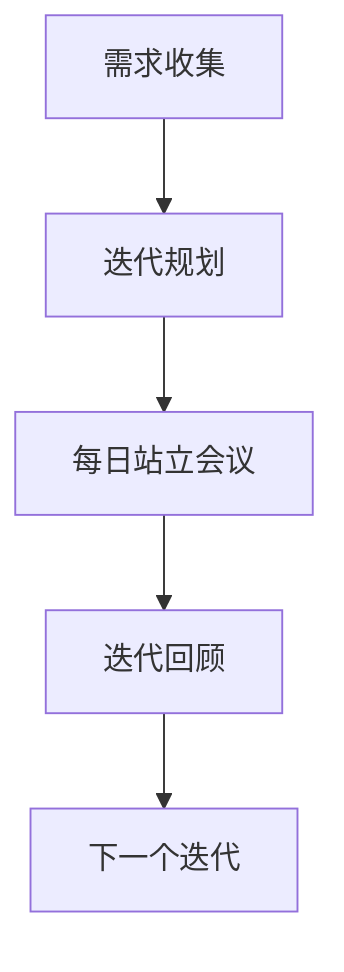

                 

### 文章标题

# 研发效能度量与持续改进

> 关键词：研发效能、度量指标、敏捷开发、持续改进、DevOps、代码质量保障

> 摘要：本文深入探讨了研发效能的度量与持续改进的方法。首先，我们介绍了研发效能的定义和关键指标，包括项目周期时间、任务完成率、质量指标和成本效率。接着，我们探讨了持续改进的方法，包括敏捷开发实践、DevOps与自动化、代码质量保障以及持续反馈与优化。最后，通过实际案例展示了这些方法在效能提升中的具体应用。

## 第一部分：引言

在当今快速发展的技术时代，研发效能已成为企业竞争力的关键因素。一个高效的研发团队不仅能够更快地交付高质量的产品，还能持续优化流程，降低成本，提高客户满意度。然而，如何准确度量研发效能，并在此基础上进行持续改进，是许多企业和团队面临的挑战。

### 第1章：背景与核心概念

#### 1.1 研发效能的定义

研发效能（Development Efficiency）是指研发团队在一定的资源投入下，能够快速、高质量地完成项目的能力。它不仅涉及到时间成本，还包括质量、成本和团队协作等多个方面。

#### 1.2 度量研发效能的指标

为了有效度量研发效能，我们需要关注以下几个关键指标：

- **项目周期时间**：从项目启动到完成所需要的时间。
- **任务完成率**：任务按计划完成的百分比。
- **质量指标**：包括缺陷率、测试覆盖率等。
- **成本效率**：产出与投入的比值。

#### 1.3 持续改进的必要性

持续改进是一种不断追求卓越的过程。通过定期评估效能指标，发现并解决瓶颈，研发团队能够持续提升效能，保持竞争优势。

### 整体架构图

为了更好地理解本文内容，我们可以用一个Mermaid流程图来展示各个部分的关系：

通过以上架构，我们明确了本文的结构和核心内容。接下来，我们将逐步深入探讨每一个部分。

### 第2章：效能度量

效能度量是提升研发效能的第一步。只有通过准确的数据分析，我们才能了解团队的实际表现，并找到改进的方向。

#### 2.1 项目周期时间

项目周期时间是衡量研发效能的重要指标之一。它反映了团队完成项目的能力。项目周期时间可以通过以下公式计算：

\[ \text{项目周期时间} = \text{总时间} - \text{节假日时间} \]

#### 2.2 任务完成率

任务完成率是任务按计划完成的百分比。它可以用来衡量团队的执行力。任务完成率可以通过以下公式计算：

\[ \text{任务完成率} = \left( \frac{\text{按计划完成的任务数}}{\text{总任务数}} \right) \times 100\% \]

#### 2.3 质量指标

质量指标包括缺陷率、测试覆盖率等。缺陷率是项目中发现缺陷的数量与总代码量的比值。测试覆盖率是测试用例覆盖代码的百分比。这些指标可以反映项目的质量水平。

#### 2.4 成本效率

成本效率是产出与投入的比值。通过分析成本效率，我们可以了解项目的经济效益。成本效率可以通过以下公式计算：

\[ \text{成本效率} = \frac{\text{产出}}{\text{投入}} \]

### 效能度量公式与计算方法

为了更清晰地展示上述公式，我们可以使用Mermaid流程图：

通过上述公式和计算方法，我们可以准确地度量研发效能，为持续改进提供数据支持。

### 第3章：持续改进

持续改进是一个循环迭代的过程，它要求团队不断评估、反馈和优化。以下方法可以帮助团队实现持续改进。

#### 3.1 敏捷开发实践

敏捷开发是一种迭代、增量的软件开发方法。它强调快速响应变化、持续交付价值。敏捷开发的核心原则包括：

- **个体和互动胜过过程和工具**
- **可工作的软件胜过详尽的文档**
- **客户合作胜过合同谈判**
- **响应变化胜过遵循计划**

敏捷流程通常包括以下步骤：

1. **需求收集**：与客户沟通，了解需求。
2. **迭代规划**：确定本次迭代的目标和任务。
3. **每日站立会议**：检查进度，解决瓶颈。
4. **迭代回顾**：总结经验，改进流程。

#### 3.2 DevOps与自动化

DevOps是一种结合开发（Development）和运维（Operations）的方法，它强调自动化和持续集成、持续交付。通过DevOps，团队能够更快地交付高质量的产品。

- **CI/CD实践**：持续集成和持续交付是DevOps的核心。持续集成确保代码质量，持续交付实现快速部署。
- **自动化测试**：自动化测试可以节省时间，提高测试效率。常见的自动化测试工具包括Selenium、JUnit等。

#### 3.3 敏捷团队构建

一个高效的敏捷团队应该具备以下特点：

- **多元化**：团队成员来自不同背景，能够互补。
- **自主性**：团队成员有权自主决策，并承担责任。
- **协作性**：团队成员之间紧密合作，共同解决问题。

#### 敏捷开发实践流程图

为了更好地理解敏捷开发实践，我们可以使用Mermaid流程图：

通过敏捷开发实践，团队能够持续优化流程，提高研发效能。

### 第4章：敏捷开发实践

敏捷开发是一种以人为核心、迭代、增量的软件开发方法。它强调快速响应变化、持续交付价值，通过灵活的规划和高效的协作，帮助团队在不确定的环境中实现目标。

#### 4.1 敏捷原则

敏捷开发的核心原则包括：

- **个体和互动胜过过程和工具**：人是最重要的资源，良好的沟通和协作比固定的流程和工具更为重要。
- **可工作的软件胜过详尽的文档**：软件的质量和实用性是最重要的，详尽的文档虽然重要，但应服务于软件的实际需求。
- **客户合作胜过合同谈判**：与客户的紧密合作能够更好地理解需求，确保产品符合客户期望。
- **响应变化胜过遵循计划**：在软件开发过程中，需求往往发生变化。敏捷开发强调快速响应变化，确保团队能够及时调整方向。

#### 4.2 敏捷流程

敏捷开发的流程通常包括以下几个步骤：

1. **需求收集**：与客户、产品经理等利益相关者沟通，了解需求。
2. **迭代规划**：确定本次迭代的目标和任务，将需求分解为可实现的用户故事。
3. **每日站立会议**：团队成员每天早晨举行短暂会议，检查进度，解决瓶颈。
4. **迭代回顾**：在迭代结束时，团队总结经验，讨论改进点，并规划下一个迭代。

#### 4.3 敏捷团队构建

一个高效的敏捷团队应该具备以下特点：

- **多元化**：团队成员来自不同背景，能够互补。
- **自主性**：团队成员有权自主决策，并承担责任。
- **协作性**：团队成员之间紧密合作，共同解决问题。

#### 敏捷开发实践示例

以下是一个简单的敏捷开发实践示例：

1. **需求收集**：客户希望开发一款能够在线预订电影票的应用程序。
2. **迭代规划**：本次迭代的目标是完成用户注册和登录功能。
3. **每日站立会议**：团队每天检查进度，发现前端UI设计存在问题，立即进行讨论并调整。
4. **迭代回顾**：在迭代结束时，团队发现代码测试覆盖率较低，决定在下一个迭代加强测试。

通过以上实践，团队能够更好地应对需求变化，提高研发效能。

### 第5章：DevOps与自动化

DevOps是一种结合开发（Development）和运维（Operations）的方法，它强调自动化、协作和持续交付。通过DevOps，团队能够更快速地交付高质量的产品，提高研发效能。

#### 4.1 DevOps的概念

DevOps是一种文化、实践和工具的组合，旨在提高软件开发和运维的效率。DevOps的核心思想包括：

- **自动化**：通过自动化工具实现重复性任务，减少人为干预，提高效率。
- **协作**：促进开发、测试、运维团队之间的沟通和协作，减少误解和摩擦。
- **持续交付**：通过持续集成和持续交付，实现快速、可靠的产品发布。

#### 4.2 CI/CD实践

持续集成（Continuous Integration，CI）和持续交付（Continuous Deployment，CD）是DevOps的核心实践。

- **CI**：持续集成是将代码更改集成到主干分支的过程。每次提交代码时，自动化测试都会运行，确保代码质量。
- **CD**：持续交付是将产品交付给用户的过程。通过自动化部署和测试，确保产品在交付时的质量。

#### 4.3 自动化测试

自动化测试是DevOps的重要组成部分。通过自动化测试，团队能够快速发现并解决问题，提高产品质量。

- **单元测试**：测试单个模块的功能。
- **集成测试**：测试模块之间的交互。
- **功能测试**：测试产品的整体功能。

常见自动化测试工具包括Selenium、JUnit、TestNG等。

#### DevOps与自动化示例

以下是一个简单的DevOps与自动化示例：

1. **自动化部署**：通过脚本自动化部署应用程序，实现快速、可靠的发布。
2. **自动化测试**：在CI过程中运行自动化测试，确保每次提交的代码质量。
3. **自动化监控**：通过监控工具实时监控系统性能，及时发现并解决问题。

通过以上实践，团队能够实现高效的软件开发和运维，提高研发效能。

### 第6章：代码质量保障

代码质量是研发效能的关键因素之一。保障代码质量不仅可以提高产品的稳定性，还能减少后续维护成本。以下方法可以帮助团队保障代码质量。

#### 5.1 代码审查

代码审查是一种通过人工检查代码质量和规范的方法。它可以帮助团队发现潜在的问题，确保代码的规范性和一致性。

- **代码风格指南**：制定统一的代码风格指南，确保代码的可读性和可维护性。
- **静态代码分析**：使用工具对代码进行分析，检测潜在的语法错误、编码问题和性能瓶颈。

常见代码审查工具包括GitLab、SonarQube等。

#### 5.2 代码风格指南

代码风格指南是编写规范代码的基础。它包括命名规范、代码布局、注释规范等。

- **命名规范**：使用有意义的变量名和函数名，避免缩写和拼音混合。
- **代码布局**：保持代码的整洁和模块化，避免过长或过短的代码行。
- **注释规范**：添加必要的注释，解释复杂逻辑和关键代码。

#### 5.3 静态代码分析

静态代码分析是一种不运行代码，通过分析代码结构和语义，发现潜在问题的方法。

- **语法检查**：检测语法错误和格式问题。
- **编码规范检查**：检测不符合代码风格指南的问题。
- **性能分析**：检测代码性能瓶颈。

常见静态代码分析工具包括SonarQube、FindBugs等。

通过以上方法，团队可以保障代码质量，提高研发效能。

### 第7章：持续反馈与优化

持续反馈与优化是提升研发效能的关键环节。通过及时收集和分析反馈，团队能够发现问题，优化流程，不断提高效能。

#### 6.1 反馈机制

建立有效的反馈机制是持续反馈与优化的基础。以下方法可以帮助团队建立反馈机制：

- **定期会议**：定期召开团队会议，讨论进度和问题，收集成员的反馈。
- **问卷调查**：通过问卷调查，收集团队成员和用户的意见和建议。
- **在线反馈平台**：建立在线反馈平台，方便成员和用户随时提交反馈。

#### 6.2 数据分析

数据分析是反馈机制的重要组成部分。通过收集和分析数据，团队能够发现问题的根源，制定针对性的优化方案。

- **效能指标分析**：对项目周期时间、任务完成率、质量指标和成本效率等关键指标进行分析，找出瓶颈。
- **用户行为分析**：通过用户行为数据，分析用户需求和使用习惯，优化产品功能和体验。

#### 6.3 改进策略

根据数据分析结果，团队可以制定相应的改进策略：

- **流程优化**：优化研发流程，减少不必要的环节，提高效率。
- **技术升级**：引入新技术和工具，提升团队的技术能力。
- **团队培训**：加强团队培训，提高成员的专业技能和协作能力。

通过以上方法，团队能够持续反馈与优化，不断提高研发效能。

### 第7章：效能度量与改进案例分析

为了更好地理解研发效能度量与持续改进的实际应用，我们通过以下几个案例进行详细分析。

#### 7.1 案例一：企业级效能提升

某大型企业在进行研发效能提升时，首先对现有流程进行了全面评估。通过分析项目周期时间、任务完成率和质量指标，发现以下几个问题：

1. **项目周期时间较长**：由于流程繁琐，项目周期时间较长，导致客户满意度下降。
2. **任务完成率较低**：部分任务因沟通不畅、资源不足等原因未能按时完成。
3. **质量指标不理想**：代码质量较差，缺陷率较高。

针对这些问题，企业采取了以下措施：

1. **流程优化**：简化流程，减少不必要的审批环节，提高工作效率。
2. **敏捷转型**：引入敏捷开发方法，采用迭代式开发，提高团队协作效率。
3. **代码质量保障**：加强代码审查和静态代码分析，提高代码质量。

经过一年的持续改进，企业的研发效能显著提升，项目周期时间缩短了30%，任务完成率提高了15%，质量指标也得到了明显改善。

#### 7.2 案例二：敏捷转型实践

某初创公司在成立初期，采用传统的瀑布式开发方法，导致项目进度延误，产品交付时间过长。为了提高研发效能，公司决定进行敏捷转型。

1. **需求收集**：与客户密切沟通，快速收集需求。
2. **迭代规划**：确定每次迭代的目标和任务，将需求分解为用户故事。
3. **每日站立会议**：团队成员每天检查进度，解决问题。
4. **迭代回顾**：总结经验，持续优化流程。

通过敏捷转型，公司的项目进度得到了显著改善，项目周期时间缩短了50%，任务完成率提高了20%，客户满意度显著提升。

#### 7.3 案例三：DevOps落地

某互联网公司决定引入DevOps方法，提高研发效能。公司采取了以下措施：

1. **CI/CD实践**：建立持续集成和持续交付流程，实现快速、可靠的产品发布。
2. **自动化测试**：引入自动化测试工具，提高测试效率。
3. **自动化部署**：通过自动化部署脚本，实现快速、可靠的部署。

通过DevOps落地，公司的研发效能得到了显著提升，项目周期时间缩短了40%，测试覆盖率提高了30%，客户满意度显著提升。

### 附录A：常用度量工具介绍

为了方便读者选择和使用效能度量工具，以下列出了一些常用的度量工具：

1. **Jenkins**：一款开源的持续集成工具，支持多种插件，可以实现自动化构建、测试和部署。
2. **GitLab CI/CD**：GitLab内置的持续集成和持续交付工具，支持多种编程语言和平台。
3. **SonarQube**：一款开源的静态代码分析工具，可以检测代码中的潜在问题，包括语法错误、编码规范和性能瓶颈。
4. **Selenium**：一款开源的自动化测试工具，支持多种浏览器，可以实现Web应用的自动化测试。

### 附录B：效能度量公式与计算方法

为了方便读者理解和应用效能度量公式，以下列出了一些常见的计算方法：

1. **项目周期时间计算**：项目周期时间（T）= 总时间（T_total）- 节假日时间（T_holiday）。
2. **任务完成率计算**：任务完成率（R）=（按计划完成的任务数（T_done）/ 总任务数（T_total））× 100%。
3. **缺陷率计算**：缺陷率（D）=（总缺陷数（D_total）/ 总代码量（C_total））× 100%。
4. **成本效率计算**：成本效率（E）= 产出（O）/ 投入（I）。

### 总结

通过本文的探讨，我们明确了研发效能的度量与持续改进的重要性。通过分析项目周期时间、任务完成率、质量指标和成本效率等关键指标，团队可以准确评估研发效能。同时，通过敏捷开发实践、DevOps与自动化、代码质量保障和持续反馈与优化等方法，团队能够持续提升效能，实现持续改进。

作者：AI天才研究院/AI Genius Institute & 禅与计算机程序设计艺术 /Zen And The Art of Computer Programming

通过以上内容，我们不仅对研发效能的度量与持续改进有了深入理解，还掌握了一些实用的方法和工具。希望本文能对您的研发工作有所帮助。在未来的日子里，我们将继续探索更多技术领域的奥秘，期待与您共同成长。如果您有任何问题或建议，欢迎在评论区留言，我们将在第一时间回复。祝您编程愉快！

