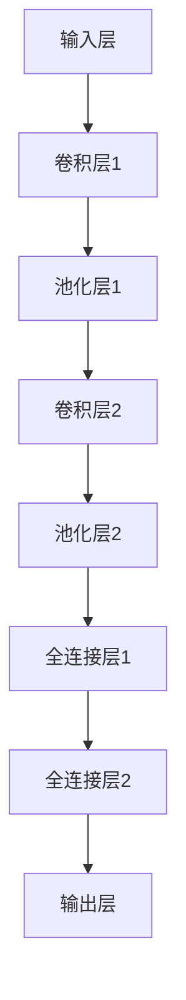
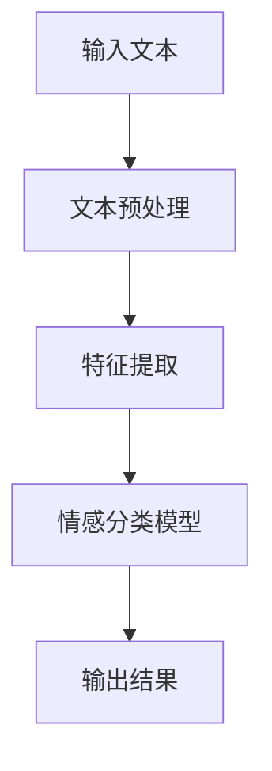
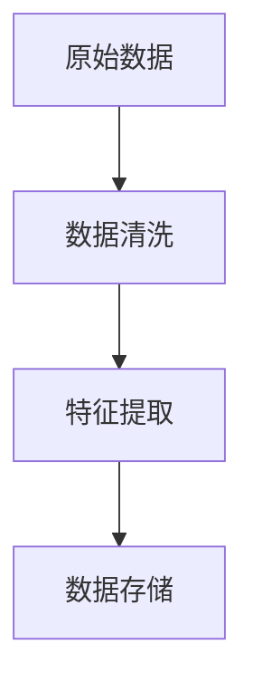
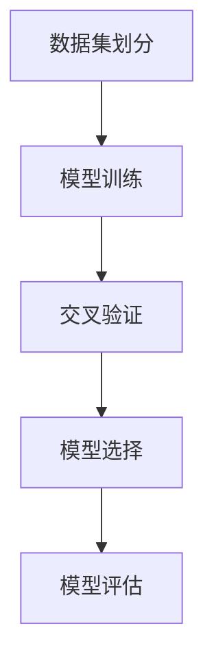
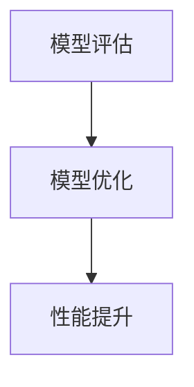
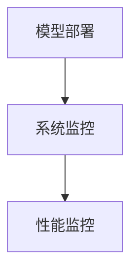
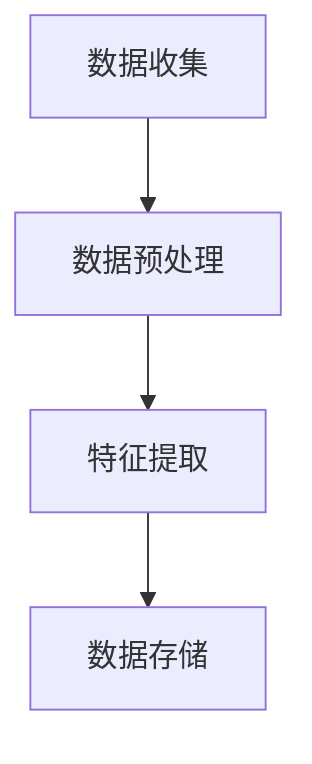
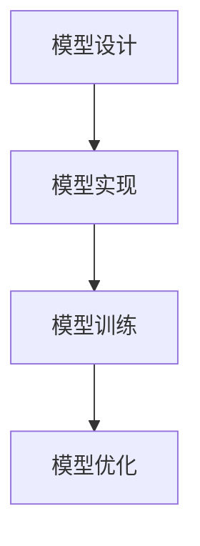

                 

# 文章标题：社交媒体算法：信息传播与社会影响

> 关键词：社交媒体算法、信息传播、社会影响、推荐算法、图像识别算法、情感分析

> 摘要：本文从社交媒体算法的背景和定义出发，探讨了信息传播的原理和社交媒体算法对社会的影响。通过详细讲解推荐算法、图像识别算法和情感分析等核心算法原理，以及数学模型和公式的应用，本文进一步展示了实际项目中的算法应用和实战技巧。最后，本文提出了最佳实践和注意事项，为读者提供了深入理解和运用社交媒体算法的指导。

----------------------------------------------------------------

## 第一部分：社交媒体算法概述

### 第1章：社交媒体算法概述

#### 1.1 社交媒体算法的定义与重要性

社交媒体算法是社交媒体平台使用的一系列自动化程序，用于推荐内容、控制信息流和过滤不实信息。这些算法的核心目标是通过分析用户行为和兴趣，提供个性化的内容推荐，从而提高用户体验和用户黏性。

在当今信息爆炸的时代，社交媒体算法的重要性日益凸显。首先，它可以帮助用户在海量信息中快速找到感兴趣的内容，节省时间和精力。其次，它能够有效过滤垃圾信息和虚假信息，保护用户免受信息污染。此外，社交媒体算法还可以帮助企业精准定位目标用户，提高广告投放效果和转化率。

#### 1.2 社交媒体算法的核心功能

社交媒体算法主要具备以下核心功能：

1. **内容推荐**：根据用户的兴趣和偏好，推荐用户可能感兴趣的内容。
2. **信息流控制**：通过算法过滤，确保用户在信息流中看到的是高质量、有价值的信息。
3. **反作弊和反欺诈**：识别并处理恶意行为，如刷赞、刷评论等，保障社交媒体平台的健康发展。
4. **个性化广告**：根据用户兴趣和行为，推送个性化的广告，提高广告效果和用户转化率。

#### 1.3 社交媒体算法的类型与特点

社交媒体算法种类繁多，主要包括以下几种类型：

1. **推荐算法**：基于协同过滤、内容推荐和基于模型的推荐算法，用于为用户推荐感兴趣的内容。
2. **图像识别算法**：用于识别和分类社交媒体平台上的图像，如人脸识别、物体识别等。
3. **情感分析算法**：通过分析文本内容，识别用户的情感倾向和态度，如正面、负面、中立等。
4. **社交网络分析算法**：用于分析社交网络中的关系结构、传播路径和影响力等。

每种算法都有其独特的特点和适用场景，在实际应用中，通常需要结合多种算法，以达到最佳效果。

### 第2章：信息传播原理

#### 2.1 信息传播的模型与机制

信息传播是指信息在个体之间传递和扩散的过程。在社交媒体平台上，信息传播通常通过以下机制实现：

1. **用户互动**：用户之间的互动，如点赞、评论、分享等，是信息传播的主要途径。
2. **社交网络**：社交网络为信息传播提供了路径和渠道，影响信息传播的速度和范围。
3. **算法推荐**：社交媒体算法通过个性化推荐，将信息推送给潜在的兴趣用户，促进信息传播。

常见的信息传播模型包括线性传播模型、扩散模型、谣言传播模型等，每种模型都有其独特的传播机制和特点。

#### 2.2 社交媒体上的信息传播特性

社交媒体平台上的信息传播具有以下特性：

1. **快速传播**：信息可以在短时间内迅速传播到大量用户。
2. **广泛扩散**：信息不仅会在社交网络内部扩散，还会通过互联网传播到其他平台和受众。
3. **多样性**：信息传播过程中，用户会根据个人兴趣和需求对信息进行筛选和再传播，导致信息呈现多样化。
4. **信息过滤**：社交媒体算法会对信息进行过滤，确保用户在信息流中看到的是高质量、有价值的信息。

#### 2.3 信息传播对社会的潜在影响

信息传播对社会的影响深远而广泛，主要包括以下几个方面：

1. **信息污染**：大量虚假、不准确的信息可能误导公众，导致信息污染。
2. **观点极化**：社交媒体平台上的信息传播可能加剧观点极化，导致社会分裂。
3. **舆论引导**：信息传播可以对舆论产生重要影响，引导公众关注和讨论特定话题。
4. **社会动员**：信息传播可以激发社会公众参与特定活动，如抗议、示威等。

### 第3章：社会影响的概念与度量

#### 3.1 社会影响的定义与分类

社会影响是指社交媒体算法对用户行为、观点和情感产生的长期影响。根据影响程度和性质，社会影响可分为以下几类：

1. **正面影响**：社交媒体算法能够提高用户满意度、增强用户黏性、促进社会互动等。
2. **负面影响**：社交媒体算法可能引发信息污染、观点极化、隐私泄露等问题。
3. **中立影响**：社交媒体算法对某些方面的影响较小，不具有明显的正面或负面影响。

#### 3.2 社会影响的评估方法

评估社会影响的方法主要包括以下几种：

1. **用户调查**：通过问卷调查等方式，了解用户对社交媒体算法的满意度、使用频率和影响程度。
2. **数据分析**：通过分析用户行为数据，如点赞、评论、分享等，评估社交媒体算法对用户行为的影响。
3. **实验研究**：设计实验，观察社交媒体算法对不同用户群体的影响，以验证其有效性。

#### 3.3 社会影响的实际案例研究

以下是一些实际案例，展示了社交媒体算法对社会影响的评估和应对措施：

1. **案例一：抖音算法**：抖音算法通过个性化推荐，提高了用户满意度，但也引发了信息污染和观点极化的问题。为解决这些问题，抖音采取了多种措施，如优化推荐算法、加强内容审核等。
2. **案例二：Facebook算法**：Facebook算法在提升用户黏性和广告效果方面取得显著成果，但也引发了用户隐私泄露、信息过滤等负面影响。为应对这些问题，Facebook加强了数据保护和隐私政策。

## 第二部分：核心算法原理

### 第4章：推荐算法

#### 4.1 推荐算法的基本概念

推荐算法是一种基于用户历史行为、兴趣和偏好，为用户推荐感兴趣的内容的算法。推荐算法主要分为以下几类：

1. **基于内容的推荐**：根据用户过去喜欢的物品和它们的特征，推荐具有相似特征的物品。
2. **协同过滤推荐**：基于用户之间的相似性，为用户推荐其他用户喜欢的物品。
3. **基于模型的推荐**：使用机器学习模型，预测用户对物品的兴趣，从而进行推荐。

#### 4.2 协同过滤算法

协同过滤算法是一种基于用户行为的推荐算法，通过分析用户之间的相似性，为用户推荐感兴趣的物品。协同过滤算法主要分为以下两种：

1. **基于用户的协同过滤**：为用户推荐与目标用户相似的其他用户喜欢的物品。
2. **基于物品的协同过滤**：为用户推荐与目标用户过去喜欢的物品相似的物品。

以下是一个基于用户的协同过滤算法的伪代码示例：

```python
def user_based_collaborative_filtering(user, items, similarity_matrix):
    # 计算用户与其他用户的相似度
    user_similarity_scores = calculate_similarity(user, items, similarity_matrix)

    # 筛选出与用户最相似的K个用户
    top_k_users = get_top_k_users(user_similarity_scores, K)

    # 计算目标用户对这些用户的兴趣度
    user_interest_scores = calculate_user_interest(user, top_k_users)

    # 推荐相似用户喜欢的物品
    recommendations = recommend_items(user_interest_scores, items)

    return recommendations
```

#### 4.3 内容推荐算法

内容推荐算法是一种基于物品特征的推荐算法，通过分析物品之间的相似性，为用户推荐感兴趣的物品。以下是一个基于内容推荐算法的伪代码示例：

```python
def content_based_recommender(user, items, item_features):
    # 计算用户与物品的特征相似度
    item_similarity_scores = calculate_similarity(user, items, item_features)

    # 筛选出与用户最相似的K个物品
    top_k_items = get_top_k_items(item_similarity_scores, K)

    # 推荐相似物品
    recommendations = recommend_items(top_k_items)

    return recommendations
```

#### 4.4 推荐算法的优化与挑战

推荐算法在实际应用中面临诸多挑战，如数据稀疏性、冷启动问题、推荐多样性等。为解决这些问题，可以采取以下优化方法：

1. **数据预处理**：通过数据清洗、去重、补全等手段，提高数据质量。
2. **算法融合**：将多种推荐算法结合使用，提高推荐效果。
3. **用户行为分析**：深入了解用户行为，为用户提供个性化推荐。
4. **推荐多样性**：通过引入随机性、多样性约束等方法，提高推荐多样性。

### 第5章：图像识别算法

#### 5.1 图像识别的基本原理

图像识别是一种通过计算机对图像进行分析和处理，识别和分类图像内容的技术。图像识别的基本原理包括以下几个方面：

1. **特征提取**：从图像中提取出具有代表性的特征，如颜色、纹理、形状等。
2. **特征匹配**：将提取的特征与已知的特征模板进行匹配，判断图像内容是否与模板匹配。
3. **分类与识别**：根据匹配结果，对图像进行分类和识别。

#### 5.2 卷积神经网络（CNN）

卷积神经网络（CNN）是一种专门用于图像识别和处理的深度学习模型，具有以下优点：

1. **自动特征提取**：CNN可以通过多层卷积和池化操作，自动提取图像的复杂特征。
2. **并行计算**：CNN可以并行计算，提高处理速度。
3. **自适应学习**：CNN可以根据图像内容自适应地调整模型参数，提高识别准确性。

以下是一个简单的CNN模型结构：



#### 5.3 图像识别算法的应用

图像识别算法在社交媒体平台中具有广泛的应用，如：

1. **人脸识别**：用于用户身份验证、视频监控等场景。
2. **物体识别**：用于图像分类、目标检测等任务。
3. **内容审核**：用于识别和过滤不良图像内容。

### 第6章：社交媒体情感分析

#### 6.1 情感分析的定义与分类

情感分析是一种通过自然语言处理技术，从文本中识别和分类情感倾向的方法。根据情感分类的粒度，情感分析可分为以下几类：

1. **二元情感分析**：将文本分为正面、负面、中性三类。
2. **多级情感分析**：将文本分为多个情感等级，如非常正面、较正面、中立、较负面、非常负面等。
3. **情感极性分析**：仅分析文本的积极或消极倾向，不考虑情感强度。

#### 6.2 文本情感分析算法

文本情感分析算法主要包括以下几种：

1. **基于规则的方法**：使用人工定义的规则，对文本进行情感分类。
2. **基于统计的方法**：使用机器学习算法，根据文本特征和已标注的情感标签进行情感分类。
3. **基于深度学习的方法**：使用神经网络模型，如卷积神经网络（CNN）和递归神经网络（RNN），对文本进行情感分类。

以下是一个简单的文本情感分析算法流程：



#### 6.3 社交媒体情感分析的应用

社交媒体情感分析在社交媒体平台中具有广泛的应用，如：

1. **用户情感监测**：实时监测用户在社交媒体上的情感状态，为用户提供个性化服务。
2. **舆论分析**：分析社交媒体上的舆论倾向，了解公众对特定事件或话题的态度。
3. **品牌声誉管理**：监控品牌在社交媒体上的声誉，及时发现和处理负面信息。

## 第三部分：项目实战

### 第7章：社交媒体推荐系统开发

#### 7.1 项目背景与目标

本项目旨在开发一个社交媒体推荐系统，通过分析用户行为和兴趣，为用户推荐感兴趣的内容。项目目标包括：

1. **提高用户满意度**：通过个性化推荐，提高用户对社交媒体平台的满意度。
2. **增强用户黏性**：通过持续推荐用户感兴趣的内容，提高用户在平台上的停留时间和互动率。
3. **优化广告投放效果**：通过个性化广告推荐，提高广告投放的转化率和收益。

#### 7.2 数据预处理与特征提取

1. **数据预处理**：清洗原始数据，去除缺失值、重复值和噪声数据，确保数据质量。
2. **特征提取**：从原始数据中提取出与用户兴趣相关的特征，如用户行为特征（点赞、评论、分享等）、内容特征（标题、标签、分类等）。

以下是一个简单的数据预处理和特征提取流程：



#### 7.3 模型选择与训练

1. **模型选择**：根据项目需求，选择适合的推荐算法，如基于内容的推荐、协同过滤推荐等。
2. **模型训练**：使用预处理后的数据，训练推荐模型，通过交叉验证和网格搜索等手段，选择最佳模型参数。

以下是一个简单的模型训练流程：



#### 7.4 模型评估与优化

1. **模型评估**：使用准确率、召回率、F1值等指标，评估推荐模型的性能。
2. **模型优化**：通过调整模型参数、特征选择、数据增强等方法，优化模型性能。

以下是一个简单的模型评估和优化流程：



#### 7.5 系统部署与监控

1. **系统部署**：将训练好的模型部署到生产环境中，提供实时推荐服务。
2. **系统监控**：实时监控系统性能，如响应时间、错误率等，确保系统稳定运行。

以下是一个简单的系统部署和监控流程：



### 第8章：社交媒体情感分析项目

#### 8.1 项目目标与需求

本项目旨在开发一个社交媒体情感分析系统，通过分析用户在社交媒体上的文本内容，识别用户的情感倾向和态度。项目目标包括：

1. **实时情感监测**：实时分析用户在社交媒体上的情感状态，为用户提供个性化服务。
2. **舆论分析**：分析社交媒体上的舆论倾向，了解公众对特定事件或话题的态度。
3. **品牌声誉管理**：监控品牌在社交媒体上的声誉，及时发现和处理负面信息。

#### 8.2 数据收集与处理

1. **数据收集**：从社交媒体平台上收集用户发布的文本内容，如微博、微信、论坛等。
2. **数据预处理**：清洗原始数据，去除缺失值、重复值和噪声数据，确保数据质量。
3. **特征提取**：从原始数据中提取出与情感相关的特征，如词频、词向量、情感词典等。

以下是一个简单的数据收集和处理流程：



#### 8.3 模型设计与实现

1. **模型设计**：根据项目需求，选择适合的情感分析模型，如基于规则的模型、基于统计的模型、基于深度学习的模型等。
2. **模型实现**：使用Python、Java等编程语言，实现情感分析模型，并进行训练和优化。

以下是一个简单的模型设计与实现流程：



#### 8.4 模型评估与改

1. **模型评估**：使用准确率、召回率、F1值等指标，评估情感分析模型的性能。
2. **模型优化**：通过调整模型参数、特征选择、数据增强等方法，优化模型性能。

以下是一个简单的模型评估和优化流程：


#### 8.5 系统部署与监控

1. **系统部署**：将训练好的模型部署到生产环境中，提供实时情感分析服务。
2. **系统监控**：实时监控系统性能，如响应时间、错误率等，确保系统稳定运行。

以下是一个简单的系统部署和监控流程：


## 总结与展望

通过本文的探讨，我们了解了社交媒体算法、信息传播和社会影响等核心概念，掌握了推荐算法、图像识别算法和情感分析等核心算法原理，并通过实际项目展示了算法的应用和实战技巧。在未来的发展中，随着人工智能技术的不断进步，社交媒体算法将更加智能化、个性化，为用户提供更加优质的服务。同时，我们还需要关注社交媒体算法对社会带来的潜在影响，确保其在促进信息传播的同时，不会损害社会公共利益。

### 最佳实践 tips

1. **数据质量是基础**：在推荐系统和情感分析项目中，确保数据质量是关键。清洗数据、去除噪声和缺失值，提高数据质量，是提高算法性能的重要保障。

2. **特征工程至关重要**：合理提取和选择特征，是算法性能优化的重要手段。根据项目需求，提取与任务相关的特征，并进行特征选择和降维，可以提高算法的泛化能力和效率。

3. **模型优化与调参**：针对不同任务和数据集，选择合适的模型结构和参数设置。通过交叉验证、网格搜索等方法，优化模型性能，提高推荐效果和情感分析准确性。

4. **实时更新与迭代**：随着用户行为和兴趣的变化，及时更新和迭代算法模型，确保推荐和情感分析结果的实时性和准确性。

### 小结

本文从社交媒体算法、信息传播和社会影响等多个角度，探讨了社交媒体算法的核心概念、算法原理和应用实战。通过详细讲解推荐算法、图像识别算法和情感分析等核心算法原理，以及数学模型和公式的应用，本文为读者提供了深入理解和运用社交媒体算法的指导。在未来的发展中，随着人工智能技术的不断进步，社交媒体算法将发挥越来越重要的作用，为用户提供更加优质的服务。

### 注意事项

1. **隐私保护**：在处理用户数据和算法应用时，务必注意隐私保护，遵循相关法律法规和道德规范。

2. **公平与公正**：在设计算法时，确保算法的公平性和公正性，避免对特定群体产生歧视或偏见。

3. **可持续发展**：在社交媒体算法应用中，关注可持续发展，避免过度推荐和算法偏见，促进社会的和谐与进步。

### 拓展阅读

1. **推荐系统论文**：推荐系统领域经典论文，如“Collaborative Filtering for the 21st Century”、“Matrix Factorization Techniques for recommender systems”等。
2. **情感分析论文**：情感分析领域经典论文，如“Sentiment Analysis Using Machine Learning Techniques”、“Emotion Recognition Using Neural Networks”等。
3. **深度学习书籍**：深度学习领域经典书籍，如《深度学习》、《神经网络与深度学习》等。

## 作者信息

作者：AI天才研究院/AI Genius Institute & 禅与计算机程序设计艺术 /Zen And The Art of Computer Programming

